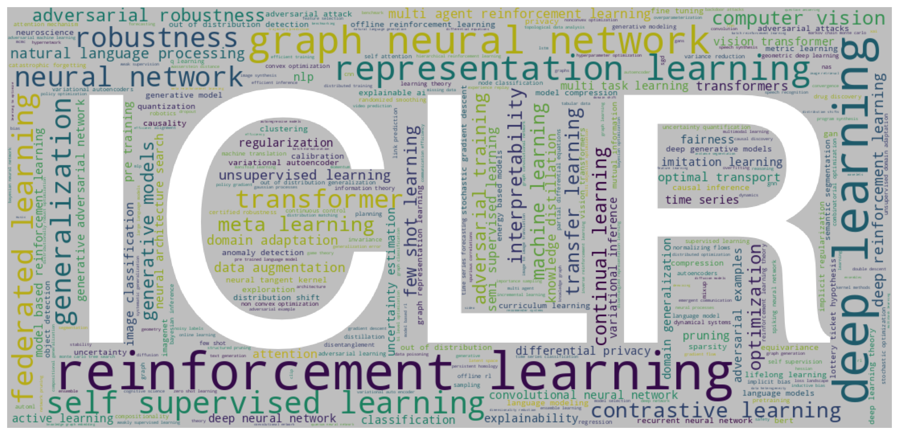
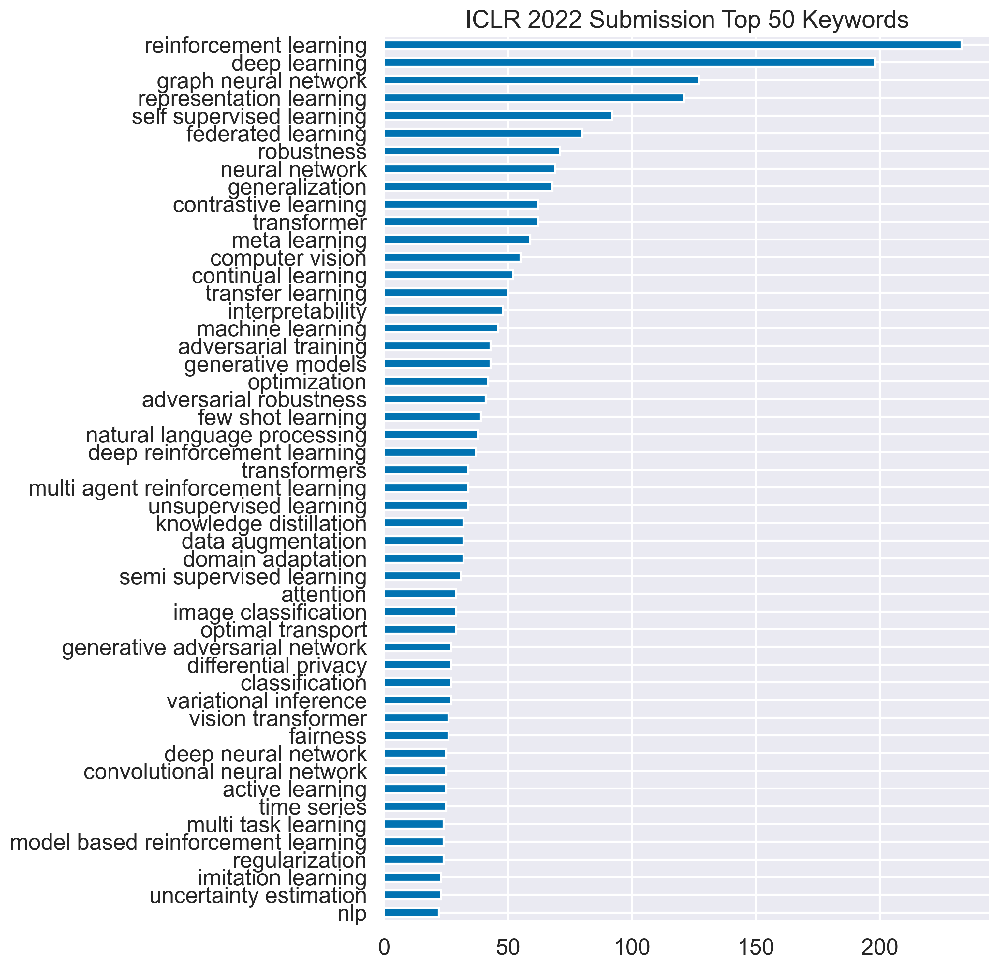

# Crawl and Visualize ICLR 2021 OpenReview Data

    

## Descriptions

This Jupyter Notebook contains the data crawled from ICLR 2021 OpenReview webpages and their visualizations. The list of submissions (sorted by the average ratings) can be found here.

## Prerequisites
* python 3.7
* selenium
* pandas
* seaborn
* imageio
* wordcloud
* tqdm
* [`edgewebdriver`](https://developer.microsoft.com/en-us/microsoft-edge/tools/webdriver/)
  * NOTE: You can also use `chromedriver` by setting `driver = webdriver.Chrome('chromedriver.exe')`.

## Crawl Data
1. Run `crawl_paperlist.py` to crawl the list of papers (~0.5h).
2. Run `crawl_reviews.py` to crawl the reviews (~1.5h).
   * NOTE: currently only review ratings are crawled.

## Visualization

**Keywords Frequency**

The top 50 common keywords (uncased) and their frequency:

    

**Keywords Cloud**

The word clouds formed by keywords of submissions show the hot topics including *deep learning*, *reinforcement learning*, *representation learning*, *graph neural network*, etc.

    

**Ratings Distribution**

The distribution of reviewer ratings centers around 5 (mean: 5.169).

    

**Keywords vs Ratings**

The average reviewer ratings and the frequency of keywords indicate that to maximize your chance to get higher ratings would be using the keywords such as *deep generative models*, or *normalizing flows*.

    

**All ICLR 2021 Submissions**

Number of submissions: 2966 (Collected at 11/11/2020 09:11 AM UTC+8).

|Rank |AvgRating | Title  | Ratings | Decision|
|------:|-----:|:-----|:-----|:-----|
|1 |  8.75 | [How Neural Networks Extrapolate: From Feedforward to Graph Neural Networks](https://openreview.net/forum?id=UH-cmocLJC) | 9, 9, 9, 8 ||
|2 |  8.25 | [Learning Flexible Visual Representations via Interactive Gameplay](https://openreview.net/forum?id=UuchYL8wSZo)| 9, 8, 8, 8 ||
|3 |  8 | [Complex Query Answering with Neural Link Predictors](https://openreview.net/forum?id=Mos9F9kDwkz)  | 9, 6, 8, 9 ||
|4 |  8 | [Parameterization of Hypercomplex Multiplications](https://openreview.net/forum?id=rcQdycl0zyk)  | 8, 8, 8 ||
|5 |  8 | [What Matters for On-Policy Deep Actor-Critic Methods? A Large-Scale Study](https://openreview.net/forum?id=nIAxjsniDzg) | 7, 9, 9, 7 ||
|6 |  8 | [Scalable Learning and MAP Inference for Nonsymmetric Determinantal Point Processes](https://openreview.net/forum?id=HajQFbx_yB)  | 9, 7, 8 ||
|7 |  8 | [Augmenting Physical Models with Deep Networks for Complex Dynamics Forecasting](https://openreview.net/forum?id=kmG8vRXTFv)| 9, 7, 8 ||
|8 |  8 | [Deformable DETR: Deformable Transformers for End-to-End Object Detection](https://openreview.net/forum?id=gZ9hCDWe6ke)  | 9, 8, 8, 7 ||
|9 |  8 | [Deep symbolic regression: Recovering mathematical expressions from data via risk-seeking policy gradients](https://openreview.net/forum?id=m5Qsh0kBQG)| 8, 7, 8, 9 ||
|  10 |  8 | [Learning a Latent Simplex in Input Sparsity Time](https://openreview.net/forum?id=04LZCAxMSco)  | 7, 9, 8 ||
|  11 |  8 | [Score-Based Generative Modeling through Stochastic Differential Equations](https://openreview.net/forum?id=PxTIG12RRHS) | 8, 9, 7, 8 ||
|  12 |  8 | [Theoretical Analysis of Self-Training with Deep Networks on Unlabeled Data](https://openreview.net/forum?id=rC8sJ4i6kaH)| 9, 7, 9, 7 ||
|  13 |  7.75 | [Autoregressive Entity Retrieval](https://openreview.net/forum?id=5k8F6UU39V)  | 7, 8, 8, 8 ||
|  14 |  7.75 | [Learning Cross-Domain Correspondence for Control with Dynamics Cycle-Consistency](https://openreview.net/forum?id=QIRlze3I6hX)| 6, 8, 7, 10||
|  15 |  7.75 | [Share or Not? Learning to Schedule Language-Specific Capacity for Multilingual Translation](https://openreview.net/forum?id=Wj4ODo0uyCF)  | 7, 9, 7, 8 ||
|  16 |  7.75 | [Learning Mesh-Based Simulation with Graph Networks](https://openreview.net/forum?id=roNqYL0_XP) | 9, 6, 6, 10||
|  17 |  7.67 | [Predicting Infectiousness for Proactive Contact Tracing](https://openreview.net/forum?id=lVgB2FUbzuQ) | 9, 7, 7 ||
|  18 |  7.67 | [Geometry-aware Instance-reweighted Adversarial Training](https://openreview.net/forum?id=iAX0l6Cz8ub) | 7, 8, 8 ||
|  19 |  7.67 | [Extreme Memorization via Scale of Initialization](https://openreview.net/forum?id=Z4R1vxLbRLO)  | 7, 7, 9 ||
|  20 |  7.67 | [Invariant Representations for Reinforcement Learning without Reconstruction](https://openreview.net/forum?id=-2FCwDKRREu)  | 7, 7, 9 ||
|  21 |  7.67 | [Dataset Condensation with Gradient Matching](https://openreview.net/forum?id=mSAKhLYLSsl) | 7, 9, 7 ||
|  22 |  7.67 | [Neural Synthesis of Binaural Audio](https://openreview.net/forum?id=uAX8q61EVRu) | 7, 9, 7 ||
|  23 |  7.6  | [DiffWave: A Versatile Diffusion Model for Audio Synthesis](https://openreview.net/forum?id=a-xFK8Ymz5J)  | 7, 7, 9, 8, 7 ||
|  24 |  7.5  | [End-to-end Adversarial Text-to-Speech](https://openreview.net/forum?id=rsf1z-JSj87) | 7, 8, 7, 8 ||
|  25 |  7.5  | [Human-Level Performance in No-Press Diplomacy via Equilibrium Search](https://openreview.net/forum?id=0-uUGPbIjD) | 7, 8, 7, 8 ||
|  26 |  7.5  | [Rethinking Architecture Selection in Differentiable NAS](https://openreview.net/forum?id=PKubaeJkw3)  | 7, 10, 6, 7||
|  27 |  7.5  | [Very Deep VAEs Generalize Autoregressive Models and Can Outperform Them on Images](https://openreview.net/forum?id=RLRXCV6DbEJ)  | 7, 8, 8, 7 ||
|  28 |  7.5  | [Global Convergence of Three-layer Neural Networks in the Mean Field Regime](https://openreview.net/forum?id=KvyxFqZS_D) | 9, 7, 7, 7 ||
|  29 |  7.5  | [Rethinking the Role of Gradient-based Attribution Methods for Model Interpretability](https://openreview.net/forum?id=dYeAHXnpWJ4)  | 9, 9, 7, 5 ||
|  30 |  7.5  | [Parrot: Data-Driven Behavioral Priors for Reinforcement Learning](https://openreview.net/forum?id=Ysuv-WOFeKR) | 9, 6, 7, 8 ||
|  31 |  7.5  | [What are the Statistical Limits of Batch RL with Linear Function Approximation?](https://openreview.net/forum?id=30EvkP2aQLD) | 8, 7, 8, 7 ||
|  32 |  7.5  | [Towards Nonlinear Disentanglement in Natural Data with Temporal Sparse Coding](https://openreview.net/forum?id=EbIDjBynYJ8)| 6, 7, 8, 9 ||
|  33 |  7.5  | [Learning with feature dependent label noise: a progressive approach](https://openreview.net/forum?id=ZPa2SyGcbwh) | 7, 8, 7, 8 ||
|  34 |  7.5  | [Rethinking Attention with Performers](https://openreview.net/forum?id=Ua6zuk0WRH)| 7, 8, 8, 7 ||
|  35 |  7.5  | [Learning-based Support Estimation in Sublinear Time](https://openreview.net/forum?id=tilovEHA3YS)  | 7, 8, 8, 7 ||
|  36 |  7.5  | [Grounded Language Learning Fast and Slow](https://openreview.net/forum?id=wpSWuz_hyqA) | 8, 6, 8, 8 ||
|  37 |  7.5  | [Implicit Normalizing Flows](https://openreview.net/forum?id=8PS8m9oYtNy)| 8, 7, 7, 8 ||
|  38 |  7.5  | [Winning the L2RPN Challenge: Power Grid Management via Semi-Markov Afterstate Actor-Critic](https://openreview.net/forum?id=LmUJqB1Cz8)| 7, 7, 7, 9 ||
|  39 |  7.4  | [Optimal Rates for Averaged Stochastic Gradient Descent under Neural Tangent Kernel Regime](https://openreview.net/forum?id=PULSD5qI2N1)| 6, 8, 8, 8, 7 ||
|  40 |  7.33 | [Distributional Sliced-Wasserstein and Applications to Generative Modeling](https://openreview.net/forum?id=QYjO70ACDK)  | 9, 7, 6 ||
|  41 |  7.33 | [Rao-Blackwellizing the Straight-Through Gumbel-Softmax Gradient Estimator](https://openreview.net/forum?id=Mk6PZtgAgfq) | 7, 7, 8 ||
|  42 |  7.33 | [Do 2D GANs know 3D shape? Unsupervised 3D Shape Reconstruction from 2D Image GANs](https://openreview.net/forum?id=FGqiDsBUKL0)  | 8, 6, 8 ||
|  43 |  7.33 | [UPDeT: Universal Multi-agent RL via Policy Decoupling with Transformers](https://openreview.net/forum?id=v9c7hr9ADKx)| 6, 9, 7 ||
|  44 |  7.33 | [RMSprop can converge with proper hyper-parameter](https://openreview.net/forum?id=3UDSdyIcBDA)  | 8, 8, 6 ||
|  45 |  7.33 | [Evolving Reinforcement Learning Algorithms](https://openreview.net/forum?id=0XXpJ4OtjW)| 7, 6, 9 ||
|  46 |  7.33 | [When Do Curricula Work?](https://openreview.net/forum?id=tW4QEInpni) | 7, 8, 7 ||
|  47 |  7.33 | [Image GANs meet Differentiable Rendering for Inverse Graphics and Interpretable 3D Neural Rendering](https://openreview.net/forum?id=yWkP7JuHX1)| 8, 8, 6 ||
|  48 |  7.33 | [Unsupervised Object Keypoint Learning using Local Spatial Predictability](https://openreview.net/forum?id=GJwMHetHc73)  | 6, 7, 9 ||
|  49 |  7.33 | [EigenGame: PCA as a Nash Equilibrium](https://openreview.net/forum?id=NzTU59SYbNq)  | 7, 8, 7 ||
|  50 |  7.33 | [Stabilized Medical Attacks](https://openreview.net/forum?id=QfTXQiGYudJ)| 7, 7, 8 ||
|  51 |  7.25 | [Self-supervised Visual Reinforcement Learning with Object-centric Representations](https://openreview.net/forum?id=xppLmXCbOw1)  | 5, 7, 9, 8 ||
|  52 |  7.25 | [Learning to Reach Goals via Iterated Supervised Learning](https://openreview.net/forum?id=rALA0Xo6yNJ)| 7, 8, 6, 8 ||
|  53 |  7.25 | [Long-tailed Recognition by Routing Diverse Distribution-Aware Experts](https://openreview.net/forum?id=D9I3drBz4UC)  | 8, 7, 7, 7 ||
|  54 |  7.25 | [Generalization in data-driven models of primary visual cortex](https://openreview.net/forum?id=Tp7kI90Htd)  | 8, 8, 6, 7 ||
|  55 |  7.25 | [SMiRL: Surprise Minimizing Reinforcement Learning in Unstable Environments](https://openreview.net/forum?id=cPZOyoDloxl)| 7, 8, 7, 7 ||
|  56 |  7.25 | [Improving Adversarial Robustness via Channel-wise Activation Suppressing](https://openreview.net/forum?id=zQTezqCCtNx)  | 7, 8, 7, 7 ||
|  57 |  7.25 | [Graph Convolution with Low-rank Learnable Local Filters](https://openreview.net/forum?id=9OHFhefeB86) | 8, 7, 7, 7 ||
|  58 |  7.25 | [Learning from Protein Structure with Geometric Vector Perceptrons](https://openreview.net/forum?id=1YLJDvSx6J4)| 6, 6, 10, 7||
|  59 |  7.25 | [Meta-GMVAE: Mixture of Gaussian VAE for Unsupervised Meta-Learning](https://openreview.net/forum?id=wS0UFjsNYjn)  | 7, 7, 8, 7 ||
|  60 |  7.25 | [PlasticineLab: A Soft-Body Manipulation Benchmark with Differentiable Physics](https://openreview.net/forum?id=xCcdBRQEDW) | 6, 7, 7, 9 ||
|  61 |  7.25 | [MONGOOSE: A Learnable LSH Framework for Efficient Neural Network Training](https://openreview.net/forum?id=wWK7yXkULyh) | 7, 7, 7, 8 ||
|  62 |  7.25 | [PMI-Masking: Principled masking of correlated spans](https://openreview.net/forum?id=3Aoft6NWFej)  | 8, 6, 7, 8 ||
|  63 |  7.25 | [Recurrent Independent Mechanisms](https://openreview.net/forum?id=mLcmdlEUxy-)| 9, 7, 6, 7 ||
|  64 |  7.25 | [Minimum Width for Universal Approximation](https://openreview.net/forum?id=O-XJwyoIF-k)| 7, 7, 7, 8 ||
|  65 |  7.25 | [Correcting experience replay for multi-agent communication](https://openreview.net/forum?id=xvxPuCkCNPO) | 8, 8, 6, 7 ||
|  66 |  7.25 | [Conditional Generative Modeling via Learning the Latent Space](https://openreview.net/forum?id=VJnrYcnRc6)  | 6, 6, 10, 7||
|  67 |  7.25 | [Expressive Power of Invariant and Equivariant Graph Neural Networks](https://openreview.net/forum?id=lxHgXYN4bwl) | 8, 7, 5, 9 ||
|  68 |  7.25 | [Federated Learning Based on Dynamic Regularization](https://openreview.net/forum?id=B7v4QMR6Z9w)| 7, 7, 7, 8 ||
|  69 |  7.25 | [Mutual Information State Intrinsic Control](https://openreview.net/forum?id=OthEq8I5v1)| 7, 7, 7, 8 ||
|  70 |  7.25 | [Unbiased Teacher for Semi-Supervised Object Detection](https://openreview.net/forum?id=MJIve1zgR_) | 6, 9, 7, 7 ||
|  71 |  7.25 | [Multivariate Probabilistic Time Series Forecasting via Conditioned Normalizing Flows](https://openreview.net/forum?id=WiGQBFuVRv)| 7, 9, 6, 7 ||
|  72 |  7.25 | [DDPNOpt: Differential Dynamic Programming Neural Optimizer](https://openreview.net/forum?id=6s7ME_X5_Un) | 7, 8, 7, 7 ||
|  73 |  7.25 | [Locally Free Weight sharing for Network Width Search](https://openreview.net/forum?id=S0UdquAnr9k) | 7, 8, 6, 8 ||
|  74 |  7.25 | [Coupled Oscillatory Recurrent Neural Network (coRNN): An accurate and (gradient) stable architecture for learning long time dependencies](https://openreview.net/forum?id=F3s69XzWOia) | 6, 8, 8, 7 ||
|  75 |  7.25 | [Unlearnable Examples: Making Personal Data Unexploitable](https://openreview.net/forum?id=iAmZUo0DxC0)| 7, 7, 8, 7 ||
|  76 |  7.25 | [Support-set bottlenecks for video-text representation learning](https://openreview.net/forum?id=EqoXe2zmhrh)| 7, 9, 6, 7 ||
|  77 |  7.25 | [On the Origin of Implicit Regularization in Stochastic Gradient Descent](https://openreview.net/forum?id=rq_Qr0c1Hyo)| 8, 7, 7, 7 ||
|  78 |  7 | [SenSeI: Sensitive Set Invariance for Enforcing Individual Fairness](https://openreview.net/forum?id=DktZb97_Fx)| 7, 7, 7, 7 ||
|  79 |  7 | [IsarStep: a Benchmark for High-level Mathematical Reasoning](https://openreview.net/forum?id=Pzj6fzU6wkj)| 6, 9, 7, 6 ||
|  80 |  7 | [Discovering a set of policies for the worst case reward](https://openreview.net/forum?id=PUkhWz65dy5) | 8, 7, 7, 6 ||
|  81 |  7 | [How Does Mixup Help With Robustness and Generalization?](https://openreview.net/forum?id=8yKEo06dKNo) | 8, 7, 7, 6 ||
|  82 |  7 | [Molecule Optimization by Explainable Evolution](https://openreview.net/forum?id=jHefDGsorp5) | 8, 7, 6, 7 ||
|  83 |  7 | [Decoupling Global and Local Representations via Invertible Generative Flows](https://openreview.net/forum?id=iWLByfvUhN)| 8, 6, 7, 7 ||
|  84 |  7 | [Private Post-GAN Boosting](https://openreview.net/forum?id=6isfR3JCbi)  | 8, 7, 6 ||
|  85 |  7 | [Bayesian Few-Shot Classification with One-vs-Each Pólya-Gamma Augmented Gaussian Processes](https://openreview.net/forum?id=lgNx56yZh8a)  | 7, 7, 8, 6 ||
|  86 |  7 | [Hyperbolic Neural Networks++](https://openreview.net/forum?id=Ec85b0tUwbA) | 8, 7, 6, 7 ||
|  87 |  7 | [Gauge Equivariant Mesh CNNs: Anisotropic convolutions on geometric graphs](https://openreview.net/forum?id=Jnspzp-oIZE) | 9, 7, 5, 7 ||
|  88 |  7 | [Linear Mode Connectivity in Multitask and Continual Learning](https://openreview.net/forum?id=Fmg_fQYUejf)  | 7, 7, 7 ||
|  89 |  7 | [Memory Optimization for Deep Networks](https://openreview.net/forum?id=bnY0jm4l59)  | 6, 8, 7, 7 ||
|  90 |  7 | [The inductive bias of ReLU networks on orthogonally separable data](https://openreview.net/forum?id=krz7T0xU9Z_)  | 8, 5, 8, 7 ||
|  91 |  7 | [Systematic generalisation with group invariant predictions](https://openreview.net/forum?id=b9PoimzZFJ)  | 6, 6, 8, 8 ||
|  92 |  7 | [Identifying nonlinear dynamical systems with multiple time scales and long-range dependencies](https://openreview.net/forum?id=_XYzwxPIQu6)  | 8, 7, 6, 7 ||
|  93 |  7 | [Understanding the role of importance weighting for deep learning](https://openreview.net/forum?id=_WnwtieRHxM) | 7, 7, 7, 7 ||
|  94 |  7 | [Global optimality of softmax policy gradient with single hidden layer neural networks in the mean-field regime](https://openreview.net/forum?id=bB2drc7DPuB)| 7, 7, 7, 7 ||
|  95 |  7 | [Multi-timescale Representation Learning in LSTM Language Models](https://openreview.net/forum?id=9ITXiTrAoT)| 8, 7, 6, 7 ||
|  96 |  7 | [Improved Autoregressive Modeling with Distribution Smoothing](https://openreview.net/forum?id=rJA5Pz7lHKb)  | 7, 7, 6, 8 ||
|  97 |  7 | [Disentangled Recurrent Wasserstein Autoencoder](https://openreview.net/forum?id=O7ms4LFdsX)  | 7, 7, 7 ||
|  98 |  7 | [gradSim: Differentiable simulation for system identification and visuomotor control](https://openreview.net/forum?id=c_E8kFWfhp0)| 7, 7, 7 ||
|  99 |  7 | [Iterated learning for emergent systematicity in VQA](https://openreview.net/forum?id=Pd_oMxH8IlF)  | 6, 7, 8 ||
| 100 |  7 | [CaPC Learning: Confidential and Private Collaborative Learning](https://openreview.net/forum?id=h2EbJ4_wMVq)| 7, 7, 7 ||
| 101 |  7 | [Towards Faster and Stabilized GAN Training for High-fidelity Few-shot Image Synthesis](https://openreview.net/forum?id=1Fqg133qRaI) | 7, 7, 7, 7 ||
| 102 |  7 | [Can a Fruit Fly Learn Word Embeddings?](https://openreview.net/forum?id=xfmSoxdxFCG)| 7, 7, 7 ||
| 103 |  7 | [A Wigner-Eckart Theorem for Group Equivariant Convolution Kernels](https://openreview.net/forum?id=ajOrOhQOsYx)| 6, 8, 8, 6 ||
| 104 |  7 | [Linear Convergent Decentralized Optimization with Compression](https://openreview.net/forum?id=84gjULz1t5)  | 7, 7, 7 ||
| 105 |  7 | [Fidelity-based Deep Adiabatic Scheduling](https://openreview.net/forum?id=NECTfffOvn1) | 8, 9, 5, 6 ||
| 106 |  7 | [Unsupervised Audiovisual Synthesis via Exemplar Autoencoders](https://openreview.net/forum?id=43VKWxg_Sqr)  | 9, 6, 6 ||
| 107 |  7 | [Single-Timescale Actor-Critic Provably Finds Globally Optimal Policy](https://openreview.net/forum?id=pqZV_srUVmK)| 5, 8, 7, 8 ||
| 108 |  7 | [How Benign is Benign Overfitting ?](https://openreview.net/forum?id=g-wu9TMPODo) | 8, 7, 7, 6 ||
| 109 |  7 | [Denoising Diffusion Implicit Models](https://openreview.net/forum?id=St1giarCHLP)| 7, 8, 6 ||
| 110 |  7 | [Geometry-Aware Gradient Algorithms for Neural Architecture Search](https://openreview.net/forum?id=MuSYkd1hxRP)| 6, 8, 7 ||
| 111 |  7 | [Tent: Fully Test-Time Adaptation by Entropy Minimization](https://openreview.net/forum?id=uXl3bZLkr3c)| 7, 7, 7 ||
| 112 |  7 | [Zero-shot Synthesis with Group-Supervised Learning](https://openreview.net/forum?id=8wqCDnBmnrT)| 8, 7, 7, 6 ||
| 113 |  7 | [Tomographic Auto-Encoder: Unsupervised Bayesian Recovery of Corrupted Data](https://openreview.net/forum?id=YtMG5ex0ou) | 7, 7, 7, 7 ||
| 114 |  7 | [Large Associative Memory Problem in Neurobiology and Machine Learning](https://openreview.net/forum?id=X4y_10OX-hX)  | 7, 6, 8, 7 ||
| 115 |  7 | [Calibration of Neural Networks using Splines](https://openreview.net/forum?id=eQe8DEWNN2W)| 8, 8, 5, 7 ||
| 116 |  7 | [When does preconditioning help or hurt generalization?](https://openreview.net/forum?id=S724o4_WB3)| 8, 6, 7 ||
| 117 |  7 | [Undistillable: Making A Nasty Teacher That CANNOT teach students](https://openreview.net/forum?id=0zvfm-nZqQs) | 7, 7, 7, 7 ||
| 118 |  7 | [Deep Encoder, Shallow Decoder: Reevaluating Non-autoregressive Machine Translation](https://openreview.net/forum?id=KpfasTaLUpq) | 9, 7, 5, 7 ||
| 119 |  7 | [VAEBM: A Symbiosis between Variational Autoencoders and Energy-based Models](https://openreview.net/forum?id=5m3SEczOV8L)  | 7, 7, 6, 8 ||
| 120 |  7 | [Neural Pruning via Growing Regularization](https://openreview.net/forum?id=o966_Is_nPA)| 7, 6, 7, 8 ||
| 121 |  7 | [Graph-Based Continual Learning](https://openreview.net/forum?id=HHSEKOnPvaO)  | 6, 7, 8, 7 ||
| 122 |  7 | [DINO: A Conditional Energy-Based GAN for Domain Translation](https://openreview.net/forum?id=WAISmwsqDsb)| 7, 7, 7 ||
| 123 |  7 | [Contrastive Divergence Learning is a Time Reversal Adversarial Game](https://openreview.net/forum?id=MLSvqIHRidA) | 8, 7, 7, 6 ||
| 124 |  7 | [Quantifying Differences in Reward Functions](https://openreview.net/forum?id=LwEQnp6CYev) | 6, 7, 7, 8 ||
| 125 |  7 | [Long-tail learning via logit adjustment](https://openreview.net/forum?id=37nvvqkCo5)| 8, 8, 7, 5 ||
| 126 |  7 | [Sequential Density Ratio Estimation for Simultaneous Optimization of Speed and Accuracy](https://openreview.net/forum?id=Rhsu5qD36cL)  | 6, 9, 7, 6, 7 ||
| 127 |  7 | [My Body is a Cage: the Role of Morphology in Graph-Based Incompatible Control](https://openreview.net/forum?id=N3zUDGN5lO) | 7, 7, 7, 7 ||
| 128 |  7 | [BUSTLE: Bottom-up program Synthesis Through Learning-guided Exploration](https://openreview.net/forum?id=yHeg4PbFHh) | 8, 6, 9, 5 ||
| 129 |  7 | [Lie Algebra Convolutional Neural Networks with Automatic Symmetry Extraction](https://openreview.net/forum?id=cTQnZPLIohy) | 7, 8, 6 ||
| 130 |  7 | [Sharpness-aware Minimization for Efficiently Improving Generalization](https://openreview.net/forum?id=6Tm1mposlrM)  | 6, 6, 8, 8 ||
| 131 |  7 | [Non-asymptotic Confidence Intervals of Off-policy Evaluation: Primal and Dual Bounds](https://openreview.net/forum?id=dKg5D1Z1Lm)| 8, 7, 6, 7 ||
| 132 |  7 | [Model Patching: Closing the Subgroup Performance Gap with Data Augmentation](https://openreview.net/forum?id=9YlaeLfuhJF)  | 8, 7, 7, 6 ||
| 133 |  7 | [Leaky Tiling Activations: A Simple Approach to Learning Sparse Representations Online](https://openreview.net/forum?id=zElset1Klrp) | 7, 7, 7, 7 ||
| 134 |  7 | [Calibration tests beyond classification](https://openreview.net/forum?id=-bxf89v3Nx)| 7, 9, 5 ||
| 135 |  7 | [A Distributional Approach to Controlled Text Generation](https://openreview.net/forum?id=jWkw45-9AbL) | 7, 7, 7 ||
| 136 |  7 | [Learning to Recombine and Resample Data For Compositional Generalization](https://openreview.net/forum?id=PS3IMnScugk)  | 8, 7, 7, 6 ||
| 137 |  7 | [Fast Geometric Projections for Local Robustness Certification](https://openreview.net/forum?id=zWy1uxjDdZJ) | 7, 8, 6, 7 ||
| 138 |  7 | [Random Feature Attention](https://openreview.net/forum?id=QtTKTdVrFBB)  | 8, 4, 8, 8 ||
| 139 |  7 | [An Image is Worth 16x16 Words: Transformers for Image Recognition at Scale](https://openreview.net/forum?id=YicbFdNTTy) | 7, 7, 7, 7 ||
| 140 |  7 | [Intrinsic-Extrinsic Convolution and Pooling for Learning on 3D Protein Structures](https://openreview.net/forum?id=l0mSUROpwY)| 5, 9, 4, 8, 9 ||
| 141 |  7 | [EVALUATION OF NEURAL ARCHITECTURES TRAINED WITH SQUARE LOSS VS CROSS-ENTROPY IN CLASSIFICATION TASKS](https://openreview.net/forum?id=hsFN92eQEla) | 7, 7, 6, 8 ||
| 142 |  7 | [Fast convergence of stochastic subgradient method under interpolation](https://openreview.net/forum?id=w2mYg3d0eot)  | 7, 8, 6, 7 ||
| 143 |  7 | [Interpretable Neural Architecture Search via Bayesian Optimisation with Weisfeiler-Lehman Kernels](https://openreview.net/forum?id=j9Rv7qdXjd)  | 5, 7, 7, 9 ||
| 144 |  7 | [A Gradient Flow Framework For Analyzing Network Pruning](https://openreview.net/forum?id=rumv7QmLUue) | 6, 6, 9, 7 ||
| 145 |  7 | [More or Less: When and How to Build Neural Network Ensembles](https://openreview.net/forum?id=z5Z023VBmDZ)  | 7, 8, 6, 7 ||
| 146 |  7 | [Neural ODE Processes](https://openreview.net/forum?id=27acGyyI1BY)| 7, 7, 7, 7 ||
| 147 |  7 | [Self-Supervised Policy Adaptation during Deployment](https://openreview.net/forum?id=o_V-MjyyGV_)  | 7, 7, 7, 7 ||
| 148 |  7 | [Neurally Augmented ALISTA](https://openreview.net/forum?id=q_S44KLQ_Aa) | 5, 7, 8, 8 ||
| 149 |  7 | [Approximate Nearest Neighbor Negative Contrastive Learning for Dense Text Retrieval](https://openreview.net/forum?id=zeFrfgyZln) | 6, 9, 7, 6 ||
| 150 |  7 | [Spatio-Temporal Graph Scattering Transform](https://openreview.net/forum?id=CF-ZIuSMXRz)  | 6, 9, 7, 6 ||
| 151 |  7 | [Image Augmentation Is All You Need: Regularizing Deep Reinforcement Learning from Pixels](https://openreview.net/forum?id=GY6-6sTvGaf) | 7, 7, 7, 7 ||
| 152 |  7 | [Deep Equals Shallow for ReLU Networks in Kernel Regimes](https://openreview.net/forum?id=aDjoksTpXOP) | 6, 6, 7, 9 ||
| 153 |  7 | [Iterative Empirical Game Solving via Single Policy Best Response](https://openreview.net/forum?id=R4aWTjmrEKM) | 7, 7, 7, 7 ||
| 154 |  7 | [BRECQ: Pushing the Limit of Post-Training Quantization by Block Reconstruction](https://openreview.net/forum?id=POWv6hDd9XH)  | 7, 8, 6, 7 ||
| 155 |  7 | [Information-theoretic Probing Explains Reliance on Spurious Features](https://openreview.net/forum?id=mNtmhaDkAr) | 6, 7, 8 ||
| 156 |  7 | [Practical Real Time Recurrent Learning with a Sparse Approximation](https://openreview.net/forum?id=q3KSThy2GwB)  | 8, 7, 7, 6 ||
| 157 |  7 | [Isotropy in the Contextual Embedding Space: Clusters and Manifolds](https://openreview.net/forum?id=xYGNO86OWDH)  | 7, 7, 7 ||
| 158 |  7 | [On the geometry of generalization and memorization in deep neural networks](https://openreview.net/forum?id=V8jrrnwGbuc)| 7, 7, 7, 7 ||
| 159 |  7 | [On the mapping between Hopfield networks and Restricted Boltzmann Machines](https://openreview.net/forum?id=RGJbergVIoO)| 10, 7, 4||
| 160 |  7 | [Retrieval-Augmented Generation for Code Summarization via Hybrid GNN](https://openreview.net/forum?id=zv-typ1gPxA)| 7, 7, 7 ||
| 161 |  7 | [Benefit of deep learning with non-convex noisy gradient descent: Provable excess risk bound and superiority to kernel methods](https://openreview.net/forum?id=2m0g1wEafh) | 6, 6, 8, 8 ||
| 162 |  7 | [Async-RED: A Provably Convergent Asynchronous Block Parallel Stochastic Method using Deep Denoising Priors](https://openreview.net/forum?id=9EsrXMzlFQY) | 8, 6, 7, 7 ||
| 163 |  6.8  | [Lifelong Learning of Compositional Structures](https://openreview.net/forum?id=ADWd4TJO13G)  | 6, 6, 7, 6, 9 ||
| 164 |  6.8  | [Refining Deep Generative Models via Wasserstein Gradient Flows](https://openreview.net/forum?id=Zbc-ue9p_rE)| 6, 7, 7, 7, 7 ||
| 165 |  6.8  | [The geometry of integration in text classification RNNs](https://openreview.net/forum?id=42kiJ7n_8xO) | 7, 7, 7, 8, 5 ||
| 166 |  6.8  | [Large Scale Image Completion via Co-Modulated Generative Adversarial Networks](https://openreview.net/forum?id=sSjqmfsk95O)| 6, 8, 5, 8, 7 ||
| 167 |  6.8  | [Regularized Inverse Reinforcement Learning](https://openreview.net/forum?id=HgLO8yalfwc)  | 7, 8, 6, 7, 6 ||
| 168 |  6.8  | [FastSpeech 2: Fast and High-Quality End-to-End Text to Speech](https://openreview.net/forum?id=piLPYqxtWuA) | 5, 7, 8, 7, 7 ||
| 169 |  6.75 | [DynaTune: Dynamic Tensor Program Optimization in Deep Neural Network Compilation](https://openreview.net/forum?id=GTGb3M_KcUl)| 7, 6, 7, 7 ||
| 170 |  6.75 | [Deep Neural Tangent Kernel and Laplace Kernel Have the Same RKHS](https://openreview.net/forum?id=vK9WrZ0QYQ)  | 5, 7, 7, 8 ||
| 171 |  6.75 | [Learning A Minimax Optimizer: A Pilot Study](https://openreview.net/forum?id=nkIDwI6oO4_) | 7, 7, 7, 6 ||
| 172 |  6.75 | [Wasserstein Embedding for Graph Learning](https://openreview.net/forum?id=AAes_3W-2z)  | 6, 6, 7, 8 ||
| 173 |  6.75 | [Wandering within a world: Online contextualized few-shot learning](https://openreview.net/forum?id=oZIvHV04XgC)| 7, 6, 7, 7 ||
| 174 |  6.75 | [Selective Classification Can Magnify Disparities Across Groups](https://openreview.net/forum?id=N0M_4BkQ05i)| 5, 7, 8, 7 ||
| 175 |  6.75 | [Amending Mistakes Post-hoc in Deep Networks by Leveraging Class Hierarchies](https://openreview.net/forum?id=193sEnKY1ij)  | 8, 7, 6, 6 ||
| 176 |  6.75 | [Vector-output ReLU Neural Network Problems are Copositive Programs: Convex Analysis of Two Layer Networks and Polynomial-time Algorithms](https://openreview.net/forum?id=fGF8qAqpXXG) | 7, 7, 7, 6 ||
| 177 |  6.75 | [Distilling Knowledge from Reader to Retriever for Question Answering](https://openreview.net/forum?id=NTEz-6wysdb)| 6, 7, 7, 7 ||
| 178 |  6.75 | [Predictive Uncertainty in Deep Object Detectors: Estimation and Evaluation](https://openreview.net/forum?id=YLewtnvKgR7)| 6, 9, 6, 6 ||
| 179 |  6.75 | [Randomized Automatic Differentiation](https://openreview.net/forum?id=xpx9zj7CUlY)  | 7, 8, 8, 4 ||
| 180 |  6.75 | [GraphCodeBERT: Pre-training Code Representations with Data Flow](https://openreview.net/forum?id=jLoC4ez43PZ)  | 7, 7, 7, 6 ||
| 181 |  6.75 | [Deep Representational Re-tuning using Contrastive Tension](https://openreview.net/forum?id=Ov_sMNau-PF)  | 9, 5, 6, 7 ||
| 182 |  6.75 | [Computational Separation Between Convolutional and Fully-Connected Networks](https://openreview.net/forum?id=hkMoYYEkBoI)  | 5, 6, 8, 8 ||
| 183 |  6.75 | [Data-Efficient Reinforcement Learning with Self-Predictive Representations](https://openreview.net/forum?id=uCQfPZwRaUu)| 7, 7, 7, 6 ||
| 184 |  6.75 | [Robust Reinforcement Learning on State Observations with Learned Optimal Adversary](https://openreview.net/forum?id=sCZbhBvqQaU) | 7, 7, 7, 6 ||
| 185 |  6.75 | [Gradient Descent on Neural Networks Typically Occurs at the Edge of Stability](https://openreview.net/forum?id=jh-rTtvkGeM)| 6, 5, 8, 8 ||
| 186 |  6.75 | [The Traveling Observer Model: Multi-task Learning Through Spatial Variable Embeddings](https://openreview.net/forum?id=qYda4oLEc1)  | 4, 5, 9, 9 ||
| 187 |  6.75 | [MALI: A memory efficient and reverse accurate integrator for Neural ODEs](https://openreview.net/forum?id=blfSjHeFM_e)  | 7, 7, 6, 7 ||
| 188 |  6.75 | [Robust early-learning: Hindering the memorization of noisy labels](https://openreview.net/forum?id=Eql5b1_hTE4)| 7, 7, 7, 6 ||
| 189 |  6.75 | [GAN "Steerability" without optimization](https://openreview.net/forum?id=zDy_nQCXiIj)  | 8, 6, 5, 8 ||
| 190 |  6.75 | [Why Are Convolutional Nets More Sample-Efficient than Fully-Connected Nets?](https://openreview.net/forum?id=uCY5MuAxcxU)  | 8, 5, 7, 7 ||
| 191 |  6.75 | [LIME: LEARNING INDUCTIVE BIAS FOR PRIMITIVES OF MATHEMATICAL REASONING](https://openreview.net/forum?id=QHUUrieaqai) | 6, 7, 8, 6 ||
| 192 |  6.75 | [Rank the Episodes: A Simple Approach for Exploration in Procedurally-Generated Environments](https://openreview.net/forum?id=MtEE0CktZht) | 7, 7, 7, 6 ||
| 193 |  6.75 | [Structured Prediction as Translation between Augmented Natural Languages](https://openreview.net/forum?id=US-TP-xnXI)| 6, 8, 6, 7 ||
| 194 |  6.75 | [Parameter-based Value Functions](https://openreview.net/forum?id=tV6oBfuyLTQ) | 7, 7, 6, 7 ||
| 195 |  6.75 | [Linear Last-iterate Convergence in Constrained Saddle-point Optimization](https://openreview.net/forum?id=dx11_7vm5_r)  | 7, 7, 7, 6 ||
| 196 |  6.75 | [Balancing Constraints and Rewards with Meta-Gradient D4PG](https://openreview.net/forum?id=TQt98Ya7UMP)  | 7, 7, 7, 6 ||
| 197 |  6.75 | [On Graph Neural Networks versus Graph-Augmented MLPs](https://openreview.net/forum?id=tiqI7w64JG2) | 7, 5, 8, 7 ||
| 198 |  6.75 | [Mind the Gap when Conditioning Amortised Inference in Sequential Latent-Variable Models](https://openreview.net/forum?id=a2gqxKDvYys)  | 6, 7, 7, 7 ||
| 199 |  6.75 | [Towards A Unified Understanding and Improving of Adversarial Transferability](https://openreview.net/forum?id=X76iqnUbBjz) | 6, 10, 5, 6||
| 200 |  6.75 | [Multiplicative Filter Networks](https://openreview.net/forum?id=OmtmcPkkhT)| 9, 6, 6, 6 ||
| 201 |  6.75 | [LEARNABLE EMBEDDING SIZES FOR RECOMMENDER SYSTEMS](https://openreview.net/forum?id=vQzcqQWIS0q) | 6, 7, 7, 7 ||
| 202 |  6.75 | [Randomized Ensembled Double Q-Learning: Learning Fast Without a Model](https://openreview.net/forum?id=AY8zfZm0tDd)  | 7, 7, 6, 7 ||
| 203 |  6.75 | [Long Range Arena : A Benchmark for Efficient Transformers](https://openreview.net/forum?id=qVyeW-grC2k)  | 6, 7, 7, 7 ||
| 204 |  6.75 | [Negative Data Augmentation](https://openreview.net/forum?id=Ovp8dvB8IBH)| 9, 7, 6, 5 ||
| 205 |  6.75 | [Model-Based Visual Planning with Self-Supervised Functional Distances](https://openreview.net/forum?id=UcoXdfrORC)| 6, 7, 7, 7 ||
| 206 |  6.75 | [Proximal Gradient Descent-Ascent: Variable Convergence under KŁ Geometry](https://openreview.net/forum?id=LVotkZmYyDi)  | 8, 8, 4, 7 ||
| 207 |  6.75 | [A Better Alternative to Error Feedback for Communication-Efficient Distributed Learning](https://openreview.net/forum?id=vYVI1CHPaQg)  | 9, 7, 6, 5 ||
| 208 |  6.75 | [MC-LSTM: Mass-conserving LSTM](https://openreview.net/forum?id=Rld-9OxQ6HU)| 7, 7, 6, 7 ||
| 209 |  6.75 | [Policy-Driven Attack: Learning to Query for Hard-label Black-box Adversarial Examples](https://openreview.net/forum?id=pzpytjk3Xb2) | 7, 7, 6, 7 ||
| 210 |  6.75 | [Hierarchical Autoregressive Modeling for Neural Video Compression](https://openreview.net/forum?id=TK_6nNb_C7q)| 7, 7, 6, 7 ||
| 211 |  6.75 | [Neural Topic Model via Optimal Transport](https://openreview.net/forum?id=Oos98K9Lv-k) | 6, 8, 7, 6 ||
| 212 |  6.75 | [Sparse Quantized Spectral Clustering](https://openreview.net/forum?id=pBqLS-7KYAF)  | 7, 6, 7, 7 ||
| 213 |  6.75 | [DICE: Diversity in Deep Ensembles via Conditional Redundancy Adversarial Estimation](https://openreview.net/forum?id=R2ZlTVPx0Gk)| 6, 7, 6, 8 ||
| 214 |  6.75 | [Multi-Time Attention Networks for Irregularly Sampled Time Series](https://openreview.net/forum?id=4c0J6lwQ4_) | 7, 6, 7, 7 ||
| 215 |  6.75 | [Creative Sketch Generation](https://openreview.net/forum?id=gwnoVHIES05)| 6, 7, 7, 7 ||
| 216 |  6.75 | [Meta-learning Symmetries by Reparameterization](https://openreview.net/forum?id=-QxT4mJdijq) | 6, 7, 9, 5 ||
| 217 |  6.75 | [A Sharp Analysis of Model-based Reinforcement Learning with Self-Play](https://openreview.net/forum?id=9Y7_c5ZAd5i)  | 8, 8, 7, 4 ||
| 218 |  6.75 | [Graph Traversal with Tensor Functionals: A Meta-Algorithm for Scalable Learning](https://openreview.net/forum?id=6DOZ8XNNfGN) | 7, 6, 7, 7 ||
| 219 |  6.75 | [Black-Box Optimization Revisited: Improving Algorithm Selection Wizards through Massive Benchmarking](https://openreview.net/forum?id=4D4Rjrwaw3q) | 6, 7, 5, 9 ||
| 220 |  6.75 | [Effective Abstract Reasoning with Dual-Contrast Network](https://openreview.net/forum?id=ldxlzGYWDmW) | 7, 7, 8, 5 ||
| 221 |  6.75 | [Self-supervised representation learning via adaptive hard-positive mining](https://openreview.net/forum?id=aLIbnLY9NtH) | 7, 6, 7, 7 ||
| 222 |  6.75 | [When Optimizing $f$-Divergence is Robust with Label Noise](https://openreview.net/forum?id=WesiCoRVQ15)  | 7, 6, 7, 7 ||
| 223 |  6.75 | [Rethinking Positional Encoding in Language Pre-training](https://openreview.net/forum?id=09-528y2Fgf) | 7, 7, 7, 6 ||
| 224 |  6.75 | [Uncertainty Estimation and Calibration with Finite-State Probabilistic RNNs](https://openreview.net/forum?id=9EKHN1jOlA)| 7, 7, 6, 7 ||
| 225 |  6.75 | [Learning Robust State Abstractions for Hidden-Parameter Block MDPs](https://openreview.net/forum?id=fmOOI2a3tQP)  | 7, 7, 6, 7 ||
| 226 |  6.75 | [Do Wide and Deep Networks Learn the Same Things? Uncovering How Neural Network Representations Vary with Width and Depth](https://openreview.net/forum?id=KJNcAkY8tY4)  | 6, 8, 6, 7 ||
| 227 |  6.75 | [SALD: Sign Agnostic Learning with Derivatives](https://openreview.net/forum?id=7EDgLu9reQD)  | 8, 8, 4, 7 ||
| 228 |  6.75 | [Learning to live with Dale's principle: ANNs with separate excitatory and inhibitory units](https://openreview.net/forum?id=eU776ZYxEpz)  | 6, 6, 6, 9 ||
| 229 |  6.75 | [A statistical theory of cold posteriors in deep neural networks](https://openreview.net/forum?id=Rd138pWXMvG)  | 9, 7, 5, 6 ||
| 230 |  6.75 | [Interpreting Knowledge Graph Relation Representation from Word Embeddings](https://openreview.net/forum?id=gLWj29369lW) | 6, 7, 7, 7 ||
| 231 |  6.75 | [Gradient Projection Memory for Continual Learning](https://openreview.net/forum?id=3AOj0RCNC2)  | 8, 6, 5, 8 ||
| 232 |  6.75 | [Self-training For Few-shot Transfer Across Extreme Task Differences](https://openreview.net/forum?id=O3Y56aqpChA) | 8, 8, 4, 7 ||
| 233 |  6.75 | [Representing Partial Programs with Blended Abstract Semantics](https://openreview.net/forum?id=mCtadqIxOJ)  | 7, 6, 7, 7 ||
| 234 |  6.75 | [Deployment-Efficient Reinforcement Learning via Model-Based Offline Optimization](https://openreview.net/forum?id=3hGNqpI4WS) | 7, 5, 7, 8 ||
| 235 |  6.75 | [What Makes Instance Discrimination Good for Transfer Learning?](https://openreview.net/forum?id=tC6iW2UUbJf)| 7, 7, 5, 8 ||
| 236 |  6.75 | [Few-Shot Learning via Learning the Representation, Provably](https://openreview.net/forum?id=pW2Q2xLwIMD)| 6, 8, 7, 6 ||
| 237 |  6.75 | [Differentially Private Learning Needs Better Features (or Much More Data)](https://openreview.net/forum?id=YTWGvpFOQD-) | 7, 7, 7, 6 ||
| 238 |  6.75 | [Hopper: Multi-hop Transformer for Spatiotemporal Reasoning](https://openreview.net/forum?id=MaZFq7bJif7) | 6, 7, 6, 8 ||
| 239 |  6.75 | [Analyzing the Expressive Power of Graph Neural Networks in a Spectral Perspective](https://openreview.net/forum?id=-qh0M9XWxnv)  | 8, 5, 6, 8 ||
| 240 |  6.75 | [Neural Attention Distillation: Erasing Backdoor Triggers from Deep Neural Networks](https://openreview.net/forum?id=9l0K4OM-oXE) | 6, 7, 7, 7 ||
| 241 |  6.75 | [Generalization bounds via distillation](https://openreview.net/forum?id=EGdFhBzmAwB)| 6, 6, 7, 8 ||
| 242 |  6.75 | [For interpolating kernel machines, minimizing the norm of the ERM solution minimizes stability](https://openreview.net/forum?id=p3_z68kKrus) | 8, 6, 8, 5 ||
| 243 |  6.75 | [Learning Structural Edits via Incremental Tree Transformations](https://openreview.net/forum?id=v9hAX77--cZ)| 5, 7, 7, 8 ||
| 244 |  6.75 | [Gradient Vaccine: Investigating and Improving Multi-task Optimization in Massively Multilingual Models](https://openreview.net/forum?id=F1vEjWK-lH_)  | 8, 6, 7, 6 ||
| 245 |  6.75 | [Probabilistic Numeric Convolutional Neural Networks](https://openreview.net/forum?id=T1XmO8ScKim)  | 7, 7, 6, 7 ||
| 246 |  6.75 | [Adversarial score matching and improved sampling for image generation](https://openreview.net/forum?id=eLfqMl3z3lq)  | 7, 6, 7, 7 ||
| 247 |  6.75 | [Is Attention Better Than Matrix Decomposition?](https://openreview.net/forum?id=1FvkSpWosOl) | 7, 7, 7, 6 ||
| 248 |  6.75 | [Physics-Informed Deep Learning of Incompressible Fluid Dynamics](https://openreview.net/forum?id=KUDUoRsEphu)  | 7, 7, 7, 6 ||
| 249 |  6.75 | [Learning Visual Representation from Human Interactions](https://openreview.net/forum?id=Qm8UNVCFdh)| 8, 6, 9, 4 ||
| 250 |  6.75 | [How Much Over-parameterization Is Sufficient to Learn Deep ReLU Networks?](https://openreview.net/forum?id=fgd7we_uZa6) | 6, 7, 6, 8 ||
| 251 |  6.75 | [Mind the Pad -- CNNs Can Develop Blind Spots](https://openreview.net/forum?id=m1CD7tPubNy)| 8, 6, 7, 6 ||
| 252 |  6.75 | [IDF++: Analyzing and Improving Integer Discrete Flows for Lossless Compression](https://openreview.net/forum?id=MBOyiNnYthd)  | 7, 6, 7, 7 ||
| 253 |  6.75 | [Representation Balancing Offline Model-based Reinforcement Learning](https://openreview.net/forum?id=QpNz8r_Ri2Y) | 7, 7, 7, 6 ||
| 254 |  6.75 | [Dynamics of Deep Equilibrium Linear Models](https://openreview.net/forum?id=p-NZIuwqhI4)  | 6, 7, 7, 7 ||
| 255 |  6.75 | [The Risks of Invariant Risk Minimization](https://openreview.net/forum?id=BbNIbVPJ-42) | 7, 7, 7, 6 ||
| 256 |  6.67 | [Information Theoretic Regularization for Learning Global Features by Sequential VAE](https://openreview.net/forum?id=zfO1MwBFu-) | 6, 7, 7 ||
| 257 |  6.67 | [A unifying view on implicit bias in training linear neural networks](https://openreview.net/forum?id=ZsZM-4iMQkH) | 7, 7, 6 ||
| 258 |  6.67 | [Uncertainty in Structured Prediction](https://openreview.net/forum?id=jN5y-zb5Q7m)  | 7, 7, 6 ||
| 259 |  6.67 | [In-N-Out: Pre-Training and Self-Training using Auxiliary Information for Out-of-Distribution Robustness](https://openreview.net/forum?id=jznizqvr15J) | 7, 6, 7 ||
| 260 |  6.67 | [Offline Model-Based Optimization via Normalized Maximum Likelihood Estimation](https://openreview.net/forum?id=FmMKSO4e8JK)| 8, 6, 6 ||
| 261 |  6.67 | [Varying Coefficient Neural Network with Functional Targeted Regularization for Estimating Continuous Treatment Effects](https://openreview.net/forum?id=RmB-88r9dL)  | 5, 6, 9 ||
| 262 |  6.67 | [Long Live the Lottery: The Existence of Winning Tickets in Lifelong Learning](https://openreview.net/forum?id=LXMSvPmsm0g) | 5, 7, 8 ||
| 263 |  6.67 | [Online Adversarial Purification based on Self-supervised Learning](https://openreview.net/forum?id=_i3ASPp12WS)| 6, 7, 7 ||
| 264 |  6.67 | [Variational inference for diffusion modulated Cox processes](https://openreview.net/forum?id=snaT4xewUfX)| 6, 7, 7 ||
| 265 |  6.67 | [Average-case Acceleration for Bilinear Games and Normal Matrices](https://openreview.net/forum?id=H0syOoy3Ash) | 6, 7, 7 ||
| 266 |  6.67 | [Efficient Conformal Prediction via Cascaded Inference with Expanded Admission](https://openreview.net/forum?id=tnSo6VRLmT) | 8, 6, 6 ||
| 267 |  6.67 | [Clustering-friendly Representation Learning via Instance Discrimination and Feature Decorrelation](https://openreview.net/forum?id=e12NDM7wkEY) | 7, 7, 6 ||
| 268 |  6.67 | [A Block Minifloat Representation for Training Deep Neural Networks](https://openreview.net/forum?id=6zaTwpNSsQ2)  | 6, 7, 7 ||
| 269 |  6.67 | [Explaining by Imitating: Understanding Decisions by Interpretable Policy Learning](https://openreview.net/forum?id=unI5ucw_Jk)| 7, 7, 6 ||
| 270 |  6.67 | [Hopfield Networks is All You Need](https://openreview.net/forum?id=tL89RnzIiCd)  | 7, 6, 7 ||
| 271 |  6.67 | [LowKey: Leveraging Adversarial Attacks to Protect Social Media Users from Facial Recognition](https://openreview.net/forum?id=hJmtwocEqzc)| 7, 6, 7 ||
| 272 |  6.67 | [Differentiable Segmentation of Sequences](https://openreview.net/forum?id=4T489T4yav)  | 7, 7, 6 ||
| 273 |  6.67 | [Sliced Kernelized Stein Discrepancy](https://openreview.net/forum?id=t0TaKv0Gx6Z)| 6, 6, 8 ||
| 274 |  6.67 | [You Only Need Adversarial Supervision for Semantic Image Synthesis](https://openreview.net/forum?id=yvQKLaqNE6M)  | 7, 6, 7 ||
| 275 |  6.67 | [Learning Energy-Based Models by Diffusion Recovery Likelihood](https://openreview.net/forum?id=v_1Soh8QUNc) | 7, 7, 6 ||
| 276 |  6.67 | [Learning Value Functions in Deep Policy Gradients using Residual Variance](https://openreview.net/forum?id=NX1He-aFO_F) | 5, 7, 8 ||
| 277 |  6.67 | [Shapley Explanation Networks](https://openreview.net/forum?id=vsU0efpivw)  | 7, 7, 6 ||
| 278 |  6.67 | [Provable Memorization via Deep Neural Networks using Sub-linear Parameters](https://openreview.net/forum?id=Hrtbm8u0RXu)| 6, 9, 5 ||
| 279 |  6.67 | [Understanding and Improving Lexical Choice in Non-Autoregressive Translation](https://openreview.net/forum?id=ZTFeSBIX9C)  | 7, 7, 6 ||
| 280 |  6.67 | [RODE: Learning Roles to Decompose Multi-Agent Tasks](https://openreview.net/forum?id=TTUVg6vkNjK)  | 8, 6, 6 ||
| 281 |  6.67 | [Progressive Skeletonization: Trimming more fat from a network at initialization](https://openreview.net/forum?id=9GsFOUyUPi)  | 7, 7, 6 ||
| 282 |  6.67 | [Behavioral Cloning from Noisy Demonstrations](https://openreview.net/forum?id=zrT3HcsWSAt)| 8, 7, 5 ||
| 283 |  6.67 | [Information Laundering for Model Privacy](https://openreview.net/forum?id=dyaIRud1zXg) | 7, 6, 7 ||
| 284 |  6.67 | [SEDONA: Search for Decoupled Neural Networks toward Greedy Block-wise Learning](https://openreview.net/forum?id=XLfdzwNKzch)  | 6, 7, 7 ||
| 285 |  6.67 | [Towards Practical Second Order Optimization for Deep Learning](https://openreview.net/forum?id=Sc8cY4Jpi3s) | 6, 7, 7 ||
| 286 |  6.67 | [Autoregressive Dynamics Models for Offline Policy Evaluation and Optimization](https://openreview.net/forum?id=kmqjgSNXby) | 7, 6, 7 ||
| 287 |  6.67 | [Towards Robustness Against Natural Language Word Substitutions](https://openreview.net/forum?id=ks5nebunVn_)| 6, 7, 7 ||
| 288 |  6.67 | [SEED: Self-supervised Distillation For Visual Representation](https://openreview.net/forum?id=AHm3dbp7D1D)  | 7, 7, 6 ||
| 289 |  6.67 | [Learning to Generate 3D Shapes with Generative Cellular Automata](https://openreview.net/forum?id=rABUmU3ulQh) | 6, 8, 6 ||
| 290 |  6.67 | [Influence Estimation for Generative Adversarial Networks](https://openreview.net/forum?id=opHLcXxYTC_)| 6, 7, 7 ||
| 291 |  6.67 | [Individually Fair Gradient Boosting](https://openreview.net/forum?id=JBAa9we1AL) | 7, 6, 7 ||
| 292 |  6.67 | [Directed Acyclic Graph Neural Networks](https://openreview.net/forum?id=JbuYF437WB6)| 6, 7, 7 ||
| 293 |  6.67 | [Learning to Identify Physical Laws of Hamiltonian Systems via Meta-Learning](https://openreview.net/forum?id=45NZvF1UHam)  | 7, 7, 6 ||
| 294 |  6.6  | [BERTology Meets Biology: Interpreting Attention in Protein Language Models](https://openreview.net/forum?id=YWtLZvLmud7)| 7, 6, 7, 6, 7 ||
| 295 |  6.6  | [Conditionally Adaptive Multi-Task Learning: Improving Transfer Learning in NLP Using Fewer Parameters & Less Data](https://openreview.net/forum?id=de11dbHzAMF)| 6, 7, 6, 6, 8 ||
| 296 |  6.6  | [Learning to Represent Action Values as a Hypergraph on the Action Vertices](https://openreview.net/forum?id=Xv_s64FiXTv)| 7, 5, 7, 6, 8 ||
| 297 |  6.6  | [BeBold: Exploration Beyond the Boundary of Explored Regions](https://openreview.net/forum?id=_ptUyYP19mP)| 5, 4, 7, 9, 8 ||
| 298 |  6.6  | [Text Generation by Learning from Off-Policy Demonstrations](https://openreview.net/forum?id=RovX-uQ1Hua) | 7, 5, 7, 7, 7 ||
| 299 |  6.6  | [A Mathematical Exploration of Why Language Models Help Solve Downstream Tasks](https://openreview.net/forum?id=vVjIW3sEc1s)| 7, 6, 5, 8, 7 ||
| 300 |  6.6  | [Learning Safe Multi-agent Control with Decentralized Neural Barrier Certificates](https://openreview.net/forum?id=P6_q1BRxY8Q)| 7, 8, 8, 6, 4 ||
| 301 |  6.5  | [Removing Undesirable Feature Contributions Using Out-of-Distribution Data](https://openreview.net/forum?id=eIHYL6fpbkA) | 7, 6, 7, 6 ||
| 302 |  6.5  | [Rapid Task-Solving in Novel Environments](https://openreview.net/forum?id=F-mvpFpn_0q) | 8, 7, 7, 4 ||
| 303 |  6.5  | [Training GANs with Stronger Augmentations via Contrastive Discriminator](https://openreview.net/forum?id=eo6U4CAwVmg)| 7, 7, 6, 6 ||
| 304 |  6.5  | [On the Universality of the Double Descent Peak in Ridgeless Regression](https://openreview.net/forum?id=0IO5VdnSAaH) | 7, 7, 6, 6 ||
| 305 |  6.5  | [A Temporal Kernel Approach for Deep Learning with Continuous-time Information](https://openreview.net/forum?id=whE31dn74cL)| 5, 7, 7, 7 ||
| 306 |  6.5  | [Ask Your Humans: Using Human Instructions to Improve Generalization in Reinforcement Learning](https://openreview.net/forum?id=Y87Ri-GNHYu)  | 6, 5, 7, 8 ||
| 307 |  6.5  | [H-divergence: A Decision-Theoretic Discrepancy Measure for Two Sample Tests](https://openreview.net/forum?id=uBHs6zpY4in)  | 7, 9, 5, 5 ||
| 308 |  6.5  | [Discovering Autoregressive Orderings with Variational Inference](https://openreview.net/forum?id=jP1vTH3inC)| 6, 7, 7, 6 ||
| 309 |  6.5  | [Meta-learning with negative learning rates](https://openreview.net/forum?id=60j5LygnmD)| 6, 6, 6, 8 ||
| 310 |  6.5  | [Efficient Transformers in Reinforcement Learning using Actor-Learner Distillation](https://openreview.net/forum?id=uR9LaO_QxF)| 8, 7, 6, 5 ||
| 311 |  6.5  | [Fourier Neural Operator for Parametric Partial Differential Equations](https://openreview.net/forum?id=c8P9NQVtmnO)  | 7, 6, 8, 5 ||
| 312 |  6.5  | [Variational Auto-Encoder Architectures that Excel at Causal Inference](https://openreview.net/forum?id=TVbDOOr6hL)| 7, 6, 7, 6 ||
| 313 |  6.5  | [Efficient Certified Defenses Against Patch Attacks on Image Classifiers](https://openreview.net/forum?id=hr-3PMvDpil)| 6, 7, 7, 6 ||
| 314 |  6.5  | [Mastering Atari with Discrete World Models](https://openreview.net/forum?id=0oabwyZbOu)| 4, 10, 7, 5||
| 315 |  6.5  | [Generalized Variational Continual Learning](https://openreview.net/forum?id=_IM-AfFhna9)  | 7, 7, 8, 4 ||
| 316 |  6.5  | [Generalized Stochastic Backpropagation](https://openreview.net/forum?id=vkxGQB9f2Vg)| 5, 5, 6, 10||
| 317 |  6.5  | [On Statistical Bias In Active Learning: How and When to Fix It](https://openreview.net/forum?id=JiYq3eqTKY) | 8, 7, 4, 7 ||
| 318 |  6.5  | [Active Contrastive Learning of Audio-Visual Video Representations](https://openreview.net/forum?id=OMizHuea_HB)| 7, 6, 7, 6 ||
| 319 |  6.5  | [Getting a CLUE: A Method for Explaining Uncertainty Estimates](https://openreview.net/forum?id=XSLF1XFq5h)  | 6, 7, 7, 6 ||
| 320 |  6.5  | [Flowtron: an Autoregressive Flow-based Generative Network for Text-to-Speech Synthesis](https://openreview.net/forum?id=Ig53hpHxS4) | 6, 6, 5, 9 ||
| 321 |  6.5  | [Systematic Analysis of Cluster Similarity Indices: How to Validate Validation Measures](https://openreview.net/forum?id=6FtFPKw8aLj)| 7, 6, 6, 7 ||
| 322 |  6.5  | [Modeling the Second Player in Distributionally Robust Optimization](https://openreview.net/forum?id=ZDnzZrTqU9N)  | 7, 7, 6, 6 ||
| 323 |  6.5  | [Boost then Convolve: Gradient Boosting Meets Graph Neural Networks](https://openreview.net/forum?id=ebS5NUfoMKL)  | 6, 6, 9, 5 ||
| 324 |  6.5  | [Factorizing Declarative and Procedural Knowledge in Structured, Dynamical Environments](https://openreview.net/forum?id=VVdmjgu7pKM)| 5, 6, 8, 7 ||
| 325 |  6.5  | [On Self-Supervised Image Representations for GAN Evaluation](https://openreview.net/forum?id=NeRdBeTionN)| 7, 7, 7, 5 ||
| 326 |  6.5  | [A Diffusion Theory For Deep Learning Dynamics: Stochastic Gradient Descent Exponentially Favors Flat Minima](https://openreview.net/forum?id=wXgk_iCiYGo)| 6, 6, 7, 7 ||
| 327 |  6.5  | [Do not Let Privacy Overbill Utility: Gradient Embedding Perturbation for Private Learning](https://openreview.net/forum?id=7aogOj_VYO0)| 5, 7, 9, 5 ||
| 328 |  6.5  | [CopulaGNN: Towards Integrating Representational and Correlational Roles of Graphs in Graph Neural Networks](https://openreview.net/forum?id=XI-OJ5yyse)  | 7, 7, 7, 5 ||
| 329 |  6.5  | [Group Equivariant Stand-Alone Self-Attention For Vision](https://openreview.net/forum?id=JkfYjnOEo6M) | 7, 6, 8, 5 ||
| 330 |  6.5  | [Continuous Wasserstein-2 Barycenter Estimation without Minimax Optimization](https://openreview.net/forum?id=3tFAs5E-Pe)| 6, 6, 7, 7 ||
| 331 |  6.5  | [On the Universality of Rotation Equivariant Point Cloud Networks](https://openreview.net/forum?id=6NFBvWlRXaG) | 8, 6, 5, 7 ||
| 332 |  6.5  | [RNNLogic: Learning Logic Rules for Reasoning on Knowledge Graphs](https://openreview.net/forum?id=tGZu6DlbreV) | 7, 8, 6, 5 ||
| 333 |  6.5  | [A Critique of Self-Expressive Deep Subspace Clustering](https://openreview.net/forum?id=FOyuZ26emy)| 7, 7, 6, 6 ||
| 334 |  6.5  | [WaveGrad: Estimating Gradients for Waveform Generation](https://openreview.net/forum?id=NsMLjcFaO8O)  | 6, 8, 7, 5 ||
| 335 |  6.5  | [Tight Frame Contractions in Deep Networks](https://openreview.net/forum?id=8HhkbjrWLdE)| 6, 5, 7, 8 ||
| 336 |  6.5  | [Optimal Regularization can Mitigate Double Descent](https://openreview.net/forum?id=7R7fAoUygoa)| 7, 7, 6, 6 ||
| 337 |  6.5  | [On the Critical Role of Conventions in Adaptive Human-AI Collaboration](https://openreview.net/forum?id=8Ln-Bq0mZcy) | 6, 6, 7, 7 ||
| 338 |  6.5  | [Perceptual Adversarial Robustness: Generalizable Defenses Against Unforeseen Threat Models](https://openreview.net/forum?id=dFwBosAcJkN)  | 6, 7, 6, 7 ||
| 339 |  6.5  | [DOP: Off-Policy Multi-Agent Decomposed Policy Gradients](https://openreview.net/forum?id=6FqKiVAdI3Y) | 7, 9, 3, 7 ||
| 340 |  6.5  | [Neural Thompson Sampling](https://openreview.net/forum?id=tkAtoZkcUnm)  | 6, 6, 7, 7 ||
| 341 |  6.5  | [UMEC: Unified model and embedding compression for efficient recommendation systems](https://openreview.net/forum?id=BM---bH_RSh) | 6, 7, 6, 7 ||
| 342 |  6.5  | [Byzantine-Resilient Non-Convex Stochastic Gradient Descent](https://openreview.net/forum?id=PbEHqvFtcS)  | 8, 7, 6, 5 ||
| 343 |  6.5  | [Does enhanced shape bias improve neural network robustness to common corruptions?](https://openreview.net/forum?id=yUxUNaj2Sl)| 5, 6, 9, 6 ||
| 344 |  6.5  | [Fully Unsupervised Diversity Denoising with Convolutional Variational Autoencoders](https://openreview.net/forum?id=agHLCOBM5jP) | 6, 7, 6, 7 ||
| 345 |  6.5  | [Anatomy of Catastrophic Forgetting: Hidden Representations and Task Semantics](https://openreview.net/forum?id=LhY8QdUGSuw)| 7, 6, 6, 7 ||
| 346 |  6.5  | [Improved Estimation of Concentration Under $\ell_p$-Norm Distance Metrics Using Half Spaces](https://openreview.net/forum?id=BUlyHkzjgmA) | 7, 7, 6, 6 ||
| 347 |  6.5  | [Convex Potential Flows: Universal Probability Distributions with Optimal Transport and Convex Optimization](https://openreview.net/forum?id=te7PVH1sPxJ) | 8, 5, 7, 6 ||
| 348 |  6.5  | [Efficient Reinforcement Learning in Factored MDPs with Application to Constrained RL](https://openreview.net/forum?id=fmtSg8591Q)| 6, 7, 6, 7 ||
| 349 |  6.5  | [HW-NAS-Bench: Hardware-Aware Neural Architecture Search Benchmark](https://openreview.net/forum?id=_0kaDkv3dVf)| 7, 6, 6, 7 ||
| 350 |  6.5  | [Combining Ensembles and Data Augmentation Can Harm Your Calibration](https://openreview.net/forum?id=g11CZSghXyY) | 4, 7, 8, 7 ||
| 351 |  6.5  | [MultiModalQA: complex question answering over text, tables and images](https://openreview.net/forum?id=ee6W5UgQLa)| 6, 6, 8, 6 ||
| 352 |  6.5  | [Dynamic Tensor Rematerialization](https://openreview.net/forum?id=Vfs_2RnOD0H)| 6, 6, 7, 7 ||
| 353 |  6.5  | [On Effective Parallelization of Monte Carlo Tree Search](https://openreview.net/forum?id=_FXqMj7T0QQ) | 7, 7, 6, 6 ||
| 354 |  6.5  | [Grounding Physical Object and Event Concepts Through Dynamic Visual Reasoning](https://openreview.net/forum?id=bhCDO_cEGCz)| 6, 7, 7, 6 ||
| 355 |  6.5  | [Categorical Normalizing Flows via Continuous Transformations](https://openreview.net/forum?id=-GLNZeVDuik)  | 7, 7, 6, 6 ||
| 356 |  6.5  | [Information Condensing Active Learning](https://openreview.net/forum?id=2K5WDVL2KI) | 8, 6, 6, 6 ||
| 357 |  6.5  | [Learning Associative Inference Using Fast Weight Memory](https://openreview.net/forum?id=TuK6agbdt27) | 7, 7, 6, 6 ||
| 358 |  6.5  | [Towards Robust Neural Networks via Close-loop Control](https://openreview.net/forum?id=2AL06y9cDE-)| 7, 7, 6, 6 ||
| 359 |  6.5  | [Adapting to Reward Progressivity via Spectral Reinforcement Learning](https://openreview.net/forum?id=dyjPVUc2KB) | 6, 6, 7, 7 ||
| 360 |  6.5  | [Mathematical Reasoning via Self-supervised Skip-tree Training](https://openreview.net/forum?id=YmqAnY0CMEy) | 7, 7, 7, 5 ||
| 361 |  6.5  | [Learning Neural Event Functions for Ordinary Differential Equations](https://openreview.net/forum?id=kW_zpEmMLdP) | 7, 7, 6, 6 ||
| 362 |  6.5  | [Adaptive Universal Generalized PageRank Graph Neural Network](https://openreview.net/forum?id=n6jl7fLxrP)| 4, 7, 9, 6 ||
| 363 |  6.5  | [Open Question Answering over Tables and Text](https://openreview.net/forum?id=MmCRswl1UYl)| 6, 7, 7, 6 ||
| 364 |  6.5  | [Implicit Under-Parameterization Inhibits Data-Efficient Deep Reinforcement Learning](https://openreview.net/forum?id=O9bnihsFfXU)| 5, 7, 8, 6 ||
| 365 |  6.5  | [Uncertainty Sets for Image Classifiers using Conformal Prediction](https://openreview.net/forum?id=eNdiU_DbM9) | 7, 7, 5, 7 ||
| 366 |  6.5  | [Asymmetric self-play for automatic goal discovery in robotic manipulation](https://openreview.net/forum?id=hu2aMLzOxC)  | 6, 7, 7, 6 ||
| 367 |  6.5  | [Collective Robustness Certificates](https://openreview.net/forum?id=ULQdiUTHe3y) | 5, 7, 6, 8 ||
| 368 |  6.5  | [Scalable Bayesian Inverse Reinforcement Learning by Auto-Encoding Reward](https://openreview.net/forum?id=4qR3coiNaIv)  | 6, 7, 6, 7 ||
| 369 |  6.5  | [A Trainable Optimal Transport Embedding for Feature Aggregation](https://openreview.net/forum?id=ZK6vTvb84s)| 6, 7, 6, 7 ||
| 370 |  6.5  | [Unsupervised Representation Learning for Time Series with Temporal Neighborhood Coding](https://openreview.net/forum?id=8qDwejCuCN) | 6, 6, 6, 8 ||
| 371 |  6.5  | [A Deeper Look at the Layerwise Sparsity of Magnitude-based Pruning](https://openreview.net/forum?id=H6ATjJ0TKdf)  | 7, 8, 5, 6 ||
| 372 |  6.5  | [Deep Networks and the Multiple Manifold Problem](https://openreview.net/forum?id=O-6Pm_d_Q-) | 8, 5, 7, 6 ||
| 373 |  6.5  | [Meta-Learning in Reproducing Kernel Hilbert Space](https://openreview.net/forum?id=Ti87Pv5Oc8)  | 7, 5, 7, 7 ||
| 374 |  6.5  | [BiPointNet: Binary Neural Network for Point Clouds](https://openreview.net/forum?id=9QLRCVysdlO)| 4, 8, 7, 7 ||
| 375 |  6.5  | [Benchmarks for Deep Off-Policy Evaluation](https://openreview.net/forum?id=kWSeGEeHvF8)| 6, 6, 7, 7 ||
| 376 |  6.5  | [Answering Complex Open-Domain Questions with Multi-Hop Dense Retrieval](https://openreview.net/forum?id=EMHoBG0avc1) | 5, 6, 6, 9 ||
| 377 |  6.5  | [Combining Label Propagation and Simple Models out-performs Graph Neural Networks](https://openreview.net/forum?id=8E1-f3VhX1o)| 6, 6, 7, 7 ||
| 378 |  6.5  | [A Good Image Generator Is What You Need for High-Resolution Video Synthesis](https://openreview.net/forum?id=6puCSjH3hwA)  | 6, 8, 6, 6 ||
| 379 |  6.5  | [Learning Long-term Visual Dynamics with Region Proposal Interaction Networks](https://openreview.net/forum?id=_X_4Akcd8Re) | 6, 7, 6, 7 ||
| 380 |  6.5  | [Bidirectional Variational Inference for Non-Autoregressive Text-to-Speech](https://openreview.net/forum?id=o3iritJHLfO) | 7, 6, 5, 8 ||
| 381 |  6.5  | [Learning continuous-time PDEs from sparse data with graph neural networks](https://openreview.net/forum?id=aUX5Plaq7Oy) | 7, 6, 6, 7 ||
| 382 |  6.5  | [In Defense of Pseudo-Labeling: An Uncertainty-Aware Pseudo-label Selection Framework for Semi-Supervised Learning](https://openreview.net/forum?id=-ODN6SbiUU) | 6, 5, 6, 9 ||
| 383 |  6.5  | [Saliency is a Possible Red Herring When Diagnosing Poor Generalization](https://openreview.net/forum?id=c9-WeM-ceB)  | 6, 7, 7, 6 ||
| 384 |  6.5  | [ARMOURED: Adversarially Robust MOdels using Unlabeled data by REgularizing Diversity](https://openreview.net/forum?id=JoCR4h9O3Ew)  | 7, 7, 6, 6 ||
| 385 |  6.5  | [VEM-GCN: Topology Optimization with Variational EM for Graph Convolutional Networks](https://openreview.net/forum?id=xHqKw3xJQhi)| 6, 6, 6, 8 ||
| 386 |  6.5  | [Scaling the Convex Barrier with Active Sets](https://openreview.net/forum?id=uQfOy7LrlTR) | 5, 8, 7, 7, 6, 6 ||
| 387 |  6.5  | [Symmetry, Conservation Laws, and Learning Dynamics in Neural Networks](https://openreview.net/forum?id=q8qLAbQBupm)  | 8, 5, 6, 7 ||
| 388 |  6.5  | [Learning Task-General Representations with Generative Neuro-Symbolic Modeling](https://openreview.net/forum?id=qzBUIzq5XR2)| 6, 6, 7, 7 ||
| 389 |  6.5  | [Language-Agnostic Representation Learning of Source Code from Structure and Context](https://openreview.net/forum?id=Xh5eMZVONGF)| 7, 7, 6, 6 ||
| 390 |  6.5  | [Meta Attention Networks: Meta-Learning Attention to Modulate Information Between Recurrent Independent Mechanisms](https://openreview.net/forum?id=Lc28QAB4ypz)| 7, 7, 7, 5 ||
| 391 |  6.5  | [Graph Coarsening with Neural Networks](https://openreview.net/forum?id=uxpzitPEooJ) | 7, 7, 6, 6 ||
| 392 |  6.5  | [Neural Approximate Sufficient Statistics for Likelihood-free Inference](https://openreview.net/forum?id=SRDuJssQud)  | 6, 6, 7, 7 ||
| 393 |  6.5  | [Viewmaker Networks: Learning Views for Unsupervised Representation Learning](https://openreview.net/forum?id=enoVQWLsfyL)  | 7, 7, 6, 6 ||
| 394 |  6.5  | [Interpreting Graph Neural Networks for NLP With Differentiable Edge Masking](https://openreview.net/forum?id=WznmQa42ZAx)  | 6, 7, 7, 6 ||
| 395 |  6.5  | [Task-Agnostic Morphology Evolution](https://openreview.net/forum?id=CGQ6ENUMX6)  | 6, 7, 7, 6 ||
| 396 |  6.5  | [Theoretical bounds on estimation error for meta-learning](https://openreview.net/forum?id=SZ3wtsXfzQR)| 7, 6, 6, 7 ||
| 397 |  6.5  | [Revisiting Dynamic Convolution via Matrix Decomposition](https://openreview.net/forum?id=YwpZmcAehZ)  | 7, 6, 6, 7 ||
| 398 |  6.5  | [Topology-Aware Segmentation Using Discrete Morse Theory](https://openreview.net/forum?id=LGgdb4TS4Z)  | 7, 8, 5, 6 ||
| 399 |  6.5  | [Quantifying Statistical Significance of Neural Network Representation-Driven Hypotheses by Selective Inference](https://openreview.net/forum?id=jC9G3ns6jH) | 5, 6, 7, 8 ||
| 400 |  6.5  | [A Discriminative Gaussian Mixture Model with Sparsity](https://openreview.net/forum?id=-_Zp7r2-cGK)| 6, 7, 5, 8 ||
| 401 |  6.5  | [PC2WF: 3D Wireframe Reconstruction from Raw Point Clouds](https://openreview.net/forum?id=8X2eaSZxTP) | 6, 6, 7, 7 ||
| 402 |  6.5  | [Explaining the Efficacy of Counterfactually Augmented Data](https://openreview.net/forum?id=HHiiQKWsOcV) | 7, 4, 7, 8 ||
| 403 |  6.5  | [Noise or Signal: The Role of Image Backgrounds in Object Recognition](https://openreview.net/forum?id=gl3D-xY7wLq)| 7, 5, 6, 8 ||
| 404 |  6.5  | [Decoupling Representation Learning from Reinforcement Learning](https://openreview.net/forum?id=_SKUm2AJpvN)| 6, 5, 7, 8 ||
| 405 |  6.5  | [Meta Back-Translation](https://openreview.net/forum?id=3jjmdp7Hha)| 6, 7, 7, 6 ||
| 406 |  6.5  | [Transformers for Modeling Physical Systems](https://openreview.net/forum?id=YbDGyviJkrL)  | 7, 6, 7, 6 ||
| 407 |  6.5  | [Uncertainty in Gradient Boosting via Ensembles](https://openreview.net/forum?id=1Jv6b0Zq3qi) | 7, 7, 6, 6 ||
| 408 |  6.5  | [Learned Threshold Pruning](https://openreview.net/forum?id=j0uePNuoBho) | 4, 9, 4, 9 ||
| 409 |  6.5  | [A Hypergradient Approach to Robust Regression without Correspondence](https://openreview.net/forum?id=l35SB-_raSQ)| 7, 5, 8, 6 ||
| 410 |  6.5  | [New Bounds For Distributed Mean Estimation and Variance Reduction](https://openreview.net/forum?id=t86MwoUCCNe)| 6, 6, 7, 7 ||
| 411 |  6.5  | [Learning to Set Waypoints for Audio-Visual Navigation](https://openreview.net/forum?id=cR91FAodFMe)| 6, 7, 7, 6 ||
| 412 |  6.5  | [Learning with AMIGo: Adversarially Motivated Intrinsic Goals](https://openreview.net/forum?id=ETBc_MIMgoX)  | 7, 6, 6, 7 ||
| 413 |  6.5  | [FairFil: Contrastive Neural Debiasing Method for Pretrained Text Encoders](https://openreview.net/forum?id=N6JECD-PI5w) | 7, 6, 6, 7 ||
| 414 |  6.5  | [Set Prediction without Imposing Structure as Conditional Density Estimation](https://openreview.net/forum?id=04ArenGOz3)| 6, 6, 7, 7 ||
| 415 |  6.5  | [Contextual Transformation Networks for Online Continual Learning](https://openreview.net/forum?id=zx_uX-BO7CH) | 7, 6, 7, 6 ||
| 416 |  6.5  | [Tilted Empirical Risk Minimization](https://openreview.net/forum?id=K5YasWXZT3O) | 6, 6, 6, 8 ||
| 417 |  6.4  | [Temporally-Extended ε-Greedy Exploration](https://openreview.net/forum?id=ONBPHFZ7zG4) | 8, 5, 8, 5, 6 ||
| 418 |  6.4  | [A Universal Representation Transformer Layer for Few-Shot Image Classification](https://openreview.net/forum?id=04cII6MumYV)  | 6, 6, 7, 8, 5 ||
| 419 |  6.4  | [Provable Benefits of Representation Learning in Linear Bandits](https://openreview.net/forum?id=edJ_HipawCa)| 7, 5, 7, 6, 7 ||
| 420 |  6.4  | [Risk-Averse Offline Reinforcement Learning](https://openreview.net/forum?id=TBIzh9b5eaz)  | 7, 6, 5, 8, 6 ||
| 421 |  6.4  | [Noisy Agents: Self-supervised Exploration by Predicting Auditory Events](https://openreview.net/forum?id=Al7Wpsy49g) | 6, 6, 7, 7, 6 ||
| 422 |  6.33 | [Degree-Quant: Quantization-Aware Training for Graph Neural Networks](https://openreview.net/forum?id=NSBrFgJAHg)  | 6, 7, 6 ||
| 423 |  6.33 | [No MCMC for me: Amortized sampling for fast and stable training of energy-based models](https://openreview.net/forum?id=ixpSxO9flk3)| 7, 8, 4 ||
| 424 |  6.33 | [Global inducing point variational posteriors for Bayesian neural networks and deep Gaussian processes](https://openreview.net/forum?id=LLoe0U9ShkN)| 6, 7, 6 ||
| 425 |  6.33 | [Boosting Certified Robustness of Deep Networks via a Compositional Architecture](https://openreview.net/forum?id=USCNapootw)  | 6, 7, 6 ||
| 426 |  6.33 | [Efficient Wasserstein Natural Gradients for Reinforcement Learning](https://openreview.net/forum?id=OHgnfSrn2jv)  | 5, 8, 6 ||
| 427 |  6.33 | [The Recurrent Neural Tangent Kernel](https://openreview.net/forum?id=3T9iFICe0Y9)| 6, 7, 6 ||
| 428 |  6.33 | [Simple Augmentation Goes a Long Way: ADRL for DNN Quantization](https://openreview.net/forum?id=Qr0aRliE_Hb)| 6, 6, 7 ||
| 429 |  6.33 | [Sparse encoding for more-interpretable feature-selecting representations in probabilistic matrix factorization](https://openreview.net/forum?id=D_KeYoqCYC) | 7, 6, 6 ||
| 430 |  6.33 | [Implicit Gradient Regularization](https://openreview.net/forum?id=3q5IqUrkcF) | 6, 6, 7 ||
| 431 |  6.33 | [SOAR: Second-Order Adversarial Regularization](https://openreview.net/forum?id=Ms9zjhVB5R)| 4, 7, 8 ||
| 432 |  6.33 | [WaNet - Imperceptible Warping-based Backdoor Attack](https://openreview.net/forum?id=eEn8KTtJOx)| 6, 6, 7 ||
| 433 |  6.33 | [A Learning Theoretic Perspective on Local Explainability](https://openreview.net/forum?id=7aL-OtQrBWD)| 5, 7, 7 ||
| 434 |  6.33 | [Contrastive Explanations for Reinforcement Learning via Embedded Self Predictions](https://openreview.net/forum?id=Ud3DSz72nYR)  | 7, 8, 4 ||
| 435 |  6.33 | [PODS: Policy Optimization via Differentiable Simulation](https://openreview.net/forum?id=4f04RAhMUo6) | 6, 4, 9 ||
| 436 |  6.33 | [ECONOMIC HYPERPARAMETER OPTIMIZATION WITH BLENDED SEARCH STRATEGY](https://openreview.net/forum?id=VbLH04pRA3) | 6, 6, 7 ||
| 437 |  6.33 | [Robust Overfitting may be mitigated by properly learned smoothening](https://openreview.net/forum?id=qZzy5urZw9)  | 6, 7, 6 ||
| 438 |  6.33 | [Partitioned Learned Bloom Filters](https://openreview.net/forum?id=6BRLOfrMhW)| 6, 7, 6 ||
| 439 |  6.33 | [Continual learning in recurrent neural networks](https://openreview.net/forum?id=8xeBUgD8u9) | 6, 6, 7 ||
| 440 |  6.33 | [Learning with Instance-Dependent Label Noise: A Sample Sieve Approach](https://openreview.net/forum?id=2VXyy9mIyU3)  | 6, 5, 8 ||
| 441 |  6.33 | [Co-Mixup: Saliency Guided Joint Mixup with Supermodular Diversity](https://openreview.net/forum?id=gvxJzw8kW4b)| 6, 7, 6 ||
| 442 |  6.33 | [Selectivity considered harmful: evaluating the causal impact of class selectivity in DNNs](https://openreview.net/forum?id=8nl0k08uMi) | 7, 6, 6 ||
| 443 |  6.33 | [Optimal Conversion of Conventional Artificial Neural Networks to Spiking Neural Networks](https://openreview.net/forum?id=FZ1oTwcXchK) | 5, 7, 7 ||
| 444 |  6.33 | [Neural Network Extrapolations with G-invariances from a Single Environment](https://openreview.net/forum?id=7t1FcJUWhi3)| 5, 7, 7 ||
| 445 |  6.33 | [On the Effectiveness of Weight-Encoded Neural Implicit 3D Shapes](https://openreview.net/forum?id=_QnwcbR-GG)  | 7, 4, 8 ||
| 446 |  6.33 | [Decoy-enhanced Saliency Maps](https://openreview.net/forum?id=4cC0HFuVd2d) | 6, 6, 7 ||
| 447 |  6.33 | [Trusted Multi-View Classification](https://openreview.net/forum?id=OOsR8BzCnl5)  | 7, 4, 8 ||
| 448 |  6.33 | [Dataset Inference: Ownership Resolution in Machine Learning](https://openreview.net/forum?id=hvdKKV2yt7T)| 7, 7, 5 ||
| 449 |  6.33 | [Federated Learning via Posterior Averaging: A New Perspective and Practical Algorithms](https://openreview.net/forum?id=GFsU8a0sGB) | 6, 6, 7 ||
| 450 |  6.33 | [Learning Reasoning Paths over Semantic Graphs for Video-grounded Dialogues](https://openreview.net/forum?id=hPWj1qduVw8)| 6, 6, 7 ||
| 451 |  6.33 | [Implicit Convex Regularizers of CNN Architectures: Convex Optimization of Two- and Three-Layer Networks in Polynomial Time](https://openreview.net/forum?id=0N8jUH4JMv6)| 5, 7, 7 ||
| 452 |  6.33 | [PDE-Driven Spatiotemporal Disentanglement](https://openreview.net/forum?id=vLaHRtHvfFp)| 7, 5, 7 ||
| 453 |  6.33 | [Multi-resolution modeling of a discrete stochastic process identifies cusses of cancer](https://openreview.net/forum?id=KtH8W3S_RE) | 7, 6, 6 ||
| 454 |  6.33 | [BOIL: Towards Representation Change for Few-shot Learning](https://openreview.net/forum?id=umIdUL8rMH)| 7, 5, 7 ||
| 455 |  6.33 | [MeshMVS: Multi-view Stereo Guided Mesh Reconstruction](https://openreview.net/forum?id=pULTvw9X313)| 4, 6, 9 ||
| 456 |  6.33 | [XT2: Training an X-to-Text Typing Interface with Online Learning from Implicit Feedback](https://openreview.net/forum?id=LiX3ECzDPHZ)  | 4, 8, 7 ||
| 457 |  6.33 | [PSTNet: Point Spatio-Temporal Convolution on Point Cloud Sequences](https://openreview.net/forum?id=O3bqkf_Puys)  | 7, 5, 7 ||
| 458 |  6.33 | [Free Lunch for Few-shot Learning: Distribution Calibration](https://openreview.net/forum?id=JWOiYxMG92s) | 5, 7, 7 ||
| 459 |  6.33 | [Explainable Deep One-Class Classification](https://openreview.net/forum?id=A5VV3UyIQz) | 4, 8, 7 ||
| 460 |  6.33 | [Learning to Sample with Local and Global Contexts in Experience Replay Buffer](https://openreview.net/forum?id=gJYlaqL8i8) | 7, 6, 6 ||
| 461 |  6.33 | [On Learning Universal Representations Across Languages](https://openreview.net/forum?id=Uu1Nw-eeTxJ)  | 7, 5, 7 ||
| 462 |  6.33 | [Semi-Relaxed Quantization with DropBits: Training Low-Bit Neural Networks via Bitwise Regularization](https://openreview.net/forum?id=DM6KlL7GeB)  | 7, 6, 6 ||
| 463 |  6.33 | [Achieving Linear Speedup with Partial Worker Participation in Non-IID Federated Learning](https://openreview.net/forum?id=jDdzh5ul-d)  | 6, 6, 7 ||
| 464 |  6.33 | [The Importance of Pessimism in Fixed-Dataset Policy Optimization](https://openreview.net/forum?id=E3Ys6a1NTGT) | 7, 6, 6 ||
| 465 |  6.33 | [Symmetry-Aware Actor-Critic for 3D Molecular Design](https://openreview.net/forum?id=jEYKjPE1xYN)  | 7, 6, 6 ||
| 466 |  6.33 | [PseudoSeg: Designing Pseudo Labels for Semantic Segmentation](https://openreview.net/forum?id=-TwO99rbVRu)  | 5, 8, 6 ||
| 467 |  6.33 | [Learning from Demonstration with Weakly Supervised Disentanglement](https://openreview.net/forum?id=Ldau9eHU-qO)  | 7, 7, 5 ||
| 468 |  6.33 | [Provable More Data Hurt in High Dimensional Least Squares Estimator](https://openreview.net/forum?id=EXkD6ZjvJQQ) | 6, 6, 7 ||
| 469 |  6.25 | [Growing Efficient Deep Networks by Structured Continuous Sparsification](https://openreview.net/forum?id=wb3wxCObbRT)| 8, 7, 4, 6 ||
| 470 |  6.25 | [Revisiting Locally Supervised Training of Deep Neural Networks](https://openreview.net/forum?id=fAbkE6ant2) | 7, 7, 5, 6 ||
| 471 |  6.25 | [Neural representation and generation for RNA secondary structures](https://openreview.net/forum?id=snOgiCYZgJ7)| 6, 7, 6, 6 ||
| 472 |  6.25 | [Deep Partition Aggregation: Provable Defenses against General Poisoning Attacks](https://openreview.net/forum?id=YUGG2tFuPM)  | 4, 8, 6, 7 ||
| 473 |  6.25 | [What Can Phase Retrieval Tell Us About Private Distributed Learning?](https://openreview.net/forum?id=AhElGnhU2BV)| 7, 7, 8, 3 ||
| 474 |  6.25 | [Exemplary natural images explain CNN activations better than synthetic feature visualizations](https://openreview.net/forum?id=QO9-y8also-)  | 7, 7, 5, 6 ||
| 475 |  6.25 | [A PAC-Bayesian Approach to Generalization Bounds for Graph Neural Networks](https://openreview.net/forum?id=TR-Nj6nFx42)| 5, 7, 7, 6 ||
| 476 |  6.25 | [Efficient Sampling for Generative Adversarial Networks with Coupling Markov Chains](https://openreview.net/forum?id=c7rtqjVaWiE) | 8, 5, 5, 7 ||
| 477 |  6.25 | [Bayesian Context Aggregation for Neural Processes](https://openreview.net/forum?id=ufZN2-aehFa) | 6, 6, 7, 6 ||
| 478 |  6.25 | [Improving Learning to Branch via Reinforcement Learning](https://openreview.net/forum?id=M_KwRsbhi5e) | 8, 7, 7, 3 ||
| 479 |  6.25 | [WrapNet: Neural Net Inference with Ultra-Low-Precision Arithmetic](https://openreview.net/forum?id=3SqrRe8FWQ-)| 7, 7, 6, 5 ||
| 480 |  6.25 | [Learning with Plasticity Rules: Generalization and Robustness](https://openreview.net/forum?id=XEyElxd9zji) | 4, 7, 7, 7 ||
| 481 |  6.25 | [Monotonic Kronecker-Factored Lattice](https://openreview.net/forum?id=0pxiMpCyBtr)  | 6, 6, 7, 6 ||
| 482 |  6.25 | [Bag of Tricks for Adversarial Training](https://openreview.net/forum?id=Xb8xvrtB8Ce)| 6, 7, 7, 5 ||
| 483 |  6.25 | [A Design Space Study for LISTA and Beyond](https://openreview.net/forum?id=GMgHyUPrXa) | 8, 6, 7, 4 ||
| 484 |  6.25 | [INT: An Inequality Benchmark for Evaluating Generalization in Theorem Proving](https://openreview.net/forum?id=O6LPudowNQm)| 7, 7, 5, 6 ||
| 485 |  6.25 | [What Should Not Be Contrastive in Contrastive Learning](https://openreview.net/forum?id=CZ8Y3NzuVzO)  | 4, 8, 6, 7 ||
| 486 |  6.25 | [GraPPa: Grammar-Augmented Pre-Training for Table Semantic Parsing](https://openreview.net/forum?id=kyaIeYj4zZ) | 7, 6, 5, 7 ||
| 487 |  6.25 | [Is Label Smoothing Truly Incompatible with Knowledge Distillation: An Empirical Study](https://openreview.net/forum?id=PObuuGVrGaZ) | 6, 6, 5, 8 ||
| 488 |  6.25 | [Better Fine-Tuning by Reducing Representational Collapse](https://openreview.net/forum?id=OQ08SN70M1V)| 6, 6, 7, 6 ||
| 489 |  6.25 | [Learning and Evaluating Representations for Deep One-Class Classification](https://openreview.net/forum?id=HCSgyPUfeDj) | 5, 7, 7, 6 ||
| 490 |  6.25 | [Transient Non-stationarity and Generalisation in Deep Reinforcement Learning](https://openreview.net/forum?id=Qun8fv4qSby) | 5, 5, 7, 8 ||
| 491 |  6.25 | [Convex Regularization behind Neural Reconstruction](https://openreview.net/forum?id=VErQxgyrbfn)| 4, 6, 9, 6 ||
| 492 |  6.25 | [Learning Better Structured Representations Using Low-rank Adaptive Label Smoothing](https://openreview.net/forum?id=5NsEIflpbSv) | 6, 6, 6, 7 ||
| 493 |  6.25 | [A Unified Bayesian Framework for Discriminative and Generative Continual Learning](https://openreview.net/forum?id=98fWAc-sFkv)  | 8, 4, 6, 7 ||
| 494 |  6.25 | [Teaching Temporal Logics to Neural Networks](https://openreview.net/forum?id=dOcQK-f4byz) | 5, 7, 7, 6 ||
| 495 |  6.25 | [Private Image Reconstruction from System Side Channels Using Generative Models](https://openreview.net/forum?id=y06VOYLcQXa)  | 7, 5, 5, 8 ||
| 496 |  6.25 | [Regularization Matters in Policy Optimization - An Empirical Study on Continuous Control](https://openreview.net/forum?id=yr1mzrH3IC)  | 7, 5, 6, 7 ||
| 497 |  6.25 | [Class Normalization for Zero-Shot Learning](https://openreview.net/forum?id=7pgFL2Dkyyy)  | 3, 7, 8, 7 ||
| 498 |  6.25 | [MoVie: Revisiting Modulated Convolutions for Visual Counting and Beyond](https://openreview.net/forum?id=8e6BrwU6AjQ)| 6, 6, 7, 6 ||
| 499 |  6.25 | [Learning Deep Features in Instrumental Variable Regression](https://openreview.net/forum?id=sy4Kg_ZQmS7) | 5, 5, 8, 7 ||
| 500 |  6.25 | [Batch Reinforcement Learning Through Continuation Method](https://openreview.net/forum?id=po-DLlBuAuz)| 4, 6, 9, 6 ||
| 501 |  6.25 | [Towards Machine Ethics with Language Models](https://openreview.net/forum?id=dNy_RKzJacY) | 6, 6, 7, 6 ||
| 502 |  6.25 | [Off-Dynamics Reinforcement Learning: Training for Transfer with Domain Classifiers](https://openreview.net/forum?id=eqBwg3AcIAK) | 7, 5, 6, 7 ||
| 503 |  6.25 | [How Multipurpose Are Language Models?](https://openreview.net/forum?id=d7KBjmI3GmQ) | 6, 8, 5, 6 ||
| 504 |  6.25 | [Secure Federated Learning of User Verification Models](https://openreview.net/forum?id=InGI-IMDL18)| 8, 2, 8, 7 ||
| 505 |  6.25 | [GShard: Scaling Giant Models with Conditional Computation and Automatic Sharding](https://openreview.net/forum?id=qrwe7XHTmYb)| 9, 7, 5, 4 ||
| 506 |  6.25 | [ResNet After All: Neural ODEs and Their Numerical Solution](https://openreview.net/forum?id=HxzSxSxLOJZ) | 5, 7, 7, 6 ||
| 507 |  6.25 | [Noise against noise: stochastic label noise helps combat inherent label noise](https://openreview.net/forum?id=80FMcTSZ6J0)| 7, 7, 5, 6 ||
| 508 |  6.25 | [Efficient Empowerment Estimation for Unsupervised Stabilization](https://openreview.net/forum?id=u2YNJPcQlwq)  | 7, 6, 7, 5 ||
| 509 |  6.25 | [Parameter Efficient Multimodal Transformers for Video Representation Learning](https://openreview.net/forum?id=6UdQLhqJyFD)| 6, 6, 8, 5 ||
| 510 |  6.25 | [ForceNet: A Graph Neural Network for Large-Scale Quantum Chemistry Simulation](https://openreview.net/forum?id=K3qa-sMHpQX)| 7, 5, 6, 7 ||
| 511 |  6.25 | [Unpacking Information Bottlenecks: Surrogate Objectives for Deep Learning](https://openreview.net/forum?id=5rc0K0ezhqI) | 8, 4, 6, 7 ||
| 512 |  6.25 | [Adversarially-Trained Deep Nets Transfer Better](https://openreview.net/forum?id=ijJZbomCJIm)| 6, 6, 6, 7 ||
| 513 |  6.25 | [Teaching with Commentaries](https://openreview.net/forum?id=4RbdgBh9gE) | 6, 7, 7, 5 ||
| 514 |  6.25 | [Chaos of Learning Beyond Zero-sum and Coordination via Game Decompositions](https://openreview.net/forum?id=a3wKPZpGtCF)| 4, 7, 7, 7 ||
| 515 |  6.25 | [Revisiting Point Cloud Classification with a Simple and Effective Baseline](https://openreview.net/forum?id=XwATtbX3oCz)| 4, 7, 7, 7 ||
| 516 |  6.25 | [Contrastive Behavioral Similarity Embeddings for Generalization in Reinforcement Learning](https://openreview.net/forum?id=qda7-sVg84) | 7, 6, 6, 6 ||
| 517 |  6.25 | [DARTS-: Robustly Stepping out of Performance Collapse Without Indicators](https://openreview.net/forum?id=KLH36ELmwIB)  | 6, 6, 8, 5 ||
| 518 |  6.25 | [Gradient Descent-Ascent Provably Converges to Strict Local Minmax Equilibria with a Finite Timescale Separation](https://openreview.net/forum?id=AWOSz_mMAPx)  | 6, 7, 6, 6 ||
| 519 |  6.25 | [Pre-training Text-to-Text Transformers to Write and Reason with Concepts](https://openreview.net/forum?id=3k20LAiHYL2)  | 4, 7, 6, 8 ||
| 520 |  6.25 | [Contrastive Syn-to-Real Generalization](https://openreview.net/forum?id=F8whUO8HNbP)| 6, 6, 6, 7 ||
| 521 |  6.25 | [Does injecting linguistic structure into language models lead to better alignment with brain recordings?](https://openreview.net/forum?id=9y4qOAIfA9r)| 5, 7, 7, 6 ||
| 522 |  6.25 | [Early Stopping in Deep Networks: Double Descent and How to Eliminate it](https://openreview.net/forum?id=tlV90jvZbw) | 7, 6, 5, 7 ||
| 523 |  6.25 | [MODALS: Modality-agnostic Automated Data Augmentation in the Latent Space](https://openreview.net/forum?id=XjYgR6gbCEc) | 7, 6, 6, 6 ||
| 524 |  6.25 | [Knowledge Distillation as Semiparametric Inference](https://openreview.net/forum?id=m4UCf24r0Y) | 6, 6, 8, 5 ||
| 525 |  6.25 | [Vulnerability-Aware Poisoning Mechanism for Online RL with Unknown Dynamics](https://openreview.net/forum?id=9r30XCjf5Dt)  | 6, 6, 7, 6 ||
| 526 |  6.25 | [AdaFuse: Adaptive Temporal Fusion Network for Efficient Action Recognition](https://openreview.net/forum?id=bM3L3I_853) | 7, 7, 5, 6 ||
| 527 |  6.25 | [Knowledge distillation via softmax regression representation learning](https://openreview.net/forum?id=ZzwDy_wiWv)| 7, 7, 6, 5 ||
| 528 |  6.25 | [Ringing ReLUs: Harmonic Distortion Analysis of Nonlinear Feedforward Networks](https://openreview.net/forum?id=TaYhv-q1Xit)| 8, 4, 5, 8 ||
| 529 |  6.25 | [Non-greedy Gradient-based Hyperparameter Optimization Over Long Horizons](https://openreview.net/forum?id=Io8oYQb4LRK)  | 6, 5, 7, 7 ||
| 530 |  6.25 | [Variational State-Space Models for Localisation and Dense 3D Mapping in 6 DoF](https://openreview.net/forum?id=XAS3uKeFWj) | 9, 4, 6, 6 ||
| 531 |  6.25 | [Learning to Generate Questions by Recovering Answer-containing Sentences](https://openreview.net/forum?id=PRr_3HPakQ)| 7, 6, 5, 7 ||
| 532 |  6.25 | [Quickest change detection for multi-task problems under unknown parameters](https://openreview.net/forum?id=aLtty4sUo0o)| 6, 5, 7, 7 ||
| 533 |  6.25 | [Learning "What-if" Explanations for Sequential Decision-Making](https://openreview.net/forum?id=h0de3QWtGG) | 5, 6, 7, 7 ||
| 534 |  6.25 | [Cross-Attentional Audio-Visual Fusion for Weakly-Supervised Action Localization](https://openreview.net/forum?id=hWr3e3r-oH5) | 6, 6, 6, 7 ||
| 535 |  6.25 | [Heteroskedastic and Imbalanced Deep Learning with Adaptive Regularization](https://openreview.net/forum?id=mEdwVCRJuX4) | 5, 5, 6, 9 ||
| 536 |  6.25 | [Distance-Based Regularisation of Deep Networks for Fine-Tuning](https://openreview.net/forum?id=IFqrg1p5Bc) | 7, 5, 6, 7 ||
| 537 |  6.25 | [Local Search Algorithms for Rank-Constrained Convex Optimization](https://openreview.net/forum?id=tH6_VWZjoq)  | 6, 7, 7, 5 ||
| 538 |  6.25 | [Scalable Transfer Learning with Expert Models](https://openreview.net/forum?id=23ZjUGpjcc)| 6, 7, 7, 5 ||
| 539 |  6.25 | [DEBERTA: DECODING-ENHANCED BERT WITH DISENTANGLED ATTENTION](https://openreview.net/forum?id=XPZIaotutsD)| 6, 6, 7, 6 ||
| 540 |  6.25 | [Witches' Brew: Industrial Scale Data Poisoning via Gradient Matching](https://openreview.net/forum?id=01olnfLIbD) | 5, 7, 6, 7 ||
| 541 |  6.25 | [ANOCE: Analysis of Causal Effects with Multiple Mediators via Constrained Structural Learning](https://openreview.net/forum?id=7I12hXRi8F)| 5, 6, 8, 6 ||
| 542 |  6.25 | [Semi-supervised Keypoint Localization](https://openreview.net/forum?id=yFJ67zTeI2)  | 5, 6, 7, 7 ||
| 543 |  6.25 | [In Search of Lost Domain Generalization](https://openreview.net/forum?id=lQdXeXDoWtI)  | 8, 7, 5, 5 ||
| 544 |  6.25 | [Sparsifying Networks via Subdifferential Inclusion](https://openreview.net/forum?id=sgnp-qFYtN) | 5, 5, 9, 6 ||
| 545 |  6.25 | [AdaGCN: Adaboosting Graph Convolutional Networks into Deep Models](https://openreview.net/forum?id=QkRbdiiEjM) | 7, 7, 6, 5 ||
| 546 |  6.25 | [On Proximal Policy Optimization's Heavy-Tailed Gradients](https://openreview.net/forum?id=cYek5NoXNiX)| 5, 5, 7, 8 ||
| 547 |  6.25 | [Stochastic Security: Adversarial Defense Using Long-Run Dynamics of Energy-Based Models](https://openreview.net/forum?id=gwFTuzxJW0)| 4, 5, 9, 7 ||
| 548 |  6.25 | [Adaptive Extra-Gradient Methods for Min-Max Optimization and Games](https://openreview.net/forum?id=R0a0kFI3dJx)  | 5, 6, 7, 7 ||
| 549 |  6.25 | [Accelerating Convergence of Replica Exchange Stochastic Gradient MCMC via Variance Reduction](https://openreview.net/forum?id=iOnhIy-a-0n)| 5, 7, 7, 6 ||
| 550 |  6.25 | [Primal Wasserstein Imitation Learning](https://openreview.net/forum?id=TtYSU29zgR)  | 6, 8, 5, 6 ||
| 551 |  6.25 | [SAFENet: A Secure, Accurate and Fast Neural Network Inference](https://openreview.net/forum?id=Cz3dbFm5u-)  | 6, 7, 7, 5 ||
| 552 |  6.25 | [BSQ: Exploring Bit-Level Sparsity for Mixed-Precision Neural Network Quantization](https://openreview.net/forum?id=TiXl51SCNw8)  | 7, 6, 6, 6 ||
| 553 |  6.25 | [Variational Invariant Learning for Bayesian Domain Generalization](https://openreview.net/forum?id=gHsr-v8Tz6l)| 6, 6, 5, 8 ||
| 554 |  6.25 | [CausalWorld: A Robotic Manipulation Benchmark for Causal Structure and Transfer Learning](https://openreview.net/forum?id=SK7A5pdrgov) | 7, 8, 4, 6 ||
| 555 |  6.25 | [Integrating Categorical Semantics into Unsupervised Domain Translation](https://openreview.net/forum?id=IMPA6MndSXU) | 7, 7, 4, 7 ||
| 556 |  6.25 | [Neural gradients are near-lognormal: improved quantized and sparse training](https://openreview.net/forum?id=EoFNy62JGd)| 8, 6, 5, 6 ||
| 557 |  6.25 | [ERMAS: Learning Policies Robust to Reality Gaps in Multi-Agent Simulations](https://openreview.net/forum?id=uIc4W6MtbDA)| 6, 6, 6, 7 ||
| 558 |  6.25 | [CPT: Efficient Deep Neural Network Training via Cyclic Precision](https://openreview.net/forum?id=87ZwsaQNHPZ) | 7, 6, 6, 6 ||
| 559 |  6.25 | [Watch-And-Help: A Challenge for Social Perception and Human-AI Collaboration](https://openreview.net/forum?id=w_7JMpGZRh0) | 6, 6, 7, 6 ||
| 560 |  6.25 | [Optimizing Memory Placement using Evolutionary Graph Reinforcement Learning](https://openreview.net/forum?id=-6vS_4Kfz0)| 5, 7, 7, 6 ||
| 561 |  6.25 | [Reducing the Computational Cost of Deep Generative Models with Binary Neural Networks](https://openreview.net/forum?id=sTeoJiB4uR)  | 7, 4, 6, 8 ||
| 562 |  6.25 | [On the Impossibility of Global Convergence in Multi-Loss Optimization](https://openreview.net/forum?id=NQbnPjPYaG6)  | 4, 6, 7, 8 ||
| 563 |  6.25 | [AdaSpeech: Adaptive Text to Speech for Custom Voice](https://openreview.net/forum?id=Drynvt7gg4L)  | 4, 8, 6, 7 ||
| 564 |  6.25 | [Go with the flow: Adaptive control for Neural ODEs](https://openreview.net/forum?id=giit4HdDNa) | 7, 3, 8, 7 ||
| 565 |  6.25 | [Deciphering and Optimizing Multi-Task Learning: a Random Matrix Approach](https://openreview.net/forum?id=Cri3xz59ga)| 7, 5, 7, 6 ||
| 566 |  6.25 | [Spatially Structured Recurrent Modules](https://openreview.net/forum?id=5l9zj5G7vDY)| 6, 7, 6, 6 ||
| 567 |  6.25 | [Using latent space regression to analyze and leverage compositionality in GANs](https://openreview.net/forum?id=sjuuTm4vj0)| 5, 8, 4, 8 ||
| 568 |  6.25 | [Activation-level uncertainty in deep neural networks](https://openreview.net/forum?id=UvBPbpvHRj-) | 5, 5, 8, 7 ||
| 569 |  6.25 | [Effective and Efficient Vote Attack on Capsule Networks](https://openreview.net/forum?id=33rtZ4Sjwjn) | 6, 8, 6, 5 ||
| 570 |  6.25 | [Compositional Video Synthesis with Action Graphs](https://openreview.net/forum?id=tyd9yxioXgO)  | 7, 5, 6, 7 ||
| 571 |  6.25 | [Modelling Hierarchical Structure between Dialogue Policy and Natural Language Generator with Option Framework for Task-oriented Dialogue System](https://openreview.net/forum?id=kLbhLJ8OT12)| 7, 6, 6, 6 ||
| 572 |  6.25 | [Enjoy Your Editing: Controllable GANs for Image Editing via Latent Space Navigation](https://openreview.net/forum?id=HOFxeCutxZR)| 8, 6, 6, 5 ||
| 573 |  6.25 | [AutoLRS: Automatic Learning-Rate Schedule by Bayesian Optimization on the Fly](https://openreview.net/forum?id=SlrqM9_lyju)| 5, 6, 7, 7 ||
| 574 |  6.25 | [Autoencoder Image Interpolation by Shaping the Latent Space](https://openreview.net/forum?id=4rsTcjH7co) | 5, 5, 9, 6 ||
| 575 |  6.25 | [ChipNet: Budget-Aware Pruning with Heaviside Continuous Approximations](https://openreview.net/forum?id=xCxXwTzx4L1) | 5, 7, 7, 6 ||
| 576 |  6.25 | [Self-supervised Representation Learning with Relative Predictive Coding](https://openreview.net/forum?id=068E_JSq9O) | 6, 4, 8, 7 ||
| 577 |  6.25 | [MARS: Markov Molecular Sampling for Multi-objective Drug Discovery](https://openreview.net/forum?id=kHSu4ebxFXY)  | 8, 6, 7, 4 ||
| 578 |  6.25 | [Contrastive Learning with Hard Negative Samples](https://openreview.net/forum?id=CR1XOQ0UTh-)| 6, 5, 7, 7 ||
| 579 |  6.25 | [Density Constrained Reinforcement Learning](https://openreview.net/forum?id=jMc7DlflrMC)  | 6, 5, 7, 7 ||
| 580 |  6.25 | [Generative Language-Grounded Policy in Vision-and-Language Navigation with Bayes' Rule](https://openreview.net/forum?id=45uOPa46Kh) | 8, 8, 4, 5 ||
| 581 |  6.25 | [Revisiting Few-sample BERT Fine-tuning](https://openreview.net/forum?id=cO1IH43yUF) | 6, 6, 6, 7 ||
| 582 |  6.25 | [HALMA: Humanlike Abstraction Learning Meets Affordance in Rapid Problem Solving](https://openreview.net/forum?id=D51irFX8UOG) | 7, 6, 5, 7 ||
| 583 |  6.25 | [Taking Notes on the Fly Helps Language Pre-Training](https://openreview.net/forum?id=lU5Rs_wCweN)  | 6, 6, 6, 7 ||
| 584 |  6.25 | [GAN2GAN: Generative Noise Learning for Blind Denoising with Single Noisy Images](https://openreview.net/forum?id=SHvF5xaueVn) | 7, 7, 4, 7 ||
| 585 |  6.25 | [Improving VAEs' Robustness to Adversarial Attack](https://openreview.net/forum?id=-Hs_otp2RB)| 6, 6, 6, 7 ||
| 586 |  6.25 | [MoPro: Webly Supervised Learning with Momentum Prototypes](https://openreview.net/forum?id=0-EYBhgw80y)  | 5, 7, 6, 7 ||
| 587 |  6.25 | [Spatial Dependency Networks: Neural Layers for Improved Generative Image Modeling](https://openreview.net/forum?id=I4c4K9vBNny)  | 6, 6, 6, 7 ||
| 588 |  6.25 | [Self-supervised Learning from a Multi-view Perspective](https://openreview.net/forum?id=-bdp_8Itjwp)  | 6, 7, 6, 6 ||
| 589 |  6.25 | [LiftPool: Bidirectional ConvNet Pooling](https://openreview.net/forum?id=kE3vd639uRW)  | 7, 5, 8, 5 ||
| 590 |  6.2  | [Faster Binary Embeddings for Preserving Euclidean Distances](https://openreview.net/forum?id=YCXrx6rRCXO)| 5, 7, 6, 7, 6 ||
| 591 |  6.2  | [Evaluating the Disentanglement of Deep Generative Models through Manifold Topology](https://openreview.net/forum?id=djwS0m4Ft_A) | 5, 6, 7, 8, 5 ||
| 592 |  6.2  | [Model-based micro-data reinforcement learning: what are the crucial model properties and which model to choose?](https://openreview.net/forum?id=p5uylG94S68)  | 6, 5, 6, 7, 7 ||
| 593 |  6.2  | [Greedy-GQ with Variance Reduction: Finite-time Analysis and Improved Complexity](https://openreview.net/forum?id=6t_dLShIUyZ) | 5, 7, 6, 5, 8 ||
| 594 |  6.2  | [Adaptive and Generative Zero-Shot Learning](https://openreview.net/forum?id=ahAUv8TI2Mz)  | 6, 7, 6, 7, 5 ||
| 595 |  6.2  | [DeepAveragers: Offline Reinforcement Learning By Solving Derived Non-Parametric MDPs](https://openreview.net/forum?id=eMP1j9efXtX)  | 5, 7, 5, 7, 7 ||
| 596 |  6.2  | [Deep Networks from the Principle of Rate Reduction](https://openreview.net/forum?id=G70Z8ds32C9)| 5, 6, 6, 9, 5 ||
| 597 |  6.2  | [Physics-aware, probabilistic model order reduction with guaranteed stability](https://openreview.net/forum?id=vyY0jnWG-tK) | 4, 7, 6, 7, 7 ||
| 598 |  6.2  | [Auction Learning as a Two-Player Game](https://openreview.net/forum?id=YHdeAO61l6T) | 7, 6, 6, 6, 6 ||
| 599 |  6.2  | [Universal Weakly Supervised Segmentation by Pixel-to-Segment Contrastive Learning](https://openreview.net/forum?id=N33d7wjgzde)  | 7, 5, 7, 6, 6 ||
| 600 |  6.2  | [Optimistic Exploration with Backward Bootstrapped Bonus for Deep Reinforcement Learning](https://openreview.net/forum?id=QxQkG-gIKJM)  | 5, 6, 7, 6, 7 ||
| 601 |  6.2  | [SaliencyMix: A Saliency Guided Data Augmentation Strategy for Better Regularization](https://openreview.net/forum?id=-M0QkvBGTTq)| 7, 8, 9, 4, 3 ||
| 602 |  6.2  | [LambdaNetworks: Modeling long-range Interactions without Attention](https://openreview.net/forum?id=xTJEN-ggl1b)  | 8, 6, 6, 5, 6 ||
| 603 |  6 | [The Surprising Power of Graph Neural Networks with Random Node Initialization](https://openreview.net/forum?id=L7Irrt5sMQa)| 7, 7, 5, 5 ||
| 604 |  6 | [MixKD: Towards Efficient Distillation of Large-scale Language Models](https://openreview.net/forum?id=UFGEelJkLu5)| 6, 6, 7, 5 ||
| 605 |  6 | [The Unbalanced Gromov Wasserstein Distance: Conic Formulation and Relaxation](https://openreview.net/forum?id=GzHjhdpk-YH) | 6, 7, 5, 6 ||
| 606 |  6 | [Global Node Attentions via Adaptive Spectral Filters](https://openreview.net/forum?id=w6Vm1Vob0-X) | 7, 7, 4 ||
| 607 |  6 | [Shape-Texture Debiased Neural Network Training](https://openreview.net/forum?id=Db4yerZTYkz) | 7, 7, 4, 6 ||
| 608 |  6 | [FLAG: Adversarial Data Augmentation for Graph Neural Networks](https://openreview.net/forum?id=mj7WsaHYxj)  | 6, 7, 5, 6 ||
| 609 |  6 | [Neural Architecture Search on ImageNet in Four GPU Hours: A Theoretically Inspired Perspective](https://openreview.net/forum?id=Cnon5ezMHtu) | 4, 6, 8, 6 ||
| 610 |  6 | [CcGAN: Continuous Conditional Generative Adversarial Networks for Image Generation](https://openreview.net/forum?id=PrzjugOsDeE) | 6, 7, 5, 6 ||
| 611 |  6 | [Cubic Spline Smoothing Compensation for Irregularly Sampled Sequences](https://openreview.net/forum?id=muu0gF6BW-)| 7, 5, 5, 7 ||
| 612 |  6 | [Rethinking Soft Labels for Knowledge Distillation: A Bias–Variance Tradeoff Perspective](https://openreview.net/forum?id=gIHd-5X324)| 7, 4, 7, 6 ||
| 613 |  6 | [Planning from Pixels using Inverse Dynamics Models](https://openreview.net/forum?id=V6BjBgku7Ro)| 6, 6, 6, 6 ||
| 614 |  6 | [Learning perturbation sets for robust machine learning](https://openreview.net/forum?id=MIDckA56aD)| 8, 6, 6, 4 ||
| 615 |  6 | [Concept Learners for Generalizable Few-Shot Learning](https://openreview.net/forum?id=eJIJF3-LoZO) | 6, 5, 6, 7 ||
| 616 |  6 | [An Unsupervised Deep Learning Approach for Real-World Image Denoising](https://openreview.net/forum?id=tIjRAiFmU3y)  | 5, 5, 8, 6 ||
| 617 |  6 | [Overfitting for Fun and Profit: Instance-Adaptive Data Compression](https://openreview.net/forum?id=oFp8Mx_V5FL)  | 4, 7, 7, 6 ||
| 618 |  6 | [PolyRetro: Few-shot Polymer Retrosynthesis via Domain Adaptation](https://openreview.net/forum?id=JHx9ZDCQEA)  | 6, 6, 7, 5 ||
| 619 |  6 | [Making Coherence Out of Nothing At All: Measuring Evolution of Gradient Alignment](https://openreview.net/forum?id=xsx58rmaW2p)  | 6, 8, 5, 5 ||
| 620 |  6 | [Transfer Learning of Graph Neural Networks with Ego-graph Information Maximization](https://openreview.net/forum?id=J_pvI6ap5Mn) | 7, 6, 6, 5 ||
| 621 |  6 | [Estimating informativeness of samples with Smooth Unique Information](https://openreview.net/forum?id=kEnBH98BGs5)| 7, 5, 6, 6 ||
| 622 |  6 | [Learning What To Do by Simulating the Past](https://openreview.net/forum?id=kBVJ2NtiY-)| 7, 5, 7, 5 ||
| 623 |  6 | [Pruning Neural Networks at Initialization: Why Are We Missing the Mark?](https://openreview.net/forum?id=Ig-VyQc-MLK)| 5, 6, 4, 9 ||
| 624 |  6 | [Hybrid-Regressive Neural Machine Translation](https://openreview.net/forum?id=jYVY_piet7m)| 6, 7, 5 ||
| 625 |  6 | [Neural networks with late-phase weights](https://openreview.net/forum?id=C0qJUx5dxFb)  | 7, 6, 7, 4 ||
| 626 |  6 | [Orthogonalizing Convolutional Layers with the Cayley Transform](https://openreview.net/forum?id=Pbj8H_jEHYv)| 5, 5, 6, 8 ||
| 627 |  6 | [Inductive Representation Learning in Temporal Networks via Causal Anonymous Walks](https://openreview.net/forum?id=KYPz4YsCPj)| 5, 6, 6, 7 ||
| 628 |  6 | [Monte-Carlo Planning and Learning with Language Action Value Estimates](https://openreview.net/forum?id=7_G8JySGecm) | 7, 4, 6, 7 ||
| 629 |  6 | [Shapley explainability on the data manifold](https://openreview.net/forum?id=OPyWRrcjVQw) | 5, 6, 8, 5 ||
| 630 |  6 | [R-GAP: Recursive Gradient Attack on Privacy](https://openreview.net/forum?id=RSU17UoKfJF) | 5, 6, 7 ||
| 631 |  6 | [Net-DNF: Effective Deep Modeling of Tabular Data](https://openreview.net/forum?id=73WTGs96kho)  | 6, 7, 5 ||
| 632 |  6 | [Tradeoffs in Data Augmentation: An Empirical Study](https://openreview.net/forum?id=ZcKPWuhG6wy)| 6, 8, 5, 5 ||
| 633 |  6 | [Direction Matters: On the Implicit Regularization Effect of Stochastic Gradient Descent with Moderate Learning Rate](https://openreview.net/forum?id=3X64RLgzY6O) | 6, 5, 7 ||
| 634 |  6 | [SketchEmbedNet: Learning Novel Concepts by Imitating Drawings](https://openreview.net/forum?id=BfayGoTV4iQ) | 9, 4, 6, 5 ||
| 635 |  6 | [Enabling Binary Neural Network Training on the Edge](https://openreview.net/forum?id=pwwVuSICBgt)  | 5, 6, 5, 8 ||
| 636 |  6 | [HyperGrid Transformers: Towards A Single Model for Multiple Tasks](https://openreview.net/forum?id=hiq1rHO8pNT)| 6, 6, 6 ||
| 637 |  6 | [Empirical Analysis of Unlabeled Entity Problem in Named Entity Recognition](https://openreview.net/forum?id=5jRVa89sZk) | 8, 5, 4, 7 ||
| 638 |  6 | [DrNAS: Dirichlet Neural Architecture Search](https://openreview.net/forum?id=9FWas6YbmB3) | 6, 7, 6, 5 ||
| 639 |  6 | [Rethinking Convolution: Towards an Optimal Efficiency](https://openreview.net/forum?id=-oeKiM9lD9h)| 5, 7, 6, 6 ||
| 640 |  6 | [Whitening for Self-Supervised Representation Learning](https://openreview.net/forum?id=3Wp8HM2CNdR)| 5, 5, 7, 7 ||
| 641 |  6 | [Just How Toxic is Data Poisoning? A Benchmark for Backdoor and Data Poisoning Attacks](https://openreview.net/forum?id=c77KhoLYSwF) | 4, 5, 7, 8 ||
| 642 |  6 | [Deep Graph Neural Networks with Shallow Subgraph Samplers](https://openreview.net/forum?id=GIeGTl8EYx)| 6, 7, 6, 5 ||
| 643 |  6 | [Initialization and Regularization of Factorized Neural Layers](https://openreview.net/forum?id=KTlJT1nof6d) | 6, 6, 6, 6 ||
| 644 |  6 | [Disambiguating Symbolic Expressions in Informal Documents](https://openreview.net/forum?id=K5j7D81ABvt)  | 8, 5, 4, 7 ||
| 645 |  6 | [Imitation with Neural Density Models](https://openreview.net/forum?id=RmB-zwXOIVC)  | 5, 6, 8, 5 ||
| 646 |  6 | [Meta-Learning Bayesian Neural Network Priors Based on PAC-Bayesian Theory](https://openreview.net/forum?id=Oecm1tBcguW) | 6, 7, 7, 4 ||
| 647 |  6 | [Personalized Federated Learning with First Order Model Optimization](https://openreview.net/forum?id=ehJqJQk9cw)  | 6, 6, 5, 7 ||
| 648 |  6 | [SCoRe: Pre-Training for Context Representation in Conversational Semantic Parsing](https://openreview.net/forum?id=oyZxhRI2RiE)  | 4, 6, 6, 7, 7 ||
| 649 |  6 | [MIROSTAT: A NEURAL TEXT DECODING ALGORITHM THAT DIRECTLY CONTROLS PERPLEXITY](https://openreview.net/forum?id=W1G1JZEIy5_) | 6, 6, 6 ||
| 650 |  6 | [Causal Inference Q-Network: Toward Resilient Reinforcement Learning](https://openreview.net/forum?id=PvVbsAmxdlZ) | 7, 6, 7, 4 ||
| 651 |  6 | [Towards Finding Longer Proofs](https://openreview.net/forum?id=gZ2qq0oPvJR)| 4, 6, 8 ||
| 652 |  6 | [Selfish Sparse RNN Training](https://openreview.net/forum?id=5wmNjjvGOXh)  | 7, 6, 7, 4 ||
| 653 |  6 | [Graph Representation Learning for Multi-Task Settings: a Meta-Learning Approach](https://openreview.net/forum?id=HmAhqnu3qu)  | 6, 5, 7 ||
| 654 |  6 | [DC3: A learning method for optimization with hard constraints](https://openreview.net/forum?id=V1ZHVxJ6dSS) | 6, 3, 8, 7 ||
| 655 |  6 | [Lipschitz-Bounded Equilibrium Networks](https://openreview.net/forum?id=bodgPrarPUJ)| 8, 5, 4, 7 ||
| 656 |  6 | [Rethinking Embedding Coupling in Pre-trained Language Models](https://openreview.net/forum?id=xpFFI_NtgpW)  | 7, 7, 6, 4 ||
| 657 |  6 | [Conformation-Guided Molecular Representation with Hamiltonian Neural Networks](https://openreview.net/forum?id=q-cnWaaoUTH)| 4, 7, 7 ||
| 658 |  6 | [Relating by Contrasting: A Data-efficient Framework for Multimodal Generative Models](https://openreview.net/forum?id=vhKe9UFbrJo)  | 6, 7, 5, 6 ||
| 659 |  6 | [HalentNet: Multimodal Trajectory Forecasting with Hallucinative Intents](https://openreview.net/forum?id=9GBZBPn0Jx) | 5, 6, 5, 8 ||
| 660 |  6 | [Implicit Acceleration of Gradient Flow in Overparameterized Linear Models](https://openreview.net/forum?id=D9pSaTGUemb) | 6, 5, 7, 6 ||
| 661 |  6 | [Cross-model Back-translated Distillation for Unsupervised Machine Translation](https://openreview.net/forum?id=K5a_QFEUzA1)| 6, 7, 7, 4 ||
| 662 |  6 | [Continual Prototype Evolution: Learning Online from Non-Stationary Data Streams](https://openreview.net/forum?id=Tt1s9Oi1kCS) | 3, 7, 8 ||
| 663 |  6 | [Scaling Symbolic Methods using Gradients for Neural Model Explanation](https://openreview.net/forum?id=V5j-jdoDDP)| 7, 5, 7, 5 ||
| 664 |  6 | [Emergent Symbols through Binding in External Memory](https://openreview.net/forum?id=LSFCEb3GYU7)  | 6, 7, 6, 5 ||
| 665 |  6 | [Defective Convolutional Networks](https://openreview.net/forum?id=E8fmaZwzEj) | 6, 6, 6 ||
| 666 |  6 | [Unified Principles For Multi-Source Transfer Learning Under Label Shifts](https://openreview.net/forum?id=E6fb6ehhLh8)  | 4, 7, 6, 7 ||
| 667 |  6 | [Disentangling style and content for low resource video domain adaptation: a case study on keystroke inference attacks](https://openreview.net/forum?id=HC5VgCHtU10)  | 7, 5, 5, 7 ||
| 668 |  6 | [On the Stability of Fine-tuning BERT: Misconceptions, Explanations, and Strong Baselines](https://openreview.net/forum?id=nzpLWnVAyah) | 4, 8, 6, 6 ||
| 669 |  6 | [Don't stack layers in graph neural networks, wire them randomly](https://openreview.net/forum?id=eZllW0F5aM_)  | 5, 8, 7, 4 ||
| 670 |  6 | [Unconditional Synthesis of Complex Scenes Using a Semantic Bottleneck](https://openreview.net/forum?id=3YdNZD5dMxI)  | 6, 4, 8, 6 ||
| 671 |  6 | [GANs Can Play Lottery Tickets Too](https://openreview.net/forum?id=1AoMhc_9jER)  | 5, 5, 6, 8 ||
| 672 |  6 | [Adversarially Guided Actor-Critic](https://openreview.net/forum?id=_mQp5cr_iNy)  | 7, 6, 5 ||
| 673 |  6 | [Improving relational regularized autoencoders with spherical sliced fused Gromov Wasserstein](https://openreview.net/forum?id=DiQD7FWL233)| 6, 6, 6 ||
| 674 |  6 | [Learning Accurate Entropy Model with Global Reference for Image Compression](https://openreview.net/forum?id=cTbIjyrUVwJ)  | 5, 7, 6, 6 ||
| 675 |  6 | [BUTLER: Building Understanding in TextWorld via Language for Embodied Reasoning](https://openreview.net/forum?id=0IOX0YcCdTn) | 7, 7, 4 ||
| 676 |  6 | [Neural Jump Ordinary Differential Equation](https://openreview.net/forum?id=JFKR3WqwyXR)  | 7, 7, 4, 6 ||
| 677 |  6 | [Bowtie Networks: Generative Modeling for Joint Few-Shot Recognition and Novel-View Synthesis](https://openreview.net/forum?id=ESG-DMKQKsD)| 8, 5, 6, 5 ||
| 678 |  6 | [A Text GAN for Language Generation with Non-Autoregressive Generator](https://openreview.net/forum?id=wOI9hqkvu_) | 6, 6, 6 ||
| 679 |  6 | [Fair Mixup: Fairness via Interpolation](https://openreview.net/forum?id=DNl5s5BXeBn)| 4, 6, 7, 7 ||
| 680 |  6 | [Segmenting Natural Language Sentences via Lexical Unit Analysis](https://openreview.net/forum?id=PQlC91XxqK5)  | 6, 5, 7 ||
| 681 |  6 | [Understanding the effects of data parallelism and sparsity on neural network training](https://openreview.net/forum?id=rsogjAnYs4z) | 6, 5, 7 ||
| 682 |  6 | [Fusion 360 Gallery: A Dataset and Environment for Programmatic CAD Reconstruction](https://openreview.net/forum?id=HbZTcIuiMAG)  | 4, 8, 5, 7 ||
| 683 |  6 | [Selecting Treatment Effects Models for Domain Adaptation Using Causal Knowledge](https://openreview.net/forum?id=AJY3fGPF1DC) | 8, 6, 6, 4 ||
| 684 |  6 | [A Simple and General Graph Neural Network with Stochastic Message Passing](https://openreview.net/forum?id=fhcMwjavKEZ) | 8, 6, 7, 3 ||
| 685 |  6 | [Heating up decision boundaries: isocapacitory saturation, adversarial scenarios and generalization bounds](https://openreview.net/forum?id=UwGY2qjqoLD)  | 5, 5, 8, 6 ||
| 686 |  6 | [Return-Based Contrastive Representation Learning for Reinforcement Learning](https://openreview.net/forum?id=_TM6rT7tXke)  | 5, 7, 6, 6 ||
| 687 |  6 | [Embedding a random graph via GNN: mean-field inference theory and RL applications to NP-Hard multi-robot/machine scheduling](https://openreview.net/forum?id=pXmtZdDW16)| 7, 5, 5, 7 ||
| 688 |  6 | [Multi-Level Local SGD: Distributed SGD for Heterogeneous Hierarchical Networks](https://openreview.net/forum?id=C70cp4Cn32)| 6, 6, 6, 6 ||
| 689 |  6 | [Reintroducing Straight-Through Estimators as Principled Methods for Stochastic Binary Networks](https://openreview.net/forum?id=F8lXvXpZdrL) | 5, 5, 7, 7 ||
| 690 |  6 | [CoDA: Contrast-enhanced and Diversity-promoting Data Augmentation for Natural Language Understanding](https://openreview.net/forum?id=Ozk9MrX1hvA) | 6, 7, 5 ||
| 691 |  6 | [Graph Learning via Spectral Densification](https://openreview.net/forum?id=t4EWDRLHwcZ)| 5, 5, 8, 6 ||
| 692 |  6 | [BRAC+: Going Deeper with Behavior Regularized Offline Reinforcement Learning](https://openreview.net/forum?id=bMCfFepJXM)  | 7, 7, 5, 5 ||
| 693 |  6 | [Characterizing signal propagation to close the performance gap in unnormalized ResNets](https://openreview.net/forum?id=IX3Nnir2omJ)| 5, 7, 6 ||
| 694 |  6 | [Conservative Safety Critics for Exploration](https://openreview.net/forum?id=iaO86DUuKi)  | 4, 7, 7, 6 ||
| 695 |  6 | [Individually Fair Rankings](https://openreview.net/forum?id=71zCSP_HuBN)| 7, 4, 7, 6 ||
| 696 |  6 | [What they do when in doubt: a study of inductive biases in seq2seq learners](https://openreview.net/forum?id=YmA86Zo-P_t)  | 4, 7, 7, 6 ||
| 697 |  6 | [Learning Causal Semantic Representation for Out-of-Distribution Prediction](https://openreview.net/forum?id=xyGFYKIPTDJ)| 6, 7, 5 ||
| 698 |  6 | [Skill Transfer via Partially Amortized Hierarchical Planning](https://openreview.net/forum?id=jXe91kq3jAq)  | 6, 7, 5, 6 ||
| 699 |  6 | [Understanding the failure modes of out-of-distribution generalization](https://openreview.net/forum?id=fSTD6NFIW_b)  | 5, 6, 8, 5 ||
| 700 |  6 | [Universal approximation power of deep residual neural networks via nonlinear control theory](https://openreview.net/forum?id=-IXhmY16R3M) | 7, 5, 6, 6 ||
| 701 |  6 | [TAM: Temporal Adaptive Module for Video Recognition](https://openreview.net/forum?id=i7aMbliTkHs)  | 8, 4, 6 ||
| 702 |  6 | [Multiscale Score Matching for Out-of-Distribution Detection](https://openreview.net/forum?id=xoHdgbQJohv)| 4, 9, 5, 6 ||
| 703 |  6 | [A Panda? No, It's a Sloth: Slowdown Attacks on Adaptive Multi-Exit Neural Network Inference](https://openreview.net/forum?id=9xC2tWEwBD)  | 7, 6, 3, 8 ||
| 704 |  6 | [Deep Learning Is Composite Kernel Learning](https://openreview.net/forum?id=1sJWR4y1lG)| 4, 8, 6, 6 ||
| 705 |  6 | [Property Controllable Variational Autoencoder via Invertible Mutual Dependence](https://openreview.net/forum?id=tYxG_OMs9WE)  | 6, 6, 6, 6 ||
| 706 |  6 | [NCP-VAE: Variational Autoencoders with Noise Contrastive Priors](https://openreview.net/forum?id=c1xAGI3nYST)  | 7, 5, 8, 4 ||
| 707 |  6 | [ColdExpand: Semi-Supervised Graph Learning in Cold Start](https://openreview.net/forum?id=3uiR9bkbDjL)| 5, 9, 4, 6 ||
| 708 |  6 | [Towards Resolving the Implicit Bias of Gradient Descent for Matrix Factorization: Greedy Low-Rank Learning](https://openreview.net/forum?id=AHOs7Sm5H7R) | 6, 7, 8, 3 ||
| 709 |  6 | [Bridging the Gap: Providing Post-Hoc Symbolic Explanations for Sequential Decision-Making Problems with Inscrutable Representations](https://openreview.net/forum?id=TETmEkko7e5)| 5, 6, 7, 5, 7 ||
| 710 |  6 | [Emergent Properties of Foveated Perceptual Systems](https://openreview.net/forum?id=2_Z6MECjPEa)| 7, 7, 3, 7 ||
| 711 |  6 | [On Fast Adversarial Robustness Adaptation in Model-Agnostic Meta-Learning](https://openreview.net/forum?id=o81ZyBCojoA) | 6, 6, 6, 6 ||
| 712 |  6 | [Contextual Dropout: An Efficient Sample-Dependent Dropout Module](https://openreview.net/forum?id=ct8_a9h1M)| 6, 6, 6 ||
| 713 |  6 | [Optimism in Reinforcement Learning with Generalized Linear Function Approximation](https://openreview.net/forum?id=CBmJwzneppz)  | 5, 6, 7, 6 ||
| 714 |  6 | [Supervised Contrastive Learning for Pre-trained Language Model Fine-tuning](https://openreview.net/forum?id=cu7IUiOhujH)| 6, 5, 7, 6 ||
| 715 |  6 | [BREEDS: Benchmarks for Subpopulation Shift](https://openreview.net/forum?id=mQPBmvyAuk)| 5, 7, 6 ||
| 716 |  6 | [The act of remembering: A study in partially observable reinforcement learning](https://openreview.net/forum?id=uFkGzn9RId8)  | 5, 6, 7, 6 ||
| 717 |  6 | [Remembering for the Right Reasons: Explanations Reduce Catastrophic Forgetting](https://openreview.net/forum?id=tHgJoMfy6nI)  | 6, 6, 6, 6 ||
| 718 |  6 | [Accounting for Unobserved Confounding in Domain Generalization](https://openreview.net/forum?id=ZqB2GD-Ixn) | 3, 9, 5, 7 ||
| 719 |  6 | [Neural Rankers are hitherto Outperformed by Gradient Boosted Decision Trees](https://openreview.net/forum?id=Ut1vF_q_vC)| 6, 2, 8, 8 ||
| 720 |  6 | [AlgebraNets](https://openreview.net/forum?id=guEuB3FPcd) | 5, 7, 6 ||
| 721 |  6 | [Self-Supervised Learning of Compressed Video Representations](https://openreview.net/forum?id=jMPcEkJpdD)| 6, 6, 6 ||
| 722 |  6 | [Universal ASR: Unify and Improve Streaming ASR with Full-context Modeling](https://openreview.net/forum?id=Pz_dcqfcKW8) | 6, 7, 7, 4 ||
| 723 |  6 | [Learn Goal-Conditioned Policy with Intrinsic Motivation for Deep Reinforcement Learning](https://openreview.net/forum?id=MmcywoW7PbJ)  | 5, 6, 7, 6 ||
| 724 |  6 | [The Benefit of Distraction: Denoising Remote Vitals Measurements Using Inverse Attention](https://openreview.net/forum?id=oSrM_jG_Ng)  | 9, 5, 4 ||
| 725 |  6 | [Align-RUDDER: Learning From Few Demonstrations by Reward Redistribution](https://openreview.net/forum?id=8bZC3CyF-f7)| 7, 7, 6, 4 ||
| 726 |  6 | [Adversarial Masking: Towards Understanding Robustness Trade-off for Generalization](https://openreview.net/forum?id=LNtTXJ9XXr)  | 7, 7, 5, 5 ||
| 727 |  6 | [Optimization Planning for 3D ConvNets](https://openreview.net/forum?id=rryJiPXifr)  | 7, 6, 6, 5 ||
| 728 |  6 | [Anytime Sampling for Autoregressive Models via Ordered Autoencoding](https://openreview.net/forum?id=TSRTzJnuEBS) | 6, 6, 5, 7 ||
| 729 |  6 | [Sparse Uncertainty Representation in Deep Learning with Inducing Weights](https://openreview.net/forum?id=M9hdyCNlWaf)  | 7, 6, 6, 5 ||
| 730 |  6 | [Efficient Generalized Spherical CNNs](https://openreview.net/forum?id=rWZz3sJfCkm)  | 4, 5, 7, 8 ||
| 731 |  6 | [Local Information Opponent Modelling Using Variational Autoencoders](https://openreview.net/forum?id=xF5r3dVeaEl) | 6, 3, 7, 8 ||
| 732 |  6 | [A Rigorous Evaluation of Real-World Distribution Shifts](https://openreview.net/forum?id=o20_NVA92tK) | 7, 4, 5, 8 ||
| 733 |  6 | [Generalized Multimodal ELBO](https://openreview.net/forum?id=5Y21V0RDBV)| 6, 5, 6, 7 ||
| 734 |  6 | [{Learning disentangled representations with the Wasserstein Autoencoder](https://openreview.net/forum?id=vnlqCDH1b6n)| 6, 5, 5, 8 ||
| 735 |  6 | [Learning Chess Blindfolded](https://openreview.net/forum?id=DGIXvEAJVd) | 7, 5, 5, 7 ||
| 736 |  6 | [Luring of transferable adversarial perturbations in the black-box paradigm](https://openreview.net/forum?id=aGmEDl1NWJ-)| 5, 5, 6, 8 ||
| 737 |  6 | [Improving Transformation Invariance in Contrastive Representation Learning](https://openreview.net/forum?id=NomEDgIEBwE)| 7, 5, 6 ||
| 738 |  6 | [Bypassing the Ambient Dimension: Private SGD with Gradient Subspace Identification](https://openreview.net/forum?id=7dpmlkBuJFC) | 6, 5, 7 ||
| 739 |  6 | [Shape Matters: Understanding the Implicit Bias of the Noise Covariance](https://openreview.net/forum?id=crAi7c41xTh) | 6, 5, 6, 7 ||
| 740 |  6 | [Adaptive Risk Minimization: A Meta-Learning Approach for Tackling Group Shift](https://openreview.net/forum?id=MA8eT-vUPvZ)| 6, 7, 5 ||
| 741 |  6 | [Robust Learning for Congestion-Aware Routing](https://openreview.net/forum?id=GNv-TyWu3PY)| 6, 3, 7, 8 ||
| 742 |  6 | [Are Neural Nets Modular? Inspecting Functional Modularity Through Differentiable Weight Masks](https://openreview.net/forum?id=7uVcpu-gMD)| 5, 6, 6, 7 ||
| 743 |  6 | [Distributionally Robust Learning for Unsupervised Domain Adaptation](https://openreview.net/forum?id=qRdED5QjM9e) | 7, 5, 6 ||
| 744 |  6 | [FedBN: Federated Learning on Non-IID Features via Local Batch Normalization](https://openreview.net/forum?id=6YEQUn0QICG)  | 5, 8, 7, 4 ||
| 745 |  6 | [Training BatchNorm and Only BatchNorm: On the Expressive Power of Random Features in CNNs](https://openreview.net/forum?id=vYeQQ29Tbvx)| 8, 6, 4, 6 ||
| 746 |  6 | [Generative Time-series Modeling with Fourier Flows](https://openreview.net/forum?id=PpshD0AXfA) | 6, 6, 7, 5 ||
| 747 |  6 | [CorrAttack: Black-box Adversarial Attack with Structured Search](https://openreview.net/forum?id=luGQiBeRMxd)  | 6, 6, 6, 6 ||
| 748 |  6 | [Density estimation on low-dimensional manifolds: an inflation-deflation approach](https://openreview.net/forum?id=PuG6vCSbrV9)| 6, 5, 6, 7 ||
| 749 |  6 | [Overparameterisation and worst-case generalisation: friend or foe?](https://openreview.net/forum?id=jphnJNOwe36)  | 6, 5, 7 ||
| 750 |  6 | [PABI: A Unified PAC-Bayesian Informativeness Measure for Incidental Supervision Signals](https://openreview.net/forum?id=KxUlUb26-P3)  | 4, 7, 8, 5 ||
| 751 |  6 | [Interactive Weak Supervision: Learning Useful Heuristics for Data Labeling](https://openreview.net/forum?id=IDFQI9OY6K) | 8, 5, 5, 6 ||
| 752 |  6 | [Learning a unified label space](https://openreview.net/forum?id=FlhlcARywRz)  | 6, 7, 4, 7 ||
| 753 |  6 | [Sparse Gaussian Process Variational Autoencoders](https://openreview.net/forum?id=czv8Ac3Kg7l)  | 6, 6, 6 ||
| 754 |  6 | [Taming GANs with Lookahead-Minmax](https://openreview.net/forum?id=ZW0yXJyNmoG)  | 7, 4, 6, 7 ||
| 755 |  6 | [On the Effect of Consensus in Decentralized Deep Learning](https://openreview.net/forum?id=bIrL42I_NF8)  | 4, 7, 6, 7 ||
| 756 |  6 | [Diverse Video Generation using a Gaussian Process Trigger](https://openreview.net/forum?id=Qm7R_SdqTpT)  | 6, 6, 6 ||
| 757 |  6 | [Contrastive estimation reveals topic posterior information to linear models](https://openreview.net/forum?id=IG3jEGLN0jd)  | 6, 7, 6, 5 ||
| 758 |  6 | [Domain Generalization with MixStyle](https://openreview.net/forum?id=6xHJ37MVxxp)| 7, 4, 7 ||
| 759 |  6 | [Predicting the impact of dataset composition on model performance](https://openreview.net/forum?id=butEPeLARP_)| 5, 5, 7, 7 ||
| 760 |  6 | [Nonvacuous Loss Bounds with Fast Rates for Neural Networks via Conditional Information Measures](https://openreview.net/forum?id=L8BElg6Qldb)| 5, 6, 7 ||
| 761 |  6 | [MiCE: Mixture of Contrastive Experts for Unsupervised Image Clustering](https://openreview.net/forum?id=gV3wdEOGy_V) | 5, 6, 8, 5 ||
| 762 |  6 | [Evaluation of Similarity-based Explanations](https://openreview.net/forum?id=9uvhpyQwzM_) | 5, 6, 7, 6 ||
| 763 |  6 | [Understanding Bias in Anomaly Detection: A Semi-Supervised View with PAC Guarantees](https://openreview.net/forum?id=sAzh_FTFDxz)| 7, 4, 7, 6 ||
| 764 |  6 | [FAST DIFFERENTIALLY PRIVATE-SGD VIA JL PROJECTIONS](https://openreview.net/forum?id=0Jr4rjA6glk)| 7, 4, 7 ||
| 765 |  6 | [What Do Deep Nets Learn? Class-wise Patterns Revealed in the Input Space](https://openreview.net/forum?id=cB_mXKTs9J)| 7, 6, 4, 7 ||
| 766 |  6 | [Byzantine-Robust Learning on Heterogeneous Datasets via Resampling](https://openreview.net/forum?id=7JSTDTZtn7-)  | 5, 7, 6 ||
| 767 |  6 | [Implicit bias of gradient descent for mean squared error regression with wide neural networks](https://openreview.net/forum?id=qClL9hRDSMZ)  | 5, 7, 8, 5, 5 ||
| 768 |  6 | [On the Curse Of Memory in Recurrent Neural Networks: Approximation and Optimization Analysis](https://openreview.net/forum?id=8Sqhl-nF50) | 5, 3, 8, 8 ||
| 769 |  6 | [Bayesian Online Meta-Learning](https://openreview.net/forum?id=ucEXZQncukK)| 6, 6, 5, 7 ||
| 770 |  6 | [Policy Optimization in Zero-Sum Markov Games: Fictitious Self-Play Provably Attains Nash Equilibria](https://openreview.net/forum?id=c3MWGN_cTf)| 5, 8, 5, 6 ||
| 771 |  6 | [Addressing Some Limitations of Transformers with Feedback Memory](https://openreview.net/forum?id=OCm0rwa1lx1) | 7, 6, 6, 5 ||
| 772 |  6 | [Constraint-Driven Explanations of Black-Box ML Models](https://openreview.net/forum?id=kVZ6WBYazFq)| 6, 7, 6, 5 ||
| 773 |  6 | [Neural Delay Differential Equations](https://openreview.net/forum?id=Q1jmmQz72M2)| 7, 6, 5, 6 ||
| 774 |  6 | [Efficient Inference of Nonparametric Interaction in Spiking-neuron Networks](https://openreview.net/forum?id=aGfU_xziEX8)  | 6, 5, 7, 6 ||
| 775 |  6 | [Physics-aware Spatiotemporal Modules with Auxiliary Tasks for Meta-Learning](https://openreview.net/forum?id=p65lWYKpqKz)  | 5, 6, 5, 6, 8 ||
| 776 |  6 | [Generating Adversarial Computer Programs using Optimized Obfuscations](https://openreview.net/forum?id=PH5PH9ZO_4)| 5, 7, 6 ||
| 777 |  6 | [Learning Curves for Analysis of Deep Networks](https://openreview.net/forum?id=FsLTUzZlsgT)  | 4, 7, 7, 6 ||
| 778 |  6 | [Mixed-Features Vectors and Subspace Splitting](https://openreview.net/forum?id=l-LGlk4Yl6G)  | 6, 6, 6 ||
| 779 |  6 | [ABSTRACTING INFLUENCE PATHS FOR EXPLAINING (CONTEXTUALIZATION OF) BERT MODELS](https://openreview.net/forum?id=MY5iHZ0IZXl)| 6, 6, 6, 6 ||
| 780 |  6 | [Learning to interpret trajectories](https://openreview.net/forum?id=ECuvULjFQia) | 6, 6, 6, 6 ||
| 781 |  6 | [An Efficient Protocol for Distributed Column Subset Selection in the Entrywise $\ell_p$ Norm](https://openreview.net/forum?id=n1wPkibo2R) | 5, 6, 7 ||
| 782 |  6 | [Targeted Attack against Deep Neural Networks via Flipping Limited Weight Bits](https://openreview.net/forum?id=iKQAk8a2kM0)| 6, 7, 6, 5 ||
| 783 |  6 | [Partial Rejection Control for Robust Variational Inference in Sequential Latent Variable Models](https://openreview.net/forum?id=r7L91opmsr) | 7, 6, 7, 4 ||
| 784 |  6 | [Adding Recurrence to Pretrained Transformers](https://openreview.net/forum?id=taQNxF9Sj6) | 7, 7, 4 ||
| 785 |  6 | [HeteroFL: Computation and Communication Efficient Federated Learning for Heterogeneous Clients](https://openreview.net/forum?id=TNkPBBYFkXg) | 6, 4, 7, 7 ||
| 786 |  6 | [Auxiliary Learning by Implicit Differentiation](https://openreview.net/forum?id=n7wIfYPdVet) | 6, 5, 6, 7 ||
| 787 |  6 | [A framework for learned sparse sketches](https://openreview.net/forum?id=RDiiCiIH3_B)  | 5, 6, 7 ||
| 788 |  6 | [Equivariant Normalizing Flows for Point Processes and Sets](https://openreview.net/forum?id=LIR3aVGIlln) | 5, 6, 5, 8 ||
| 789 |  6 | [SOLAR: Sparse Orthogonal Learned and Random Embeddings](https://openreview.net/forum?id=fw-BHZ1KjxJ)  | 3, 8, 7, 6 ||
| 790 |  6 | [Sample weighting as an explanation for mode collapse in generative adversarial networks](https://openreview.net/forum?id=oj3bHNSq_2w)  | 6, 6, 6, 6 ||
| 791 |  6 | [Structural Landmarking and Interaction Modelling: on Resolution Dilemmas in Graph Classification](https://openreview.net/forum?id=JCz05AtXO3y)  | 6, 6, 6, 6 ||
| 792 |  6 | [Simplifying Models with Unlabeled Output Data](https://openreview.net/forum?id=GXJPLbB5P-y)  | 6, 6, 6 ||
| 793 |  6 | [Learning Neural Generative Dynamics for Molecular Conformation Generation](https://openreview.net/forum?id=pAbm1qfheGk) | 6, 6, 6 ||
| 794 |  6 | [Deep Kernel Processes](https://openreview.net/forum?id=ZUW6N_SVKxq)  | 6, 5, 6, 7 ||
| 795 |  6 | [Warpspeed Computation of Optimal Transport, Graph Distances, and Embedding Alignment](https://openreview.net/forum?id=AM0PBmqmojH)  | 6, 6, 7, 5 ||
| 796 |  6 | [Loss Function Discovery for Object Detection via Convergence-Simulation Driven Search](https://openreview.net/forum?id=5jzlpHvvRk)  | 5, 6, 6, 7 ||
| 797 |  6 | [Multi-Agent Collaboration via Reward Attribution Decomposition](https://openreview.net/forum?id=GVNGAaY2Dr1)| 6, 7, 6, 5 ||
| 798 |  6 | [Learning Parametrised Graph Shift Operators](https://openreview.net/forum?id=0OlrLvrsHwQ) | 6, 6, 5, 7 ||
| 799 |  6 | [Combining Physics and Machine Learning for Network Flow Estimation](https://openreview.net/forum?id=l0V53bErniB)  | 7, 6, 4, 7 ||
| 800 |  6 | [Multi-Class Uncertainty Calibration via Mutual Information Maximization-based Binning](https://openreview.net/forum?id=AICNpd8ke-m) | 6, 7, 5 ||
| 801 |  6 | [Improve Object Detection with Feature-based Knowledge Distillation: Towards Accurate and Efficient Detectors](https://openreview.net/forum?id=uKhGRvM8QNH)  | 7, 6, 5 ||
| 802 |  6 | [Learning Robust Models using the Principle of Independent Causal Mechanisms](https://openreview.net/forum?id=gGDlZrfFq9d)  | 6, 6, 6 ||
| 803 |  6 | [Neural Learning of One-of-Many Solutions for Combinatorial Problems in Structured Output Spaces](https://openreview.net/forum?id=ATp1nW2FuZL)| 8, 6, 5, 5 ||
| 804 |  6 | [Policy Learning Using Weak Supervision](https://openreview.net/forum?id=Du7s5ukNKz) | 6, 6, 6, 6 ||
| 805 |  6 | [Succinct Network Channel and Spatial Pruning via Discrete Variable QCQP](https://openreview.net/forum?id=IkYEJ5Cps5H)| 5, 7, 5, 7 ||
| 806 |  6 | [Self-supervised Graph-level Representation Learning with Local and Global Structure](https://openreview.net/forum?id=DAaaaqPv9-q)| 5, 6, 8, 5 ||
| 807 |  6 | [How to Find Your Friendly Neighborhood: Graph Attention Design with Self-Supervision](https://openreview.net/forum?id=Wi5KUNlqWty)  | 4, 8, 5, 7 ||
| 808 |  6 | [Single-Photon Image Classification](https://openreview.net/forum?id=CHLhSw9pSw8) | 8, 3, 6, 7 ||
| 809 |  6 | [InfoBERT: Improving Robustness of Language Models from An Information Theoretic Perspective](https://openreview.net/forum?id=hpH98mK5Puk) | 4, 8, 6 ||
| 810 |  6 | [Anchor & Transform: Learning Sparse Embeddings for Large Vocabularies](https://openreview.net/forum?id=Vd7lCMvtLqg)  | 5, 6, 7 ||
| 811 |  6 | [Multi-hop Attention Graph Neural Network](https://openreview.net/forum?id=muppfCkU9H1) | 5, 4, 8, 7 ||
| 812 |  6 | [FedMix: Approximation of Mixup under Mean Augmented Federated Learning](https://openreview.net/forum?id=Ogga20D2HO-) | 5, 6, 7 ||
| 813 |  6 | [Learning Contextualized Knowledge Graph Structures for Commonsense Reasoning](https://openreview.net/forum?id=lJuOUWlAC8i) | 5, 6, 7 ||
| 814 |  6 | [TopoTER: Unsupervised Learning of Topology Transformation Equivariant Representations](https://openreview.net/forum?id=9az9VKjOx00) | 6, 6, 7, 5 ||
| 815 |  6 | [Deep Single Image Manipulation](https://openreview.net/forum?id=bG_lJcLwE3p)  | 6, 5, 7 ||
| 816 |  6 | [Seq2Tens: An Efficient Representation of Sequences by Low-Rank Tensor Projections](https://openreview.net/forum?id=dx4b7lm8jMM)  | 7, 8, 4, 5 ||
| 817 |  6 | [Wasserstein-2 Generative Networks](https://openreview.net/forum?id=bEoxzW_EXsa)  | 6, 8, 4 ||
| 818 |  6 | [Multi-Level Generative Models for Partial Label Learning with Non-random Label Noise](https://openreview.net/forum?id=biH_IISPxYA)  | 5, 6, 7 ||
| 819 |  6 | [A Siamese Neural Network for Behavioral Biometrics Authentication](https://openreview.net/forum?id=MG8Zde0ip6u)| 9, 4, 5 ||
| 820 |  6 | [A Representational Model of Grid Cells' Path Integration Based on Matrix Lie Algebras](https://openreview.net/forum?id=Ma0S4RcfpR_) | 6, 6, 8, 4 ||
| 821 |  6 | [Zero-Cost Proxies for Lightweight NAS](https://openreview.net/forum?id=0cmMMy8J5q)  | 6, 7, 5, 6 ||
| 822 |  6 | [QTRAN++: Improved Value Transformation for Cooperative Multi-Agent Reinforcement Learning](https://openreview.net/forum?id=TlS3LBoDj3Z)| 6, 7, 6, 5 ||
| 823 |  6 | [Improving the Reconstruction of Disentangled Representation Learners via Multi-Stage Modelling](https://openreview.net/forum?id=piek7LGx7j)  | 6, 6, 6, 6 ||
| 824 |  6 | [TropEx: An Algorithm for Extracting Linear Terms in Deep Neural Networks](https://openreview.net/forum?id=IqtonxWI0V3)  | 5, 6, 8, 5 ||
| 825 |  6 | [Blending MPC & Value Function Approximation for Efficient Reinforcement Learning](https://openreview.net/forum?id=RqCC_00Bg7V)| 7, 5, 6, 6 ||
| 826 |  6 | [Improving Zero-Shot Voice Style Transfer via Disentangled Representation Learning](https://openreview.net/forum?id=TgSVWXw22FQ)  | 7, 6, 5, 6 ||
| 827 |  6 | [EqCo: Equivalent Rules for Self-supervised Contrastive Learning](https://openreview.net/forum?id=u8X280hw1Mt)  | 5, 6, 5, 8 ||
| 828 |  6 | [Distribution-Based Invariant Deep Networks for Learning Meta-Features](https://openreview.net/forum?id=uFHwB6YTxXz)  | 7, 5, 6, 6 ||
| 829 |  6 | [Fooling a Complete Neural Network Verifier](https://openreview.net/forum?id=4IwieFS44l)| 6, 7, 5, 6 ||
| 830 |  6 | [Characterizing Lookahead Dynamics of Smooth Games](https://openreview.net/forum?id=2V1ATRzaZQU) | 4, 4, 9, 7 ||
| 831 |  6 | [Adaptive Gradient Methods Converge Faster with Over-Parameterization (and you can do a line-search)](https://openreview.net/forum?id=GSTrduvZSjT)  | 7, 6, 5, 6 ||
| 832 |  6 | [Auto Seg-Loss: Searching Metric Surrogates for Semantic Segmentation](https://openreview.net/forum?id=MJAqnaC2vO1)| 7, 5, 5, 7 ||
| 833 |  6 | [Evaluations and Methods for Explanation through Robustness Analysis](https://openreview.net/forum?id=4dXmpCDGNp7) | 5, 6, 6, 7 ||
| 834 |  6 | [Exploiting Safe Spots in Neural Networks for Preemptive Robustness and Out-of-Distribution Detection](https://openreview.net/forum?id=mRNkPVHyIVX) | 6, 5, 6, 7 ||
| 835 |  6 | [IEPT: Instance-Level and Episode-Level Pretext Tasks for Few-Shot Learning](https://openreview.net/forum?id=xzqLpqRzxLq)| 5, 7, 5, 8, 5 ||
| 836 |  5.8  | [Practical Massively Parallel Monte-Carlo Tree Search Applied to Molecular Design](https://openreview.net/forum?id=6k7VdojAIK) | 7, 5, 7, 7, 3 ||
| 837 |  5.8  | [Uncertainty Weighted Offline Reinforcement Learning](https://openreview.net/forum?id=7hMenh--8g)| 4, 6, 6, 8, 5 ||
| 838 |  5.8  | [Differentiable Combinatorial Losses through Generalized Gradients of Linear Programs](https://openreview.net/forum?id=vlcVTDaufN)| 5, 8, 6, 7, 3 ||
| 839 |  5.8  | [Predicting What You Already Know Helps: Provable Self-Supervised Learning](https://openreview.net/forum?id=D2TE6VTJG9)  | 4, 7, 6, 6, 6 ||
| 840 |  5.8  | [Zero-shot Transfer Learning for Gray-box Hyper-parameter Optimization](https://openreview.net/forum?id=FP9kKyNWwwE)  | 4, 6, 6, 7, 6 ||
| 841 |  5.8  | [Understanding Self-supervised Learning with Dual Deep Networks](https://openreview.net/forum?id=c5QbJ1zob73)| 3, 7, 5, 8, 6 ||
| 842 |  5.8  | [NBDT: Neural-Backed Decision Tree](https://openreview.net/forum?id=mCLVeEpplNE)  | 8, 6, 5, 6, 4 ||
| 843 |  5.8  | [C-Learning: Learning to Achieve Goals via Recursive Classification](https://openreview.net/forum?id=tc5qisoB-C)| 4, 7, 5, 8, 5 ||
| 844 |  5.8  | [Acoustic Neighbor Embeddings](https://openreview.net/forum?id=NMgB4CVnMh)  | 6, 6, 6, 5, 6 ||
| 845 |  5.8  | [Why resampling outperforms reweighting for correcting sampling bias](https://openreview.net/forum?id=iQQK02mxVIT) | 7, 6, 4, 5, 7 ||
| 846 |  5.8  | [Model-based Asynchronous Hyperparameter and Neural Architecture Search](https://openreview.net/forum?id=a2rFihIU7i)  | 6, 6, 6, 5, 6 ||
| 847 |  5.8  | [VECO: Variable Encoder-decoder Pre-training for Cross-lingual Understanding and Generation](https://openreview.net/forum?id=YjNv-hzM8BE)  | 4, 9, 4, 7, 5 ||
| 848 |  5.8  | [Learning to Reason in Large Theories without Imitation](https://openreview.net/forum?id=qbRv1k2AcH)| 5, 6, 6, 6, 6 ||
| 849 |  5.8  | [Deep Data Flow Analysis](https://openreview.net/forum?id=SPhswbiXpJQ)| 5, 7, 4, 6, 7 ||
| 850 |  5.8  | [Training with Quantization Noise for Extreme Model Compression](https://openreview.net/forum?id=dV19Yyi1fS3)| 5, 4, 6, 10, 4||
| 851 |  5.75 | [Robust and Generalizable Visual Representation Learning via Random Convolutions](https://openreview.net/forum?id=BVSM0x3EDK6) | 6, 7, 6, 4 ||
| 852 |  5.75 | [Shortest-Path Constrained Reinforcement Learning for Sparse Reward Tasks](https://openreview.net/forum?id=Y-Wl1l0Va-)| 6, 6, 5, 6 ||
| 853 |  5.75 | [Quickly Finding a Benign Region via Heavy Ball Momentum in Non-Convex Optimization](https://openreview.net/forum?id=IZQm8mMRVqW) | 6, 4, 7, 6 ||
| 854 |  5.75 | [Adaptive Multi-model Fusion Learning for Sparse-Reward Reinforcement Learning](https://openreview.net/forum?id=4emQEegFhSy)| 5, 6, 5, 7 ||
| 855 |  5.75 | [CT-Net: Channel Tensorization Network for Video Classification](https://openreview.net/forum?id=UoaQUQREMOs)| 5, 5, 7, 6 ||
| 856 |  5.75 | [The Lipschitz Constant of Self-Attention](https://openreview.net/forum?id=DHSNrGhAY7W) | 5, 5, 7, 6 ||
| 857 |  5.75 | [Learning a Latent Search Space for Routing Problems using Variational Autoencoders](https://openreview.net/forum?id=90JprVrJBO)  | 5, 6, 7, 5 ||
| 858 |  5.75 | [Model-Based Reinforcement Learning via Latent-Space Collocation](https://openreview.net/forum?id=ku4sJKvnbwV)  | 4, 6, 6, 7 ||
| 859 |  5.75 | [ME-MOMENTUM: EXTRACTING HARD CONFIDENT EXAMPLES FROM NOISILY LABELED DATA](https://openreview.net/forum?id=ELiYxj9JlyW) | 8, 4, 7, 4 ||
| 860 |  5.75 | [Parametric Copula-GP model for analyzing multidimensional neuronal and behavioral relationships](https://openreview.net/forum?id=ZKyd0bkFmom)| 6, 5, 5, 7 ||
| 861 |  5.75 | [Rewriting by Generating: Learn Heuristics for Large-scale Vehicle Routing Problems](https://openreview.net/forum?id=xxWl2oEvP2h) | 7, 4, 6, 6 ||
| 862 |  5.75 | [Representation Learning via Invariant Causal Mechanisms](https://openreview.net/forum?id=9p2ekP904Rs) | 4, 7, 6, 6 ||
| 863 |  5.75 | [The Role of Momentum Parameters in the Optimal Convergence of Adaptive Polyak's Heavy-ball Methods](https://openreview.net/forum?id=L7WD8ZdscQ5)| 5, 6, 6, 6 ||
| 864 |  5.75 | [Signatory: differentiable computations of the signature and logsignature transforms, on both CPU and GPU](https://openreview.net/forum?id=lqU2cs3Zca) | 5, 5, 7, 6 ||
| 865 |  5.75 | [Energy-based Out-of-distribution Detection for Multi-label Classification](https://openreview.net/forum?id=KsN9p5qJN3)  | 7, 6, 4, 6 ||
| 866 |  5.75 | [Domain-Robust Visual Imitation Learning with Mutual Information Constraints](https://openreview.net/forum?id=QubpWYfdNry)  | 6, 4, 6, 7 ||
| 867 |  5.75 | [Sim2SG: Sim-to-Real Scene Graph Generation for Transfer Learning](https://openreview.net/forum?id=wbQXW1XTq_y) | 5, 6, 7, 5 ||
| 868 |  5.75 | [Variable-Shot Adaptation for Incremental Meta-Learning](https://openreview.net/forum?id=IW-EI6BCxy)| 6, 6, 6, 5 ||
| 869 |  5.75 | [A Geometric Analysis of Deep Generative Image Models and Its Applications](https://openreview.net/forum?id=GH7QRzUDdXG) | 5, 7, 6, 5 ||
| 870 |  5.75 | [Reverse engineering learned optimizers reveals known and novel mechanisms](https://openreview.net/forum?id=y_pDlU_FLS)  | 5, 5, 5, 8 ||
| 871 |  5.75 | [Learning Algebraic Representation for Abstract Spatial-Temporal Reasoning](https://openreview.net/forum?id=jQSBcVURlpW) | 5, 5, 7, 6 ||
| 872 |  5.75 | [Enforcing robust control guarantees within neural network policies](https://openreview.net/forum?id=5lhWG3Hj2By)  | 6, 6, 6, 5 ||
| 873 |  5.75 | [Task-Agnostic and Adaptive-Size BERT Compression](https://openreview.net/forum?id=wZ4yWvQ_g2y)  | 5, 6, 6, 6 ||
| 874 |  5.75 | [Fine-grained Synthesis of Unrestricted Adversarial Examples](https://openreview.net/forum?id=RcjRb9pEQ-Q)| 4, 6, 6, 7 ||
| 875 |  5.75 | [Repurposing Pretrained Models for Robust Out-of-domain Few-Shot Learning](https://openreview.net/forum?id=qkLMTphG5-h)  | 5, 5, 6, 7 ||
| 876 |  5.75 | [On Low Rank Directed Acyclic Graphs and Causal Structure Learning](https://openreview.net/forum?id=gdtGg1hCK2) | 6, 6, 5, 6 ||
| 877 |  5.75 | [Sparse Linear Networks with a Fixed Butterfly Structure: Theory and Practice](https://openreview.net/forum?id=gDHCPUvKRP)  | 5, 7, 5, 6 ||
| 878 |  5.75 | [Revisiting Hierarchical Approach for Persistent Long-Term Video Prediction](https://openreview.net/forum?id=3RLN4EPMdYd)| 5, 6, 6, 6 ||
| 879 |  5.75 | [FairBatch: Batch Selection for Model Fairness](https://openreview.net/forum?id=YNnpaAKeCfx)  | 6, 6, 7, 4 ||
| 880 |  5.75 | [Non-robust Features through the Lens of Universal Perturbations](https://openreview.net/forum?id=6y3-wzlGHkb)  | 7, 6, 5, 5 ||
| 881 |  5.75 | [Enhancing Certified Robustness of Smoothed Classifiers via Weighted Model Ensembling](https://openreview.net/forum?id=dpuLRRQ7zC)| 6, 6, 6, 5 ||
| 882 |  5.75 | [Privacy Preserving Recalibration under Domain Shift](https://openreview.net/forum?id=m08OHhXxl-5)  | 6, 5, 7, 5 ||
| 883 |  5.75 | [PolarNet: Learning to Optimize Polar Keypoints for Keypoint Based Object Detection](https://openreview.net/forum?id=TYXs_y84xRj) | 6, 8, 3, 6 ||
| 884 |  5.75 | [CO2: Consistent Contrast for Unsupervised Visual Representation Learning](https://openreview.net/forum?id=U4XLJhqwNF1)  | 6, 4, 7, 6 ||
| 885 |  5.75 | [Self-supervised Adversarial Robustness for the Low-label, High-data Regime](https://openreview.net/forum?id=bgQek2O63w) | 4, 6, 6, 7 ||
| 886 |  5.75 | [Syntactic representations in the human brain: beyond effort-based metrics](https://openreview.net/forum?id=A7-rYAC-np1) | 5, 4, 8, 6 ||
| 887 |  5.75 | [Interpretable Sequence Classification Via Prototype Trajectory](https://openreview.net/forum?id=KwgQn_Aws3_)| 5, 7, 7, 4 ||
| 888 |  5.75 | [On the Predictability of Pruning Across Scales](https://openreview.net/forum?id=XdprrZhBk8)  | 6, 6, 6, 5 ||
| 889 |  5.75 | [Randomized Entity-wise Factorization for Multi-Agent Reinforcement Learning](https://openreview.net/forum?id=szUsQ3NcQwV)  | 6, 7, 5, 5 ||
| 890 |  5.75 | [Acting in Delayed Environments with Non-Stationary Markov Policies](https://openreview.net/forum?id=j1RMMKeP2gR)  | 5, 6, 4, 8 ||
| 891 |  5.75 | [Conditional Coverage Estimation for High-quality Prediction Intervals](https://openreview.net/forum?id=GBjukBaBLXK)  | 4, 7, 4, 8 ||
| 892 |  5.75 | [Empirical or Invariant Risk Minimization? A Sample Complexity Perspective](https://openreview.net/forum?id=jrA5GAccy_)  | 6, 7, 6, 4 ||
| 893 |  5.75 | [Learning the Pareto Front with Hypernetworks](https://openreview.net/forum?id=NjF772F4ZZR)| 6, 5, 6, 6 ||
| 894 |  5.75 | [On the Decision Boundaries of Neural Networks. A Tropical Geometry Perspective](https://openreview.net/forum?id=CNA6ZrpNDar)  | 7, 6, 5, 5 ||
| 895 |  5.75 | [Accelerating Safe Reinforcement Learning with Constraint-mismatched Policies](https://openreview.net/forum?id=M3NDrHEGyyO) | 7, 5, 6, 5 ||
| 896 |  5.75 | [Predictive Coding Approximates Backprop along Arbitrary Computation Graphs](https://openreview.net/forum?id=PdauS7wZBfC)| 7, 6, 6, 4 ||
| 897 |  5.75 | [Data-driven Learning of Geometric Scattering Networks](https://openreview.net/forum?id=Mh1Abj33qI) | 5, 6, 8, 4 ||
| 898 |  5.75 | [On Noise Injection in Generative Adversarial Networks](https://openreview.net/forum?id=fgX9O5q0BT) | 7, 7, 3, 6 ||
| 899 |  5.75 | [A Unified Framework for Convolution-based Graph Neural Networks](https://openreview.net/forum?id=zUMD--Fb9Bt)  | 6, 5, 5, 7 ||
| 900 |  5.75 | [Catastrophic Fisher Explosion: Early Phase Fisher Matrix Impacts Generalization](https://openreview.net/forum?id=yT7-k6Q6gda) | 5, 6, 6, 6 ||
| 901 |  5.75 | [Parameter-Efficient Transfer Learning with Diff Pruning](https://openreview.net/forum?id=E4PK0rg2eP)  | 4, 5, 6, 8 ||
| 902 |  5.75 | [Influence Functions in Deep Learning Are Fragile](https://openreview.net/forum?id=xHKVVHGDOEk)  | 7, 4, 6, 6 ||
| 903 |  5.75 | [Practical Marginalized Importance Sampling with the Successor Representation](https://openreview.net/forum?id=fESskTMMSv)  | 5, 6, 6, 6 ||
| 904 |  5.75 | [Unsupervised Meta-Learning through Latent-Space Interpolation in Generative Models](https://openreview.net/forum?id=XOjv2HxIF6i) | 7, 6, 4, 6 ||
| 905 |  5.75 | [Non-Attentive Tacotron: Robust and controllable neural TTS synthesis including unsupervised duration modeling](https://openreview.net/forum?id=CGFN_nV1ql)  | 6, 5, 8, 4 ||
| 906 |  5.75 | [A Bayesian-Symbolic Approach to Learning and Reasoning for Intuitive Physics](https://openreview.net/forum?id=-YCAwPdyPKw) | 5, 6, 6, 6 ||
| 907 |  5.75 | [Open-world Semi-supervised Learning](https://openreview.net/forum?id=6VhmvP7XZue)| 5, 6, 6, 6 ||
| 908 |  5.75 | [Learning Online Data Association](https://openreview.net/forum?id=3EM0a2wC-jo)| 7, 6, 6, 4 ||
| 909 |  5.75 | [RSO: A Gradient Free Sampling Based Approach For Training Deep Neural Networks](https://openreview.net/forum?id=0F_OC_oROWb)  | 6, 3, 6, 8 ||
| 910 |  5.75 | [DeLighT: Deep and Light-weight Transformer](https://openreview.net/forum?id=ujmgfuxSLrO)  | 6, 7, 6, 4 ||
| 911 |  5.75 | [Interpretable Models for Granger Causality Using Self-explaining Neural Networks](https://openreview.net/forum?id=DEa4JdMWRHp)| 6, 8, 4, 5 ||
| 912 |  5.75 | [Learning explanations that are hard to vary](https://openreview.net/forum?id=hb1sDDSLbV)  | 9, 2, 7, 5 ||
| 913 |  5.75 | [WAVEQ: GRADIENT-BASED DEEP QUANTIZATION OF NEURAL NETWORKS THROUGH SINUSOIDAL REGULARIZATION](https://openreview.net/forum?id=uELnyih9gqb)| 7, 5, 7, 4 ||
| 914 |  5.75 | [Deep Neural Network Fingerprinting by Conferrable Adversarial Examples](https://openreview.net/forum?id=VqzVhqxkjH1) | 6, 7, 4, 6 ||
| 915 |  5.75 | [Trajectory Prediction using Equivariant Continuous Convolution](https://openreview.net/forum?id=J8_GttYLFgr)| 5, 7, 5, 6 ||
| 916 |  5.75 | [K-Adapter: Infusing Knowledge into Pre-Trained Models with Adapters](https://openreview.net/forum?id=CLnj31GZ4cI) | 6, 4, 7, 6 ||
| 917 |  5.75 | [Provable Rich Observation Reinforcement Learning with Combinatorial Latent States](https://openreview.net/forum?id=hx1IXFHAw7R)  | 7, 5, 5, 6 ||
| 918 |  5.75 | [Drop-Bottleneck: Learning Discrete Compressed Representation for Noise-Robust Exploration](https://openreview.net/forum?id=1rxHOBjeDUW)| 6, 5, 7, 5 ||
| 919 |  5.75 | [Automatic Data Augmentation for Generalization in Reinforcement Learning](https://openreview.net/forum?id=9l9WD4ahJgs)  | 6, 4, 7, 6 ||
| 920 |  5.75 | [Cooperating RPN's Improve Few-Shot Object Detection](https://openreview.net/forum?id=in2qzBZ-Vwr)  | 3, 6, 7, 7 ||
| 921 |  5.75 | [CTRLsum: Towards Generic Controllable Text Summarization](https://openreview.net/forum?id=ohdw3t-8VCY)| 5, 5, 7, 6 ||
| 922 |  5.75 | [BayesAdapter: Being Bayesian, Inexpensively and Robustly, via Bayeisan Fine-tuning](https://openreview.net/forum?id=LjFGgI-_tT0) | 6, 5, 6, 6 ||
| 923 |  5.75 | [Extracting Strong Policies for Robotics Tasks from zero-order trajectory optimizers](https://openreview.net/forum?id=Nc3TJqbcl3) | 6, 6, 5, 6 ||
| 924 |  5.75 | [Learned ISTA with Error-based Thresholding for Adaptive Sparse Coding](https://openreview.net/forum?id=UfJn-cstSF)| 7, 6, 6, 4 ||
| 925 |  5.75 | [On the role of planning in model-based deep reinforcement learning](https://openreview.net/forum?id=IrM64DGB21)| 7, 6, 3, 7 ||
| 926 |  5.75 | [Entropic gradient descent algorithms and wide flat minima](https://openreview.net/forum?id=xjXg0bnoDmS)  | 5, 6, 7, 5 ||
| 927 |  5.75 | [Meta-Learning of Compositional Task Distributions in Humans and Machines](https://openreview.net/forum?id=--gvHfE3Xf5)  | 5, 4, 7, 7 ||
| 928 |  5.75 | [Exploring Zero-Shot Emergent Communication in Embodied Multi-Agent Populations](https://openreview.net/forum?id=Fblk4_Fd7ao)  | 6, 7, 4, 6 ||
| 929 |  5.75 | [Variational Multi-Task Learning](https://openreview.net/forum?id=kPheYCFm0Od) | 6, 7, 3, 7 ||
| 930 |  5.75 | [On Dyadic Fairness: Exploring and Mitigating Bias in Graph Connections](https://openreview.net/forum?id=xgGS6PmzNq6) | 6, 7, 5, 5 ||
| 931 |  5.75 | [QPLEX: Duplex Dueling Multi-Agent Q-Learning](https://openreview.net/forum?id=Rcmk0xxIQV) | 7, 6, 6, 4 ||
| 932 |  5.75 | [FedBE: Making Bayesian Model Ensemble Applicable to Federated Learning](https://openreview.net/forum?id=dgtpE6gKjHn) | 6, 7, 5, 5 ||
| 933 |  5.75 | [Contrastive Learning with Stronger Augmentations](https://openreview.net/forum?id=KJSC_AsN14)| 4, 7, 6, 6 ||
| 934 |  5.75 | [Reinforcement Learning with Random Delays](https://openreview.net/forum?id=QFYnKlBJYR) | 8, 6, 6, 3 ||
| 935 |  5.75 | [Formalizing Generalization and Robustness of Neural Networks to Weight Perturbations](https://openreview.net/forum?id=cuDFRRANJ-5)  | 6, 7, 7, 3 ||
| 936 |  5.75 | [not-MIWAE: Deep Generative Modelling with Missing not at Random Data](https://openreview.net/forum?id=tu29GQT0JFy)| 6, 7, 6, 4 ||
| 937 |  5.75 | [Bridging the Imitation Gap by Adaptive Insubordination](https://openreview.net/forum?id=g6OrH2oT5so)  | 5, 6, 6, 6 ||
| 938 |  5.75 | [MetaNorm: Learning to Normalize Few-Shot Batches Across Domains](https://openreview.net/forum?id=9z_dNsC4B5t)  | 6, 6, 7, 4 ||
| 939 |  5.75 | [Fast Training of Contrastive Learning with Intermediate Contrastive Loss](https://openreview.net/forum?id=Y3pk2JxYmO)| 5, 6, 6, 6 ||
| 940 |  5.75 | [Optimistic Policy Optimization with General Function Approximations](https://openreview.net/forum?id=JydXRRDoDTv) | 4, 5, 7, 7 ||
| 941 |  5.75 | [Trans-Caps: Transformer Capsule Networks with Self-attention Routing](https://openreview.net/forum?id=BUPIRa1D2J) | 6, 6, 7, 4 ||
| 942 |  5.75 | [Learning Self-Similarity in Space and Time as a Generalized Motion for Action Recognition](https://openreview.net/forum?id=S6AtYQLzXOY)| 6, 6, 6, 5 ||
| 943 |  5.75 | [Context-Agnostic Learning Using Synthetic Data](https://openreview.net/forum?id=_Tf6jEzbH9)  | 7, 5, 5, 6 ||
| 944 |  5.75 | [Globally Injective ReLU networks](https://openreview.net/forum?id=b905-XVjbDO)| 5, 8, 5, 5 ||
| 945 |  5.75 | [Closing the Generalization Gap in One-Shot Object Detection](https://openreview.net/forum?id=_O9YLet0wvN)| 5, 5, 6, 7 ||
| 946 |  5.75 | [Constrained Reinforcement Learning With Learned Constraints](https://openreview.net/forum?id=akgiLNAkC7P)| 8, 5, 6, 4 ||
| 947 |  5.75 | [Learning advanced mathematical computations from examples](https://openreview.net/forum?id=-gfhS00XfKj)  | 8, 6, 3, 6 ||
| 948 |  5.75 | [Hierarchical Reinforcement Learning by Discovering Intrinsic Options](https://openreview.net/forum?id=r-gPPHEjpmw)| 8, 7, 4, 4 ||
| 949 |  5.75 | [On the Dynamics of Training Attention Models](https://openreview.net/forum?id=1OCTOShAmqB)| 4, 7, 4, 8 ||
| 950 |  5.75 | [The Intrinsic Dimension of Images and Its Impact on Learning](https://openreview.net/forum?id=XJk19XzGq2J)  | 6, 4, 7, 6 ||
| 951 |  5.75 | [Reset-Free Lifelong Learning with Skill-Space Planning](https://openreview.net/forum?id=HIGSa_3kOx3)  | 5, 7, 6, 5 ||
| 952 |  5.75 | [Clairvoyance: A Pipeline Toolkit for Medical Time Series](https://openreview.net/forum?id=xnC8YwKUE3k)| 5, 6, 4, 8 ||
| 953 |  5.75 | [Regularization Cocktails](https://openreview.net/forum?id=2d34y5bRWxB)  | 6, 5, 6, 6 ||
| 954 |  5.75 | [Spectrally Similar Graph Pooling](https://openreview.net/forum?id=D_I6trPKwlt)| 7, 4, 7, 5 ||
| 955 |  5.75 | [Efficient Continual Learning with Modular Networks and Task-Driven Priors](https://openreview.net/forum?id=EKV158tSfwv) | 7, 4, 5, 7 ||
| 956 |  5.75 | [How much progress have we made in neural network training? A New Evaluation Protocol for Benchmarking Optimizers](https://openreview.net/forum?id=1dm_j4ciZp)  | 5, 6, 7, 5 ||
| 957 |  5.75 | [Decentralized SGD with Asynchronous, Local and Quantized Updates](https://openreview.net/forum?id=x6x7FWFNZpg) | 7, 5, 6, 5 ||
| 958 |  5.75 | [Adaptive Federated Optimization](https://openreview.net/forum?id=LkFG3lB13U5) | 7, 6, 5, 5 ||
| 959 |  5.75 | [SSD: A Unified Framework for Self-Supervised Outlier Detection](https://openreview.net/forum?id=v5gjXpmR8J) | 4, 6, 6, 7 ||
| 960 |  5.75 | [Protecting DNNs from Theft using an Ensemble of Diverse Models](https://openreview.net/forum?id=LucJxySuJcE)| 6, 5, 7, 5 ||
| 961 |  5.75 | [Robustness against Relational Adversary](https://openreview.net/forum?id=XtPeiGx6BwC)  | 4, 6, 7, 6 ||
| 962 |  5.75 | [Understanding and Mitigating Accuracy Disparity in Regression](https://openreview.net/forum?id=N9oPAFcuYWX) | 6, 7, 6, 4 ||
| 963 |  5.75 | [CPR: Classifier-Projection Regularization for Continual Learning](https://openreview.net/forum?id=F2v4aqEL6ze) | 6, 4, 6, 7 ||
| 964 |  5.75 | [Towards Principled Representation Learning for Entity Alignment](https://openreview.net/forum?id=pHsHaXAv8m-)  | 8, 5, 5, 5 ||
| 965 |  5.75 | [Contrastive Self-Supervised Learning of Global-Local Audio-Visual Representations](https://openreview.net/forum?id=Py4VjN6V2JX)  | 5, 6, 5, 7 ||
| 966 |  5.75 | [Learning to Deceive Knowledge Graph Augmented Models via Targeted Perturbation](https://openreview.net/forum?id=b7g3_ZMHnT0)  | 6, 7, 4, 6 ||
| 967 |  5.75 | [Emergent Road Rules In Multi-Agent Driving Environments](https://openreview.net/forum?id=d8Q1mt2Ghw)  | 6, 5, 5, 7 ||
| 968 |  5.75 | [Plan-Based Asymptotically Equivalent Reward Shaping](https://openreview.net/forum?id=w2Z2OwVNeK)| 6, 7, 7, 3 ||
| 969 |  5.75 | [Neural Spatio-Temporal Point Processes](https://openreview.net/forum?id=XQQA6-So14) | 6, 5, 6, 6 ||
| 970 |  5.75 | [Learning Energy-Based Generative Models via Coarse-to-Fine Expanding and Sampling](https://openreview.net/forum?id=aD1_5zowqV)| 7, 4, 5, 7 ||
| 971 |  5.75 | [Effective Regularization Through Loss-Function Metalearning](https://openreview.net/forum?id=bQf4aGhfmFx)| 3, 8, 5, 7 ||
| 972 |  5.75 | [Energy-based View of Retrosynthesis](https://openreview.net/forum?id=0Hj3tFCSjUd)| 8, 5, 5, 5 ||
| 973 |  5.75 | [RMIX: Risk-Sensitive Multi-Agent Reinforcement Learning](https://openreview.net/forum?id=1EVb8XRBDNr) | 4, 7, 6, 6 ||
| 974 |  5.75 | [Representational aspects of depth and conditioning in normalizing flows](https://openreview.net/forum?id=jGeOQt3oUl1)| 3, 7, 7, 6 ||
| 975 |  5.75 | [Robust Learning of Fixed-Structure Bayesian Networks in Nearly-Linear Time](https://openreview.net/forum?id=euDnVs0Ynts)| 7, 4, 5, 7 ||
| 976 |  5.75 | [Deep Jump Q-Evaluation for Offline Policy Evaluation in Continuous Action Space](https://openreview.net/forum?id=WC04PD6dFrP) | 4, 6, 6, 7 ||
| 977 |  5.75 | [AR-ELBO: Preventing Posterior Collapse Induced by Oversmoothing in Gaussian VAE](https://openreview.net/forum?id=7ZJPhriEdRQ) | 7, 6, 4, 6 ||
| 978 |  5.75 | [Latent Convergent Cross Mapping](https://openreview.net/forum?id=4TSiOTkKe5P) | 6, 6, 6, 5 ||
| 979 |  5.75 | [Non-Markovian Predictive Coding For Planning In Latent Space](https://openreview.net/forum?id=6KZ_kUVCfTa)  | 5, 6, 7, 5 ||
| 980 |  5.75 | [Rethinking the Truly Unsupervised Image-to-Image Translation](https://openreview.net/forum?id=GvqjmSwUxkY)  | 5, 6, 6, 6 ||
| 981 |  5.75 | [Improving Model Robustness with Latent Distribution Locally and Globally](https://openreview.net/forum?id=yvuk0RsLoP7)  | 7, 5, 7, 4 ||
| 982 |  5.75 | [On Position Embeddings in BERT](https://openreview.net/forum?id=onxoVA9FxMw)  | 4, 7, 8, 4 ||
| 983 |  5.75 | [Deep Quotient Manifold Modeling](https://openreview.net/forum?id=n5ej38Vfuup) | 8, 5, 6, 4 ||
| 984 |  5.75 | [Novelty Detection via Robust Variational Autoencoding](https://openreview.net/forum?id=yoVo1fThmS1)| 8, 5, 6, 4 ||
| 985 |  5.75 | [Quantile Regularization : Towards Implicit Calibration of Regression Models](https://openreview.net/forum?id=I3zV6igAT9)| 6, 6, 5, 6 ||
| 986 |  5.75 | [Wiring Up Vision: Minimizing Supervised Synaptic Updates Needed to Produce a Primate Ventral Stream](https://openreview.net/forum?id=5i4vRgoZauw)  | 6, 3, 8, 6 ||
| 987 |  5.75 | [Multi-Agent Trust Region Learning](https://openreview.net/forum?id=eHG7asK_v-k)  | 6, 5, 8, 4 ||
| 988 |  5.75 | [Relational Learning with Variational Bayes](https://openreview.net/forum?id=PiKUvDj5jyN)  | 5, 6, 6, 6 ||
| 989 |  5.75 | [The Unreasonable Effectiveness of Patches in Deep Convolutional Kernels Methods.](https://openreview.net/forum?id=aYuZO9DIdnn)| 7, 5, 5, 6 ||
| 990 |  5.75 | [On Linear Identifiability of Learned Representations](https://openreview.net/forum?id=RHY_9ZVcTa_) | 6, 4, 7, 6 ||
| 991 |  5.75 | [Transformers are Deep Infinite-Dimensional Non-Mercer Binary Kernel Machines](https://openreview.net/forum?id=AVKFuhH1Fo4) | 6, 4, 7, 6 ||
| 992 |  5.75 | [A law of robustness for two-layers neural networks](https://openreview.net/forum?id=y4-e1K23GLC)| 7, 7, 4, 5 ||
| 993 |  5.75 | [Learning N:M Fine-grained Structured Sparse Neural Networks From Scratch](https://openreview.net/forum?id=K9bw7vqp_s)| 6, 6, 5, 6 ||
| 994 |  5.75 | [Deep Repulsive Clustering of Ordered Data Based on Order-Identity Decomposition](https://openreview.net/forum?id=Yz-XtK5RBxB) | 6, 6, 4, 7 ||
| 995 |  5.75 | [Out-of-Distribution Generalization via Risk Extrapolation (REx)](https://openreview.net/forum?id=foNTMJHXHXC)  | 4, 6, 5, 8 ||
| 996 |  5.75 | [Enabling counterfactual survival analysis with balanced representations](https://openreview.net/forum?id=3ZeGLibhFo0)| 5, 7, 4, 7 ||
| 997 |  5.75 | [AdamP: Slowing Down the Slowdown for Momentum Optimizers on Scale-invariant Weights](https://openreview.net/forum?id=Iz3zU3M316D)| 6, 6, 4, 7 ||
| 998 |  5.75 | [Balancing training time vs. performance with Bayesian Early Pruning](https://openreview.net/forum?id=eEeyRrKVfbL) | 7, 6, 6, 4 ||
| 999 |  5.75 | [MELR: Meta-Learning via Modeling Episode-Level Relationships for Few-Shot Learning](https://openreview.net/forum?id=D3PcGLdMx0)  | 7, 5, 6, 5 ||
|1000 |  5.75 | [Self-Supervised Multi-View Learning via Auto-Encoding 3D Transformations](https://openreview.net/forum?id=0fqoSxXBwI6)  | 6, 4, 7, 6 ||
|1001 |  5.75 | [SACoD: Sensor Algorithm Co-Design Towards Efficient CNN-powered Intelligent PhlatCam](https://openreview.net/forum?id=jQUf0TmN-oT)  | 6, 5, 6, 6 ||
|1002 |  5.75 | [Gradient Flow in Sparse Neural Networks and How Lottery Tickets Win](https://openreview.net/forum?id=V1N4GEWki_E) | 7, 6, 5, 5 ||
|1003 |  5.75 | [Sample-Efficient Automated Deep Reinforcement Learning](https://openreview.net/forum?id=hSjxQ3B7GWq)  | 6, 5, 7, 5 ||
|1004 |  5.75 | [On Relating "Why?" and "Why Not?" Explanations](https://openreview.net/forum?id=IJxaSrLIbkx) | 8, 4, 6, 5 ||
|1005 |  5.75 | [Data Instance Prior for Transfer Learning in GANs](https://openreview.net/forum?id=Zc36Mbb8G6)  | 4, 6, 7, 6 ||
|1006 |  5.75 | [Model Selection for Cross-Lingual Transfer using a Learned Scoring Function](https://openreview.net/forum?id=1OP1kReyL56)  | 5, 7, 7, 4 ||
|1007 |  5.75 | [Multi-modal Self-Supervision from Generalized Data Transformations](https://openreview.net/forum?id=mgVbI13p96)| 7, 4, 6, 6 ||
|1008 |  5.75 | [Is Robustness Robust? On the interaction between augmentations and corruptions](https://openreview.net/forum?id=zbEupOtJFF)| 7, 6, 5, 5 ||
|1009 |  5.75 | [Learning Subgoal Representations with Slow Dynamics](https://openreview.net/forum?id=wxRwhSdORKG)  | 4, 7, 6, 6 ||
|1010 |  5.75 | [Training independent subnetworks for robust prediction](https://openreview.net/forum?id=OGg9XnKxFAH)  | 8, 7, 6, 2 ||
|1011 |  5.75 | [Variational Information Bottleneck for Effective Low-Resource Fine-Tuning](https://openreview.net/forum?id=kvhzKz-_DMF) | 7, 8, 4, 4 ||
|1012 |  5.75 | [Learning Task Decomposition with Order-Memory Policy Network](https://openreview.net/forum?id=vcopnwZ7bC)| 7, 6, 4, 6 ||
|1013 |  5.75 | [Meta-Reinforcement Learning With Informed Policy Regularization](https://openreview.net/forum?id=pTZ6EgZtzDU)  | 6, 5, 6, 6 ||
|1014 |  5.75 | [Measuring Visual Generalization in Continuous Control from Pixels](https://openreview.net/forum?id=aa0705s2Qc) | 6, 5, 6, 6 ||
|1015 |  5.75 | [Probing BERT in Hyperbolic Spaces](https://openreview.net/forum?id=17VnwXYZyhH)  | 6, 7, 5, 5 ||
|1016 |  5.75 | [Disentangling 3D Prototypical Networks for Few-Shot Concept Learning](https://openreview.net/forum?id=-Lr-u0b42he)| 7, 5, 5, 6 ||
|1017 |  5.75 | [CROSS-SUPERVISED OBJECT DETECTION](https://openreview.net/forum?id=--rcOeCKRh)| 6, 4, 6, 7 ||
|1018 |  5.75 | [XLVIN: eXecuted Latent Value Iteration Nets](https://openreview.net/forum?id=OodqmQT3fir) | 6, 4, 6, 7 ||
|1019 |  5.75 | [Center-wise Local Image Mixture For Contrastive Representation Learning](https://openreview.net/forum?id=EdXhmWvvQV) | 5, 6, 6, 6 ||
|1020 |  5.75 | [Stochastic Canonical Correlation Analysis: A Riemannian Approach](https://openreview.net/forum?id=pAq1h9sQhqd) | 6, 4, 6, 7 ||
|1021 |  5.75 | [Adaptive Procedural Task Generation for Hard-Exploration Problems](https://openreview.net/forum?id=8xLkv08d70T)| 6, 7, 4, 6 ||
|1022 |  5.75 | [NAS-Bench-301 and the Case for Surrogate Benchmarks for Neural Architecture Search](https://openreview.net/forum?id=1flmvXGGJaa) | 5, 8, 7, 3 ||
|1023 |  5.75 | [Cross-Probe BERT for Efficient and Effective Cross-Modal Search](https://openreview.net/forum?id=bW9SYKHcZiz)  | 6, 5, 6, 6 ||
|1024 |  5.75 | [Laplacian Eigenspaces, Horocycles and Neuron Models on Hyperbolic Spaces](https://openreview.net/forum?id=ZglaBL5inu)| 6, 5, 8, 4 ||
|1025 |  5.75 | [i-Mix: A Strategy for Regularizing Contrastive Representation Learning](https://openreview.net/forum?id=T6AxtOaWydQ) | 3, 6, 7, 7 ||
|1026 |  5.75 | [Prototypical Contrastive Learning of Unsupervised Representations](https://openreview.net/forum?id=KmykpuSrjcq)| 7, 5, 6, 5 ||
|1027 |  5.75 | [On the Explicit Role of Initialization on the Convergence and Generalization Properties of Overparametrized Linear Networks](https://openreview.net/forum?id=QB7FkNVAfxa)  | 5, 3, 9, 6 ||
|1028 |  5.75 | [Membership Attacks on Conditional Generative Models Using Image Difficulty](https://openreview.net/forum?id=MY3WGKsXct_)| 6, 6, 6, 5 ||
|1029 |  5.75 | [Understanding and Improving Encoder Layer Fusion in Sequence-to-Sequence Learning](https://openreview.net/forum?id=n1HD8M6WGn)| 6, 7, 5, 5 ||
|1030 |  5.75 | [Intention Propagation for Multi-agent Reinforcement Learning](https://openreview.net/forum?id=7apQQsbahFz)  | 5, 6, 6, 6 ||
|1031 |  5.75 | [Generating Furry Cars: Disentangling Object Shape and Appearance across Multiple Domains](https://openreview.net/forum?id=M88oFvqp_9)  | 7, 7, 5, 4 ||
|1032 |  5.75 | [Unity of Opposites: SelfNorm and CrossNorm for Model Robustness](https://openreview.net/forum?id=Oj2hGyJwhwX)  | 6, 7, 5, 5 ||
|1033 |  5.75 | [Graph Edit Networks](https://openreview.net/forum?id=dlEJsyHGeaL) | 3, 6, 7, 7 ||
|1034 |  5.75 | [Lipschitz Recurrent Neural Networks](https://openreview.net/forum?id=-N7PBXqOUJZ)| 8, 5, 4, 6 ||
|1035 |  5.75 | [Sharper Generalization Bounds for Learning with Gradient-dominated Objective Functions](https://openreview.net/forum?id=r28GdiQF7vM)| 6, 7, 5, 5 ||
|1036 |  5.75 | [AUXILIARY TASK UPDATE DECOMPOSITION: THE GOOD, THE BAD AND THE NEUTRAL](https://openreview.net/forum?id=1GTma8HwlYp) | 6, 5, 6, 6 ||
|1037 |  5.75 | [Globetrotter: Unsupervised Multilingual Translation from Visual Alignment](https://openreview.net/forum?id=cU0a02VF8ZG) | 7, 5, 6, 5 ||
|1038 |  5.75 | [Towards Understanding and Improving Dropout in Game Theory](https://openreview.net/forum?id=Jacdvfjicf7) | 6, 7, 5, 5 ||
|1039 |  5.75 | [Descending through a Crowded Valley — Benchmarking Deep Learning Optimizers](https://openreview.net/forum?id=k2Om84I9JuX)  | 6, 4, 4, 9 ||
|1040 |  5.75 | [Learning not to learn: Nature versus nurture in silico](https://openreview.net/forum?id=EGVxmJKLC2L)  | 7, 6, 5, 5 ||
|1041 |  5.75 | [DCT-SNN: Using DCT to Distribute Spatial Information over Time for Learning Low-Latency Spiking Neural Networks](https://openreview.net/forum?id=-Qaj4_O3cO)| 5, 6, 6, 6 ||
|1042 |  5.75 | [Network Pruning That Matters: A Case Study on Retraining Variants](https://openreview.net/forum?id=Cb54AMqHQFP)| 4, 8, 5, 6 ||
|1043 |  5.75 | [Model-Based Offline Planning](https://openreview.net/forum?id=OMNB1G5xzd4) | 8, 4, 4, 7 ||
|1044 |  5.75 | [Dataset Meta-Learning from Kernel-Ridge Regression](https://openreview.net/forum?id=l-PrrQrK0QR)| 6, 6, 7, 4 ||
|1045 |  5.75 | [Nonseparable Symplectic Neural Networks](https://openreview.net/forum?id=B5VvQrI49Pa)  | 7, 5, 5, 6 ||
|1046 |  5.75 | [Transformer protein language models are unsupervised structure learners](https://openreview.net/forum?id=fylclEqgvgd)| 5, 6, 7, 5 ||
|1047 |  5.75 | [The Heavy-Tail Phenomenon in SGD](https://openreview.net/forum?id=EsA9Nr9JHvy)| 7, 5, 6, 5 ||
|1048 |  5.67 | [Generalized Energy Based Models](https://openreview.net/forum?id=0PtUPB9z6qK) | 6, 5, 6 ||
|1049 |  5.67 | [Statistical inference for individual fairness](https://openreview.net/forum?id=z9k8BWL-_2u)  | 5, 6, 6 ||
|1050 |  5.67 | [Robust Pruning at Initialization](https://openreview.net/forum?id=vXj_ucZQ4hA)| 6, 4, 7 ||
|1051 |  5.67 | [Coping with Label Shift via Distributionally Robust Optimisation](https://openreview.net/forum?id=BtZhsSGNRNi) | 7, 4, 6 ||
|1052 |  5.67 | [Group-Connected Multilayer Perceptron Networks](https://openreview.net/forum?id=o2ko2D_uvXJ) | 7, 5, 5 ||
|1053 |  5.67 | [Active Deep Probabilistic Subsampling](https://openreview.net/forum?id=0NQdxInFWT_) | 6, 5, 6 ||
|1054 |  5.67 | [VA-RED$^2$: Video Adaptive Redundancy Reduction](https://openreview.net/forum?id=g21u6nlbPzn)| 6, 5, 6 ||
|1055 |  5.67 | [Explicit Pareto Front Optimization for Constrained Reinforcement Learning](https://openreview.net/forum?id=pOHW7EwFbo9) | 4, 7, 6 ||
|1056 |  5.67 | [Discrete Graph Structure Learning for Forecasting Multiple Time Series](https://openreview.net/forum?id=WEHSlH5mOk)  | 4, 7, 6 ||
|1057 |  5.67 | [Discriminative Representation Loss (DRL): A More Efficient Approach than Gradient Re-Projection in Continual Learning](https://openreview.net/forum?id=KG4igOosnw8)  | 5, 6, 6 ||
|1058 |  5.67 | [Differentiable Trust Region Layers for Deep Reinforcement Learning](https://openreview.net/forum?id=qYZD-AO1Vn)| 6, 4, 7 ||
|1059 |  5.67 | [Meta-Learning with Implicit Processes](https://openreview.net/forum?id=m2ZxDprKYlO) | 6, 6, 5 ||
|1060 |  5.67 | [Watching the World Go By: Representation Learning from Unlabeled Videos](https://openreview.net/forum?id=iktA2PtTRsK)| 5, 8, 4 ||
|1061 |  5.67 | [Blind Pareto Fairness and Subgroup Robustness](https://openreview.net/forum?id=MMXhHXbNsa-)  | 6, 6, 5 ||
|1062 |  5.67 | [Max-sliced Bures Distance for Interpreting Discrepancies](https://openreview.net/forum?id=D2Fp_qheYu) | 6, 6, 5 ||
|1063 |  5.67 | [Efficient Fully-Offline Meta-Reinforcement Learning via Distance Metric Learning and Behavior Regularization](https://openreview.net/forum?id=8cpHIfgY4Dj)  | 5, 5, 7 ||
|1064 |  5.67 | [Projected Latent Markov Chain Monte Carlo: Conditional Sampling of Normalizing Flows](https://openreview.net/forum?id=MBpHUFrcG2x)  | 4, 7, 6 ||
|1065 |  5.67 | [Filtered Inner Product Projection for Multilingual Embedding Alignment](https://openreview.net/forum?id=A2gNouoXE7)  | 6, 7, 4 ||
|1066 |  5.67 | [Action Concept Grounding Network for Semantically-Consistent Video Generation](https://openreview.net/forum?id=4_57x7xhymn)| 5, 5, 7 ||
|1067 |  5.67 | [Genetic Soft Updates for Policy Evolution in Deep Reinforcement Learning](https://openreview.net/forum?id=TGFO0DbD_pk)  | 7, 6, 4 ||
|1068 |  5.67 | [Deformable Capsules for Object Detection](https://openreview.net/forum?id=ZVqZIA1GA_)  | 4, 7, 6 ||
|1069 |  5.67 | [Understanding and Leveraging Causal Relations in Deep Reinforcement Learning](https://openreview.net/forum?id=30I4Azqc_oP) | 6, 6, 5 ||
|1070 |  5.67 | [Learning to Search for Fast Maximum Common Subgraph Detection](https://openreview.net/forum?id=HP-tcf48fT)  | 7, 5, 5 ||
|1071 |  5.67 | [The Advantage Regret-Matching Actor-Critic](https://openreview.net/forum?id=YMsbeG6FqBU)  | 6, 6, 5 ||
|1072 |  5.67 | [Semi-Supervised Learning of Multi-Object 3D Scene Representations](https://openreview.net/forum?id=GwjkaD3g-V1)| 6, 5, 6 ||
|1073 |  5.67 | [Predicting Classification Accuracy when Adding New Unobserved Classes](https://openreview.net/forum?id=Y9McSeEaqUh)  | 6, 5, 6 ||
|1074 |  5.67 | [Linear Representation Meta-Reinforcement Learning for Instant Adaptation](https://openreview.net/forum?id=lNrtNGkr-vw)  | 7, 5, 5 ||
|1075 |  5.67 | [Fair Empirical Risk Minimization via Exponential Rényi Mutual Information](https://openreview.net/forum?id=bXLMnw03KPz) | 5, 5, 7 ||
|1076 |  5.67 | [Generating Plannable Lifted Action Models for Visually Generated Logical Predicates](https://openreview.net/forum?id=tJz_QUXB7C) | 6, 5, 6 ||
|1077 |  5.67 | [Asynchronous Advantage Actor Critic: Non-asymptotic Analysis and Linear Speedup](https://openreview.net/forum?id=k9EHBqXDEOX) | 6, 6, 5 ||
|1078 |  5.67 | [Learning Representation in Colour Conversion](https://openreview.net/forum?id=aYJr_Rt30p) | 7, 6, 4 ||
|1079 |  5.67 | [Meta-learning Transferable Representations with a Single Target Domain](https://openreview.net/forum?id=apiI1ySCSSR) | 5, 6, 6 ||
|1080 |  5.67 | [Augmented Sliced Wasserstein Distances](https://openreview.net/forum?id=ot9bYHvuULl)| 6, 7, 4 ||
|1081 |  5.67 | [Bayesian Meta-Learning for Few-Shot 3D Shape Completion](https://openreview.net/forum?id=HMqNjkBEqP4) | 5, 5, 7 ||
|1082 |  5.67 | [Deep Continuous Networks](https://openreview.net/forum?id=L5b6jUonKFB)  | 6, 6, 5 ||
|1083 |  5.67 | [Consistent Instance Classification for Unsupervised Representation Learning](https://openreview.net/forum?id=_Ea-ECV6Vkm)  | 7, 5, 5 ||
|1084 |  5.67 | [Meta Adversarial Training](https://openreview.net/forum?id=ZpS34ymonwE) | 5, 6, 6 ||
|1085 |  5.67 | [Transferable Unsupervised Robust Representation Learning](https://openreview.net/forum?id=Xa3iM4C1nqd)| 7, 3, 7 ||
|1086 |  5.67 | [Saliency Grafting: Innocuous Attribution-Guided Mixup with Calibrated Label Mixing](https://openreview.net/forum?id=jjKzfD9vP9)  | 7, 5, 5 ||
|1087 |  5.67 | [ARMCMC: ONLINE MODEL PARAMETERS DENSITY ESTIMATION IN BAYESIAN PARADIGM](https://openreview.net/forum?id=0Su7gvitc1H)| 7, 5, 5 ||
|1088 |  5.67 | [Generative Adversarial User Privacy in Lossy Single-Server Information Retrieval](https://openreview.net/forum?id=zg4GtrVQAKo)| 5, 6, 6 ||
|1089 |  5.67 | [Cut-and-Paste Neural Rendering](https://openreview.net/forum?id=IfEkus1dpU)| 6, 6, 5 ||
|1090 |  5.67 | [ACT: Asymptotic Conditional Transport](https://openreview.net/forum?id=cy0jU8F60Hy) | 5, 6, 6 ||
|1091 |  5.67 | [A Framework For Differentiable Discovery Of Graph Algorithms](https://openreview.net/forum?id=ueiBFzt7CiK)  | 6, 4, 7 ||
|1092 |  5.67 | [A Technical and Normative Investigation of Social Bias Amplification](https://openreview.net/forum?id=GafvgJTFkgb)| 5, 5, 7 ||
|1093 |  5.67 | [Disentangled Representations from Non-Disentangled Models](https://openreview.net/forum?id=VCAXR34cp59)  | 7, 6, 4 ||
|1094 |  5.67 | [On Data-Augmentation and Consistency-Based Semi-Supervised Learning](https://openreview.net/forum?id=7FNqrcPtieT) | 6, 5, 6 ||
|1095 |  5.67 | [SpreadsheetCoder: Formula Prediction from Semi-structured Context](https://openreview.net/forum?id=refmbBH_ysO)| 3, 7, 7 ||
|1096 |  5.67 | [Stego Networks: Information Hiding on Deep Neural Networks](https://openreview.net/forum?id=5tJMTHv0l8g) | 7, 7, 3 ||
|1097 |  5.67 | [AT-GAN: An Adversarial Generative Model for Non-constrained Adversarial Examples](https://openreview.net/forum?id=4HGL3H9eL9U)| 5, 7, 5 ||
|1098 |  5.67 | [Similarity Search for Efficient Active Learning and Search of Rare Concepts](https://openreview.net/forum?id=G67PtYbCImX)  | 5, 4, 8 ||
|1099 |  5.67 | [A Point Cloud Generative Model Based on Nonequilibrium Thermodynamics](https://openreview.net/forum?id=O1GEH9X8848)  | 6, 4, 7 ||
|1100 |  5.6  | [NAS-Bench-ASR: Reproducible Neural Architecture Search for Speech Recognition](https://openreview.net/forum?id=CU0APx9LMaL)| 5, 7, 6, 6, 4 ||
|1101 |  5.6  | [Which Mutual-Information Representation Learning Objectives are Sufficient for Control?](https://openreview.net/forum?id=MbM_gvIB3Y4)  | 6, 7, 5, 5, 5 ||
|1102 |  5.6  | [Distributed Associative Memory Network with Association Reinforcing Loss](https://openreview.net/forum?id=NlrFDOgRRH)| 5, 5, 6, 8, 4 ||
|1103 |  5.6  | [On the Bottleneck of Graph Neural Networks and its Practical Implications](https://openreview.net/forum?id=i80OPhOCVH2) | 4, 8, 5, 5, 6 ||
|1104 |  5.6  | [GG-GAN: A Geometric Graph Generative Adversarial Network](https://openreview.net/forum?id=qiAxL3Xqx1o)| 5, 5, 6, 5, 7 ||
|1105 |  5.6  | [Prediction and generalisation over directed actions by grid cells](https://openreview.net/forum?id=Ptaz_zIFbX) | 4, 7, 5, 7, 5 ||
|1106 |  5.6  | [Grounding Language to Entities for Generalization in Reinforcement Learning](https://openreview.net/forum?id=udbMZR1cKE6)  | 4, 5, 6, 7, 6 ||
|1107 |  5.6  | [Single-Node Attack for Fooling Graph Neural Networks](https://openreview.net/forum?id=u4WfreuXxnk) | 5, 5, 6, 6, 6 ||
|1108 |  5.6  | [Acceleration in Hyperbolic and Spherical Spaces](https://openreview.net/forum?id=WUNF4WVPvMy)| 5, 5, 7, 4, 7 ||
|1109 |  5.6  | [Large Batch Simulation for Deep Reinforcement Learning](https://openreview.net/forum?id=cP5IcoAkfKa)  | 4, 6, 5, 6, 7 ||
|1110 |  5.6  | [Learning Latent Topology for Graph Matching](https://openreview.net/forum?id=wjJ3pR-ZQD)  | 6, 8, 6, 4, 4 ||
|1111 |  5.6  | [Representational correlates of hierarchical phrase structure in deep language models](https://openreview.net/forum?id=mhEd8uOyNTI)  | 6, 5, 5, 6, 6 ||
|1112 |  5.5  | [Causal Screening to Interpret Graph Neural Networks](https://openreview.net/forum?id=nzKv5vxZfge)  | 6, 5, 7, 4 ||
|1113 |  5.5  | [Unsupervised Learning of Global Factors in Deep Generative Models](https://openreview.net/forum?id=uUAuBTcIIwq)| 6, 5, 5, 6 ||
|1114 |  5.5  | [Exploring single-path Architecture Search ranking correlations](https://openreview.net/forum?id=J40FkbdldTX)| 3, 5, 9, 5 ||
|1115 |  5.5  | [Amortized Conditional Normalized Maximum Likelihood](https://openreview.net/forum?id=3jJKpFbLkU2)  | 5, 6, 6, 5 ||
|1116 |  5.5  | [On The Adversarial Robustness of 3D Point Cloud Classification](https://openreview.net/forum?id=ctgsGEmWjDY)| 5, 7, 5, 5 ||
|1117 |  5.5  | [Unsupervised Domain Adaptation via Minimized Joint Error](https://openreview.net/forum?id=bNdohBx9sPa)| 5, 6, 7, 4 ||
|1118 |  5.5  | [Colorization Transformer](https://openreview.net/forum?id=5NA1PinlGFu)  | 4, 7, 4, 7 ||
|1119 |  5.5  | [Pea-KD: Parameter-efficient and accurate Knowledge Distillation](https://openreview.net/forum?id=PQ2Cel-1rJh)  | 7, 5, 4, 6 ||
|1120 |  5.5  | [A Policy Gradient Algorithm for Learning to Learn in Multiagent Reinforcement Learning](https://openreview.net/forum?id=zdrls6LIX4W)| 6, 6, 5, 5 ||
|1121 |  5.5  | [Whitening and second order optimization both destroy information about the dataset, and can make generalization impossible](https://openreview.net/forum?id=4sCyjwaVtZ9)| 4, 4, 7, 7 ||
|1122 |  5.5  | [Stochastic Subset Selection for Efficient Training and Inference of Neural Networks](https://openreview.net/forum?id=RtNpzLdHUAW)| 4, 6, 6, 6 ||
|1123 |  5.5  | [RRL: A Scalable Classifier for Interpretable Rule-Based Representation Learning](https://openreview.net/forum?id=UwOMufsTqCy) | 5, 7, 5, 5 ||
|1124 |  5.5  | [Uncertainty-aware Active Learning for Optimal Bayesian Classifier](https://openreview.net/forum?id=Mu2ZxFctAI) | 5, 7, 6, 4 ||
|1125 |  5.5  | [On the Importance of Sampling in Training GCNs: Convergence Analysis and Variance Reduction](https://openreview.net/forum?id=Oq79NOiZB1H) | 7, 7, 4, 4 ||
|1126 |  5.5  | [Composite Adversarial Training for Multiple Adversarial Perturbations and Beyond](https://openreview.net/forum?id=H92-E4kFwbR)| 5, 6, 6, 5 ||
|1127 |  5.5  | [Informative Outlier Matters: Robustifying Out-of-distribution Detection Using Outlier Mining](https://openreview.net/forum?id=dhQHk8ShEmF)| 7, 7, 4, 4 ||
|1128 |  5.5  | [Discovering Diverse Multi-Agent Strategic Behavior via Reward Randomization](https://openreview.net/forum?id=lvRTC669EY_)  | 5, 5, 7, 5 ||
|1129 |  5.5  | [Exploring the Uncertainty Properties of Neural Networks’ Implicit Priors in the Infinite-Width Limit](https://openreview.net/forum?id=MjvduJCsE4)  | 5, 5, 7, 5 ||
|1130 |  5.5  | [DialoGraph: Incorporating Interpretable Strategy-Graph Networks into Negotiation Dialogues](https://openreview.net/forum?id=kDnal_bbb-E)  | 6, 5, 6, 5 ||
|1131 |  5.5  | [Exploiting Playbacks in Unsupervised Domain Adaptation for 3D Object Detection](https://openreview.net/forum?id=6X_32jLUaDg)  | 4, 6, 6, 6 ||
|1132 |  5.5  | [Online Learning under Adversarial Corruptions](https://openreview.net/forum?id=gBpYGXH9J7F)  | 5, 5, 7, 5 ||
|1133 |  5.5  | [Decoupling Exploration and Exploitation for Meta-Reinforcement Learning without Sacrifices](https://openreview.net/forum?id=rSwTMomgCz)| 5, 4, 6, 7 ||
|1134 |  5.5  | [Multimodal Attention for Layout Synthesis in Diverse Domains](https://openreview.net/forum?id=L2LEB4vd9Qw)  | 7, 5, 5, 5 ||
|1135 |  5.5  | [Extract Local Inference Chains of Deep Neural Nets](https://openreview.net/forum?id=M71R_ivbTQP)| 5, 6, 6, 5 ||
|1136 |  5.5  | [JAKET: Joint Pre-training of Knowledge Graph and Language Understanding](https://openreview.net/forum?id=SOVSJZ9PTO7)| 6, 6, 5, 5 ||
|1137 |  5.5  | [Sufficient and Disentangled Representation Learning](https://openreview.net/forum?id=IeuEO1TccZn)  | 4, 7, 6, 5 ||
|1138 |  5.5  | [GRF: Learning a General Radiance Field for 3D Scene Representation and Rendering](https://openreview.net/forum?id=cAvgPMAA3hb)| 7, 6, 5, 4 ||
|1139 |  5.5  | [Near-Optimal Regret Bounds for Model-Free RL in Non-Stationary Episodic MDPs](https://openreview.net/forum?id=TJzkxFw-mGm) | 7, 4, 4, 7 ||
|1140 |  5.5  | [Regression Prior Networks](https://openreview.net/forum?id=ygWoT6hOc28) | 6, 4, 6, 6 ||
|1141 |  5.5  | [Noise-Robust Contrastive Learning](https://openreview.net/forum?id=D1E1h-K3jso)  | 6, 6, 5, 5 ||
|1142 |  5.5  | [Parallel Training of Deep Networks with Local Updates](https://openreview.net/forum?id=ufS1zWbRCEa)| 4, 9, 6, 3 ||
|1143 |  5.5  | [Robust Temporal Ensembling](https://openreview.net/forum?id=_bF8aOMNIdu)| 6, 5, 5, 6 ||
|1144 |  5.5  | [Recursive Neighborhood Pooling for Graph Representation Learning](https://openreview.net/forum?id=jH7wTMOYvbw) | 4, 6, 6, 6 ||
|1145 |  5.5  | [Non-Local Graph Neural Networks](https://openreview.net/forum?id=heqv8eIweMY) | 7, 7, 4, 4 ||
|1146 |  5.5  | [Unsupervised Video Decomposition using Spatio-temporal Iterative Inference](https://openreview.net/forum?id=pVwU-8cdjQQ)| 6, 7, 5, 4 ||
|1147 |  5.5  | [Into the Wild with AudioScope: Unsupervised Audio-Visual Separation of On-Screen Sounds](https://openreview.net/forum?id=MDsQkFP1Aw)| 5, 4, 7, 6 ||
|1148 |  5.5  | [Neurosymbolic Deep Generative Models for Sequence Data with Relational Constraints](https://openreview.net/forum?id=Y5TgO3J_Glc) | 6, 6, 7, 3 ||
|1149 |  5.5  | [Action and Perception as Divergence Minimization](https://openreview.net/forum?id=JbAqsfbYsJy)  | 6, 6, 3, 7 ||
|1150 |  5.5  | [How to Avoid Being Eaten by a Grue: Structured Exploration Strategies for Textual Worlds](https://openreview.net/forum?id=eYgI3cTPTq9) | 5, 7, 4, 6 ||
|1151 |  5.5  | [Multi-Head Attention: Collaborate Instead of Concatenate](https://openreview.net/forum?id=bK-rJMKrOsm)| 5, 5, 6, 6 ||
|1152 |  5.5  | [Generative Fairness Teaching](https://openreview.net/forum?id=trYkgJMOXhy) | 6, 5, 5, 6 ||
|1153 |  5.5  | [Reinforcement Learning for Control with Probabilistic Stability Guarantee](https://openreview.net/forum?id=QfEssgaXpm)  | 5, 5, 6, 6 ||
|1154 |  5.5  | [Towards Robust Graph Neural Networks against Label Noise](https://openreview.net/forum?id=H38f_9b90BO)| 7, 4, 5, 6 ||
|1155 |  5.5  | [Synthesizer: Rethinking Self-Attention for Transformer Models](https://openreview.net/forum?id=H-SPvQtMwm)  | 7, 5, 3, 7 ||
|1156 |  5.5  | [Efficient Long-Range Convolutions for Point Clouds](https://openreview.net/forum?id=le9LIliDOG) | 5, 5, 6, 6 ||
|1157 |  5.5  | [Capturing Label Characteristics in VAEs](https://openreview.net/forum?id=wQRlSUZ5V7B)  | 4, 7, 5, 6 ||
|1158 |  5.5  | [Representation Learning for Sequence Data with Deep Autoencoding Predictive Components](https://openreview.net/forum?id=Naqw7EHIfrv)| 7, 5, 5, 5 ||
|1159 |  5.5  | [Status-Quo Policy Gradient in Multi-agent Reinforcement Learning](https://openreview.net/forum?id=76M3pxkqRl)  | 7, 6, 4, 5 ||
|1160 |  5.5  | [Kanerva++: Extending the Kanerva Machine With Differentiable, Locally Block Allocated Latent Memory](https://openreview.net/forum?id=QoWatN-b8T)| 6, 4, 5, 7 ||
|1161 |  5.5  | [Distributional Reinforcement Learning for Risk-Sensitive Policies](https://openreview.net/forum?id=19drPzGV691)| 5, 5, 5, 7 ||
|1162 |  5.5  | [Generalizing Graph Convolutional Networks](https://openreview.net/forum?id=yBJihVXahXc)| 6, 5, 5, 6 ||
|1163 |  5.5  | [Masked Label Prediction: Unified Message Passing Model for Semi-Supervised Classification](https://openreview.net/forum?id=B9t708KMr9d)| 5, 4, 6, 7 ||
|1164 |  5.5  | [Mitigating Mode Collapse by Sidestepping Catastrophic Forgetting](https://openreview.net/forum?id=54-QTuqSLyn) | 5, 4, 7, 6 ||
|1165 |  5.5  | [A Universal Learnable Audio Frontend](https://openreview.net/forum?id=jM76BCb6F9m)  | 6, 7, 5, 4 ||
|1166 |  5.5  | [Uncertainty Prediction for Deep Sequential Regression Using Meta Models](https://openreview.net/forum?id=AMoDLAx6GCC)| 5, 5, 5, 7 ||
|1167 |  5.5  | [Towards Understanding Linear Value Decomposition in Cooperative Multi-Agent Q-Learning](https://openreview.net/forum?id=VMtftZqMruq)| 5, 5, 7, 5 ||
|1168 |  5.5  | [Trojans and Adversarial Examples: A Lethal Combination](https://openreview.net/forum?id=D62nJAdpijt)  | 3, 9, 4, 6 ||
|1169 |  5.5  | [FAST GRAPH ATTENTION NETWORKS USING EFFECTIVE RESISTANCE BASED GRAPH SPARSIFICATION](https://openreview.net/forum?id=sjGBjudWib) | 5, 7, 4, 6 ||
|1170 |  5.5  | [Global Attention Improves Graph Networks Generalization](https://openreview.net/forum?id=H-BVtEaipej) | 4, 6, 7, 5 ||
|1171 |  5.5  | [Truly Deterministic Policy Optimization](https://openreview.net/forum?id=BntruCi1uvF)  | 5, 6, 6, 5 ||
|1172 |  5.5  | [Intraclass clustering: an implicit learning ability that regularizes DNNs](https://openreview.net/forum?id=tqOvYpjPax2) | 5, 8, 5, 4 ||
|1173 |  5.5  | [IOT: Instance-wise Layer Reordering for Transformer Structures](https://openreview.net/forum?id=ipUPfYxWZvM)| 5, 6, 7, 4 ||
|1174 |  5.5  | [Bounded Myopic Adversaries for Deep Reinforcement Learning Agents](https://openreview.net/forum?id=Ew0zR07CYRd)| 6, 5, 6, 5 ||
|1175 |  5.5  | [Learning Efficient Planning-based Rewards for Imitation Learning](https://openreview.net/forum?id=67q9f8gChCF) | 5, 5, 6, 6 ||
|1176 |  5.5  | [Dance Revolution: Long-Term Dance Generation with Music via Curriculum Learning](https://openreview.net/forum?id=xGZG2kS5bFk) | 4, 7, 4, 7 ||
|1177 |  5.5  | [Divide-and-Conquer Monte Carlo Tree Search](https://openreview.net/forum?id=Nj8EIrSu5O)| 5, 4, 5, 8 ||
|1178 |  5.5  | [Adversarial Environment Generation for Learning to Navigate the Web](https://openreview.net/forum?id=8CCwiOHx_17) | 6, 5, 4, 7 ||
|1179 |  5.5  | [Robustness to Pruning Predicts Generalization in Deep Neural Networks](https://openreview.net/forum?id=1P2KAvsE59b)  | 5, 5, 7, 5 ||
|1180 |  5.5  | [Spherical Motion Dynamics: Learning Dynamics of Neural Network with Normalization, Weight Decay, and SGD](https://openreview.net/forum?id=CMsvjAnW1zE)| 6, 5, 7, 4 ||
|1181 |  5.5  | [Hamiltonian Q-Learning: Leveraging Importance-sampling for Data Efficient RL](https://openreview.net/forum?id=10XWPuAro86) | 5, 6, 5, 6 ||
|1182 |  5.5  | [Robust Learning Rate Selection for Stochastic Optimization via Splitting Diagnostic](https://openreview.net/forum?id=9t0CV2iD5gE)| 7, 7, 5, 3 ||
|1183 |  5.5  | [Variational Structured Attention Networks for Dense Pixel-Wise Prediction](https://openreview.net/forum?id=zM6fevLxIhI) | 4, 6, 6, 6 ||
|1184 |  5.5  | [BAFFLE: TOWARDS RESOLVING FEDERATED LEARNING’S DILEMMA - THWARTING BACKDOOR AND INFERENCE ATTACKS](https://openreview.net/forum?id=WrNjg9tCLUt) | 6, 6, 4, 6 ||
|1185 |  5.5  | [Learning a Max-Margin Classifier for Cross-Domain Sentiment Analysis](https://openreview.net/forum?id=fm58XfadSTF)| 5, 5, 5, 7 ||
|1186 |  5.5  | [Counterfactual Generative Networks](https://openreview.net/forum?id=BXewfAYMmJw) | 8, 7, 2, 5 ||
|1187 |  5.5  | [Uniform Priors for Data-Efficient Transfer](https://openreview.net/forum?id=_HsKf3YaWpG)  | 6, 5, 6, 5 ||
|1188 |  5.5  | [Jumpy Recurrent Neural Networks](https://openreview.net/forum?id=4c3WeBTErrE) | 5, 7, 5, 5 ||
|1189 |  5.5  | [Experience Replay with Likelihood-free Importance Weights](https://openreview.net/forum?id=ioXEbG_Sf-a)  | 7, 6, 6, 3 ||
|1190 |  5.5  | [Cluster & Tune: Enhance BERT Performance in Low Resource Text Classification](https://openreview.net/forum?id=Oz_4sa7hKhl) | 3, 8, 6, 5 ||
|1191 |  5.5  | [Increasing the Coverage and Balance of Robustness Benchmarks by Using Non-Overlapping Corruptions](https://openreview.net/forum?id=udaowxM8rz)  | 5, 6, 7, 4 ||
|1192 |  5.5  | [Progressively Stacking 2.0: A multi-stage layerwise training method for BERT training speedup](https://openreview.net/forum?id=2LiGI26kRdt)  | 6, 5, 5, 6 ||
|1193 |  5.5  | [Temporal Difference Uncertainties as a Signal for Exploration](https://openreview.net/forum?id=Z2qyx5vC8Xn) | 6, 3, 7, 6 ||
|1194 |  5.5  | [Federated Continual Learning with Weighted Inter-client Transfer](https://openreview.net/forum?id=Svfh1_hYEtF) | 5, 6, 7, 4 ||
|1195 |  5.5  | [Federated Semi-Supervised Learning with Inter-Client Consistency & Disjoint Learning](https://openreview.net/forum?id=ce6CFXBh30h)  | 6, 6, 4, 6 ||
|1196 |  5.5  | [Box-To-Box Transformation for Modeling Joint Hierarchies](https://openreview.net/forum?id=CLYe1Yke1r) | 8, 6, 4, 4 ||
|1197 |  5.5  | [Importance-based Multimodal Autoencoder](https://openreview.net/forum?id=4jXnFYaDOuD)  | 6, 6, 3, 7 ||
|1198 |  5.5  | [Conditional Negative Sampling for Contrastive Learning of Visual Representations](https://openreview.net/forum?id=v8b3e5jN66j)| 5, 7, 5, 5 ||
|1199 |  5.5  | [Individuality in the hive - Learning to embed lifetime social behaviour of honey bees](https://openreview.net/forum?id=2LBhynkS2SC) | 5, 6, 5, 6 ||
|1200 |  5.5  | [Direct Evolutionary Optimization of Variational Autoencoders with Binary Latents](https://openreview.net/forum?id=P42rXLGZQ07)| 4, 6, 6, 6 ||
|1201 |  5.5  | [Semantic-Guided Representation Enhancement for Self-supervised Monocular Trained Depth Estimation](https://openreview.net/forum?id=0SPUQoRMAvc) | 5, 7, 6, 4 ||
|1202 |  5.5  | [Distributional Generalization: A New Kind of Generalization](https://openreview.net/forum?id=iQxS0S9ir1a)| 5, 6, 4, 7 ||
|1203 |  5.5  | [On the Transfer of Disentangled Representations in Realistic Settings](https://openreview.net/forum?id=8VXvj1QNRl1)  | 4, 2, 7, 9 ||
|1204 |  5.5  | [Group Equivariant Generative Adversarial Networks](https://openreview.net/forum?id=rgFNuJHHXv)  | 6, 5, 5, 6 ||
|1205 |  5.5  | [How Important is the Train-Validation Split in Meta-Learning?](https://openreview.net/forum?id=qG4ZVCCyCB0) | 6, 6, 5, 5 ||
|1206 |  5.5  | [Monotonic Robust Policy Optimization with Model Discrepancy](https://openreview.net/forum?id=kdm4Lm9rgB) | 4, 5, 6, 7 ||
|1207 |  5.5  | [Non-iterative Parallel Text Generation via Glancing Transformer](https://openreview.net/forum?id=ZaYZfu8pT_N)  | 6, 7, 4, 5 ||
|1208 |  5.5  | [Adversarial Attacks on Binary Image Recognition Systems](https://openreview.net/forum?id=xCm8kiWRiBT) | 7, 5, 5, 5 ||
|1209 |  5.5  | [Distributed Adversarial Training to Robustify Deep Neural Networks at Scale](https://openreview.net/forum?id=kmBFHJ5pr0o)  | 5, 5, 8, 4 ||
|1210 |  5.5  | [Iterative Graph Self-Distillation](https://openreview.net/forum?id=Z532uNJyG5y)  | 5, 6, 5, 6 ||
|1211 |  5.5  | [NeMo: Neural Mesh Models of Contrastive Features for Robust 3D Pose Estimation](https://openreview.net/forum?id=pmj131uIL9H)  | 6, 5, 7, 4 ||
|1212 |  5.5  | [Language Controls More Than Top-Down Attention: Modulating Bottom-Up Visual Processing with Referring Expressions](https://openreview.net/forum?id=Qpik5XBv_1-)| 5, 5, 10, 2||
|1213 |  5.5  | [Latent Programmer: Discrete Latent Codes for Program Synthesis](https://openreview.net/forum?id=zq4bt_0z-gz)| 7, 7, 4, 4 ||
|1214 |  5.5  | [High-Capacity Expert Binary Networks](https://openreview.net/forum?id=MxaY4FzOTa)| 7, 5, 6, 4 ||
|1215 |  5.5  | [Meta-Active Learning in Probabilistically-Safe Optimization](https://openreview.net/forum?id=oBmpWzJTCa4)| 5, 6, 5, 6 ||
|1216 |  5.5  | [PIVEN: A Deep Neural Network for Prediction Intervals with Specific Value Prediction](https://openreview.net/forum?id=qn_gk5j3PJ)| 6, 6, 4, 6 ||
|1217 |  5.5  | [Disentangling Representations of Text by Masking Transformers](https://openreview.net/forum?id=Dmpi13JiqcX) | 5, 6, 6, 5 ||
|1218 |  5.5  | [Dynamic of Stochastic Gradient Descent with State-dependent Noise](https://openreview.net/forum?id=Bpw_O132lWT)| 5, 6, 6, 5 ||
|1219 |  5.5  | [BROS: A Pre-trained Language Model for Understanding Texts in Document](https://openreview.net/forum?id=punMXQEsPr0) | 6, 5, 4, 7 ||
|1220 |  5.5  | [On the Inductive Bias of a CNN for Distributions with Orthogonal Patterns](https://openreview.net/forum?id=5JnS8wROG9)  | 5, 6, 5, 6 ||
|1221 |  5.5  | [Triple-Search: Differentiable Joint-Search of Networks, Precision, and Accelerators](https://openreview.net/forum?id=OLOr1K5zbDu)| 6, 5, 5, 6 ||
|1222 |  5.5  | [Group Equivariant Conditional Neural Processes](https://openreview.net/forum?id=e8W-hsu_q5)  | 6, 4, 7, 5 ||
|1223 |  5.5  | [Physics Informed Deep Kernel Learning](https://openreview.net/forum?id=vNw0Gzw8oki) | 8, 5, 2, 7 ||
|1224 |  5.5  | [Average Reward Reinforcement Learning with Monotonic Policy Improvement](https://openreview.net/forum?id=lo7GKwmakFZ)| 6, 6, 4, 6 ||
|1225 |  5.5  | [Optimizing Transformers with Approximate Computing for Faster, Smaller and more Accurate NLP Models](https://openreview.net/forum?id=i3Ui1Csrqpm)  | 6, 5, 7, 4 ||
|1226 |  5.5  | [Sharing Less is More: Lifelong Learning in Deep Networks with Selective Layer Transfer](https://openreview.net/forum?id=arNvQ7QRyVb)| 6, 3, 6, 7 ||
|1227 |  5.5  | [FactoredRL: Leveraging Factored Graphs for Deep Reinforcement Learning](https://openreview.net/forum?id=wE-3ly4eT5G) | 5, 6, 6, 5 ||
|1228 |  5.5  | [Learning Hyperbolic Representations of Topological Features](https://openreview.net/forum?id=yqPnIRhHtZv)| 4, 5, 6, 7 ||
|1229 |  5.5  | [Learning Manifold Patch-Based Representations of Man-Made Shapes](https://openreview.net/forum?id=Gu5WqN9J3Fn) | 4, 5, 6, 7 ||
|1230 |  5.5  | [Understanding, Analyzing, and Optimizing the Complexity of Deep Models](https://openreview.net/forum?id=l47UCAewjy)  | 5, 8, 5, 4 ||
|1231 |  5.5  | [Neural Potts Model](https://openreview.net/forum?id=U6Xpa5R-E1)| 5, 5, 7, 5 ||
|1232 |  5.5  | [Consistency and Monotonicity Regularization for Neural Knowledge Tracing](https://openreview.net/forum?id=4P35MfnBQIY)  | 5, 6, 7, 4 ||
|1233 |  5.5  | [Offline Adaptive Policy Leaning in Real-World Sequential Recommendation Systems](https://openreview.net/forum?id=oGzm2X0aek)  | 7, 7, 4, 4 ||
|1234 |  5.5  | [Contextual Knowledge Distillation for Transformer Compression](https://openreview.net/forum?id=Aj4_e50nB8)  | 6, 5, 5, 6 ||
|1235 |  5.5  | [On the Capability of CNNs to Generalize to Unseen Category-Viewpoint Combinations](https://openreview.net/forum?id=ATgKbzY1UPh)  | 6, 6, 5, 5 ||
|1236 |  5.5  | [Online Testing of Subgroup Treatment Effects Based on Value Difference](https://openreview.net/forum?id=GKLLd9FOe5l) | 7, 5, 3, 7 ||
|1237 |  5.5  | [Inductive Collaborative Filtering via Relation Graph Learning](https://openreview.net/forum?id=xfNotLXwtQb) | 6, 4, 6, 6 ||
|1238 |  5.5  | [Streaming Probabilistic Deep Tensor Factorization](https://openreview.net/forum?id=4YzI0KpRQtZ) | 5, 6, 5, 6 ||
|1239 |  5.5  | [Nearest Neighbor Machine Translation](https://openreview.net/forum?id=7wCBOfJ8hJM)  | 4, 8, 4, 6 ||
|1240 |  5.5  | [Precondition Layer and Its Use for GANs](https://openreview.net/forum?id=1yXhko8GZEE)  | 6, 5, 4, 7 ||
|1241 |  5.5  | [Multinomial Variational Autoencoders can recover Principal Components](https://openreview.net/forum?id=OjUsDdCpR5)| 4, 6, 7, 5 ||
|1242 |  5.5  | [Parametric UMAP: learning embeddings with deep neural networks for representation and semi-supervised learning](https://openreview.net/forum?id=lEZIPgMIB1) | 6, 3, 4, 9 ||
|1243 |  5.5  | [Federated Learning's Blessing: FedAvg has Linear Speedup](https://openreview.net/forum?id=yJHpncwG1B) | 6, 5, 6, 5 ||
|1244 |  5.5  | [Patch-level Neighborhood Interpolation: A General and Effective Graph-based Regularization Strategy](https://openreview.net/forum?id=bIQF55zCpWf)  | 5, 6, 5, 6 ||
|1245 |  5.5  | [Usable Information and Evolution of Optimal Representations During Training](https://openreview.net/forum?id=p8agn6bmTbr)  | 7, 3, 7, 5 ||
|1246 |  5.5  | [Pretrain Knowledge-Aware Language Models](https://openreview.net/forum?id=OAdGsaptOXy) | 7, 4, 6, 5 ||
|1247 |  5.5  | [Beyond Categorical Label Representations for Image Classification](https://openreview.net/forum?id=MyHwDabUHZm)| 4, 7, 7, 4 ||
|1248 |  5.5  | [Towards Understanding Fast Adversarial Training](https://openreview.net/forum?id=NGBY716p1VR)| 5, 5, 7, 5 ||
|1249 |  5.5  | [Efficient Architecture Search for Continual Learning](https://openreview.net/forum?id=uUX49ez8P06) | 6, 4, 6, 6 ||
|1250 |  5.5  | [Why Lottery Ticket Wins? A Theoretical Perspective of Sample Complexity on Sparse Neural Networks](https://openreview.net/forum?id=8pz6GXZ3YT)  | 6, 5, 5, 6 ||
|1251 |  5.5  | [Mapping the Timescale Organization of Neural Language Models](https://openreview.net/forum?id=J3OUycKwz-)| 7, 6, 6, 3 ||
|1252 |  5.5  | [SoGCN: Second-Order Graph Convolutional Networks](https://openreview.net/forum?id=JeweO9-QqV-)  | 7, 5, 5, 5 ||
|1253 |  5.5  | [Estimation of Number of Communities in Assortative Sparse Networks](https://openreview.net/forum?id=AjrRA6WYSW)| 5, 5, 6, 6 ||
|1254 |  5.5  | [XLA: A Robust Unsupervised Data Augmentation Framework for Cross-Lingual NLP](https://openreview.net/forum?id=w5uur-ZwCXn) | 5, 6, 6, 5 ||
|1255 |  5.5  | [Truthful Self-Play](https://openreview.net/forum?id=0LlujmaN0R_)  | 4, 5, 8, 5 ||
|1256 |  5.5  | [The role of Disentanglement in Generalisation](https://openreview.net/forum?id=qbH974jKUVy)  | 5, 5, 4, 8 ||
|1257 |  5.5  | [Weakly Supervised Neuro-Symbolic Module Networks for Numerical Reasoning](https://openreview.net/forum?id=XoF2fGAvXO6)  | 5, 7, 4, 6 ||
|1258 |  5.5  | [EXPLORING VULNERABILITIES OF BERT-BASED APIS](https://openreview.net/forum?id=7nfCtKep-v) | 6, 4, 6, 6 ||
|1259 |  5.5  | [Dual-Tree Wavelet Packet CNNs for Image Classification](https://openreview.net/forum?id=UmrVpylRExB)  | 6, 8, 4, 4 ||
|1260 |  5.5  | [Contextual Image Parsing via Panoptic Segment Sorting](https://openreview.net/forum?id=1eKz1kjHO1) | 5, 5, 6, 6 ||
|1261 |  5.5  | [Learning Continuous-Time Dynamics by Stochastic Differential Networks](https://openreview.net/forum?id=U850oxFSKmN)  | 7, 4, 7, 4 ||
|1262 |  5.5  | [Revealing the Structure of Deep Neural Networks via Convex Duality](https://openreview.net/forum?id=66H4g_OHdnl)  | 5, 6, 3, 8 ||
|1263 |  5.5  | [TextTN: Probabilistic Encoding of Language on Tensor Network](https://openreview.net/forum?id=uUTx2LOBMV)| 6, 4, 7, 5 ||
|1264 |  5.5  | [Data augmentation as stochastic optimization](https://openreview.net/forum?id=xVzlFUD3uC) | 4, 6, 5, 7 ||
|1265 |  5.5  | [Tailoring: encoding inductive biases by optimizing unsupervised objectives at prediction time](https://openreview.net/forum?id=w8iCTOJvyD)| 6, 4, 5, 7 ||
|1266 |  5.5  | [Towards a Reliable and Robust Dialogue System for Medical Automatic Diagnosis](https://openreview.net/forum?id=TCAmP8zKZ6k)| 6, 6, 4, 6 ||
|1267 |  5.5  | [Inductive Bias of Gradient Descent for Exponentially Weight Normalized Smooth Homogeneous Neural Nets](https://openreview.net/forum?id=vCEhC7nOb6) | 4, 4, 7, 7 ||
|1268 |  5.5  | [Neural Partial Differential Equations](https://openreview.net/forum?id=DlPnp5_1JMI) | 6, 6, 7, 3 ||
|1269 |  5.5  | [Latent Causal Invariant Model](https://openreview.net/forum?id=E3UZoJKHxuk)| 6, 4, 7, 5 ||
|1270 |  5.5  | [Concentric Spherical GNN for 3D Representation Learning](https://openreview.net/forum?id=OItp-Avs6Iy) | 5, 5, 6, 6 ||
|1271 |  5.5  | [Multi-Prize Lottery Ticket Hypothesis: Finding Generalizable and Efficient Binary Subnetworks in a Randomly Weighted Neural Network](https://openreview.net/forum?id=U_mat0b9iv) | 4, 7, 7, 4 ||
|1272 |  5.5  | [Failure Modes of Variational Autoencoders and Their Effects on Downstream Tasks](https://openreview.net/forum?id=5Spjp0zDYt)  | 5, 7, 6, 4 ||
|1273 |  5.5  | [Deep Reinforcement Learning For Wireless Scheduling with Multiclass Services](https://openreview.net/forum?id=UiLl8yjh57)  | 5, 7, 7, 3 ||
|1274 |  5.5  | [Optimizing Loss Functions Through Multivariate Taylor Polynomial Parameterization](https://openreview.net/forum?id=bJLHjvYV1Cu)  | 6, 6, 5, 5 ||
|1275 |  5.5  | [Large-width functional asymptotics for deep Gaussian neural networks](https://openreview.net/forum?id=0aW6lYOYB7d)| 7, 4, 5, 6 ||
|1276 |  5.5  | [Minimal Geometry-Distortion Constraint for Unsupervised Image-to-Image Translation](https://openreview.net/forum?id=R5M7Mxl1xZ)  | 7, 4, 7, 4 ||
|1277 |  5.5  | [Provable Acceleration of Neural Net Training via Polyak's Momentum](https://openreview.net/forum?id=E3SWxn0cDBG)  | 6, 4, 7, 5 ||
|1278 |  5.5  | [Fast and Complete: Enabling Complete Neural Network Verification with Rapid and Massively Parallel Incomplete Verifiers](https://openreview.net/forum?id=nVZtXBI6LNn)| 7, 5, 5, 5 ||
|1279 |  5.5  | [Universal Sentence Representations Learning with Conditional Masked Language Model](https://openreview.net/forum?id=WDVD4lUCTzU) | 6, 7, 4, 5 ||
|1280 |  5.5  | [Deep Ensemble Kernel Learning](https://openreview.net/forum?id=Tio_oO2ga3u)| 3, 5, 8, 6 ||
|1281 |  5.5  | [Provably robust classification of adversarial examples with detection](https://openreview.net/forum?id=sRA5rLNpmQc)  | 5, 7, 6, 4 ||
|1282 |  5.5  | [A Primal Approach to Constrained Policy Optimization: Global Optimality and Finite-Time Analysis](https://openreview.net/forum?id=rI3RMgDkZqJ)  | 5, 5, 5, 7 ||
|1283 |  5.5  | [Compute- and Memory-Efficient Reinforcement Learning with Latent Experience Replay](https://openreview.net/forum?id=J7bUsLCb0zf) | 6, 5, 4, 7 ||
|1284 |  5.5  | [Learn what you can't learn: Regularized Ensembles for Transductive out-of-distribution detection](https://openreview.net/forum?id=2HLTMwxOxwe)  | 5, 3, 6, 8 ||
|1285 |  5.5  | [Expressive Yet Tractable Bayesian Deep Learning via Subnetwork Inference](https://openreview.net/forum?id=C4-QQ1EHNcI)  | 6, 6, 5, 5 ||
|1286 |  5.5  | [Mime: Mimicking Centralized Stochastic Algorithms in Federated Learning](https://openreview.net/forum?id=MJmYbFnJAGa)| 6, 6, 5, 5 ||
|1287 |  5.5  | [Learning Latent Landmarks for Generalizable Planning](https://openreview.net/forum?id=1NRMmEUyXMu) | 5, 4, 7, 6 ||
|1288 |  5.5  | [Beyond GNNs: A Sample Efficient Architecture for Graph Problems](https://openreview.net/forum?id=Px7xIKHjmMS)  | 5, 8, 5, 4 ||
|1289 |  5.5  | [Prioritized Level Replay](https://openreview.net/forum?id=NfZ6g2OmXEk)  | 6, 5, 6, 5 ||
|1290 |  5.5  | [A Reduction Approach to Constrained Reinforcement Learning](https://openreview.net/forum?id=fV4vvs1J5iM) | 4, 5, 7, 6 ||
|1291 |  5.5  | [D2p-fed:Differentially Private Federated Learning with Efficient Communication](https://openreview.net/forum?id=wC99I7uIFe)| 5, 6, 7, 4 ||
|1292 |  5.5  | [Outlier Robust Optimal Transport](https://openreview.net/forum?id=vrCiOrqgl3B)| 4, 6, 5, 7 ||
|1293 |  5.5  | [Uncertainty in Neural Processes](https://openreview.net/forum?id=cT0jK5VvFuS) | 4, 5, 8, 5 ||
|1294 |  5.5  | [Client Selection in Federated Learning: Convergence Analysis and Power-of-Choice Selection Strategies](https://openreview.net/forum?id=PYAFKBc8GL4)| 6, 6, 6, 4 ||
|1295 |  5.5  | [Synthetic Petri Dish: A Novel Surrogate Model for Rapid Architecture Search](https://openreview.net/forum?id=jk1094_ZiN)| 6, 6, 6, 4 ||
|1296 |  5.5  | [DEMI: Discriminative Estimator of Mutual Information](https://openreview.net/forum?id=3LujMJM9EMp) | 7, 4, 6, 5 ||
|1297 |  5.5  | [LEARNED HARDWARE/SOFTWARE CO-DESIGN OF NEURAL ACCELERATORS](https://openreview.net/forum?id=dqyK5RKMaW4) | 7, 5, 4, 6 ||
|1298 |  5.5  | [VTNet: Visual Transformer Network for Object Goal Navigation](https://openreview.net/forum?id=DILxQP08O3B)  | 4, 6, 6, 6 ||
|1299 |  5.5  | [Deep Coherent Exploration For Continuous Control](https://openreview.net/forum?id=9_J4DrgC_db)  | 7, 4, 7, 4 ||
|1300 |  5.5  | [Learning to Generate Noise for Multi-Attack Robustness](https://openreview.net/forum?id=tv8n52XbO4p)  | 6, 4, 6, 6 ||
|1301 |  5.5  | [Boosting One-Point Derivative-Free Online Optimization via Residual Feedback](https://openreview.net/forum?id=T3kmOP_cMFB) | 4, 6, 8, 4 ||
|1302 |  5.5  | [Optimal Neural Program Synthesis from Multimodal Specifications](https://openreview.net/forum?id=yKYiyoHG4N3)  | 4, 7, 5, 6 ||
|1303 |  5.5  | [How to compare adversarial robustness of classifiers from a global perspective](https://openreview.net/forum?id=33TBJachvOX)  | 6, 5, 5, 6 ||
|1304 |  5.5  | [Machine Reading Comprehension with Enhanced Linguistic Verifiers](https://openreview.net/forum?id=EVV259WQuFG) | 6, 5, 5, 6 ||
|1305 |  5.5  | [Robust Loss Functions for Complementary Labels Learning](https://openreview.net/forum?id=LhAqAxwH5cn) | 7, 7, 5, 3 ||
|1306 |  5.5  | [Neural Dynamical Systems: Balancing Structure and Flexibility in Physical Prediction](https://openreview.net/forum?id=bkincnjT8zx)  | 4, 8, 5, 5 ||
|1307 |  5.5  | [Understanding Over-parameterization in Generative Adversarial Networks](https://openreview.net/forum?id=C3qvk5IQIJY) | 6, 7, 5, 4 ||
|1308 |  5.5  | [Prototypical Representation Learning for Relation Extraction](https://openreview.net/forum?id=aCgLmfhIy_f)  | 4, 6, 7, 5 ||
|1309 |  5.5  | [Fast MNAS: Uncertainty-aware Neural Architecture Search with Lifelong Learning](https://openreview.net/forum?id=IPGZ6S3LDdw)  | 6, 6, 5, 5 ||
|1310 |  5.5  | [Single Layers of Attention Suffice to Predict Protein Contacts](https://openreview.net/forum?id=oVz-YWdiMjt)| 4, 6, 5, 7 ||
|1311 |  5.5  | [Convex Regularization in Monte-Carlo Tree Search](https://openreview.net/forum?id=-kfLEqppEm_)  | 4, 8, 5, 5 ||
|1312 |  5.5  | [Isometric Autoencoders](https://openreview.net/forum?id=RrIqhkFEpec) | 6, 6, 4, 6 ||
|1313 |  5.5  | [Streamlining EM into Auto-Encoder Networks](https://openreview.net/forum?id=EyDgK7q5vwJ)  | 6, 6, 5, 5 ||
|1314 |  5.5  | [Self-supervised and Supervised Joint Training for Resource-rich Machine Translation](https://openreview.net/forum?id=1yDrpckYHnN)| 5, 5, 5, 7 ||
|1315 |  5.4  | [Learning to Share in Multi-Agent Reinforcement Learning](https://openreview.net/forum?id=awnQ2qTLSwn) | 3, 8, 8, 4, 4 ||
|1316 |  5.4  | [Data augmentation for deep learning based accelerated MRI reconstruction](https://openreview.net/forum?id=lH2ukHnGDdq)  | 6, 6, 6, 5, 4 ||
|1317 |  5.4  | [Scheduled Restart Momentum for Accelerated Stochastic Gradient Descent](https://openreview.net/forum?id=4xzY5yod28y) | 5, 7, 5, 4, 6 ||
|1318 |  5.4  | [Improved Gradient based Adversarial Attacks for Quantized Networks](https://openreview.net/forum?id=RGeQOjc58d)| 7, 6, 5, 5, 4 ||
|1319 |  5.4  | [SyncTwin: Transparent Treatment Effect Estimation under Temporal Confounding](https://openreview.net/forum?id=IVwXaHpiO0)  | 3, 4, 9, 4, 7 ||
|1320 |  5.4  | [Learning to Solve Nonlinear Partial Differential Equation Systems To Accelerate MOSFET Simulation](https://openreview.net/forum?id=I6QHpMdZD5k) | 7, 5, 6, 5, 4 ||
|1321 |  5.4  | [Breaking the Expressive Bottlenecks of Graph Neural Networks](https://openreview.net/forum?id=ztMLindFLWR)  | 4, 6, 7, 5, 5 ||
|1322 |  5.4  | [Rethinking Sampling in 3D Point Cloud Generative Adversarial Networks](https://openreview.net/forum?id=784_F-WCW46)  | 5, 6, 4, 6, 6 ||
|1323 |  5.4  | [MISSO: Minimization by Incremental Stochastic Surrogate Optimization for Large Scale Nonconvex and Nonsmooth Problems](https://openreview.net/forum?id=VYfotZsQV5S)  | 3, 7, 7, 5, 5 ||
|1324 |  5.4  | [Learning Safe Policies with Cost-sensitive Advantage Estimation](https://openreview.net/forum?id=uVnhiRaW3J)| 5, 4, 6, 7, 5 ||
|1325 |  5.4  | [Optimization Variance: Exploring Generalization Properties of DNNs](https://openreview.net/forum?id=ZAfeFYKUek5)  | 5, 5, 7, 5, 5 ||
|1326 |  5.4  | [SLAPS: Self-Supervision Improves Structure Learning for Graph Neural Networks](https://openreview.net/forum?id=a5KvtsZ14ev)| 5, 7, 5, 5, 5 ||
|1327 |  5.4  | [Accelerating DNN Training through Selective Localized Learning](https://openreview.net/forum?id=w_BtePbtmx4)| 6, 4, 5, 5, 7 ||
|1328 |  5.4  | [Improving Post Training Neural Quantization: Layer-wise Calibration and Integer Programming](https://openreview.net/forum?id=Mf4ZSXMZP7)  | 4, 4, 6, 6, 7 ||
|1329 |  5.4  | [Shape-Tailored Deep Neural Networks Using PDEs for Segmentation](https://openreview.net/forum?id=awOrpNtsCX)| 5, 6, 5, 5, 6 ||
|1330 |  5.4  | [Graph Permutation Selection for Decoding of Error Correction Codes using Self-Attention](https://openreview.net/forum?id=OyDjznG-x2e)  | 6, 4, 5, 6, 6 ||
|1331 |  5.33 | [CoLES: Contrastive learning for event sequences with self-supervision](https://openreview.net/forum?id=tADlrawCrVU)  | 6, 5, 5 ||
|1332 |  5.33 | [PAC Confidence Predictions for Deep Neural Network Classifiers](https://openreview.net/forum?id=Qk-Wq5AIjpq)| 5, 5, 6 ||
|1333 |  5.33 | [Unsupervised Active Pre-Training for Reinforcement Learning](https://openreview.net/forum?id=cvNYovr16SB)| 5, 6, 5 ||
|1334 |  5.33 | [News-Driven Stock Prediction Using Noisy Equity State Representation](https://openreview.net/forum?id=imnG4Ap9dAd)| 6, 5, 5 ||
|1335 |  5.33 | [Learning a Transferable Scheduling Policy for Various Vehicle Routing Problems based on Graph-centric Representation Learning](https://openreview.net/forum?id=enhd0P_ERBO)| 5, 6, 5 ||
|1336 |  5.33 | [Graph Neural Network Acceleration via Matrix Dimension Reduction](https://openreview.net/forum?id=8IbZUle6ieH) | 4, 7, 5 ||
|1337 |  5.33 | [Control-Aware Representations for Model-based Reinforcement Learning](https://openreview.net/forum?id=dgd4EJqsbW5)| 4, 6, 6 ||
|1338 |  5.33 | [Ricci-GNN: Defending Against Structural Attacks Through a Geometric Approach](https://openreview.net/forum?id=_qoQkWNEhS)  | 5, 5, 6 ||
|1339 |  5.33 | [Generalisation Guarantees For Continual Learning With Orthogonal Gradient Descent](https://openreview.net/forum?id=hecuSLbL_vC)  | 5, 6, 5 ||
|1340 |  5.33 | [RECONNAISSANCE FOR REINFORCEMENT LEARNING WITH SAFETY CONSTRAINTS](https://openreview.net/forum?id=Gc4MQq-JIgj)| 7, 5, 4 ||
|1341 |  5.33 | [Active Tuning](https://openreview.net/forum?id=Ao2-JgYxuQf) | 5, 3, 8 ||
|1342 |  5.33 | [Information-Theoretic Odometry Learning](https://openreview.net/forum?id=fB2GZQajQ2b)  | 5, 5, 6 ||
|1343 |  5.33 | [Towards Impartial Multi-task Learning](https://openreview.net/forum?id=IMPnRXEWpvr) | 7, 5, 4 ||
|1344 |  5.33 | [To Understand Representation of Layer-aware Sequence Encoders as Multi-order-graph](https://openreview.net/forum?id=lDjgALS4qs8) | 6, 5, 5 ||
|1345 |  5.33 | [Neural CDEs for Long Time Series via the Log-ODE Method](https://openreview.net/forum?id=65MxtdJwEnl) | 4, 6, 6 ||
|1346 |  5.33 | [Source-free Domain Adaptation via Distributional Alignment by Matching Batch Normalization Statistics](https://openreview.net/forum?id=HWqv5Pm3E3) | 6, 4, 6 ||
|1347 |  5.33 | [Toward Trainability of Quantum Neural Networks](https://openreview.net/forum?id=meG3o0ttiAD) | 5, 5, 6 ||
|1348 |  5.33 | [Simple and Effective VAE Training with Calibrated Decoders](https://openreview.net/forum?id=nkap3LV7t7O) | 6, 4, 6 ||
|1349 |  5.33 | [ABS: Automatic Bit Sharing for Model Compression](https://openreview.net/forum?id=QjINdYOfq0b)  | 6, 4, 6 ||
|1350 |  5.33 | [Improving the Unsupervised Disentangled Representation Learning with VAE Ensemble](https://openreview.net/forum?id=HdX654Yn81)| 7, 6, 3 ||
|1351 |  5.33 | [Universal Approximation Theorem for Equivariant Maps by Group CNNs](https://openreview.net/forum?id=7TBP8k7TLFA)  | 5, 4, 7 ||
|1352 |  5.33 | [Adversarial representation learning for synthetic replacement of private attributes](https://openreview.net/forum?id=P__qBPffIlK)| 7, 4, 5 ||
|1353 |  5.33 | [Modal Uncertainty Estimation via Discrete Latent Representations](https://openreview.net/forum?id=Siwm2BaNiG)  | 5, 6, 5 ||
|1354 |  5.33 | [BasisNet: Two-stage Model Synthesis for Efficient Inference](https://openreview.net/forum?id=4I5THWNSjC) | 7, 4, 5 ||
|1355 |  5.33 | [On the Consistency Loss for Leveraging Augmented Data to Learn Robust and Invariant Representations](https://openreview.net/forum?id=QpU7n-6l0n)| 6, 4, 6 ||
|1356 |  5.33 | [On the Inversion of Deep Generative Models](https://openreview.net/forum?id=TSrvUnWkjGR)  | 6, 3, 7 ||
|1357 |  5.33 | [Learning to generate Wasserstein barycenters](https://openreview.net/forum?id=2ioNazs6lvw)| 6, 7, 3 ||
|1358 |  5.33 | [On Learning Read-once DNFs With Neural Networks](https://openreview.net/forum?id=G0VouKj9HUG)| 4, 7, 5 ||
|1359 |  5.33 | [Guided Exploration with Proximal Policy Optimization using a Single Demonstration](https://openreview.net/forum?id=88_MfcJoJlS)  | 6, 4, 6 ||
|1360 |  5.33 | [Quantifying Task Complexity Through Generalized Information Measures](https://openreview.net/forum?id=vcKVhY7AZqK)| 6, 5, 5 ||
|1361 |  5.33 | [Geometry of Program Synthesis](https://openreview.net/forum?id=qiydAcw6Re) | 4, 5, 7 ||
|1362 |  5.33 | [When Are Neural Pruning Approximation Bounds Useful?](https://openreview.net/forum?id=Xxli_LIvYI)  | 5, 6, 5 ||
|1363 |  5.33 | [Improving Calibration for Long-Tailed Recognition](https://openreview.net/forum?id=Sx-mvOvnmJj) | 6, 4, 6 ||
|1364 |  5.33 | [Towards Defending Multiple Adversarial Perturbations via Gated Batch Normalization](https://openreview.net/forum?id=Utc4Yd1RD_s) | 5, 5, 6 ||
|1365 |  5.33 | [Learning Visual Representations for Transfer Learning by Suppressing Texture](https://openreview.net/forum?id=xrUySgB5ZOK) | 7, 4, 5 ||
|1366 |  5.33 | [Multiscale Invertible Generative Networks for High-Dimensional Bayesian Inference](https://openreview.net/forum?id=RdhjoXl-SDG)  | 6, 5, 5 ||
|1367 |  5.33 | [Daylight: Assessing Generalization Skills of Deep Reinforcement Learning Agents](https://openreview.net/forum?id=Z3XVHSbSawb) | 5, 5, 6 ||
|1368 |  5.33 | [Contrastive Code Representation Learning](https://openreview.net/forum?id=uV7hcsjqM-)  | 4, 6, 6 ||
|1369 |  5.33 | [OPAL: Offline Primitive Discovery for Accelerating Offline Reinforcement Learning](https://openreview.net/forum?id=V69LGwJ0lIN)  | 4, 7, 5 ||
|1370 |  5.33 | [Fixing Asymptotic Uncertainty of Bayesian Neural Networks with Infinite ReLU Features](https://openreview.net/forum?id=tEw4vEEhHjI) | 7, 4, 5 ||
|1371 |  5.33 | [Dimension reduction as an optimization problem over a set of generalized functions](https://openreview.net/forum?id=WW8VEE7gjx)  | 4, 7, 5 ||
|1372 |  5.33 | [Towards Noise-resistant Object Detection with Noisy Annotations](https://openreview.net/forum?id=TlPHO_duLv)| 6, 5, 5 ||
|1373 |  5.33 | [Effective Distributed Learning with Random Features: Improved Bounds and Algorithms](https://openreview.net/forum?id=jxdXSW9Doc) | 4, 6, 6 ||
|1374 |  5.33 | [Deconstructing the Regularization of BatchNorm](https://openreview.net/forum?id=d-XzF81Wg1)  | 7, 6, 3 ||
|1375 |  5.33 | [Improving Sampling Accuracy of Stochastic Gradient MCMC Methods via Non-uniform Subsampling of Gradients](https://openreview.net/forum?id=xOBMyvoMQw8)| 5, 4, 7 ||
|1376 |  5.33 | [Learning Disentangled Representations for Image Translation](https://openreview.net/forum?id=cxRUccyjw0S)| 5, 7, 4 ||
|1377 |  5.33 | [Text as Neural Operator: Image Manipulation by Text Instruction](https://openreview.net/forum?id=YEv8xafoAQ)| 4, 6, 6 ||
|1378 |  5.33 | [Reflective Decoding: Unsupervised Paraphrasing and Abductive Reasoning](https://openreview.net/forum?id=X7iHv744p5Y) | 5, 6, 5 ||
|1379 |  5.33 | [Perceptual Deep Neural Networks: Adversarial Robustness Through Input Recreation](https://openreview.net/forum?id=zLWGnikc_wi)| 5, 5, 6 ||
|1380 |  5.33 | [There is no trade-off: enforcing fairness can improve accuracy](https://openreview.net/forum?id=wXoHN-Zoel) | 6, 6, 4 ||
|1381 |  5.33 | [Analyzing and Improving Generative Adversarial Training for Generative Modeling and Out-of-Distribution Detection](https://openreview.net/forum?id=PsdsEbzxZWr)| 7, 4, 5 ||
|1382 |  5.33 | [Reweighting Augmented Samples by Minimizing the Maximal Expected Loss](https://openreview.net/forum?id=9G5MIc-goqB)  | 6, 6, 4 ||
|1383 |  5.33 | [On Disentangled Representations Learned From Correlated Data](https://openreview.net/forum?id=1ibNKMp8SKc)  | 3, 7, 6 ||
|1384 |  5.33 | [CoCo: Controllable Counterfactuals for Evaluating Dialogue State Trackers](https://openreview.net/forum?id=eom0IUrF__F) | 7, 4, 5 ||
|1385 |  5.33 | [Lossless Compression of Structured Convolutional Models via Lifting](https://openreview.net/forum?id=oxnp2q-PGL4) | 6, 5, 5 ||
|1386 |  5.33 | [Encoding in Style: a StyleGAN Encoder for Image-to-Image Translation](https://openreview.net/forum?id=qmI0P1ZExUl)| 6, 6, 4 ||
|1387 |  5.33 | [Near-Optimal Linear Regression under Distribution Shift](https://openreview.net/forum?id=ww-7bdU6GA9) | 4, 8, 4 ||
|1388 |  5.33 | [Higher-order Structure Prediction in Evolving Graph Simplicial Complexes](https://openreview.net/forum?id=QSMvGB5j5-)| 4, 6, 6 ||
|1389 |  5.33 | [Transferable Recognition-Aware Image Processing](https://openreview.net/forum?id=sHSzfA4J7p) | 5, 5, 6 ||
|1390 |  5.33 | [Prior Preference Learning From Experts: Designing A Reward with Active Inference](https://openreview.net/forum?id=C_p3TDhOXW_)| 6, 5, 5 ||
|1391 |  5.33 | [On Single-environment Extrapolations in Graph Classification and Regression Tasks](https://openreview.net/forum?id=wXBt-7VM2JE)  | 3, 8, 5 ||
|1392 |  5.33 | [Generative Learning With Euler Particle Transport](https://openreview.net/forum?id=awMgJJ9H-0q) | 6, 5, 5 ||
|1393 |  5.33 | [Stability analysis of SGD through the normalized loss function](https://openreview.net/forum?id=hzkhOUll63) | 6, 6, 4 ||
|1394 |  5.33 | [Rethinking Compressed Convolution Neural Network from a Statistical Perspective](https://openreview.net/forum?id=uUlGTEbBRL)  | 6, 5, 5 ||
|1395 |  5.33 | [Orthogonal Subspace Decomposition: A New Perspective of Learning Discriminative Features for Face Clustering](https://openreview.net/forum?id=sr68jSUakP)| 4, 7, 5 ||
|1396 |  5.33 | [Overcoming barriers to the training of effective learned optimizers](https://openreview.net/forum?id=MCe-j2-mVnA) | 5, 4, 7 ||
|1397 |  5.33 | [Multi-Agent Imitation Learning with Copulas](https://openreview.net/forum?id=gRr_gt5bker) | 7, 5, 4 ||
|1398 |  5.33 | [Learning the Connections in Direct Feedback Alignment](https://openreview.net/forum?id=zgGmAx9ZcY) | 6, 5, 5 ||
|1399 |  5.33 | [Spectral Synthesis for Satellite-to-Satellite Translation](https://openreview.net/forum?id=3c3EhwbKoXw)  | 5, 6, 5 ||
|1400 |  5.33 | [Exploring Balanced Feature Spaces for Representation Learning](https://openreview.net/forum?id=OqtLIabPTit) | 6, 5, 5 ||
|1401 |  5.33 | [Multi-Task Learning by a Top-Down Control Network](https://openreview.net/forum?id=7YctWnyhjpL) | 6, 5, 5 ||
|1402 |  5.33 | [Classify and Generate Reciprocally: Simultaneous Positive-Unlabelled Learning and Conditional Generation with Extra Data](https://openreview.net/forum?id=L4n9FPoQL1)| 6, 4, 6 ||
|1403 |  5.33 | [A Provably Convergent and Practical Algorithm for Min-Max Optimization with Applications to GANs](https://openreview.net/forum?id=0BaWDGvCa5p)  | 4, 6, 6 ||
|1404 |  5.33 | [A REINFORCEMENT LEARNING FRAMEWORK FOR TIME DEPENDENT CAUSAL EFFECTS EVALUATION IN A/B TESTING](https://openreview.net/forum?id=Dtahsj2FkrK) | 5, 5, 6 ||
|1405 |  5.33 | [Learning to Make Decisions via Submodular Regularization](https://openreview.net/forum?id=ac288vnG_7U)| 7, 4, 5 ||
|1406 |  5.33 | [MQTransformer: Multi-Horizon Forecasts with Context Dependent and Feedback-Aware Attention](https://openreview.net/forum?id=uys9OcmXNtU)  | 6, 5, 5 ||
|1407 |  5.33 | [Learning Image Labels On-the-fly for Training Robust Classification Models](https://openreview.net/forum?id=aNqEm3NyqOg)| 4, 7, 5 ||
|1408 |  5.33 | [Not All Memories are Created Equal: Learning to Expire](https://openreview.net/forum?id=ZVBtN6B_6i7)  | 6, 5, 5 ||
|1409 |  5.33 | [Adversarial Training using Contrastive Divergence](https://openreview.net/forum?id=Fn5wiAq2SR)  | 5, 6, 5 ||
|1410 |  5.33 | [Adaptive Self-training for Neural Sequence Labeling with Few Labels](https://openreview.net/forum?id=ARFshOO1Iu)  | 4, 5, 7 ||
|1411 |  5.33 | [Dynamic Backdoor Attacks Against Deep Neural Networks](https://openreview.net/forum?id=6s480DdlRQQ)| 5, 6, 5 ||
|1412 |  5.33 | [A Near-Optimal Recipe for Debiasing Trained Machine Learning Models](https://openreview.net/forum?id=ASAJvUPWaDI) | 7, 6, 3 ||
|1413 |  5.33 | [Learning Deep Latent Variable Models via Amortized Langevin Dynamics](https://openreview.net/forum?id=eyDDGPt5R1S)| 6, 5, 5 ||
|1414 |  5.33 | [Improved Communication Lower Bounds for Distributed Optimisation](https://openreview.net/forum?id=OBI5QuStBz3) | 5, 5, 6 ||
|1415 |  5.33 | [Matrix Shuffle-Exchange Networks for Hard 2D Tasks](https://openreview.net/forum?id=Ns8v4jHGyAV)| 4, 4, 8 ||
|1416 |  5.33 | [Pointwise Binary Classification with Pairwise Confidence Comparisons](https://openreview.net/forum?id=r1d-lFmO-cM)| 4, 7, 5 ||
|1417 |  5.25 | [Dynamic Graph: Learning Instance-aware Connectivity for Neural Networks](https://openreview.net/forum?id=RuUdMAU-XbI)| 3, 6, 6, 6 ||
|1418 |  5.25 | [Hyperparameter Transfer Across Developer Adjustments](https://openreview.net/forum?id=WPO0vDYLXem) | 5, 6, 5, 5 ||
|1419 |  5.25 | [Iterative Amortized Policy Optimization](https://openreview.net/forum?id=49mMdsxkPlD)  | 5, 5, 5, 6 ||
|1420 |  5.25 | [GraphSAD: Learning Graph Representations with Structure-Attribute Disentanglement](https://openreview.net/forum?id=ZS-9XoX20AV)  | 4, 8, 6, 3 ||
|1421 |  5.25 | [Beyond Trivial Counterfactual Generations with Diverse Valuable Explanations](https://openreview.net/forum?id=KWToR-Phbrz) | 6, 7, 4, 4 ||
|1422 |  5.25 | [Early Stopping by Gradient Disparity](https://openreview.net/forum?id=WGWzwdjm8mS)  | 4, 5, 5, 7 ||
|1423 |  5.25 | [Weakly Supervised Scene Graph Grounding](https://openreview.net/forum?id=412_KkkGjJ4)  | 5, 7, 4, 5 ||
|1424 |  5.25 | [Continual Invariant Risk Minimization](https://openreview.net/forum?id=CHTHamtufWN) | 6, 6, 5, 4 ||
|1425 |  5.25 | [The Compact Support Neural Network](https://openreview.net/forum?id=xCy9thPPTb_) | 5, 6, 5, 5 ||
|1426 |  5.25 | [Wasserstein Distributional Normalization](https://openreview.net/forum?id=pWipslK5xVf) | 4, 5, 7, 5 ||
|1427 |  5.25 | [IF-Defense: 3D Adversarial Point Cloud Defense via Implicit Function based Restoration](https://openreview.net/forum?id=2bw8QFtPAZD)| 5, 6, 6, 4 ||
|1428 |  5.25 | [Efficient Reinforcement Learning in Resource Allocation Problems Through Permutation Invariant Multi-task Learning](https://openreview.net/forum?id=TiGF63rxr8Q)  | 4, 5, 5, 7 ||
|1429 |  5.25 | [Distributed Momentum for Byzantine-resilient Stochastic Gradient Descent](https://openreview.net/forum?id=H8UHdhWG6A3)  | 4, 7, 4, 6 ||
|1430 |  5.25 | [A-FMI: Learning Attributions from Deep Networks via Feature Map Importance](https://openreview.net/forum?id=zKg145rDe8D)| 6, 6, 3, 6 ||
|1431 |  5.25 | [EnTranNAS: Towards Closing the Gap between the Architectures in Search and Evaluation](https://openreview.net/forum?id=qzqBl_nOeAQ) | 7, 6, 4, 4 ||
|1432 |  5.25 | [SALR: Sharpness-aware Learning Rates for Improved Generalization](https://openreview.net/forum?id=3eNrIs9I78x) | 5, 4, 6, 6 ||
|1433 |  5.25 | [Learning to Noise: Application-Agnostic Data Sharing with Local Differential Privacy](https://openreview.net/forum?id=BIwkgTsSp_8)  | 6, 3, 6, 6 ||
|1434 |  5.25 | [Offline Meta Learning of Exploration](https://openreview.net/forum?id=7IDIy7Jb00l)  | 4, 6, 5, 6 ||
|1435 |  5.25 | [DISE: Dynamic Integrator Selection to Minimize Forward Pass Time in Neural ODEs](https://openreview.net/forum?id=WMUSP41HQWS) | 6, 6, 4, 5 ||
|1436 |  5.25 | [FILTRA: Rethinking Steerable CNN by Filter Transform](https://openreview.net/forum?id=1s1T7xHc5l6) | 6, 5, 4, 6 ||
|1437 |  5.25 | [Reducing Implicit Bias in Latent Domain Learning](https://openreview.net/forum?id=McYsRk9-rso)  | 6, 5, 4, 6 ||
|1438 |  5.25 | [Voting-based Approaches For Differentially Private Federated Learning](https://openreview.net/forum?id=NNd0J677PN)| 6, 4, 5, 6 ||
|1439 |  5.25 | [Attacking Few-Shot Classifiers with Adversarial Support Sets](https://openreview.net/forum?id=0xdQXkz69x9)  | 5, 6, 4, 6 ||
|1440 |  5.25 | [REPAINT: Knowledge Transfer in Deep Actor-Critic Reinforcement Learning](https://openreview.net/forum?id=P84ryxVG6tR)| 6, 4, 7, 4 ||
|1441 |  5.25 | [Semantically-Adaptive Upsampling for Layout-to-Image Translation](https://openreview.net/forum?id=Z4YatHL7aq)  | 5, 6, 5, 5 ||
|1442 |  5.25 | [Straight to the Gradient: Learning to Use Novel Tokens for Neural Text Generation](https://openreview.net/forum?id=JAlqRs9duhz)  | 6, 4, 5, 6 ||
|1443 |  5.25 | [Fourier Representations for Black-Box Optimization over Categorical Variables](https://openreview.net/forum?id=JdCUjf9xvlc)| 5, 6, 6, 4 ||
|1444 |  5.25 | [Disentangling Adversarial Robustness in Directions of the Data Manifold](https://openreview.net/forum?id=4mkxyuPcFt) | 6, 4, 5, 6 ||
|1445 |  5.25 | [Energy-Based Models for Continual Learning](https://openreview.net/forum?id=j5d9qacxdZa)  | 6, 5, 6, 4 ||
|1446 |  5.25 | [HyperDynamics: Generating Expert Dynamics Models by Observation](https://openreview.net/forum?id=pHXfe1cOmA)| 5, 6, 4, 6 ||
|1447 |  5.25 | [Once Quantized for All: Progressively Searching for Quantized Efficient Models](https://openreview.net/forum?id=_MxHo0GHsH6)  | 6, 5, 6, 4 ||
|1448 |  5.25 | [Multi-Source Unsupervised Hyperparameter Optimization](https://openreview.net/forum?id=V3o2w-jDeT5)| 3, 6, 7, 5 ||
|1449 |  5.25 | [Semantic Inference Network for Few-shot Streaming Label Learning](https://openreview.net/forum?id=4NrO5vqdkwj) | 4, 5, 4, 8 ||
|1450 |  5.25 | [Self-supervised Bayesian Deep Learning for Image Denoising](https://openreview.net/forum?id=lU3Te8xLYR)  | 3, 6, 6, 6 ||
|1451 |  5.25 | [Invertible Manifold Learning for Dimension Reduction](https://openreview.net/forum?id=iox4AjpZ15)  | 5, 4, 8, 4 ||
|1452 |  5.25 | [Defining Benchmarks for Continual Few-Shot Learning](https://openreview.net/forum?id=XG1Drw7VbLJ)  | 4, 6, 6, 5 ||
|1453 |  5.25 | [DECSTR: Learning Goal-Directed Abstract Behaviors using Pre-Verbal Spatial Predicates in Intrinsically Motivated Agents](https://openreview.net/forum?id=chPj_I5KMHG)| 4, 5, 5, 7 ||
|1454 |  5.25 | [Learning from others' mistakes: Avoiding dataset biases without modeling them](https://openreview.net/forum?id=Hf3qXoiNkR) | 6, 7, 6, 2 ||
|1455 |  5.25 | [SVMax: A Feature Embedding Regularizer](https://openreview.net/forum?id=nIqapkAyZ9_)| 4, 6, 6, 5 ||
|1456 |  5.25 | [Improved Uncertainty Post-Calibration via Rank Preserving Transforms](https://openreview.net/forum?id=jsM6yvqiT0W)| 7, 2, 7, 5 ||
|1457 |  5.25 | [For self-supervised learning, Rationality implies generalization, provably](https://openreview.net/forum?id=Srmggo3b3X6)| 7, 7, 4, 3 ||
|1458 |  5.25 | [Finding Physical Adversarial Examples for Autonomous Driving with Fast and Differentiable Image Compositing](https://openreview.net/forum?id=a7gkBG1m6e) | 5, 5, 5, 6 ||
|1459 |  5.25 | [A General Framework for Unsupervised Anomaly Detection](https://openreview.net/forum?id=JYVODnDjU20)  | 5, 4, 7, 5 ||
|1460 |  5.25 | [PettingZoo: Gym for Multi-Agent Reinforcement Learning](https://openreview.net/forum?id=WoLQsYU8aZ)| 3, 6, 5, 7 ||
|1461 |  5.25 | [Gradient Based Memory Editing for Task-Free Continual Learning](https://openreview.net/forum?id=whNntrHtB8D)| 5, 7, 3, 6 ||
|1462 |  5.25 | [Rethinking Parameter Counting: Effective Dimensionality Revisited](https://openreview.net/forum?id=eBHq5irt-tk)| 5, 4, 6, 6 ||
|1463 |  5.25 | [A Simple Unified Information Regularization Framework for Multi-Source Domain Adaptation](https://openreview.net/forum?id=uie1cYdC2B)  | 4, 5, 8, 4 ||
|1464 |  5.25 | [Learning Hyperbolic Representations for Unsupervised 3D Segmentation](https://openreview.net/forum?id=TTLwOwNkOfx)| 4, 7, 7, 3 ||
|1465 |  5.25 | [On Trade-offs of Image Prediction in Visual Model-Based Reinforcement Learning](https://openreview.net/forum?id=mewtfP6YZ7)| 7, 7, 3, 4 ||
|1466 |  5.25 | [MLR-SNet: Transferable LR Schedules for Heterogeneous Tasks](https://openreview.net/forum?id=dvSExzhjG9D)| 5, 4, 6, 6 ||
|1467 |  5.25 | [Meta-Model-Based Meta-Policy Optimization](https://openreview.net/forum?id=KOtxfjpQsq) | 6, 5, 5, 5 ||
|1468 |  5.25 | [Central Server Free Federated Learning over Single-sided Trust Social Networks](https://openreview.net/forum?id=Ek7qrYhJMbn)  | 4, 8, 5, 4 ||
|1469 |  5.25 | [Learning Private Representations with Focal Entropy](https://openreview.net/forum?id=wG5XIGi6nrt)  | 6, 6, 4, 5 ||
|1470 |  5.25 | [Improving Abstractive Dialogue Summarization with Conversational Structure and Factual Knowledge](https://openreview.net/forum?id=uFk038O5wZ)| 4, 6, 6, 5 ||
|1471 |  5.25 | [Graph Deformer Network](https://openreview.net/forum?id=tFPAIXpb13)  | 5, 7, 4, 5 ||
|1472 |  5.25 | [What can we learn from gradients?](https://openreview.net/forum?id=gQn5xeVtz0I)  | 7, 6, 4, 4 ||
|1473 |  5.25 | [Weak NAS Predictor Is All You Need](https://openreview.net/forum?id=kic8cng35wX) | 5, 6, 6, 4 ||
|1474 |  5.25 | [Hippocampal representations emerge when training recurrent neural networks on a memory dependent maze navigation task](https://openreview.net/forum?id=Jr8XGtK04Pw)  | 7, 4, 6, 4 ||
|1475 |  5.25 | [Debiasing Concept Bottleneck Models with Instrumental Variables](https://openreview.net/forum?id=6puUoArESGp)  | 4, 5, 7, 5 ||
|1476 |  5.25 | [ARELU: ATTENTION-BASED RECTIFIED LINEAR UNIT](https://openreview.net/forum?id=ng0IIc1mbTu)| 6, 5, 3, 7 ||
|1477 |  5.25 | [Deep Q Learning from Dynamic Demonstration with Behavioral Cloning](https://openreview.net/forum?id=hLElJeJKxzY)  | 5, 6, 6, 4 ||
|1478 |  5.25 | [A Mixture of Variational Autoencoders for Deep Clustering](https://openreview.net/forum?id=LpSGtq6F5xN)  | 5, 5, 5, 6 ||
|1479 |  5.25 | [CoCon: A Self-Supervised Approach for Controlled Text Generation](https://openreview.net/forum?id=VD_ozqvBy4W) | 4, 4, 7, 6 ||
|1480 |  5.25 | [Ranking Cost: One-Stage Circuit Routing by Directly Optimizing Global Objective Function](https://openreview.net/forum?id=uQnJqzkhrmj) | 5, 5, 6, 5 ||
|1481 |  5.25 | [Federated Averaging as Expectation Maximization](https://openreview.net/forum?id=eoQBpdMy81m)| 7, 4, 5, 5 ||
|1482 |  5.25 | [HyperSAGE: Generalizing Inductive Representation Learning on Hypergraphs](https://openreview.net/forum?id=cKnKJcTPRcV)  | 6, 5, 4, 6 ||
|1483 |  5.25 | [Tracking the progress of Language Models by extracting their underlying Knowledge Graphs](https://openreview.net/forum?id=ghKbryXRRAB) | 6, 6, 5, 4 ||
|1484 |  5.25 | [A Lazy Approach to Long-Horizon Gradient-Based Meta-Learning](https://openreview.net/forum?id=kOA6rtPxyL)| 4, 5, 7, 5 ||
|1485 |  5.25 | [Efficient randomized smoothing by denoising with learned score function](https://openreview.net/forum?id=sI4SVtktqJ2)| 6, 3, 6, 6 ||
|1486 |  5.25 | [Brain-like approaches to unsupervised learning of hidden representations - a comparative study](https://openreview.net/forum?id=ARQAdp7F8OQ) | 4, 4, 7, 6 ||
|1487 |  5.25 | [Coverage as a Principle for Discovering Transferable Behavior in Reinforcement Learning](https://openreview.net/forum?id=INhwJdJtxn6)  | 4, 4, 5, 8 ||
|1488 |  5.25 | [Approximate Probabilistic Inference with Composed Flows](https://openreview.net/forum?id=SQfqNwVoWu)  | 6, 4, 7, 4 ||
|1489 |  5.25 | [Learning One-hidden-layer Neural Networks on Gaussian Mixture Models with Guaranteed Generalizability](https://openreview.net/forum?id=mLeIhe67Li6)| 6, 5, 7, 3 ||
|1490 |  5.25 | [Neighbor2Seq: Deep Learning on Massive Graphs by Transforming Neighbors to Sequences](https://openreview.net/forum?id=l3YcqzaPlx0)  | 7, 4, 5, 5 ||
|1491 |  5.25 | [Counterfactual Thinking for Long-tailed Information Extraction](https://openreview.net/forum?id=xYJpCgSZff) | 5, 7, 6, 3 ||
|1492 |  5.25 | [Better Optimization can Reduce Sample Complexity: Active Semi-Supervised Learning via Convergence Rate Control](https://openreview.net/forum?id=zcOJOUjUcyF)| 5, 6, 5, 5 ||
|1493 |  5.25 | [Smooth Adversarial Training](https://openreview.net/forum?id=HN77M0Sdnp2)  | 4, 7, 4, 6 ||
|1494 |  5.25 | [Point Cloud Instance Segmentation using Probabilistic Embeddings](https://openreview.net/forum?id=e68IYJNOYau) | 4, 7, 5, 5 ||
|1495 |  5.25 | [Improving Few-Shot Visual Classification with Unlabelled Examples](https://openreview.net/forum?id=w6p7UMtf-0S)| 6, 5, 5, 5 ||
|1496 |  5.25 | [Investigating and Simplifying Masking-based Saliency Methods for Model Interpretability](https://openreview.net/forum?id=eyXknI5scWu)  | 6, 4, 7, 4 ||
|1497 |  5.25 | [Efficient Differentiable Neural Architecture Search with Model Parallelism](https://openreview.net/forum?id=aKt7FHPQxVV)| 5, 5, 5, 6 ||
|1498 |  5.25 | [The Bootstrap Framework: Generalization Through the Lens of Online Optimization](https://openreview.net/forum?id=guetrIHLFGI) | 4, 4, 6, 7 ||
|1499 |  5.25 | [Detecting Misclassification Errors in Neural Networks with a Gaussian Process Model](https://openreview.net/forum?id=1UtnrqVUeNE)| 6, 4, 6, 5 ||
|1500 |  5.25 | [C-Learning: Horizon-Aware Cumulative Accessibility Estimation](https://openreview.net/forum?id=W3Wf_wKmqm9) | 5, 5, 5, 6 ||
|1501 |  5.25 | [Out-of-distribution Prediction with Invariant Risk Minimization: The Limitation and An Effective Fix](https://openreview.net/forum?id=q-qxdClTs0d) | 4, 7, 6, 4 ||
|1502 |  5.25 | [On Nondeterminism and Instability in Neural Network Optimization](https://openreview.net/forum?id=SQ7EHTDyn9Y) | 5, 5, 6, 5 ||
|1503 |  5.25 | [Balancing Robustness and Sensitivity using Feature Contrastive Learning](https://openreview.net/forum?id=I4pQCAhSu62)| 5, 6, 6, 4 ||
|1504 |  5.25 | [Safe Reinforcement Learning with Natural Language Constraints](https://openreview.net/forum?id=Ua5yGJhfgAg) | 6, 5, 5, 5 ||
|1505 |  5.25 | [Neighborhood-Aware Neural Architecture Search](https://openreview.net/forum?id=KBWK5Y92BRh)  | 6, 5, 6, 4 ||
|1506 |  5.25 | [Score-based Causal Discovery from Heterogeneous Data](https://openreview.net/forum?id=lcNa5mQ-CSb) | 7, 3, 5, 6 ||
|1507 |  5.25 | [Bi-tuning of Pre-trained Representations](https://openreview.net/forum?id=3rRgu7OGgBI) | 8, 5, 4, 4 ||
|1508 |  5.25 | [FMix: Enhancing Mixed Sample Data Augmentation](https://openreview.net/forum?id=oev4KdikGjy) | 5, 6, 4, 6 ||
|1509 |  5.25 | [Enhanced First and Zeroth Order Variance Reduced Algorithms for Min-Max Optimization](https://openreview.net/forum?id=X5ivSy4AHx)| 6, 5, 6, 4 ||
|1510 |  5.25 | [TextSETTR: Label-Free Text Style Extraction and Tunable Targeted Restyling](https://openreview.net/forum?id=T6RYeudzf1) | 5, 6, 5, 5 ||
|1511 |  5.25 | [Learning to Plan Optimistically: Uncertainty-Guided Deep Exploration via Latent Model Ensembles](https://openreview.net/forum?id=vT0NSQlTA)  | 5, 4, 6, 6 ||
|1512 |  5.25 | [Exploring representation learning for flexible few-shot tasks](https://openreview.net/forum?id=faE-D_0d4M)  | 8, 4, 5, 4 ||
|1513 |  5.25 | [Model-Targeted Poisoning Attacks with Provable Convergence](https://openreview.net/forum?id=OLrVttqVt2)  | 5, 6, 7, 3 ||
|1514 |  5.25 | [Demon: Momentum Decay for Improved Neural Network Training](https://openreview.net/forum?id=yNFwsrcEtO0) | 5, 6, 5, 5 ||
|1515 |  5.25 | [Environment Predictive Coding for Embodied Agents](https://openreview.net/forum?id=cjk5mri_aOm) | 5, 6, 4, 6 ||
|1516 |  5.25 | [TransNAS-Bench-101: Improving Transferrability and Generalizability of Cross-Task Neural Architecture Search](https://openreview.net/forum?id=HUd2wQ0j200)  | 5, 5, 5, 6 ||
|1517 |  5.25 | [Unsupervised Cross-lingual Representation Learning for Speech Recognition](https://openreview.net/forum?id=io-EI8C0q6A) | 5, 6, 4, 6 ||
|1518 |  5.25 | [Factoring out Prior Knowledge from Low-Dimensional Embeddings](https://openreview.net/forum?id=8qsqXlyn-Lp) | 5, 5, 6, 5 ||
|1519 |  5.25 | [Learning Two-Time-Scale Representations For Large Scale Recommendations](https://openreview.net/forum?id=xJFxgRLx79J)| 6, 7, 5, 3 ||
|1520 |  5.25 | [Robust Reinforcement Learning using Adversarial Populations](https://openreview.net/forum?id=I6NRcao1w-X)| 5, 4, 7, 5 ||
|1521 |  5.25 | [Is deeper better? It depends on locality of relevant features](https://openreview.net/forum?id=ysti0DEWTSo) | 4, 4, 6, 7 ||
|1522 |  5.25 | [Automated Concatenation of Embeddings for Structured Prediction](https://openreview.net/forum?id=nCY83KxoehA)  | 6, 6, 4, 5 ||
|1523 |  5.25 | [On Dynamic Noise Influence in Differential Private Learning](https://openreview.net/forum?id=KIS8jqLp4fQ)| 7, 4, 4, 6 ||
|1524 |  5.25 | [Meta-Reinforcement Learning Robust to Distributional Shift via Model Identification and Experience Relabeling](https://openreview.net/forum?id=AT7jak63NNK) | 5, 5, 5, 6 ||
|1525 |  5.25 | [Solving Compositional Reinforcement Learning Problems via Task Reduction](https://openreview.net/forum?id=9SS69KwomAM)  | 7, 6, 5, 3 ||
|1526 |  5.25 | [Should Ensemble Members Be Calibrated?](https://openreview.net/forum?id=wTWLfuDkvKp)| 4, 6, 6, 5 ||
|1527 |  5.25 | [Weighted Bellman Backups for Improved Signal-to-Noise in Q-Updates](https://openreview.net/forum?id=nsZGadY22N4)  | 3, 8, 5, 5 ||
|1528 |  5.25 | [Debiased Graph Neural Networks with Agnostic Label Selection Bias](https://openreview.net/forum?id=xboZWqM_ELA)| 4, 5, 4, 8 ||
|1529 |  5.25 | [A Neural Network MCMC sampler that maximizes Proposal Entropy](https://openreview.net/forum?id=edku48LG0pT) | 3, 6, 6, 6 ||
|1530 |  5.25 | [Non-Negative Bregman Divergence Minimization for Deep Direct Density Ratio Estimation](https://openreview.net/forum?id=PGmqOzKEPZN) | 6, 5, 4, 6 ||
|1531 |  5.25 | [Mixture Representation Learning with Coupled Autoencoding Agents](https://openreview.net/forum?id=GjqcL-v0J2A) | 6, 5, 5, 5 ||
|1532 |  5.25 | [Do Deeper Convolutional Networks Perform Better?](https://openreview.net/forum?id=rYt0p0Um9r)| 6, 6, 5, 4 ||
|1533 |  5.25 | [Constellation Nets for Few-Shot Learning](https://openreview.net/forum?id=vujTf_I8Kmc) | 6, 6, 5, 4 ||
|1534 |  5.25 | [Adversarial Problems for Generative Networks](https://openreview.net/forum?id=R6tNszN_QfA)| 4, 6, 4, 7 ||
|1535 |  5.25 | [On the Robustness of Sentiment Analysis for Stock Price Forecasting](https://openreview.net/forum?id=ptbb7olhGHd) | 4, 5, 7, 5 ||
|1536 |  5.25 | [Boundary Effects in CNNs: Feature or Bug?](https://openreview.net/forum?id=M4qXqdw3xC) | 3, 8, 7, 3 ||
|1537 |  5.25 | [Neural Point Process for Forecasting Spatiotemporal Events](https://openreview.net/forum?id=ESVGfJM9a7)  | 8, 5, 4, 4 ||
|1538 |  5.25 | [Double Q-learning: New Analysis and Sharper Finite-time Bound](https://openreview.net/forum?id=MwxaStJXK6v) | 5, 6, 4, 6 ||
|1539 |  5.25 | [Transformer-QL: A Step Towards Making Transformer Network Quadratically Large](https://openreview.net/forum?id=WlT94P_zuHF)| 7, 4, 5, 5 ||
|1540 |  5.25 | [DiP Benchmark Tests: Evaluation Benchmarks for Discourse Phenomena in MT](https://openreview.net/forum?id=F9sPTWSKznC)  | 6, 7, 4, 4 ||
|1541 |  5.25 | [DyHCN: Dynamic Hypergraph Convolutional Networks](https://openreview.net/forum?id=Bx05YH2W8bE)  | 5, 6, 6, 4 ||
|1542 |  5.25 | [Black-Box Adversarial Attacks on Graph Neural Networks as An Influence Maximization Problem](https://openreview.net/forum?id=sbyjwhxxT8K) | 6, 5, 5, 5 ||
|1543 |  5.25 | [TEAC: Intergrating Trust Region and Max Entropy Actor Critic for Continuous Control](https://openreview.net/forum?id=cbtV7xGO9pS)| 4, 5, 5, 7 ||
|1544 |  5.25 | [Learning Consistent Deep Generative Models from Sparse Data via Prediction Constraints](https://openreview.net/forum?id=jNhWDHdjVi4)| 4, 6, 5, 6 ||
|1545 |  5.25 | [Data-efficient Hindsight Off-policy Option Learning](https://openreview.net/forum?id=QKbS9KXkE_y)  | 5, 5, 6, 5 ||
|1546 |  5.25 | [Domain-Free Adversarial Splitting for Domain Generalization](https://openreview.net/forum?id=xrLrpG3Ep1X)| 5, 5, 6, 5 ||
|1547 |  5.25 | [Differentiable Dynamic Quantization with Mixed Precision and Adaptive Resolution](https://openreview.net/forum?id=4pN0NjwSoPR)| 5, 6, 4, 6 ||
|1548 |  5.25 | [A Distributional Perspective on Actor-Critic Framework](https://openreview.net/forum?id=jWXBUsWP7N)| 6, 3, 7, 5 ||
|1549 |  5.25 | [Random Coordinate Langevin Monte Carlo](https://openreview.net/forum?id=lbc44k2jgnX)| 4, 4, 7, 6 ||
|1550 |  5.25 | [Efficient Estimators for Heavy-Tailed Machine Learning](https://openreview.net/forum?id=5K8ZG9twKY)| 6, 4, 5, 6 ||
|1551 |  5.25 | [Amortized Causal Discovery: Learning to Infer Causal Graphs from Time-Series Data](https://openreview.net/forum?id=gW8n0uD6rl)| 5, 5, 6, 5 ||
|1552 |  5.25 | [EMaQ: Expected-Max Q-Learning Operator for Simple Yet Effective Offline and Online RL](https://openreview.net/forum?id=B8fp0LVMHa)  | 5, 6, 6, 4 ||
|1553 |  5.25 | [CompOFA – Compound Once-For-All Networks for Faster Multi-Platform Deployment](https://openreview.net/forum?id=IgIk8RRT-Z) | 4, 5, 6, 6 ||
|1554 |  5.25 | [A Half-Space Stochastic Projected Gradient Method for Group Sparsity Regularization](https://openreview.net/forum?id=87Ti3dufEv) | 6, 5, 5, 5 ||
|1555 |  5.25 | [Reviving Autoencoder Pretraining](https://openreview.net/forum?id=ol_xwLR2uWD)| 5, 9, 3, 4 ||
|1556 |  5.25 | [Regularized Mutual Information Neural Estimation](https://openreview.net/forum?id=Lvb2BKqL49a)  | 3, 6, 7, 5 ||
|1557 |  5.25 | [Graph Joint Attention Networks](https://openreview.net/forum?id=yvzMA5im3h)| 4, 5, 7, 5 ||
|1558 |  5.25 | [MISIM: A Novel Code Similarity System](https://openreview.net/forum?id=AZ4vmLoJft)  | 5, 7, 5, 4 ||
|1559 |  5.25 | [Feature Integration and Group Transformers for Action Proposal Generation](https://openreview.net/forum?id=1hkYtDXAgOZ) | 5, 5, 6, 5 ||
|1560 |  5.25 | [A Coach-Player Framework for Dynamic Team Composition](https://openreview.net/forum?id=C5kn825mU19)| 5, 4, 5, 7 ||
|1561 |  5.25 | [A Unified Paths Perspective for Pruning at Initialization](https://openreview.net/forum?id=GA87kjyd-f)| 6, 6, 5, 4 ||
|1562 |  5.25 | [Shape or Texture: Disentangling Discriminative Features in CNNs](https://openreview.net/forum?id=NcFEZOi-rLa)  | 7, 6, 4, 4 ||
|1563 |  5.25 | [ALT-MAS: A Data-Efficient Framework for Active Testing of Machine Learning Algorithms](https://openreview.net/forum?id=pRGF3Jtaie)  | 8, 4, 6, 3 ||
|1564 |  5.25 | [Rewriter-Evaluator Framework for Neural Machine Translation](https://openreview.net/forum?id=w_haMPbUgWb)| 7, 6, 4, 4 ||
|1565 |  5.25 | [PareCO: Pareto-aware Channel Optimization for Slimmable Neural Networks](https://openreview.net/forum?id=SPyxaz_h9Nd)| 4, 5, 6, 6 ||
|1566 |  5.25 | [Recall Loss for Imbalanced Image Classification and Semantic Segmentation](https://openreview.net/forum?id=SlprFTIQP3)  | 7, 6, 3, 5 ||
|1567 |  5.25 | [Formal Language Constrained Markov Decision Processes](https://openreview.net/forum?id=NTP9OdaT6nm)| 5, 4, 6, 6 ||
|1568 |  5.25 | [Modifying Memories in Transformer Models](https://openreview.net/forum?id=KubHAaKdSr7) | 6, 6, 4, 5 ||
|1569 |  5.25 | [Safety Verification of Model Based Reinforcement Learning Controllers](https://openreview.net/forum?id=mfJepDyIUcQ)  | 5, 6, 7, 3 ||
|1570 |  5.25 | [Adaptive Discretization for Continuous Control using Particle Filtering Policy Network](https://openreview.net/forum?id=PAsd7_vP4_) | 4, 5, 5, 7 ||
|1571 |  5.25 | [Generative Scene Graph Networks](https://openreview.net/forum?id=RmcPm9m3tnk) | 6, 5, 4, 6 ||
|1572 |  5.25 | [Adaptive Single-Pass Stochastic Gradient Descent in Input Sparsity Time](https://openreview.net/forum?id=qSeqhriWKsn)| 6, 5, 5, 5 ||
|1573 |  5.25 | [Simple Spectral Graph Convolution](https://openreview.net/forum?id=CYO5T-YjWZV)  | 4, 5, 6, 6 ||
|1574 |  5.25 | [Constructing Multiple High-Quality Deep Neural Networks: A TRUST-TECH Based Approach](https://openreview.net/forum?id=1cEEqSp9kXV)  | 5, 4, 6, 6 ||
|1575 |  5.25 | [Optimal Transport Graph Neural Networks](https://openreview.net/forum?id=o1O5nc48rn)| 4, 5, 5, 7 ||
|1576 |  5.25 | [Factorized linear discriminant analysis for phenotype-guided representation learning of neuronal gene expression data](https://openreview.net/forum?id=SncSswKUse)| 5, 5, 6, 5 ||
|1577 |  5.25 | [Slot Machines: Discovering Winning Combinations of Random Weights in Neural Networks](https://openreview.net/forum?id=T3RyQtRHebj)  | 6, 4, 4, 7 ||
|1578 |  5.25 | [Double Generative Adversarial Networks for Conditional Independence Testing](https://openreview.net/forum?id=jQ0XleVhYuT)  | 5, 4, 6, 6 ||
|1579 |  5.25 | [Deep Partial Updating](https://openreview.net/forum?id=083vV3utxpC)  | 5, 5, 6, 5 ||
|1580 |  5.25 | [ProGAE: A Geometric Autoencoder-based Generative Model for Disentangling Protein Dynamics](https://openreview.net/forum?id=LxhlyKH6VP) | 4, 5, 7, 5 ||
|1581 |  5.25 | [Intelligent Matrix Exponentiation](https://openreview.net/forum?id=GtiDFD1pxpz)  | 5, 7, 5, 4 ||
|1582 |  5.25 | [Faster Training of Word Embeddings](https://openreview.net/forum?id=v5WXtSXsVCJ) | 7, 4, 5, 5 ||
|1583 |  5.25 | [Estimating Treatment Effects via Orthogonal Regularization](https://openreview.net/forum?id=H8hgu4XsTXi) | 5, 3, 5, 8 ||
|1584 |  5.25 | [Reusing Preprocessing Data as Auxiliary Supervision in Conversational Analysis](https://openreview.net/forum?id=8QAXsAOSBjE)  | 6, 6, 4, 5 ||
|1585 |  5.25 | [Unsupervised Task Clustering for Multi-Task Reinforcement Learning](https://openreview.net/forum?id=4K_NaDAHc0d)  | 5, 5, 5, 6 ||
|1586 |  5.25 | [Neural networks behave as hash encoders: An empirical study](https://openreview.net/forum?id=8nXkyH2_s6) | 5, 3, 7, 6 ||
|1587 |  5.25 | [DOTS: Decoupling Operation and Topology in Differentiable Architecture Search](https://openreview.net/forum?id=y6IlNbrKcwG)| 6, 6, 4, 5 ||
|1588 |  5.25 | [Provably Faster Algorithms for Bilevel Optimization and Applications to Meta-Learning](https://openreview.net/forum?id=sMEpviTLi1h) | 7, 6, 5, 3 ||
|1589 |  5.25 | [Self-Supervised Video Representation Learning with Constrained Spatiotemporal Jigsaw](https://openreview.net/forum?id=4AWko4A35ss)  | 6, 4, 5, 6 ||
|1590 |  5.25 | [Design-Bench: Benchmarks for Data-Driven Offline Model-Based Optimization](https://openreview.net/forum?id=cQzf26aA3vM) | 5, 7, 3, 6 ||
|1591 |  5.25 | [Post-Training Weighted Quantization of Neural Networks for Language Models](https://openreview.net/forum?id=2Id6XxTjz7c)| 4, 6, 6, 5 ||
|1592 |  5.25 | [Neighbor Class Consistency on Unsupervised Domain Adaptation](https://openreview.net/forum?id=defQ1AG6IWn)  | 5, 6, 6, 4 ||
|1593 |  5.25 | [Multi-View Disentangled Representation](https://openreview.net/forum?id=RSn0s-T-qoy)| 5, 5, 5, 6 ||
|1594 |  5.25 | [Differentiable Weighted Finite-State Transducers](https://openreview.net/forum?id=MpStQoD73Mj)  | 6, 5, 4, 6 ||
|1595 |  5.25 | [Adaptive Personalized Federated Learning](https://openreview.net/forum?id=g0a-XYjpQ7r) | 3, 7, 5, 6 ||
|1596 |  5.25 | [Almost Tight L0-norm Certified Robustness of Top-k Predictions against Adversarial Perturbations](https://openreview.net/forum?id=iOVomQW073)| 5, 5, 5, 6 ||
|1597 |  5.25 | [Improving Generalizability of Protein Sequence Models via Data Augmentations](https://openreview.net/forum?id=Kkw3shxszSd) | 9, 3, 3, 6 ||
|1598 |  5.25 | [Time-varying Graph Representation Learning via Higher-Order Skip-Gram with Negative Sampling](https://openreview.net/forum?id=tq5JAGsedIP)| 7, 4, 5, 5 ||
|1599 |  5.25 | [Neural Architecture Search of SPD Manifold Networks](https://openreview.net/forum?id=1toB0Fo9CZy)  | 7, 4, 4, 6 ||
|1600 |  5.25 | [Communication in Multi-Agent Reinforcement Learning: Intention Sharing](https://openreview.net/forum?id=qpsl2dR9twy) | 5, 6, 4, 6 ||
|1601 |  5.25 | [Reinforcement Learning with Latent Flow](https://openreview.net/forum?id=lSijhyKKsct)  | 5, 6, 3, 7 ||
|1602 |  5.25 | [Accurate Learning of Graph Representations with Graph Multiset Pooling](https://openreview.net/forum?id=JHcqXGaqiGn) | 6, 4, 4, 7 ||
|1603 |  5.25 | [NASOA: Towards Faster Task-oriented Online Fine-tuning](https://openreview.net/forum?id=NqPW1ZJjXDJ)  | 3, 5, 7, 6 ||
|1604 |  5.25 | [Signed Graph Diffusion Network](https://openreview.net/forum?id=YPm0fzy_z6R)  | 7, 4, 6, 4 ||
|1605 |  5.25 | [Offline Meta-Reinforcement Learning with Advantage Weighting](https://openreview.net/forum?id=S5S3eTEmouw)  | 5, 4, 6, 6 ||
|1606 |  5.25 | [Federated Generalized Bayesian Learning via Distributed Stein Variational Gradient Descent](https://openreview.net/forum?id=jfPU-u_52Tx)  | 5, 5, 6, 5 ||
|1607 |  5.25 | [Block Skim Transformer for Efficient Question Answering](https://openreview.net/forum?id=yOkmUBv9ed)  | 4, 6, 6, 5 ||
|1608 |  5.25 | [Ask Question with Double Hints: Visual Question Generation with Answer-awareness and Region-reference](https://openreview.net/forum?id=-WwaX9vKKt) | 6, 4, 5, 6 ||
|1609 |  5.25 | [Information Lattice Learning](https://openreview.net/forum?id=SzjyTIc5qMP) | 4, 4, 7, 6 ||
|1610 |  5.25 | [Deep $k$-NN Label Smoothing Improves Reproducibility of Neural Network Predictions](https://openreview.net/forum?id=TfscevJuPNY) | 5, 5, 7, 4 ||
|1611 |  5.25 | [Cross-State Self-Constraint for Feature Generalization in Deep Reinforcement Learning](https://openreview.net/forum?id=JiNvAGORcMW) | 5, 5, 6, 5 ||
|1612 |  5.25 | [Secure Byzantine-Robust Machine Learning](https://openreview.net/forum?id=69EFStdgTD2) | 6, 5, 7, 3 ||
|1613 |  5.25 | [Learning Discrete Adaptive Receptive Fields for Graph Convolutional Networks](https://openreview.net/forum?id=pHkBwAaZ3UK) | 4, 5, 7, 5 ||
|1614 |  5.25 | [PanRep: Universal node embeddings for heterogeneous graphs](https://openreview.net/forum?id=2nm0fGwWBMr) | 4, 7, 5, 5 ||
|1615 |  5.25 | [Contextual HyperNetworks for Novel Feature Adaptation](https://openreview.net/forum?id=CYHMIhbuLFl)| 5, 5, 5, 6 ||
|1616 |  5.25 | [DHOG: Deep Hierarchical Object Grouping](https://openreview.net/forum?id=5g5x0eVdRg)| 4, 3, 6, 8 ||
|1617 |  5.25 | [The Emergence of Individuality in Multi-Agent Reinforcement Learning](https://openreview.net/forum?id=EoVmlONgI9e)| 6, 4, 5, 6 ||
|1618 |  5.25 | [Directional graph networks](https://openreview.net/forum?id=FUdBF49WRV1)| 4, 5, 7, 5 ||
|1619 |  5.25 | [Benchmarking Unsupervised Object Representations for Video Sequences](https://openreview.net/forum?id=IUaOP8jQfHn)| 7, 5, 4, 5 ||
|1620 |  5.25 | [Diversity Actor-Critic: Sample-Aware Entropy Regularization for Sample-Efficient Exploration](https://openreview.net/forum?id=7qmQNB6Wn_B)| 5, 5, 7, 4 ||
|1621 |  5.25 | [Grey-box Extraction of Natural Language Models](https://openreview.net/forum?id=cotg54BSX8)  | 7, 7, 3, 4 ||
|1622 |  5.25 | [Explicit Connection Distillation](https://openreview.net/forum?id=yOkSW62hqq2)| 4, 6, 6, 5 ||
|1623 |  5.2  | [Estimating Lipschitz constants of monotone deep equilibrium models](https://openreview.net/forum?id=VcB4QkSfyO)| 5, 5, 5, 6, 5 ||
|1624 |  5.2  | [Addressing the Topological Defects of Disentanglement](https://openreview.net/forum?id=cbdp6RLk2r7)| 6, 6, 3, 6, 5 ||
|1625 |  5.2  | [Interpretability Through Invertibility: A Deep Convolutional Network With Ideal Counterfactuals And Isosurfaces](https://openreview.net/forum?id=8YFhXYe1Ps)| 5, 6, 5, 5, 5 ||
|1626 |  5.2  | [Weighted Line Graph Convolutional Networks](https://openreview.net/forum?id=RVANVvSi8MZ)  | 5, 6, 4, 6, 5 ||
|1627 |  5.2  | [Transfer among Agents: An Efficient Multiagent Transfer Learning Framework](https://openreview.net/forum?id=9w03rTs7w5) | 5, 6, 4, 6, 5 ||
|1628 |  5.2  | [Decentralized Deterministic Multi-Agent Reinforcement Learning](https://openreview.net/forum?id=QM4_h99pjCE)| 5, 5, 7, 4, 5 ||
|1629 |  5.2  | [Improving Self-supervised Pre-training via a Fully-Explored Masked Language Model](https://openreview.net/forum?id=cYr2OPNyTz7)  | 6, 5, 6, 4, 5 ||
|1630 |  5.2  | [Semi-supervised Domain Adaptation with Prototypical Alignment and Consistency Learning](https://openreview.net/forum?id=moKjka2UOC) | 5, 5, 6, 6, 4 ||
|1631 |  5.2  | [GeDi: Generative Discriminator Guided Sequence Generation](https://openreview.net/forum?id=TJSOfuZEd1B)  | 5, 6, 4, 5, 6 ||
|1632 |  5.2  | [Attainability and Optimality: The Equalized-Odds Fairness Revisited](https://openreview.net/forum?id=yrDEUYauOMd) | 5, 5, 5, 5, 6 ||
|1633 |  5.2  | [Forward Prediction for Physical Reasoning](https://openreview.net/forum?id=FyucNzzMba-)| 5, 6, 5, 5, 5 ||
|1634 |  5.2  | [Channel-Directed Gradients for Optimization of Convolutional Neural Networks](https://openreview.net/forum?id=Kao09W-oe8)  | 6, 4, 6, 4, 6 ||
|1635 |  5.17 | [Embedding Transfer via Smooth Contrastive Loss](https://openreview.net/forum?id=VETJKjmyJyK) | 5, 5, 5, 6, 6, 4 ||
|1636 |  5 | [A Unifying Perspective on Neighbor Embeddings along the Attraction-Repulsion Spectrum](https://openreview.net/forum?id=b_7OR0Fo_iN) | 6, 4, 5, 5 ||
|1637 |  5 | [Revisiting Loss Modelling for Unstructured Pruning](https://openreview.net/forum?id=jpm1AfJucwt)| 6, 3, 4, 7 ||
|1638 |  5 | [Contrastive Video Textures](https://openreview.net/forum?id=ccwT339SIu) | 5, 4, 6 ||
|1639 |  5 | [Uncovering the impact of learning rate for global magnitude pruning](https://openreview.net/forum?id=XkI_ggnfLZ4) | 5, 4, 7, 4 ||
|1640 |  5 | [MetaPhys: Unsupervised Few-Shot Adaptation for Non-Contact Physiological Measurement](https://openreview.net/forum?id=nG4Djb4h8Re)  | 6, 5, 4 ||
|1641 |  5 | [Can Students Outperform Teachers in Knowledge Distillation based Model Compression?](https://openreview.net/forum?id=XZDeL25T12l)| 5, 3, 6, 6 ||
|1642 |  5 | [How to Train Your Super-Net: An Analysis of Training Heuristics in Weight-Sharing NAS](https://openreview.net/forum?id=txC1ObHJ0wB) | 5, 5, 5, 5 ||
|1643 |  5 | [Slice, Dice, and Optimize: Measuring the Dimension of Neural Network Class Manifolds](https://openreview.net/forum?id=XMoyS8zm6GA)  | 6, 4, 4, 6 ||
|1644 |  5 | [Continual learning using hash-routed convolutional neural networks](https://openreview.net/forum?id=2G9u-wu2tXP)  | 4, 6, 4, 6 ||
|1645 |  5 | [HyperReal: Complex-Valued Layer Functions For Complex-Valued Scaling Invariance](https://openreview.net/forum?id=LtS9mII3jFi) | 5, 5, 5 ||
|1646 |  5 | [Rethinking Content and Style: Exploring Bias for Unsupervised Disentanglement](https://openreview.net/forum?id=KjeUNkU2d26)| 6, 4, 5 ||
|1647 |  5 | [SEMI: Self-supervised Exploration via Multisensory Incongruity](https://openreview.net/forum?id=v16dIb3Ud9t)| 5, 4, 4, 7 ||
|1648 |  5 | [Continuous Transfer Learning](https://openreview.net/forum?id=dJbf5SqbFrM) | 4, 5, 6 ||
|1649 |  5 | [BDS-GCN: Efficient Full-Graph Training of Graph Convolutional Nets with Partition-Parallelism and Boundary Sampling](https://openreview.net/forum?id=uFA24r7v4wL) | 6, 6, 4, 4 ||
|1650 |  5 | [Targeted VAE: Structured Inference and Targeted Learning for Causal Parameter Estimation](https://openreview.net/forum?id=ox8wgFpoyHc) | 5, 6, 3, 6 ||
|1651 |  5 | [Gradient penalty from a maximum margin perspective](https://openreview.net/forum?id=NjpEx8XzDvm)| 6, 5, 4, 5 ||
|1652 |  5 | [Continual Memory: Can We Reason After Long-Term Memorization?](https://openreview.net/forum?id=TEtO5qiBYvE) | 4, 5, 6 ||
|1653 |  5 | [Ranking Neural Checkpoints](https://openreview.net/forum?id=FU5IpSznDKd)| 5, 5, 4, 6 ||
|1654 |  5 | [Neural Cellular Automata Manifold](https://openreview.net/forum?id=vvSPyGfZre6)  | 4, 4, 7, 5 ||
|1655 |  5 | [Quantifying Uncertainty in Deep Spatiotemporal Forecasting](https://openreview.net/forum?id=hPDC6tBFNiV) | 4, 7, 4 ||
|1656 |  5 | [Analogical Reasoning for Visually Grounded Compositional Generalization](https://openreview.net/forum?id=MP0LhG4YiiC)| 7, 5, 3 ||
|1657 |  5 | [Diffeomorphic Spatial Transformer Networks](https://openreview.net/forum?id=_sCOYXNwaI)| 5, 6, 3, 6 ||
|1658 |  5 | [Towards Robust and Efficient Contrastive Textual Representation Learning](https://openreview.net/forum?id=mDAZVlBeXWx)  | 5, 3, 6, 6 ||
|1659 |  5 | [Do Transformers Understand Polynomial Simplification?](https://openreview.net/forum?id=yZkF6xqhfQ) | 4, 4, 6, 6 ||
|1660 |  5 | [Everybody's Talkin': Let Me Talk as You Want](https://openreview.net/forum?id=IneoHhrfv5) | 5, 6, 5, 4 ||
|1661 |  5 | [Reservoir Transformers](https://openreview.net/forum?id=5FRJWsiLRmA) | 5, 6, 4 ||
|1662 |  5 | [Learning Monotonic Alignments with Source-Aware GMM Attention](https://openreview.net/forum?id=y13JLBiNMsf) | 5, 4, 6, 5 ||
|1663 |  5 | [RG-Flow: A hierarchical and explainable flow model based on renormalization group and sparse prior](https://openreview.net/forum?id=Mwuc0Plt_x2)| 5, 5, 5, 5 ||
|1664 |  5 | [Rapid Neural Architecture Search by Learning to Generate Graphs from Datasets](https://openreview.net/forum?id=rkQuFUmUOg3)| 6, 4, 5 ||
|1665 |  5 | [EEC: Learning to Encode and Regenerate Images for Continual Learning](https://openreview.net/forum?id=lWaz5a9lcFU)| 4, 7, 4 ||
|1666 |  5 | [Oblivious Sketching-based Central Path Method for Solving Linear Programming Problems](https://openreview.net/forum?id=fGiKxvF-eub) | 7, 4, 5, 4 ||
|1667 |  5 | [Out-of-Distribution Generalization Analysis via Influence Function](https://openreview.net/forum?id=KcTBbZ1kM6K)  | 7, 4, 4, 5 ||
|1668 |  5 | [ACDC: Weight Sharing in Atom-Coefficient Decomposed Convolution](https://openreview.net/forum?id=a8OpoWkLA1)| 6, 5, 4, 5 ||
|1669 |  5 | [Fuzzy c-Means Clustering for Persistence Diagrams](https://openreview.net/forum?id=Q1aiM7sCi1)  | 5, 3, 6, 6 ||
|1670 |  5 | [Maximum Reward Formulation In Reinforcement Learning](https://openreview.net/forum?id=BnokSKnhC7F) | 6, 3, 6, 6, 4 ||
|1671 |  5 | [D2RL: Deep Dense Architectures in Reinforcement Learning](https://openreview.net/forum?id=mYNfmvt8oSv)| 4, 8, 4, 4 ||
|1672 |  5 | [Linking average- and worst-case perturbation robustness via class selectivity and dimensionality](https://openreview.net/forum?id=arD29HCZG6O)  | 5, 6, 4, 5 ||
|1673 |  5 | [Novel Policy Seeking with Constrained Optimization](https://openreview.net/forum?id=iEcqwosBEgx)| 4, 6, 4, 6 ||
|1674 |  5 | [Disentangled cyclic reconstruction for domain adaptation](https://openreview.net/forum?id=1OCwJdJSnSA)| 4, 6, 5 ||
|1675 |  5 | [Accurately Solving Physical Systems with Graph Learning](https://openreview.net/forum?id=v2tmeZVV9-c) | 4, 6, 6, 4 ||
|1676 |  5 | [Class2Simi: A New Perspective on Learning with Label Noise](https://openreview.net/forum?id=xW9zZm9qK0_) | 3, 3, 6, 6, 7 ||
|1677 |  5 | [Predictive Attention Transformer: Improving Transformer with Attention Map Prediction](https://openreview.net/forum?id=YQVjbJPnPc9) | 6, 6, 6, 2 ||
|1678 |  5 | [Isometric Propagation Network for Generalized Zero-shot Learning](https://openreview.net/forum?id=-mWcQVLPSPy) | 5, 6, 5, 4 ||
|1679 |  5 | [Prior-guided Bayesian Optimization](https://openreview.net/forum?id=4SZ9Ft--pDl) | 3, 8, 4, 4, 6 ||
|1680 |  5 | [Neural Lyapunov Model Predictive Control](https://openreview.net/forum?id=N5Zacze7uru) | 5, 3, 7 ||
|1681 |  5 | [Sobolev Training for the Neural Network Solutions of PDEs](https://openreview.net/forum?id=kcqSDWySoy)| 7, 4, 4 ||
|1682 |  5 | [A Deeper Look at Discounting Mismatch in Actor-Critic Algorithms](https://openreview.net/forum?id=ypJS_nyu-I)  | 6, 4, 4, 6 ||
|1683 |  5 | [Deep Learning with Data Privacy via Residual Perturbation](https://openreview.net/forum?id=eNSpdJeR_J)| 5, 6, 3, 6 ||
|1684 |  5 | [Improved Denoising Diffusion Probabilistic Models](https://openreview.net/forum?id=-NEXDKk8gZ)  | 5, 5, 5, 5 ||
|1685 |  5 | [Mixture of Step Returns in Bootstrapped DQN](https://openreview.net/forum?id=X6YPReSv5CX) | 5, 7, 4, 4, 5 ||
|1686 |  5 | [CURI: A Benchmark for Productive Concept Learning Under Uncertainty](https://openreview.net/forum?id=LuyryrCs6Ez) | 6, 4, 5 ||
|1687 |  5 | [Model-Based Robust Deep Learning: Generalizing to Natural, Out-of-Distribution Data](https://openreview.net/forum?id=RgDq8-AwvtN)| 5, 5, 5, 5 ||
|1688 |  5 | [Variance Based Sample Weighting for Supervised Learning](https://openreview.net/forum?id=3F0Qm7TzNDM) | 6, 4, 3, 7 ||
|1689 |  5 | [Learning to Learn with Smooth Regularization](https://openreview.net/forum?id=PXedDe28hWH)| 6, 5, 5, 4 ||
|1690 |  5 | [DEEP ADAPTIVE SEMANTIC LOGIC (DASL): COMPILING DECLARATIVE KNOWLEDGE INTO DEEP NEURAL NETWORKS](https://openreview.net/forum?id=mnj-9lYJgu)  | 6, 3, 6, 5 ||
|1691 |  5 | [BASGD: Buffered Asynchronous SGD for Byzantine Learning](https://openreview.net/forum?id=ZHkbzSR56jA) | 5, 6, 4, 5 ||
|1692 |  5 | [NAHAS: Neural Architecture and Hardware Accelerator Search](https://openreview.net/forum?id=fgpXAu8puGj) | 5, 5, 4, 6 ||
|1693 |  5 | [Generative Adversarial Neural Architecture Search with Importance Sampling](https://openreview.net/forum?id=-757TnNDwIn)| 6, 5, 5, 4 ||
|1694 |  5 | [On the Estimation Bias in Double Q-Learning](https://openreview.net/forum?id=FKotzp6PZJw) | 6, 3, 5, 6 ||
|1695 |  5 | [Misclassification Detection via Class Augmentation](https://openreview.net/forum?id=sWMF2rf9nQt)| 3, 5, 7, 5 ||
|1696 |  5 | [Deep Clustering and Representation Learning that Preserves Geometric Structures](https://openreview.net/forum?id=yu8JOcFCFrE) | 4, 6, 6, 4 ||
|1697 |  5 | [Goal-Auxiliary Actor-Critic for 6D Robotic Grasping with Point Clouds](https://openreview.net/forum?id=H5B3lmpO1g)| 3, 5, 7 ||
|1698 |  5 | [Robust Meta-learning with Noise via Eigen-Reptile](https://openreview.net/forum?id=78SlGFxtlM)  | 6, 5, 5, 4 ||
|1699 |  5 | [CIGMO: Learning categorical invariant deep generative models from grouped data](https://openreview.net/forum?id=exa2mDqPb5E)  | 4, 7, 5, 4 ||
|1700 |  5 | [Discovering Parametric Activation Functions](https://openreview.net/forum?id=ePh9bvqIgKL) | 5, 5, 5 ||
|1701 |  5 | [On the Landscape of Sparse Linear Networks](https://openreview.net/forum?id=NPab8GcO5Pw)  | 5, 4, 7, 4 ||
|1702 |  5 | [AggMask: Exploring locally aggregated learning of mask representations for instance segmentation](https://openreview.net/forum?id=-HsAI7VKsz)| 6, 4, 6, 4 ||
|1703 |  5 | [On the Latent Space of Flow-based Models](https://openreview.net/forum?id=mWnfMrd9JLr) | 5, 6, 4, 5, 5 ||
|1704 |  5 | [Incorporating Symmetry into Deep Dynamics Models for Improved Generalization](https://openreview.net/forum?id=wta_8Hx2KD)  | 4, 6, 4, 6 ||
|1705 |  5 | [Rethinking the Trigger of Backdoor Attack](https://openreview.net/forum?id=S8IrSw9dF4W)| 5, 5, 5 ||
|1706 |  5 | [IALE: Imitating Active Learner Ensembles](https://openreview.net/forum?id=EUUp9nWXsop) | 5, 6, 4 ||
|1707 |  5 | [Differentiate Everything with a Reversible Domain-Specific Language](https://openreview.net/forum?id=ni_nys-C9D6) | 5, 5, 5, 4, 6 ||
|1708 |  5 | [AN ONLINE SEQUENTIAL TEST FOR QUALITATIVE TREATMENT EFFECTS](https://openreview.net/forum?id=yxafu6ZtUux)| 4, 3, 7, 6 ||
|1709 |  5 | [Connection- and Node-Sparse Deep Learning: Statistical Guarantees](https://openreview.net/forum?id=7UyqgFhPqAd)| 6, 4, 5 ||
|1710 |  5 | [Imbalanced Gradients: A New Cause of Overestimated Adversarial Robustness](https://openreview.net/forum?id=8SP2-AiWttb) | 5, 6, 4, 5 ||
|1711 |  5 | [ProxylessKD: Direct Knowledge Distillation with inherited classifier for face Recognition](https://openreview.net/forum?id=IhUeMfEmexK)| 6, 4, 5 ||
|1712 |  5 | [Efficient Exploration for Model-based Reinforcement Learning with Continuous States and Actions](https://openreview.net/forum?id=asLT0W1w7Li)| 5, 5, 5, 5 ||
|1713 |  5 | [Variational Dynamic Mixtures](https://openreview.net/forum?id=aAY23UgDBv0) | 5, 6, 4 ||
|1714 |  5 | [Exploring Routing Strategies for Multilingual Mixture-of-Experts Models](https://openreview.net/forum?id=ey1XXNzcIZS)| 5, 4, 6 ||
|1715 |  5 | [Policy Gradient with Expected Quadratic Utility Maximization: A New Mean-Variance Approach in Reinforcement Learning](https://openreview.net/forum?id=BEs-Q1ggdwT)| 6, 5, 4 ||
|1716 |  5 | [Preventing Value Function Collapse in Ensemble Q-Learning by Maximizing Representation Diversity](https://openreview.net/forum?id=dN_iVr6iNuU)  | 6, 5, 5, 4 ||
|1717 |  5 | [Learning Deeply Shared Filter Bases for Efficient ConvNets](https://openreview.net/forum?id=L-88RyVtXGr) | 4, 6, 5, 5 ||
|1718 |  5 | [Iterated graph neural network system](https://openreview.net/forum?id=9vCLOXwprc)| 6, 5, 4, 5 ||
|1719 |  5 | [CONTEMPLATING REAL-WORLDOBJECT RECOGNITION](https://openreview.net/forum?id=Q4EUywJIkqr)  | 6, 5, 6, 3 ||
|1720 |  5 | [On Size Generalization in Graph Neural Networks](https://openreview.net/forum?id=9p2CltauWEY)| 4, 4, 7, 5 ||
|1721 |  5 | [GSdyn: Learning training dynamics via online Gaussian optimization with gradient states](https://openreview.net/forum?id=o5KkQBuMWCm)  | 6, 6, 5, 3 ||
|1722 |  5 | [Improving Random-Sampling Neural Architecture Search by Evolving the Proxy Search Space](https://openreview.net/forum?id=qk0FE399OJ)| 5, 5, 4, 6 ||
|1723 |  5 | [Differentiable Graph Optimization for Neural Architecture Search](https://openreview.net/forum?id=NqWY3s0SILo) | 4, 6, 5 ||
|1724 |  5 | [Asynchronous Edge Learning using Cloned Knowledge Distillation](https://openreview.net/forum?id=MqWHrrIfBMN)| 4, 3, 8 ||
|1725 |  5 | [Zero-Shot Learning with Common Sense Knowledge Graphs](https://openreview.net/forum?id=jYkO_0z2TAr)| 4, 4, 7 ||
|1726 |  5 | [Gradient-based tuning of Hamiltonian Monte Carlo hyperparameters](https://openreview.net/forum?id=LvJ8hLSusrv) | 5, 6, 4, 5 ||
|1727 |  5 | [Mixup Training as the Complexity Reduction](https://openreview.net/forum?id=xvWZQtxI7qq)  | 6, 4, 6, 4 ||
|1728 |  5 | [SIM-GAN: Adversarial Calibration of Multi-Agent Market Simulators.](https://openreview.net/forum?id=1z_Hg9oBCtY)  | 5, 7, 3 ||
|1729 |  5 | [Fast Predictive Uncertainty for Classification with Bayesian Deep Networks](https://openreview.net/forum?id=KcImcc3j-qS)| 5, 5, 6, 4 ||
|1730 |  5 | [NeurWIN: Neural Whittle Index Network for Restless Bandits via Deep RL](https://openreview.net/forum?id=QpT9Q_NNfQL) | 4, 7, 7, 2 ||
|1731 |  5 | [Towards Multi-Sense Cross-Lingual Alignment of Contextual Embeddings](https://openreview.net/forum?id=SVsLxTfHa1) | 6, 4, 5, 5 ||
|1732 |  5 | [Contrastive Learning with Adversarial Perturbations for Conditional Text Generation](https://openreview.net/forum?id=Wga_hrCa3P3)| 4, 5, 5, 6 ||
|1733 |  5 | [AutoHAS: Efficient Hyperparameter and Architecture Search](https://openreview.net/forum?id=ykCRDlfxmk)| 4, 6, 5, 5 ||
|1734 |  5 | [Graph Structural Aggregation for Explainable Learning](https://openreview.net/forum?id=6lH8nkwKRXV)| 7, 3, 4, 6 ||
|1735 |  5 | [Adaptive Hierarchical Hyper-gradient Descent](https://openreview.net/forum?id=Ggx8fbKZ1-D)| 5, 4, 6, 5 ||
|1736 |  5 | [Collaborative Normalization for Unsupervised Domain Adaptation](https://openreview.net/forum?id=nLktL9-M-C6)| 5, 6, 4 ||
|1737 |  5 | [Guarantees for Tuning the Step Size using a Learning-to-Learn Approach](https://openreview.net/forum?id=xFYXLlpIyPQ) | 4, 4, 4, 8 ||
|1738 |  5 | [Pre-Training by Completing Point Clouds](https://openreview.net/forum?id=jPSYH47QSZL)  | 5, 4, 4, 7 ||
|1739 |  5 | [Fast Partial Fourier Transform](https://openreview.net/forum?id=SXoheAR0Gz)| 6, 5, 4 ||
|1740 |  5 | [To be Robust or to be Fair: Towards Fairness in Adversarial Training](https://openreview.net/forum?id=vOchfRdvPy7)| 4, 6, 5, 5 ||
|1741 |  5 | [Neural spatio-temporal reasoning with object-centric self-supervised learning](https://openreview.net/forum?id=rEaz5uTcL6Q)| 6, 4, 5, 5 ||
|1742 |  5 | [F^2ed-Learning: Good Fences Make Good Neighbors](https://openreview.net/forum?id=ErrNJYcVRmS)| 5, 6, 5, 4 ||
|1743 |  5 | [Discriminative Cross-Modal Data Augmentation for Medical Imaging Applications](https://openreview.net/forum?id=jDIWFyftpQh)| 6, 5, 4, 5 ||
|1744 |  5 | [Secure Network Release with Link Privacy](https://openreview.net/forum?id=jOQbDGngsg8) | 6, 5, 3, 6 ||
|1745 |  5 | [Temperature check: theory and practice for training models with softmax-cross-entropy losses](https://openreview.net/forum?id=avHr-H-1kEa)| 6, 5, 6, 3 ||
|1746 |  5 | [BiGCN: A Bi-directional Low-Pass Filtering Graph Neural Network](https://openreview.net/forum?id=UFJOP5w0kV)| 5, 5, 6, 4 ||
|1747 |  5 | [WAFFLe: Weight Anonymized Factorization for Federated Learning](https://openreview.net/forum?id=g75kUi1jAc_)| 6, 4, 5 ||
|1748 |  5 | [Exchanging Lessons Between Algorithmic Fairness and Domain Generalization](https://openreview.net/forum?id=DC1Im3MkGG)  | 5, 6, 5, 4 ||
|1749 |  5 | [Distantly Supervised Relation Extraction in Federated Settings](https://openreview.net/forum?id=heFdS9_tkzc)| 5, 4, 6, 5, 5 ||
|1750 |  5 | [Explainable Subgraph Reasoning for Forecasting on Temporal Knowledge Graphs](https://openreview.net/forum?id=pGIHq1m7PU)| 7, 5, 6, 1, 6 ||
|1751 |  5 | [Incremental few-shot learning via vector quantization in deep embedded space](https://openreview.net/forum?id=3SV-ZePhnZM) | 4, 5, 6, 5 ||
|1752 |  5 | [Filter pre-pruning for improved fine-tuning of quantized deep neural networks](https://openreview.net/forum?id=HZcDljfUljt)| 4, 6, 5, 5 ||
|1753 |  5 | [Bridging Graph Network to Lifelong Learning with Feature Interaction](https://openreview.net/forum?id=o29tNZZqGcN)| 5, 5, 6, 4 ||
|1754 |  5 | [Unsupervised Discovery of 3D Physical Objects](https://openreview.net/forum?id=lf7st0bJIA5)  | 4, 6, 5, 5 ||
|1755 |  5 | [Learning to Generate the Unknowns for Open-set Domain Adaptation](https://openreview.net/forum?id=aTozt4uZ5f)  | 5, 5, 5 ||
|1756 |  5 | [MixCon: Adjusting the Separability of Data Representations for Harder Data Recovery](https://openreview.net/forum?id=GPuvhWrEdUn)| 5, 5, 5 ||
|1757 |  5 | [Auto-view contrastive learning for few-shot image recognition](https://openreview.net/forum?id=LQTsVy-Xli)  | 4, 4, 7, 5 ||
|1758 |  5 | [Learning Representations by Contrasting Clusters While Bootstrapping Instances](https://openreview.net/forum?id=MRQJmsNPp8E)  | 5, 6, 4 ||
|1759 |  5 | [Entropic Risk-Sensitive Reinforcement Learning: A Meta Regret Framework with Function Approximation](https://openreview.net/forum?id=q_kZm9eHIeD)  | 5, 4, 5, 6 ||
|1760 |  5 | [Improving Machine Translation by Searching Skip Connections Efficiently](https://openreview.net/forum?id=UpZFBWxr1g3)| 6, 3, 7, 4 ||
|1761 |  5 | [On the Marginal Regret Bound Minimization of Adaptive Methods](https://openreview.net/forum?id=IohHac70h3R) | 3, 5, 4, 5, 8 ||
|1762 |  5 | [Bidirectional Self-Normalizing Neural Networks](https://openreview.net/forum?id=dFBRrTMjlyL) | 6, 4, 6, 4 ||
|1763 |  5 | [Reducing Class Collapse in Metric Learning with Easy Positive Sampling](https://openreview.net/forum?id=QQzomPbSV7q) | 6, 6, 5, 3 ||
|1764 |  5 | [Understanding Classifiers with Generative Models](https://openreview.net/forum?id=0EJjoRbFEcX)  | 5, 6, 4, 5 ||
|1765 |  5 | [It Is Likely That Your Loss Should be a Likelihood](https://openreview.net/forum?id=KCzRX9N8BIH)| 4, 5, 6, 5 ||
|1766 |  5 | [Symmetric Wasserstein Autoencoders](https://openreview.net/forum?id=tckGH8K9y6o) | 6, 5, 5, 4 ||
|1767 |  5 | [Robustness via Probabilistic Cross-Task Ensembles](https://openreview.net/forum?id=tLRxBLoTAM)  | 5, 3, 9, 3 ||
|1768 |  5 | [Temporal Difference Networks for Action Recognition](https://openreview.net/forum?id=wyiWss_DNoO)  | 4, 6, 5 ||
|1769 |  5 | [PANDA - Adapting Pretrained Features for Anomaly Detection](https://openreview.net/forum?id=NyQedovJwAS) | 4, 5, 4, 7 ||
|1770 |  5 | [Self-Reflective Variational Autoencoder](https://openreview.net/forum?id=aFvG-DNPNB9)  | 5, 3, 7 ||
|1771 |  5 | [WeMix: How to Better Utilize Data Augmentation](https://openreview.net/forum?id=p84tly8c4zf) | 4, 7, 5, 4 ||
|1772 |  5 | [Deep Positive Unlabeled Learning with a Sequential Bias](https://openreview.net/forum?id=2hT6Fbbwh6)  | 5, 4, 6 ||
|1773 |  5 | [Correcting Momentum in Temporal Difference Learning](https://openreview.net/forum?id=ZvvxYyjfvZc)  | 4, 6, 6, 4 ||
|1774 |  5 | [VilNMN: A Neural Module Network approach to Video-Grounded Language Tasks](https://openreview.net/forum?id=SUyxNGzUsH)  | 6, 4, 5, 5 ||
|1775 |  5 | [SBEVNet: End-to-End Deep Stereo Layout Estimation](https://openreview.net/forum?id=IU8QxEiG4hR) | 3, 5, 7, 5 ||
|1776 |  5 | [Efficient Competitive Self-Play Policy Optimization](https://openreview.net/forum?id=99M-4QlinPr)  | 5, 3, 5, 7 ||
|1777 |  5 | [Tight Second-Order Certificates for Randomized Smoothing](https://openreview.net/forum?id=1AyPW2Emp6) | 5, 4, 6 ||
|1778 |  5 | [Approximation Algorithms for Sparse Principal Component Analysis](https://openreview.net/forum?id=trj4iYJpIvy) | 4, 5, 4, 7 ||
|1779 |  5 | [Stable Weight Decay Regularization](https://openreview.net/forum?id=YzgAOeA67xX) | 7, 4, 5, 4 ||
|1780 |  5 | [CorDial: Coarse-to-fine Abstractive Dialogue Summarization with Controllable Granularity](https://openreview.net/forum?id=Uf_WNt41tUA) | 6, 5, 5, 4 ||
|1781 |  5 | [Learning Flexible Classifiers with Shot-CONditional Episodic (SCONE) Training](https://openreview.net/forum?id=0MjC3uMthAb)| 5, 5, 6, 4 ||
|1782 |  5 | [Goal-Driven Imitation Learning from Observation by Inferring Goal Proximity](https://openreview.net/forum?id=L4v_5Qtshj7)  | 4, 5, 5, 6, 5 ||
|1783 |  5 | [Learning Binary Trees via Sparse Relaxation](https://openreview.net/forum?id=9WlOIHve8dU) | 6, 3, 7, 4 ||
|1784 |  5 | [Cross-Node Federated Graph Neural Network for Spatio-Temporal Data Modeling](https://openreview.net/forum?id=HWX5j6Bv_ih)  | 6, 3, 6, 5 ||
|1785 |  5 | [LONG-TAIL ZERO AND FEW-SHOT LEARNING VIA CONTRASTIVE PRETRAINING ON AND FOR SMALL DATA](https://openreview.net/forum?id=_cadenVdKzF)| 5, 5, 5 ||
|1786 |  5 | [Co-complexity: An Extended Perspective on Generalization Error](https://openreview.net/forum?id=TMUR2ovJfjE)| 4, 7, 5, 4 ||
|1787 |  5 | [Fold2Seq: A Joint Sequence(1D)-Fold(3D) Embedding-based Generative Model for Protein Design](https://openreview.net/forum?id=1-Mh-cWROZ)  | 5, 3, 7, 5 ||
|1788 |  5 | [On Dropout, Overfitting, and Interaction Effects in Deep Neural Networks](https://openreview.net/forum?id=68747kJ0qKt)  | 4, 7, 4 ||
|1789 |  5 | [Action Guidance: Getting the Best of Sparse Rewards and Shaped Rewards for Real-time Strategy Games](https://openreview.net/forum?id=1OQ90khuUGZ)  | 4, 6, 4, 6 ||
|1790 |  5 | [Localized Meta-Learning: A PAC-Bayes Analysis for Meta-Learning Beyond Global Prior](https://openreview.net/forum?id=yfKOB5CO5dY)| 4, 6, 5, 5 ||
|1791 |  5 | [Later Span Adaptation for Language Understanding](https://openreview.net/forum?id=HMEiDPTOTmY)  | 6, 4, 4, 6 ||
|1792 |  5 | [Length-Adaptive Transformer: Train Once with Length Drop, Use Anytime with Search](https://openreview.net/forum?id=tqc8n6oHCtZ)  | 6, 4, 5, 5 ||
|1793 |  5 | [Essentials for Class Incremental Learning](https://openreview.net/forum?id=mu0WNwWWWCE)| 4, 7, 5, 4 ||
|1794 |  5 | [GraphLog: A Benchmark for Measuring Logical Generalization in Graph Neural Networks](https://openreview.net/forum?id=Ux5zdAir9-U)| 5, 6, 4, 5 ||
|1795 |  5 | [Combining Imitation and Reinforcement Learning with Free Energy Principle](https://openreview.net/forum?id=JI2TGOehNT0) | 5, 5, 6, 4 ||
|1796 |  5 | [All-You-Can-Fit 8-Bit Flexible Floating-Point Format for Accurate and Memory-Efficient Inference of Deep Neural Networks](https://openreview.net/forum?id=9sF3n8eAco)| 6, 7, 3, 4 ||
|1797 |  5 | [What About Taking Policy as Input of Value Function: Policy-extended Value Function Approximator](https://openreview.net/forum?id=V4AVDoFtVM)| 3, 5, 5, 7 ||
|1798 |  5 | [CLOPS: Continual Learning of Physiological Signals](https://openreview.net/forum?id=EKb4Z0aSNf) | 4, 3, 7, 6 ||
|1799 |  5 | [Decomposing Mutual Information for Representation Learning](https://openreview.net/forum?id=JU8ceIgm5xB) | 6, 4, 5 ||
|1800 |  5 | [Does Adversarial Transferability Indicate Knowledge Transferability?](https://openreview.net/forum?id=Z_TwEk_sP34)| 5, 5, 5, 5 ||
|1801 |  5 | [Near-Optimal Glimpse Sequences for Training Hard Attention Neural Networks](https://openreview.net/forum?id=Dw8vAUKYq8C)| 7, 6, 3, 4 ||
|1802 |  5 | [Provably More Efficient Q-Learning in the One-Sided-Feedback/Full-Feedback Settings](https://openreview.net/forum?id=vY0bnzBBvtr)| 5, 6, 4, 5 ||
|1803 |  5 | [Ordering-Based Causal Discovery with Reinforcement Learning](https://openreview.net/forum?id=bMzj6hXL2VJ)| 5, 5, 5, 5 ||
|1804 |  5 | [Weakly-Supervised Amodal Instance Segmentation with Compositional Priors](https://openreview.net/forum?id=pT9LLoqwiT9)  | 5, 6, 5, 5, 4 ||
|1805 |  5 | [Learning Aggregation Functions](https://openreview.net/forum?id=tf8a4jDRFCv)  | 6, 3, 6, 5 ||
|1806 |  5 | [Dynamically Stable Infinite-Width Limits of Neural Classifiers](https://openreview.net/forum?id=qoTcTS9-IZ-)| 7, 5, 5, 3 ||
|1807 |  5 | [A Strong On-Policy Competitor To PPO](https://openreview.net/forum?id=0migj5lyUZl)  | 5, 5, 5 ||
|1808 |  5 | [NNGeometry: Easy and Fast Fisher Information Matrices and Neural Tangent Kernels in PyTorch](https://openreview.net/forum?id=wabe-NE8-AX) | 4, 7, 4, 5 ||
|1809 |  5 | [DECENTRALIZED ATTRIBUTION OF GENERATIVE MODELS](https://openreview.net/forum?id=_kxlwvhOodK) | 5, 5, 5 ||
|1810 |  5 | [Non-convex Optimization via Adaptive Stochastic Search for End-to-end Learning and Control](https://openreview.net/forum?id=Iw4ZGwenbXf)  | 4, 6, 6, 4 ||
|1811 |  5 | [Can one hear the shape of a neural network?: Snooping the GPU via Magnetic Side Channel](https://openreview.net/forum?id=QzKDLiosEd)| 4, 7, 4 ||
|1812 |  5 | [Universal Value Density Estimation for Imitation Learning and Goal-Conditioned Reinforcement Learning](https://openreview.net/forum?id=S2UB9PkrEjF)| 6, 4, 5, 5 ||
|1813 |  5 | [Offline policy selection under Uncertainty](https://openreview.net/forum?id=VbCVU10R7K)| 6, 6, 3 ||
|1814 |  5 | [Adversarial Privacy Preservation in MRI Scans of the Brain](https://openreview.net/forum?id=2NHl-ETnHxk) | 3, 6, 3, 6, 7 ||
|1815 |  5 | [Disentangled Generative Causal Representation Learning](https://openreview.net/forum?id=agyFqcmgl6y)  | 5, 6, 5, 4 ||
|1816 |  5 | [Solving Min-Max Optimization with Hidden Structure via Gradient Descent Ascent](https://openreview.net/forum?id=e3KNSdWFOfT)  | 5, 5, 6, 4 ||
|1817 |  5 | [Deepening Hidden Representations from Pre-trained Language Models](https://openreview.net/forum?id=a9nIWs-Orh) | 6, 5, 4 ||
|1818 |  5 | [Natural Compression for Distributed Deep Learning](https://openreview.net/forum?id=sfgcqgOm2F_) | 6, 5, 5, 4 ||
|1819 |  5 | [Adam$^+$: A Stochastic Method with Adaptive Variance Reduction](https://openreview.net/forum?id=szXGN2CLjwf)| 5, 6, 5, 4 ||
|1820 |  5 | [First-Order Optimization Algorithms via Discretization of Finite-Time Convergent Flows](https://openreview.net/forum?id=OSynkDOWbk2)| 4, 6, 4, 6 ||
|1821 |  5 | [Visualizing High-Dimensional Trajectories on the Loss-Landscape of ANNs](https://openreview.net/forum?id=uhiF-dV99ir)| 5, 5, 4, 6 ||
|1822 |  5 | [AWAC: Accelerating Online Reinforcement Learning with Offline Datasets](https://openreview.net/forum?id=OJiM1R3jAtZ) | 4, 6, 6, 3, 6 ||
|1823 |  5 | [Fundamental Limits and Tradeoffs in Invariant Representation Learning](https://openreview.net/forum?id=9CG8RW_p3Y)| 5, 5, 5 ||
|1824 |  5 | [LLBoost: Last Layer Perturbation to Boost Pre-trained Neural Networks](https://openreview.net/forum?id=s9788-pPB2)| 4, 6, 5 ||
|1825 |  5 | [Leveraged Weighted Loss For Partial Label Learning](https://openreview.net/forum?id=DHkGKg2fJay)| 6, 3, 7, 4 ||
|1826 |  5 | [Category Disentangled Context: Turning Category-irrelevant Features Into Treasures](https://openreview.net/forum?id=5zErZzsW2U1) | 5, 6, 5, 4 ||
|1827 |  5 | [Cluster-Former: Clustering-based Sparse Transformer for Question Answering](https://openreview.net/forum?id=VyENEGiEYAQ)| 7, 2, 5, 6 ||
|1828 |  5 | [Cortico-cerebellar networks as decoupled neural interfaces](https://openreview.net/forum?id=hE3JWimujG)  | 7, 5, 3 ||
|1829 |  5 | [Adversarial Deep Metric Learning](https://openreview.net/forum?id=Kzg0XmE6mxu)| 4, 5, 6, 5 ||
|1830 |  5 | [Calibrated Adversarial Refinement for Stochastic Semantic Segmentation](https://openreview.net/forum?id=sAX7Z7uIJ_Y) | 4, 5, 6, 5 ||
|1831 |  5 | [Least Probable Disagreement Region for Active Learning](https://openreview.net/forum?id=bGPNpnZYr1)| 4, 7, 4, 5 ||
|1832 |  5 | [Neural Architecture Search without Training](https://openreview.net/forum?id=g4E6SAAvACo) | 5, 5, 4, 6 ||
|1833 |  5 | [Beyond Prioritized Replay: Sampling States in Model-Based RL via Simulated Priorities](https://openreview.net/forum?id=B5bZp0m7jZd) | 6, 4, 5 ||
|1834 |  5 | [ALFA: Adversarial Feature Augmentation for Enhanced Image Recognition](https://openreview.net/forum?id=j6rILItz4yr)  | 6, 4, 4, 6 ||
|1835 |  5 | [Prepare for the Worst: Generalizing across Domain Shifts with Adversarial Batch Normalization](https://openreview.net/forum?id=LFjnKhTNNQD)  | 5, 3, 7, 5, 5 ||
|1836 |  5 | [Topic-aware Contextualized Transformers](https://openreview.net/forum?id=ml1LSu49FLZ)  | 7, 4, 4 ||
|1837 |  5 | [iPTR: Learning a representation for interactive program translation retrieval](https://openreview.net/forum?id=Peg7mkjzvyP)| 4, 5, 6 ||
|1838 |  5 | [Motif-Driven Contrastive Learning of Graph Representations](https://openreview.net/forum?id=qcKh_Msv1GP) | 6, 5, 4, 5 ||
|1839 |  5 | [Class Imbalance in Few-Shot Learning](https://openreview.net/forum?id=j0yLJ-MsgJ)| 6, 4, 5, 5 ||
|1840 |  5 | [Real-time Uncertainty Decomposition for Online Learning Control](https://openreview.net/forum?id=j0p8ASp9Br)| 5, 6, 6, 3 ||
|1841 |  5 | [Local Clustering Graph Neural Networks](https://openreview.net/forum?id=jN8TTVCgOqf)| 5, 6, 5, 4 ||
|1842 |  5 | [D3C: Reducing the Price of Anarchy in Multi-Agent Learning](https://openreview.net/forum?id=8wa7HrUsElL) | 7, 6, 4, 3 ||
|1843 |  5 | [Temporal and Object Quantification Nets](https://openreview.net/forum?id=jwgZh4Y4U7)| 6, 3, 6 ||
|1844 |  5 | [Knowledge Distillation based Ensemble Learning for Neural Machine Translation](https://openreview.net/forum?id=dGF96IxczpW)| 6, 4, 4, 6 ||
|1845 |  5 | [An Open Review of OpenReview: A Critical Analysis of the Machine Learning Conference Review Process](https://openreview.net/forum?id=Cn706AbJaKW)  | 5, 6, 3, 6 ||
|1846 |  5 | [Speeding up Deep Learning Training by Sharing Weights and Then Unsharing](https://openreview.net/forum?id=jz7tDvX6XYR)  | 6, 4, 5, 5 ||
|1847 |  5 | [Wat zei je? Detecting Out-of-Distribution Translations with Variational Transformers](https://openreview.net/forum?id=nuwy7R_kemM)  | 6, 5, 5, 4 ||
|1848 |  5 | [The Logical Options Framework](https://openreview.net/forum?id=IbFcpYnwCvd)| 4, 6, 6, 4 ||
|1849 |  5 | [Uniform-Precision Neural Network Quantization via Neural Channel Expansion](https://openreview.net/forum?id=oGq4d9TbyIA)| 6, 4, 5 ||
|1850 |  5 | [Private Split Inference of Deep Networks](https://openreview.net/forum?id=iqmOTi9J7E8) | 5, 5, 5 ||
|1851 |  5 | [Differentiable Approximations for Multi-resource Spatial Coverage Problems](https://openreview.net/forum?id=PrvaKdJcKhX)| 4, 6, 4, 6 ||
|1852 |  5 | [PLM: Partial Label Masking for Imbalanced Multi-label Classification](https://openreview.net/forum?id=pPqvD4E-3br)| 5, 6, 4 ||
|1853 |  5 | [What's in the Box? Exploring the Inner Life of Neural Networks with Robust Rules](https://openreview.net/forum?id=N6SmiyDrkR5)| 5, 4, 3, 8 ||
|1854 |  5 | [D4RL: Datasets for Deep Data-Driven Reinforcement Learning](https://openreview.net/forum?id=px0-N3_KjA)  | 6, 6, 6, 2 ||
|1855 |  5 | [Using Synthetic Data to Improve the Long-range Forecasting of Time Series Data](https://openreview.net/forum?id=5Dj8rVRg9Ui)  | 6, 5, 4 ||
|1856 |  5 | [Demystifying Learning of Unsupervised Neural Machine Translation](https://openreview.net/forum?id=i7aDkDEXJQU) | 5, 4, 6, 5 ||
|1857 |  5 | [Learning-Augmented Sketches for Hessians](https://openreview.net/forum?id=Lnomatc-1s)  | 6, 6, 3 ||
|1858 |  5 | [Convergent Adaptive Gradient Methods in Decentralized Optimization](https://openreview.net/forum?id=-csYGiUuGlt)  | 3, 4, 8, 7, 3 ||
|1859 |  5 | [Wasserstein Distributionally Robust Optimization: A Three-Player Game Framework](https://openreview.net/forum?id=I3xhgVtNC5t) | 5, 5, 6, 5, 4 ||
|1860 |  5 | [Measuring and mitigating interference in reinforcement learning](https://openreview.net/forum?id=26WnoE4hjS)| 5, 4, 6, 5 ||
|1861 |  5 | [Gradient Origin Networks](https://openreview.net/forum?id=0O_cQfw6uEh)  | 3, 5, 7 ||
|1862 |  5 | [Provable Robustness by Geometric Regularization of ReLU Networks](https://openreview.net/forum?id=pavee2r1N01) | 5, 6, 4 ||
|1863 |  5 | [PHEW: Paths with Higher Edge-Weights give ''winning tickets'' without training data](https://openreview.net/forum?id=7_MJnN-U9hm)| 5, 5, 3, 5, 7 ||
|1864 |  5 | [CLOCS: Contrastive Learning of Cardiac Signals Across Space, Time, and Patients](https://openreview.net/forum?id=4Nt1F3qf9Gn) | 5, 7, 4, 4 ||
|1865 |  5 | [Big GANs Are Watching You: Towards Unsupervised Object Segmentation with Off-the-Shelf Generative Models](https://openreview.net/forum?id=V8kdi5dRiDg)| 4, 5, 6, 5 ||
|1866 |  5 | [Bayesian Learning to Optimize: Quantifying the Optimizer Uncertainty](https://openreview.net/forum?id=4artD3N3xB0)| 5, 6, 4 ||
|1867 |  5 | [Dynamic Feature Selection for Efficient and Interpretable Human Activity Recognition](https://openreview.net/forum?id=mPmCP2CXc7p)  | 9, 4, 3, 4 ||
|1868 |  5 | [Counterfactual Fairness through Data Preprocessing](https://openreview.net/forum?id=21aG-pxQWa) | 4, 5, 6 ||
|1869 |  5 | [Quantum Deformed Neural Networks](https://openreview.net/forum?id=ryUprTOv7q0)| 6, 4, 4, 5, 6 ||
|1870 |  5 | [Explainability for fair machine learning](https://openreview.net/forum?id=cFpWC6ZMtmj) | 4, 6, 5 ||
|1871 |  5 | [MixSize: Training Convnets With Mixed Image Sizes for Improved Accuracy, Speed and Scale Resiliency](https://openreview.net/forum?id=YZrQKLHFhv3)  | 5, 5, 5, 5 ||
|1872 |  5 | [Attention-driven Robotic Manipulation](https://openreview.net/forum?id=iKXWZru0DS)  | 4, 4, 7 ||
|1873 |  5 | [Active Feature Acquisition with Generative Surrogate Models](https://openreview.net/forum?id=ClZ4IcqnFXB)| 7, 5, 4, 4 ||
|1874 |  5 | [Improving Sequence Generative Adversarial Networks with Feature Statistics Alignment](https://openreview.net/forum?id=b7ZRqEFXdQ)| 5, 6, 6, 3 ||
|1875 |  5 | [A Simple and Effective Baseline for Out-of-Distribution Detection using Abstention](https://openreview.net/forum?id=q_Q9MMGwSQu) | 6, 4, 6, 4 ||
|1876 |  5 | [Are all outliers alike? On Understanding the Diversity of Outliers for Detecting OODs](https://openreview.net/forum?id=zleOqnAUZzl) | 5, 5, 6, 4 ||
|1877 |  5 | [A General Family of Stochastic Proximal Gradient Methods for Deep Learning](https://openreview.net/forum?id=GThGi8P9Vz) | 5, 6, 5, 4 ||
|1878 |  5 | [A priori guarantees of finite-time convergence for Deep Neural Networks](https://openreview.net/forum?id=VRgITLy0l2) | 7, 5, 4, 4 ||
|1879 |  5 | [Interpretable Relational Representations for Food Ingredient Recommendation Systems](https://openreview.net/forum?id=48goXfYCVFX)| 5, 7, 5, 3 ||
|1880 |  5 | [Enforcing Predictive Invariance across Structured Biomedical Domains](https://openreview.net/forum?id=JywMsiz_NtO)| 5, 5, 4, 6 ||
|1881 |  5 | [EarlyBERT: Efficient BERT Training via Early-bird Lottery Tickets](https://openreview.net/forum?id=I-VfjSBzi36)| 3, 5, 7, 6, 4 ||
|1882 |  5 | [Unsupervised Progressive Learning and the STAM Architecture](https://openreview.net/forum?id=dOiHyqVaFkg)| 5, 2, 7, 6, 5 ||
|1883 |  5 | [Fantastic Four: Differentiable and Efficient Bounds on Singular Values of Convolution Layers](https://openreview.net/forum?id=JCRblSgs34Z)| 4, 3, 5, 8 ||
|1884 |  5 | [Unsupervised Word Alignment via Cross-Lingual Contrastive Learning](https://openreview.net/forum?id=WcdPUPkyffZ)  | 6, 4, 5, 5 ||
|1885 |  5 | [Learning Contextual Perturbation Budgets for Training Robust Neural Networks](https://openreview.net/forum?id=bi7nTZy4QmH) | 4, 6, 6, 4 ||
|1886 |  5 | [Neural Partial Differential Equations with Functional Convolution](https://openreview.net/forum?id=D4A-v0kltaX)| 7, 4, 5, 4 ||
|1887 |  5 | [On the Universal Approximability and Complexity Bounds of Deep Learning in Hybrid Quantum-Classical Computing](https://openreview.net/forum?id=dnKsslWzLNY) | 5, 6, 4 ||
|1888 |  5 | [Training Federated GANs with Theoretical Guarantees: A Universal Aggregation Approach](https://openreview.net/forum?id=FTit3PiAw4)  | 3, 6, 5, 6 ||
|1889 |  5 | [Self-Supervised Time Series Representation Learning by Inter-Intra Relational Reasoning](https://openreview.net/forum?id=qFQTP00Q0kp)  | 5, 5, 5 ||
|1890 |  5 | [Paired Examples as Indirect Supervision in Latent Decision Models](https://openreview.net/forum?id=mUU6jPGuvjx)| 7, 4, 5, 4 ||
|1891 |  5 | [Optimizing Information Bottleneck in Reinforcement Learning: A Stein Variational Approach](https://openreview.net/forum?id=IKqCy8i1XL3)| 5, 5, 4, 6 ||
|1892 |  5 | [GOLD-NAS: Gradual, One-Level, Differentiable](https://openreview.net/forum?id=DsbhGImWjF) | 6, 5, 4, 5 ||
|1893 |  5 | [Interpretable Super-Resolution via a Learned Time-Series Representation](https://openreview.net/forum?id=8_Ve-wi_IOx)| 4, 6, 4, 6 ||
|1894 |  5 | [Deep Learning Solution of the Eigenvalue Problem for Differential Operators](https://openreview.net/forum?id=m4baHw5LZ7M)  | 9, 4, 4, 3 ||
|1895 |  5 | [Regioned Episodic Reinforcement Learning](https://openreview.net/forum?id=amRmtfpYgDt) | 4, 5, 5, 6 ||
|1896 |  5 | [Efficiently Troubleshooting Image Segmentation Models with Human-In-The-Loop](https://openreview.net/forum?id=uSYfytRBh-f) | 4, 3, 8 ||
|1897 |  5 | [Efficient Robust Training via Backward Smoothing](https://openreview.net/forum?id=49V11oUejQ)| 4, 5, 5, 6 ||
|1898 |  5 | [A Truly Constant-time Distribution-aware Negative Sampling](https://openreview.net/forum?id=6BWY3yDdDi)  | 5, 3, 7, 5 ||
|1899 |  5 | [Are wider nets better given the same number of parameters?](https://openreview.net/forum?id=_zx8Oka09eF) | 6, 5, 4 ||
|1900 |  5 | [Contrastive Learning of Medical Visual Representations from Paired Images and Text](https://openreview.net/forum?id=T4gXBOXoIUr) | 5, 6, 4 ||
|1901 |  5 | [A Multi-Modal and Multitask Benchmark in the Clinical Domain](https://openreview.net/forum?id=1MJPtHogkwX)  | 5, 5, 5 ||
|1902 |  5 | [Active Learning in CNNs via Expected Improvement Maximization](https://openreview.net/forum?id=Uh0T_Q0pg7r) | 5, 6, 4 ||
|1903 |  5 | [Benchmarking Bias Mitigation Algorithms in Representation Learning through Fairness Metrics](https://openreview.net/forum?id=xEpUl1um6V)  | 4, 7, 5, 4 ||
|1904 |  5 | [Improving Calibration through the Relationship with Adversarial Robustness](https://openreview.net/forum?id=fTeb_adw5y4)| 6, 2, 5, 7 ||
|1905 |  5 | [Transformers with Competitive Ensembles of Independent Mechanisms](https://openreview.net/forum?id=1TIrbngpW0x)| 4, 7, 5, 4 ||
|1906 |  5 | [The Quenching-Activation Behavior of the Gradient Descent Dynamics for Two-layer Neural Network Models](https://openreview.net/forum?id=mb2L9vL-MjI)  | 5, 5, 5, 5 ||
|1907 |  5 | [Evaluating representations by the complexity of learning low-loss predictors](https://openreview.net/forum?id=FOR2VqgJXb)  | 4, 4, 7 ||
|1908 |  5 | [VECoDeR - Variational Embeddings for Community Detection and Node Representation](https://openreview.net/forum?id=qf6Nmm-_6Z) | 5, 4, 6, 5 ||
|1909 |  5 | [Deep Learning meets Projective Clustering](https://openreview.net/forum?id=EQfpYwF3-b) | 4, 4, 7 ||
|1910 |  5 | [One Vertex Attack on Graph Neural Networks-based Spatiotemporal Forecasting](https://openreview.net/forum?id=W0MKrbVOxtd)  | 4, 8, 4, 4 ||
|1911 |  5 | [The Bures Metric for Taming Mode Collapse in Generative Adversarial Networks](https://openreview.net/forum?id=3xUBgZQ04X)  | 5, 6, 6, 3 ||
|1912 |  5 | [Self-Organizing Intelligent Matter: A blueprint for an AI generating algorithm](https://openreview.net/forum?id=160xFQdp7HR)  | 8, 4, 5, 3 ||
|1913 |  5 | [Function Contrastive Learning of Transferable Representations](https://openreview.net/forum?id=IqZpoAAt2oQ) | 5, 5, 5, 5 ||
|1914 |  5 | [Waste not, Want not: All-Alive Pruning for Extremely Sparse Networks](https://openreview.net/forum?id=rx19UMFbC9u)| 4, 7, 4, 5 ||
|1915 |  5 | [Gradient-based training of Gaussian Mixture Models for High-Dimensional Streaming Data](https://openreview.net/forum?id=BW5PuV4V-rL)| 5, 5, 5, 5, 5 ||
|1916 |  5 | [Transferring Inductive Biases through Knowledge Distillation](https://openreview.net/forum?id=5UY7aZ_h37)| 5, 3, 7, 5 ||
|1917 |  5 | [Learned Belief Search: Efficiently Improving Policies in Partially Observable Settings](https://openreview.net/forum?id=xP37gkVKa_0)| 5, 5, 5, 5, 5 ||
|1918 |  5 | [OpenCoS: Contrastive Semi-supervised Learning for Handling Open-set Unlabeled Data](https://openreview.net/forum?id=lJgbDxGhJ4r) | 7, 4, 5, 4 ||
|1919 |  5 | [Quantifying and Learning Disentangled Representations with Limited Supervision](https://openreview.net/forum?id=YZ-NHPj6c6O)  | 6, 5, 4, 5 ||
|1920 |  5 | [On Episodes, Prototypical Networks, and Few-Shot Learning](https://openreview.net/forum?id=_TGlfdZOHY3)  | 3, 7, 5, 5 ||
|1921 |  5 | [A Flexible Framework for Discovering Novel Categories with Contrastive Learning](https://openreview.net/forum?id=RpprvYz0xTM) | 5, 6, 4, 5, 5 ||
|1922 |  5 | [Representation learning for improved interpretability and classification accuracy of clinical factors from EEG](https://openreview.net/forum?id=TVjLza1t4hI)| 6, 4, 5 ||
|1923 |  5 | [Training Neural Networks with Property-Preserving Parameter Perturbations](https://openreview.net/forum?id=RayUtcIlGz)  | 5, 6, 7, 2 ||
|1924 |  5 | [Searching towards Class-Aware Generators for Conditional Generative Adversarial Networks](https://openreview.net/forum?id=Twm9LnWK-zt) | 5, 5, 5, 5, 5 ||
|1925 |  5 | [Learning to Generate Videos Using Neural Uncertainty Priors](https://openreview.net/forum?id=O_PZRnYcUCm)| 4, 5, 5, 6 ||
|1926 |  5 | [Semi-supervised learning by selective training with pseudo labels via confidence estimation](https://openreview.net/forum?id=hx0D7wn6qIy) | 5, 5, 6, 4 ||
|1927 |  5 | [TRACE: Tensorizing and Generalizing Supernets from Neural Architecture Search](https://openreview.net/forum?id=Oi-Kh379U0) | 5, 6, 4, 5 ||
|1928 |  5 | [Sparse matrix products for neural network compression](https://openreview.net/forum?id=lbHDMllIYI1)| 7, 5, 4, 4 ||
|1929 |  5 | [ON NEURAL NETWORK GENERALIZATION VIA PROMOTING WITHIN-LAYER ACTIVATION DIVERSITY](https://openreview.net/forum?id=EArH-0iHhIq)| 6, 6, 5, 3 ||
|1930 |  5 | [TaskSet: A Dataset of Optimization Tasks](https://openreview.net/forum?id=PghuCwnjF6y) | 5, 5, 7, 3 ||
|1931 |  5 | [K-PLUG: KNOWLEDGE-INJECTED PRE-TRAINED LANGUAGE MODEL FOR NATURAL LANGUAGE UNDERSTANDING AND GENERATION](https://openreview.net/forum?id=5WcLI0e3cAY) | 5, 4, 5, 6 ||
|1932 |  5 | [Revisiting BFfloat16 Training](https://openreview.net/forum?id=ZHJlKWN57EQ)| 3, 5, 6, 6 ||
|1933 |  5 | [Uniform Manifold Approximation with Two-phase Optimization](https://openreview.net/forum?id=gkOYZpeGEK)  | 4, 5, 5, 6 ||
|1934 |  5 | [InstantEmbedding: Efficient Local Node Representations](https://openreview.net/forum?id=4vDf4Qtodh)| 6, 4, 6, 4 ||
|1935 |  5 | [Memory-Efficient Semi-Supervised Continual Learning: The World is its Own Replay Buffer](https://openreview.net/forum?id=avBunqDXFS)| 5, 5, 7, 3 ||
|1936 |  5 | [Hybrid Discriminative-Generative Training via Contrastive Learning](https://openreview.net/forum?id=fycxGdpCCmW)  | 6, 6, 5, 3 ||
|1937 |  5 | [Explore with Dynamic Map: Graph Structured Reinforcement Learning](https://openreview.net/forum?id=-u4j4dHeWQi)| 5, 6, 5, 4 ||
|1938 |  5 | [Pareto-Frontier-aware Neural Architecture Search](https://openreview.net/forum?id=32B5lOqZUiO)  | 5, 5, 4, 6 ||
|1939 |  5 | [A Unified View on Graph Neural Networks as Graph Signal Denoising](https://openreview.net/forum?id=MD3D5UbTcb1)| 6, 3, 6, 3, 7 ||
|1940 |  5 | [AriEL: Volume Coding for Sentence Generation Comparisons](https://openreview.net/forum?id=sebtMY-TrXh)| 6, 7, 5, 4, 3 ||
|1941 |  5 | [Ensembles of Generative Adversarial Networks for Disconnected Data](https://openreview.net/forum?id=KcLlh3Qe7KU)  | 4, 7, 5, 4 ||
|1942 |  5 | [ATOM3D: Tasks On Molecules in Three Dimensions](https://openreview.net/forum?id=jnMjOctlfbZ) | 5, 6, 4 ||
|1943 |  5 | [Causal Probabilistic Spatio-temporal Fusion Transformers in Two-sided Ride-Hailing Markets](https://openreview.net/forum?id=4SiMia0kjba)  | 6, 6, 6, 2 ||
|1944 |  4.8  | [Cut out the annotator, keep the cutout: better segmentation with weak supervision](https://openreview.net/forum?id=bjkX6Kzb5H)| 4, 3, 7, 6, 4 ||
|1945 |  4.8  | [Fairness guarantee in analysis of incomplete data](https://openreview.net/forum?id=aeA3LLDDQe2) | 5, 4, 5, 4, 6 ||
|1946 |  4.8  | [Better Together: Resnet-50 accuracy with $13 \times $ fewer parameters and at $3 \times $ speed](https://openreview.net/forum?id=SeFiP8YAJy) | 4, 5, 5, 4, 6 ||
|1947 |  4.8  | [Identifying Informative Latent Variables Learned by GIN via Mutual Information](https://openreview.net/forum?id=Mub9VkGZoZe)  | 4, 4, 5, 6, 5 ||
|1948 |  4.8  | [Playing Nondeterministic Games through Planning with a Learned Model](https://openreview.net/forum?id=QnzSSoqmAvB)| 3, 4, 6, 4, 7 ||
|1949 |  4.8  | [GL-Disen: Global-Local disentanglement for unsupervised learning of graph-level representations](https://openreview.net/forum?id=PmUGXmOY1wK)| 6, 3, 4, 6, 5 ||
|1950 |  4.8  | [Joint State-Action Embedding for Efficient Reinforcement Learning](https://openreview.net/forum?id=5USOVm2HkfG)| 6, 3, 4, 6, 5 ||
|1951 |  4.8  | [PAC-Bayesian Randomized Value Function with Informative Prior](https://openreview.net/forum?id=d2m6yCwyJW)  | 5, 4, 5, 3, 7 ||
|1952 |  4.8  | [Estimating Example Difficulty using Variance of Gradients](https://openreview.net/forum?id=fpJX0O5bWKJ)  | 5, 6, 6, 4, 3 ||
|1953 |  4.8  | [Adapt-and-Adjust: Overcoming the Long-tail Problem of Multilingual Speech Recognition](https://openreview.net/forum?id=34KAZ9HbJco) | 6, 5, 4, 4, 5 ||
|1954 |  4.8  | [AMBERT: A Pre-trained Language Model with Multi-Grained Tokenization](https://openreview.net/forum?id=DMxOBm06HUx)| 5, 4, 7, 3, 5 ||
|1955 |  4.75 | [Towards Understanding Label Smoothing](https://openreview.net/forum?id=bd66LuDPPFh) | 6, 6, 1, 6 ||
|1956 |  4.75 | [Self-Activating Neural Ensembles for Continual Reinforcement Learning](https://openreview.net/forum?id=Jf24xdaAwF9)  | 6, 4, 5, 4 ||
|1957 |  4.75 | [Deep Curvature Suite](https://openreview.net/forum?id=86t2GlfzFo) | 6, 3, 7, 3 ||
|1958 |  4.75 | [SGD on Neural Networks learns Robust Features before Non-Robust](https://openreview.net/forum?id=Og7kVwRVStV)  | 5, 4, 5, 5 ||
|1959 |  4.75 | [Memory Augmented Design of Graph Neural Networks](https://openreview.net/forum?id=K6YbHUIWHOy)  | 3, 6, 5, 5 ||
|1960 |  4.75 | [GraphCGAN: Convolutional Graph Neural Network with Generative Adversarial Networks](https://openreview.net/forum?id=iy3xVojOhV)  | 4, 5, 5, 5 ||
|1961 |  4.75 | [Poisoned classifiers are not only backdoored, they are fundamentally broken](https://openreview.net/forum?id=zsKWh2pRSBK)  | 7, 5, 5, 2 ||
|1962 |  4.75 | [Towards certifying $\ell_\infty$ robustness using Neural networks with $\ell_\infty$-dist Neurons](https://openreview.net/forum?id=6FsCHsZ66Fp) | 5, 4, 6, 4 ||
|1963 |  4.75 | [Gradient Descent Ascent for Min-Max Problems on Riemannian Manifold](https://openreview.net/forum?id=GJnpCsLQThe) | 7, 4, 4, 4 ||
|1964 |  4.75 | [Safety Aware Reinforcement Learning (SARL)](https://openreview.net/forum?id=RDpTZpubOh7)  | 3, 6, 6, 4 ||
|1965 |  4.75 | [Reinforcement Learning with Bayesian Classifiers: Efficient Skill Learning from Outcome Examples](https://openreview.net/forum?id=OZgVHzdKicb)  | 5, 4, 5, 5 ||
|1966 |  4.75 | [Deep Q-Learning with Low Switching Cost](https://openreview.net/forum?id=7ODIasgLJlU)  | 4, 5, 5, 5 ||
|1967 |  4.75 | [Revisiting the Stability of Stochastic Gradient Descent: A Tightness Analysis](https://openreview.net/forum?id=oQyb8NrFzu) | 4, 4, 7, 4 ||
|1968 |  4.75 | [Dream and Search to Control: Latent Space Planning for Continuous Control](https://openreview.net/forum?id=8iW8HOidj1_) | 4, 6, 4, 5 ||
|1969 |  4.75 | [Batch Normalization Increases Adversarial Vulnerability: Disentangling Usefulness and Robustness of Model Features](https://openreview.net/forum?id=f3wagFp88BE)  | 6, 5, 4, 4 ||
|1970 |  4.75 | [Communication-Efficient Sampling for Distributed Training of Graph Convolutional Networks](https://openreview.net/forum?id=xtKFuhfK1tK)| 5, 6, 4, 4 ||
|1971 |  4.75 | [Can We Use Gradient Norm as a Measure of Generalization Error for Model Selection in Practice?](https://openreview.net/forum?id=MDX3F0qAfm3) | 5, 4, 4, 6 ||
|1972 |  4.75 | [Logit As Auxiliary Weak-supervision for More Reliable and Accurate Prediction](https://openreview.net/forum?id=G1KjzLWU4ci)| 4, 7, 5, 3 ||
|1973 |  4.75 | [Learning to Use Future Information in Simultaneous Translation](https://openreview.net/forum?id=YjXnezbeCwG)| 5, 4, 5, 5 ||
|1974 |  4.75 | [Robust Ensembles of Neural Networks using Itô Processes](https://openreview.net/forum?id=KIfbqntFnOc) | 7, 6, 5, 1 ||
|1975 |  4.75 | [Practical Order Attack in Deep Ranking](https://openreview.net/forum?id=bFeSb705ekd)| 5, 5, 6, 3 ||
|1976 |  4.75 | [Learnable Uncertainty under Laplace Approximations](https://openreview.net/forum?id=pg9c6etTWXR)| 7, 5, 4, 3 ||
|1977 |  4.75 | [Perturbation Type Categorization for Multiple $\ell_p$ Bounded Adversarial Robustness](https://openreview.net/forum?id=Oe2XI-Aft-k) | 4, 5, 6, 4 ||
|1978 |  4.75 | [Dynamically locating multiple speakers based on the time-frequency domain](https://openreview.net/forum?id=kQ7z7PkTXi)  | 4, 6, 5, 4 ||
|1979 |  4.75 | [Diversity Augmented Conditional Generative Adversarial Network for Enhanced Multimodal Image-to-Image Translation](https://openreview.net/forum?id=JmnFvgMSjgg)| 5, 5, 4, 5 ||
|1980 |  4.75 | [Connecting Sphere Manifolds Hierarchically for Regularization](https://openreview.net/forum?id=hbzCPZEIUU)  | 3, 6, 5, 5 ||
|1981 |  4.75 | [Deep Active Learning for Object Detection with Mixture Density Networks](https://openreview.net/forum?id=EwsLcX5NRKr)| 3, 6, 5, 5 ||
|1982 |  4.75 | [Improved Contrastive Divergence Training of Energy Based Models](https://openreview.net/forum?id=daLIpc7vQ2q)  | 5, 5, 5, 4 ||
|1983 |  4.75 | [Target Training: Tricking Adversarial Attacks to Fail](https://openreview.net/forum?id=LIOgGKRCYkG)| 4, 5, 7, 3 ||
|1984 |  4.75 | [Testing Robustness Against Unforeseen Adversaries](https://openreview.net/forum?id=wl0Kr_jqM2a) | 5, 5, 5, 4 ||
|1985 |  4.75 | [Normalizing Flows for Calibration and Recalibration](https://openreview.net/forum?id=H8VDvtm1ij8)  | 3, 4, 5, 7 ||
|1986 |  4.75 | [Improving Neural Network Accuracy and Calibration Under Distributional Shift with Prior Augmented Data](https://openreview.net/forum?id=NZj7TnMr01)| 6, 3, 5, 5 ||
|1987 |  4.75 | [Joint Descent: Training and Tuning Simultaneously](https://openreview.net/forum?id=Fa3a14yX8zA) | 4, 4, 6, 5 ||
|1988 |  4.75 | [It's Hard for Neural Networks to Learn the Game of Life](https://openreview.net/forum?id=uKZsVyFKbaj) | 5, 3, 5, 6 ||
|1989 |  4.75 | [Scalable Transformers for Neural Machine Translation](https://openreview.net/forum?id=qfkz7wHXKC)  | 6, 5, 4, 4 ||
|1990 |  4.75 | [Semi-supervised regression with skewed data via adversarially forcing the distribution of predicted values](https://openreview.net/forum?id=sgJJjd3-Y3)  | 5, 5, 4, 5 ||
|1991 |  4.75 | [Exploiting structured data for learning contagious diseases under incomplete testing](https://openreview.net/forum?id=Tq_H_EDK-wa)  | 7, 5, 4, 3 ||
|1992 |  4.75 | [Information Transfer in Multi-Task Learning](https://openreview.net/forum?id=HowQIZwD_42) | 4, 4, 5, 6 ||
|1993 |  4.75 | [Systematic Evaluation of Causal Discovery in Visual Model Based Reinforcement Learning](https://openreview.net/forum?id=gp5Uzbl-9C-)| 5, 4, 4, 6 ||
|1994 |  4.75 | [Graph Information Bottleneck for Subgraph Recognition](https://openreview.net/forum?id=bM4Iqfg8M2k)| 2, 8, 3, 6 ||
|1995 |  4.75 | [Adaptive norms for deep learning with regularized Newton methods](https://openreview.net/forum?id=-yo2vfTt_Cg) | 4, 5, 4, 6 ||
|1996 |  4.75 | [Fully Convolutional Approach for Simulating Wave Dynamics](https://openreview.net/forum?id=J150Q1eQfJ4)  | 3, 7, 4, 5 ||
|1997 |  4.75 | [Improved Techniques for Model Inversion Attacks](https://openreview.net/forum?id=unRf7cz1o1) | 6, 5, 4, 4 ||
|1998 |  4.75 | [NeuralLog: a Neural Logic Language](https://openreview.net/forum?id=rF2kJgYAr3)  | 3, 5, 6, 5 ||
|1999 |  4.75 | [ReaPER: Improving Sample Efficiency in Model-Based Latent Imagination](https://openreview.net/forum?id=nlWgE3A-iS)| 4, 5, 6, 4 ||
|2000 |  4.75 | [On the Role of Pre-training for Meta Few-Shot Learning](https://openreview.net/forum?id=TwkEGci1Y-)| 7, 4, 5, 3 ||
|2001 |  4.75 | [Federated Learning With Quantized Global Model Updates](https://openreview.net/forum?id=WZnVnlFBKFj)  | 3, 5, 5, 6 ||
|2002 |  4.75 | [Model-Free Counterfactual Credit Assignment](https://openreview.net/forum?id=F8xpAPm_ZKS) | 3, 6, 5, 5 ||
|2003 |  4.75 | [A Unified Spectral Sparsification Framework for Directed Graphs](https://openreview.net/forum?id=7eD88byszZ)| 7, 4, 5, 3 ||
|2004 |  4.75 | [DAG-GPs: Learning Directed Acyclic Graph Structure For Multi-Output Gaussian Processes](https://openreview.net/forum?id=c8X4F8jyxo0)| 5, 5, 5, 4 ||
|2005 |  4.75 | [Data Augmentation for Meta-Learning](https://openreview.net/forum?id=V2v7QcVkbhH)| 5, 5, 6, 3 ||
|2006 |  4.75 | [Stabilizing DARTS with Amended Gradient Estimation on Architectural Parameters](https://openreview.net/forum?id=67ChnrC0ybo)  | 4, 5, 4, 6 ||
|2007 |  4.75 | [Are Graph Convolutional Networks Fully Exploiting the Graph Structure?](https://openreview.net/forum?id=OcTUl1kc_00) | 4, 5, 6, 4 ||
|2008 |  4.75 | [Graph Autoencoders with Deconvolutional Networks](https://openreview.net/forum?id=ohz3OEhVcs)| 3, 4, 6, 6 ||
|2009 |  4.75 | [Human-interpretable model explainability on high-dimensional data](https://openreview.net/forum?id=VlRqY4sV9FO)| 5, 3, 7, 4 ||
|2010 |  4.75 | [Finding Patient Zero: Learning Contagion Source with Graph Neural Networks](https://openreview.net/forum?id=xQnvyc6r3LL)| 3, 6, 3, 7 ||
|2011 |  4.75 | [Which Model to Transfer? Finding the Needle in the Growing Haystack](https://openreview.net/forum?id=TmUfsLjI-1)  | 4, 4, 6, 5 ||
|2012 |  4.75 | [Dependency Structure Discovery from Interventions](https://openreview.net/forum?id=GEpTemgn7cq) | 3, 5, 7, 4 ||
|2013 |  4.75 | [Error Controlled Actor-Critic Method to Reinforcement Learning](https://openreview.net/forum?id=n5yBuzpqqw) | 6, 3, 3, 7 ||
|2014 |  4.75 | [f-Domain-Adversarial Learning: Theory and Algorithms for Unsupervised Domain Adaptation with Neural Networks](https://openreview.net/forum?id=WqXAKcwfZtI)  | 5, 5, 4, 5 ||
|2015 |  4.75 | [Language-Mediated, Object-Centric Representation Learning](https://openreview.net/forum?id=_ojjh-QFiFr)  | 4, 5, 6, 4 ||
|2016 |  4.75 | [Learning a Non-Redundant Collection of Classifiers](https://openreview.net/forum?id=Kr7CrZPPPo) | 6, 5, 4, 4 ||
|2017 |  4.75 | [On Alignment in Deep Linear Neural Networks](https://openreview.net/forum?id=ZwZ3sc0qad)  | 4, 7, 4, 4 ||
|2018 |  4.75 | [Detecting Hallucinated Content in Conditional Neural Sequence Generation](https://openreview.net/forum?id=Jq8JGA89sDa)  | 4, 5, 5, 5 ||
|2019 |  4.75 | [N-Bref : A High-fidelity Decompiler Exploiting Programming Structures](https://openreview.net/forum?id=6GkL6qM3LV)| 3, 7, 5, 4 ||
|2020 |  4.75 | [High-Likelihood Area Matters --- Rewarding Near-Correct Predictions Under Imbalanced Distributions](https://openreview.net/forum?id=7Yhok3vJpU) | 4, 5, 5, 5 ||
|2021 |  4.75 | [You Only Sample (Almost) Once: Linear Cost Self-Attention Via Bernoulli Sampling](https://openreview.net/forum?id=7K0UUL9y9lE)| 5, 6, 6, 2 ||
|2022 |  4.75 | [Unifying Graph Convolutional Neural Networks and Label Propagation](https://openreview.net/forum?id=oh71uL93yay)  | 5, 3, 5, 6 ||
|2023 |  4.75 | [An Attention Free Transformer](https://openreview.net/forum?id=pW--cu2FCHY)| 4, 6, 5, 4 ||
|2024 |  4.75 | [StructFormer: Joint Unsupervised Induction of Dependency and Constituency Structure from Masked Language Modeling](https://openreview.net/forum?id=Sm_4MDxPWXf)| 5, 6, 4, 4 ||
|2025 |  4.75 | [On the Certified Robustness for Ensemble Models and Beyond](https://openreview.net/forum?id=IUYthV32lbK) | 6, 4, 4, 5 ||
|2026 |  4.75 | [Neural Disjunctive Normal Form: Vertically Integrating Logic With Deep Learning For Classification](https://openreview.net/forum?id=nMefdZyJ7ie)| 4, 4, 5, 6 ||
|2027 |  4.75 | [Analysing the Update step in Graph Neural Networks via Sparsification](https://openreview.net/forum?id=R43miizWtUN)  | 6, 4, 5, 4 ||
|2028 |  4.75 | [Certified Watermarks for Neural Networks](https://openreview.net/forum?id=Im43P9kuaeP) | 6, 4, 4, 5 ||
|2029 |  4.75 | [Generating unseen complex scenes: are we there yet?](https://openreview.net/forum?id=HjD70ArLTQt)  | 4, 4, 5, 6 ||
|2030 |  4.75 | [Motion Forecasting with Unlikelihood Training](https://openreview.net/forum?id=4JLiaohIk9)| 6, 4, 5, 4 ||
|2031 |  4.75 | [Coordinated Multi-Agent Exploration Using Shared Goals](https://openreview.net/forum?id=MPO4oML_JC)| 5, 5, 5, 4 ||
|2032 |  4.75 | [Understanding Adversarial Attacks on Autoencoders](https://openreview.net/forum?id=PDLPdWHdp-h) | 7, 3, 5, 4 ||
|2033 |  4.75 | [Learning representations from temporally smooth data](https://openreview.net/forum?id=uFBBOJ7xnu)  | 5, 5, 3, 6 ||
|2034 |  4.75 | [Exploiting Verified Neural Networks via Floating Point Numerical Error](https://openreview.net/forum?id=bVzUDC_4ls)  | 4, 4, 8, 3 ||
|2035 |  4.75 | [Improving Local Effectiveness for Global Robustness Training](https://openreview.net/forum?id=k9GoaycDeio)  | 5, 5, 5, 4 ||
|2036 |  4.75 | [Depth Completion using Plane-Residual Representation](https://openreview.net/forum?id=cQmVjJ-4eXq) | 5, 5, 4, 5 ||
|2037 |  4.75 | [Learning from multiscale wavelet superpixels using GNN with spatially heterogeneous pooling](https://openreview.net/forum?id=Atpv9GUhRt6) | 7, 5, 2, 5 ||
|2038 |  4.75 | [Neural Subgraph Matching](https://openreview.net/forum?id=LMslR3CTzE_)  | 6, 3, 5, 5 ||
|2039 |  4.75 | [Test-Time Adaptation and Adversarial Robustness](https://openreview.net/forum?id=RkqYJw5TMD7)| 7, 3, 4, 5 ||
|2040 |  4.75 | [Weights Having Stable Signs Are Important: Finding Primary Subnetworks and Kernels to Compress Binary Weight Networks](https://openreview.net/forum?id=B9nDuDeanHK)  | 5, 5, 3, 6 ||
|2041 |  4.75 | [Sandwich Batch Normalization](https://openreview.net/forum?id=A-Sp6CR9-AA) | 5, 6, 5, 3 ||
|2042 |  4.75 | [Meta Gradient Boosting Neural Networks](https://openreview.net/forum?id=QcqsxI6rKDs)| 4, 5, 6, 4 ||
|2043 |  4.75 | [A Maximum Mutual Information Framework for Multi-Agent Reinforcement Learning](https://openreview.net/forum?id=_zHHAZOLTVh)| 5, 6, 5, 3 ||
|2044 |  4.75 | [Dual Contradistinctive Generative Autoencoder](https://openreview.net/forum?id=5vShUEyjmm)| 5, 6, 5, 3 ||
|2045 |  4.75 | [Adversarial Feature Desensitization](https://openreview.net/forum?id=hcCao_UYd6O)| 4, 5, 6, 4 ||
|2046 |  4.75 | [Non-decreasing Quantile Function Network with Efficient Exploration for Distributional Reinforcement Learning](https://openreview.net/forum?id=f_GA2IU9-K-) | 6, 4, 5, 4 ||
|2047 |  4.75 | [Delay-Tolerant Local SGD for Efficient Distributed Training](https://openreview.net/forum?id=E_U8Zvx7zrf)| 5, 5, 5, 4 ||
|2048 |  4.75 | [Variational Intrinsic Control Revisited](https://openreview.net/forum?id=P0p33rgyoE)| 6, 4, 4, 5 ||
|2049 |  4.75 | [Video Prediction with Variational Temporal Hierarchies](https://openreview.net/forum?id=Pgq5GE_-ph)| 6, 4, 5, 4 ||
|2050 |  4.75 | [Understanding Mental Representations Of Objects Through Verbs Applied To Them](https://openreview.net/forum?id=tw60PTRSda2)| 6, 5, 3, 5 ||
|2051 |  4.75 | [Backdoor Attacks to Graph Neural Networks](https://openreview.net/forum?id=QtLSvKvm5Po)| 4, 5, 5, 5 ||
|2052 |  4.75 | [Intragroup sparsity for efficient inference](https://openreview.net/forum?id=NYLvNv8q4i)  | 4, 5, 4, 6 ||
|2053 |  4.75 | [Robust Federated Learning for Neural Networks](https://openreview.net/forum?id=5xaInvrGWp)| 4, 6, 5, 4 ||
|2054 |  4.75 | [Unsupervised Hierarchical Concept Learning](https://openreview.net/forum?id=ODKwX19UjOj)  | 5, 6, 4, 4 ||
|2055 |  4.75 | [Few-shot Adaptation of Generative Adversarial Networks](https://openreview.net/forum?id=6R51jA4fOB)| 4, 7, 3, 5 ||
|2056 |  4.75 | [SHADOWCAST: Controllable Graph Generation with Explainability](https://openreview.net/forum?id=tnq_O52RVbR) | 4, 5, 5, 5 ||
|2057 |  4.75 | [Layer-wise Adversarial Defense: An ODE Perspective](https://openreview.net/forum?id=Ef1nNHQHZ20)| 4, 5, 5, 5 ||
|2058 |  4.75 | [A Probabilistic Model for Discriminative and Neuro-Symbolic Semi-Supervised Learning](https://openreview.net/forum?id=PpOtGYNVT6A)  | 3, 4, 5, 7 ||
|2059 |  4.75 | [Attention Based Joint Learning for Supervised Premature Ventricular Contraction Differentiation with Unsupervised Abnormal Beat Segmentation](https://openreview.net/forum?id=HK_B2K0026) | 5, 6, 4, 4 ||
|2060 |  4.75 | [Ensemble-based Adversarial Defense Using Diversified Distance Mapping](https://openreview.net/forum?id=xyEx4_lHqvB)  | 5, 5, 5, 4 ||
|2061 |  4.75 | [Multimodal Variational Autoencoders for Semi-Supervised Learning: In Defense of Product-of-Experts](https://openreview.net/forum?id=a-_HfiIow3m)| 6, 4, 4, 5 ||
|2062 |  4.75 | [Learn Robust Features via Orthogonal Multi-Path](https://openreview.net/forum?id=-p6rexF3qdQ)| 4, 5, 5, 5 ||
|2063 |  4.75 | [Evidence against implicitly recurrent computations in residual neural networks](https://openreview.net/forum?id=V8YXffoDUSa)  | 4, 5, 4, 6 ||
|2064 |  4.75 | [Convergence Analysis of Homotopy-SGD for Non-Convex Optimization](https://openreview.net/forum?id=Twf5rUVeU-I) | 5, 5, 4, 5 ||
|2065 |  4.75 | [Bayesian Metric Learning for Robust Training of Deep Models under Noisy Labels](https://openreview.net/forum?id=uRuGNovS11)| 5, 4, 3, 7 ||
|2066 |  4.75 | [Mutual Calibration between Explicit and Implicit Deep Generative Models](https://openreview.net/forum?id=HCa8gC_COVk)| 5, 6, 3, 5 ||
|2067 |  4.75 | [Zero-shot Fairness with Invisible Demographics](https://openreview.net/forum?id=7IElVSrNm54) | 5, 5, 5, 4 ||
|2068 |  4.75 | [A Communication Efficient Federated Kernel $k$-Means](https://openreview.net/forum?id=tbwjUvUzQRU) | 6, 1, 6, 6 ||
|2069 |  4.75 | [Token-Level Contrast for Video and Language Alignment](https://openreview.net/forum?id=GRbZ91LKIya)| 5, 6, 4, 4 ||
|2070 |  4.75 | [Generalized Universal Approximation for Certified Networks](https://openreview.net/forum?id=-DRft_lKDqo) | 4, 6, 4, 5 ||
|2071 |  4.75 | [Differentiable Spatial Planning using Transformers](https://openreview.net/forum?id=n4IMHNb8_f) | 4, 3, 7, 5 ||
|2072 |  4.75 | [PURE: An Uncertainty-aware Recommendation Framework for Maximizing Expected Posterior Utility of Platform](https://openreview.net/forum?id=D5Wt3FtvCF)| 6, 4, 4, 5 ||
|2073 |  4.75 | [The shape and simplicity biases of adversarially robust ImageNet-trained CNNs](https://openreview.net/forum?id=j39sWOYhfEg)| 3, 5, 5, 6 ||
|2074 |  4.75 | [Practical Locally Private Federated Learning with Communication Efficiency](https://openreview.net/forum?id=f0sNwNeqqxx)| 5, 3, 6, 5 ||
|2075 |  4.75 | [Effective Training of Sparse Neural Networks under Global Sparsity Constraint](https://openreview.net/forum?id=AhgxLhJvbpS)| 5, 5, 5, 4 ||
|2076 |  4.75 | [Activation Relaxation: A Local Dynamical Approximation to Backpropagation in the Brain](https://openreview.net/forum?id=1wtC_X12XXC)| 4, 8, 4, 3 ||
|2077 |  4.75 | [A frequency domain analysis of gradient-based adversarial examples](https://openreview.net/forum?id=D04TGKz5rfF)  | 7, 5, 4, 3 ||
|2078 |  4.75 | [Probabilistic Mixture-of-Experts for Efficient Deep Reinforcement Learning](https://openreview.net/forum?id=LtgEkhLScK3)| 6, 3, 6, 4 ||
|2079 |  4.75 | [Data-aware Low-Rank Compression for Large NLP Models](https://openreview.net/forum?id=_sSHg203jSu) | 3, 5, 5, 6 ||
|2080 |  4.75 | [Robust Curriculum Learning: from clean label detection to noisy label self-correction](https://openreview.net/forum?id=lmTWnm3coJJ) | 5, 6, 5, 3 ||
|2081 |  4.75 | [Differential-Critic GAN: Generating What You Want by a Cue of Preferences](https://openreview.net/forum?id=uJSBC7QCfrX) | 5, 5, 5, 4 ||
|2082 |  4.75 | [Model Compression via Hyper-Structure Network](https://openreview.net/forum?id=Oc-Aedbjq0)| 5, 5, 4, 5 ||
|2083 |  4.75 | [Pyramidal Convolution: Rethinking Convolutional Neural Networks for Visual Recognition](https://openreview.net/forum?id=ARaF-70QBJ1)| 3, 5, 5, 6 ||
|2084 |  4.75 | [Learning to Observe with Reinforcement Learning](https://openreview.net/forum?id=65sCF5wmhpv)| 4, 5, 6, 4 ||
|2085 |  4.75 | [Predicting the Outputs of Finite Networks Trained with Noisy Gradients](https://openreview.net/forum?id=gSJTgko59MC) | 5, 4, 6, 4 ||
|2086 |  4.75 | [Learning to Actively Learn: A Robust Approach](https://openreview.net/forum?id=r1j4zl5HsDj)  | 7, 4, 3, 5 ||
|2087 |  4.75 | [Practical Phase Retrieval: Low-Photon Holography with Untrained Priors](https://openreview.net/forum?id=Be7Z5EfYp-Q) | 3, 4, 7, 5 ||
|2088 |  4.75 | [DO-GAN: A Double Oracle Framework for Generative Adversarial Networks](https://openreview.net/forum?id=NLuOUSp9zZd)  | 3, 6, 4, 6 ||
|2089 |  4.75 | [Fast and Differentiable Matrix Inverse and Its Extension to SVD](https://openreview.net/forum?id=4IU_xHbLiH)| 5, 6, 3, 5 ||
|2090 |  4.75 | [SHOT IN THE DARK: FEW-SHOT LEARNING WITH NO BASE-CLASS LABELS](https://openreview.net/forum?id=bWCWPkZqE1A) | 4, 4, 5, 6 ||
|2091 |  4.75 | [Incremental Learning on Growing Graphs](https://openreview.net/forum?id=nySHNUlKTVw)| 3, 7, 5, 4 ||
|2092 |  4.75 | [A StyleMap-Based Generator for Real-Time Image Projection and Local Editing](https://openreview.net/forum?id=QcjTNc_afvH)  | 5, 5, 6, 3 ||
|2093 |  4.75 | [Log representation as an interface for log processing applications](https://openreview.net/forum?id=-5VpoDCExrU)  | 7, 4, 5, 3 ||
|2094 |  4.75 | [Wasserstein diffusion on graphs with missing attributes](https://openreview.net/forum?id=ZHADKD4pl5H) | 4, 3, 5, 7 ||
|2095 |  4.75 | [Median DC for Sign Recovery: Privacy can be Achieved by Deterministic Algorithms](https://openreview.net/forum?id=BMua55nUyyt)| 4, 7, 4, 4 ||
|2096 |  4.75 | [Dissecting Hessian: Understanding Common Structure of Hessian in Neural Networks](https://openreview.net/forum?id=0rNLjXgchOC)| 4, 4, 7, 4 ||
|2097 |  4.75 | [Efficient Model Performance Estimation via Feature Histories](https://openreview.net/forum?id=MBIy8WLgsw)| 5, 4, 6, 4 ||
|2098 |  4.75 | [Class Balancing GAN with a Classifier in the Loop](https://openreview.net/forum?id=yEnaS6yOkxy) | 5, 5, 5, 4 ||
|2099 |  4.75 | [Semi-supervised counterfactual explanations](https://openreview.net/forum?id=o6ndFLB1DST) | 5, 6, 4, 4 ||
|2100 |  4.75 | [Explore the Potential of CNN Low Bit Training](https://openreview.net/forum?id=uHjLW-0tsCu)  | 5, 4, 4, 6 ||
|2101 |  4.75 | [Self-supervised Temporal Learning](https://openreview.net/forum?id=WEnXA3sAwV7)  | 5, 4, 6, 4 ||
|2102 |  4.75 | [Batch Normalization Embeddings for Deep Domain Generalization](https://openreview.net/forum?id=syv-WdGWvqX) | 4, 5, 4, 6 ||
|2103 |  4.75 | [AFINets: Attentive Feature Integration Networks for Image Classification](https://openreview.net/forum?id=mB_2tZ9d7L3)  | 6, 4, 3, 6 ||
|2104 |  4.75 | [Differentiable Optimization of Generalized Nondecomposable Functions using Linear Programs](https://openreview.net/forum?id=CaCHjsqCBJV)  | 5, 5, 6, 3 ||
|2105 |  4.75 | [TRIP: Refining Image-to-Image Translation via Rival Preferences](https://openreview.net/forum?id=4VixXVZJkoY)  | 5, 6, 4, 4 ||
|2106 |  4.75 | [Hidden Incentives for Auto-Induced Distributional Shift](https://openreview.net/forum?id=3FK30d5BZdu) | 4, 6, 5, 4 ||
|2107 |  4.75 | [Learning and Generalization in Univariate Overparameterized Normalizing Flows](https://openreview.net/forum?id=3zaVN0M0BIb)| 6, 4, 4, 5 ||
|2108 |  4.75 | [DeeperGCN: Training Deeper GCNs with Generalized Aggregation Functions](https://openreview.net/forum?id=dmCL033_YwO) | 5, 4, 4, 6 ||
|2109 |  4.75 | [OT-LLP: Optimal Transport for Learning from Label Proportions](https://openreview.net/forum?id=DdhfDplcxs1) | 4, 5, 5, 5 ||
|2110 |  4.75 | [Uncertainty Quantification for Bayesian Optimization](https://openreview.net/forum?id=3Jf4Fr2I4T2) | 5, 4, 5, 5 ||
|2111 |  4.75 | [DiffAutoML: Differentiable Joint Optimization for Efficient End-to-End Automated Machine Learning](https://openreview.net/forum?id=pQ-AoEbNYQK) | 6, 4, 4, 5 ||
|2112 |  4.75 | [Relevance Attack on Detectors](https://openreview.net/forum?id=_b8l7rVPe8z)| 6, 4, 5, 4 ||
|2113 |  4.75 | [Pretrain-to-Finetune Adversarial Training via Sample-wise Randomized Smoothing](https://openreview.net/forum?id=Te1aZ2myPIu)  | 4, 5, 6, 4 ||
|2114 |  4.75 | [Robust Memory Augmentation by Constrained Latent Imagination](https://openreview.net/forum?id=Hpxrls8yAn)| 5, 4, 7, 3 ||
|2115 |  4.75 | [S2SD: Simultaneous Similarity-based Self-Distillation for Deep Metric Learning](https://openreview.net/forum?id=oOzqmUtudq)| 4, 6, 7, 2 ||
|2116 |  4.75 | [Polynomial Graph Convolutional Networks](https://openreview.net/forum?id=uqD-un_Mzd-)  | 4, 5, 5, 5 ||
|2117 |  4.75 | [Graph Adversarial Networks: Protecting Information against Adversarial Attacks](https://openreview.net/forum?id=Q8ZdJahesWe)  | 5, 5, 4, 5 ||
|2118 |  4.75 | [Resurrecting Submodularity for Neural Text Generation](https://openreview.net/forum?id=FVhZIBWqykk)| 6, 4, 6, 3 ||
|2119 |  4.75 | [LAYER SPARSITY IN NEURAL NETWORKS](https://openreview.net/forum?id=UFWnZn2v0bV)  | 4, 5, 6, 4 ||
|2120 |  4.75 | [How to Motivate Your Dragon: Teaching Goal-Driven Agents to Speak and Act in Fantasy Worlds](https://openreview.net/forum?id=uC7QRdX5OjI) | 4, 4, 4, 7 ||
|2121 |  4.75 | [Model-centric data manifold: the data through the eyes of the model](https://openreview.net/forum?id=P5RQfyAmrU)  | 4, 4, 6, 5 ||
|2122 |  4.75 | [Why is Attention Not So Interpretable?](https://openreview.net/forum?id=pQhnag-dIt) | 4, 3, 7, 5 ||
|2123 |  4.75 | [Towards Understanding the Cause of Error in Few-Shot Learning](https://openreview.net/forum?id=bsRjn0RH620) | 6, 5, 4, 4 ||
|2124 |  4.75 | [GraphNorm: A Principled Approach to Accelerating Graph Neural Network Training](https://openreview.net/forum?id=reEp2BReEou)  | 5, 6, 4, 4 ||
|2125 |  4.75 | [Quantifying Exposure Bias for Open-ended Language Generation](https://openreview.net/forum?id=3teh9zI0j4L)  | 3, 6, 7, 3 ||
|2126 |  4.75 | [Small Input Noise is Enough to Defend Against Query-based Black-box Attacks](https://openreview.net/forum?id=6HlaJSlQFEj)  | 7, 3, 6, 3 ||
|2127 |  4.75 | [FSPN: A New Class of Probabilistic Graphical Model](https://openreview.net/forum?id=CrWzAigsUEu)| 4, 7, 5, 3 ||
|2128 |  4.75 | [SkipW: Resource adaptable RNN with strict upper computational limit](https://openreview.net/forum?id=2CjEVW-RGOJ) | 5, 3, 6, 5 ||
|2129 |  4.75 | [Deep Convolution for Irregularly Sampled Temporal Point Clouds](https://openreview.net/forum?id=vSttC0bV3Ji)| 5, 4, 5, 5 ||
|2130 |  4.75 | [Dropout's Dream Land: Generalization from Learned Simulators to Reality](https://openreview.net/forum?id=DdGCxq9C_Gr)| 3, 6, 4, 6 ||
|2131 |  4.75 | [Sparta: Spatially Attentive and Adversarially Robust Activations](https://openreview.net/forum?id=iF81jBISQDV) | 5, 4, 4, 6 ||
|2132 |  4.75 | [Evaluating Robustness of Predictive Uncertainty Estimation: Are Dirichlet-based Models Reliable?](https://openreview.net/forum?id=uRKqXoN-Ic9)  | 6, 2, 6, 5 ||
|2133 |  4.75 | [GINN: Fast GPU-TEE Based Integrity for Neural Network Training](https://openreview.net/forum?id=tkra4vFiFq) | 6, 6, 4, 3 ||
|2134 |  4.75 | [Practical Evaluation of Out-of-Distribution Detection Methods for Image Classification](https://openreview.net/forum?id=kXwdjtmMbUr)| 4, 3, 8, 4 ||
|2135 |  4.75 | [GANMEX: Class-Targeted One-vs-One Attributions using GAN-based Model Explainability](https://openreview.net/forum?id=e60-SyRXtRt)| 5, 5, 5, 4 ||
|2136 |  4.75 | [Drift Detection in Episodic Data: Detect When Your Agent Starts Faltering](https://openreview.net/forum?id=kGvXK_1qzyy) | 5, 6, 4, 4 ||
|2137 |  4.75 | [Certified robustness against physically-realizable patch attack via randomized cropping](https://openreview.net/forum?id=vttv9ADGuWF)  | 5, 5, 4, 5 ||
|2138 |  4.75 | [UneVEn: Universal Value Exploration for Multi-Agent Reinforcement Learning](https://openreview.net/forum?id=0z1HScLBEpb)| 5, 6, 3, 5 ||
|2139 |  4.75 | [Time Series Counterfactual Inference with Hidden Confounders](https://openreview.net/forum?id=JVs1OrQgR3A)  | 5, 5, 4, 5 ||
|2140 |  4.75 | [Rethinking Uncertainty in Deep Learning: Whether and How it Improves Robustness](https://openreview.net/forum?id=pHgB1ASMgMW) | 4, 5, 6, 4 ||
|2141 |  4.75 | [Semantic Segmentation Based Unsupervised Domain Adaptation via Pseudo-Label Fusion](https://openreview.net/forum?id=tmMmIimNnp)  | 5, 4, 4, 6 ||
|2142 |  4.75 | [Meta-Learned Confidence for Transductive Few-shot Learning](https://openreview.net/forum?id=zabJK7XTb-A) | 5, 5, 5, 4 ||
|2143 |  4.67 | [Beyond COVID-19 Diagnosis: Prognosis with Hierarchical Graph Representation Learning](https://openreview.net/forum?id=_L6b4Qzn5bp)  | 4, 4, 6 ||
|2144 |  4.67 | [Neighbourhood Distillation: On the benefits of non end-to-end distillation](https://openreview.net/forum?id=poH5qibNFZ) | 5, 4, 5 ||
|2145 |  4.67 | [Max-Affine Spline Insights Into Deep Generative Networks](https://openreview.net/forum?id=uLwplzQgAk7)| 4, 8, 2 ||
|2146 |  4.67 | [String Theory: Parsed Categoric Encodings with Automunge](https://openreview.net/forum?id=Dh29CAlnMW) | 4, 4, 6 ||
|2147 |  4.67 | [Orthogonal Over-Parameterized Training](https://openreview.net/forum?id=EAZHurUYz8U)| 6, 5, 3 ||
|2148 |  4.67 | [Azimuthal Rotational Equivariance in Spherical CNNs](https://openreview.net/forum?id=sp3Z1jiS2vn)  | 3, 6, 5 ||
|2149 |  4.67 | [Detection Booster Training: A detection booster training method for improving the accuracy of classifiers.](https://openreview.net/forum?id=oKWmzgO7bfl) | 4, 6, 4 ||
|2150 |  4.67 | [Learning Irreducible Representations of Noncommutative Lie Groups](https://openreview.net/forum?id=PEcNk5Bad7z)| 5, 5, 4 ||
|2151 |  4.67 | [Exploring Sub-Pseudo Labels for Learning from Weakly-Labeled Web Videos](https://openreview.net/forum?id=T3MCvI0gqEV)| 5, 4, 5 ||
|2152 |  4.67 | [Decoupled Greedy Learning of Graph Neural Networks](https://openreview.net/forum?id=QTgP9nKmMPM)| 4, 6, 4 ||
|2153 |  4.67 | [MVP: Multivariate polynomials for conditional generation](https://openreview.net/forum?id=dak8uQE6BOG)| 4, 5, 5 ||
|2154 |  4.67 | [Understanding Knowledge Distillation](https://openreview.net/forum?id=tcjMxpMJc95)  | 4, 6, 4 ||
|2155 |  4.67 | [Differentially Private Generative Models Through Optimal Transport](https://openreview.net/forum?id=zgMPc_48Zb)| 6, 4, 4 ||
|2156 |  4.67 | [FTSO: Effective NAS via First Topology Second Operator](https://openreview.net/forum?id=7Z29QbHxIL)| 3, 7, 4 ||
|2157 |  4.67 | [The Skill-Action Architecture: Learning Abstract Action Embeddings for Reinforcement Learning](https://openreview.net/forum?id=PU35uLgRZkk)  | 5, 4, 5 ||
|2158 |  4.67 | [On Sparse Critical Paths of Neural Response](https://openreview.net/forum?id=WcyZqS5o9C)  | 4, 6, 4 ||
|2159 |  4.67 | [On the Reproducibility of Neural Network Predictions](https://openreview.net/forum?id=1Q-CqRjUzf)  | 5, 5, 4 ||
|2160 |  4.67 | [PCPs: Patient Cardiac Prototypes](https://openreview.net/forum?id=ZJGnFbd6vW) | 5, 7, 2 ||
|2161 |  4.67 | [The Scattering Compositional Learner: Discovering Objects, Attributes, Relationships in Analogical Reasoning](https://openreview.net/forum?id=2oci5kFXE0o)  | 5, 4, 5 ||
|2162 |  4.67 | [Neural Nonnegative CP Decomposition for Hierarchical Tensor Analysis](https://openreview.net/forum?id=ADwLLmSda3) | 4, 6, 4 ||
|2163 |  4.67 | [Controllable Pareto Multi-Task Learning](https://openreview.net/forum?id=5mhViEOQxaV)  | 5, 5, 4 ||
|2164 |  4.67 | [Pareto Adversarial Robustness: Balancing Spatial Robustness and Sensitivity-based Robustness](https://openreview.net/forum?id=npOuXc85I5k)| 6, 3, 5 ||
|2165 |  4.67 | [Image Animation with Refined Masking](https://openreview.net/forum?id=VKoY98_IN3-)  | 5, 4, 5 ||
|2166 |  4.67 | [Learning to Solve Multi-Robot Task Allocation with a Covariant-Attention based Neural Architecture](https://openreview.net/forum?id=VNJUTmR-CaZ)| 7, 3, 4 ||
|2167 |  4.67 | [Implicit Regularization of SGD via Thermophoresis](https://openreview.net/forum?id=W1uVrPNO8Bw) | 4, 7, 3 ||
|2168 |  4.67 | [Loss Landscape Matters: Training Certifiably Robust Models with Favorable Loss Landscape](https://openreview.net/forum?id=lvXLfNeCQdK) | 7, 3, 4 ||
|2169 |  4.67 | [Ego-Centric Spatial Memory Networks](https://openreview.net/forum?id=rRFIni1CYmy)| 6, 4, 4 ||
|2170 |  4.67 | [Network-Agnostic Knowledge Transfer from Latent Dataset for Medical Image Segmentation](https://openreview.net/forum?id=9D_Ovq4Mgho)| 7, 4, 3 ||
|2171 |  4.67 | [Ablation Path Saliency](https://openreview.net/forum?id=0gfSzsRDZFw) | 6, 4, 4 ||
|2172 |  4.67 | [A Deep Graph Neural Networks Architecture Design: From Global Pyramid-like Shrinkage Skeleton to Local Link Rewiring](https://openreview.net/forum?id=8IX8Qum6jGR)| 5, 4, 5 ||
|2173 |  4.67 | [Learning Intrinsic Symbolic Rewards in Reinforcement Learning](https://openreview.net/forum?id=4CxsUBDQJqv) | 5, 4, 5 ||
|2174 |  4.67 | [AUTOSAMPLING: SEARCH FOR EFFECTIVE DATA SAMPLING SCHEDULES](https://openreview.net/forum?id=AJTAcS7SZzf) | 5, 6, 3 ||
|2175 |  4.67 | [An information-theoretic framework for learning models of instance-independent label noise](https://openreview.net/forum?id=zYmnBGOZtH)| 4, 5, 5 ||
|2176 |  4.67 | [Meta-Semi: A Meta-learning Approach for Semi-supervised Learning](https://openreview.net/forum?id=Ms51cV-vqFY) | 5, 4, 5 ||
|2177 |  4.67 | [Neural Random Projection: From the Initial Task To the Input Similarity Problem](https://openreview.net/forum?id=9nIulvlci5)  | 3, 4, 7 ||
|2178 |  4.67 | [Factored Action Spaces in Deep Reinforcement Learning](https://openreview.net/forum?id=naSAkn2Xo46)| 5, 3, 6 ||
|2179 |  4.67 | [Mem2Mem: Learning to Summarize Long Texts with Memory Compression and Transfer](https://openreview.net/forum?id=j7xc3_iqJt)| 5, 4, 5 ||
|2180 |  4.67 | [Semi-Supervised Speech-Language Joint Pre-Training for Spoken Language Understanding](https://openreview.net/forum?id=GboAslXYiBr)  | 5, 5, 4 ||
|2181 |  4.67 | [Consensus Clustering with Unsupervised Representation Learning](https://openreview.net/forum?id=x9C7Nlwgydy)| 4, 5, 5 ||
|2182 |  4.67 | [Multi-agent Deep FBSDE Representation For Large Scale Stochastic Differential Games](https://openreview.net/forum?id=UoAFJMzCNM) | 5, 4, 5 ||
|2183 |  4.67 | [CANVASEMB: Learning Layout Representation with Large-scale Pre-training for Graphic Design](https://openreview.net/forum?id=HNA0kUAFdbv)  | 5, 5, 4 ||
|2184 |  4.67 | [Semantic Hashing with Locality Sensitive Embeddings](https://openreview.net/forum?id=sFDJNhwz7S)| 4, 6, 4 ||
|2185 |  4.67 | [MCM-aware Twin-least-square GAN for Hyperspectral Anomaly Detection](https://openreview.net/forum?id=Y4SOA2qsYJS) | 5, 5, 4 ||
|2186 |  4.67 | [A Large-scale Study on Training Sample Memorization in Generative Modeling](https://openreview.net/forum?id=6deUA11mOJ5)| 7, 3, 4 ||
|2187 |  4.67 | [Neurally Guided Genetic Programming for Turing Complete Programming by Example](https://openreview.net/forum?id=O358nrve1W)| 5, 5, 4 ||
|2188 |  4.67 | [Density-Based Object Detection: Learning Bounding Boxes without Ground Truth Assignment](https://openreview.net/forum?id=ZCix3kmMo4Q)  | 7, 4, 3 ||
|2189 |  4.67 | [Contextual Graph Reasoning Networks](https://openreview.net/forum?id=Efiwpsy0ZE_)| 5, 4, 5 ||
|2190 |  4.67 | [Regression from Upper One-side Labeled Data](https://openreview.net/forum?id=6c6KZUdm1Nq) | 5, 4, 5 ||
|2191 |  4.67 | [Network Reusability Analysis for Multi-Joint Robot Reinforcement Learning](https://openreview.net/forum?id=hypDstHla7)  | 5, 4, 5 ||
|2192 |  4.67 | [not-so-big-GAN: Generating High-Fidelity Images on Small Compute with Wavelet-based Super-Resolution](https://openreview.net/forum?id=E9W0QPxtZ_u) | 2, 6, 6 ||
|2193 |  4.67 | [Rapid Neural Pruning for Novel Datasets with Set-based Task-Adaptive Meta-Pruning](https://openreview.net/forum?id=dkcJ_pwHW3)| 5, 5, 4 ||
|2194 |  4.67 | [Catching the Long Tail in Deep Neural Networks](https://openreview.net/forum?id=BeDgBhZP7S)  | 5, 4, 5 ||
|2195 |  4.67 | [Isometric Transformation Invariant and Equivariant Graph Convolutional Networks](https://openreview.net/forum?id=FX0vR39SJ5q) | 5, 4, 5 ||
|2196 |  4.67 | [THE EFFICACY OF L1 REGULARIZATION IN NEURAL NETWORKS](https://openreview.net/forum?id=6MaBrlQ5JM)  | 5, 4, 5 ||
|2197 |  4.67 | [DIET-SNN: A Low-Latency Spiking Neural Network with Direct Input Encoding & Leakage and Threshold Optimization](https://openreview.net/forum?id=u_bGm5lrm72)| 5, 3, 6 ||
|2198 |  4.67 | [Optimizing Over All Sequences of Orthogonal Polynomials](https://openreview.net/forum?id=XRo78JEfVnt) | 4, 4, 6 ||
|2199 |  4.67 | [Integrating linguistic knowledge into DNNs: Application to online grooming detection](https://openreview.net/forum?id=0jPp4dKp3PL)  | 5, 6, 3 ||
|2200 |  4.67 | [SkillBERT: “Skilling” the BERT to classify skills!](https://openreview.net/forum?id=TaUJl6Kt3rW)| 4, 4, 6 ||
|2201 |  4.67 | [Parameterized Pseudo-Differential Operators for Graph Convolutional Neural Networks](https://openreview.net/forum?id=Y45i-hDynr) | 5, 5, 4 ||
|2202 |  4.67 | [Empirical Studies on the Convergence of Feature Spaces in Deep Learning](https://openreview.net/forum?id=NUCZeoVlAe) | 6, 5, 3 ||
|2203 |  4.67 | [Scaling Unsupervised Domain Adaptation through Optimal Collaborator Selection and Lazy Discriminator Synchronization](https://openreview.net/forum?id=4dFyyAdWbis)| 2, 6, 6 ||
|2204 |  4.67 | [Learning Stochastic Behaviour from Aggregate Data](https://openreview.net/forum?id=iVaPuvROtMm) | 4, 8, 2 ||
|2205 |  4.67 | [Characterizing Structural Regularities of Labeled Data in Overparameterized Models](https://openreview.net/forum?id=3GYfIYvNNhL) | 4, 5, 5 ||
|2206 |  4.6  | [Adaptive Gradient Method with Resilience and Momentum](https://openreview.net/forum?id=UGTbHjl3S95)| 5, 5, 4, 4, 5 ||
|2207 |  4.6  | [No Spurious Local Minima: on the Optimization Landscapes of Wide and Deep Neural Networks](https://openreview.net/forum?id=EZ8aZaCt9k) | 6, 4, 4, 5, 4 ||
|2208 |  4.6  | [ChePAN: Constrained Black-Box Uncertainty Modelling with Quantile Regression](https://openreview.net/forum?id=Rhl8IoYzdSI) | 4, 7, 6, 4, 2 ||
|2209 |  4.6  | [Hyperrealistic neural decoding: Reconstruction of face stimuli from fMRI measurements via the GAN latent space](https://openreview.net/forum?id=qU-eouoIyAy)| 2, 5, 7, 5, 4 ||
|2210 |  4.6  | [The Negative Pretraining Effect in Sequential Deep Learning and Three Ways to Fix It](https://openreview.net/forum?id=uHNEe2aR4qJ)  | 4, 4, 6, 4, 5 ||
|2211 |  4.6  | [Lightweight Long-Range Generative Adversarial Networks](https://openreview.net/forum?id=SQbBWB0vjFn)  | 5, 4, 6, 5, 3 ||
|2212 |  4.6  | [Multi-level Graph Matching Networks for Deep and Robust Graph Similarity Learning](https://openreview.net/forum?id=65_RUwah5kr)  | 5, 4, 4, 5, 5 ||
|2213 |  4.6  | [Robust Offline Reinforcement Learning from Low-Quality Data](https://openreview.net/forum?id=uOjm_xqKEoX)| 2, 6, 4, 6, 5 ||
|2214 |  4.6  | [Certified Robustness of Nearest Neighbors against Data Poisoning Attacks](https://openreview.net/forum?id=loe6h28yoq)| 4, 5, 6, 5, 3 ||
|2215 |  4.6  | [Cross-Domain Few-Shot Learning by Representation Fusion](https://openreview.net/forum?id=w5bNwUzj33)  | 4, 6, 4, 5, 4 ||
|2216 |  4.6  | [SSW-GAN: Scalable Stage-wise Training of Video GANs](https://openreview.net/forum?id=-kigPjfTIGd)  | 7, 3, 6, 3, 4 ||
|2217 |  4.6  | [Extrapolatable Relational Reasoning With Comparators in Low-Dimensional Manifolds](https://openreview.net/forum?id=A993YzEUKB7)  | 5, 5, 4, 5, 4 ||
|2218 |  4.6  | [Random Network Distillation as a Diversity Metric for Both Image and Text Generation](https://openreview.net/forum?id=hBxSksqPuOg)  | 4, 6, 4, 5, 4 ||
|2219 |  4.6  | [Searching for Robustness: Loss Learning for Noisy Classification Tasks](https://openreview.net/forum?id=_DVn-4CoCty) | 5, 4, 5, 5, 4 ||
|2220 |  4.6  | [Adaptive Learning Rates for Multi-Agent Reinforcement Learning](https://openreview.net/forum?id=yN18f9V1Onp)| 5, 5, 4, 4, 5 ||
|2221 |  4.6  | [Benefits of Assistance over Reward Learning](https://openreview.net/forum?id=DFIoGDZejIB) | 4, 5, 7, 4, 3 ||
|2222 |  4.5  | [Putting Theory to Work: From Learning Bounds to Meta-Learning Algorithms](https://openreview.net/forum?id=25OSRH9H0Gi)  | 4, 4, 5, 5 ||
|2223 |  4.5  | [Uncertainty Calibration Error: A New Metric for Multi-Class Classification](https://openreview.net/forum?id=XOuAOv_-5Fx)| 4, 5, 4, 5 ||
|2224 |  4.5  | [GN-Transformer: Fusing AST and Source Code information in Graph Networks](https://openreview.net/forum?id=XavM6v_q59q)  | 5, 5, 5, 3 ||
|2225 |  4.5  | [ADD-Defense: Towards Defending Widespread Adversarial Examples via Perturbation-Invariant Representation](https://openreview.net/forum?id=I8nahMfPixC)| 6, 3, 2, 7 ||
|2226 |  4.5  | [Better sampling in explanation methods can prevent dieselgate-like deception](https://openreview.net/forum?id=s0Chrsstpv2) | 7, 4, 3, 4 ||
|2227 |  4.5  | [L2E: Learning to Exploit Your Opponent](https://openreview.net/forum?id=m4PC1eUknQG)| 5, 3, 4, 6 ||
|2228 |  4.5  | [Apollo: An Adaptive Parameter-wised Diagonal Quasi-Newton Method for Nonconvex Stochastic Optimization](https://openreview.net/forum?id=5B8YAz6W3eX)  | 4, 4, 5, 5 ||
|2229 |  4.5  | [SHAPE DEFENSE](https://openreview.net/forum?id=PXDdWQDBsCG) | 6, 5, 4, 3 ||
|2230 |  4.5  | [Generating Landmark Navigation Instructions from Maps as a Graph-to-Text Problem](https://openreview.net/forum?id=TG93-JNjMr4)| 5, 5, 5, 3 ||
|2231 |  4.5  | [Few-Shot Bayesian Optimization with Deep Kernel Surrogates](https://openreview.net/forum?id=bJxgv5C3sYc) | 5, 4, 4, 5 ||
|2232 |  4.5  | [SemVLP: Vision-Language Pre-training by Aligning Semantics at Multiple Levels](https://openreview.net/forum?id=Wg2PSpLZiH) | 4, 5, 4, 5 ||
|2233 |  4.5  | [Federated Learning of a Mixture of Global and Local Models](https://openreview.net/forum?id=nLYMajjctMh) | 4, 4, 4, 6 ||
|2234 |  4.5  | [Revisiting Parameter Sharing in Multi-Agent Deep Reinforcement Learning](https://openreview.net/forum?id=MWj_P-Lk3jC)| 7, 5, 3, 3 ||
|2235 |  4.5  | [Non-Inherent Feature Compatible Learning](https://openreview.net/forum?id=2wjKRmraNan) | 2, 6, 5, 5 ||
|2236 |  4.5  | [Leveraging Class Hierarchies with Metric-Guided Prototype Learning](https://openreview.net/forum?id=SnhmiKUPWL)| 4, 4, 6, 4 ||
|2237 |  4.5  | [Towards Adversarial Robustness of Bayesian Neural Network through Hierarchical Variational Inference](https://openreview.net/forum?id=Cue2ZEBf12)  | 5, 3, 5, 5 ||
|2238 |  4.5  | [Dynamic Graph Representation Learning with Fourier Temporal State Embedding](https://openreview.net/forum?id=pBDwTjmdDo)| 5, 4, 4, 5 ||
|2239 |  4.5  | [Hey, that's not an ODE': Faster ODE Adjoints with 12 Lines of Code](https://openreview.net/forum?id=bzVsk7bnGdh)  | 5, 4, 4, 5 ||
|2240 |  4.5  | [Keep the Gradients Flowing: Using Gradient Flow to study Sparse Network Optimization](https://openreview.net/forum?id=HI0j7omXTaG)  | 5, 5, 3, 5 ||
|2241 |  4.5  | [Good for Misconceived Reasons: Revisiting Neural Multimodal Machine Translation](https://openreview.net/forum?id=Q9U_H8lQ4yV) | 4, 5, 4, 5 ||
|2242 |  4.5  | [Information distance for neural network functions](https://openreview.net/forum?id=qHXkE-8c1sQ) | 6, 4, 3, 5 ||
|2243 |  4.5  | [Representation and Bias in Multilingual NLP: Insights from Controlled Experiments on Conditional Language Modeling](https://openreview.net/forum?id=dKwmCtp6YI)| 3, 4, 5, 6 ||
|2244 |  4.5  | [Mathematical Word Problem Generation from Commonsense Knowledge Graph and Equations](https://openreview.net/forum?id=_1ZLtKirOg3)| 5, 5, 3, 5 ||
|2245 |  4.5  | [Causal Curiosity: RL Agents Discovering Self-supervised Experiments for Causal Representation Learning](https://openreview.net/forum?id=Q2iaAc-4I1v)  | 2, 5, 6, 5 ||
|2246 |  4.5  | [The impacts of known and unknown demonstrator irrationality on reward inference](https://openreview.net/forum?id=CzRSsOG6JDw) | 4, 4, 5, 5 ||
|2247 |  4.5  | [AutoCleansing: Unbiased Estimation of Deep Learning with Mislabeled Data](https://openreview.net/forum?id=fV2ScEA03Hg)  | 5, 6, 4, 3 ||
|2248 |  4.5  | [Learning Spatiotemporal Features via Video and Text Pair Discrimination](https://openreview.net/forum?id=Bw7VC-DJUM) | 4, 5, 4, 5 ||
|2249 |  4.5  | [The Impact of the Mini-batch Size on the Dynamics of SGD: Variance and Beyond](https://openreview.net/forum?id=53WS781RzT9)| 5, 6, 4, 3 ||
|2250 |  4.5  | [Outlier Preserving Distribution Mapping Autoencoders](https://openreview.net/forum?id=RcJHy18g1M)  | 6, 5, 4, 3 ||
|2251 |  4.5  | [Diverse Exploration via InfoMax Options](https://openreview.net/forum?id=OtAnbr1OQAW)  | 4, 5, 4, 5 ||
|2252 |  4.5  | [Contrast to Divide: self-supervised pre-training for learning with noisy labels](https://openreview.net/forum?id=uB5x7Y2qsFR) | 5, 5, 4, 4 ||
|2253 |  4.5  | [Learning the Step-size Policy for the Limited-Memory Broyden-Fletcher-Goldfarb-Shanno Algorithm](https://openreview.net/forum?id=AcH9xD24Hd) | 5, 4, 5, 4 ||
|2254 |  4.5  | [Improved knowledge distillation by utilizing backward pass knowledge in neural networks](https://openreview.net/forum?id=XCgFz7-l0QG)  | 6, 5, 4, 3 ||
|2255 |  4.5  | [Hard Attention Control By Mutual Information Maximization](https://openreview.net/forum?id=TV9INIrmtWN)  | 4, 4, 4, 6 ||
|2256 |  4.5  | [Learning from Demonstrations with Energy based Generative Adversarial Imitation Learning](https://openreview.net/forum?id=c1zLYtHYyQG) | 4, 5, 4, 5 ||
|2257 |  4.5  | [Bayesian neural network parameters provide insights into the earthquake rupture physics.](https://openreview.net/forum?id=6Lhv4x2_9pw) | 4, 4, 4, 6 ||
|2258 |  4.5  | [Addressing Distribution Shift in Online Reinforcement Learning with Offline Datasets](https://openreview.net/forum?id=9hgEG-k57Zj)  | 3, 5, 4, 6 ||
|2259 |  4.5  | [Improving Hierarchical Adversarial Robustness of Deep Neural Networks](https://openreview.net/forum?id=sojnduJtbfQ)  | 5, 4, 4, 5 ||
|2260 |  4.5  | [Redefining Self-Normalization Property](https://openreview.net/forum?id=gfwfOskyzSx)| 4, 5, 5, 4 ||
|2261 |  4.5  | [Training Data Generating Networks: Linking 3D Shapes and Few-Shot Classification](https://openreview.net/forum?id=NL40q_yuavv)| 6, 4, 3, 5 ||
|2262 |  4.5  | [Learning Task-Relevant Features via Contrastive Input Morphing](https://openreview.net/forum?id=aIg2i1IKv0w)| 4, 4, 5, 5 ||
|2263 |  4.5  | [Low Complexity Approximate Bayesian Logistic Regression for Sparse Online Learning](https://openreview.net/forum?id=6jlNy83JUQ_) | 4, 4, 4, 6 ||
|2264 |  4.5  | [Architecture Agnostic Neural Networks](https://openreview.net/forum?id=4Un_FnHiN8C) | 4, 5, 4, 5 ||
|2265 |  4.5  | [Powers of layers for image-to-image translation](https://openreview.net/forum?id=gYbimGJAENn)| 5, 5, 5, 3 ||
|2266 |  4.5  | [Frequency Decomposition in Neural Processes](https://openreview.net/forum?id=ggNgn8Fhr5Q) | 6, 5, 4, 3 ||
|2267 |  4.5  | [Adaptive Gradient Methods Can Be Provably Faster than SGD with Random Shuffling](https://openreview.net/forum?id=0WWj8muw_rj) | 3, 7, 4, 4 ||
|2268 |  4.5  | [Autonomous Learning of Object-Centric Abstractions for High-Level Planning](https://openreview.net/forum?id=PmVfnB0nkqr)| 3, 4, 5, 6 ||
|2269 |  4.5  | [Neural Bootstrapper](https://openreview.net/forum?id=M6PP1Gq076C) | 5, 3, 5, 5 ||
|2270 |  4.5  | [Memformer: The Memory-Augmented Transformer](https://openreview.net/forum?id=_adSMszz_g9) | 3, 4, 5, 6 ||
|2271 |  4.5  | [Spatially Decomposed Hinge Adversarial Loss by Local Gradient Amplifier](https://openreview.net/forum?id=p8EpbhCiSsF)| 3, 5, 3, 7 ||
|2272 |  4.5  | [Multi-view Arbitrary Style Transfer](https://openreview.net/forum?id=kg63Tjpmc9Z)| 5, 3, 4, 6 ||
|2273 |  4.5  | [Continual learning with neural activation importance](https://openreview.net/forum?id=mxIEptSTK6Z) | 6, 4, 4, 4 ||
|2274 |  4.5  | [Generalizing Complex/Hyper-complex Convolutions to Vector Map Convolutions](https://openreview.net/forum?id=K398CuAKVKB)| 5, 4, 4, 5 ||
|2275 |  4.5  | [With False Friends Like These, Who Can Have Self-Knowledge?](https://openreview.net/forum?id=bQtejwuIqB) | 7, 4, 3, 4 ||
|2276 |  4.5  | [Teleport Graph Convolutional Networks](https://openreview.net/forum?id=IpPQmzj4T_)  | 5, 3, 5, 5 ||
|2277 |  4.5  | [Visual Question Answering From Another Perspective: CLEVR Mental Rotation Tests](https://openreview.net/forum?id=aYbCpFNnHdh) | 4, 4, 4, 6 ||
|2278 |  4.5  | [Task Calibration for Distributional Uncertainty in Few-Shot Classification](https://openreview.net/forum?id=ba82GniSJdc)| 6, 4, 4, 4 ||
|2279 |  4.5  | [Deep Gated Canonical Correlation Analysis](https://openreview.net/forum?id=mZLhA0xFGmR)| 5, 5, 4, 4 ||
|2280 |  4.5  | [DJMix: Unsupervised Task-agnostic Augmentation for Improving Robustness](https://openreview.net/forum?id=0n3BaVlNsHI)| 4, 5, 5, 4 ||
|2281 |  4.5  | [GLUECode: A Benchmark for Source Code Machine Learning Models](https://openreview.net/forum?id=5IqTrksw9S)  | 4, 6, 4, 4 ||
|2282 |  4.5  | [Single Pair Cross-Modality Super Resolution](https://openreview.net/forum?id=xQLKXw1nhiD) | 3, 4, 5, 6 ||
|2283 |  4.5  | [Adaptive Stacked Graph Filter](https://openreview.net/forum?id=6VPl9khIMz) | 5, 4, 5, 4 ||
|2284 |  4.5  | [ProSelfLC: Progressive Self Label Correction for Training Robust Deep Neural Networks](https://openreview.net/forum?id=5SST78xEh4A) | 5, 5, 4, 4 ||
|2285 |  4.5  | [Global Self-Attention Networks](https://openreview.net/forum?id=KiFeuZu24k)| 4, 5, 4, 5 ||
|2286 |  4.5  | [Continual Learning Without Knowing Task Identities: Rethinking Occam's Razor](https://openreview.net/forum?id=f6gtnqp4u6K) | 5, 5, 5, 3 ||
|2287 |  4.5  | [RankingMatch: Delving into Semi-Supervised Learning with Consistency Regularization and Ranking Loss](https://openreview.net/forum?id=T1EMbxGNEJC) | 4, 5, 3, 6 ||
|2288 |  4.5  | [Cross-Modal Domain Adaptation for Reinforcement Learning](https://openreview.net/forum?id=0owsv3F-fM) | 4, 5, 4, 5 ||
|2289 |  4.5  | [Dataset Curation Beyond Accuracy](https://openreview.net/forum?id=R7aFOrR0b2) | 4, 4, 6, 4 ||
|2290 |  4.5  | [One Reflection Suffice](https://openreview.net/forum?id=YtgKRmhAojv) | 4, 6, 4, 4 ||
|2291 |  4.5  | [Certifying Robustness of Graph Laplacian Based Semi-Supervised Learning](https://openreview.net/forum?id=cQyybLUoXxc)| 5, 4, 4, 5 ||
|2292 |  4.5  | [Deep Goal-Oriented Clustering](https://openreview.net/forum?id=ALSupSRaBH) | 6, 5, 4, 3 ||
|2293 |  4.5  | [Wide-minima Density Hypothesis and the Explore-Exploit Learning Rate Schedule](https://openreview.net/forum?id=lXoWPoi_40) | 6, 5, 4, 3 ||
|2294 |  4.5  | [Recurrent Exploration Networks for Recommender Systems](https://openreview.net/forum?id=WN_6sThEI_-)  | 5, 4, 4, 5 ||
|2295 |  4.5  | [Signal Coding and Reconstruction using Spike Trains](https://openreview.net/forum?id=0aZG2VcWLY)| 3, 5, 7, 3 ||
|2296 |  4.5  | [What's new? Summarizing Contributions in Scientific Literature](https://openreview.net/forum?id=HW4aTJHx0X) | 5, 4, 4, 5 ||
|2297 |  4.5  | [Untangle: Critiquing Disentangled Recommendations](https://openreview.net/forum?id=pdsec2YIOCx) | 5, 4, 4, 5 ||
|2298 |  4.5  | [Symmetry Control Neural Networks](https://openreview.net/forum?id=FUtMxDTJ_h) | 4, 5, 5, 4 ||
|2299 |  4.5  | [Uncertainty for deep image classifiers on out of distribution data.](https://openreview.net/forum?id=JzG0n48hRf)  | 2, 6, 4, 6 ||
|2300 |  4.5  | [Invariant Batch Normalization for Multi-source Domain Generalization](https://openreview.net/forum?id=0_YzHnuthDf)| 5, 5, 4, 4 ||
|2301 |  4.5  | [Searching for Convolutions and a More Ambitious NAS](https://openreview.net/forum?id=ascdLuNQY4J)  | 5, 5, 4, 4 ||
|2302 |  4.5  | [Probabilistic Meta-Learning for Bayesian Optimization](https://openreview.net/forum?id=fdZvTFn8Yq) | 5, 5, 4, 4 ||
|2303 |  4.5  | [Neural Ensemble Search for Uncertainty Estimation and Dataset Shift](https://openreview.net/forum?id=6M4c3WegNtX) | 5, 4, 3, 6 ||
|2304 |  4.5  | [Impact-driven Exploration with Contrastive Unsupervised Representations](https://openreview.net/forum?id=7MjfPd-Irao)| 4, 4, 4, 6 ||
|2305 |  4.5  | [Symmetry-Augmented Representation for Time Series](https://openreview.net/forum?id=ymQ5aKjnfEh) | 6, 4, 4, 4 ||
|2306 |  4.5  | [Explicit Learning Topology for Differentiable Neural Architecture Search](https://openreview.net/forum?id=AFm2njNEE1)| 5, 5, 4, 4 ||
|2307 |  4.5  | [Model information as an analysis tool in deep learning](https://openreview.net/forum?id=DQpwoZgqyZ)| 4, 4, 6, 4 ||
|2308 |  4.5  | [Interpretable Reinforcement Learning With Neural Symbolic Logic](https://openreview.net/forum?id=M_gk45ItxIp)  | 4, 5, 4, 5 ||
|2309 |  4.5  | [Towards Data Distillation for End-to-end Spoken Conversational Question Answering](https://openreview.net/forum?id=-qB7ZgRNRq)| 5, 4, 5, 4 ||
|2310 |  4.5  | [Differentiable Learning of Graph-like Logical Rules from Knowledge Graphs](https://openreview.net/forum?id=AwPGPgExiYA) | 3, 6, 4, 5 ||
|2311 |  4.5  | [Decentralized Knowledge Graph Representation Learning](https://openreview.net/forum?id=fw1-fHJpPK) | 5, 4, 5, 4 ||
|2312 |  4.5  | [On the Power of Abstention and Data-Driven Decision Making for Adversarial Robustness](https://openreview.net/forum?id=Zu3iPlzCe9J) | 4, 4, 7, 3 ||
|2313 |  4.5  | [Learning Active Learning in the Batch-Mode Setup with Ensembles of Active Learning Agents](https://openreview.net/forum?id=EBRTjOm_sl1)| 4, 3, 7, 4 ||
|2314 |  4.5  | [Manifold Regularization for Locally Stable Deep Neural Networks](https://openreview.net/forum?id=bhKQ7P7gyLA)  | 5, 4, 4, 5 ||
|2315 |  4.5  | [Optimal allocation of data across training tasks in meta-learning](https://openreview.net/forum?id=a4E6SL1rG3F)| 4, 4, 4, 6 ||
|2316 |  4.5  | [Provable Fictitious Play for General Mean-Field Games](https://openreview.net/forum?id=6SXNhWc5HFe)| 5, 3, 5, 5 ||
|2317 |  4.5  | [AutoBayes: Automated Bayesian Graph Exploration for Nuisance-Robust Inference](https://openreview.net/forum?id=YhhEarKSli9)| 5, 5, 4, 4 ||
|2318 |  4.5  | [InvertGAN: Reducing mode collapse with multi-dimensional Gaussian Inversion](https://openreview.net/forum?id=drEe_dOHE_)| 3, 4, 5, 6 ||
|2319 |  4.5  | [Dissecting graph measures performance for node clustering in LFR parameter space](https://openreview.net/forum?id=HkUfnZFt1Rw)| 4, 3, 5, 6 ||
|2320 |  4.5  | [Recurrently Controlling a Recurrent Network with Recurrent Networks Controlled by More Recurrent Networks](https://openreview.net/forum?id=gnAGreyEzP2)  | 5, 6, 3, 4 ||
|2321 |  4.5  | [Self-supervised Disentangled Representation Learning](https://openreview.net/forum?id=gMRmCMoObrW) | 5, 5, 4, 4 ||
|2322 |  4.5  | [Online Learning of Graph Neural Networks: When Can Data Be Permanently Deleted](https://openreview.net/forum?id=lfJpQn3xPV-)  | 3, 5, 5, 5 ||
|2323 |  4.5  | [Inner Ensemble Networks: Average Ensemble as an Effective Regularizer](https://openreview.net/forum?id=cgRzg1V9su)| 3, 6, 5, 4 ||
|2324 |  4.5  | [Learning to Explore with Pleasure](https://openreview.net/forum?id=XqQQlvHvtI)| 5, 5, 4, 4 ||
|2325 |  4.5  | [Information Theoretic Meta Learning with Gaussian Processes](https://openreview.net/forum?id=0vO-u0sucRF)| 4, 4, 5, 5 ||
|2326 |  4.5  | [PhraseTransformer: Self-Attention using Local Context for Semantic Parsing](https://openreview.net/forum?id=VG3i3CfFN__)| 5, 3, 7, 3 ||
|2327 |  4.5  | [Meta-Continual Learning Via Dynamic Programming](https://openreview.net/forum?id=QJc4HWzF7FW)| 4, 4, 6, 4 ||
|2328 |  4.5  | [CAFENet: Class-Agnostic Few-Shot Edge Detection Network](https://openreview.net/forum?id=LnVNgfvrQjC) | 4, 4, 6, 4 ||
|2329 |  4.5  | [Learning Axioms to Compute Verifiable Symbolic Expression Equivalence Proofs Using Graph-to-Sequence Networks](https://openreview.net/forum?id=PkqwRo2wjuW) | 3, 6, 5, 4 ||
|2330 |  4.5  | [Structural Knowledge Distillation](https://openreview.net/forum?id=3Jldbtfqfa)| 5, 4, 5, 4 ||
|2331 |  4.5  | [AUBER: Automated BERT Regularization](https://openreview.net/forum?id=SO73JUgks8)| 5, 4, 4, 5 ||
|2332 |  4.5  | [Supervision Accelerates Pre-training in Contrastive Semi-Supervised Learning of Visual Representations](https://openreview.net/forum?id=m0ECRXO6QlP)  | 6, 4, 4, 4 ||
|2333 |  4.5  | [Search Data Structure Learning](https://openreview.net/forum?id=4NNQ3l2hbN0)  | 4, 4, 7, 3 ||
|2334 |  4.5  | [A Closer Look at Codistillation for Distributed Training](https://openreview.net/forum?id=C1VUD8RZ5wq)| 6, 4, 4, 4 ||
|2335 |  4.5  | [Neural SDEs Made Easy: SDEs are Infinite-Dimensional GANs](https://openreview.net/forum?id=padYzanQNbg)  | 3, 6, 5, 4 ||
|2336 |  4.5  | [Parametric Density Estimation with Uncertainty using Deep Ensembles](https://openreview.net/forum?id=3-a23gHXQmr) | 5, 5, 3, 5 ||
|2337 |  4.5  | [Network Architecture Search for Domain Adaptation](https://openreview.net/forum?id=4q8qGBf4Zxb) | 6, 4, 4, 4 ||
|2338 |  4.5  | [Learning to Infer Run-Time Invariants from Source code](https://openreview.net/forum?id=dzZaIeG9-fW)  | 3, 5, 5, 5 ||
|2339 |  4.5  | [AdaLead: A simple and robust adaptive greedy search algorithm for sequence design](https://openreview.net/forum?id=ls8D_-g8-ne)  | 6, 5, 4, 3 ||
|2340 |  4.5  | [Latent Space Semi-Supervised Time Series Data Clustering](https://openreview.net/forum?id=0qbEq5UBfGD)| 4, 5, 6, 3 ||
|2341 |  4.5  | [Natural World Distribution via Adaptive Confusion Energy Regularization](https://openreview.net/forum?id=kKwFlM32HV5)| 5, 4, 5, 4 ||
|2342 |  4.5  | [Demystifying Loss Functions for Classification](https://openreview.net/forum?id=jNTeYscgSw8) | 4, 6, 3, 5 ||
|2343 |  4.5  | [Hybrid and Non-Uniform DNN quantization methods using Retro Synthesis data for efficient inference](https://openreview.net/forum?id=L3iGqaCTWS9)| 4, 4, 6, 4 ||
|2344 |  4.5  | [The simpler the better: vanilla sgd revisited](https://openreview.net/forum?id=tEFhwX8s1GN)  | 4, 5, 6, 3 ||
|2345 |  4.5  | [Scalable Graph Neural Networks for Heterogeneous Graphs](https://openreview.net/forum?id=iMKvxHlrZb3) | 4, 5, 3, 6 ||
|2346 |  4.5  | [Intriguing class-wise properties of adversarial training](https://openreview.net/forum?id=4CqesJ7GO7Q)| 6, 4, 4, 4 ||
|2347 |  4.5  | [Towards Learning to Remember in Meta Learning of Sequential Domains](https://openreview.net/forum?id=Kz42iQirPJI) | 4, 5, 4, 5 ||
|2348 |  4.5  | [Neural Bayes: A Generic Parameterization Method for Unsupervised Learning](https://openreview.net/forum?id=INXUNEmgbnx) | 5, 5, 4, 4 ||
|2349 |  4.5  | [Suppressing Outlier Reconstruction in Autoencoders for Out-of-Distribution Detection](https://openreview.net/forum?id=HQoCa9WODc0)  | 4, 5, 5, 4 ||
|2350 |  4.5  | [Improving Mutual Information based Feature Selection by Boosting Unique Relevance](https://openreview.net/forum?id=zWvMjL6o60V)  | 2, 8, 4, 4 ||
|2351 |  4.5  | [Approximating Pareto Frontier through Bayesian-optimization-directed Robust Multi-objective Reinforcement Learning](https://openreview.net/forum?id=S9MPX7ejmv)| 3, 5, 5, 5 ||
|2352 |  4.5  | [Alpha Net: Adaptation with Composition in Classifier Space](https://openreview.net/forum?id=HO80-Z4l0M)  | 4, 3, 8, 3 ||
|2353 |  4.5  | [Interactive Visualization for Debugging RL](https://openreview.net/forum?id=ZN3s7fN-bo)| 6, 3, 4, 5 ||
|2354 |  4.5  | [Intervention Generative Adversarial Nets](https://openreview.net/forum?id=KTEde38blNB) | 7, 2, 6, 3 ||
|2355 |  4.5  | [Domain-slot Relationship Modeling using a Pre-trained Language Encoder for Multi-Domain Dialogue State Tracking](https://openreview.net/forum?id=rmd-D7h_2zP)  | 5, 3, 6, 4 ||
|2356 |  4.5  | [PGPS : Coupling Policy Gradient with Population-based Search](https://openreview.net/forum?id=PeT5p3ocagr)  | 5, 3, 5, 5 ||
|2357 |  4.5  | [Out-of-Distribution Classification and Clustering](https://openreview.net/forum?id=OkXODFHhfum) | 4, 5, 4, 5 ||
|2358 |  4.5  | [Lyapunov Barrier Policy Optimization](https://openreview.net/forum?id=qUs18ed9oe)| 4, 6, 4, 4 ||
|2359 |  4.5  | [Bi-Real Net V2: Rethinking Non-linearity for 1-bit CNNs and Going Beyond](https://openreview.net/forum?id=9wHe4F-lpp)| 3, 6, 5, 4 ||
|2360 |  4.5  | [Visual Imitation with Reinforcement Learning using Recurrent Siamese Networks](https://openreview.net/forum?id=MBdafA3G9k) | 6, 4, 4, 4 ||
|2361 |  4.5  | [ImCLR: Implicit Contrastive Learning for Image Classification](https://openreview.net/forum?id=wJj5gUHKhJs) | 5, 4, 5, 4 ||
|2362 |  4.5  | [Multiple Descent: Design Your Own Generalization Curve](https://openreview.net/forum?id=nQxCYIFk7Rz)  | 6, 4, 4, 4 ||
|2363 |  4.5  | [About contrastive unsupervised representation learning for classification and its convergence](https://openreview.net/forum?id=0i0IjXuq6J5)  | 5, 4, 3, 6 ||
|2364 |  4.5  | [Enhancing Visual Representations for Efficient Object Recognition during Online Distillation](https://openreview.net/forum?id=--GJkm7nt0) | 4, 5, 5, 4 ||
|2365 |  4.5  | [Increasing-Margin Adversarial (IMA) training to Improve Adversarial Robustness of Neural Networks](https://openreview.net/forum?id=LDSeViRs4-Q) | 4, 4, 6, 4 ||
|2366 |  4.5  | [Distributed Training of Graph Convolutional Networks using Subgraph Approximation](https://openreview.net/forum?id=4zr9e5xwZ9Y)  | 5, 4, 4, 5 ||
|2367 |  4.5  | [Zero-Shot Recognition through Image-Guided Semantic Classification](https://openreview.net/forum?id=u15gHPQViL)| 3, 8, 3, 4 ||
|2368 |  4.5  | [SoCal: Selective Oracle Questioning for Consistency-based Active Learning of Physiological Signals](https://openreview.net/forum?id=GtCq61UFDId)| 5, 5, 4, 4 ||
|2369 |  4.5  | [Joint Perception and Control as Inference with an Object-based Implementation](https://openreview.net/forum?id=rVdLv-uzYup)| 4, 5, 5, 4 ||
|2370 |  4.5  | [One-class Classification Robust to Geometric Transformation](https://openreview.net/forum?id=oY7La6DBTLx)| 3, 5, 6, 4 ||
|2371 |  4.5  | [Self-Supervised Variational Auto-Encoders](https://openreview.net/forum?id=zOGdf9K8aC) | 6, 4, 4, 4 ||
|2372 |  4.5  | [Revisiting Prioritized Experience Replay: A Value Perspective](https://openreview.net/forum?id=jAJrc-kzVd0) | 6, 3, 5, 4 ||
|2373 |  4.5  | [Imagine That! Leveraging Emergent Affordances for 3D Tool Synthesis](https://openreview.net/forum?id=y2I4gyAGlCB) | 4, 5, 4, 5 ||
|2374 |  4.5  | [CDT: Cascading Decision Trees for Explainable Reinforcement Learning](https://openreview.net/forum?id=WdOCkf4aCM) | 5, 5, 4, 4 ||
|2375 |  4.5  | [CAT-SAC: Soft Actor-Critic with Curiosity-Aware Entropy Temperature](https://openreview.net/forum?id=paE8yL0aKHo) | 4, 4, 4, 6 ||
|2376 |  4.5  | [Multi-agent Policy Optimization with Approximatively Synchronous Advantage Estimation](https://openreview.net/forum?id=Rw_vo-wIAa)  | 4, 3, 6, 5 ||
|2377 |  4.5  | [Learning Robust Models by Countering Spurious Correlations](https://openreview.net/forum?id=o21sjfFaU1)  | 4, 6, 5, 3 ||
|2378 |  4.5  | [3D Scene Compression through Entropy Penalized Neural Representation Functions](https://openreview.net/forum?id=PO0SuuafSX)| 4, 4, 5, 5 ||
|2379 |  4.5  | [Self-Labeling of Fully Mediating Representations by Graph Alignment](https://openreview.net/forum?id=XEw5Onu69uu) | 4, 5, 5, 4 ||
|2380 |  4.4  | [Manifold-aware Training: Increase Adversarial Robustness with Feature Clustering](https://openreview.net/forum?id=mOO-LfEVZK) | 5, 1, 7, 4, 5 ||
|2381 |  4.4  | [Chameleon: Learning Model Initializations Across Tasks With Different Schemas](https://openreview.net/forum?id=-J9xYzP2HD) | 3, 3, 4, 6, 6 ||
|2382 |  4.4  | [Robust Multi-Agent Reinforcement Learning Driven by Correlated Equilibrium](https://openreview.net/forum?id=JvPsKam58LX)| 4, 6, 3, 4, 5 ||
|2383 |  4.4  | [SEQUENCE-LEVEL FEATURES: HOW GRU AND LSTM CELLS CAPTURE N-GRAMS](https://openreview.net/forum?id=Au1gNqq4brw)  | 4, 3, 5, 6, 4 ||
|2384 |  4.4  | [MQES: Max-Q Entropy Search for Efficient Exploration in Continuous Reinforcement Learning](https://openreview.net/forum?id=98ntbCuqf4i)| 4, 6, 5, 3, 4 ||
|2385 |  4.4  | [Adversarial Meta-Learning](https://openreview.net/forum?id=Z_3x5eFk1l-) | 3, 4, 4, 6, 5 ||
|2386 |  4.4  | [Is Retriever Merely an Approximator of Reader?](https://openreview.net/forum?id=dvXFpV6boX)  | 3, 5, 4, 8, 2 ||
|2387 |  4.33 | [Feature-Robust Optimal Transport for High-Dimensional Data](https://openreview.net/forum?id=zI38PZQHWKj) | 6, 4, 3 ||
|2388 |  4.33 | [Generating Unobserved Alternatives: A Case Study through Super-Resolution and Decompression](https://openreview.net/forum?id=_EQxgdRFUHG) | 4, 5, 4 ||
|2389 |  4.33 | [A Chaos Theory Approach to Understand Neural Network Optimization](https://openreview.net/forum?id=37Fh1MiR5Ze)| 4, 5, 4 ||
|2390 |  4.33 | [Invariant Causal Representation Learning](https://openreview.net/forum?id=K4wkUp5xNK)  | 4, 4, 5 ||
|2391 |  4.33 | [A New Variant of Stochastic Heavy ball Optimization Method for Deep Learning](https://openreview.net/forum?id=TTnPcO6kK5)  | 4, 3, 6 ||
|2392 |  4.33 | [A Probabilistic Approach to Constrained Deep Clustering](https://openreview.net/forum?id=ucuia1JiY9)  | 5, 4, 4 ||
|2393 |  4.33 | [Encoded Prior Sliced Wasserstein AutoEncoder for learning latent manifold representations](https://openreview.net/forum?id=5L8XMh667qz)| 5, 4, 4 ||
|2394 |  4.33 | [Artificial GAN Fingerprints: Rooting Deepfake Attribution in Training Data](https://openreview.net/forum?id=tzfpltOnsJZ)| 6, 3, 4 ||
|2395 |  4.33 | [Hypersphere Face Uncertainty Learning](https://openreview.net/forum?id=_0shJdtXI1f) | 4, 3, 6 ||
|2396 |  4.33 | [Distribution Based MIL Pooling Filters are Superior to Point Estimate Based Counterparts](https://openreview.net/forum?id=KRKGJrbPcKE) | 5, 4, 4 ||
|2397 |  4.33 | [A spherical analysis of Adam with Batch Normalization](https://openreview.net/forum?id=jHykXSIk3ch)| 4, 4, 5 ||
|2398 |  4.33 | [Enabling Efficient On-Device Self-supervised Contrastive Learning by Data Selection](https://openreview.net/forum?id=2fadDWoYCUy)| 4, 5, 4 ||
|2399 |  4.33 | [ResPerfNet: Deep Residual Learning for Regressional Performance Modeling of Deep Neural Networks](https://openreview.net/forum?id=me5hEszKra4)  | 5, 4, 4 ||
|2400 |  4.33 | [Second-Moment Loss: A Novel Regression Objective for Improved Uncertainties](https://openreview.net/forum?id=5ZFeGYBBPgs)  | 6, 4, 3 ||
|2401 |  4.33 | [Variational saliency maps for explaining model's behavior](https://openreview.net/forum?id=x2ywTOFM4xt)  | 4, 5, 4 ||
|2402 |  4.33 | [AUL is a better optimization metric in PU learning](https://openreview.net/forum?id=2NU7a9AHo-6)| 5, 5, 3 ||
|2403 |  4.33 | [Local SGD Meets Asynchrony](https://openreview.net/forum?id=kqDCPX7eWS) | 4, 4, 5 ||
|2404 |  4.33 | [An Examination of Preference-based Reinforcement Learning for Treatment Recommendation](https://openreview.net/forum?id=uxYjVEXx48i)| 5, 4, 4 ||
|2405 |  4.33 | [No Feature Is An Island: Adaptive Collaborations Between Features Improve Adversarial Robustness](https://openreview.net/forum?id=UkxdauhUYnu)  | 4, 5, 4 ||
|2406 |  4.33 | [On the Dynamic Regret of Online Multiple Mirror Descent](https://openreview.net/forum?id=RepN5K31PT3) | 4, 5, 4 ||
|2407 |  4.33 | [Flatness is a Flase Friend](https://openreview.net/forum?id=I6-3mg29P6y)| 3, 6, 4 ||
|2408 |  4.33 | [Convolutional Neural Networks are not invariant to translation, but they can learn to be](https://openreview.net/forum?id=WUTkGqErZ9)  | 4, 4, 5 ||
|2409 |  4.33 | [Faster Federated Learning with Decaying Number of Local SGD Steps](https://openreview.net/forum?id=NibHms070zC)| 5, 4, 4 ||
|2410 |  4.33 | [Subspace Clustering via Robust Self-Supervised Convolutional Neural Network](https://openreview.net/forum?id=WkKsWwxnAkt)  | 5, 3, 5 ||
|2411 |  4.33 | [Episodic Memory for Learning Subjective-Timescale Models](https://openreview.net/forum?id=8Xi5MLFE_IW)| 5, 4, 4 ||
|2412 |  4.33 | [Refine and Imitate: Reducing Repetition and Inconsistency in Dialogue Generation via Reinforcement Learning and Human Demonstration](https://openreview.net/forum?id=JthLaV0RsV) | 4, 6, 3 ||
|2413 |  4.33 | [Aspect-based Sentiment Classification via Reinforcement Learning](https://openreview.net/forum?id=bfTUfrqL6d)  | 3, 5, 5 ||
|2414 |  4.33 | [A new framework for tensor PCA based on trace invariants](https://openreview.net/forum?id=k2Hm5Szfl5Z)| 5, 5, 3 ||
|2415 |  4.33 | [Learning Predictive Communication by Imagination in Networked System Control](https://openreview.net/forum?id=8CjVaaSSVxg) | 5, 4, 4 ||
|2416 |  4.33 | [SAD: Saliency Adversarial Defense without Adversarial Training](https://openreview.net/forum?id=auAe8kqRe7f)| 4, 4, 5 ||
|2417 |  4.33 | [Anomaly detection in dynamical systems from measured time series](https://openreview.net/forum?id=Whq-nTgCbNR) | 4, 5, 4 ||
|2418 |  4.33 | [AC-VAE: Learning Semantic Representation with VAE for Adaptive Clustering](https://openreview.net/forum?id=o7YTArVXdEW) | 5, 3, 5 ||
|2419 |  4.33 | [Hard Masking for Explaining Graph Neural Networks](https://openreview.net/forum?id=uDN8pRAdsoC) | 5, 4, 4 ||
|2420 |  4.33 | [Fast 3D Acoustic Scattering via Discrete Laplacian Based Implicit Function Encoders](https://openreview.net/forum?id=ysXk8cCHcQN)| 3, 4, 6 ||
|2421 |  4.33 | [Adaptive Dataset Sampling by Deep Policy Gradient](https://openreview.net/forum?id=t2C42s67gsQ) | 5, 3, 5 ||
|2422 |  4.33 | [Training-Free Uncertainty Estimation for Dense Regression: Sensitivity as a Surrogate](https://openreview.net/forum?id=3cCWBFRuZBI) | 4, 3, 6 ||
|2423 |  4.33 | [Learning Blood Oxygen from Respiration Signals](https://openreview.net/forum?id=cmcwUBKeoUH) | 4, 6, 3 ||
|2424 |  4.33 | [Solving NP-Hard Problems on Graphs with Extended AlphaGo Zero](https://openreview.net/forum?id=0_ao8yS2eBw) | 4, 5, 4 ||
|2425 |  4.33 | [Unbiased learning with State-Conditioned Rewards in Adversarial Imitation Learning](https://openreview.net/forum?id=bIwkmDnSeu)  | 5, 4, 4 ||
|2426 |  4.33 | [Counterfactual Self-Training](https://openreview.net/forum?id=tuIt1aIb6Co) | 5, 6, 2 ||
|2427 |  4.33 | [Adversarial Data Generation of Multi-category Marked Temporal Point Processes with Sparse, Incomplete, and Small Training Samples](https://openreview.net/forum?id=n5go16HF_B)| 5, 5, 3 ||
|2428 |  4.33 | [R-LAtte: Attention Module for Visual Control via Reinforcement Learning](https://openreview.net/forum?id=D4QFCXGe_z2)| 5, 4, 4 ||
|2429 |  4.33 | [Modeling Human Development: Effects of Blurred Vision on Category Learning in CNNs](https://openreview.net/forum?id=qyVbUbYL2C)  | 5, 4, 4 ||
|2430 |  4.33 | [Augmentation-Interpolative AutoEncoders for Unsupervised Few-Shot Image Generation](https://openreview.net/forum?id=o2N6AYOp31)  | 5, 4, 4 ||
|2431 |  4.33 | [FedMes: Speeding Up Federated Learning with Multiple Edge Servers](https://openreview.net/forum?id=kuqBCnJuD4Z)| 5, 5, 3 ||
|2432 |  4.33 | [Online Limited Memory Neural-Linear Bandits](https://openreview.net/forum?id=F_txysyDFbw) | 3, 5, 5 ||
|2433 |  4.33 | [Visible and Invisible: Causal Variable Learning and its Application in a Cancer Study](https://openreview.net/forum?id=cCwbeIZfOqX) | 7, 3, 3 ||
|2434 |  4.33 | [Defuse: Debugging Classifiers Through Distilling Unrestricted Adversarial Examples](https://openreview.net/forum?id=3R--2TdxMps) | 4, 6, 3 ||
|2435 |  4.33 | [Novelty Detection with Rotated Contrastive Predictive Coding](https://openreview.net/forum?id=5IxMM3wSLDm)  | 6, 3, 4 ||
|2436 |  4.33 | [Approximate Birkhoff-von-Neumann decomposition: a differentiable approach](https://openreview.net/forum?id=IpsTSvfIB6)  | 5, 4, 4 ||
|2437 |  4.33 | [FOC OSOD: Focus on Classification One-Shot Object Detection](https://openreview.net/forum?id=r7qgus1bZ2) | 4, 5, 4 ||
|2438 |  4.33 | [Subformer: A Parameter Reduced Transformer](https://openreview.net/forum?id=6UurSaf08jx)  | 4, 4, 5 ||
|2439 |  4.25 | [Communication-Computation Efficient Secure Aggregation for Federated Learning](https://openreview.net/forum?id=0h9cYBqucS6)| 4, 3, 6, 4 ||
|2440 |  4.25 | [Fast Binarized Neural Network Training with Partial Pre-training](https://openreview.net/forum?id=H6ZWlQrPGS2) | 4, 5, 4, 4 ||
|2441 |  4.25 | [Neuro-algorithmic Policies for Discrete Planning](https://openreview.net/forum?id=jlVNBPEDynH)  | 4, 3, 3, 7 ||
|2442 |  4.25 | [HiFiSinger: Towards High-Fidelity Neural Singing Voice Synthesis](https://openreview.net/forum?id=yM5rtGA4pNX) | 5, 6, 3, 3 ||
|2443 |  4.25 | [Improving Zero-Shot Neural Architecture Search with Parameters Scoring](https://openreview.net/forum?id=4QpDyzCoH01) | 5, 4, 5, 3 ||
|2444 |  4.25 | [The 3TConv: An Intrinsic Approach to Explainable 3D CNNs](https://openreview.net/forum?id=l_LGi6xeNT9)| 6, 3, 3, 5 ||
|2445 |  4.25 | [Out-of-Distribution Generalization with Maximal Invariant Predictor](https://openreview.net/forum?id=FzGiUKN4aBp) | 4, 5, 3, 5 ||
|2446 |  4.25 | [Derivative Manipulation for General Example Weighting](https://openreview.net/forum?id=SReYZtNJXzD)| 5, 3, 5, 4 ||
|2447 |  4.25 | [Grounded Compositional Generalization with Environment Interactions](https://openreview.net/forum?id=b6BdrqTnFs7) | 4, 5, 5, 3 ||
|2448 |  4.25 | [Factor Normalization for Deep Neural Network Models](https://openreview.net/forum?id=LcPefbNSwx_)  | 4, 4, 4, 5 ||
|2449 |  4.25 | [TOMA: Topological Map Abstraction for Reinforcement Learning](https://openreview.net/forum?id=yoem5ud2vb)| 5, 3, 5, 4 ||
|2450 |  4.25 | [Minimum Description Length Recurrent Neural Networks](https://openreview.net/forum?id=2Ey_1FeNtOC) | 4, 6, 4, 3 ||
|2451 |  4.25 | [Fair Differential Privacy Can Mitigate the Disparate Impact on Model Accuracy](https://openreview.net/forum?id=IqVB8e0DlUd)| 5, 4, 4, 4 ||
|2452 |  4.25 | [Einstein VI: General and Integrated Stein Variational Inference in NumPyro](https://openreview.net/forum?id=nXSDybDWV3) | 5, 5, 4, 3 ||
|2453 |  4.25 | [Quantitative Understanding of VAE as a Non-linearly Scaled Isometric Embedding](https://openreview.net/forum?id=KTS3QeWxRQq)  | 4, 5, 5, 3 ||
|2454 |  4.25 | [Domain Adaptation via Anaomaly Detection](https://openreview.net/forum?id=ME1ugH3uXr)  | 4, 4, 5, 4 ||
|2455 |  4.25 | [Geometry matters: Exploring language examples at the decision boundary](https://openreview.net/forum?id=JE7a-YejzfN) | 5, 4, 3, 5 ||
|2456 |  4.25 | [FGNAS: FPGA-Aware Graph Neural Architecture Search](https://openreview.net/forum?id=cq4FHzAz9eA)| 3, 4, 5, 5 ||
|2457 |  4.25 | [A Chain Graph Interpretation of Real-World Neural Networks](https://openreview.net/forum?id=thhdrl4IdMm) | 6, 4, 4, 3 ||
|2458 |  4.25 | [VideoGen: Generative Modeling of Videos using VQ-VAE and Transformers](https://openreview.net/forum?id=3InxcRQsYLf)  | 4, 4, 5, 4 ||
|2459 |  4.25 | [Q-Value Weighted Regression: Reinforcement Learning with Limited Data](https://openreview.net/forum?id=rd_bm8CK7o0)  | 4, 3, 6, 4 ||
|2460 |  4.25 | [Empirical Sufficiency Featuring Reward Delay Calibration](https://openreview.net/forum?id=3nSU-sDEOG9)| 4, 4, 5, 4 ||
|2461 |  4.25 | [Language Models are Open Knowledge Graphs](https://openreview.net/forum?id=aRTRjVPkm-) | 5, 4, 4, 4 ||
|2462 |  4.25 | [On the Stability of Multi-branch Network](https://openreview.net/forum?id=T58qDGccG56) | 5, 3, 5, 4 ||
|2463 |  4.25 | [Noisy Differentiable Architecture Search](https://openreview.net/forum?id=JUgC3lqn6r2) | 5, 5, 5, 2 ||
|2464 |  4.25 | [Response Modeling of Hyper-Parameters for Deep Convolution Neural Network](https://openreview.net/forum?id=zCu1BZYCueE) | 4, 4, 4, 5 ||
|2465 |  4.25 | [ScheduleNet: Learn to Solve MinMax mTSP Using Reinforcement Learning with Delayed Reward](https://openreview.net/forum?id=P63SQE0fVa)  | 5, 3, 4, 5 ||
|2466 |  4.25 | [Discrete Word Embedding for Logical Natural Language Understanding](https://openreview.net/forum?id=4LHz4IFGLQ-)  | 3, 4, 5, 5 ||
|2467 |  4.25 | [The Foes of Neural Network’s Data Efficiency Among Unnecessary Input Dimensions](https://openreview.net/forum?id=X6_vet6HWX)  | 4, 5, 5, 3 ||
|2468 |  4.25 | [Robust Imitation via Decision-Time Planning](https://openreview.net/forum?id=CPfjKI8Yzx)  | 4, 4, 6, 3 ||
|2469 |  4.25 | [STRATA: Building Robustness with a Simple Method for Generating Black-box Adversarial Attacks for Models of Code](https://openreview.net/forum?id=7ehDLD1yoE0) | 4, 5, 4, 4 ||
|2470 |  4.25 | [Federated Mixture of Experts](https://openreview.net/forum?id=YgrdmztE4OY) | 4, 4, 4, 5 ||
|2471 |  4.25 | [Learning without Forgetting: Task Aware Multitask Learning for Multi-Modality Tasks](https://openreview.net/forum?id=kJVVgJ-yCq) | 5, 4, 4, 4 ||
|2472 |  4.25 | [Multi-EPL: Accurate Multi-source Domain Adaptation](https://openreview.net/forum?id=6gZJ6f6pU6h)| 5, 4, 4, 4 ||
|2473 |  4.25 | [On the Geometry of Deep Bayesian Active Learning](https://openreview.net/forum?id=bQNosljkHj)| 5, 3, 4, 5 ||
|2474 |  4.25 | [Run Away From your Teacher: a New Self-Supervised Approach Solving the Puzzle of BYOL](https://openreview.net/forum?id=tij5dHg5Hk)  | 6, 3, 3, 5 ||
|2475 |  4.25 | [A Surgery of the Neural Architecture Evaluators](https://openreview.net/forum?id=xBoKLdKrZd) | 5, 4, 5, 3 ||
|2476 |  4.25 | [Iterative Image Inpainting with Structural Similarity Mask for Anomaly Detection](https://openreview.net/forum?id=b4ach0lGuYO)| 5, 6, 2, 4 ||
|2477 |  4.25 | [To Learn Effective Features: Understanding the Task-Specific Adaptation of MAML](https://openreview.net/forum?id=FPpZrRfz6Ss) | 3, 5, 4, 5 ||
|2478 |  4.25 | [GENERATIVE MODEL-ENHANCED HUMAN MOTION PREDICTION](https://openreview.net/forum?id=trPMYEn1FCX) | 5, 5, 4, 3 ||
|2479 |  4.25 | [Towards Robustness against Unsuspicious Adversarial Examples](https://openreview.net/forum?id=sfy1DGc54-M)  | 4, 3, 6, 4 ||
|2480 |  4.25 | [Reinforcement Learning for Flexibility Design Problems](https://openreview.net/forum?id=oAkujcqxJzW)  | 4, 5, 4, 4 ||
|2481 |  4.25 | [Selective Sensing: A Data-driven Nonuniform Subsampling Approach for Computation-free On-Sensor Data Dimensionality Reduction](https://openreview.net/forum?id=GCXq4UHH7h4)| 4, 4, 5, 4 ||
|2482 |  4.25 | [A Simple Framework for Uncertainty in Contrastive Learning](https://openreview.net/forum?id=7dmdzJz42Ro) | 5, 5, 3, 4 ||
|2483 |  4.25 | [A spectral perspective on GCNs](https://openreview.net/forum?id=2isb_482lP)| 4, 3, 4, 6 ||
|2484 |  4.25 | [Regularization Shortcomings for Continual Learning](https://openreview.net/forum?id=CxGPf2BPVA) | 3, 5, 5, 4 ||
|2485 |  4.25 | [Learning Invariant Representations and Risks for Semi-supervised Domain Adaptation](https://openreview.net/forum?id=oDPxtrCMboN) | 4, 4, 5, 4 ||
|2486 |  4.25 | [Neural Network Surgery: Combining Training with Topology Optimization](https://openreview.net/forum?id=3JI45wPuReY)  | 4, 5, 4, 4 ||
|2487 |  4.25 | [Benchmarking Multi-Agent Deep Reinforcement Learning Algorithms](https://openreview.net/forum?id=t5lNr0Lw84H)  | 6, 3, 4, 4 ||
|2488 |  4.25 | [Maximum Categorical Cross Entropy (MCCE): A noise-robust alternative loss function to mitigate racial bias in Convolutional Neural Networks (CNNs) by reducing overfitting](https://openreview.net/forum?id=1IBgFQbj7y) | 5, 4, 5, 3 ||
|2489 |  4.25 | [RetCL: A Selection-based Approach for Retrosynthesis via Contrastive Learning](https://openreview.net/forum?id=3u3ny6UYmjy)| 5, 4, 4, 4 ||
|2490 |  4.25 | [Multi-Representation Ensemble in Few-Shot Learning](https://openreview.net/forum?id=UHGbeVORAAf)| 4, 4, 5, 4 ||
|2491 |  4.25 | [Unifying Regularisation Methods for Continual Learning](https://openreview.net/forum?id=ok4MWWSeOJ1)  | 5, 4, 3, 5 ||
|2492 |  4.25 | [Two steps at a time --- taking GAN training in stride with Tseng's method](https://openreview.net/forum?id=Yj4mmVB_l6)  | 4, 4, 4, 5 ||
|2493 |  4.25 | [Compositional Models: Multi-Task Learning and Knowledge Transfer with Modular Networks](https://openreview.net/forum?id=paUVOwaXTAR)| 4, 4, 5, 4 ||
|2494 |  4.25 | [Why Convolutional Networks Learn Oriented Bandpass Filters: Theory and Empirical Support](https://openreview.net/forum?id=UJRFjuJDsIO) | 3, 5, 3, 6 ||
|2495 |  4.25 | [Knowledge Distillation By Sparse Representation Matching](https://openreview.net/forum?id=Ip195saXqIX)| 4, 5, 5, 3 ||
|2496 |  4.25 | [Fewmatch: Dynamic Prototype Refinement for Semi-Supervised Few-Shot Learning](https://openreview.net/forum?id=Kc6XtnDIZdI) | 5, 3, 5, 4 ||
|2497 |  4.25 | [Adaptive Tree Wasserstein Minimization for Hierarchical Generative Modeling](https://openreview.net/forum?id=bXbt3Bvcyud)  | 4, 5, 4, 4 ||
|2498 |  4.25 | [Conditional Generative Modeling for De Novo Hierarchical Multi-Label Functional Protein Design](https://openreview.net/forum?id=eHg0cXYigrT) | 3, 7, 4, 3 ||
|2499 |  4.25 | [Motion Representations for Articulated Animation](https://openreview.net/forum?id=kHromd7SNA)| 4, 4, 4, 5 ||
|2500 |  4.25 | [Alpha-DAG: a reinforcement learning based algorithm to learn Directed Acyclic Graphs](https://openreview.net/forum?id=0jqRSnFnmL_)  | 4, 4, 5, 4 ||
|2501 |  4.25 | [Improving the accuracy of neural networks in analog computing-in-memory systems by a generalized quantization method](https://openreview.net/forum?id=PhV-qfEi3Mr)| 4, 5, 3, 5 ||
|2502 |  4.25 | [CaLFADS: latent factor analysis of dynamical systems in calcium imaging data](https://openreview.net/forum?id=J5LS3YJH7Zi) | 4, 5, 4, 4 ||
|2503 |  4.25 | [Knapsack Pruning with Inner Distillation](https://openreview.net/forum?id=O9NAKC_MqMx) | 4, 5, 4, 4 ||
|2504 |  4.25 | [On Batch-size Selection for Stochastic Training for Graph Neural Networks](https://openreview.net/forum?id=HeEzgm-f4g1) | 4, 4, 5, 4 ||
|2505 |  4.25 | [Achieving Explainability in a Visual Hard Attention Model through Content Prediction](https://openreview.net/forum?id=pQq3oLH9UmL)  | 4, 4, 5, 4 ||
|2506 |  4.25 | [Dual Averaging is Surprisingly Effective for Deep Learning Optimization](https://openreview.net/forum?id=2pYMlvmsNaK)| 6, 3, 4, 4 ||
|2507 |  4.25 | [Gated Relational Graph Attention Networks](https://openreview.net/forum?id=v-9E8egy_i) | 6, 4, 5, 2 ||
|2508 |  4.25 | [Asynchronous Modeling: A Dual-phase Perspective for Long-Tailed Recognition](https://openreview.net/forum?id=u846Bqhry_)| 3, 6, 3, 5 ||
|2509 |  4.25 | [Unsupervised Simultaneous Depth-from-defocus and Depth-from-focus](https://openreview.net/forum?id=IuBLMxWOXMR)| 6, 3, 4, 4 ||
|2510 |  4.25 | [Sparse Binary Neural Networks](https://openreview.net/forum?id=SP5RHi-rdlJ)| 3, 4, 5, 5 ||
|2511 |  4.25 | [Generalized Gumbel-Softmax Gradient Estimator for Generic Discrete Random Variables](https://openreview.net/forum?id=_PzOsP37P4T)| 4, 5, 4, 4 ||
|2512 |  4.25 | [Neural Text Classification by Jointly Learning to Cluster and Align](https://openreview.net/forum?id=PTG9NdIn3wt) | 3, 5, 5, 4 ||
|2513 |  4.25 | [Distribution Embedding Network for Meta-Learning with Variable-Length Input](https://openreview.net/forum?id=rLj5jTcCUpp)  | 4, 4, 4, 5 ||
|2514 |  4.25 | [One Network Fits All? Modular versus Monolithic Task Formulations in Neural Networks](https://openreview.net/forum?id=uz5uw6gM0m)| 5, 4, 3, 5 ||
|2515 |  4.25 | [FixNorm: Dissecting Weight Decay for Training Deep Neural Networks](https://openreview.net/forum?id=pD7kGiAQkNY)  | 4, 4, 5, 4 ||
|2516 |  4.25 | [Deep Manifold Computing and Visualization Using Elastic Locally Isometric Smoothness](https://openreview.net/forum?id=OifRuTHyQU)| 5, 5, 3, 4 ||
|2517 |  4.25 | [Exploring Transferability of Perturbations in Deep Reinforcement Learning](https://openreview.net/forum?id=inBTt_wSv0)  | 4, 6, 3, 4 ||
|2518 |  4.25 | [Human Perception-based Evaluation Criterion for Ultra-high Resolution Cell Membrane Segmentation](https://openreview.net/forum?id=PP4KyAaBoBK)  | 7, 3, 3, 4 ||
|2519 |  4.25 | [DeepLTRS: A Deep Latent Recommender System based on User Ratings and Reviews](https://openreview.net/forum?id=JUc6-1xuOX)  | 4, 3, 5, 5 ||
|2520 |  4.25 | [What are effective labels for augmented data? Improving robustness with AutoLabel](https://openreview.net/forum?id=HNytlGv1VjG)  | 4, 4, 5, 4 ||
|2521 |  4.25 | [Model-Free Energy Distance for Pruning DNNs](https://openreview.net/forum?id=k2TyMLwuikx) | 5, 2, 5, 5 ||
|2522 |  4.25 | [Redesigning the Classification Layer by Randomizing the Class Representation Vectors](https://openreview.net/forum?id=6_FjMpi_ebO)  | 4, 4, 4, 5 ||
|2523 |  4.25 | [Model-based Navigation in Environments with Novel Layouts Using Abstract $2$-D Maps](https://openreview.net/forum?id=_lV1OrJIgiG)| 3, 4, 4, 6 ||
|2524 |  4.25 | [Clearing the Path for Truly Semantic Representation Learning](https://openreview.net/forum?id=FcfH5Pskt2G)  | 4, 3, 5, 5 ||
|2525 |  4.25 | [Deep Ecological Inference](https://openreview.net/forum?id=mxfRhLgLg_)  | 3, 4, 7, 3 ||
|2526 |  4.25 | [On Representing (Anti)Symmetric Functions](https://openreview.net/forum?id=M_eaMB2DOxw)| 3, 6, 4, 4 ||
|2527 |  4.25 | [Maximum Entropy competes with Maximum Likelihood](https://openreview.net/forum?id=_OGAW_hznmG)  | 4, 4, 3, 6 ||
|2528 |  4.25 | [Dense Global Context Aware RCNN for Object Detection](https://openreview.net/forum?id=UMSKPHFlnjD) | 4, 5, 5, 3 ||
|2529 |  4.25 | [Optimizing Large-Scale Hyperparameters via Automated Learning Algorithm](https://openreview.net/forum?id=0naHZ3gZSzo)| 6, 4, 4, 3 ||
|2530 |  4.25 | [Towards Good Practices in Self-Supervised Representation Learning](https://openreview.net/forum?id=YYvtmM9TPw) | 5, 4, 4, 4 ||
|2531 |  4.25 | [Connection-Adaptive Meta-Learning](https://openreview.net/forum?id=XSVrZvmwVR9)  | 3, 4, 5, 5 ||
|2532 |  4.25 | [Thinking Like Transformers](https://openreview.net/forum?id=TmkN9JmDJx1)| 6, 3, 4, 4 ||
|2533 |  4.25 | [On the use of linguistic similarities to improve Neural Machine Translation for African Languages](https://openreview.net/forum?id=Q5ZxoD2LqcI) | 4, 4, 6, 3 ||
|2534 |  4.25 | [Creating Synthetic Datasets via Evolution for Neural Program Synthesis](https://openreview.net/forum?id=aI8VuzSvCPn) | 3, 6, 2, 6 ||
|2535 |  4.25 | [On the Neural Tangent Kernel of Equilibrium Models](https://openreview.net/forum?id=8_7yhptEWD) | 4, 3, 6, 4 ||
|2536 |  4.25 | [XMixup: Efficient Transfer Learning with Auxiliary Samples by Cross-Domain Mixup](https://openreview.net/forum?id=pD9x3TmLONE)| 4, 4, 5, 4 ||
|2537 |  4.25 | [Fast Estimation for Privacy and Utility in Differentially Private Machine Learning](https://openreview.net/forum?id=Xu6K3lGBPAS) | 4, 5, 3, 5 ||
|2538 |  4.25 | [Mirror Sample Based Distribution Alignment for Unsupervised Domain Adaption](https://openreview.net/forum?id=XS_E9MiQeVk)  | 5, 4, 4, 4 ||
|2539 |  4.25 | [Learning Movement Strategies for Moving Target Defense](https://openreview.net/forum?id=QZaeLBDU03)| 5, 4, 4, 4 ||
|2540 |  4.25 | [The Effectiveness of Memory Replay in Large Scale Continual Learning](https://openreview.net/forum?id=AGQGZkLBKK) | 5, 5, 3, 4 ||
|2541 |  4.25 | [Convolutional Complex Knowledge Graph Embeddings](https://openreview.net/forum?id=MU0yqXIoleL)  | 5, 4, 4, 4 ||
|2542 |  4.25 | [Reinforcement Learning for Sparse-Reward Object-Interaction Tasks in First-person Simulated 3D Environments](https://openreview.net/forum?id=7AQUzh5ntX_)| 6, 4, 4, 3 ||
|2543 |  4.25 | [Hokey Pokey Causal Discovery: Using Deep Learning Model Errors to Learn Causal Structure](https://openreview.net/forum?id=IZIHJ-ME9c-) | 4, 5, 4, 4 ||
|2544 |  4.25 | [Neural Time-Dependent Partial Differential Equation](https://openreview.net/forum?id=dcktlmtcM7)| 5, 4, 5, 3 ||
|2545 |  4.25 | [Analyzing Attention Mechanisms through Lens of Sample Complexity and Loss Landscape](https://openreview.net/forum?id=8KhxoxKP3iL)| 5, 4, 3, 5 ||
|2546 |  4.25 | [Efficient Graph Neural Architecture Search](https://openreview.net/forum?id=IjIzIOkK2D6)  | 4, 5, 3, 5 ||
|2547 |  4.25 | [Improving Graph Neural Network Expressivity via Subgraph Isomorphism Counting](https://openreview.net/forum?id=LT0KSFnQDWF)| 4, 6, 3, 4 ||
|2548 |  4.25 | [The Unreasonable Effectiveness of the Class-reversed Sampling in Tail Sample Memorization](https://openreview.net/forum?id=RCGBA1i5MF) | 6, 5, 2, 4 ||
|2549 |  4.25 | [Gradient descent temporal difference-difference learning](https://openreview.net/forum?id=PoP96DrBHnl)| 4, 5, 5, 3 ||
|2550 |  4.25 | [Visual Explanation using Attention Mechanism in Actor-Critic-based Deep Reinforcement Learning](https://openreview.net/forum?id=Y0MgRifqikY) | 3, 5, 5, 4 ||
|2551 |  4.25 | [NETWORK ROBUSTNESS TO PCA PERTURBATIONS](https://openreview.net/forum?id=oxRaiMDSzwr)  | 4, 3, 3, 7 ||
|2552 |  4.25 | [Adversarial Boot Camp: label free certified robustness in one epoch](https://openreview.net/forum?id=nPVlVsBTiJ)  | 3, 7, 3, 4 ||
|2553 |  4.25 | [Mobile Construction Benchmark](https://openreview.net/forum?id=hLr7JzDFQBn)| 4, 4, 4, 5 ||
|2554 |  4.25 | [Weak and Strong Gradient Directions: Explaining Memorization, Generalization, and Hardness of Examples at Scale](https://openreview.net/forum?id=ES9cpVTyLL)| 4, 4, 4, 5 ||
|2555 |  4.25 | [Conditional Networks](https://openreview.net/forum?id=h8q8iZi-ks) | 4, 4, 6, 3 ||
|2556 |  4.25 | [Learning Lagrangian Fluid Dynamics with Graph Neural Networks](https://openreview.net/forum?id=7WwYBADS3E_) | 4, 5, 4, 4 ||
|2557 |  4.25 | [Example-Driven Intent Prediction with Observers](https://openreview.net/forum?id=Y9NIGVYXTuz)| 4, 5, 3, 5 ||
|2558 |  4.25 | [ChemistryQA: A Complex Question Answering Dataset from Chemistry](https://openreview.net/forum?id=oeHTRAehiFF) | 4, 5, 3, 5 ||
|2559 |  4.25 | [Evaluating Online Continual Learning with CALM](https://openreview.net/forum?id=vC8hNRk9dOR) | 3, 4, 4, 6 ||
|2560 |  4.25 | [ROMUL: Scale Adaptative Population Based Training](https://openreview.net/forum?id=9MdLwggYa02) | 6, 3, 4, 4 ||
|2561 |  4.25 | [Identifying Treatment Effects under Unobserved Confounding by Causal Representation Learning](https://openreview.net/forum?id=D3TNqCspFpM)| 3, 6, 4, 4 ||
|2562 |  4.25 | [Transferred Discrepancy: Quantifying the Difference Between Representations](https://openreview.net/forum?id=lkDjGgdZAMA)  | 4, 5, 5, 3 ||
|2563 |  4.25 | [An Empirical Exploration of Open-Set Recognition via Lightweight Statistical Pipelines](https://openreview.net/forum?id=0Zxk3ynq7jE)| 4, 3, 3, 7 ||
|2564 |  4.25 | [Skinning a Parameterization of Three-Dimensional Space for Neural Network Cloth](https://openreview.net/forum?id=WweBNiwWkZh) | 3, 6, 4, 4 ||
|2565 |  4.25 | [Hidden Markov models are recurrent neural networks: A disease progression modeling application](https://openreview.net/forum?id=xcd5iTC6J-W) | 4, 3, 5, 5 ||
|2566 |  4.25 | [TwinDNN: A Tale of Two Deep Neural Networks](https://openreview.net/forum?id=pbkSuhxdnZ)  | 4, 5, 4, 4 ||
|2567 |  4.25 | [A Simple Sparse Denoising Layer for Robust Deep Learning](https://openreview.net/forum?id=xH251EA80go)| 3, 4, 5, 5 ||
|2568 |  4.25 | [Deep Learning is Singular, and That's Good](https://openreview.net/forum?id=8EGmvcCVrmZ)  | 5, 4, 4, 4 ||
|2569 |  4.25 | [Heterogeneous Model Transfer between Different Neural Networks](https://openreview.net/forum?id=7xArdn_FKtV)| 5, 5, 3, 4 ||
|2570 |  4.25 | [Transferable Feature Learning on Graphs Across Visual Domains](https://openreview.net/forum?id=l-kqekaFvI9) | 6, 4, 3, 4 ||
|2571 |  4.25 | [Are all negatives created equal in contrastive instance discrimination?](https://openreview.net/forum?id=yZBuYjD8Gd) | 5, 5, 2, 5 ||
|2572 |  4.25 | [Joint Learning of Full-structure Noise in Hierarchical Bayesian Regression Models](https://openreview.net/forum?id=yRP4_BOxdu)| 4, 4, 4, 5 ||
|2573 |  4.25 | [Democratizing Evaluation of Deep Model Interpretability through Consensus](https://openreview.net/forum?id=5qK0RActG1x) | 6, 4, 4, 3 ||
|2574 |  4.25 | [DarKnight: A Data Privacy Scheme for Training and Inference of Deep Neural Networks](https://openreview.net/forum?id=Wis-_MNpr4) | 4, 3, 5, 5 ||
|2575 |  4.25 | [Compressing gradients in distributed SGD by exploiting their temporal correlation](https://openreview.net/forum?id=qOCdZn3lQIJ)  | 5, 2, 4, 6 ||
|2576 |  4.25 | [Online Continual Learning Under Domain Shift](https://openreview.net/forum?id=iTeUSEw5rl2)| 4, 3, 5, 5 ||
|2577 |  4.25 | [Graph-Based Neural Network Models with Multiple Self-Supervised Auxiliary Tasks](https://openreview.net/forum?id=hnJSgY7p33a) | 5, 4, 4, 4 ||
|2578 |  4.25 | [Efficiently labelling sequences using semi-supervised active learning](https://openreview.net/forum?id=BHBb-QVVkNS)  | 5, 5, 3, 4 ||
|2579 |  4.25 | [VortexNet: Learning Complex Dynamic Systems with Physics-Embedded Networks](https://openreview.net/forum?id=_8EQ_gMAHFy)| 4, 4, 4, 5 ||
|2580 |  4.25 | [Feedforward Legendre Memory Unit](https://openreview.net/forum?id=qkJevgi2Fp3)| 4, 5, 4, 4 ||
|2581 |  4.25 | [Bypassing the Random Input Mixing in Mixup](https://openreview.net/forum?id=mLtPtH2SIHX)  | 4, 4, 4, 5 ||
|2582 |  4.25 | [Convergence Proof for Actor-Critic Methods Applied to PPO and RUDDER](https://openreview.net/forum?id=0hMthVxlS89)| 4, 4, 4, 5 ||
|2583 |  4.25 | [Assisting the Adversary to Improve GAN Training](https://openreview.net/forum?id=BVPowUU1cR) | 6, 3, 4, 4 ||
|2584 |  4.25 | [Hierarchical Binding in Convolutional Neural Networks Confers Adversarial Robustness](https://openreview.net/forum?id=JRJTVcG0f-N)  | 5, 5, 3, 4 ||
|2585 |  4.25 | [A Gradient-based Kernel Approach for Efficient Network Architecture Search](https://openreview.net/forum?id=5fJ0qcwBNr0)| 6, 4, 3, 4 ||
|2586 |  4.25 | [Model-Agnostic Round-Optimal Federated Learning via Knowledge Transfer](https://openreview.net/forum?id=T0tmb7uhRhD) | 5, 4, 4, 4 ||
|2587 |  4.25 | [Generalizing Tree Models for Improving Prediction Accuracy](https://openreview.net/forum?id=c5klJN-Bpq1) | 3, 6, 4, 4 ||
|2588 |  4.25 | [Three Dimensional Reconstruction of Botanical Trees with Simulatable Geometry](https://openreview.net/forum?id=3FAl0W6gZ_e)| 3, 6, 4, 4 ||
|2589 |  4.25 | [Learning What Not to Model: Gaussian Process Regression with Negative Constraints](https://openreview.net/forum?id=XZzriKGEj0_)  | 4, 3, 7, 3 ||
|2590 |  4.25 | [Why Does Decentralized Training Outperform Synchronous Training In The Large Batch Setting?](https://openreview.net/forum?id=fStMpzKkjMT) | 6, 3, 3, 5 ||
|2591 |  4.25 | [Rethinking the Pruning Criteria for Convolutional Neural Network](https://openreview.net/forum?id=ZD7Ll4pAw7C) | 5, 3, 5, 4 ||
|2592 |  4.25 | [MCMC-Interactive Variational Inference](https://openreview.net/forum?id=pwIDi7D8Lf) | 5, 4, 4, 4 ||
|2593 |  4.25 | [Re-examining Routing Networks for Multi-task Learning](https://openreview.net/forum?id=TPFhIknddKX)| 5, 6, 3, 3 ||
|2594 |  4.25 | [Leveraging affinity cycle consistency to isolate factors of variation in learned representations](https://openreview.net/forum?id=Hr-cI3LMKb8)  | 4, 4, 3, 6 ||
|2595 |  4.2  | [Non-Asymptotic PAC-Bayes Bounds on Generalisation Error](https://openreview.net/forum?id=GiEyS3CFHV_) | 5, 4, 5, 4, 3 ||
|2596 |  4.2  | [Structure and randomness in planning and reinforcement learning](https://openreview.net/forum?id=UOOmHiXetC)| 3, 4, 6, 3, 5 ||
|2597 |  4.2  | [Understanding How Over-Parametrization Leads to Acceleration: A case of learning a single teacher neuron](https://openreview.net/forum?id=DUbd4PNhlg) | 5, 5, 4, 4, 3 ||
|2598 |  4.2  | [Deep Learning Requires Explicit Regularization for Reliable Predictive Probability](https://openreview.net/forum?id=YD792AFzt4o) | 5, 3, 5, 3, 5 ||
|2599 |  4 | [NASLib: A Modular and Flexible Neural Architecture Search Library](https://openreview.net/forum?id=EohGx2HgNsA)| 5, 4, 4, 3 ||
|2600 |  4 | [Semi-Supervised Audio Representation Learning for Modeling Beehive Strengths](https://openreview.net/forum?id=TWDczblpqE)  | 5, 3, 4 ||
|2601 |  4 | [Discrete Predictive Representation for Long-horizon Planning](https://openreview.net/forum?id=jcpcUjw7Kzz)  | 4, 4, 4, 4 ||
|2602 |  4 | [Importance and Coherence: Methods for Evaluating Modularity in Neural Networks](https://openreview.net/forum?id=4qgEGwOtxU)| 4, 4, 4 ||
|2603 |  4 | [Sample efficient Quality Diversity for neural continuous control](https://openreview.net/forum?id=8FRw857AYba) | 4, 3, 5, 4 ||
|2604 |  4 | [Improving robustness of softmax corss-entropy loss via inference information](https://openreview.net/forum?id=hKps4HGGGx)  | 3, 4, 4, 5 ||
|2605 |  4 | [Leveraging the Variance of Return Sequences for Exploration Policy](https://openreview.net/forum?id=16WMyqeYgw)| 5, 5, 4, 2 ||
|2606 |  4 | [Shuffle to Learn: Self-supervised learning from permutations via differentiable ranking](https://openreview.net/forum?id=xTV-wQ-pMrU)  | 4, 4, 4 ||
|2607 |  4 | [End-to-End on-device Federated Learning: A case study](https://openreview.net/forum?id=VyDYSMx1sFU)| 4, 2, 4, 6 ||
|2608 |  4 | [Trust, but verify: model-based exploration in sparse reward environments](https://openreview.net/forum?id=DE0MSwKv32y)  | 4, 6, 4, 2 ||
|2609 |  4 | [The Importance of Importance Sampling for Deep Budgeted Training](https://openreview.net/forum?id=TqQ0oOzJlai) | 5, 3, 4, 4 ||
|2610 |  4 | [Hellinger Distance Constrained Regression](https://openreview.net/forum?id=kB8DkEKSDH) | 5, 4, 3, 4 ||
|2611 |  4 | [Overinterpretation reveals image classification model pathologies](https://openreview.net/forum?id=cP2fJWhYZe0)| 6, 3, 2, 5 ||
|2612 |  4 | [Experimental Design for Overparameterized Learning with Application to Single Shot Deep Active Learning](https://openreview.net/forum?id=rqzZDh8jqGj) | 4, 4, 3, 5 ||
|2613 |  4 | [Robust Learning via Golden Symmetric Loss of (un)Trusted Labels](https://openreview.net/forum?id=20qC5K2ICZL)  | 4, 4, 5, 3 ||
|2614 |  4 | [Adaptive N-step Bootstrapping with Off-policy Data](https://openreview.net/forum?id=bhngY7lHu_) | 3, 4, 4, 5 ||
|2615 |  4 | [Attention-Based Clustering: Learning a Kernel from Context](https://openreview.net/forum?id=yeeS_HULL7Z) | 5, 4, 4, 3 ||
|2616 |  4 | [Multi-scale Network Architecture Search for Object Detection](https://openreview.net/forum?id=mo3Uqtnvz_)| 3, 4, 4, 5 ||
|2617 |  4 | [NOSE Augment: Fast and Effective Data Augmentation Without Searching](https://openreview.net/forum?id=3YQAVD9_Dz3)| 4, 3, 5 ||
|2618 |  4 | [Cross-Attention Guided Network for Visual Tracking](https://openreview.net/forum?id=UQz4_jo70Ci)| 3, 4, 5, 4 ||
|2619 |  4 | [cross-modal knowledge enhancement mechanism for few-shot learning](https://openreview.net/forum?id=DRc-o6DUGVf)| 3, 5, 4, 4 ||
|2620 |  4 | [Differentially Private Synthetic Data: Applied Evaluations and Enhancements](https://openreview.net/forum?id=ABZSAe9gNeg)  | 4, 4, 4 ||
|2621 |  4 | [Revisiting the Train Loss: an Efficient Performance Estimator for Neural Architecture Search](https://openreview.net/forum?id=XvOH0v2hsph)| 4, 5, 3 ||
|2622 |  4 | [Predicting Video with VQVAE](https://openreview.net/forum?id=bBDlTR5eDIX)  | 4, 5, 3, 4 ||
|2623 |  4 | [Federated Learning with Decoupled Probabilistic-Weighted Gradient Aggregation](https://openreview.net/forum?id=Hw2Za4N5hy0)| 4, 3, 6, 3 ||
|2624 |  4 | [BAAAN: Backdoor Attacks Against Auto-encoder and GAN-Based Machine Learning Models](https://openreview.net/forum?id=gQRTfX0B8d8) | 4, 5, 3, 4 ||
|2625 |  4 | [R-MONet: Region-Based Unsupervised Scene Decomposition and Representation via Consistency of Object Representations](https://openreview.net/forum?id=pAJ3svHLDV)  | 3, 4, 5 ||
|2626 |  4 | [Efficiently Disentangle Causal Representations](https://openreview.net/forum?id=Sva-fwURywB) | 4, 5, 3 ||
|2627 |  4 | [Learning from deep model via exploring local targets](https://openreview.net/forum?id=5slGDu_bVc6) | 5, 3, 4, 4 ||
|2628 |  4 | [Pair-based Self-Distillation for Semi-supervised Domain Adaptation](https://openreview.net/forum?id=wU1yJ-n4et)| 3, 5, 4 ||
|2629 |  4 | [Advantage-Weighted Regression: Simple and Scalable Off-Policy Reinforcement Learning](https://openreview.net/forum?id=ToWi1RjuEr8)  | 4, 3, 3, 6 ||
|2630 |  4 | [Synthesising Realistic Calcium Imaging Data of Neuronal Populations Using GAN](https://openreview.net/forum?id=14nC8HNd4Ts)| 4, 5, 3 ||
|2631 |  4 | [TraDE: A Simple Self-Attention-Based Density Estimator](https://openreview.net/forum?id=KVTkzgz3g8O)  | 5, 4, 3 ||
|2632 |  4 | [Vision at A Glance: Interplay between Fine and Coarse Information Processing Pathways](https://openreview.net/forum?id=nRJ08rN_b17) | 6, 3, 3 ||
|2633 |  4 | [LEARNING BILATERAL CLIPPING PARAMETRIC ACTIVATION FUNCTION FOR LOW-BIT NEURAL NETWORKS](https://openreview.net/forum?id=hEnTjYdnZD) | 5, 4, 3, 4 ||
|2634 |  4 | [Class-Weighted Evaluation Metrics for Imbalanced Data Classification](https://openreview.net/forum?id=PBfaUXYZzU) | 4, 3, 3, 6 ||
|2635 |  4 | [BURT: BERT-inspired Universal Representation from Learning Meaningful Segment](https://openreview.net/forum?id=ddpyTq6B6TU)| 6, 3, 3, 4, 4 ||
|2636 |  4 | [MDP Playground: Controlling Dimensions of Hardness in Reinforcement Learning](https://openreview.net/forum?id=axNDkxU9-6z) | 5, 4, 3, 4 ||
|2637 |  4 | [Robust Constrained Reinforcement Learning for Continuous Control with Model Misspecification](https://openreview.net/forum?id=e-ZdxsIwweR)| 5, 3, 4, 4 ||
|2638 |  4 | [On the Importance of Looking at the Manifold](https://openreview.net/forum?id=zFM0Uo_GnYE)| 4, 3, 5, 4 ||
|2639 |  4 | [TOWARDS NATURAL ROBUSTNESS AGAINST ADVERSARIAL EXAMPLES](https://openreview.net/forum?id=RrSuwzJfMQN) | 3, 3, 4, 5, 5 ||
|2640 |  4 | [A new accelerated gradient method inspired by continuous-time perspective](https://openreview.net/forum?id=0DALDI-xyW4) | 4, 4, 4, 4 ||
|2641 |  4 | [Disentangling Action Sequences: Discovering Correlated Samples](https://openreview.net/forum?id=a0yodLze7gs)| 3, 4, 6, 5, 2 ||
|2642 |  4 | [Recurrent Neural Network Architecture based on Dynamic Systems Theory for Data Driven Modelling of Complex Physical Systems](https://openreview.net/forum?id=_CrmWaJ2uvP)  | 3, 4, 6, 3 ||
|2643 |  4 | [Transforming Recurrent Neural Networks with Attention and Fixed-point Equations](https://openreview.net/forum?id=JNP-CqSjkDb) | 5, 4, 4, 3 ||
|2644 |  4 | [Faster and Smarter AutoAugment: Augmentation Policy Search Based on Dynamic Data-Clustering](https://openreview.net/forum?id=qYl0OtcZKx)  | 5, 4, 3, 4 ||
|2645 |  4 | [Complex neural networks have no spurious local minima](https://openreview.net/forum?id=A_MbFRk3qT) | 4, 4, 4 ||
|2646 |  4 | [Additive Poisson Process: Learning Intensity of Higher-Order Interaction in Stochastic Processes](https://openreview.net/forum?id=nhIsVl2UoMt)  | 3, 3, 6 ||
|2647 |  4 | [Exploring Target Driven Image Classification](https://openreview.net/forum?id=rQ55z6F-sY5)| 4, 4, 5, 2, 5 ||
|2648 |  4 | [GenAD: General Representations of Multivariate Time Series for Anomaly Detection](https://openreview.net/forum?id=AhLeNin_5sh)| 4, 5, 3 ||
|2649 |  4 | [Effective Subspace Indexing via Interpolation on Stiefel and Grassmann manifolds](https://openreview.net/forum?id=9DQ0SdY4UIz)| 4, 3, 4, 5 ||
|2650 |  4 | [Disentanglement, Visualization and Analysis of Complex Features in DNNs](https://openreview.net/forum?id=BqC9lL-hzY_)| 3, 6, 3, 4 ||
|2651 |  4 | [Defending against black-box adversarial attacks with gradient-free trained sign activation neural networks](https://openreview.net/forum?id=N07ebsD-lHp) | 3, 5, 4 ||
|2652 |  4 | [Learning to Recover from Failures using Memory](https://openreview.net/forum?id=TUFwWlAL8r)  | 4, 4, 4, 4 ||
|2653 |  4 | [Difference-in-Differences: Bridging Normalization and Disentanglement in PG-GAN](https://openreview.net/forum?id=pCTSbMFIeIS) | 4, 3, 5 ||
|2654 |  4 | [Distantly supervised end-to-end medical entity extraction from electronic health records with human-level quality](https://openreview.net/forum?id=O1pkU_4yWEt)| 3, 4, 4, 5 ||
|2655 |  4 | [Deep Evolutionary Learning for Molecular Design](https://openreview.net/forum?id=Fo6S5-3Dx_) | 4, 4, 4, 4 ||
|2656 |  4 | [QuatRE: Relation-Aware Quaternions for Knowledge Graph Embeddings](https://openreview.net/forum?id=hga0T0Qcli5)| 5, 5, 2, 4 ||
|2657 |  4 | [Inhibition-augmented ConvNets](https://openreview.net/forum?id=SNT0H2HbeRq)| 5, 3, 4, 4 ||
|2658 |  4 | [OFFER PERSONALIZATION USING TEMPORAL CONVOLUTION NETWORK AND OPTIMIZATION](https://openreview.net/forum?id=d9Emve8gG5E) | 5, 3, 4 ||
|2659 |  4 | [The large learning rate phase of deep learning](https://openreview.net/forum?id=TDDZxmr6851) | 5, 4, 3 ||
|2660 |  4 | [Inverse Problems, Deep Learning, and Symmetry Breaking](https://openreview.net/forum?id=RVhzamxHBjP)  | 3, 4, 5, 4 ||
|2661 |  4 | [EpidemiOptim: A Toolbox for the Optimization of Control Policies in Epidemiological Models](https://openreview.net/forum?id=EeeOTYhLlVm)  | 3, 4, 5 ||
|2662 |  4 | [CNN Based Analysis of the Luria’s Alternating Series Test for Parkinson’s Disease Diagnostics](https://openreview.net/forum?id=Ljcb2tylYn1)  | 5, 5, 2, 4 ||
|2663 |  4 | [Sself: Robust Federated Learning against Stragglers and Adversaries](https://openreview.net/forum?id=p7OewL0RRIH) | 4, 3, 5, 4 ||
|2664 |  4 | [LayoutTransformer: Relation-Aware Scene Layout Generation](https://openreview.net/forum?id=kV-KqNefqh)| 4, 4, 4, 4 ||
|2665 |  4 | [Learn2Weight: Weights Transfer Defense against Similar-domain Adversarial Attacks](https://openreview.net/forum?id=1-j4VLSHApJ)  | 4, 5, 3 ||
|2666 |  4 | [Uncertainty-Based Adaptive Learning for Reading Comprehension](https://openreview.net/forum?id=s4D2nnwCcM)  | 5, 4, 3, 4 ||
|2667 |  4 | [End-to-end Quantized Training via Log-Barrier Extensions](https://openreview.net/forum?id=igkmo23BgzB)| 3, 6, 5, 2 ||
|2668 |  4 | [Learning Collision-free Latent Space for Bayesian Optimization](https://openreview.net/forum?id=bGZtz5-Cmkz)| 4, 4, 3, 5 ||
|2669 |  4 | [Driving through the Lens: Improving Generalization of Learning-based Steering using Simulated Adversarial Examples](https://openreview.net/forum?id=WJfIKDt8d2f)  | 4, 4, 4, 4 ||
|2670 |  4 | [Ballroom Dance Movement Recognition Using a Smart Watch and Representation Learning](https://openreview.net/forum?id=HfnQjEN_ZC) | 4, 4, 4 ||
|2671 |  4 | [Unsupervised Learning of Slow Features for Data Efficient Regression](https://openreview.net/forum?id=MAF2IYqkEYD)| 3, 4, 4, 5 ||
|2672 |  4 | [AttackDist: Characterizing Zero-day Adversarial Samples by Counter Attack](https://openreview.net/forum?id=pAj7zLJK05U) | 5, 5, 3, 3 ||
|2673 |  4 | [Frequency-aware Interface Dynamics with Generative Adversarial Networks](https://openreview.net/forum?id=uMDbGsVjCS4)| 5, 3, 4 ||
|2674 |  4 | [Cross-Modal Retrieval Augmentation for Multi-Modal Classification](https://openreview.net/forum?id=zspml_qcldq)| 3, 4, 5 ||
|2675 |  4 | [Graph Convolutional Value Decomposition in Multi-Agent Reinforcement Learning](https://openreview.net/forum?id=gDikr8MVsMF)| 4, 3, 4, 5 ||
|2676 |  4 | [ADIS-GAN: Affine Disentangled GAN](https://openreview.net/forum?id=hTUPgfEobsm)  | 3, 4, 5 ||
|2677 |  4 | [Adversarial and Natural Perturbations for General Robustness](https://openreview.net/forum?id=DegtqJSbxo)| 4, 4, 4 ||
|2678 |  4 | [LATENT OPTIMIZATION VARIATIONAL AUTOENCODER FOR CONDITIONAL MOLECULAR GENERATION](https://openreview.net/forum?id=BKIS2NCUro9)| 4, 3, 5, 4 ||
|2679 |  4 | [Learning Disconnected Manifolds: Avoiding The No Gan's Land by Latent Rejection](https://openreview.net/forum?id=nxJ8ugF24q2) | 4, 4, 4 ||
|2680 |  4 | [UserBERT: Self-supervised User Representation Learning](https://openreview.net/forum?id=zmgJIjyWSOw)  | 4, 3, 4, 5 ||
|2681 |  4 | [Prior Knowledge Representation for Self-Attention Networks](https://openreview.net/forum?id=Shjmp-QK8Y-) | 4, 5, 3 ||
|2682 |  4 | [FORK: A FORward-looKing Actor for Model-Free Reinforcement Learning](https://openreview.net/forum?id=lXW6Sk1075v) | 3, 5, 3, 5 ||
|2683 |  4 | [Improving Tail Label Prediction for Extreme Multi-label Learning](https://openreview.net/forum?id=hUAmiQCeUGm) | 4, 5, 3 ||
|2684 |  4 | [Legendre Deep Neural Network (LDNN) and its application for approximation of nonlinear Volterra–Fredholm–Hammerstein integral equations](https://openreview.net/forum?id=H-AAaJ9v_lE)  | 5, 3, 4 ||
|2685 |  4 | [Regret Bounds and Reinforcement Learning Exploration of EXP-based Algorithms](https://openreview.net/forum?id=-5W5OBfFlwX) | 4, 4, 4 ||
|2686 |  4 | [MoCo-Pretraining Improves Representations and Transferability of Chest X-ray Models](https://openreview.net/forum?id=kmN6SQIjk-r)| 6, 5, 2, 3 ||
|2687 |  4 | [Data Transfer Approaches to Improve Seq-to-Seq Retrosynthesis](https://openreview.net/forum?id=V6WHleb2nV)  | 4, 4, 4, 4 ||
|2688 |  4 | [Expectigrad: Fast Stochastic Optimization with Robust Convergence Properties](https://openreview.net/forum?id=BvrKnFq_454) | 5, 4, 3, 4 ||
|2689 |  4 | [Beyond the Pixels: Exploring the Effects of Bit-Level Network and File Corruptions on Video Model Robustness](https://openreview.net/forum?id=4kWGWoFGA_H)  | 4, 6, 3, 3 ||
|2690 |  4 | [Provable Robust Learning under Agnostic Corrupted Supervision](https://openreview.net/forum?id=Bi2OvVf1KPn) | 4, 4, 5, 3 ||
|2691 |  4 | [Play to Grade: Grading Interactive Coding Games as Classifying Markov Decision Process](https://openreview.net/forum?id=GJkTaYTmzVS)| 5, 3, 4 ||
|2692 |  4 | [RoeNets: Predicting Discontinuity of Hyperbolic Systems from Continuous Data](https://openreview.net/forum?id=k16LHiZVGmF) | 3, 5, 4 ||
|2693 |  4 | [Optimizing Quantized Neural Networks with Natural Gradient](https://openreview.net/forum?id=-S7-RsPv78e) | 5, 3, 3, 5 ||
|2694 |  4 | [One Size Doesn't Fit All: Adaptive Label Smoothing](https://openreview.net/forum?id=wqRvVvMbJAT)| 4, 4, 4, 4 ||
|2695 |  4 | [Momentum Contrastive Autoencoder](https://openreview.net/forum?id=ep81NLpHeos)| 5, 3, 4, 4 ||
|2696 |  4 | [What Preserves the Emergence of Language?](https://openreview.net/forum?id=Uqu9yHvqlRf)| 4, 5, 3 ||
|2697 |  4 | [Measuring Progress in Deep Reinforcement Learning Sample Efficiency](https://openreview.net/forum?id=_QdvdkxOii6) | 5, 2, 5, 4 ||
|2698 |  4 | [PriorityCut: Occlusion-aware Regularization for Image Animation](https://openreview.net/forum?id=wVYtfckXU0T)  | 5, 4, 5, 2 ||
|2699 |  4 | [Graph-Graph Similarity Network](https://openreview.net/forum?id=R3a2G2tSf3c)  | 2, 5, 4, 5 ||
|2700 |  4 | [BaSIL: Learning Incrementally using a Bayesian Memory-Based Streaming Approach](https://openreview.net/forum?id=klB-8BpR5N)| 3, 7, 3, 3 ||
|2701 |  4 | [Differentiable Programming for Piecewise Polynomial Functions](https://openreview.net/forum?id=CVZMcRg_bd)  | 3, 5, 4, 4 ||
|2702 |  4 | [Learning to Represent Programs with Heterogeneous Graphs](https://openreview.net/forum?id=q8mp_buclp) | 4, 5, 5, 2 ||
|2703 |  4 | [EMPIRICAL UPPER BOUND IN OBJECT DETECTION](https://openreview.net/forum?id=Z6bT159ZA2E)| 4, 3, 5, 4 ||
|2704 |  4 | [Explicit homography estimation improves contrastive self-supervised learning](https://openreview.net/forum?id=bWqodw-mFi1) | 4, 4, 4, 4 ||
|2705 |  4 | [Abductive Knowledge Induction from Raw Data](https://openreview.net/forum?id=UAAJMiVjTY_) | 4, 4, 3, 5 ||
|2706 |  4 | [Sample Balancing for Improving Generalization under Distribution Shifts](https://openreview.net/forum?id=HclUGWwAVE) | 6, 3, 3, 4 ||
|2707 |  4 | [Rethinking Graph Neural Networks for Graph Coloring](https://openreview.net/forum?id=uv_x9uAH1MY)  | 2, 6, 5, 3 ||
|2708 |  4 | [Learning Semantic Similarities for Prototypical Classifiers](https://openreview.net/forum?id=YdFV691VRcg)| 4, 4, 4, 4 ||
|2709 |  4 | [Learning to Disentangle Textual Representations and Attributes via Mutual Information](https://openreview.net/forum?id=qJIvFn8sOs)  | 4, 4, 4 ||
|2710 |  4 | [BalaGAN: Image Translation Between Imbalanced Domains via Cross-Modal Transfer](https://openreview.net/forum?id=rq3Rt9R5rD)| 4, 5, 3, 4 ||
|2711 |  4 | [Deep Retrieval: An End-to-End Structure Model for Large-Scale Recommendations](https://openreview.net/forum?id=85d8bg9RvDT)| 4, 5, 3, 4 ||
|2712 |  4 | [MOFA: Modular Factorial Design for Hyperparameter Optimization](https://openreview.net/forum?id=OpUJ46CNv43)| 5, 3, 4, 4 ||
|2713 |  4 | [Rotograd: Dynamic Gradient Homogenization for Multitask Learning](https://openreview.net/forum?id=1Kxxduqpd3E) | 4, 4, 4 ||
|2714 |  4 | [A Transformer-based Framework for Multivariate Time Series Representation Learning](https://openreview.net/forum?id=lE1AB4stmX)  | 4, 4, 4, 4 ||
|2715 |  4 | [Unsupervised Class-Incremental Learning through Confusion](https://openreview.net/forum?id=WtlM9p1bVAw)  | 6, 4, 3, 3 ||
|2716 |  4 | [Recovering Geometric Information with Learned Texture Perturbations](https://openreview.net/forum?id=4ADnf1HqIw)  | 4, 3, 5, 4 ||
|2717 |  4 | [Can Kernel Transfer Operators Help Flow based Generative Models?](https://openreview.net/forum?id=-BA38x6Cf2)  | 4, 5, 5, 2 ||
|2718 |  4 | [Contrasting distinct structured views to learn sentence embeddings](https://openreview.net/forum?id=ZlIfK1wCubc)  | 4, 3, 5 ||
|2719 |  4 | [DynamicVAE: Decoupling Reconstruction Error and Disentangled Representation Learning](https://openreview.net/forum?id=6htjOqus6C3)  | 4, 4, 4, 4 ||
|2720 |  4 | [Sequence Metric Learning as Synchronization of Recurrent Neural Networks](https://openreview.net/forum?id=MbG7JBt0Yvo)  | 6, 3, 3 ||
|2721 |  4 | [Erasure for Advancing: Dynamic Self-Supervised Learning for Commonsense Reasoning](https://openreview.net/forum?id=WfY0jNndSn3)  | 4, 3, 5, 4 ||
|2722 |  4 | [Intrinsically Guided Exploration in Meta Reinforcement Learning](https://openreview.net/forum?id=RwQZd8znR10)  | 4, 4, 4, 4 ||
|2723 |  4 | [Dynamic Probabilistic Pruning: Training sparse networks based on stochastic and dynamic masking](https://openreview.net/forum?id=8uv1YXVi80) | 5, 4, 5, 2 ||
|2724 |  4 | [On the Discovery of Feature Importance Distribution: An Overlooked Area](https://openreview.net/forum?id=36G2rwDbk1k)| 3, 5, 4 ||
|2725 |  4 | [Unsupervised Disentanglement Learning by intervention](https://openreview.net/forum?id=yxB3sPaqlCZ)| 2, 5, 5 ||
|2726 |  4 | [Differentiable End-to-End Program Executor for Sample and Computationally Efficient VQA](https://openreview.net/forum?id=nzLFm097HI)| 5, 4, 3 ||
|2727 |  4 | [Toward Synergism in Macro Action Ensembles](https://openreview.net/forum?id=YfjCEVpolsz)  | 4, 4, 4, 4 ||
|2728 |  4 | [Analysis of Alignment Phenomenon in Simple Teacher-student Networks with Finite Width](https://openreview.net/forum?id=e3bhF_p0T7c) | 4, 4, 5, 3 ||
|2729 |  4 | [Hard-label Manifolds: Unexpected advantages of query efficiency for finding on-manifold adversarial examples](https://openreview.net/forum?id=wMIdpzTmnct)  | 5, 3, 4 ||
|2730 |  4 | [Out-of-Core Training for Extremely Large-Scale Neural Networks with Adaptive Window-Based Scheduling](https://openreview.net/forum?id=ZpNfWV6XcV1) | 4, 4, 4, 4 ||
|2731 |  4 | [Variance Reduction in Hierarchical Variational Autoencoders](https://openreview.net/forum?id=uvEgLKYMBF9)| 4, 4, 4 ||
|2732 |  4 | [Symbol-Shift Equivariant Neural Networks](https://openreview.net/forum?id=whAxkamuuCU) | 5, 3, 4 ||
|2733 |  4 | [AdaDGS: An adaptive black-box optimization method with a nonlocal directional Gaussian smoothing gradient](https://openreview.net/forum?id=clyAUUnldg)| 4, 4, 3, 5 ||
|2734 |  4 | [A first look into the carbon footprint of federated learning](https://openreview.net/forum?id=gdBGF7R8ZCJ)  | 4, 6, 3, 3 ||
|2735 |  4 | [EM-RBR: a reinforced framework for knowledge graph completion from reasoning perspective](https://openreview.net/forum?id=EKw6nZ4QkJl) | 3, 6, 4, 3 ||
|2736 |  4 | [Non-Linear Rewards For Successor Features](https://openreview.net/forum?id=2KSsaPGemn2)| 4, 4, 4, 4 ||
|2737 |  4 | [Crowd-sourced Phrase-Based Tokenization for Low-Resourced Neural Machine Translation: The case of Fon Language](https://openreview.net/forum?id=F438zjb-XaM)| 4, 3, 5 ||
|2738 |  3.8  | [An Euler-based GAN for time series](https://openreview.net/forum?id=2OcEd8jSvR)  | 5, 3, 5, 3, 3 ||
|2739 |  3.8  | [Graph View-Consistent Learning Network](https://openreview.net/forum?id=1qJtBS8QF9) | 5, 4, 4, 3, 3 ||
|2740 |  3.8  | [Towards Powerful Graph Neural Networks: Diversity Matters](https://openreview.net/forum?id=yuXQOhKRjBr)  | 3, 4, 4, 4, 4 ||
|2741 |  3.8  | [Memory Representation in Transformer](https://openreview.net/forum?id=g1KmTQhOhag)  | 4, 3, 4, 5, 3 ||
|2742 |  3.8  | [Cost-efficient SVRG with Arbitrary Sampling](https://openreview.net/forum?id=rUm-WPEAQE)  | 3, 4, 4, 4, 4 ||
|2743 |  3.8  | [More Side Information, Better Pruning: Shared-Label Classification as a Case Study](https://openreview.net/forum?id=cef_G2hkiGc) | 3, 4, 2, 6, 4 ||
|2744 |  3.8  | [Exploiting Weight Redundancy in CNNs: Beyond Pruning and Quantization](https://openreview.net/forum?id=4ja9sJJygb)| 3, 5, 4, 4, 3 ||
|2745 |  3.8  | [Domain Adaptation with Morphologic Segmentation](https://openreview.net/forum?id=FGvJvxn2wWO)| 4, 5, 3, 3, 4 ||
|2746 |  3.75 | [Guiding Neural Network Initialization via Marginal Likelihood Maximization](https://openreview.net/forum?id=pbXQtKXwLS) | 3, 4, 4, 4 ||
|2747 |  3.75 | [Improved generalization by noise enhancement](https://openreview.net/forum?id=8Y-Y7RVo8vn)| 4, 4, 3, 4 ||
|2748 |  3.75 | [Unified analytic forms for Convolutional Neural Networks and Wavelet Filter Banks](https://openreview.net/forum?id=udqDDCjdjs5)  | 4, 2, 5, 4 ||
|2749 |  3.75 | [Task-similarity Aware Meta-learning through Nonparametric Kernel Regression](https://openreview.net/forum?id=JyDnXkeJpjU)  | 4, 4, 4, 3 ||
|2750 |  3.75 | [Conditioning Trick for Training Stable GANs](https://openreview.net/forum?id=sv2wC7Amb0s) | 3, 5, 3, 4 ||
|2751 |  3.75 | [AdaS: Adaptive Scheduling of Stochastic Gradients](https://openreview.net/forum?id=qUzxZj13RWY) | 4, 4, 4, 3 ||
|2752 |  3.75 | [Greedy Multi-Step Off-Policy Reinforcement Learning](https://openreview.net/forum?id=rAIkhjUK0Tx)  | 5, 4, 4, 2 ||
|2753 |  3.75 | [Variational Deterministic Uncertainty Quantification](https://openreview.net/forum?id=8W7LTo_zxdE) | 2, 5, 4, 4 ||
|2754 |  3.75 | [Using MMD GANs to correct physics models and improve Bayesian parameter estimation](https://openreview.net/forum?id=rAq9n49mUGl) | 4, 4, 3, 4 ||
|2755 |  3.75 | [A straightforward line search approach on the expected empirical loss for stochastic deep learning problems](https://openreview.net/forum?id=LxBFTZT3UOU)| 3, 4, 4, 4 ||
|2756 |  3.75 | [Towards Robust Textual Representations with Disentangled Contrastive Learning](https://openreview.net/forum?id=GJkY3ptA3vJ)| 4, 3, 5, 3 ||
|2757 |  3.75 | [Federated learning using mixture of experts](https://openreview.net/forum?id=Aoq37n5bhpJ) | 6, 3, 3, 3 ||
|2758 |  3.75 | [Deep Reinforcement Learning for Optimal Stopping with Application in Financial Engineering](https://openreview.net/forum?id=REKvFYIgwz9)  | 5, 4, 4, 2 ||
|2759 |  3.75 | [HYPE-C: Evaluating Image Completion Models Through Standardized Crowdsourcing](https://openreview.net/forum?id=kki60UTxJQ) | 4, 3, 4, 4 ||
|2760 |  3.75 | [Adaptive Automotive Radar data Acquisition](https://openreview.net/forum?id=x1uGDeV6ter)  | 4, 4, 3, 4 ||
|2761 |  3.75 | [Hybrid Quantum-Classical Stochastic Networks with Boltzmann Layers](https://openreview.net/forum?id=q4HuPoEQK_o)  | 3, 5, 4, 3 ||
|2762 |  3.75 | [Graph Pooling by Edge Cut](https://openreview.net/forum?id=om1guSP_ray) | 3, 3, 5, 4 ||
|2763 |  3.75 | [Adaptive Learning Rates with Maximum Variation Averaging](https://openreview.net/forum?id=GWMFRQXSbw) | 4, 4, 4, 3 ||
|2764 |  3.75 | [Adaptive Optimizers with Sparse Group Lasso](https://openreview.net/forum?id=To4Wy2NEM2)  | 3, 4, 5, 3 ||
|2765 |  3.75 | [A General Computational Framework to Measure the Expressiveness of Complex Networks using a Tight Upper Bound of Linear Regions](https://openreview.net/forum?id=iG_Cg6ONjX)  | 4, 4, 4, 3 ||
|2766 |  3.75 | [Deep Ensembles for Low-Data Transfer Learning](https://openreview.net/forum?id=dluhjOg0qKn)  | 4, 3, 3, 5 ||
|2767 |  3.75 | [Max-Affine Spline Insights Into Deep Network Pruning](https://openreview.net/forum?id=HFJWWQP3ado) | 4, 4, 5, 2 ||
|2768 |  3.75 | [Mitigating bias in calibration error estimation](https://openreview.net/forum?id=NgZKCRKaY3J)| 5, 2, 4, 4 ||
|2769 |  3.75 | [Nonconvex Continual Learning with Episodic Memory](https://openreview.net/forum?id=rUVFU1oyAoy) | 5, 4, 2, 4 ||
|2770 |  3.75 | [Dynamic Relational Inference in Multi-Agent Trajectories](https://openreview.net/forum?id=UV9kN3S4uTZ)| 4, 5, 4, 2 ||
|2771 |  3.75 | [RNA Alternative Splicing Prediction with Discrete Compositional Energy Network](https://openreview.net/forum?id=BL4FZG2bCR7)  | 4, 4, 4, 3 ||
|2772 |  3.75 | [CAFE: Catastrophic Data Leakage in Federated Learning](https://openreview.net/forum?id=PcUprce4TM2)| 4, 3, 4, 4 ||
|2773 |  3.75 | [FASG: Feature Aggregation Self-training GCN for Semi-supervised Node Classification](https://openreview.net/forum?id=SkUfhuFsvK-)| 4, 4, 4, 3 ||
|2774 |  3.75 | [Evaluating Agents Without Rewards](https://openreview.net/forum?id=FoM-RnF6SNe)  | 3, 4, 4, 4 ||
|2775 |  3.75 | [Efficient Learning of Less Biased Models with Transfer Learning](https://openreview.net/forum?id=n76UrS2Gs3M)  | 5, 3, 4, 3 ||
|2776 |  3.75 | [MASP: Model-Agnostic Sample Propagation for Few-shot learning](https://openreview.net/forum?id=KmlvRQo3tC)  | 3, 5, 4, 3 ||
|2777 |  3.75 | [On Flat Minima, Large Margins and Generalizability](https://openreview.net/forum?id=Ki5Mv0iY8C) | 3, 4, 4, 4 ||
|2778 |  3.75 | [Model agnostic meta-learning on trees](https://openreview.net/forum?id=oXQxan1BWgU) | 3, 4, 5, 3 ||
|2779 |  3.75 | [On the Benefits of Early Fusion in Multimodal Representation Learning](https://openreview.net/forum?id=cfqJY583gim)  | 4, 4, 3, 4 ||
|2780 |  3.75 | [LINGUINE: LearnIng to pruNe on subGraph convolUtIon NEtworks](https://openreview.net/forum?id=j7qEcn647RY)  | 5, 4, 3, 3 ||
|2781 |  3.75 | [Hierarchical Probabilistic Model for Blind Source Separation via Legendre Transformation](https://openreview.net/forum?id=jnRqf0CzBK)  | 4, 6, 2, 3 ||
|2782 |  3.75 | [Bayesian Neural Networks with Variance Propagation for Uncertainty Evaluation](https://openreview.net/forum?id=30SS5VjvhrZ)| 4, 3, 4, 4 ||
|2783 |  3.75 | [An Empirical Study of the Expressiveness of Graph Kernels and Graph Neural Networks](https://openreview.net/forum?id=CJmMqnXthgX)| 4, 3, 4, 4 ||
|2784 |  3.75 | [The Card Shuffling Hypotheses: Building a Time and Memory Efficient Graph Convolutional Network](https://openreview.net/forum?id=dwI2LBdpszh)| 4, 3, 4, 4 ||
|2785 |  3.75 | [Sequential Normalization: an improvement over Ghost Normalization](https://openreview.net/forum?id=_QB8Am3Fxkb)| 4, 4, 4, 3 ||
|2786 |  3.75 | [Playing Atari with Capsule Networks: A systematic comparison of CNN and CapsNets-based agents.](https://openreview.net/forum?id=GeOIKynj_V)  | 4, 4, 5, 2 ||
|2787 |  3.75 | [Constraining Latent Space to Improve Deep Self-Supervised e-Commerce Products Embeddings for Downstream Tasks](https://openreview.net/forum?id=PcBVjfeLODY) | 5, 3, 4, 3 ||
|2788 |  3.75 | [Fighting Filterbubbles with Adversarial BERT-Training for News-Recommendation](https://openreview.net/forum?id=2rcgRSAa1A3)| 5, 4, 3, 3 ||
|2789 |  3.75 | [PERIL: Probabilistic Embeddings for hybrid Meta-Reinforcement and Imitation Learning](https://openreview.net/forum?id=BIIwfP55pp)| 4, 4, 3, 4 ||
|2790 |  3.75 | [Unsupervised Discovery of Interpretable Latent Manipulations in Language VAEs](https://openreview.net/forum?id=DGttsPh502x)| 4, 5, 3, 3 ||
|2791 |  3.75 | [Stochastic Normalized Gradient Descent with Momentum for Large Batch Training](https://openreview.net/forum?id=xoPj3G-OKNM)| 3, 4, 4, 4 ||
|2792 |  3.75 | [Perfect density models cannot guarantee anomaly detection](https://openreview.net/forum?id=MkrAyYVmt7b)  | 3, 4, 4, 4 ||
|2793 |  3.75 | [Highway-Connection Classifier Networks for Plastic yet Stable Continual Learning](https://openreview.net/forum?id=V0IkICKUptb)| 4, 3, 4, 4 ||
|2794 |  3.75 | [Representation Quality Of Neural Networks Links To Adversarial Attacks and Defences](https://openreview.net/forum?id=kLyLW3RRqU) | 4, 3, 4, 4 ||
|2795 |  3.75 | [A Spectral Perspective of Neural Networks Robustness to Label Noise](https://openreview.net/forum?id=28AnM10CHyO) | 3, 4, 3, 5 ||
|2796 |  3.75 | [Learning to Dynamically Select Between Reward Shaping Signals](https://openreview.net/forum?id=NrN8XarA2Iz) | 4, 4, 2, 5 ||
|2797 |  3.75 | [Detecting Adversarial Examples by Additional Evidence from Noise Domain](https://openreview.net/forum?id=BG9hcZ-wIEq)| 4, 4, 3, 4 ||
|2798 |  3.75 | [Generating universal language adversarial examples by understanding and enhancing the transferability across neural models](https://openreview.net/forum?id=_QQ_v_w_uNV)| 3, 5, 4, 3 ||
|2799 |  3.75 | [Neural Networks Preserve Invertibility Across Iterations: A Possible Source of Implicit Data Augmentation](https://openreview.net/forum?id=5aDnCA_RXS)| 5, 4, 2, 4 ||
|2800 |  3.75 | [Modelling Drug-Target Binding Affinity using a BERT based Graph Neural network](https://openreview.net/forum?id=Zqf6RGp5lqf)  | 3, 4, 4, 4 ||
|2801 |  3.75 | [EMTL: A Generative Domain Adaptation Approach](https://openreview.net/forum?id=OEgDatKuz2O)  | 4, 3, 5, 3 ||
|2802 |  3.75 | [Self-Supervised Continuous Control without Policy Gradient](https://openreview.net/forum?id=pNDvPXd1qUk) | 4, 4, 4, 3 ||
|2803 |  3.75 | [Revisiting Graph Neural Networks for Link Prediction](https://openreview.net/forum?id=8q_ca26L1fz) | 3, 4, 5, 3 ||
|2804 |  3.75 | [Transformers satisfy](https://openreview.net/forum?id=Gj9aQfQEHRS)| 4, 3, 4, 4 ||
|2805 |  3.75 | [Empirical Frequentist Coverage of Deep Learning Uncertainty Quantification Procedures](https://openreview.net/forum?id=xfOVXyO_cwJ) | 4, 4, 4, 3 ||
|2806 |  3.75 | [Multilayer Dense Connections for Hierarchical Concept Classification](https://openreview.net/forum?id=otuxSY_QDZ9)| 2, 5, 5, 3 ||
|2807 |  3.75 | [Privacy-preserving Learning via Deep Net Pruning](https://openreview.net/forum?id=b-7nwWHFtw)| 2, 4, 5, 4 ||
|2808 |  3.75 | [Domain Knowledge in Exploration Noise in AlphaZero](https://openreview.net/forum?id=a559vtwlvhh)| 4, 4, 4, 3 ||
|2809 |  3.75 | [On the cost of homogeneous network building blocks and parameter sharing](https://openreview.net/forum?id=u8APpiJX3u)| 4, 3, 4, 4 ||
|2810 |  3.75 | [Succinct Explanations with Cascading Decision Trees](https://openreview.net/forum?id=U7-FJu0iE3t)  | 3, 5, 3, 4 ||
|2811 |  3.75 | [Toward Understanding Supervised Representation Learning with RKHS and GAN](https://openreview.net/forum?id=lFSZySpXXX8) | 3, 5, 3, 4 ||
|2812 |  3.75 | [Introducing Sample Robustness](https://openreview.net/forum?id=8-sxWOto_iI)| 5, 4, 2, 4 ||
|2813 |  3.75 | [On the Effectiveness of Deep Ensembles for Small Data Tasks](https://openreview.net/forum?id=_77KiX2VIEg)| 5, 4, 3, 3 ||
|2814 |  3.75 | [ROGA: Random Over-sampling Based on Genetic Algorithm](https://openreview.net/forum?id=fkhl7lb3aw) | 4, 3, 5, 3 ||
|2815 |  3.75 | [Smooth Activations and Reproducibility in Deep Networks](https://openreview.net/forum?id=Nq5zyAUD65)  | 2, 4, 5, 4 ||
|2816 |  3.75 | [Learned residual Gerchberg-Saxton network for computer generated holography](https://openreview.net/forum?id=3b76QBOlYW)| 3, 4, 5, 3 ||
|2817 |  3.75 | [Temporal Attention Modules for Memory-Augmented Neural Networks](https://openreview.net/forum?id=3NemFmEq9jA)  | 5, 4, 3, 3 ||
|2818 |  3.75 | [Linear Convergence and Implicit Regularization of Generalized Mirror Descent with Time-Dependent Mirrors](https://openreview.net/forum?id=uMNWbpIQP26)| 3, 3, 4, 5 ||
|2819 |  3.75 | [Stochastic Optimization with Non-stationary Noise: The Power of Moment Estimation](https://openreview.net/forum?id=IrofNLZuWF)| 3, 4, 5, 3 ||
|2820 |  3.75 | [Quantum and Translation Embedding for Knowledge Graph Completion](https://openreview.net/forum?id=Z2_djlm7DmA) | 4, 4, 3, 4 ||
|2821 |  3.75 | [Cross-lingual Transfer Learning for Pre-trained Contextualized Language Models](https://openreview.net/forum?id=1WF-fPvY_jQ)  | 4, 4, 3, 4 ||
|2822 |  3.75 | [Multi-Faceted Trust Based Recommendation System](https://openreview.net/forum?id=tUNXLHsIx3r)| 4, 4, 4, 3 ||
|2823 |  3.75 | [Empirically Verifying Hypotheses Using Reinforcement Learning](https://openreview.net/forum?id=XbJiphOWXiU) | 4, 5, 3, 3 ||
|2824 |  3.75 | [Asymptotic Optimality of Self-Representative Low-Rank Approximation and Its Applications](https://openreview.net/forum?id=LJRsOvDJ4gP) | 4, 4, 4, 3 ||
|2825 |  3.75 | [Learning Graph Normalization for Graph Neural Networks](https://openreview.net/forum?id=oLltLS5F9R)| 4, 4, 3, 4 ||
|2826 |  3.75 | [Spatial Frequency Bias in Convolutional Generative Adversarial Networks](https://openreview.net/forum?id=UxEmUjQujER)| 5, 3, 4, 3 ||
|2827 |  3.75 | [Decorrelated Double Q-learning](https://openreview.net/forum?id=jcN7a3yZeQc)  | 5, 3, 3, 4 ||
|2828 |  3.75 | [Few-Round Learning for Federated Learning](https://openreview.net/forum?id=gMRZ4wLqlkJ)| 3, 4, 5, 3 ||
|2829 |  3.75 | [AETree: Areal Spatial Data Generation](https://openreview.net/forum?id=3NG1WgOn0y2) | 5, 5, 2, 3 ||
|2830 |  3.67 | [Meta-k: Towards Unsupervised Prediction of Number of Clusters](https://openreview.net/forum?id=jn1WDxmDe5P) | 4, 4, 3 ||
|2831 |  3.67 | [Pseudo Label-Guided Multi Task Learning for Scene Understanding](https://openreview.net/forum?id=b4Phn_aTm_e)  | 3, 4, 4 ||
|2832 |  3.67 | [Towards Generalized Artificial Intelligence by Assessment Aggregation with Applications to Standard and Extreme Classifications](https://openreview.net/forum?id=mT1d_6PewBl) | 6, 3, 2 ||
|2833 |  3.67 | [Temperature Regret Matching for Imperfect-Information Games](https://openreview.net/forum?id=bLGZW0hIQpO)| 6, 2, 3 ||
|2834 |  3.67 | [Identifying Coarse-grained Independent Causal Mechanisms with Self-supervision](https://openreview.net/forum?id=fMHwogGqTYs)  | 4, 2, 5 ||
|2835 |  3.67 | [Addressing Extrapolation Error in Deep Offline Reinforcement Learning](https://openreview.net/forum?id=OCRKCul3eKN)  | 4, 4, 3 ||
|2836 |  3.67 | [$\alpha$VIL: Learning to Leverage Auxiliary Tasks for Multitask Learning](https://openreview.net/forum?id=0p-aRvcVs-U)  | 4, 4, 3 ||
|2837 |  3.67 | [Boltzman Tuning of Generative Models](https://openreview.net/forum?id=hP-pn8bKffe)  | 4, 3, 4 ||
|2838 |  3.67 | [Automatic Music Production Using Generative Adversarial Networks](https://openreview.net/forum?id=rvosiWfMoMR) | 2, 4, 5 ||
|2839 |  3.67 | [Unsupervised Word Translation Pairing using Refinement based Point Set Registration](https://openreview.net/forum?id=QkQCcFsUtk) | 3, 4, 4 ||
|2840 |  3.67 | [Batch Inverse-Variance Weighting: Deep Heteroscedastic Regression using Privileged Information](https://openreview.net/forum?id=SRzz6RtOdKR) | 3, 4, 4 ||
|2841 |  3.67 | [Frequency Regularized Deep Convolutional Dictionary Learning and Application to Blind Denoising](https://openreview.net/forum?id=8znruLfUZnT)| 4, 3, 4 ||
|2842 |  3.67 | [NODE-SELECT: A FLEXIBLE GRAPH NEURAL NETWORK BASED ON REALISTIC PROPAGATION SCHEME](https://openreview.net/forum?id=KfRtxjqU-Hd) | 4, 3, 4 ||
|2843 |  3.67 | [Ruminating Word Representations with Random Noise Masking](https://openreview.net/forum?id=pXi-zY262sE)  | 4, 4, 3 ||
|2844 |  3.67 | [RETHINKING LOCAL LOW RANK MATRIX DETECTION:A MULTIPLE-FILTER BASED NEURAL NETWORK FRAMEWORK](https://openreview.net/forum?id=FMdjYY6H8-Z) | 3, 4, 4 ||
|2845 |  3.67 | [Single Image Depth Estimation Based on Spectral Consistency and Predicted View](https://openreview.net/forum?id=NHysmWivrHP)  | 3, 4, 4 ||
|2846 |  3.67 | [Don't Trigger Me! A Triggerless Backdoor Attack Against Deep Neural Networks](https://openreview.net/forum?id=3l4Dlrgm92Q) | 3, 3, 5 ||
|2847 |  3.67 | [On the relationship between topology and gradient propagation in deep networks](https://openreview.net/forum?id=VNpeIc3uc2)| 2, 6, 3 ||
|2848 |  3.67 | [AE-SMOTE: A Multi-Modal Minority Oversampling Framework](https://openreview.net/forum?id=8m_XkdqjZAr) | 3, 4, 4 ||
|2849 |  3.67 | [DACT-BERT: Increasing the efficiency and interpretability of BERT by using adaptive computation time.](https://openreview.net/forum?id=wKfXaxPist) | 3, 5, 3 ||
|2850 |  3.67 | [Offline Policy Optimization with Variance Regularization](https://openreview.net/forum?id=P3WG6p6Jnb) | 4, 4, 3 ||
|2851 |  3.67 | [A self-explanatory method for the black problem on discrimination part of CNN](https://openreview.net/forum?id=oweBPxtma_i)| 5, 3, 3 ||
|2852 |  3.67 | [An Adversarial Attack via Feature Contributive Regions](https://openreview.net/forum?id=xng0HoPDaFN)  | 3, 5, 3 ||
|2853 |  3.67 | [CoNES: Convex Natural Evolutionary Strategies](https://openreview.net/forum?id=Lq1srMWfUAi)  | 3, 2, 6 ||
|2854 |  3.67 | [Optimal Designs of Gaussian Processes with Budgets for Hyperparameter Optimization](https://openreview.net/forum?id=3X4JzHq5fU5) | 4, 4, 3 ||
|2855 |  3.67 | [Don't be picky, all students in the right family can learn from good teachers](https://openreview.net/forum?id=2234Pp-9ikZ)| 5, 3, 3 ||
|2856 |  3.67 | [TimeAutoML: Autonomous Representation Learning for Multivariate Irregularly Sampled Time Series](https://openreview.net/forum?id=3UTezOEABr) | 4, 3, 4 ||
|2857 |  3.67 | [Bractivate: Dendritic Branching in Segmentation Neural Architecture Search](https://openreview.net/forum?id=X9LHtgR4vq) | 4, 4, 3 ||
|2858 |  3.67 | [Efficient Neural Machine Translation with Prior Word Alignment](https://openreview.net/forum?id=kq4SNxgQI4v)| 3, 5, 3 ||
|2859 |  3.67 | [Evaluating Gender Bias in Natural Language Inference](https://openreview.net/forum?id=bnuU0PzXl0-) | 4, 4, 3 ||
|2860 |  3.6  | [Real-Time AutoML](https://openreview.net/forum?id=JNtw9rUJnV)  | 4, 4, 2, 4, 4 ||
|2861 |  3.6  | [Fine-Tuning Offline Reinforcement Learning with Model-Based Policy Optimization](https://openreview.net/forum?id=wiSgdeJ29ee) | 2, 5, 4, 4, 3 ||
|2862 |  3.5  | [Unsupervised Anomaly Detection by Robust Collaborative Autoencoders](https://openreview.net/forum?id=jpDaS6jQvcr) | 4, 4, 3, 3 ||
|2863 |  3.5  | [Deep Ensembles with Hierarchical Diversity Pruning](https://openreview.net/forum?id=3FkrodAXdk) | 3, 3, 4, 4 ||
|2864 |  3.5  | [Measuring GAN Training in Real Time](https://openreview.net/forum?id=kxcpPjZm4rx)| 2, 4, 5, 3 ||
|2865 |  3.5  | [Analysing Features Learned Using Unsupervised Models on Program Embeddings](https://openreview.net/forum?id=NTElq-Fo-F4)| 3, 4, 2, 5 ||
|2866 |  3.5  | [Polar Embedding](https://openreview.net/forum?id=TLfjwEFI527)  | 4, 4, 3, 3 ||
|2867 |  3.5  | [Adaptive Spatial-Temporal Inception Graph Convolutional Networks for Multi-step Spatial-Temporal Network Data Forecasting](https://openreview.net/forum?id=mzfqkPOhVI4) | 5, 3, 3, 3 ||
|2868 |  3.5  | [Bigeminal Priors Variational Auto-encoder](https://openreview.net/forum?id=_-BHVPvT8Wm)| 3, 4, 3, 4 ||
|2869 |  3.5  | [Solving Non-Stationary Bandit Problems with an RNN and an Energy Minimization Loss](https://openreview.net/forum?id=LgqmtA-wzXi) | 5, 3, 4, 2 ||
|2870 |  3.5  | [A Simple Approach To Define Curricula For Training Neural Networks](https://openreview.net/forum?id=SVP44gujOBL)  | 3, 4, 3, 4 ||
|2871 |  3.5  | [Mitigating Deep Double Descent by Concatenating Inputs](https://openreview.net/forum?id=J4XaMT9OcZ)| 5, 3, 2, 4 ||
|2872 |  3.5  | [Syntactic Relevance XLNet Word Embedding Generation in Low-Resource Machine Translation](https://openreview.net/forum?id=mgzp2bTOzPW)  | 3, 3, 5, 3 ||
|2873 |  3.5  | [Collaborative Filtering with Smooth Reconstruction of the Preference Function](https://openreview.net/forum?id=aJLjjpi0Vty)| 4, 3, 4, 3 ||
|2874 |  3.5  | [Deep Denoising for Scientific Discovery: A Case Study in Electron Microscopy](https://openreview.net/forum?id=TRgh1LjcBvt) | 5, 3, 4, 2 ||
|2875 |  3.5  | [Hindsight Curriculum Generation Based Multi-Goal Experience Replay](https://openreview.net/forum?id=W75l6XMzLq)| 3, 4, 4, 3 ||
|2876 |  3.5  | [Generalization and Stability of GANs: A theory and promise from data augmentation](https://openreview.net/forum?id=4jJI8Sqwz9V)  | 3, 4, 3, 4 ||
|2877 |  3.5  | [Generative Auto-Encoder: Non-adversarial Controllable Synthesis with Disentangled Exploration](https://openreview.net/forum?id=npkSFg-ktnW)  | 2, 5, 3, 4 ||
|2878 |  3.5  | [Learning to communicate through imagination with model-based deep multi-agent reinforcement learning](https://openreview.net/forum?id=boZj4g3Jocj) | 3, 4, 4, 3 ||
|2879 |  3.5  | [Prediction of Enzyme Specificity using Protein Graph Convolutional Neural Networks](https://openreview.net/forum?id=8mVSD0ETOXl) | 3, 4, 4, 3 ||
|2880 |  3.5  | [An empirical study of a pruning mechanism](https://openreview.net/forum?id=doeyA2PBjdy)| 2, 4, 4, 4 ||
|2881 |  3.5  | [Semi-Supervised Learning via Clustering Representation Space](https://openreview.net/forum?id=GbCkSfstOIA)  | 4, 4, 2, 4 ||
|2882 |  3.5  | [Probabilistic Multimodal Representation Learning](https://openreview.net/forum?id=t3S-7WMOXA-)  | 4, 4, 3, 3 ||
|2883 |  3.5  | [A Real-time Contribution Measurement Method for Participants in Federated Learning](https://openreview.net/forum?id=MhTgnultR1K) | 3, 4, 3, 4 ||
|2884 |  3.5  | [Efficient estimates of optimal transport via low-dimensional embeddings](https://openreview.net/forum?id=h9XgC7JzyHZ)| 4, 4, 2, 4 ||
|2885 |  3.5  | [MVP-BERT: Redesigning Vocabularies for Chinese BERT and Multi-Vocab Pretraining](https://openreview.net/forum?id=sxZvLS2ZPfH) | 4, 5, 2, 3 ||
|2886 |  3.5  | [A Robust Fuel Optimization Strategy For Hybrid Electric Vehicles: A Deep Reinforcement Learning Based Continuous Time Design Approach](https://openreview.net/forum?id=LFs3CnHwfM)  | 2, 4, 5, 3 ||
|2887 |  3.5  | [Learning to Control on the Fly](https://openreview.net/forum?id=4hA23Eld-HU)  | 3, 4, 4, 3 ||
|2888 |  3.5  | [Deep Reinforcement Learning With Adaptive Combined Critics](https://openreview.net/forum?id=gtwVBChN8td) | 3, 5, 3, 3 ||
|2889 |  3.5  | [Translation Memory Guided Neural Machine Translation](https://openreview.net/forum?id=-gabSeMKO4H) | 4, 4, 2, 4 ||
|2890 |  3.5  | [Accurate Word Representations with Universal Visual Guidance](https://openreview.net/forum?id=B4SHgqe1kvX)  | 3, 4, 3, 4 ||
|2891 |  3.5  | [Machine Learning Algorithms for Data Labeling: An Empirical Evaluation](https://openreview.net/forum?id=389rLpWoOlG) | 3, 4, 4, 3 ||
|2892 |  3.5  | [Embedding semantic relationships in hidden representations via label smoothing](https://openreview.net/forum?id=zKw2t3haCSX)  | 5, 3, 2, 4 ||
|2893 |  3.5  | [An Algorithm for Out-Of-Distribution Attack to Neural Network Encoder](https://openreview.net/forum?id=6fb4mex_pUT)  | 4, 3, 4, 3 ||
|2894 |  3.5  | [Certified Distributional Robustness via Smoothed Classifiers](https://openreview.net/forum?id=t4hNn7IvNZX)  | 6, 3, 3, 2 ||
|2895 |  3.5  | [Stochastic Proximal Point Algorithm for Large-scale Nonconvex Optimization: Convergence, Implementation, and Application to Neural Networks](https://openreview.net/forum?id=EQtwFlmq7mx) | 4, 3, 3, 4 ||
|2896 |  3.5  | [On the Importance of Distraction-Robust Representations for Robot Learning](https://openreview.net/forum?id=GzMUD_GGvJN)| 3, 3, 4, 4 ||
|2897 |  3.5  | [CLARE-GAN: GENERATION OF CLASS-SPECIFIC TIME SERIES](https://openreview.net/forum?id=whySRc6f5g_)  | 3, 4, 4, 3 ||
|2898 |  3.33 | [A Benchmark for Voice-Face Cross-Modal Matching and Retrieval](https://openreview.net/forum?id=bFnn6lPn3Sp) | 4, 3, 3 ||
|2899 |  3.33 | [Sensory Resilience based on Synesthesia](https://openreview.net/forum?id=C5th0zC9NPQ)  | 5, 2, 3 ||
|2900 |  3.33 | [Self-Pretraining for Small Datasets by Exploiting Patch Information](https://openreview.net/forum?id=ghjxvfgv9ht) | 4, 2, 4 ||
|2901 |  3.33 | [Sparse Coding-inspired GAN for Weakly Supervised Hyperspectral Anomaly Detection](https://openreview.net/forum?id=lpwg-UOkAl7)| 3, 3, 4 ||
|2902 |  3.33 | [DROPS: Deep Retrieval of Physiological Signals via Attribute-specific Clinical Prototypes](https://openreview.net/forum?id=HPGtPvFNROh)| 4, 4, 2 ||
|2903 |  3.33 | [Adversarial Attacks on Machine Learning Systems for High-Frequency Trading](https://openreview.net/forum?id=NqJw2sVJbC8)| 4, 3, 3 ||
|2904 |  3.33 | [An Automated Domain Understanding Technique for Knowledge Graph Generation](https://openreview.net/forum?id=sTcyRPRQ2VT)| 3, 4, 3 ||
|2905 |  3.25 | [A Simple and General Strategy for Referential Problem in Low-Resource Neural Machine Translation](https://openreview.net/forum?id=IazZhsJK7wJ)  | 4, 3, 4, 2 ||
|2906 |  3.25 | [Flow Neural Network and Flow-Structured Data Representation](https://openreview.net/forum?id=wUUKCAmBx6q)| 2, 4, 4, 3 ||
|2907 |  3.25 | [Matrix Data Deep Decoder - Geometric Learning for Structured Data Completion](https://openreview.net/forum?id=iUTHidd-ylL) | 3, 4, 3, 3 ||
|2908 |  3.25 | [Recycling sub-optimial Hyperparameter Optimization models to generate efficient Ensemble Deep Learning](https://openreview.net/forum?id=XKgo1UfNRx8)  | 3, 4, 3, 3 ||
|2909 |  3.25 | [Continual Lifelong Causal Effect Inference with Real World Evidence](https://openreview.net/forum?id=IOqr2ZyXHz1) | 4, 4, 3, 2 ||
|2910 |  3.25 | [Dual Adversarial Training for Unsupervised Domain Adaptation](https://openreview.net/forum?id=BZeewPpFBI6)  | 5, 3, 2, 3 ||
|2911 |  3.25 | [Simple deductive reasoning tests and data sets for exposing limitation of today's deep neural networks](https://openreview.net/forum?id=pbUcKxmiM54)  | 3, 4, 3, 3 ||
|2912 |  3.25 | [MSFM: Multi-Scale Fusion Module for Object Detection](https://openreview.net/forum?id=6IVdytR2W90) | 3, 3, 4, 3 ||
|2913 |  3.25 | [Necessary and Sufficient Conditions for Compositional Representations](https://openreview.net/forum?id=r6I3EvB9eDO)  | 3, 3, 4, 3 ||
|2914 |  3.25 | [Dual Graph Complementary Network](https://openreview.net/forum?id=yN5kwvn4E1R)| 4, 2, 4, 3 ||
|2915 |  3.25 | [Explainable Reinforcement Learning Through Goal-Based Explanations](https://openreview.net/forum?id=IlJbTsygaI6)  | 3, 4, 3, 3 ||
|2916 |  3.25 | [Success-Rate Targeted Reinforcement Learning by Disorientation Penalty](https://openreview.net/forum?id=rQYyXqHPgZR) | 4, 4, 3, 2 ||
|2917 |  3.25 | [Information-theoretic Vocabularization via Optimal Transport](https://openreview.net/forum?id=1fLunL_hDj_)  | 3, 4, 3, 3 ||
|2918 |  3.25 | [Indirect Supervision to Mitigate Perturbations](https://openreview.net/forum?id=ANednkwrr8s) | 3, 4, 4, 2 ||
|2919 |  3.25 | [MULTI-SPAN QUESTION ANSWERING USING SPAN-IMAGE NETWORK](https://openreview.net/forum?id=VwU1lyi5nzb)  | 3, 1, 4, 5 ||
|2920 |  3.25 | [Gradient Descent Resists Compositionality](https://openreview.net/forum?id=VMAesov3dfU)| 5, 1, 4, 3 ||
|2921 |  3.25 | [USING OBJECT-FOCUSED IMAGES AS AN IMAGE AUGMENTATION TECHNIQUE TO IMPROVE THE ACCURACY OF IMAGE-CLASSIFICATION MODELS WHEN VERY LIMITED DATA SETS ARE AVAILABLE](https://openreview.net/forum?id=tY38nwwdCDa)  | 3, 5, 2, 3 ||
|2922 |  3.25 | [Switching-Aligned-Words Data Augmentation for Neural Machine Translation](https://openreview.net/forum?id=LzhEvTWpzH)| 2, 3, 4, 4 ||
|2923 |  3.25 | [Hierarchical Meta Reinforcement Learning for Multi-Task Environments](https://openreview.net/forum?id=u9ax42K7ND) | 3, 4, 3, 3 ||
|2924 |  3.2  | [QRGAN: Quantile Regression Generative Adversarial Networks](https://openreview.net/forum?id=S7Aeama_0s)  | 2, 3, 5, 4, 2 ||
|2925 |  3.2  | [Interpretable Meta-Reinforcement Learning with Actor-Critic Method](https://openreview.net/forum?id=-RQVWPX73VP)  | 3, 2, 4, 3, 4 ||
|2926 |  3.2  | [VideoFlow: A Framework for Building Visual Analysis Pipelines](https://openreview.net/forum?id=Rq31tXaqXq)  | 3, 3, 4, 3, 3 ||
|2927 |  3 | [Neural Pooling for Graph Neural Networks](https://openreview.net/forum?id=UEtNMTl6yN)  | 3, 4, 2, 3 ||
|2928 |  3 | [Proper Measure for Adversarial Robustness](https://openreview.net/forum?id=nEMiSX_ipXr)| 3, 3, 3, 3 ||
|2929 |  3 | [Deep Learning Proteins using a Triplet-BERT network](https://openreview.net/forum?id=hga6dk7nxFB)  | 3, 3, 3, 3 ||
|2930 |  3 | [Robust Multi-view Representation Learning](https://openreview.net/forum?id=ERAQ5ZCP9t) | 3, 3, 3, 3 ||
|2931 |  3 | [Generative modeling with one recursive network](https://openreview.net/forum?id=AZWHo-jkA_Q) | 2, 2, 4, 4 ||
|2932 |  3 | [Anti-Distillation: Improving Reproducibility of Deep Networks](https://openreview.net/forum?id=okT7QRhSYBw) | 3, 3, 3, 3 ||
|2933 |  3 | [Monotonic neural network: combining deep learning with domain knowledge for chiller plants energy optimization](https://openreview.net/forum?id=xiwHM0l55c3)| 4, 3, 2, 3 ||
|2934 |  3 | [Reinforcement Learning Based Asymmetrical DNN Modularization for Optimal Loading](https://openreview.net/forum?id=_qJXkf347k) | 3, 2, 4, 3 ||
|2935 |  3 | [Image Modeling with Deep Convolutional Gaussian Mixture Models](https://openreview.net/forum?id=PI_CwQparl_)| 3, 4, 3, 2 ||
|2936 |  3 | [Computing Preimages of Deep Neural Networks with Applications to Safety](https://openreview.net/forum?id=FN7_BUOG78e)| 3, 4, 3, 2 ||
|2937 |  3 | [DQSGD: DYNAMIC QUANTIZED STOCHASTIC GRADIENT DESCENT FOR COMMUNICATION-EFFICIENT DISTRIBUTED LEARNING](https://openreview.net/forum?id=86PW5gch8VZ)| 2, 4, 4, 2 ||
|2938 |  3 | [BBRefinement: an universal scheme to improve precision of box object detectors](https://openreview.net/forum?id=RB0iNPXIj60)  | 4, 2, 4, 2 ||
|2939 |  3 | [A Theory of Self-Supervised Framework for Few-Shot Learning](https://openreview.net/forum?id=-aThAo4b1zn)| 3, 4, 2, 2, 4 ||
|2940 |  3 | [Gradient flow encoding with distance optimization adaptive step size](https://openreview.net/forum?id=tmvULc0laNv)| 4, 3, 2, 3 ||
|2941 |  3 | [ZCal: Machine learning methods for calibrating radio interferometric data](https://openreview.net/forum?id=6YuRviF_FC-) | 3, 2, 4 ||
|2942 |  3 | [Identifying the Sources of Uncertainty in Object Classification](https://openreview.net/forum?id=9UFIOHeVEh)| 3, 3, 3 ||
|2943 |  3 | [GenQu: A Hybrid Framework for Learning Classical Data in Quantum States](https://openreview.net/forum?id=Qe_de8HpWK) | 4, 2, 3, 3 ||
|2944 |  3 | [FSV: Learning to Factorize Soft Value Function for Cooperative Multi-Agent Reinforcement Learning](https://openreview.net/forum?id=ijVgDcvLmZ)  | 3, 2, 4, 2, 4 ||
|2945 |  3 | [Transferability of Compositionality](https://openreview.net/forum?id=GHCu1utcBvX)| 2, 3, 4, 3 ||
|2946 |  3 | [Structure Controllable Text Generation](https://openreview.net/forum?id=d_Ue2glvcY8)| 5, 2, 2, 3 ||
|2947 |  3 | [Implicit Regularization Effects of Unbiased Random Label Noises with SGD](https://openreview.net/forum?id=g4szfsQUdy3)  | 2, 4, 3, 3 ||
|2948 |  3 | [Accurate and fast detection of copy number variations from short-read whole-genome sequencing with deep convolutional neural network](https://openreview.net/forum?id=24-DxeAe2af)  | 5, 2, 2, 3 ||
|2949 |  3 | [Meta Auxiliary Labels with Constituent-based Transformer for Aspect-based Sentiment Analysis](https://openreview.net/forum?id=5PiSFHhRe2C)| 2, 3, 4 ||
|2950 |  2.8  | [A 3D Convolutional Neural Network for Predicting Wildfire Profiles](https://openreview.net/forum?id=aia4HejvBmY)  | 3, 3, 3, 3, 2 ||
|2951 |  2.8  | [Stochastic Inverse Reinforcement Learning](https://openreview.net/forum?id=l3gNU1KStIC)| 3, 3, 4, 2, 2 ||
|2952 |  2.75 | [A Stochastic Gradient Langevin Dynamics Algorithm For Noise Intrinsic Federated Learning](https://openreview.net/forum?id=kNQSWUrUGI_) | 3, 3, 3, 2 ||
|2953 |  2.67 | [Using Deep Reinforcement Learning to Train and Evaluate Instructional Sequencing Policies for an Intelligent Tutoring System](https://openreview.net/forum?id=eIPsmKwTrIe) | 2, 4, 2 ||
|2954 |  2.67 | [WordsWorth Scores for Attacking CNNs and LSTMs for Text Classification](https://openreview.net/forum?id=e6hMkY6MFcU) | 2, 3, 3 ||
|2955 |  2.6  | [Reducing the number of neurons of Deep ReLU Networks based on the current theory of Regularization](https://openreview.net/forum?id=9GUTgHZgKCH)| 2, 3, 4, 2, 2 ||
|2956 |  2.5  | [Multi-Task Multicriteria Hyperparameter Optimization](https://openreview.net/forum?id=jyDpkM9lntb) | 2, 3, 2, 3 ||
|2957 |  2.5  | [FLAGNet : Feature Label based Automatic Generation Network for symbolic music](https://openreview.net/forum?id=K_ETaDx3Iv) | 3, 2, 3, 2 ||
|2958 |  2.5  | [What to Prune and What Not to Prune at Initialization](https://openreview.net/forum?id=YTyHkF4P03w)| 2, 1, 4, 3 ||
|2959 |  2.5  | [A Numbers Game: Numeric Encoding Options with Automunge](https://openreview.net/forum?id=2kImxCmYBic) | 2, 3, 3, 2 ||
|2960 |  2.5  | [Guiding Representation Learning in Deep Generative Models with Policy Gradients](https://openreview.net/forum?id=sgNhTKrZjaT) | 1, 4, 3, 2 ||
|2961 |  2.33 | [SEMANTIC APPROACH TO AGENT ROUTING USING A HYBRID ATTRIBUTE-BASED RECOMMENDER SYSTEM](https://openreview.net/forum?id=ry8_g12nVD)| 3, 2, 2 ||
|2962 |  2.25 | [KETG: A Knowledge Enhanced Text Generation Framework](https://openreview.net/forum?id=xPw-dr5t1RH) | 2, 2, 2, 3 ||
|2963 |  2.25 | [Consensus Driven Learning](https://openreview.net/forum?id=fcZIsyzF6g)  | 1, 3, 2, 3 ||
|2964 |  2.25 | [$Graph Embedding via Topology and Functional Analysis$](https://openreview.net/forum?id=Iuq6u10sCdl)  | 2, 3, 2, 2 ||
|2965 |  2 | [Towards Counteracting Adversarial Perturbations to Resist Adversarial Examples](https://openreview.net/forum?id=cL4wkyoxyDJ)  | 1, 2, 2, 3 ||
|2966 |  2 | [A generalized probability kernel on discrete distributions and its application in two-sample test](https://openreview.net/forum?id=DigrnXQNMTe) | 1, 2, 3, 2 ||

## Acknowledgment

Visualizations are inspired by this repo: https://github.com/shaohua0116/ICLR2020-OpenReviewData.
