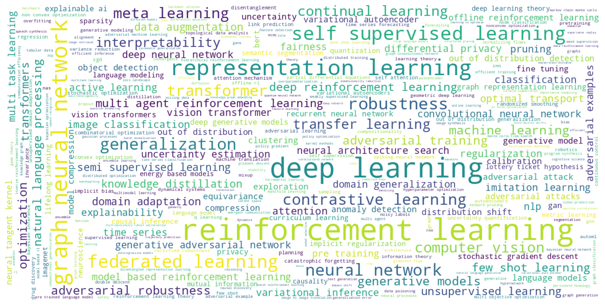
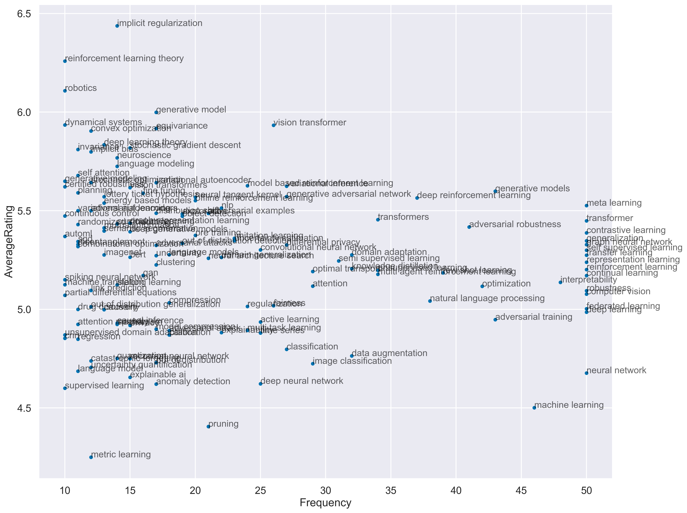

# Crawl and Visualize ICLR 2022 OpenReview Data

    

## Descriptions

This Jupyter Notebook contains the data crawled from ICLR 2022 OpenReview webpages and their visualizations. The list of submissions (sorted by the average ratings) can be found here.

## Prerequisites
* python 3.7
* selenium
* pandas
* seaborn
* imageio
* wordcloud
* tqdm
* [`edgewebdriver`](https://developer.microsoft.com/en-us/microsoft-edge/tools/webdriver/)
  * NOTE: You can also use `chromedriver` by setting `driver = webdriver.Chrome('chromedriver.exe')`.

## Crawl Data
1. Run `crawl_paperlist.py` to crawl the list of papers (~0.5h).
2. Run `crawl_reviews.py` to crawl the reviews (~1.5h).
   * NOTE: currently only review ratings are crawled.

## Visualization

**Keywords Frequency**

The top 50 common keywords (uncased) and their frequency:

    

**Keywords Cloud**

The word clouds formed by keywords of submissions show the hot topics including *deep learning*, *reinforcement learning*, *representation learning*, *graph neural network*, etc.

    

**Ratings Distribution**

The distribution of reviewer ratings centers around 5 (mean: 4.917).

    

**Keywords vs Ratings**

The average reviewer ratings and the frequency of keywords indicate that to maximize your chance to get higher ratings would be using the keywords such as *deep generative models*, or *normalizing flows*.

    

**All ICLR 2022 Submissions**

Number of submissions: 3335 (Collected at 09/11/2021 09:11 AM UTC+8).

|   Rank |   AvgRating | Title                                                                                                                                                                                                                | Ratings             | Decision   |
|-------:|------------:|:---------------------------------------------------------------------------------------------------------------------------------------------------------------------------------------------------------------------|:--------------------|:-----------|
|      1 |        8    | [Contrastive Label Disambiguation for Partial Label Learning](https://openreview.net/forum?id=EhYjZy6e1gJ)                                                                                                           | 8, 8, 8             | Unknown    |
|      2 |        8    | [On the Optimal Memorization Power of ReLU Neural Networks](https://openreview.net/forum?id=MkTPtnjeYTV)                                                                                                             | 8, 8, 8             | Unknown    |
|      3 |        8    | [MIDI-DDSP: Detailed Control of Musical Performance via Hierarchical Modeling](https://openreview.net/forum?id=UseMOjWENv)                                                                                           | 8, 8, 8             | Unknown    |
|      4 |        8    | [TAMP-S2GCNets: Coupling Time-Aware Multipersistence Knowledge Representation with Spatio-Supra Graph Convolutional Networks for Time-Series Forecasting](https://openreview.net/forum?id=wv6g8fWLX2q)               | 8, 8                | Unknown    |
|      5 |        8    | [Minibatch vs Local SGD with Shuffling: Tight Convergence Bounds and Beyond](https://openreview.net/forum?id=LdlwbBP2mlq)                                                                                            | 8, 8, 8             | Unknown    |
|      6 |        8    | [MT3: Multi-Task Multitrack Music Transcription](https://openreview.net/forum?id=iMSjopcOn0p)                                                                                                                        | 8, 8, 8, 8          | Unknown    |
|      7 |        8    | [Sampling with Mirrored Stein Operators](https://openreview.net/forum?id=eMudnJsb1T5)                                                                                                                                | 8, 6, 10, 8         | Unknown    |
|      8 |        8    | [When Can We Learn General-Sum Markov Games with a Large Number of Players Sample-Efficiently?](https://openreview.net/forum?id=6MmiS0HUJHR)                                                                         | 8, 8, 8             | Unknown    |
|      9 |        8    | [Reinforcement Learning under a Multi-agent Predictive State Representation Model: Method and Theory](https://openreview.net/forum?id=PLDOnFoVm4)                                                                    | 8, 8, 8             | Unknown    |
|     10 |        8    | [Assessing Generalization of SGD via Disagreement](https://openreview.net/forum?id=WvOGCEAQhxl)                                                                                                                      | 8, 8, 8, 8          | Unknown    |
|     11 |        8    | [Efficiently Modeling Long Sequences with Structured State Spaces](https://openreview.net/forum?id=uYLFoz1vlAC)                                                                                                      | 8, 8, 8             | Unknown    |
|     12 |        8    | [Score-Based Generative Modeling with Critically-Damped Langevin Diffusion](https://openreview.net/forum?id=CzceR82CYc)                                                                                              | 6, 8, 10, 8         | Unknown    |
|     13 |        8    | [Self-Supervision Enhanced Feature Selection with Correlated Gates](https://openreview.net/forum?id=oDFvtxzPOx)                                                                                                      | 8, 8, 8             | Unknown    |
|     14 |        8    | [RISP: Rendering-Invariant State Predictor with Differentiable Simulation and Rendering for Cross-Domain Parameter Estimation](https://openreview.net/forum?id=uSE03demja)                                           | 8, 8, 8             | Unknown    |
|     15 |        8    | [Towards a Unified View of Parameter-Efficient Transfer Learning](https://openreview.net/forum?id=0RDcd5Axok)                                                                                                        | 10, 8, 6            | Unknown    |
|     16 |        8    | [Neural Deep Equilibrium Solvers](https://openreview.net/forum?id=B0oHOwT5ENL)                                                                                                                                       | 8, 8, 8             | Unknown    |
|     17 |        8    | [EntQA: Entity Linking as Question Answering](https://openreview.net/forum?id=US2rTP5nm_)                                                                                                                            | 8, 8, 8             | Unknown    |
|     18 |        8    | [Comparing Distributions by Measuring Differences that Affect Decision Making](https://openreview.net/forum?id=KB5onONJIAU)                                                                                          | 8, 8, 8             | Unknown    |
|     19 |        8    | [A New Perspective on "How Graph Neural Networks Go Beyond Weisfeiler-Lehman?"](https://openreview.net/forum?id=uxgg9o7bI_3)                                                                                         | 8, 8, 8, 8          | Unknown    |
|     20 |        8    | [A General Analysis of Example-Selection for Stochastic Gradient Descent](https://openreview.net/forum?id=7gWSJrP3opB)                                                                                               | 8, 8, 8, 8          | Unknown    |
|     21 |        8    | [TAPEX: Table Pre-training via Learning a Neural SQL Executor](https://openreview.net/forum?id=O50443AsCP)                                                                                                           | 8, 8, 8             | Unknown    |
|     22 |        8    | [Iterative Refinement Graph Neural Network for Antibody Sequence-Structure Co-design](https://openreview.net/forum?id=LI2bhrE_2A)                                                                                    | 8, 8, 8             | Unknown    |
|     23 |        8    | [The Hidden Convex Optimization Landscape of Regularized Two-Layer ReLU Networks: an Exact Characterization of Optimal Solutions](https://openreview.net/forum?id=Z7Lk2cQEG8a)                                       | 8, 8, 8, 8          | Unknown    |
|     24 |        8    | [Towards Deployment-Efficient Reinforcement Learning: Lower Bound and Optimality](https://openreview.net/forum?id=ccWaPGl9Hq)                                                                                        | 8, 8, 8, 8          | Unknown    |
|     25 |        8    | [What Happens after SGD Reaches Zero Loss? --A Mathematical Framework](https://openreview.net/forum?id=siCt4xZn5Ve)                                                                                                  | 8, 6, 8, 10         | Unknown    |
|     26 |        8    | [Natural Language Descriptions of Deep Features](https://openreview.net/forum?id=NudBMY-tzDr)                                                                                                                        | 8, 8, 8             | Unknown    |
|     27 |        8    | [Possibility Before Utility: Learning And Using Hierarchical Affordances](https://openreview.net/forum?id=7b4zxUnrO2N)                                                                                               | 8, 8, 8, 8          | Unknown    |
|     28 |        8    | [Learnability of convolutional neural networks for infinite dimensional input via mixed and anisotropic smoothness](https://openreview.net/forum?id=dgxFTxuJ50e)                                                     | 8, 8, 8             | Unknown    |
|     29 |        8    | [Emergent Communication at Scale](https://openreview.net/forum?id=AUGBfDIV9rL)                                                                                                                                       | 8, 8, 8, 8          | Unknown    |
|     30 |        8    | [Bootstrapped Meta-Learning](https://openreview.net/forum?id=b-ny3x071E5)                                                                                                                                            | 8, 8, 8, 8          | Unknown    |
|     31 |        8    | [Finetuned Language Models are Zero-Shot Learners](https://openreview.net/forum?id=gEZrGCozdqR)                                                                                                                      | 8, 8, 8, 8          | Unknown    |
|     32 |        7.67 | [Diffusion-Based Voice Conversion with Fast Maximum Likelihood Sampling Scheme](https://openreview.net/forum?id=8c50f-DoWAu)                                                                                         | 5, 8, 10            | Unknown    |
|     33 |        7.67 | [GNN-LM: Language Modeling based on Global Contexts via GNN](https://openreview.net/forum?id=BS49l-B5Bql)                                                                                                            | 8, 10, 5            | Unknown    |
|     34 |        7.6  | [Analytic-DPM: an Analytic Estimate of the Optimal Reverse Variance in Diffusion Probabilistic Models](https://openreview.net/forum?id=0xiJLKH-ufZ)                                                                  | 8, 8, 8, 6, 8       | Unknown    |
|     35 |        7.5  | [RotoGrad: Gradient Homogenization in Multitask Learning](https://openreview.net/forum?id=T8wHz4rnuGL)                                                                                                               | 8, 8, 6, 8          | Unknown    |
|     36 |        7.5  | [DEPTS: Deep Expansion Learning for Periodic Time Series Forecasting](https://openreview.net/forum?id=AJAR-JgNw__)                                                                                                   | 6, 8, 8, 8          | Unknown    |
|     37 |        7.5  | [BEiT: BERT Pre-Training of Image Transformers](https://openreview.net/forum?id=p-BhZSz59o4)                                                                                                                         | 8, 8, 8, 6          | Unknown    |
|     38 |        7.5  | [How to Inject Backdoors with Better Consistency: Logit Anchoring on Clean Data](https://openreview.net/forum?id=Bn09TnDngN)                                                                                         | 8, 8, 8, 6          | Unknown    |
|     39 |        7.5  | [Task Relatedness-Based Generalization Bounds for Meta Learning](https://openreview.net/forum?id=A3HHaEdqAJL)                                                                                                        | 6, 8, 8, 8          | Unknown    |
|     40 |        7.5  | [StyleNeRF: A Style-based 3D Aware Generator for High-resolution Image Synthesis](https://openreview.net/forum?id=iUuzzTMUw9K)                                                                                       | 10, 6, 6, 8         | Unknown    |
|     41 |        7.5  | [StyleAlign: Analysis and Applications of Aligned StyleGAN Models](https://openreview.net/forum?id=Qg2vi4ZbHM9)                                                                                                      | 8, 8, 6, 8          | Unknown    |
|     42 |        7.5  | [AdaRL: What, Where, and How to Adapt in Transfer Reinforcement Learning](https://openreview.net/forum?id=8H5bpVwvt5)                                                                                                | 8, 8, 6, 8          | Unknown    |
|     43 |        7.5  | [Scalable Sampling for Nonsymmetric Determinantal Point Processes](https://openreview.net/forum?id=BB4e8Atc1eR)                                                                                                      | 8, 8, 6, 8          | Unknown    |
|     44 |        7.5  | [Perceiver IO: A General Architecture for Structured Inputs & Outputs](https://openreview.net/forum?id=fILj7WpI-g)                                                                                                   | 8, 6, 8, 8          | Unknown    |
|     45 |        7.5  | [Hindsight is 20/20: Leveraging Past Traversals to Aid 3D Perception](https://openreview.net/forum?id=qsZoGvFiJn1)                                                                                                   | 8, 8, 8, 6          | Unknown    |
|     46 |        7.5  | [Meta Discovery: Learning to Discover Novel Classes given Very Limited Data](https://openreview.net/forum?id=MEpKGLsY8f)                                                                                             | 6, 8, 8, 8          | Unknown    |
|     47 |        7.5  | [PAC-Bayes Information Bottleneck](https://openreview.net/forum?id=iLHOIDsPv1P)                                                                                                                                      | 6, 10, 8, 6         | Unknown    |
|     48 |        7.5  | [Strength of Minibatch Noise in SGD](https://openreview.net/forum?id=uorVGbWV5sw)                                                                                                                                    | 6, 8, 8, 8          | Unknown    |
|     49 |        7.5  | [NAS-Bench-Suite: NAS Evaluation is (Now) Surprisingly Easy](https://openreview.net/forum?id=0DLwqQLmqV)                                                                                                             | 8, 6, 8, 8          | Unknown    |
|     50 |        7.5  | [Scaling Laws for Neural Machine Translation](https://openreview.net/forum?id=hR_SMu8cxCV)                                                                                                                           | 8, 6, 10, 6         | Unknown    |
|     51 |        7.5  | [Weighted Training for Cross-Task Learning](https://openreview.net/forum?id=ltM1RMZntpu)                                                                                                                             | 8, 8, 6, 8          | Unknown    |
|     52 |        7.5  | [Tackling the Generative Learning Trilemma with Denoising Diffusion GANs](https://openreview.net/forum?id=JprM0p-q0Co)                                                                                               | 8, 8, 6, 8          | Unknown    |
|     53 |        7.5  | [Coordination Among Neural Modules Through a Shared Global Workspace](https://openreview.net/forum?id=XzTtHjgPDsT)                                                                                                   | 6, 6, 8, 10         | Unknown    |
|     54 |        7.5  | [Deconstructing the Inductive Biases of Hamiltonian Neural Networks](https://openreview.net/forum?id=EDeVYpT42oS)                                                                                                    | 6, 8, 8, 8          | Unknown    |
|     55 |        7.5  | [Exploring the Limits of Large Scale Pre-training](https://openreview.net/forum?id=V3C8p78sDa)                                                                                                                       | 8, 6, 8, 8          | Unknown    |
|     56 |        7.5  | [Data-Efficient Graph Grammar Learning for Molecular Generation](https://openreview.net/forum?id=l4IHywGq6a)                                                                                                         | 8, 8, 6, 8          | Unknown    |
|     57 |        7.5  | [UniFormer: Unified Transformer for Efficient Spatial-Temporal Representation Learning](https://openreview.net/forum?id=nBU_u6DLvoK)                                                                                 | 8, 8, 6, 8          | Unknown    |
|     58 |        7.5  | [Approximation and Learning with Deep Convolutional Models: a Kernel Perspective](https://openreview.net/forum?id=lrocYB-0ST2)                                                                                       | 8, 8, 6, 8          | Unknown    |
|     59 |        7.5  | [Learning the Dynamics of Physical Systems from Sparse Observations with Finite Element Networks](https://openreview.net/forum?id=HFmAukZ-k-2)                                                                       | 6, 8, 8, 8          | Unknown    |
|     60 |        7.33 | [iLQR-VAE : control-based learning of input-driven dynamics with applications to neural data](https://openreview.net/forum?id=wRODLDHaAiW)                                                                           | 8, 8, 6             | Unknown    |
|     61 |        7.33 | [Ab-Initio Potential Energy Surfaces by Pairing GNNs with Neural Wave Functions](https://openreview.net/forum?id=apv504XsysP)                                                                                        | 8, 6, 8             | Unknown    |
|     62 |        7.33 | [RelaxLoss: Defending Membership Inference Attacks without Losing Utility](https://openreview.net/forum?id=FEDfGWVZYIn)                                                                                              | 6, 8, 8             | Unknown    |
|     63 |        7.33 | [Vision-Based Manipulators Need to Also See from Their Hands](https://openreview.net/forum?id=RJkAHKp7kNZ)                                                                                                           | 8, 6, 8             | Unknown    |
|     64 |        7.33 | [The MultiBERTs: BERT Reproductions for Robustness Analysis](https://openreview.net/forum?id=K0E_F0gFDgA)                                                                                                            | 8, 8, 6             | Unknown    |
|     65 |        7.33 | [Non-Transferable Learning: A New Approach for Model Ownership Verification and Applicability Authorization](https://openreview.net/forum?id=tYRrOdSnVUy)                                                            | 6, 8, 8             | Unknown    |
|     66 |        7.33 | [Transition to Linearity of Wide Neural Networks is an Emerging Property of Assembling Weak Models](https://openreview.net/forum?id=CyKHoKyvgnp)                                                                     | 8, 8, 6             | Unknown    |
|     67 |        7.33 | [Relational Surrogate Loss Learning](https://openreview.net/forum?id=dZPgfwaTaXv)                                                                                                                                    | 8, 6, 8             | Unknown    |
|     68 |        7.33 | [Improving Mutual Information Estimation with Annealed and Energy-Based Bounds](https://openreview.net/forum?id=T0B9AoM_bFg)                                                                                         | 8, 6, 8             | Unknown    |
|     69 |        7.33 | [A Loss Curvature Perspective on Training Instabilities of Deep Learning Models](https://openreview.net/forum?id=OcKMT-36vUs)                                                                                        | 8, 8, 6             | Unknown    |
|     70 |        7.33 | [Compositional Training for End-to-End Deep AUC Maximization](https://openreview.net/forum?id=gPvB4pdu_Z)                                                                                                            | 6, 8, 8             | Unknown    |
|     71 |        7.33 | [DemoDICE: Offline Imitation Learning with Supplementary Imperfect Demonstrations](https://openreview.net/forum?id=BrPdX1bDZkQ)                                                                                      | 6, 8, 8             | Unknown    |
|     72 |        7.33 | [Sample and Computation Redistribution for Efficient Face Detection](https://openreview.net/forum?id=RhB1AdoFfGE)                                                                                                    | 8, 8, 6             | Unknown    |
|     73 |        7.33 | [On the Connection between Local Attention and Dynamic Depth-wise Convolution](https://openreview.net/forum?id=L3_SsSNMmy)                                                                                           | 8, 6, 8             | Unknown    |
|     74 |        7.25 | [Optimization and Adaptive Generalization of Three layer Neural Networks](https://openreview.net/forum?id=dPyRNUlttBv)                                                                                               | 5, 8, 8, 8          | Unknown    |
|     75 |        7.25 | [Self-supervised Learning is More Robust to Dataset Imbalance](https://openreview.net/forum?id=4AZz9osqrar)                                                                                                          | 8, 8, 5, 8          | Unknown    |
|     76 |        7.25 | [Sparse Communication via Mixed Distributions](https://openreview.net/forum?id=WAid50QschI)                                                                                                                          | 8, 8, 8, 5          | Unknown    |
|     77 |        7.25 | [DISCOVERING AND EXPLAINING THE REPRESENTATION BOTTLENECK OF DNNS](https://openreview.net/forum?id=iRCUlgmdfHJ)                                                                                                      | 8, 8, 5, 8          | Unknown    |
|     78 |        7.25 | [How Do Vision Transformers Work?](https://openreview.net/forum?id=D78Go4hVcxO)                                                                                                                                      | 8, 8, 5, 8          | Unknown    |
|     79 |        7.25 | [A Deep Variational Approach to Clustering Survival Data](https://openreview.net/forum?id=RQ428ZptQfU)                                                                                                               | 8, 8, 8, 5          | Unknown    |
|     80 |        7.25 | [InfinityGAN: Towards Infinite-Pixel Image Synthesis](https://openreview.net/forum?id=ufGMqIM0a4b)                                                                                                                   | 8, 8, 8, 5          | Unknown    |
|     81 |        7.25 | [Interpretable Unsupervised Diversity Denoising and Artefact Removal](https://openreview.net/forum?id=DfMqlB0PXjM)                                                                                                   | 8, 8, 8, 5          | Unknown    |
|     82 |        7.25 | [On the Generalization of Models Trained with SGD: Information-Theoretic Bounds and Implications](https://openreview.net/forum?id=oWZsQ8o5EA)                                                                        | 8, 5, 6, 10         | Unknown    |
|     83 |        7.25 | [Low-rank Matrix Recovery with Unknown Correspondence](https://openreview.net/forum?id=RbVp8ieInU7)                                                                                                                  | 5, 10, 8, 6         | Unknown    |
|     84 |        7.25 | [Understanding Domain Randomization for Sim-to-real Transfer](https://openreview.net/forum?id=T8vZHIRTrY)                                                                                                            | 8, 3, 8, 10         | Unknown    |
|     85 |        7.25 | [Learning Super-Features for Image Retrieval](https://openreview.net/forum?id=wogsFPHwftY)                                                                                                                           | 8, 5, 8, 8          | Unknown    |
|     86 |        7.25 | [Can an Image Classifier Suffice For Action Recognition?](https://openreview.net/forum?id=qhkFX-HLuHV)                                                                                                               | 8, 8, 5, 8          | Unknown    |
|     87 |        7.25 | [Escaping limit cycles: Global convergence for constrained nonconvex-nonconcave minimax problems](https://openreview.net/forum?id=2_vhkAMARk)                                                                        | 8, 5, 8, 8          | Unknown    |
|     88 |        7.25 | [Neural Structured Prediction for Inductive Node Classification](https://openreview.net/forum?id=YWNAX0caEjI)                                                                                                        | 8, 5, 10, 6         | Unknown    |
|     89 |        7.25 | [Learning more skills through optimistic exploration](https://openreview.net/forum?id=cU8rknuhxc)                                                                                                                    | 8, 8, 8, 5          | Unknown    |
|     90 |        7.25 | [LORD: Lower-Dimensional Embedding of Log-Signature in Neural Rough Differential Equations](https://openreview.net/forum?id=fCG75wd39ze)                                                                             | 8, 8, 5, 8          | Unknown    |
|     91 |        7.25 | [Differentiable Scaffolding Tree for Molecule Optimization](https://openreview.net/forum?id=w_drCosT76)                                                                                                              | 5, 8, 10, 6         | Unknown    |
|     92 |        7    | [End-to-End Learning of Probabilistic Hierarchies on Graphs](https://openreview.net/forum?id=g2LCQwG7Of)                                                                                                             | 8, 6                | Unknown    |
|     93 |        7    | [ARTEMIS: Attention-based Retrieval with Text-Explicit Matching and Implicit Similarity](https://openreview.net/forum?id=CVfLvQq9gLo)                                                                                | 8, 8, 5             | Unknown    |
|     94 |        7    | [Chunked Autoregressive GAN for Conditional Waveform Synthesis](https://openreview.net/forum?id=v3aeIsY_vVX)                                                                                                         | 8, 8, 5             | Unknown    |
|     95 |        7    | [Open-vocabulary Object Detection via Vision and Language Knowledge Distillation](https://openreview.net/forum?id=lL3lnMbR4WU)                                                                                       | 5, 8, 8             | Unknown    |
|     96 |        7    | [Learning Vision-Guided Quadrupedal Locomotion End-to-End with Cross-Modal Transformers](https://openreview.net/forum?id=nhnJ3oo6AB)                                                                                 | 6, 6, 8, 8          | Unknown    |
|     97 |        7    | [Imbedding Deep Neural Networks](https://openreview.net/forum?id=yKIAXjkJc2F)                                                                                                                                        | 6, 6, 8, 8          | Unknown    |
|     98 |        7    | [On the Importance of Firth Bias Reduction in Few-Shot Classification](https://openreview.net/forum?id=DNRADop4ksB)                                                                                                  | 6, 8, 8, 6          | Unknown    |
|     99 |        7    | [SphereFace2: Binary Classification is All You Need for Deep Face Recognition](https://openreview.net/forum?id=l3SDgUh7qZO)                                                                                          | 5, 8, 8             | Unknown    |
|    100 |        7    | [Critical Points in Quantum Generative Models](https://openreview.net/forum?id=2f1z55GVQN)                                                                                                                           | 8, 5, 8             | Unknown    |
|    101 |        7    | [Planning in Stochastic Environments with a Learned Model](https://openreview.net/forum?id=X6D9bAHhBQ1)                                                                                                              | 8, 5, 5, 10         | Unknown    |
|    102 |        7    | [Coherence-based Label Propagation over Time Series for Accelerated Active Learning](https://openreview.net/forum?id=gjNcH0hj0LM)                                                                                    | 10, 6, 6, 6         | Unknown    |
|    103 |        7    | [The Information Geometry of Unsupervised Reinforcement Learning](https://openreview.net/forum?id=3wU2UX0voE)                                                                                                        | 5, 8, 8             | Unknown    |
|    104 |        7    | [On Lottery Tickets and Minimal Task Representations in Deep Reinforcement Learning](https://openreview.net/forum?id=Fl3Mg_MZR-)                                                                                     | 8, 5, 8             | Unknown    |
|    105 |        7    | [PER-ETD: A Polynomially Efficient Emphatic Temporal Difference Learning Method](https://openreview.net/forum?id=-HSOjDPfhBJ)                                                                                        | 6, 8, 6, 8          | Unknown    |
|    106 |        7    | [Convergent Boosted Smoothing for Modeling GraphData with Tabular Node Features](https://openreview.net/forum?id=nHpzE7DqAnG)                                                                                        | 8, 8, 6, 6          | Unknown    |
|    107 |        7    | [Learning Audio-Visual Speech Representation by Masked Multimodal Cluster Prediction](https://openreview.net/forum?id=Z1Qlm11uOM)                                                                                    | 6, 8, 6, 8          | Unknown    |
|    108 |        7    | [Domain Adversarial Training: A Game Perspective](https://openreview.net/forum?id=AwgtcUAhBq)                                                                                                                        | 6, 8, 6, 8          | Unknown    |
|    109 |        7    | [A Conditional Point Diffusion-Refinement Paradigm for 3D Point Cloud Completion](https://openreview.net/forum?id=wqD6TfbYkrn)                                                                                       | 8, 8, 5             | Unknown    |
|    110 |        7    | [Revisiting Over-smoothing in BERT from the Perspective of Graph](https://openreview.net/forum?id=dUV91uaXm3)                                                                                                        | 5, 8, 8             | Unknown    |
|    111 |        7    | [Extending the WILDS Benchmark for Unsupervised Adaptation](https://openreview.net/forum?id=z7p2V6KROOV)                                                                                                             | 8, 6, 6, 8          | Unknown    |
|    112 |        7    | [Joint Shapley values: a measure of joint feature importance](https://openreview.net/forum?id=vcUmUvQCloe)                                                                                                           | 5, 8, 8             | Unknown    |
|    113 |        7    | [Self-Joint Supervised Learning](https://openreview.net/forum?id=zuqcmNVK4c2)                                                                                                                                        | 8, 5, 8             | Unknown    |
|    114 |        7    | [Understanding over-squashing and bottlenecks on graphs via curvature](https://openreview.net/forum?id=7UmjRGzp-A)                                                                                                   | 6, 6, 8, 8          | Unknown    |
|    115 |        7    | [Unifying Likelihood-free Inference with Black-box Sequence Design and Beyond](https://openreview.net/forum?id=1HxTO6CTkz)                                                                                           | 8, 5, 10, 5         | Unknown    |
|    116 |        7    | [Filtered-CoPhy: Unsupervised Learning of Counterfactual Physics in Pixel Space](https://openreview.net/forum?id=1L0C5ROtFp)                                                                                         | 5, 6, 10            | Unknown    |
|    117 |        7    | [Autoregressive Quantile Flows for Predictive Uncertainty Estimation](https://openreview.net/forum?id=z1-I6rOKv1S)                                                                                                   | 8, 8, 5             | Unknown    |
|    118 |        7    | [Convergent Graph Solvers](https://openreview.net/forum?id=ItkxLQU01lD)                                                                                                                                              | 6, 6, 8, 8          | Unknown    |
|    119 |        7    | [Meta-Learning with Fewer Tasks through Task Interpolation](https://openreview.net/forum?id=ajXWF7bVR8d)                                                                                                             | 8, 5, 8, 8, 6       | Unknown    |
|    120 |        7    | [Unsupervised Federated Learning is Possible](https://openreview.net/forum?id=WHA8009laxu)                                                                                                                           | 8, 6, 6, 8          | Unknown    |
|    121 |        7    | [Visual Correspondence Hallucination](https://openreview.net/forum?id=jaLDP8Hp_gc)                                                                                                                                   | 8, 5, 8             | Unknown    |
|    122 |        7    | [Permutation-Based SGD: Is Random Optimal?](https://openreview.net/forum?id=YiBa9HKTyXE)                                                                                                                             | 10, 6, 6, 6         | Unknown    |
|    123 |        7    | [No One Representation to Rule Them All: Overlapping Features of Training Methods](https://openreview.net/forum?id=BK-4qbGgIE3)                                                                                      | 8, 6, 8, 6          | Unknown    |
|    124 |        7    | [Churn Reduction via Distillation](https://openreview.net/forum?id=HbtFCX2PLq0)                                                                                                                                      | 5, 8, 8             | Unknown    |
|    125 |        7    | [Unsupervised Vision-Language Grammar Induction with Shared Structure Modeling](https://openreview.net/forum?id=N0n_QyQ5lBF)                                                                                         | 5, 8, 8             | Unknown    |
|    126 |        7    | [On the approximation properties of recurrent encoder-decoder architectures](https://openreview.net/forum?id=xDIvIqQ3DXD)                                                                                            | 5, 8, 8             | Unknown    |
|    127 |        7    | [Graph-based Nearest Neighbor Search in Hyperbolic Spaces](https://openreview.net/forum?id=USIgIY6TNDe)                                                                                                              | 6, 8                | Unknown    |
|    128 |        7    | [Language modeling via stochastic processes](https://openreview.net/forum?id=pMQwKL1yctf)                                                                                                                            | 8, 8, 6, 6          | Unknown    |
|    129 |        7    | [Multi-scale Feature Learning Dynamics: Insights for Double Descent](https://openreview.net/forum?id=JmU7lyDxTpc)                                                                                                    | 8, 8, 5             | Unknown    |
|    130 |        7    | [Back2Future: Leveraging Backfill Dynamics for Improving Real-time Predictions in Future](https://openreview.net/forum?id=L01Nn_VJ9i)                                                                                | 8, 6                | Unknown    |
|    131 |        7    | [Progressive Distillation for Fast Sampling of Diffusion Models](https://openreview.net/forum?id=TIdIXIpzhoI)                                                                                                        | 8, 8, 6, 6          | Unknown    |
|    132 |        7    | [Continuous-Time Meta-Learning with Forward Mode Differentiation](https://openreview.net/forum?id=57PipS27Km)                                                                                                        | 8, 6, 8, 6          | Unknown    |
|    133 |        7    | [Omni-Dimensional Dynamic Convolution](https://openreview.net/forum?id=DmpCfq6Mg39)                                                                                                                                  | 8, 8, 6, 6          | Unknown    |
|    134 |        7    | [Delaunay Component Analysis for Evaluation of Data Representations](https://openreview.net/forum?id=HTVch9AMPa)                                                                                                     | 8, 6                | Unknown    |
|    135 |        7    | [Pixelated Butterfly: Simple and Efficient Sparse training for Neural Network Models](https://openreview.net/forum?id=Nfl-iXa-y7R)                                                                                   | 6, 8, 8, 6          | Unknown    |
|    136 |        7    | [Hyperparameter Tuning with Renyi Differential Privacy](https://openreview.net/forum?id=-70L8lpp9DF)                                                                                                                 | 8, 6, 6, 8          | Unknown    |
|    137 |        7    | [EViT: Expediting Vision Transformers via Token Reorganizations](https://openreview.net/forum?id=BjyvwnXXVn_)                                                                                                        | 8, 8, 6, 6          | Unknown    |
|    138 |        7    | [Sqrt(d) Dimension Dependence of Langevin Monte Carlo](https://openreview.net/forum?id=5-2mX9_U5i)                                                                                                                   | 6, 8, 6, 8          | Unknown    |
|    139 |        7    | [Causal ImageNet: How to discover spurious features in Deep Learning?](https://openreview.net/forum?id=XVPqLyNxSyh)                                                                                                  | 8, 5, 8             | Unknown    |
|    140 |        7    | [NASPY: Automated Extraction of Automated Machine Learning Models](https://openreview.net/forum?id=KhLK0sHMgXK)                                                                                                      | 6, 8, 8, 6          | Unknown    |
|    141 |        7    | [Expressiveness and Approximation Properties of Graph Neural Networks](https://openreview.net/forum?id=wIzUeM3TAU)                                                                                                   | 8, 8, 6, 6          | Unknown    |
|    142 |        7    | [Efficient Active Search for Combinatorial Optimization Problems](https://openreview.net/forum?id=nO5caZwFwYu)                                                                                                       | 8, 8, 6, 6          | Unknown    |
|    143 |        7    | [Continual Learning with Filter Atom Swapping](https://openreview.net/forum?id=metRpM4Zrcb)                                                                                                                          | 8, 6, 8, 6          | Unknown    |
|    144 |        7    | [Noisy Feature Mixup](https://openreview.net/forum?id=vJb4I2ANmy)                                                                                                                                                    | 6, 8, 6, 8          | Unknown    |
|    145 |        7    | [Transformer-based Transform Coding](https://openreview.net/forum?id=IDwN6xjHnK8)                                                                                                                                    | 8, 8, 6, 5, 8       | Unknown    |
|    146 |        7    | [Energy-Based Learning for Cooperative Games, with Applications to Valuation Problems in Machine Learning](https://openreview.net/forum?id=xLfAgCroImw)                                                              | 8, 8, 5             | Unknown    |
|    147 |        7    | [DIVA: Dataset Derivative of a Learning Task](https://openreview.net/forum?id=bVvMOtLMiw)                                                                                                                            | 8, 8, 5             | Unknown    |
|    148 |        7    | [Generalization of Neural Combinatorial Solvers Through the Lens of Adversarial Robustness](https://openreview.net/forum?id=vJZ7dPIjip3)                                                                             | 5, 8, 8             | Unknown    |
|    149 |        7    | [On Distributed Adaptive Optimization with Gradient Compression](https://openreview.net/forum?id=CI-xXX9dg9l)                                                                                                        | 8, 8, 5             | Unknown    |
|    150 |        7    | [VAE Approximation Error: ELBO and Exponential Families](https://openreview.net/forum?id=OIs3SxU5Ynl)                                                                                                                | 6, 8, 6, 8          | Unknown    |
|    151 |        7    | [Byzantine-Robust Learning on Heterogeneous Datasets via Bucketing](https://openreview.net/forum?id=jXKKDEi5vJt)                                                                                                     | 6, 8, 6, 8          | Unknown    |
|    152 |        7    | [When should agents explore?](https://openreview.net/forum?id=dEwfxt14bca)                                                                                                                                           | 6, 8, 8, 6          | Unknown    |
|    153 |        7    | [Universal Approximation Under Constraints is Possible with Transformers](https://openreview.net/forum?id=JGO8CvG5S9)                                                                                                | 8, 3, 10            | Unknown    |
|    154 |        7    | [CrossBeam: Learning to Search in Bottom-Up Program Synthesis](https://openreview.net/forum?id=qhC8mr2LEKq)                                                                                                          | 8, 8, 6, 6          | Unknown    |
|    155 |        7    | [Minimax Optimization with Smooth Algorithmic Adversaries](https://openreview.net/forum?id=UdxJ2fJx7N0)                                                                                                              | 8, 8, 6, 6          | Unknown    |
|    156 |        7    | [Online Hyperparameter Meta-Learning with Hypergradient Distillation](https://openreview.net/forum?id=01AMRlen9wJ)                                                                                                   | 6, 8, 8, 6          | Unknown    |
|    157 |        6.8  | [Pix2seq: A Language Modeling Framework for Object Detection](https://openreview.net/forum?id=e42KbIw6Wb)                                                                                                            | 8, 6, 6, 6, 8       | Unknown    |
|    158 |        6.8  | [Latent Image Animator: Learning to animate image via latent space navigation](https://openreview.net/forum?id=7r6kDq0mK_)                                                                                           | 8, 6, 6, 6, 8       | Unknown    |
|    159 |        6.8  | [SPIRAL: Self-supervised Perturbation-Invariant Representation Learning for Speech Pre-Training](https://openreview.net/forum?id=TBpg4PnXhYH)                                                                        | 8, 8, 6, 6, 6       | Unknown    |
|    160 |        6.8  | [Probabilistic Implicit Scene Completion](https://openreview.net/forum?id=BnQhMqDfcKG)                                                                                                                               | 6, 8, 8, 6, 6       | Unknown    |
|    161 |        6.75 | [A Unified Contrastive Energy-based Model for Understanding the Generative Ability of Adversarial Training](https://openreview.net/forum?id=XhF2VOMRHS)                                                              | 8, 6, 5, 8          | Unknown    |
|    162 |        6.75 | [Leveraging Automated Unit Tests for Unsupervised Code Translation](https://openreview.net/forum?id=cmt-6KtR4c4)                                                                                                     | 6, 5, 8, 8          | Unknown    |
|    163 |        6.75 | [CycleMLP: A MLP-like Architecture for Dense Prediction](https://openreview.net/forum?id=NMEceG4v69Y)                                                                                                                | 6, 8, 5, 8          | Unknown    |
|    164 |        6.75 | [Procedural generalization by planning with self-supervised world models](https://openreview.net/forum?id=FmBegXJToY)                                                                                                | 8, 8, 5, 6          | Unknown    |
|    165 |        6.75 | [Training invariances and the low-rank phenomenon: beyond linear networks](https://openreview.net/forum?id=XEW8CQgArno)                                                                                              | 8, 8, 6, 5          | Unknown    |
|    166 |        6.75 | [Visual Representation Learning Does Not Generalize Strongly Within the Same Domain](https://openreview.net/forum?id=9RUHPlladgh)                                                                                    | 5, 8, 8, 6          | Unknown    |
|    167 |        6.75 | [A First-Occupancy Representation for Reinforcement Learning](https://openreview.net/forum?id=JBAZe2yN6Ub)                                                                                                           | 6, 5, 8, 8          | Unknown    |
|    168 |        6.75 | [Contrastive Clustering to Mine Pseudo Parallel Data for Unsupervised Translation](https://openreview.net/forum?id=pN1JOdrSY9)                                                                                       | 6, 8, 8, 5          | Unknown    |
|    169 |        6.75 | [Who Is Your Right Mixup Partner in Positive and Unlabeled Learning](https://openreview.net/forum?id=NH29920YEmj)                                                                                                    | 6, 8, 5, 8          | Unknown    |
|    170 |        6.75 | [Bridging the Gap: Providing Post-Hoc Symbolic Explanations for Sequential Decision-Making Problems with Inscrutable Representations](https://openreview.net/forum?id=o-1v9hdSult)                                   | 10, 6, 8, 3         | Unknown    |
|    171 |        6.75 | [Understanding the Role of Self Attention for Efficient Speech Recognition](https://openreview.net/forum?id=AvcfxqRy4Y)                                                                                              | 8, 5, 8, 6          | Unknown    |
|    172 |        6.75 | [Train Short, Test Long: Attention with Linear Biases Enables Input Length Extrapolation](https://openreview.net/forum?id=R8sQPpGCv0)                                                                                | 8, 8, 5, 6          | Unknown    |
|    173 |        6.75 | [Multi-objective Optimization by Learning Space Partition](https://openreview.net/forum?id=FlwzVjfMryn)                                                                                                              | 8, 8, 5, 6          | Unknown    |
|    174 |        6.75 | [C-Planning: An Automatic Curriculum for Learning Goal-Reaching Tasks](https://openreview.net/forum?id=K2JfSnLBD9)                                                                                                   | 6, 8, 8, 5          | Unknown    |
|    175 |        6.75 | [Learning to Complete Code with Sketches](https://openreview.net/forum?id=q79uMSC6ZBT)                                                                                                                               | 8, 5, 6, 8          | Unknown    |
|    176 |        6.75 | [Implicit Bias of Projected Subgradient Method Gives Provable Robust Recovery of Subspaces of Unknown Codimension](https://openreview.net/forum?id=vA7doMdgi75)                                                      | 8, 5, 6, 8          | Unknown    |
|    177 |        6.75 | [Knowledge Removal in Sampling-based Bayesian Inference](https://openreview.net/forum?id=dTqOcTUOQO)                                                                                                                 | 8, 8, 3, 8          | Unknown    |
|    178 |        6.75 | [Path Integral Sampler: A Stochastic Control Approach For Sampling](https://openreview.net/forum?id=_uCb2ynRu7Y)                                                                                                     | 5, 6, 8, 8          | Unknown    |
|    179 |        6.75 | [Deconfounding to Explanation Evaluation in Graph Neural Networks](https://openreview.net/forum?id=OKhFyMVz6t7)                                                                                                      | 8, 8, 5, 6          | Unknown    |
|    180 |        6.75 | [Learning Object-Oriented Dynamics for Planning from Text](https://openreview.net/forum?id=B6EIcyp-Rb7)                                                                                                              | 6, 5, 8, 8          | Unknown    |
|    181 |        6.75 | [On the Uncomputability of Partition Functions in Energy-Based Sequence Models](https://openreview.net/forum?id=SsPCtEY6yCl)                                                                                         | 5, 8, 6, 8          | Unknown    |
|    182 |        6.75 | [Granger causal inference on DAGs identifies genomic loci regulating transcription](https://openreview.net/forum?id=nZOUYEN6Wvy)                                                                                     | 8, 5, 6, 8          | Unknown    |
|    183 |        6.75 | [HyAR: Addressing Discrete-Continuous Action Reinforcement Learning via Hybrid Action Representation](https://openreview.net/forum?id=64trBbOhdGU)                                                                   | 6, 8, 5, 8          | Unknown    |
|    184 |        6.75 | [Neural Contextual Bandits with Deep Representation and Shallow Exploration](https://openreview.net/forum?id=xnYACQquaGV)                                                                                            | 6, 8, 5, 8          | Unknown    |
|    185 |        6.75 | [Unsupervised Semantic Segmentation by Distilling Feature Correspondences](https://openreview.net/forum?id=SaKO6z6Hl0c)                                                                                              | 8, 6, 8, 5          | Unknown    |
|    186 |        6.75 | [Adversarially Robust Conformal Prediction](https://openreview.net/forum?id=9L1BsI4wP1H)                                                                                                                             | 8, 6, 8, 5          | Unknown    |
|    187 |        6.75 | [Pessimistic Bootstrapping for Uncertainty-Driven Offline Reinforcement Learning](https://openreview.net/forum?id=Y4cs1Z3HnqL)                                                                                       | 8, 8, 5, 6          | Unknown    |
|    188 |        6.75 | [Graph-less Neural Networks: Teaching Old MLPs New Tricks Via Distillation](https://openreview.net/forum?id=4p6_5HBWPCw)                                                                                             | 3, 8, 8, 8          | Unknown    |
|    189 |        6.75 | [Sparse DETR: Efficient End-to-End Object Detection with Learnable Sparsity](https://openreview.net/forum?id=RRGVCN8kjim)                                                                                            | 8, 5, 8, 6          | Unknown    |
|    190 |        6.75 | [Model-augmented Prioritized Experience Replay](https://openreview.net/forum?id=WuEiafqdy9H)                                                                                                                         | 8, 5, 8, 6          | Unknown    |
|    191 |        6.75 | [The Boltzmann Policy Distribution: Accounting for Systematic Suboptimality in Human Models](https://openreview.net/forum?id=_l_QjPGN5ye)                                                                            | 6, 8, 8, 5          | Unknown    |
|    192 |        6.75 | [Transform2Act: Learning a Transform-and-Control Policy for Efficient Agent Design](https://openreview.net/forum?id=UcDUxjPYWSr)                                                                                     | 8, 5, 8, 6          | Unknown    |
|    193 |        6.75 | [Learning Towards The Largest Margins](https://openreview.net/forum?id=hqkhcFHOeKD)                                                                                                                                  | 8, 5, 8, 6          | Unknown    |
|    194 |        6.75 | [Continual Learning with Recursive Gradient Optimization](https://openreview.net/forum?id=7YDLgf9_zgm)                                                                                                               | 6, 8, 5, 8          | Unknown    |
|    195 |        6.75 | [Mapping Language Models to Grounded Conceptual Spaces](https://openreview.net/forum?id=gJcEM8sxHK)                                                                                                                  | 6, 8, 8, 5          | Unknown    |
|    196 |        6.75 | [Poisoning and Backdooring Contrastive Learning](https://openreview.net/forum?id=iC4UHbQ01Mp)                                                                                                                        | 5, 8, 6, 8          | Unknown    |
|    197 |        6.75 | [Learning Strides in Convolutional Neural Networks](https://openreview.net/forum?id=M752z9FKJP)                                                                                                                      | 5, 8, 8, 6          | Unknown    |
|    198 |        6.75 | [Rethinking the Representational Continuity: Towards Unsupervised Continual Learning](https://openreview.net/forum?id=9Hrka5PA7LW)                                                                                   | 8, 6, 8, 5          | Unknown    |
|    199 |        6.75 | [Geometry-Consistent Neural Shape Representation with Implicit Displacement Fields](https://openreview.net/forum?id=yhCp5RcZD7)                                                                                      | 5, 6, 6, 10         | Unknown    |
|    200 |        6.75 | [On the Pitfalls of Analyzing Individual Neurons in Language Models](https://openreview.net/forum?id=8uz0EWPQIMu)                                                                                                    | 6, 8, 8, 5          | Unknown    |
|    201 |        6.75 | [Direct then Diffuse: Incremental Unsupervised Skill Discovery for State Covering and Goal Reaching](https://openreview.net/forum?id=25kzAhUB1lz)                                                                    | 8, 5, 8, 6          | Unknown    |
|    202 |        6.75 | [Constrained Policy Optimization via Bayesian World Models](https://openreview.net/forum?id=PRZoSmCinhf)                                                                                                             | 8, 3, 8, 8          | Unknown    |
|    203 |        6.75 | [Learning Hierarchical Structures with Differentiable Nondeterministic Stacks](https://openreview.net/forum?id=5LXw_QplBiF)                                                                                          | 6, 8, 5, 8          | Unknown    |
|    204 |        6.75 | [Decoupled Adaptation for Cross-Domain Object Detection](https://openreview.net/forum?id=VNqaB1g9393)                                                                                                                | 5, 8, 8, 6          | Unknown    |
|    205 |        6.75 | [Global Convergence of Multi-Agent Policy Gradient in Markov Potential Games](https://openreview.net/forum?id=gfwON7rAm4)                                                                                            | 6, 8, 5, 8          | Unknown    |
|    206 |        6.75 | [Denoising Likelihood Score Matching for Conditional Score-based Data Generation](https://openreview.net/forum?id=LcF-EEt8cCC)                                                                                       | 6, 8, 5, 8          | Unknown    |
|    207 |        6.75 | [Wiring Up Vision: Minimizing Supervised Synaptic Updates Needed to Produce a Primate Ventral Stream](https://openreview.net/forum?id=g1SzIRLQXMM)                                                                   | 8, 8, 5, 6          | Unknown    |
|    208 |        6.75 | [Learning Efficient Image Super-Resolution Networks via Structure-Regularized Pruning](https://openreview.net/forum?id=AjGC97Aofee)                                                                                  | 5, 8, 6, 8          | Unknown    |
|    209 |        6.75 | [End-to-End Balancing for Causal Continuous Treatment-Effect Estimation](https://openreview.net/forum?id=KL5jILuehZ)                                                                                                 | 5, 8, 6, 8          | Unknown    |
|    210 |        6.75 | [Filling the G_ap_s: Multivariate Time Series Imputation by Graph Neural Networks](https://openreview.net/forum?id=kOu3-S3wJ7)                                                                                       | 8, 8, 5, 6          | Unknown    |
|    211 |        6.75 | [miniF2F: a cross-system benchmark for formal Olympiad-level mathematics](https://openreview.net/forum?id=9ZPegFuFTFv)                                                                                               | 6, 8, 5, 8          | Unknown    |
|    212 |        6.67 | [Neural Variational Dropout Processes](https://openreview.net/forum?id=lyLVzukXi08)                                                                                                                                  | 6, 8, 6             | Unknown    |
|    213 |        6.67 | [Self-Supervised Graph Neural Networks for Improved Electroencephalographic Seizure Analysis](https://openreview.net/forum?id=k9bx1EfHI_-)                                                                           | 6, 6, 8             | Unknown    |
|    214 |        6.67 | [GeoDiff: A Geometric Diffusion Model for Molecular Conformation Generation](https://openreview.net/forum?id=PzcvxEMzvQC)                                                                                            | 6, 6, 8             | Unknown    |
|    215 |        6.67 | [Uncertainty Modeling for Out-of-Distribution Generalization](https://openreview.net/forum?id=6HN7LHyzGgC)                                                                                                           | 6, 8, 6             | Unknown    |
|    216 |        6.67 | [Entroformer: A Transformer-based Entropy Model for Learned Image Compression](https://openreview.net/forum?id=VrjOFfcnSV8)                                                                                          | 6, 6, 8             | Unknown    |
|    217 |        6.67 | [Distribution Compression in Near-Linear Time](https://openreview.net/forum?id=lzupY5zjaU9)                                                                                                                          | 6, 8, 6             | Unknown    |
|    218 |        6.67 | [Training Data Generating Networks: Shape Reconstruction via Bi-level Optimization](https://openreview.net/forum?id=dDo8druYppX)                                                                                     | 8, 6, 6             | Unknown    |
|    219 |        6.67 | [When, Why, and Which Pretrained GANs Are Useful?](https://openreview.net/forum?id=4Ycr8oeCoIh)                                                                                                                      | 6, 6, 8             | Unknown    |
|    220 |        6.67 | [Learning Versatile Neural Architectures by Propagating Network Codes](https://openreview.net/forum?id=KEQl-MZ5fg7)                                                                                                  | 8, 6, 6             | Unknown    |
|    221 |        6.67 | [A Fine-Grained Analysis on Distribution Shift](https://openreview.net/forum?id=Dl4LetuLdyK)                                                                                                                         | 6, 8, 6             | Unknown    |
|    222 |        6.67 | [Adaptive Control Flow in Transformers Improves Systematic Generalization](https://openreview.net/forum?id=KBQP4A_J1K)                                                                                               | 6, 8, 6             | Unknown    |
|    223 |        6.67 | [Zero Pixel Directional Boundary by Vector Transform](https://openreview.net/forum?id=nxcABL7jbQh)                                                                                                                   | 8, 6, 6             | Unknown    |
|    224 |        6.67 | [AQUILA: Communication Efficient Federated Learning with Adaptive Quantization of Lazily-Aggregated Gradients](https://openreview.net/forum?id=cdZLe5S0ur)                                                           | 6, 8, 6             | Unknown    |
|    225 |        6.67 | [Boosting Randomized Smoothing with Variance Reduced Classifiers](https://openreview.net/forum?id=mHu2vIds_-b)                                                                                                       | 6, 8, 6             | Unknown    |
|    226 |        6.67 | [Open-Set Recognition: A Good Closed-Set Classifier is All You Need](https://openreview.net/forum?id=5hLP5JY9S2d)                                                                                                    | 6, 6, 8             | Unknown    |
|    227 |        6.67 | [Controlling Directions Orthogonal to a Classifier](https://openreview.net/forum?id=DIjCrlsu6Z)                                                                                                                      | 6, 8, 6             | Unknown    |
|    228 |        6.67 | [Multimeasurement Generative Models](https://openreview.net/forum?id=QRX0nCX_gk)                                                                                                                                     | 6, 6, 8             | Unknown    |
|    229 |        6.67 | [Trainable Learning Rate](https://openreview.net/forum?id=fHeK814NOMO)                                                                                                                                               | 5, 3, 8, 6, 8, 10   | Unknown    |
|    230 |        6.67 | [Boosted Curriculum Reinforcement Learning](https://openreview.net/forum?id=anbBFlX1tJ1)                                                                                                                             | 8, 6, 6             | Unknown    |
|    231 |        6.67 | [On Non-Random Missing Labels in Semi-Supervised Learning](https://openreview.net/forum?id=6yVvwR9H9Oj)                                                                                                              | 8, 6, 6             | Unknown    |
|    232 |        6.67 | [Superclass-Conditional Gaussian Mixture Model For Learning Fine-Grained Embeddings](https://openreview.net/forum?id=vds4SNooOe)                                                                                     | 8, 6, 6             | Unknown    |
|    233 |        6.67 | [Learning Causal Relationships from Conditional Moment Restrictions by Importance Weighting](https://openreview.net/forum?id=7twQI5VnC8)                                                                             | 6, 8, 6             | Unknown    |
|    234 |        6.67 | [Privacy Implications of Shuffling](https://openreview.net/forum?id=5i2f-aR6B8H)                                                                                                                                     | 6, 6, 8             | Unknown    |
|    235 |        6.67 | [Understanding Latent Correlation-Based Multiview Learning and Self-Supervision: An Identifiability Perspective](https://openreview.net/forum?id=5FUq05QRc5b)                                                        | 6, 8, 6             | Unknown    |
|    236 |        6.67 | [Retriever: Learning Content-Style Representation as a Token-Level Bipartite Graph](https://openreview.net/forum?id=AXWygMvuT6Q)                                                                                     | 8, 6, 6             | Unknown    |
|    237 |        6.67 | [Mind the Gap: Domain Gap Control for Single Shot Domain Adaptation for Generative Adversarial Networks](https://openreview.net/forum?id=vqGi8Kp0wM)                                                                 | 6, 6, 8             | Unknown    |
|    238 |        6.67 | [IntSGD: Adaptive Floatless Compression of Stochastic Gradients](https://openreview.net/forum?id=pFyXqxChZc)                                                                                                         | 6, 8, 6             | Unknown    |
|    239 |        6.67 | [IFR-Explore: Learning Inter-object Functional Relationships in 3D Indoor Scenes](https://openreview.net/forum?id=OT3mLgR8Wg8)                                                                                       | 6, 6, 8             | Unknown    |
|    240 |        6.67 | [Properties from mechanisms: an equivariance perspective on identifiable representation learning](https://openreview.net/forum?id=g5ynW-jMq4M)                                                                       | 6, 8, 6             | Unknown    |
|    241 |        6.67 | [ProtoRes: Proto-Residual Network for Pose Authoring via Learned Inverse Kinematics](https://openreview.net/forum?id=s03AQxehtd_)                                                                                    | 6, 8, 6             | Unknown    |
|    242 |        6.67 | [SQuant: On-the-Fly Data-Free Quantization via Diagonal Hessian Approximation](https://openreview.net/forum?id=JXhROKNZzOc)                                                                                          | 8, 6, 6             | Unknown    |
|    243 |        6.67 | [Efficient Self-supervised Vision Transformers for Representation Learning](https://openreview.net/forum?id=fVu3o-YUGQK)                                                                                             | 8, 6, 6             | Unknown    |
|    244 |        6.6  | [$\mathrm{SO}(2)$-Equivariant Reinforcement Learning](https://openreview.net/forum?id=7F9cOhdvfk_)                                                                                                                   | 8, 8, 6, 6, 5       | Unknown    |
|    245 |        6.6  | [A Unified Wasserstein Distributional Robustness Framework for Adversarial Training](https://openreview.net/forum?id=Dzpe9C1mpiv)                                                                                    | 8, 5, 8, 6, 6       | Unknown    |
|    246 |        6.6  | [Equivariant and Stable Positional Encoding for More Powerful Graph Neural Networks](https://openreview.net/forum?id=e95i1IHcWj)                                                                                     | 5, 6, 6, 8, 8       | Unknown    |
|    247 |        6.6  | [Sample Selection with Uncertainty of Losses for Learning with Noisy Labels](https://openreview.net/forum?id=xENf4QUL4LW)                                                                                            | 5, 8, 6, 8, 6       | Unknown    |
|    248 |        6.6  | [Learning Sample Reweighting for Adversarial Robustness](https://openreview.net/forum?id=7zc05Ua_HOK)                                                                                                                | 5, 8, 6, 6, 8       | Unknown    |
|    249 |        6.6  | [The Inductive Bias of In-Context Learning: Rethinking Pretraining Example Design](https://openreview.net/forum?id=lnEaqbTJIRz)                                                                                      | 6, 6, 5, 8, 8       | Unknown    |
|    250 |        6.6  | [SGD Can Converge to Local Maxima](https://openreview.net/forum?id=9XhPLAjjRB)                                                                                                                                       | 3, 8, 8, 6, 8       | Unknown    |
|    251 |        6.6  | [Source-Free Adaptation to Measurement Shift via Bottom-Up Feature Restoration](https://openreview.net/forum?id=1JDiK_TbV4S)                                                                                         | 8, 6, 5, 6, 8       | Unknown    |
|    252 |        6.5  | [How to deal with missing data in supervised deep learning?](https://openreview.net/forum?id=J7b4BCtDm4)                                                                                                             | 8, 5, 5, 8          | Unknown    |
|    253 |        6.5  | [Low-Budget Active Learning via Wasserstein Distance: An Integer Programming Approach](https://openreview.net/forum?id=v8OlxjGn23S)                                                                                  | 6, 8, 6, 6          | Unknown    |
|    254 |        6.5  | [Learning Discrete Structured Variational Auto-Encoder using Natural Evolution Strategies](https://openreview.net/forum?id=JJCjv4dAbyL)                                                                              | 8, 5, 5, 8          | Unknown    |
|    255 |        6.5  | [BAM: Bayes Augmented with Memory](https://openreview.net/forum?id=NdOoQnYPj_)                                                                                                                                       | 8, 8, 5, 5          | Unknown    |
|    256 |        6.5  | [Understanding the Variance Collapse of SVGD in High Dimensions](https://openreview.net/forum?id=Qycd9j5Qp9J)                                                                                                        | 8, 6, 6, 6          | Unknown    |
|    257 |        6.5  | [Learning transferable motor skills with hierarchical latent mixture policies](https://openreview.net/forum?id=qTHBE7E9iej)                                                                                          | 6, 6, 8, 6          | Unknown    |
|    258 |        6.5  | [Differentiable Prompt Makes Pre-trained Language Models Better Few-shot Learners](https://openreview.net/forum?id=ek9a0qIafW)                                                                                       | 8, 6, 6, 6          | Unknown    |
|    259 |        6.5  | [Evading Adversarial Example Detection Defenses with Orthogonal Projected Gradient Descent](https://openreview.net/forum?id=af1eUDdUVz)                                                                              | 5, 8, 8, 5          | Unknown    |
|    260 |        6.5  | [Online Ad Hoc Teamwork under Partial Observability](https://openreview.net/forum?id=18Ys0-PzyPI)                                                                                                                    | 6, 6, 6, 8          | Unknown    |
|    261 |        6.5  | [PAC Prediction Sets Under Covariate Shift](https://openreview.net/forum?id=DhP9L8vIyLc)                                                                                                                             | 8, 6, 6, 6          | Unknown    |
|    262 |        6.5  | [Mention Memory: incorporating textual knowledge into Transformers through entity mention attention](https://openreview.net/forum?id=OY1A8ejQgEX)                                                                    | 8, 6, 6, 6          | Unknown    |
|    263 |        6.5  | [EigenGame Unloaded: When playing games is better than optimizing](https://openreview.net/forum?id=So6YAqnqgMj)                                                                                                      | 5, 8, 5, 8          | Unknown    |
|    264 |        6.5  | [How Did the Model Change? Efficiently Assessing Machine Learning API Shifts](https://openreview.net/forum?id=gFDFKC4gHL4)                                                                                           | 6, 6, 8, 6          | Unknown    |
|    265 |        6.5  | [Trust Region Policy Optimisation in Multi-Agent Reinforcement Learning](https://openreview.net/forum?id=EcGGFkNTxdJ)                                                                                                | 6, 8, 6, 6          | Unknown    |
|    266 |        6.5  | [Data-Driven Offline Optimization for Architecting Hardware Accelerators](https://openreview.net/forum?id=GsH-K1VIyy)                                                                                                | 6, 6, 6, 8          | Unknown    |
|    267 |        6.5  | [How to Robustify Black-Box ML Models? A Zeroth-Order Optimization Perspective](https://openreview.net/forum?id=W9G_ImpHlQd)                                                                                         | 6, 8, 6, 6          | Unknown    |
|    268 |        6.5  | [Boosting the Confidence of Near-Tight Generalization Bounds for Uniformly Stable Randomized Algorithms](https://openreview.net/forum?id=ZWykq5n4zx)                                                                 | 8, 6, 6, 6          | Unknown    |
|    269 |        6.5  | [No Parameters Left Behind: Sensitivity Guided Adaptive Learning Rate for Training Large Transformer Models](https://openreview.net/forum?id=cuvga_CiVND)                                                            | 6, 6, 8, 6          | Unknown    |
|    270 |        6.5  | [Conditional Object-Centric Learning from Video](https://openreview.net/forum?id=aD7uesX1GF_)                                                                                                                        | 5, 8, 5, 8          | Unknown    |
|    271 |        6.5  | [Generate, Annotate, and Learn: Generative Models Advance Self-Training and Knowledge Distillation](https://openreview.net/forum?id=oC12z8lkbrU)                                                                     | 5, 8, 5, 8          | Unknown    |
|    272 |        6.5  | [Fast AdvProp](https://openreview.net/forum?id=hcoswsDHNAW)                                                                                                                                                          | 8, 8, 5, 5          | Unknown    |
|    273 |        6.5  | [Unsupervised Pose-Aware Part Decomposition for 3D Articulated Objects](https://openreview.net/forum?id=dLDzuxaN0Hd)                                                                                                 | 8, 5, 8, 5          | Unknown    |
|    274 |        6.5  | [Counterfactual Graph Learning for Link Prediction](https://openreview.net/forum?id=YxQiIOLKgEf)                                                                                                                     | 5, 6, 10, 5         | Unknown    |
|    275 |        6.5  | [An Unconstrained Layer-Peeled Perspective on Neural Collapse](https://openreview.net/forum?id=WZ3yjh8coDg)                                                                                                          | 6, 6, 6, 8          | Unknown    |
|    276 |        6.5  | [The Geometry of Memoryless Stochastic Policy Optimization in Infinite-Horizon POMDPs](https://openreview.net/forum?id=A05I5IvrdL-)                                                                                  | 6, 6, 6, 8          | Unknown    |
|    277 |        6.5  | [CKConv: Continuous Kernel Convolution For Sequential Data](https://openreview.net/forum?id=8FhxBtXSl0)                                                                                                              | 6, 8, 6, 6          | Unknown    |
|    278 |        6.5  | [Tighter Sparse Approximation Bounds for ReLU Neural Networks](https://openreview.net/forum?id=LBvk4QWIUpm)                                                                                                          | 6, 6, 8, 6          | Unknown    |
|    279 |        6.5  | [NeuPL: Neural Population Learning](https://openreview.net/forum?id=MIX3fJkl_1)                                                                                                                                      | 6, 6, 8, 6          | Unknown    |
|    280 |        6.5  | [WaveCorr: Deep Reinforcement Learning with Permutation Invariant Policy Networks for Portfolio Management](https://openreview.net/forum?id=Zca3NK3X8G)                                                              | 8, 5, 5, 8          | Unknown    |
|    281 |        6.5  | [DeSKO: Stability-Assured Robust Control with a Deep Stochastic Koopman Operator](https://openreview.net/forum?id=hniLRD_XCA)                                                                                        | 6, 8, 6, 6          | Unknown    |
|    282 |        6.5  | [Large Language Models Can Be Strong Differentially Private Learners](https://openreview.net/forum?id=bVuP3ltATMz)                                                                                                   | 8, 8, 5, 5          | Unknown    |
|    283 |        6.5  | [D-CODE: Discovering Closed-form ODEs from Observed Trajectories](https://openreview.net/forum?id=wENMvIsxNN)                                                                                                        | 8, 6, 6, 6          | Unknown    |
|    284 |        6.5  | [Efficient Sharpness-aware Minimization for Improved Training of Neural Networks](https://openreview.net/forum?id=n0OeTdNRG0Q)                                                                                       | 8, 6, 6, 6          | Unknown    |
|    285 |        6.5  | [A Relational Intervention Approach for Unsupervised Dynamics Generalization in Model-Based Reinforcement Learning](https://openreview.net/forum?id=YRq0ZUnzKoZ)                                                     | 5, 5, 8, 8          | Unknown    |
|    286 |        6.5  | [On the Convergence of the Monte Carlo Exploring Starts Algorithm for Reinforcement Learning](https://openreview.net/forum?id=JzNB0eA2-M4)                                                                           | 8, 5, 5, 8          | Unknown    |
|    287 |        6.5  | [Post-Training Detection of Backdoor Attacks for Two-Class and Multi-Attack Scenarios](https://openreview.net/forum?id=MSgB8D4Hy51)                                                                                  | 8, 5, 5, 8          | Unknown    |
|    288 |        6.5  | [Differentially Private Fractional Frequency Moments Estimation with Polylogarithmic Space](https://openreview.net/forum?id=7I8LPkcx8V)                                                                              | 8, 6, 6, 6          | Unknown    |
|    289 |        6.5  | [Proof Artifact Co-Training for Theorem Proving with Language Models](https://openreview.net/forum?id=rpxJc9j04U)                                                                                                    | 8, 5, 8, 5          | Unknown    |
|    290 |        6.5  | [Implicit Bias of Adversarial Training for Deep Neural Networks](https://openreview.net/forum?id=l8It-0lE5e7)                                                                                                        | 5, 8, 5, 8          | Unknown    |
|    291 |        6.5  | [Neural graphical modelling in continuous-time: consistency guarantees and algorithms](https://openreview.net/forum?id=SsHBkfeRF9L)                                                                                  | 5, 8                | Unknown    |
|    292 |        6.5  | [Preference Conditioned Neural Multi-objective Combinatorial Optimization](https://openreview.net/forum?id=QuObT9BTWo)                                                                                               | 6, 6, 8, 6          | Unknown    |
|    293 |        6.5  | [Almost Tight L0-norm Certified Robustness of Top-k Predictions against Adversarial Perturbations](https://openreview.net/forum?id=gJLEXy3ySpu)                                                                      | 6, 6, 6, 8          | Unknown    |
|    294 |        6.5  | [High Probability Bounds for a Class of Nonconvex Algorithms with AdaGrad Stepsize](https://openreview.net/forum?id=dSw0QtRMJkO)                                                                                     | 5, 8                | Unknown    |
|    295 |        6.5  | [Peek-a-Boo: What (More) is Disguised in a Randomly Weighted Neural Network, and How to Find It Efficiently](https://openreview.net/forum?id=moHCzz6D5H3)                                                            | 8, 5, 8, 5          | Unknown    |
|    296 |        6.5  | [How many degrees of freedom do we need to train deep networks: a loss landscape perspective](https://openreview.net/forum?id=ChMLTGRjFcU)                                                                           | 6, 8, 6, 6          | Unknown    |
|    297 |        6.5  | [Distributionally Robust Models with Parametric Likelihood Ratios](https://openreview.net/forum?id=a34GrNaYEcS)                                                                                                      | 6, 8, 6, 6          | Unknown    |
|    298 |        6.5  | [Explanations of Black-Box Models based on Directional Feature Interactions](https://openreview.net/forum?id=45Mr7LeKR9)                                                                                             | 6, 6, 8, 6          | Unknown    |
|    299 |        6.5  | [Learning Optimal Conformal Classifiers](https://openreview.net/forum?id=t8O-4LKFVx)                                                                                                                                 | 8, 5, 8, 5          | Unknown    |
|    300 |        6.4  | [Reinforcement Learning in Presence of Discrete Markovian Context Evolution](https://openreview.net/forum?id=CmsfC7u054S)                                                                                            | 8, 8, 5, 6, 5       | Unknown    |
|    301 |        6.4  | [MonoDistill: Learning Spatial Features for Monocular 3D Object Detection](https://openreview.net/forum?id=C54V-xTWfi)                                                                                               | 8, 5, 8, 6, 5       | Unknown    |
|    302 |        6.4  | [Weakly Supervised Label Learning Flows](https://openreview.net/forum?id=Y8KfxdZl-rI)                                                                                                                                | 8, 6, 5, 5, 8       | Unknown    |
|    303 |        6.4  | [Responsible Disclosure of Generative Models Using Scalable Fingerprinting](https://openreview.net/forum?id=sOK-zS6WHB)                                                                                              | 5, 8, 3, 8, 8       | Unknown    |
|    304 |        6.4  | [Sharp Learning Bounds for Contrastive Unsupervised Representation Learning](https://openreview.net/forum?id=tDirSp3pczB)                                                                                            | 6, 8, 5, 8, 5       | Unknown    |
|    305 |        6.4  | [Towards Better Understanding and Better Generalization of Low-shot Classification in Histology Images with Contrastive Learning](https://openreview.net/forum?id=kQ2SOflIOVC)                                       | 6, 5, 8, 8, 5       | Unknown    |
|    306 |        6.4  | [Revisiting Out-of-Distribution Detection: A Simple Baseline is Surprisingly Effective](https://openreview.net/forum?id=-BTmxCddppP)                                                                                 | 6, 3, 5, 10, 8      | Unknown    |
|    307 |        6.33 | [Discovering Invariant Rationales for Graph Neural Networks](https://openreview.net/forum?id=hGXij5rfiHw)                                                                                                            | 5, 8, 6             | Unknown    |
|    308 |        6.33 | [Promoting Saliency From Depth: Deep Unsupervised RGB-D Saliency Detection](https://openreview.net/forum?id=BZnnMbt0pW)                                                                                              | 6, 5, 8             | Unknown    |
|    309 |        6.33 | [Gaussian Mixture Convolution Networks](https://openreview.net/forum?id=Oxeka7Z7Hor)                                                                                                                                 | 5, 8, 6             | Unknown    |
|    310 |        6.33 | [Multi-Mode Deep Matrix and Tensor Factorization](https://openreview.net/forum?id=6YVIk0sAkF_)                                                                                                                       | 5, 6, 8             | Unknown    |
|    311 |        6.33 | [Neural Models for Output-Space Invariance in Combinatorial Problems](https://openreview.net/forum?id=ibrUkC-pbis)                                                                                                   | 5, 6, 8             | Unknown    |
|    312 |        6.33 | [Where do Models go Wrong? Parameter-Space Saliency Maps for Explainability](https://openreview.net/forum?id=qEGBB9YB31)                                                                                             | 8, 6, 5             | Unknown    |
|    313 |        6.33 | [Concurrent Adversarial Learning for Large-Batch Training](https://openreview.net/forum?id=rw1mZl_ss3L)                                                                                                              | 8, 5, 6             | Unknown    |
|    314 |        6.33 | [RelViT: Concept-guided Vision Transformer for Visual Relational Reasoning](https://openreview.net/forum?id=afoV8W3-IYp)                                                                                             | 5, 8, 6             | Unknown    |
|    315 |        6.33 | [CrowdPlay: Crowdsourcing human demonstration data for offline learning in Atari games](https://openreview.net/forum?id=qyTBxTztIpQ)                                                                                 | 10, 3, 6            | Unknown    |
|    316 |        6.33 | [Neural Relational Inference with Node-Specific Information](https://openreview.net/forum?id=HBsJNesj2S)                                                                                                             | 6, 5, 8             | Unknown    |
|    317 |        6.33 | [A Neural Tangent Kernel Perspective of Infinite Tree Ensembles](https://openreview.net/forum?id=vUH85MOXO7h)                                                                                                        | 3, 8, 8             | Unknown    |
|    318 |        6.33 | [Fast Differentiable Matrix Square Root](https://openreview.net/forum?id=-AOEi-5VTU8)                                                                                                                                | 6, 8, 5             | Unknown    |
|    319 |        6.33 | [Non-Autoregressive Models are Better Multilingual Translators](https://openreview.net/forum?id=5HvpvYd68b)                                                                                                          | 6, 5, 8             | Unknown    |
|    320 |        6.33 | [MANDERA: Malicious Node Detection in Federated Learning via Ranking](https://openreview.net/forum?id=ciSap6Cw5mk)                                                                                                   | 6, 8, 5             | Unknown    |
|    321 |        6.33 | [X-model: Improving Data Efficiency in Deep Learning with A Minimax Model](https://openreview.net/forum?id=P3Bh01hBYTH)                                                                                              | 6, 5, 8             | Unknown    |
|    322 |        6.33 | [NETWORK INSENSITIVITY TO PARAMETER NOISE VIA PARAMETER ATTACK DURING TRAINING](https://openreview.net/forum?id=-8sBpe7rDiV)                                                                                         | 5, 8, 6             | Unknown    |
|    323 |        6.33 | [Exploring Memorization in Adversarial Training](https://openreview.net/forum?id=7gE9V9GBZaI)                                                                                                                        | 3, 8, 8             | Unknown    |
|    324 |        6.33 | [On the Convergence of Projected Alternating Maximization for Equitable and Optimal Transport](https://openreview.net/forum?id=gciJWCp3z1s)                                                                          | 8, 6, 5             | Unknown    |
|    325 |        6.33 | [Contact Points Discovery for Soft-Body Manipulations with Differentiable Physics](https://openreview.net/forum?id=mmUA7_O9mjY)                                                                                      | 5, 8, 6             | Unknown    |
|    326 |        6.33 | [CoBERL: Contrastive BERT for Reinforcement Learning](https://openreview.net/forum?id=sRZ3GhmegS)                                                                                                                    | 8, 5, 6             | Unknown    |
|    327 |        6.33 | [Efficient and Modular Implicit Differentiation](https://openreview.net/forum?id=TQ75Md-FqQp)                                                                                                                        | 10, 3, 6            | Unknown    |
|    328 |        6.33 | [Fast Model Editing at Scale](https://openreview.net/forum?id=0DcZxeWfOPt)                                                                                                                                           | 3, 8, 8             | Unknown    |
|    329 |        6.33 | [Information Bottleneck: Exact Analysis of (Quantized) Neural Networks](https://openreview.net/forum?id=kF9DZQQrU0w)                                                                                                 | 5, 8, 6             | Unknown    |
|    330 |        6.33 | [Transformers Can Do Bayesian Inference](https://openreview.net/forum?id=KSugKcbNf9)                                                                                                                                 | 8, 5, 6             | Unknown    |
|    331 |        6.33 | [Optimal Transport for Causal Discovery](https://openreview.net/forum?id=qwBK94cP1y)                                                                                                                                 | 6, 8, 5             | Unknown    |
|    332 |        6.33 | [A generalization of the randomized singular value decomposition](https://openreview.net/forum?id=hgKtwSb4S2)                                                                                                        | 6, 8, 5             | Unknown    |
|    333 |        6.33 | [Invariant Causal Representation Learning for Out-of-Distribution Generalization](https://openreview.net/forum?id=-e4EXDWXnSn)                                                                                       | 8, 5, 6             | Unknown    |
|    334 |        6.33 | [The Convex Geometry of Backpropagation: Neural Network Gradient Flows Converge to Extreme Points of the Dual Convex Program](https://openreview.net/forum?id=5QhUE1qiVC6)                                           | 6, 8, 5             | Unknown    |
|    335 |        6.33 | [Hybrid Memoised Wake-Sleep: Approximate Inference at the Discrete-Continuous Interface](https://openreview.net/forum?id=auOPcdAcoy)                                                                                 | 5, 8, 6             | Unknown    |
|    336 |        6.33 | [SimVLM: Simple Visual Language Model Pretraining with Weak Supervision](https://openreview.net/forum?id=GUrhfTuf_3)                                                                                                 | 6, 8, 5             | Unknown    |
|    337 |        6.33 | [Spike-inspired rank coding for fast and accurate recurrent neural networks](https://openreview.net/forum?id=iMH1e5k7n3L)                                                                                            | 8, 5, 6             | Unknown    |
|    338 |        6.33 | [Programmatic Reinforcement Learning without Oracles](https://openreview.net/forum?id=6Tk2noBdvxt)                                                                                                                   | 6, 8, 5             | Unknown    |
|    339 |        6.33 | [Information-Aware Time Series Meta-Contrastive Learning](https://openreview.net/forum?id=kxARp2zoqAk)                                                                                                               | 10, 3, 6            | Unknown    |
|    340 |        6.33 | [PEARL: Data Synthesis via Private Embeddings and Adversarial Reconstruction Learning](https://openreview.net/forum?id=M6M8BEmd6dq)                                                                                  | 8, 6, 5             | Unknown    |
|    341 |        6.33 | [Pseudo-Labeled Auto-Curriculum Learning for Semi-Supervised Keypoint Localization](https://openreview.net/forum?id=6Q52pZ-Th7N)                                                                                     | 6, 8, 5             | Unknown    |
|    342 |        6.33 | [Mapping conditional distributions for domain adaptation under generalized target shift](https://openreview.net/forum?id=sPfB2PI87BZ)                                                                                | 8, 6, 5             | Unknown    |
|    343 |        6.33 | [Geometric and Physical Quantities improve E(3) Equivariant Message Passing](https://openreview.net/forum?id=_xwr8gOBeV1)                                                                                            | 5, 5, 6, 6, 6, 10   | Unknown    |
|    344 |        6.33 | [Bregman Gradient Policy Optimization](https://openreview.net/forum?id=ZU-zFnTum1N)                                                                                                                                  | 8, 3, 8             | Unknown    |
|    345 |        6.33 | [Optimal Representations for Covariate Shift](https://openreview.net/forum?id=Rf58LPCwJj0)                                                                                                                           | 6, 5, 8             | Unknown    |
|    346 |        6.33 | [Anti-Concentrated Confidence Bonuses For Scalable Exploration](https://openreview.net/forum?id=RXQ-FPbQYVn)                                                                                                         | 8, 6, 5             | Unknown    |
|    347 |        6.33 | [Actor-critic is implicitly biased towards high entropy optimal policies](https://openreview.net/forum?id=vEZyTBRPP6o)                                                                                               | 6, 8, 5             | Unknown    |
|    348 |        6.33 | [Autonomous Learning of Object-Centric Abstractions for High-Level Planning](https://openreview.net/forum?id=rrWeE9ZDw_)                                                                                             | 5, 6, 8             | Unknown    |
|    349 |        6.33 | [Gradient play in stochastic games: stationary points, convergence, and sample complexity](https://openreview.net/forum?id=GrvigKxc13E)                                                                              | 8, 5, 6             | Unknown    |
|    350 |        6.33 | [Steerable Partial Differential Operators for Equivariant Neural Networks](https://openreview.net/forum?id=N9W24a4zU)                                                                                                | 5, 8, 6             | Unknown    |
|    351 |        6.33 | [Learning Similarity Metrics for Volumetric Simulations with Multiscale CNNs](https://openreview.net/forum?id=fKv__asZk47)                                                                                           | 3, 8, 8             | Unknown    |
|    352 |        6.33 | [Half-Inverse Gradients for Physical Deep Learning](https://openreview.net/forum?id=HTx7vrlLBEj)                                                                                                                     | 5, 8, 6             | Unknown    |
|    353 |        6.33 | [If your data distribution shifts, use self-learning](https://openreview.net/forum?id=1oEvY1a67c1)                                                                                                                   | 6, 5, 8             | Unknown    |
|    354 |        6.33 | [Near-Optimal Reward-Free Exploration for Linear Mixture MDPs with Plug-in Solver](https://openreview.net/forum?id=SidzxAb9k30)                                                                                      | 8, 5, 6             | Unknown    |
|    355 |        6.33 | [Evaluating Distributional Distortion in Neural Language Modeling](https://openreview.net/forum?id=bTteFbU99ye)                                                                                                      | 8, 5, 6             | Unknown    |
|    356 |        6.33 | [Rethinking Network Design and Local Geometry in Point Cloud: A Simple Residual MLP Framework](https://openreview.net/forum?id=3Pbra-_u76D)                                                                          | 6, 5, 8             | Unknown    |
|    357 |        6.33 | [Unsupervised Discovery of Object Radiance Fields](https://openreview.net/forum?id=rwE8SshAlxw)                                                                                                                      | 5, 6, 8             | Unknown    |
|    358 |        6.33 | [MobileViT: Light-weight, General-purpose, and Mobile-friendly Vision Transformer](https://openreview.net/forum?id=vh-0sUt8HlG)                                                                                      | 8, 6, 5             | Unknown    |
|    359 |        6.33 | [Natural Attribute-based Shift Detection](https://openreview.net/forum?id=tsg-Lf1MYp)                                                                                                                                | 6, 5, 8             | Unknown    |
|    360 |        6.33 | [DiffSkill: Skill Abstraction from Differentiable Physics for Deformable Object Manipulations with Tools](https://openreview.net/forum?id=Kef8cKdHWpP)                                                               | 8, 6, 5             | Unknown    |
|    361 |        6.33 | [A Johnson-Lindenstrauss Framework for Randomly Initialized CNNs](https://openreview.net/forum?id=YX0lrvdPQc)                                                                                                        | 6, 8, 5             | Unknown    |
|    362 |        6.33 | [8-bit Optimizers via Block-wise Quantization](https://openreview.net/forum?id=shpkpVXzo3h)                                                                                                                          | 5, 8, 6             | Unknown    |
|    363 |        6.25 | [CIC: Contrastive Intrinsic Control for Unsupervised Skill Discovery](https://openreview.net/forum?id=kOtkgUGAVTX)                                                                                                   | 3, 8, 8, 6          | Unknown    |
|    364 |        6.25 | [T-WaveNet: A Tree-Structured Wavelet Neural Network for Time Series Signal Analysis](https://openreview.net/forum?id=U4uFaLyg7PV)                                                                                   | 8, 6, 6, 5          | Unknown    |
|    365 |        6.25 | [On the Limitations of Multimodal VAEs](https://openreview.net/forum?id=w-CPUXXrAj)                                                                                                                                  | 8, 5, 6, 6          | Unknown    |
|    366 |        6.25 | [Evaluating Model-Based Planning and Planner Amortization for Continuous Control](https://openreview.net/forum?id=SS8F6tFX3-)                                                                                        | 5, 6, 8, 6          | Unknown    |
|    367 |        6.25 | [SOSP: Efficiently Capturing Global Correlations by Second-Order Structured Pruning](https://openreview.net/forum?id=t5EmXZ3ZLR)                                                                                     | 6, 8, 6, 5          | Unknown    |
|    368 |        6.25 | [On Predicting Generalization using GANs](https://openreview.net/forum?id=eW5R4Cek6y6)                                                                                                                               | 8, 6, 5, 6          | Unknown    |
|    369 |        6.25 | [Cross-Domain Imitation Learning via Optimal Transport](https://openreview.net/forum?id=xP3cPq2hQC)                                                                                                                  | 5, 6, 6, 8          | Unknown    |
|    370 |        6.25 | [Improved deterministic l2 robustness on CIFAR-10 and CIFAR-100](https://openreview.net/forum?id=tD7eCtaSkR)                                                                                                         | 8, 6, 3, 8          | Unknown    |
|    371 |        6.25 | [Semi-relaxed Gromov-Wasserstein divergence and applications on graphs](https://openreview.net/forum?id=RShaMexjc-x)                                                                                                 | 6, 6, 5, 8          | Unknown    |
|    372 |        6.25 | [A global convergence theory for deep ReLU implicit networks via over-parameterization](https://openreview.net/forum?id=R332S76RjxS)                                                                                 | 3, 6, 8, 8          | Unknown    |
|    373 |        6.25 | [$\pi$BO: Augmenting Acquisition Functions with User Beliefs for Bayesian Optimization](https://openreview.net/forum?id=MMAeCXIa89)                                                                                  | 6, 5, 8, 6          | Unknown    |
|    374 |        6.25 | [An Autoregressive Flow Model for 3D Molecular Geometry Generation from Scratch](https://openreview.net/forum?id=C03Ajc-NS5W)                                                                                        | 6, 8, 6, 5          | Unknown    |
|    375 |        6.25 | [Structure by Architecture: Disentangled Representations without Regularization](https://openreview.net/forum?id=ue4CArRAsct)                                                                                        | 6, 8, 5, 6          | Unknown    |
|    376 |        6.25 | [AdaMatch: A Unified Approach to Semi-Supervised Learning and Domain Adaptation](https://openreview.net/forum?id=Q5uh1Nvv5dm)                                                                                        | 8, 6, 6, 5          | Unknown    |
|    377 |        6.25 | [GNN is a Counter? Revisiting GNN for Question Answering](https://openreview.net/forum?id=hzmQ4wOnSb)                                                                                                                | 8, 6, 5, 6          | Unknown    |
|    378 |        6.25 | [Shallow and Deep Networks are Near-Optimal Approximators of Korobov Functions](https://openreview.net/forum?id=AV8FPoMTTa)                                                                                          | 6, 8, 5, 6          | Unknown    |
|    379 |        6.25 | [HTLM: Hyper-Text Pre-Training and Prompting of Language Models](https://openreview.net/forum?id=P-pPW1nxf1r)                                                                                                        | 6, 8, 5, 6          | Unknown    |
|    380 |        6.25 | [cosFormer: Rethinking Softmax In Attention](https://openreview.net/forum?id=Bl8CQrx2Up4)                                                                                                                            | 8, 3, 8, 6          | Unknown    |
|    381 |        6.25 | [Synthesising Audio Adversarial Examples for Automatic Speech Recognition](https://openreview.net/forum?id=bE239PSGIGZ)                                                                                              | 6, 5, 6, 8          | Unknown    |
|    382 |        6.25 | [Equivariant Transformers for Neural Network based Molecular Potentials](https://openreview.net/forum?id=zNHzqZ9wrRB)                                                                                                | 6, 6, 5, 8          | Unknown    |
|    383 |        6.25 | [F8Net: Fixed-Point 8-bit Only Multiplication for Network Quantization](https://openreview.net/forum?id=_CfpJazzXT2)                                                                                                 | 10, 5, 5, 5         | Unknown    |
|    384 |        6.25 | [Learning Disentangled Representation by Exploiting Pretrained Generative Models: A Contrastive Learning View](https://openreview.net/forum?id=j-63FSNcO5a)                                                          | 6, 5, 6, 8          | Unknown    |
|    385 |        6.25 | [High Probability Generalization Bounds for Minimax Problems with Fast Rates](https://openreview.net/forum?id=gI7feJ9yXPz)                                                                                           | 8, 6, 6, 5          | Unknown    |
|    386 |        6.25 | [Learning curves for continual learning in neural networks: Self-knowledge transfer and forgetting](https://openreview.net/forum?id=tFgdrQbbaa)                                                                      | 5, 6, 6, 8          | Unknown    |
|    387 |        6.25 | [Machine Learning For Elliptic PDEs: Fast Rate Generalization Bound, Neural Scaling Law and Minimax Optimality](https://openreview.net/forum?id=mhYUBYNoGz)                                                          | 5, 6, 8, 6          | Unknown    |
|    388 |        6.25 | [Generative Models as a Data Source for Multiview Representation Learning](https://openreview.net/forum?id=qhAeZjs7dCL)                                                                                              | 8, 6, 8, 3          | Unknown    |
|    389 |        6.25 | [Fine-Tuning Distorts Pretrained Features and Underperforms Out-of-Distribution](https://openreview.net/forum?id=UYneFzXSJWh)                                                                                        | 8, 6, 6, 5          | Unknown    |
|    390 |        6.25 | [Adversarial Robustness Through the Lens of Causality](https://openreview.net/forum?id=cZAi1yWpiXQ)                                                                                                                  | 8, 3, 6, 8          | Unknown    |
|    391 |        6.25 | [Who Is the Strongest Enemy? Towards Optimal and Efficient Evasion Attacks in Deep RL](https://openreview.net/forum?id=JM2kFbJvvI)                                                                                   | 6, 8, 3, 8          | Unknown    |
|    392 |        6.25 | [Hidden Convexity of Wasserstein GANs: Interpretable Generative Models with Closed-Form Solutions](https://openreview.net/forum?id=e2Lle5cij9D)                                                                      | 6, 8, 5, 6          | Unknown    |
|    393 |        6.25 | [The Three Stages of Learning Dynamics in High-dimensional Kernel Methods](https://openreview.net/forum?id=EQmAP4F859)                                                                                               | 6, 5, 6, 8          | Unknown    |
|    394 |        6.25 | [Generalization of Overparametrized Deep Neural Network Under Noisy Observations](https://openreview.net/forum?id=bZJbzaj_IlP)                                                                                       | 6, 8, 5, 6          | Unknown    |
|    395 |        6.25 | [Learning to Downsample for Segmentation of Ultra-High Resolution Images](https://openreview.net/forum?id=HndgQudNb91)                                                                                               | 8, 5, 6, 6          | Unknown    |
|    396 |        6.25 | [On the Learning of Quasimetrics](https://openreview.net/forum?id=y0VvIg25yk)                                                                                                                                        | 6, 5, 6, 8          | Unknown    |
|    397 |        6.25 | [Few-shot Learning via Dirichlet Tessellation Ensemble](https://openreview.net/forum?id=6kCiVaoQdx9)                                                                                                                 | 6, 8, 6, 5          | Unknown    |
|    398 |        6.25 | [Faster No-Regret Learning Dynamics for Extensive-Form Correlated Equilibrium](https://openreview.net/forum?id=a3mRgptHKZd)                                                                                          | 8, 6, 6, 5          | Unknown    |
|    399 |        6.25 | [Generative Planning for Temporally Coordinated Exploration in Reinforcement Learning](https://openreview.net/forum?id=YZHES8wIdE)                                                                                   | 6, 3, 8, 8          | Unknown    |
|    400 |        6.25 | [Neural Markov Controlled SDE: Stochastic Optimization for Continuous-Time Data](https://openreview.net/forum?id=7DI6op61AY)                                                                                         | 8, 3, 6, 8          | Unknown    |
|    401 |        6.25 | [CoordX: Accelerating Implicit Neural Representation with a Split MLP Architecture](https://openreview.net/forum?id=oAy7yPmdNz)                                                                                      | 8, 6, 6, 5          | Unknown    |
|    402 |        6.25 | [Unsupervised Disentanglement with Tensor Product Representations on the Torus](https://openreview.net/forum?id=neqU3HWDgE)                                                                                          | 8, 6, 8, 3          | Unknown    |
|    403 |        6.25 | [Frequency-aware SGD for Efficient Embedding Learning with Provable Benefits](https://openreview.net/forum?id=ibqTBNfJmi)                                                                                            | 8, 6, 5, 6          | Unknown    |
|    404 |        6.25 | [Scale Efficiently: Insights from Pretraining and Finetuning Transformers](https://openreview.net/forum?id=f2OYVDyfIB)                                                                                               | 8, 5, 6, 6          | Unknown    |
|    405 |        6.25 | [Continuously Discovering Novel Strategies via Reward-Switching Policy Optimization](https://openreview.net/forum?id=hcQHRHKfN_)                                                                                     | 6, 6, 5, 8          | Unknown    |
|    406 |        6.25 | [Zero-CL: Instance and Feature decorrelation for negative-free symmetric contrastive learning](https://openreview.net/forum?id=RAW9tCdVxLj)                                                                          | 8, 6, 6, 5          | Unknown    |
|    407 |        6.25 | [Learning to Extend Molecular Scaffolds with Structural Motifs](https://openreview.net/forum?id=ZTsoE8G3GG)                                                                                                          | 6, 3, 8, 8          | Unknown    |
|    408 |        6.25 | [On Incorporating Inductive Biases into VAEs](https://openreview.net/forum?id=nzvbBD_3J-g)                                                                                                                           | 8, 6, 5, 6          | Unknown    |
|    409 |        6.25 | [Patch-Fool: Are Vision Transformers Always Robust Against Adversarial Perturbations?](https://openreview.net/forum?id=28ib9tf6zhr)                                                                                  | 6, 6, 5, 8          | Unknown    |
|    410 |        6.25 | [Improving Non-Autoregressive Translation Models Without Distillation](https://openreview.net/forum?id=I2Hw58KHp8O)                                                                                                  | 6, 8, 8, 3          | Unknown    |
|    411 |        6.25 | [$\beta$-Intact-VAE: Identifying and Estimating Causal Effects under Limited Overlap](https://openreview.net/forum?id=q7n2RngwOM)                                                                                    | 8, 5, 6, 6          | Unknown    |
|    412 |        6.25 | [Understanding and Improving Graph Injection Attack by Promoting Unnoticeability](https://openreview.net/forum?id=wkMG8cdvh7-)                                                                                       | 6, 8, 5, 6          | Unknown    |
|    413 |        6.25 | [Environment Predictive Coding for Visual Navigation](https://openreview.net/forum?id=DBiQQYWykyy)                                                                                                                   | 8, 5, 6, 6          | Unknown    |
|    414 |        6.25 | [Group-based Interleaved Pipeline Parallelism for Large-scale DNN Training](https://openreview.net/forum?id=cw-EmNq5zfD)                                                                                             | 3, 6, 8, 8          | Unknown    |
|    415 |        6.25 | [Generalized Kernel Thinning](https://openreview.net/forum?id=IfNu7Dr-3fQ)                                                                                                                                           | 6, 5, 8, 6          | Unknown    |
|    416 |        6.25 | [Linking Emergent and Natural Languages via Corpus Transfer](https://openreview.net/forum?id=49A1Y6tRhaq)                                                                                                            | 3, 8, 6, 8          | Unknown    |
|    417 |        6.25 | [EE-Net: Exploitation-Exploration Neural Networks in Contextual Bandits](https://openreview.net/forum?id=X_ch3VrNSRg)                                                                                                | 5, 6, 6, 8          | Unknown    |
|    418 |        6.25 | [Prototypical Contrastive Predictive Coding](https://openreview.net/forum?id=8la28hZOwug)                                                                                                                            | 5, 8, 6, 6          | Unknown    |
|    419 |        6.25 | [Autoregressive Diffusion Models](https://openreview.net/forum?id=Lm8T39vLDTE)                                                                                                                                       | 6, 8, 5, 6          | Unknown    |
|    420 |        6.25 | [Deep Point Cloud Reconstruction](https://openreview.net/forum?id=mKDtUtxIGJ)                                                                                                                                        | 6, 6, 8, 5          | Unknown    |
|    421 |        6.25 | [Contrastive Fine-grained Class Clustering via Generative Adversarial Networks](https://openreview.net/forum?id=XWODe7ZLn8f)                                                                                         | 6, 6, 8, 5          | Unknown    |
|    422 |        6.25 | [Discriminative Similarity for Data Clustering](https://openreview.net/forum?id=kj0_45Y4r9i)                                                                                                                         | 5, 8, 6, 6          | Unknown    |
|    423 |        6.25 | [Backdoor Defense via Decoupling the Training Process](https://openreview.net/forum?id=TySnJ-0RdKI)                                                                                                                  | 5, 6, 6, 8          | Unknown    |
|    424 |        6.25 | [Hierarchical Few-Shot Imitation with Skill Transition Models](https://openreview.net/forum?id=xKZ4K0lTj_)                                                                                                           | 5, 8, 6, 6          | Unknown    |
|    425 |        6.25 | [Multi-Stage Episodic Control for Strategic Exploration in Text Games](https://openreview.net/forum?id=Ek7PSN7Y77z)                                                                                                  | 6, 6, 8, 5          | Unknown    |
|    426 |        6.25 | [How to Train Your MAML to Excel in Few-Shot Classification](https://openreview.net/forum?id=49h_IkpJtaE)                                                                                                            | 3, 8, 6, 8          | Unknown    |
|    427 |        6.25 | [Vitruvion: A Generative Model of Parametric CAD Sketches](https://openreview.net/forum?id=Ow1C7s3UcY)                                                                                                               | 6, 3, 8, 8          | Unknown    |
|    428 |        6.25 | [Synchromesh: Reliable Code Generation from Pre-trained Language Models](https://openreview.net/forum?id=KmtVD97J43e)                                                                                                | 6, 8, 5, 6          | Unknown    |
|    429 |        6.25 | [Model Zoo: A Growing Brain That Learns Continually](https://openreview.net/forum?id=WfvgGBcgbE7)                                                                                                                    | 5, 8, 6, 6          | Unknown    |
|    430 |        6.25 | [Random matrices in service of ML footprint: ternary random features with no performance loss](https://openreview.net/forum?id=qwULHx9zld)                                                                           | 6, 8, 6, 5          | Unknown    |
|    431 |        6.25 | [Creating Training Sets via Weak Indirect Supervision](https://openreview.net/forum?id=m8uJvVgwRci)                                                                                                                  | 8, 5, 6, 6          | Unknown    |
|    432 |        6.25 | [Provably Filtering Exogenous Distractors using Multistep Inverse Dynamics](https://openreview.net/forum?id=RQLLzMCefQu)                                                                                             | 8, 5, 6, 6          | Unknown    |
|    433 |        6.25 | [Should We Be Pre-training? An Argument for End-task Aware Training as an Alternative](https://openreview.net/forum?id=2bO2x8NAIMB)                                                                                  | 8, 6, 6, 5          | Unknown    |
|    434 |        6.25 | [Graph Auto-Encoder via Neighborhood Wasserstein Reconstruction](https://openreview.net/forum?id=ATUh28lnSuW)                                                                                                        | 8, 6, 6, 5          | Unknown    |
|    435 |        6.25 | [Variational Inference for Discriminative Learning with Generative Modeling of Feature Incompletion](https://openreview.net/forum?id=qnQN4yr6FJz)                                                                    | 5, 8, 6, 6          | Unknown    |
|    436 |        6.25 | [Capacity of Group-invariant Linear Readouts from Equivariant Representations: How Many Objects can be Linearly Classified Under All Possible Views?](https://openreview.net/forum?id=_4GFbtOuWq-)                   | 5, 8, 6, 6          | Unknown    |
|    437 |        6.25 | [FrugalMCT: Efficient Online ML API Selection for Multi-Label Classification Tasks](https://openreview.net/forum?id=AypVMhFfuc5)                                                                                     | 6, 8, 8, 3          | Unknown    |
|    438 |        6.25 | [Scarf: Self-Supervised Contrastive Learning using Random Feature Corruption](https://openreview.net/forum?id=CuV_qYkmKb3)                                                                                           | 5, 6, 6, 8          | Unknown    |
|    439 |        6.25 | [FILM: Following Instructions in Language with Modular Methods](https://openreview.net/forum?id=qI4542Y2s1D)                                                                                                         | 6, 8, 6, 5          | Unknown    |
|    440 |        6.25 | [Efficient and Differentiable Conformal Prediction with General Function Classes](https://openreview.net/forum?id=Ht85_jyihxp)                                                                                       | 6, 5, 6, 8          | Unknown    |
|    441 |        6.25 | [Context-Aware Sparse Deep Coordination Graphs](https://openreview.net/forum?id=wQfgfb8VKTn)                                                                                                                         | 8, 6, 5, 6          | Unknown    |
|    442 |        6.25 | [Parallel Training of GRU Networks with a Multi-Grid Solver for Long Sequences](https://openreview.net/forum?id=N1WI0vJLER)                                                                                          | 8, 6, 6, 5          | Unknown    |
|    443 |        6.25 | [Message Passing Neural PDE Solvers](https://openreview.net/forum?id=vSix3HPYKSU)                                                                                                                                    | 8, 3, 6, 8          | Unknown    |
|    444 |        6.25 | [Learning Features with Parameter-Free Layers](https://openreview.net/forum?id=bCrdi4iVvv)                                                                                                                           | 8, 6, 5, 6          | Unknown    |
|    445 |        6.25 | [Exposing the Implicit Energy Networks behind Masked Language Models via Metropolis--Hastings](https://openreview.net/forum?id=6PvWo1kEvlT)                                                                          | 8, 8, 6, 3          | Unknown    |
|    446 |        6.25 | [Finding an Unsupervised Image Segmenter in each of your Deep Generative Models](https://openreview.net/forum?id=Ug-bgjgSlKV)                                                                                        | 8, 6, 5, 6          | Unknown    |
|    447 |        6.25 | [Fixed Neural Network Steganography: Train the images, not the network](https://openreview.net/forum?id=hcMvApxGSzZ)                                                                                                 | 6, 8, 5, 6          | Unknown    |
|    448 |        6.25 | [FALCON: Fast Visual Concept Learning by Integrating Images, Linguistic descriptions, and Conceptual Relations](https://openreview.net/forum?id=htWIlvDcY8)                                                          | 3, 8, 8, 6          | Unknown    |
|    449 |        6.25 | [Robust Learning Meets Generative Models: Can Proxy Distributions Improve Adversarial Robustness?](https://openreview.net/forum?id=WVX0NNVBBkV)                                                                      | 8, 8, 6, 3          | Unknown    |
|    450 |        6.25 | [Memory Augmented Optimizers for Deep Learning](https://openreview.net/forum?id=NRX9QZ6yqt)                                                                                                                          | 5, 6, 6, 8          | Unknown    |
|    451 |        6.25 | [Learning Fast, Learning Slow: A General Continual Learning Method based on Complementary Learning System](https://openreview.net/forum?id=uxxFrDwrE7Y)                                                              | 6, 8, 5, 6          | Unknown    |
|    452 |        6.25 | [Accelerating Training of Deep Spiking Neural Networks with Parameter Initialization](https://openreview.net/forum?id=T8BnDXDTcFZ)                                                                                   | 6, 5, 8, 6          | Unknown    |
|    453 |        6.25 | [PF-GNN: Differentiable particle filtering based approximation of universal graph representations](https://openreview.net/forum?id=oh4TirnfSem)                                                                      | 8, 6, 5, 6          | Unknown    |
|    454 |        6.25 | [Resonance in Weight Space: Covariate Shift Can Drive Divergence of SGD with Momentum](https://openreview.net/forum?id=5ECQL05ub0J)                                                                                  | 3, 8, 6, 8          | Unknown    |
|    455 |        6.25 | [Understanding Intrinsic Robustness Using Label Uncertainty](https://openreview.net/forum?id=6ET9SzlgNX)                                                                                                             | 6, 8, 5, 6          | Unknown    |
|    456 |        6.25 | [Relational Multi-Task Learning: Modeling Relations between Data and Tasks](https://openreview.net/forum?id=8Py-W8lSUgy)                                                                                             | 5, 6, 6, 8          | Unknown    |
|    457 |        6.25 | [Lipschitz-constrained Unsupervised Skill Discovery](https://openreview.net/forum?id=BGvt0ghNgA)                                                                                                                     | 6, 8, 6, 5          | Unknown    |
|    458 |        6.25 | [Multitask Prompted Training Enables Zero-Shot Task Generalization](https://openreview.net/forum?id=9Vrb9D0WI4)                                                                                                      | 8, 6, 3, 8          | Unknown    |
|    459 |        6.25 | [Efficient Learning of Safe Driving Policy via Human-AI Copilot Optimization](https://openreview.net/forum?id=0cgU-BZp2ky)                                                                                           | 6, 5, 6, 8          | Unknown    |
|    460 |        6.25 | [Active Hierarchical Exploration with Stable Subgoal Representation Learning](https://openreview.net/forum?id=sNuFKTMktcY)                                                                                           | 5, 6, 6, 8          | Unknown    |
|    461 |        6.25 | [You are AllSet: A Multiset Function Framework for Hypergraph Neural Networks](https://openreview.net/forum?id=hpBTIv2uy_E)                                                                                          | 8, 6, 6, 5          | Unknown    |
|    462 |        6.25 | [Improving the Accuracy of Learning Example Weights for Imbalance Classification](https://openreview.net/forum?id=J_PHjw4gvXJ)                                                                                       | 6, 5, 8, 6          | Unknown    |
|    463 |        6.25 | [Meta-Learning Dynamics Forecasting Using Task Inference](https://openreview.net/forum?id=B7O85qTDgU4)                                                                                                               | 6, 5, 8, 6          | Unknown    |
|    464 |        6.25 | [Adversarial Rademacher Complexity of Deep Neural Networks](https://openreview.net/forum?id=wNsNT56zDkG)                                                                                                             | 8, 5, 6, 6          | Unknown    |
|    465 |        6.25 | [Pessimistic Model-based Offline Reinforcement Learning under Partial Coverage](https://openreview.net/forum?id=tyrJsbKAe6)                                                                                          | 5, 8, 6, 6          | Unknown    |
|    466 |        6.25 | [Equivariant Subgraph Aggregation Networks](https://openreview.net/forum?id=dFbKQaRk15w)                                                                                                                             | 6, 8, 8, 3          | Unknown    |
|    467 |        6.25 | [Policy improvement by planning with Gumbel](https://openreview.net/forum?id=bERaNdoegnO)                                                                                                                            | 8, 6, 5, 6          | Unknown    |
|    468 |        6.25 | [Reliable Adversarial Distillation with Unreliable Teachers](https://openreview.net/forum?id=u6TRGdzhfip)                                                                                                            | 5, 6, 8, 6          | Unknown    |
|    469 |        6.25 | [Deep ReLU Networks Preserve Expected Length](https://openreview.net/forum?id=ci7LBzDn2Q)                                                                                                                            | 8, 3, 6, 8          | Unknown    |
|    470 |        6.25 | [Near-optimal Offline Reinforcement Learning with Linear Representation: Leveraging Variance Information with Pessimism](https://openreview.net/forum?id=KLaDXLAzzFT)                                                | 5, 6, 6, 8          | Unknown    |
|    471 |        6.25 | [Quadtree Attention for Vision Transformers](https://openreview.net/forum?id=fR-EnKWL_Zb)                                                                                                                            | 6, 5, 8, 6          | Unknown    |
|    472 |        6.25 | [Learning Prototype-oriented Set Representations for Meta-Learning](https://openreview.net/forum?id=WH6u2SvlLp4)                                                                                                     | 6, 8, 5, 6          | Unknown    |
|    473 |        6.25 | [Auditing AI models for Verified Deployment under Semantic Specifications](https://openreview.net/forum?id=zAyZFRptzvh)                                                                                              | 8, 6, 5, 6          | Unknown    |
|    474 |        6.25 | [Hindsight: Posterior-guided training of retrievers for improved open-ended generation](https://openreview.net/forum?id=Vr_BTpw3wz)                                                                                  | 8, 5, 6, 6          | Unknown    |
|    475 |        6.25 | [SketchODE: Learning neural sketch representation in continuous time](https://openreview.net/forum?id=c-4HSDAWua5)                                                                                                   | 6, 8, 8, 3          | Unknown    |
|    476 |        6.25 | [R4D: Utilizing Reference Objects for Long-Range Distance Estimation](https://openreview.net/forum?id=MQ2sAGunyBP)                                                                                                   | 5, 8, 6, 6          | Unknown    |
|    477 |        6.25 | [Long Expressive Memory for Sequence Modeling](https://openreview.net/forum?id=vwj6aUeocyf)                                                                                                                          | 8, 6, 5, 6          | Unknown    |
|    478 |        6.25 | [Robbing the Fed: Directly Obtaining Private Data in Federated Learning with Modified Models](https://openreview.net/forum?id=fwzUgo0FM9v)                                                                           | 5, 6, 8, 6          | Unknown    |
|    479 |        6.25 | [An Operator Theoretic View On Pruning Deep Neural Networks](https://openreview.net/forum?id=pWBNOgdeURp)                                                                                                            | 6, 8, 6, 5          | Unknown    |
|    480 |        6.2  | [MetaMorph: Learning Universal Controllers with Transformers](https://openreview.net/forum?id=Opmqtk_GvYL)                                                                                                           | 6, 6, 3, 8, 8       | Unknown    |
|    481 |        6.2  | [Image2Point: 3D Point-Cloud Understanding with 2D Image Pretrained Models](https://openreview.net/forum?id=tJCwZBHm-jW)                                                                                             | 5, 8, 5, 5, 8       | Unknown    |
|    482 |        6.2  | [Leveraging unlabeled data to predict out-of-distribution performance](https://openreview.net/forum?id=o_HsiMPYh_x)                                                                                                  | 6, 5, 6, 8, 6       | Unknown    |
|    483 |        6.2  | [It Takes Two to Tango: Mixup for Deep Metric Learning](https://openreview.net/forum?id=ZKy2X3dgPA)                                                                                                                  | 8, 6, 6, 5, 6       | Unknown    |
|    484 |        6.2  | [On the Certified Robustness for Ensemble Models and Beyond](https://openreview.net/forum?id=tUa4REjGjTf)                                                                                                            | 8, 6, 6, 6, 5       | Unknown    |
|    485 |        6.2  | [Cross-Domain Lossy Compression as Optimal Transport with an Entropy Bottleneck](https://openreview.net/forum?id=BRFWxcZfAdC)                                                                                        | 8, 6, 6, 8, 3       | Unknown    |
|    486 |        6.2  | [NASViT: Neural Architecture Search for Efficient Vision Transformers with Gradient Conflict aware Supernet Training](https://openreview.net/forum?id=Qaw16njk6L)                                                    | 6, 8, 6, 5, 6       | Unknown    |
|    487 |        6.2  | [How Does SimSiam Avoid Collapse Without Negative Samples? Towards a Unified Understanding of Progress in SSL](https://openreview.net/forum?id=bwq6O4Cwdl)                                                           | 8, 5, 5, 5, 8       | Unknown    |
|    488 |        6.17 | [Online Facility Location with Predictions](https://openreview.net/forum?id=DSQHjibtgKR)                                                                                                                             | 6, 5, 8, 6, 6, 6    | Unknown    |
|    489 |        6.17 | [Pretraining Text Encoders with Adversarial Mixture of Training Signal Generators](https://openreview.net/forum?id=sX3XaHwotOg)                                                                                      | 8, 3, 6, 6, 8, 6    | Unknown    |
|    490 |        6    | [Is Heterophily A Real Nightmare For Graph Neural Networks on Performing Node Classification?](https://openreview.net/forum?id=LBv-JtAmm4P)                                                                          | 3, 5, 8, 8          | Unknown    |
|    491 |        6    | [OBJECT DYNAMICS DISTILLATION FOR SCENE DECOMPOSITION AND REPRESENTATION](https://openreview.net/forum?id=oJGDYQFKL3i)                                                                                               | 6, 6, 8, 5, 5       | Unknown    |
|    492 |        6    | [Multi-Agent MDP Homomorphic Networks](https://openreview.net/forum?id=H7HDG--DJF0)                                                                                                                                  | 6, 5, 8, 5          | Unknown    |
|    493 |        6    | [GradSign: Model Performance Inference with Theoretical Insights](https://openreview.net/forum?id=HObMhrCeAAF)                                                                                                       | 6, 6, 6             | Unknown    |
|    494 |        6    | [Augmented Sliced Wasserstein Distances](https://openreview.net/forum?id=iMqTLyfwnOO)                                                                                                                                | 6, 6, 6             | Unknown    |
|    495 |        6    | [ZeroSARAH: Efficient Nonconvex Finite-Sum Optimization with Zero Full Gradient Computations](https://openreview.net/forum?id=LQnyIk5dUA)                                                                            | 3, 5, 8, 8          | Unknown    |
|    496 |        6    | [Differentiable DAG Sampling](https://openreview.net/forum?id=9wOQOgNe-w)                                                                                                                                            | 5, 8, 5             | Unknown    |
|    497 |        6    | [Supervision Exists Everywhere: A Data Efficient Contrastive Language-Image Pre-training Paradigm](https://openreview.net/forum?id=zq1iJkNk3uN)                                                                      | 6, 8, 5, 5          | Unknown    |
|    498 |        6    | [DARA: Dynamics-Aware Reward Augmentation in Offline Reinforcement Learning](https://openreview.net/forum?id=9SDQB3b68K)                                                                                             | 5, 8, 6, 5          | Unknown    |
|    499 |        6    | [GreaseLM: Graph REASoning Enhanced Language Models](https://openreview.net/forum?id=41e9o6cQPj)                                                                                                                     | 6, 6, 6, 6          | Unknown    |
|    500 |        6    | [SplitRegex: Faster Regex Synthesis via Neural Example Splitting](https://openreview.net/forum?id=EJKLVMB_9T)                                                                                                        | 8, 6, 5, 5          | Unknown    |
|    501 |        6    | [PolyLoss: A Polynomial Expansion Perspective of Classification Loss Functions](https://openreview.net/forum?id=gSdSJoenupI)                                                                                         | 5, 8, 5, 6          | Unknown    |
|    502 |        6    | [Real-Time Neural Voice Camouflage](https://openreview.net/forum?id=qj1IZ-6TInc)                                                                                                                                     | 8, 5, 5             | Unknown    |
|    503 |        6    | [Whats Wrong with Deep Learning in Tree Search for Combinatorial Optimization](https://openreview.net/forum?id=mk0HzdqY7i1)                                                                                         | 8, 5, 6, 5          | Unknown    |
|    504 |        6    | [FedBABU: Toward Enhanced Representation for Federated Image Classification](https://openreview.net/forum?id=HuaYQfggn5u)                                                                                            | 8, 6, 5, 5          | Unknown    |
|    505 |        6    | [Learned Simulators for Turbulence](https://openreview.net/forum?id=msRBojTz-Nh)                                                                                                                                     | 6, 5, 5, 8          | Unknown    |
|    506 |        6    | [Sample and Communication-Efficient Decentralized Actor-Critic Algorithms with Finite-Time Analysis](https://openreview.net/forum?id=Ew4hVmrrqJE)                                                                    | 6, 5, 5, 8          | Unknown    |
|    507 |        6    | [Effects of Data Geometry in Early Deep Learning](https://openreview.net/forum?id=vKMVrqvXbXu)                                                                                                                       | 8, 5, 6, 5          | Unknown    |
|    508 |        6    | [Certified Robustness for Deep Equilibrium Models via Interval Bound Propagation](https://openreview.net/forum?id=y1PXylgrXZ)                                                                                        | 5, 5, 6, 8          | Unknown    |
|    509 |        6    | [Neural Collapse Under MSE Loss: Proximity to and Dynamics on the Central Path](https://openreview.net/forum?id=w1UbdvWH_R3)                                                                                         | 5, 6, 5, 8          | Unknown    |
|    510 |        6    | [A Class of Short-term Recurrence Anderson Mixing Methods and Their Applications](https://openreview.net/forum?id=_X90SIKbHa)                                                                                        | 6, 6, 6             | Unknown    |
|    511 |        6    | [A Program to Build E(N)-Equivariant Steerable CNNs](https://openreview.net/forum?id=WE4qe9xlnQw)                                                                                                                    | 6, 6, 6, 6          | Unknown    |
|    512 |        6    | [Adversarial Support Alignment](https://openreview.net/forum?id=26gKg6x-ie)                                                                                                                                          | 8, 8, 3, 5          | Unknown    |
|    513 |        6    | [Training Transition Policies via Distribution Matching for Complex Tasks](https://openreview.net/forum?id=6vkzF28Hur8)                                                                                              | 6, 6, 6             | Unknown    |
|    514 |        6    | [Rethinking Adversarial Transferability from a Data Distribution Perspective](https://openreview.net/forum?id=gVRhIEajG1k)                                                                                           | 5, 8, 5             | Unknown    |
|    515 |        6    | [Spread Spurious Attribute: Improving Worst-group Accuracy with Spurious Attribute Estimation](https://openreview.net/forum?id=_F9xpOrqyX9)                                                                          | 6, 6, 6, 6          | Unknown    |
|    516 |        6    | [Online Target Q-learning with Reverse Experience Replay: Efficiently finding the Optimal Policy for Linear MDPs](https://openreview.net/forum?id=HMJdXzbWKH)                                                        | 5, 8, 6, 5          | Unknown    |
|    517 |        6    | [Transferring Hierarchical Structure with Dual Meta Imitation Learning](https://openreview.net/forum?id=t3E10H8UNz)                                                                                                  | 8, 5, 5, 6          | Unknown    |
|    518 |        6    | [Query Embedding on Hyper-Relational Knowledge Graphs](https://openreview.net/forum?id=4rLw09TgRw9)                                                                                                                  | 6, 6, 5, 5, 8       | Unknown    |
|    519 |        6    | [LoRA: Low-Rank Adaptation of Large Language Models](https://openreview.net/forum?id=nZeVKeeFYf9)                                                                                                                    | 3, 8, 5, 8          | Unknown    |
|    520 |        6    | [Rethinking Goal-Conditioned Supervised Learning and Its Connection to Offline RL](https://openreview.net/forum?id=KJztlfGPdwW)                                                                                      | 5, 8, 5             | Unknown    |
|    521 |        6    | [Contextual Multi-Armed Bandit with Communication Constraints](https://openreview.net/forum?id=-spj8FZD4y2)                                                                                                          | 6, 6, 6             | Unknown    |
|    522 |        6    | [Declarative nets that are equilibrium models](https://openreview.net/forum?id=q4HaTeMO--y)                                                                                                                          | 6, 6, 6, 6          | Unknown    |
|    523 |        6    | [SHINE: SHaring the INverse Estimate from the forward pass for bi-level optimization and implicit models](https://openreview.net/forum?id=-ApAkox5mp)                                                                | 8, 5, 5             | Unknown    |
|    524 |        6    | [Normalized Attention Without Probability Cage](https://openreview.net/forum?id=PeG-8G5ua3W)                                                                                                                         | 6, 5, 5, 8          | Unknown    |
|    525 |        6    | [MoReL: Multi-omics Relational Learning](https://openreview.net/forum?id=DnG75_KyHjX)                                                                                                                                | 5, 5, 6, 8          | Unknown    |
|    526 |        6    | [Hypergraph Convolutional Networks via Equivalency between Hypergraphs and Undirected Graphs](https://openreview.net/forum?id=zFyCvjXof60)                                                                           | 5, 8, 6, 5          | Unknown    |
|    527 |        6    | [Self-Supervised Inference in State-Space Models](https://openreview.net/forum?id=VPjw9KPWRSK)                                                                                                                       | 6, 5, 8, 5          | Unknown    |
|    528 |        6    | [FedPara: Low-rank Hadamard Product for Communication-Efficient Federated Learning](https://openreview.net/forum?id=d71n4ftoCBy)                                                                                     | 5, 5, 8, 6          | Unknown    |
|    529 |        6    | [Eigenspace Restructuring: a Principle of Space and Frequency in Neural Networks](https://openreview.net/forum?id=NZQ8aTScT1-)                                                                                       | 5, 5, 8             | Unknown    |
|    530 |        6    | [Token Pooling in Vision Transformers](https://openreview.net/forum?id=EGtUVDm991w)                                                                                                                                  | 5, 8, 5             | Unknown    |
|    531 |        6    | [GrASP: Gradient-Based Affordance Selection for Planning](https://openreview.net/forum?id=zrdUVVAvcP2)                                                                                                               | 6, 5, 5, 8          | Unknown    |
|    532 |        6    | [Prospect Pruning: Finding Trainable Weights at Initialization using Meta-Gradients](https://openreview.net/forum?id=AIgn9uwfcD1)                                                                                    | 8, 5, 5, 6          | Unknown    |
|    533 |        6    | [Fast Adaptive Anomaly Detection](https://openreview.net/forum?id=sS0dHmaH1I)                                                                                                                                        | 5, 8, 3, 6, 8       | Unknown    |
|    534 |        6    | [Value Gradient weighted Model-Based Reinforcement Learning](https://openreview.net/forum?id=4-D6CZkRXxI)                                                                                                            | 6, 6, 6, 6          | Unknown    |
|    535 |        6    | [Global Convergence and Stability of Stochastic Gradient Descent](https://openreview.net/forum?id=mz7Bkl2Pz6)                                                                                                        | 6, 6, 6             | Unknown    |
|    536 |        6    | [On Improving Adversarial Transferability of Vision Transformers](https://openreview.net/forum?id=D6nH3719vZy)                                                                                                       | 6, 6, 6, 6          | Unknown    |
|    537 |        6    | [Charformer: Fast Character Transformers via Gradient-based Subword Tokenization](https://openreview.net/forum?id=JtBRnrlOEFN)                                                                                       | 5, 5, 6, 8, 6       | Unknown    |
|    538 |        6    | [Confidence Adaptive Anytime Pixel-Level Recognition](https://openreview.net/forum?id=kNKFOXleuC)                                                                                                                    | 8, 6, 5, 5          | Unknown    |
|    539 |        6    | [RegionViT: Regional-to-Local Attention for Vision Transformers](https://openreview.net/forum?id=T__V3uLix7V)                                                                                                        | 6, 6, 6, 6          | Unknown    |
|    540 |        6    | [Collapse by Conditioning: Training Class-conditional GANs with Limited Data](https://openreview.net/forum?id=7TZeCsNOUB_)                                                                                           | 5, 8, 6, 5          | Unknown    |
|    541 |        6    | [Self-supervised Models are Good Teaching Assistants for Vision Transformers](https://openreview.net/forum?id=AVPSfvFXqJy)                                                                                           | 3, 8, 8, 5          | Unknown    |
|    542 |        6    | [Large-Scale Representation Learning on Graphs via Bootstrapping](https://openreview.net/forum?id=0UXT6PpRpW)                                                                                                        | 5, 8, 6, 5          | Unknown    |
|    543 |        6    | [Learning Altruistic Behaviours in Reinforcement Learning without External Rewards](https://openreview.net/forum?id=KxbhdyiPHE)                                                                                      | 5, 5, 6, 6, 8       | Unknown    |
|    544 |        6    | [Label Leakage and Protection in Two-party Split Learning](https://openreview.net/forum?id=cOtBRgsf2fO)                                                                                                              | 6, 6, 6             | Unknown    |
|    545 |        6    | [Learning to Map for Active Semantic Goal Navigation](https://openreview.net/forum?id=swrMQttr6wN)                                                                                                                   | 5, 8, 5             | Unknown    |
|    546 |        6    | [L0-Sparse Canonical Correlation Analysis](https://openreview.net/forum?id=KntaNRo6R48)                                                                                                                              | 6, 6, 6, 6          | Unknown    |
|    547 |        6    | [MCMC Should Mix: Learning Energy-Based Model with Flow-Based Backbone](https://openreview.net/forum?id=4C93Qvn-tz)                                                                                                  | 8, 3, 5, 8          | Unknown    |
|    548 |        6    | [Newer is not always better: Rethinking transferability metrics, their peculiarities, stability and performance](https://openreview.net/forum?id=cuGIoqAJf6p)                                                        | 5, 5, 8             | Unknown    |
|    549 |        6    | [A Frequency Perspective of Adversarial Robustness](https://openreview.net/forum?id=7gRvcAulxa)                                                                                                                      | 5, 8, 3, 8          | Unknown    |
|    550 |        6    | [BiBERT: Accurate Fully Binarized BERT](https://openreview.net/forum?id=5xEgrl_5FAJ)                                                                                                                                 | 8, 6, 5, 6, 5       | Unknown    |
|    551 |        6    | [A Theoretical Analysis on Feature Learning in Neural Networks: Emergence from Inputs and Advantage over Fixed Features](https://openreview.net/forum?id=wMpS-Z_AI_E)                                                | 5, 6, 6, 8, 5       | Unknown    |
|    552 |        6    | [CoST: Contrastive Learning of Disentangled Seasonal-Trend Representations for Time Series Forecasting](https://openreview.net/forum?id=PilZY3omXV2)                                                                 | 8, 6, 5, 5          | Unknown    |
|    553 |        6    | [Neural Networks as Kernel Learners: The Silent Alignment Effect](https://openreview.net/forum?id=1NvflqAdoom)                                                                                                       | 8, 5, 5             | Unknown    |
|    554 |        6    | [Auto-scaling Vision Transformers without Training](https://openreview.net/forum?id=H94a1_Pyr-6)                                                                                                                     | 5, 5, 8             | Unknown    |
|    555 |        6    | [Non-reversible Parallel Tempering for Uncertainty Approximation in Deep Learning](https://openreview.net/forum?id=7xzVpAP5Cm)                                                                                       | 8, 8, 3, 5          | Unknown    |
|    556 |        6    | [TRGP: Trust Region Gradient Projection for Continual Learning](https://openreview.net/forum?id=iEvAf8i6JjO)                                                                                                         | 8, 8, 5, 3          | Unknown    |
|    557 |        6    | [Differentiable Expectation-Maximization for Set Representation Learning](https://openreview.net/forum?id=MXdFBmHT4C)                                                                                                | 6, 6, 6, 6          | Unknown    |
|    558 |        6    | [Predicting Physics in Mesh-reduced Space with Temporal Attention](https://openreview.net/forum?id=XctLdNfCmP)                                                                                                       | 8, 6, 5, 5          | Unknown    |
|    559 |        6    | [Polygonal Unadjusted Langevin Algorithms: Creating stable and efficient adaptive algorithms for neural networks](https://openreview.net/forum?id=2O_pIShVl-)                                                        | 5, 8, 5             | Unknown    |
|    560 |        6    | [Weight Expansion: A New Perspective on Dropout and Generalization](https://openreview.net/forum?id=0qpEfoNObj)                                                                                                      | 6, 5, 8, 5          | Unknown    |
|    561 |        6    | [Learning with Noisy Labels Revisited: A Study Using Real-World Human Annotations](https://openreview.net/forum?id=TBWA6PLJZQm)                                                                                      | 8, 6, 5, 5          | Unknown    |
|    562 |        6    | [Beyond Target Networks: Improving Deep $Q$-learning with Functional Regularization](https://openreview.net/forum?id=fEcbkaHqlur)                                                                                    | 6, 8, 5, 5          | Unknown    |
|    563 |        6    | [Pyraformer: Low-Complexity Pyramidal Attention for Long-Range Time Series Modeling and Forecasting](https://openreview.net/forum?id=0EXmFzUn5I)                                                                     | 8, 5, 5, 6          | Unknown    |
|    564 |        6    | [Scale Mixtures of Neural Network Gaussian Processes](https://openreview.net/forum?id=YVPBh4k78iZ)                                                                                                                   | 8, 5, 6, 5          | Unknown    |
|    565 |        6    | [Learning Multimodal VAEs through Mutual Supervision](https://openreview.net/forum?id=1xXvPrAshao)                                                                                                                   | 5, 5, 8, 6          | Unknown    |
|    566 |        6    | [Monotonic Differentiable Sorting Networks](https://openreview.net/forum?id=IcUWShptD7d)                                                                                                                             | 5, 5, 6, 8          | Unknown    |
|    567 |        6    | [P-Adapters: Robustly Extracting Factual Information from Language Models with Diverse Prompts](https://openreview.net/forum?id=DhzIU48OcZh)                                                                         | 8, 6, 3, 8, 5       | Unknown    |
|    568 |        6    | [Reinforcement Learning with Sparse Rewards using Guidance from Offline Demonstration](https://openreview.net/forum?id=YJ1WzgMVsMt)                                                                                  | 8, 5, 5, 6, 6       | Unknown    |
|    569 |        6    | [Improved Generalization Risk Bounds for Meta-Learning with PAC-Bayes-kl Analysis](https://openreview.net/forum?id=XgS9YPYtdj)                                                                                       | 5, 8, 6, 5          | Unknown    |
|    570 |        6    | [Asymmetry Learning for Counterfactually-invariant Classification in OOD Tasks](https://openreview.net/forum?id=avgclFZ221l)                                                                                         | 6, 6, 6             | Unknown    |
|    571 |        6    | [GATSBI: Generative Adversarial Training for Simulation-Based Inference](https://openreview.net/forum?id=kR1hC6j48Tp)                                                                                                | 6, 5, 5, 8          | Unknown    |
|    572 |        6    | [Exploiting Minimum-Variance Policy Evaluation for Policy Optimization](https://openreview.net/forum?id=5y35LXrRMMz)                                                                                                 | 6, 3, 10, 5         | Unknown    |
|    573 |        6    | [CADDA: Class-wise Automatic Differentiable Data Augmentation for EEG Signals](https://openreview.net/forum?id=6IYp-35L-xJ)                                                                                          | 6, 5, 8, 5          | Unknown    |
|    574 |        6    | [Which Shortcut Cues Will DNNs Choose? A Study from the Parameter-Space Perspective](https://openreview.net/forum?id=qRDQi3ocgR3)                                                                                    | 5, 8, 5             | Unknown    |
|    575 |        6    | [DEGREE: Decomposition Based Explanation for Graph Neural Networks](https://openreview.net/forum?id=Ve0Wth3ptT_)                                                                                                     | 5, 6, 8, 5          | Unknown    |
|    576 |        6    | [Learning-Augmented $k$-means Clustering](https://openreview.net/forum?id=X8cLTHexYyY)                                                                                                                               | 6, 6, 6             | Unknown    |
|    577 |        6    | [Sample Efficient Deep Reinforcement Learning via Uncertainty Estimation](https://openreview.net/forum?id=vrW3tvDfOJQ)                                                                                               | 10, 3, 5, 6         | Unknown    |
|    578 |        6    | [On-Policy Model Errors in Reinforcement Learning](https://openreview.net/forum?id=81e1aeOt-sd)                                                                                                                      | 8, 6, 5, 5          | Unknown    |
|    579 |        6    | [Ancestral protein sequence reconstruction using a tree-structured Ornstein-Uhlenbeck variational autoencoder](https://openreview.net/forum?id=FZoZ7a31GCW)                                                          | 5, 5, 8             | Unknown    |
|    580 |        6    | [Shuffle Private Stochastic Convex Optimization](https://openreview.net/forum?id=DrZXuTGg2A-)                                                                                                                        | 3, 8, 8, 5          | Unknown    |
|    581 |        6    | [Pseudo Numerical Methods for Diffusion Models on Manifolds](https://openreview.net/forum?id=PlKWVd2yBkY)                                                                                                            | 6, 5, 8, 5          | Unknown    |
|    582 |        6    | [ZARTS: On Zero-order Optimization for Neural Architecture Search](https://openreview.net/forum?id=OQL_tkK1vqO)                                                                                                      | 6, 6, 6             | Unknown    |
|    583 |        6    | [Trivial or Impossible --- dichotomous data difficulty masks model differences (on ImageNet and beyond)](https://openreview.net/forum?id=C_vsGwEIjAr)                                                                | 5, 8, 6, 5          | Unknown    |
|    584 |        6    | [Divisive Feature Normalization Improves Image Recognition Performance in AlexNet](https://openreview.net/forum?id=aOX3a9q3RVV)                                                                                      | 5, 8, 6, 5          | Unknown    |
|    585 |        6    | [Space-Time Graph Neural Networks](https://openreview.net/forum?id=XJiajt89Omg)                                                                                                                                      | 8, 5, 5             | Unknown    |
|    586 |        6    | [Counterfactual Plans under Distributional Ambiguity](https://openreview.net/forum?id=noaG7SrPVK0)                                                                                                                   | 5, 5, 8             | Unknown    |
|    587 |        6    | [ViDT: An Efficient and Effective Fully Transformer-based Object Detector](https://openreview.net/forum?id=w4cXZDDib1H)                                                                                              | 5, 5, 8             | Unknown    |
|    588 |        6    | [Practical Conditional Neural Process Via Tractable Dependent Predictions](https://openreview.net/forum?id=3pugbNqOh5m)                                                                                              | 8, 5, 5             | Unknown    |
|    589 |        6    | [Differentially Private Fine-tuning of Language Models](https://openreview.net/forum?id=Q42f0dfjECO)                                                                                                                 | 5, 8, 5, 6          | Unknown    |
|    590 |        6    | [Sound and Complete Neural Network Repair with Minimality and Locality Guarantees](https://openreview.net/forum?id=xS8AMYiEav3)                                                                                      | 8, 3, 8, 5          | Unknown    |
|    591 |        6    | [Scene Transformer: A unified architecture for predicting future trajectories of multiple agents](https://openreview.net/forum?id=Wm3EA5OlHsG)                                                                       | 8, 5, 3, 8          | Unknown    |
|    592 |        6    | [Complex-valued deep learning with differential privacy](https://openreview.net/forum?id=Clre-Prt128)                                                                                                                | 5, 5, 8             | Unknown    |
|    593 |        6    | [Enabling Arbitrary Translation Objectives with Adaptive Tree Search](https://openreview.net/forum?id=rhOiUS8KQM9)                                                                                                   | 8, 5, 6, 5          | Unknown    |
|    594 |        6    | [Simple GNN Regularisation for 3D Molecular Property Prediction and Beyond](https://openreview.net/forum?id=1wVvweK3oIb)                                                                                             | 8, 6, 5, 5          | Unknown    |
|    595 |        6    | [DFSSATTEN: Dynamic Fine-grained Structured Sparse Attention Mechanism](https://openreview.net/forum?id=agBJ7SYcUVb)                                                                                                 | 5, 5, 8, 6          | Unknown    |
|    596 |        6    | [Frame Averaging for Invariant and Equivariant Network Design](https://openreview.net/forum?id=zIUyj55nXR)                                                                                                           | 8, 5, 5             | Unknown    |
|    597 |        6    | [Generative Modeling with Optimal Transport Maps](https://openreview.net/forum?id=5JdLZg346Lw)                                                                                                                       | 5, 5, 8, 6          | Unknown    |
|    598 |        6    | [Multi-Task Processes](https://openreview.net/forum?id=9otKVlgrpZG)                                                                                                                                                  | 5, 8, 5, 6          | Unknown    |
|    599 |        6    | [Huber Additive Models for Non-stationary Time Series Analysis](https://openreview.net/forum?id=9kpuB2bgnim)                                                                                                         | 8, 6, 5, 5          | Unknown    |
|    600 |        6    | [Policy Gradients Incorporating the Future](https://openreview.net/forum?id=EHaUTlm2eHg)                                                                                                                             | 8, 6, 5, 5          | Unknown    |
|    601 |        6    | [Efficient Computation of Deep Nonlinear Infinite-Width Neural Networks that Learn Features](https://openreview.net/forum?id=tUMr0Iox8XW)                                                                            | 5, 8, 5, 6          | Unknown    |
|    602 |        6    | [How Well Does Self-Supervised Pre-Training Perform with Streaming Data?](https://openreview.net/forum?id=EwqEx5ipbOu)                                                                                               | 5, 8, 5, 6          | Unknown    |
|    603 |        6    | [Spatial Graph Attention and Curiosity-driven Policy for Antiviral Drug Discovery](https://openreview.net/forum?id=kavTY__jxp)                                                                                       | 8, 5, 5             | Unknown    |
|    604 |        6    | [Dynamics-Aware Comparison of Learned Reward Functions](https://openreview.net/forum?id=CALFyKVs87)                                                                                                                  | 5, 6, 5, 8          | Unknown    |
|    605 |        6    | [Controlling the Complexity and Lipschitz Constant improves Polynomial Nets](https://openreview.net/forum?id=dQ7Cy_ndl1s)                                                                                            | 5, 6, 8, 5          | Unknown    |
|    606 |        6    | [Distance-Based Background Class Regularization for Open-Set Recognition](https://openreview.net/forum?id=huXTh4GF2YD)                                                                                               | 8, 5, 5, 6          | Unknown    |
|    607 |        6    | [Automatic Loss Function Search for Predict-Then-Optimize Problems with Strong Ranking Property](https://openreview.net/forum?id=hSktDu-h94)                                                                         | 6, 6, 6             | Unknown    |
|    608 |        6    | [Trigger Hunting with a Topological Prior for Trojan Detection](https://openreview.net/forum?id=TXsjU8BaibT)                                                                                                         | 8, 5, 6, 5          | Unknown    |
|    609 |        6    | [Adversarial Retriever-Ranker for Dense Text Retrieval](https://openreview.net/forum?id=MR7XubKUFB)                                                                                                                  | 5, 8, 5, 6          | Unknown    |
|    610 |        6    | [Recycling Model Updates in Federated Learning: Are Gradient Subspaces Low-Rank?](https://openreview.net/forum?id=B7ZbqNLDn-_)                                                                                       | 5, 8, 6, 5          | Unknown    |
|    611 |        6    | [Learning Value Functions from Undirected State-only Experience](https://openreview.net/forum?id=6Pe99Juo9gd)                                                                                                        | 5, 6, 8, 5          | Unknown    |
|    612 |        6    | [Surreal-GAN:Semi-Supervised Representation Learning via GAN for uncovering heterogeneous disease-related imaging patterns](https://openreview.net/forum?id=nf3A0WZsXS5)                                             | 8, 5, 6, 5          | Unknown    |
|    613 |        6    | [Learning Pruning-Friendly Networks via Frank-Wolfe: One-Shot, Any-Sparsity, And No Retraining](https://openreview.net/forum?id=O1DEtITim__)                                                                         | 5, 8, 6, 5          | Unknown    |
|    614 |        6    | [Adversarial Style Augmentation for Domain Generalized Urban-Scene Segmentation](https://openreview.net/forum?id=L_sHGieq1D)                                                                                         | 5, 5, 6, 8          | Unknown    |
|    615 |        6    | [Learning Representation from Neural Fisher Kernel with Low-rank Approximation](https://openreview.net/forum?id=J1rhANsCY9)                                                                                          | 6, 6, 6             | Unknown    |
|    616 |        6    | [Distributional Reinforcement Learning with Monotonic Splines](https://openreview.net/forum?id=C8Ltz08PtBp)                                                                                                          | 5, 8, 6, 5          | Unknown    |
|    617 |        6    | [On Redundancy and Diversity in Cell-based Neural Architecture Search](https://openreview.net/forum?id=rFJWoYoxrDB)                                                                                                  | 6, 6, 8, 5, 5       | Unknown    |
|    618 |        6    | [Is Fairness Only Metric Deep? Evaluating and Addressing Subgroup Gaps in Deep Metric Learning](https://openreview.net/forum?id=js62_xuLDDv)                                                                         | 6, 5, 8, 5          | Unknown    |
|    619 |        6    | [Image BERT Pre-training with Online Tokenizer](https://openreview.net/forum?id=ydopy-e6Dg)                                                                                                                          | 8, 5, 5             | Unknown    |
|    620 |        6    | [Fortuitous Forgetting in Connectionist Networks](https://openreview.net/forum?id=ei3SY1_zYsE)                                                                                                                       | 3, 5, 10, 6         | Unknown    |
|    621 |        6    | [Conditional Expectation based Value Decomposition for Scalable On-Demand Ride Pooling](https://openreview.net/forum?id=reFFte7mA0F)                                                                                 | 5, 8, 5             | Unknown    |
|    622 |        6    | [How Attentive are Graph Attention Networks?](https://openreview.net/forum?id=F72ximsx7C1)                                                                                                                           | 5, 5, 6, 8          | Unknown    |
|    623 |        6    | [Generative Pseudo-Inverse Memory](https://openreview.net/forum?id=Harn4_EZBw)                                                                                                                                       | 5, 8, 5             | Unknown    |
|    624 |        6    | [Autonomous Reinforcement Learning: Formalism and Benchmarking](https://openreview.net/forum?id=nkaba3ND7B5)                                                                                                         | 8, 5, 8, 3          | Unknown    |
|    625 |        6    | [Accelerated Policy Learning with Parallel Differentiable Simulation](https://openreview.net/forum?id=ZSKRQMvttc)                                                                                                    | 8, 5, 5, 6          | Unknown    |
|    626 |        6    | [Direct Evolutionary Optimization of Variational Autoencoders With Binary Latents](https://openreview.net/forum?id=ibNr25jJrf)                                                                                       | 5, 6, 8, 6, 5       | Unknown    |
|    627 |        6    | [Adaptive Cross-Layer Attention for Image Restoration](https://openreview.net/forum?id=u2JeVfXIQa)                                                                                                                   | 8, 5, 5             | Unknown    |
|    628 |        6    | [Chemical-Reaction-Aware Molecule Representation Learning](https://openreview.net/forum?id=6sh3pIzKS-)                                                                                                               | 6, 6, 6, 6          | Unknown    |
|    629 |        6    | [Conditional Image Generation by Conditioning Variational Auto-Encoders](https://openreview.net/forum?id=7MV6uLzOChW)                                                                                                | 5, 5, 6, 8          | Unknown    |
|    630 |        6    | [Sharper Utility Bounds for Differentially Private Models](https://openreview.net/forum?id=4Stc6i97dVN)                                                                                                              | 5, 5, 8, 6          | Unknown    |
|    631 |        6    | [Particle Stochastic Dual Coordinate Ascent: Exponential convergent algorithm for mean field neural network optimization](https://openreview.net/forum?id=PQQp7AJwz3)                                                | 6, 6, 6, 6          | Unknown    |
|    632 |        6    | [Reward Learning as Doubly Nonparametric Bandits: Optimal Design and Scaling Laws](https://openreview.net/forum?id=L2V-VQ7Npl0)                                                                                      | 5, 5, 8, 6          | Unknown    |
|    633 |        6    | [DIVERSIFY to Generalize: Learning Generalized Representations for Time Series Classification](https://openreview.net/forum?id=NX0nX7TE4lc)                                                                          | 8, 5, 5             | Unknown    |
|    634 |        6    | [Modeling Label Space Interactions in Multi-label Classification using Box Embeddings](https://openreview.net/forum?id=tyTH9kOxcvh)                                                                                  | 5, 8, 5, 6          | Unknown    |
|    635 |        6    | [GiraffeDet: A Heavy-Neck Paradigm for Object Detection](https://openreview.net/forum?id=cBu4ElJfneV)                                                                                                                | 8, 5, 5             | Unknown    |
|    636 |        6    | [Self-Supervised Structured Representations for Deep Reinforcement Learning](https://openreview.net/forum?id=lyzRAErG6Kv)                                                                                            | 5, 6, 5, 8          | Unknown    |
|    637 |        6    | [Toward Faithful Case-based Reasoning through Learning Prototypes in a Nearest Neighbor-friendly Space.](https://openreview.net/forum?id=R79ZGjHhv6p)                                                                | 5, 8, 5             | Unknown    |
|    638 |        6    | [Constructing a Good Behavior Basis for Transfer using Generalized Policy Updates](https://openreview.net/forum?id=7IWGzQ6gZ1D)                                                                                      | 10, 3, 5            | Unknown    |
|    639 |        6    | [Finding Biological Plausibility for Adversarially Robust Features via Metameric Tasks](https://openreview.net/forum?id=yeP_zx9vqNm)                                                                                 | 6, 5, 5, 8          | Unknown    |
|    640 |        6    | [Adam is no better than normalized SGD: Dissecting how adaptivity improves GAN performance](https://openreview.net/forum?id=D9SuLzhgK9)                                                                              | 5, 5, 8             | Unknown    |
|    641 |        6    | [Efficient Neural Causal Discovery without Acyclicity Constraints](https://openreview.net/forum?id=eYciPrLuUhG)                                                                                                      | 5, 8, 5, 6, 6       | Unknown    |
|    642 |        6    | [QDrop: Randomly Dropping Quantization for Extremely Low-bit Post-Training Quantization](https://openreview.net/forum?id=ySQH0oDyp7)                                                                                 | 8, 5, 5, 6          | Unknown    |
|    643 |        6    | [Deep Learning without Shortcuts: Shaping the Kernel with Tailored Rectifiers](https://openreview.net/forum?id=U0k7XNTiFEq)                                                                                          | 6, 6, 6             | Unknown    |
|    644 |        6    | [Learning Graphon Mean Field Games and Approximate Nash Equilibria](https://openreview.net/forum?id=0sgntlpKDOz)                                                                                                     | 6, 5, 5, 8          | Unknown    |
|    645 |        6    | [Independent SE(3)-Equivariant Models for End-to-End Rigid Protein Docking](https://openreview.net/forum?id=GQjaI9mLet)                                                                                              | 8, 5, 5             | Unknown    |
|    646 |        6    | [Automated Self-Supervised Learning for Graphs](https://openreview.net/forum?id=rFbR4Fv-D6-)                                                                                                                         | 5, 8, 5, 6          | Unknown    |
|    647 |        6    | [Knowledge Infused Decoding](https://openreview.net/forum?id=upnDJ7itech)                                                                                                                                            | 6, 8, 5, 5          | Unknown    |
|    648 |        6    | [Rethinking Class-Prior Estimation for Positive-Unlabeled Learning](https://openreview.net/forum?id=aYAA-XHKyk)                                                                                                      | 5, 8, 5, 6          | Unknown    |
|    649 |        6    | [BadPre: Task-agnostic Backdoor Attacks to Pre-trained NLP Foundation Models](https://openreview.net/forum?id=Mng8CQ9eBW)                                                                                            | 5, 8, 3, 8          | Unknown    |
|    650 |        6    | [Prototype memory and attention mechanisms for few shot image generation](https://openreview.net/forum?id=lY0-7bj0Vfz)                                                                                               | 5, 5, 8             | Unknown    |
|    651 |        6    | [Encoding Weights of Irregular Sparsity for Fixed-to-Fixed Model Compression](https://openreview.net/forum?id=Vs5NK44aP9P)                                                                                           | 8, 5, 6, 5          | Unknown    |
|    652 |        6    | [SemiRetro: Semi-template framework boosts deep retrosynthesis prediction](https://openreview.net/forum?id=rMbLORc8oS)                                                                                               | 6, 5, 5, 8          | Unknown    |
|    653 |        6    | [Triangle and Four Cycle Counting with Predictions in Graph Streams](https://openreview.net/forum?id=8in_5gN9I0)                                                                                                     | 5, 8, 5             | Unknown    |
|    654 |        5.83 | [Fine-grained Differentiable Physics: A Yarn-level Model for Fabrics](https://openreview.net/forum?id=KPEFXR1HdIo)                                                                                                   | 6, 5, 6, 6, 6, 6    | Unknown    |
|    655 |        5.8  | [Iterative Bilinear Temporal-Spectral Fusion for Unsupervised Representation Learning in Time Series](https://openreview.net/forum?id=MjbdO3_ihp)                                                                    | 5, 5, 5, 8, 6       | Unknown    |
|    656 |        5.8  | [Natural Posterior Network: Deep Bayesian Predictive Uncertainty for Exponential Family Distributions](https://openreview.net/forum?id=tV3N0DWMxCg)                                                                  | 6, 6, 6, 6, 5       | Unknown    |
|    657 |        5.8  | [Towards Deepening Graph Neural Networks: A GNTK-based Optimization Perspective](https://openreview.net/forum?id=tT9t_ZctZRL)                                                                                        | 8, 5, 6, 5, 5       | Unknown    |
|    658 |        5.8  | [Inductive Relation Prediction Using Analogy Subgraph Embeddings](https://openreview.net/forum?id=PTRo58zPt3P)                                                                                                       | 6, 6, 6, 5, 6       | Unknown    |
|    659 |        5.8  | [Regularized Autoencoders for Isometric Representation Learning](https://openreview.net/forum?id=mQxt8l7JL04)                                                                                                        | 5, 8, 5, 5, 6       | Unknown    |
|    660 |        5.8  | [Tracking the risk of a deployed model and detecting harmful distribution shifts](https://openreview.net/forum?id=Ro_zAjZppv)                                                                                        | 6, 5, 6, 6, 6       | Unknown    |
|    661 |        5.8  | [On the Role of Neural Collapse in Transfer Learning](https://openreview.net/forum?id=SwIp410B6aQ)                                                                                                                   | 6, 5, 6, 6, 6       | Unknown    |
|    662 |        5.8  | [A Geometric Perspective on Variational Autoencoders](https://openreview.net/forum?id=VSu5WrtLK3q)                                                                                                                   | 8, 5, 6, 5, 5       | Unknown    |
|    663 |        5.8  | [TPU-GAN: Learning temporal coherence from dynamic point cloud sequences](https://openreview.net/forum?id=FEBFJ98FKx)                                                                                                | 5, 6, 6, 6, 6       | Unknown    |
|    664 |        5.8  | [Learning to Generalize across Domains on Single Test Samples](https://openreview.net/forum?id=CIaQKbTBwtU)                                                                                                          | 8, 5, 6, 5, 5       | Unknown    |
|    665 |        5.8  | [Nonlinear ICA Using Volume-Preserving Transformations](https://openreview.net/forum?id=AMpki9kp8Cn)                                                                                                                 | 5, 6, 6, 6, 6       | Unknown    |
|    666 |        5.8  | [Transfer Learning for Bayesian HPO with End-to-End Meta-Features](https://openreview.net/forum?id=wronZ3Mx_d)                                                                                                       | 5, 6, 8, 5, 5       | Unknown    |
|    667 |        5.8  | [Stochastic Training is Not Necessary for Generalization](https://openreview.net/forum?id=ZBESeIUB5k)                                                                                                                | 5, 8, 8, 3, 5       | Unknown    |
|    668 |        5.8  | [Mean-Variance Efficient Reinforcement Learning by Expected Quadratic Utility Maximization](https://openreview.net/forum?id=niZImJIrqVt)                                                                             | 5, 5, 6, 8, 5       | Unknown    |
|    669 |        5.8  | [Designing Less Forgetful Networks for Continual Learning](https://openreview.net/forum?id=vr39r4Rjt3z)                                                                                                              | 5, 5, 8, 5, 6       | Unknown    |
|    670 |        5.8  | [Gradient Matching for Domain Generalization](https://openreview.net/forum?id=vDwBW49HmO)                                                                                                                            | 6, 6, 5, 6, 6       | Unknown    |
|    671 |        5.8  | [Partial Wasserstein Adversarial Network for Non-rigid Point Set Registration](https://openreview.net/forum?id=2ggNjUisGyr)                                                                                          | 5, 6, 6, 6, 6       | Unknown    |
|    672 |        5.8  | [Open-World Semi-Supervised Learning](https://openreview.net/forum?id=O-r8LOR-CCA)                                                                                                                                   | 5, 6, 6, 6, 6       | Unknown    |
|    673 |        5.75 | [Monotonic Improvement Guarantees under Non-stationarity for Decentralized PPO](https://openreview.net/forum?id=uHv20yi8saL)                                                                                         | 8, 6, 6, 3          | Unknown    |
|    674 |        5.75 | [Spanning Tree-based Graph Generation for Molecules](https://openreview.net/forum?id=w60btE_8T2m)                                                                                                                    | 6, 6, 8, 3          | Unknown    |
|    675 |        5.75 | [PipeGCN: Efficient Full-Graph Training of Graph Convolutional Networks with Pipelined Feature Communication](https://openreview.net/forum?id=kSwqMH0zn1F)                                                           | 6, 6, 5, 6          | Unknown    |
|    676 |        5.75 | [Objects in Semantic Topology](https://openreview.net/forum?id=d5SCUJ5t1k)                                                                                                                                           | 5, 5, 5, 8          | Unknown    |
|    677 |        5.75 | [High Fidelity Visualization of What Your Self-Supervised Representation Knows About](https://openreview.net/forum?id=9Cwxjd6nRh)                                                                                    | 5, 5, 5, 8          | Unknown    |
|    678 |        5.75 | [Bayesian Framework for Gradient Leakage](https://openreview.net/forum?id=f2lrIbGx3x7)                                                                                                                               | 5, 6, 6, 6          | Unknown    |
|    679 |        5.75 | [A Biologically Interpretable Graph Convolutional Network to Link Genetic Risk Pathways and Imaging Phenotypes of Disease](https://openreview.net/forum?id=Lwr8We4MIxn)                                              | 6, 8, 3, 6          | Unknown    |
|    680 |        5.75 | [Reducing the Communication Cost of Federated Learning through Multistage Optimization](https://openreview.net/forum?id=ZaVVVlcdaN)                                                                                  | 5, 5, 5, 8          | Unknown    |
|    681 |        5.75 | [Benchmarking the Spectrum of Agent Capabilities](https://openreview.net/forum?id=1W0z96MFEoH)                                                                                                                       | 8, 5, 5, 5          | Unknown    |
|    682 |        5.75 | [HydraSum - Disentangling Stylistic Features in Text Summarization using Multi-Decoder Models](https://openreview.net/forum?id=Le8fg2ppDSv)                                                                          | 5, 6, 6, 6          | Unknown    |
|    683 |        5.75 | [Contextualized Scene Imagination for Generative Commonsense Reasoning](https://openreview.net/forum?id=Oh1r2wApbPv)                                                                                                 | 3, 6, 6, 8          | Unknown    |
|    684 |        5.75 | [Resolving Training Biases via Influence-based Data Relabeling](https://openreview.net/forum?id=EskfH0bwNVn)                                                                                                         | 6, 8, 6, 3          | Unknown    |
|    685 |        5.75 | [Generalizing Few-Shot NAS with Gradient Matching](https://openreview.net/forum?id=_jMtny3sMKU)                                                                                                                      | 6, 6, 5, 6          | Unknown    |
|    686 |        5.75 | [Towards Unknown-aware Learning with Virtual Outlier Synthesis](https://openreview.net/forum?id=TW7d65uYu5M)                                                                                                         | 5, 6, 6, 6          | Unknown    |
|    687 |        5.75 | [Optimizer Amalgamation](https://openreview.net/forum?id=VqzXzA9hjaX)                                                                                                                                                | 6, 6, 6, 5          | Unknown    |
|    688 |        5.75 | [Interacting Contour Stochastic Gradient Langevin Dynamics](https://openreview.net/forum?id=IK9ap6nxXr2)                                                                                                             | 6, 6, 6, 5          | Unknown    |
|    689 |        5.75 | [SUMNAS: Supernet with Unbiased Meta-Features for Neural Architecture Search](https://openreview.net/forum?id=Z8FzvVU6_Kj)                                                                                           | 6, 6, 3, 8          | Unknown    |
|    690 |        5.75 | [Switch to Generalize: Domain-Switch Learning for Cross-Domain Few-Shot Classification](https://openreview.net/forum?id=H-iABMvzIc)                                                                                  | 6, 6, 5, 6          | Unknown    |
|    691 |        5.75 | [Maximum Entropy RL (Provably) Solves Some Robust RL Problems](https://openreview.net/forum?id=PtSAD3caaA2)                                                                                                          | 5, 6, 6, 6          | Unknown    |
|    692 |        5.75 | [Towards Training Billion Parameter Graph Neural Networks for Atomic Simulations](https://openreview.net/forum?id=0jP2n0YFmKG)                                                                                       | 8, 5, 5, 5          | Unknown    |
|    693 |        5.75 | [Towards Continual Knowledge Learning of Language Models](https://openreview.net/forum?id=vfsRB5MImo9)                                                                                                               | 3, 6, 6, 8          | Unknown    |
|    694 |        5.75 | [Neural Link Prediction with Walk Pooling](https://openreview.net/forum?id=CCu6RcUMwK0)                                                                                                                              | 3, 6, 6, 8          | Unknown    |
|    695 |        5.75 | [ExT5: Towards Extreme Multi-Task Scaling for Transfer Learning](https://openreview.net/forum?id=Vzh1BFUCiIX)                                                                                                        | 8, 3, 6, 6          | Unknown    |
|    696 |        5.75 | [Learning Curves for SGD on Structured Features](https://openreview.net/forum?id=WPI2vbkAl3Q)                                                                                                                        | 8, 5, 5, 5          | Unknown    |
|    697 |        5.75 | [ConFeSS: A Framework for Single Source Cross-Domain Few-Shot Learning](https://openreview.net/forum?id=zRJu6mU2BaE)                                                                                                 | 5, 6, 6, 6          | Unknown    |
|    698 |        5.75 | [Private Multi-Winner Voting For Machine Learning](https://openreview.net/forum?id=JedTK_aOaRa)                                                                                                                      | 8, 5, 5, 5          | Unknown    |
|    699 |        5.75 | [Hot-Refresh Model Upgrades with Regression-Free Compatible Training in Image Retrieval](https://openreview.net/forum?id=HTp-6yLGGX)                                                                                 | 6, 6, 5, 6          | Unknown    |
|    700 |        5.75 | [Surrogate Gap Minimization Improves Sharpness-Aware Training](https://openreview.net/forum?id=edONMAnhLu-)                                                                                                          | 6, 6, 6, 5          | Unknown    |
|    701 |        5.75 | [Distributionally Robust Fair Principal Components via Geodesic Descents](https://openreview.net/forum?id=9NVd-DMtThY)                                                                                               | 5, 6, 6, 6          | Unknown    |
|    702 |        5.75 | [Adaptive Label Smoothing with Self-Knowledge](https://openreview.net/forum?id=wgR0BQfG5vi)                                                                                                                          | 5, 6, 6, 6          | Unknown    |
|    703 |        5.75 | [Differentiable Gradient Sampling for Learning Implicit 3D Scene Reconstructions from a Single Image](https://openreview.net/forum?id=U8pbd00cCWB)                                                                   | 3, 8, 6, 6          | Unknown    |
|    704 |        5.75 | [On the Importance of Difficulty Calibration in Membership Inference Attacks](https://openreview.net/forum?id=3eIrli0TwQ)                                                                                            | 5, 5, 8, 5          | Unknown    |
|    705 |        5.75 | [Memorizing Transformers](https://openreview.net/forum?id=TrjbxzRcnf-)                                                                                                                                               | 6, 3, 6, 8          | Unknown    |
|    706 |        5.75 | [Fast Generic Interaction Detection for Model Interpretability and Compression](https://openreview.net/forum?id=fQTlgI2qZqE)                                                                                         | 6, 8, 3, 6          | Unknown    |
|    707 |        5.75 | [QUERY-EFFICIENT DECISION-BASED SPARSE ATTACKS AGAINST BLACK-BOX MACHINE LEARNING MODELS](https://openreview.net/forum?id=73MEhZ0anV)                                                                                | 6, 6, 6, 5          | Unknown    |
|    708 |        5.75 | [Reducing the Teacher-Student Gap via Adaptive Temperatures](https://openreview.net/forum?id=h-z_zqT2yJU)                                                                                                            | 6, 6, 6, 5          | Unknown    |
|    709 |        5.75 | [Robust Losses for Learning Value Functions](https://openreview.net/forum?id=P1zfguZHowl)                                                                                                                            | 6, 6, 6, 5          | Unknown    |
|    710 |        5.75 | [How Much Can CLIP Benefit Vision-and-Language Tasks?](https://openreview.net/forum?id=zf_Ll3HZWgy)                                                                                                                  | 6, 3, 6, 8          | Unknown    |
|    711 |        5.75 | [Minimizing Memorization in Meta-learning: A Causal Perspective](https://openreview.net/forum?id=Vc5wUmpwR7x)                                                                                                        | 5, 6, 6, 6          | Unknown    |
|    712 |        5.75 | [Action-Sufficient State Representation Learning for Control with Structural Constraints](https://openreview.net/forum?id=yK_jcv_aLX)                                                                                | 5, 5, 5, 8          | Unknown    |
|    713 |        5.75 | [Discrepancy-Based Active Learning for Domain Adaptation](https://openreview.net/forum?id=p98WJxUC3Ca)                                                                                                               | 6, 5, 6, 6          | Unknown    |
|    714 |        5.75 | [Evaluation Metrics for Graph Generative Models: Problems, Pitfalls, and Practical Solutions](https://openreview.net/forum?id=tBtoZYKd9n)                                                                            | 5, 6, 6, 6          | Unknown    |
|    715 |        5.75 | [Mastering Visual Continuous Control: Improved Data-Augmented Reinforcement Learning](https://openreview.net/forum?id=_SJ-_yyes8)                                                                                    | 5, 6, 6, 6          | Unknown    |
|    716 |        5.75 | [Boosting the Certified Robustness of L-infinity Distance Nets](https://openreview.net/forum?id=Q76Y7wkiji)                                                                                                          | 5, 5, 5, 8          | Unknown    |
|    717 |        5.75 | [Diverse Client Selection for Federated Learning via Submodular Maximization](https://openreview.net/forum?id=nwKXyFvaUm)                                                                                            | 6, 3, 6, 8          | Unknown    |
|    718 |        5.75 | [DP-REC: Private & Communication-Efficient Federated Learning](https://openreview.net/forum?id=b-ZaBVGx8Q)                                                                                                           | 5, 5, 8, 5          | Unknown    |
|    719 |        5.75 | [Capturing Structural Locality in Non-parametric Language Models](https://openreview.net/forum?id=nnU3IUMJmN)                                                                                                        | 5, 5, 8, 5          | Unknown    |
|    720 |        5.75 | [TaCE: Time-aware Convolutional Embedding Learning for Temporal Knowledge Graph Completion](https://openreview.net/forum?id=hopfHdHZGYe)                                                                             | 6, 6, 6, 5          | Unknown    |
|    721 |        5.75 | [Robust and Data-efficient Q-learning by Composite Value-estimation](https://openreview.net/forum?id=KJHH22zIFxi)                                                                                                    | 5, 8, 5, 5          | Unknown    |
|    722 |        5.75 | [Givens Coordinate Descent Methods for Rotation Matrix Learning in Trainable Embedding Indexes](https://openreview.net/forum?id=9-Rfew334N)                                                                          | 6, 5, 6, 6          | Unknown    |
|    723 |        5.75 | [DR3: Value-Based Deep Reinforcement Learning Requires Explicit Regularization](https://openreview.net/forum?id=POvMvLi91f)                                                                                          | 6, 6, 3, 8          | Unknown    |
|    724 |        5.75 | [Stability based Generalization Bounds for Exponential Family Langevin Dynamics](https://openreview.net/forum?id=tzO3RXxzuM)                                                                                         | 8, 5, 5, 5          | Unknown    |
|    725 |        5.75 | [Decentralized Cooperative Multi-Agent Reinforcement Learning with Exploration](https://openreview.net/forum?id=M6jm8fRG5eq)                                                                                         | 6, 8, 6, 3          | Unknown    |
|    726 |        5.75 | [An Experimental Design Perspective on Exploration in Reinforcement Learning](https://openreview.net/forum?id=0no8Motr-zO)                                                                                           | 8, 6, 3, 6          | Unknown    |
|    727 |        5.75 | [Adaptive Filters for Low-Latency and Memory-Efficient Graph Neural Networks](https://openreview.net/forum?id=hl9ePdHO4_s)                                                                                           | 3, 6, 6, 8          | Unknown    |
|    728 |        5.75 | [Hybrid Local SGD for Federated Learning with Heterogeneous Communications](https://openreview.net/forum?id=H0oaWl6THa)                                                                                              | 6, 3, 8, 6          | Unknown    |
|    729 |        5.75 | [Adaptive Wavelet Transformer Network for 3D Shape Representation Learning](https://openreview.net/forum?id=5MLb3cLCJY)                                                                                              | 6, 5, 6, 6          | Unknown    |
|    730 |        5.75 | [Convergence Analysis and Implicit Regularization of Feedback Alignment for Deep Linear Networks](https://openreview.net/forum?id=SgEhFeRyzEZ)                                                                       | 5, 5, 8, 5          | Unknown    |
|    731 |        5.75 | [Multiset-Equivariant Set Prediction with Approximate Implicit Differentiation](https://openreview.net/forum?id=5K7RRqZEjoS)                                                                                         | 5, 5, 5, 8          | Unknown    |
|    732 |        5.75 | [DISSECT: Disentangled Simultaneous Explanations via Concept Traversals](https://openreview.net/forum?id=qY79G8jGsep)                                                                                                | 6, 5, 6, 6          | Unknown    |
|    733 |        5.75 | [LARGE: Latent-Based Regression through GAN Semantics](https://openreview.net/forum?id=01CDUB3v6H)                                                                                                                   | 5, 8, 5, 5          | Unknown    |
|    734 |        5.75 | [How Low Can We Go: Trading Memory for Error in Low-Precision Training](https://openreview.net/forum?id=YpSxqy_RE84)                                                                                                 | 6, 6, 6, 5          | Unknown    |
|    735 |        5.75 | [Self-consistent Gradient-like Eigen Decomposition in Solving Schrdinger Equations](https://openreview.net/forum?id=pzgENfIRBil)                                                                                    | 5, 5, 5, 8          | Unknown    |
|    736 |        5.75 | [Knowledge is reward: Learning optimal exploration by predictive reward cashing](https://openreview.net/forum?id=n7bD7_GSsce)                                                                                        | 8, 5, 5, 5          | Unknown    |
|    737 |        5.75 | [Deep Attentive Variational Inference](https://openreview.net/forum?id=T4-65DNlDij)                                                                                                                                  | 6, 6, 5, 6          | Unknown    |
|    738 |        5.75 | [Sparsity Winning Twice: Better Robust Generalization from More Efficient Training](https://openreview.net/forum?id=SYuJXrXq8tw)                                                                                     | 5, 6, 6, 6          | Unknown    |
|    739 |        5.75 | [AEVA: Black-box Backdoor Detection Using Adversarial Extreme Value Analysis](https://openreview.net/forum?id=OM_lYiHXiCL)                                                                                           | 5, 6, 6, 6          | Unknown    |
|    740 |        5.75 | [Evaluating Language-biased image classification based on semantic compositionality](https://openreview.net/forum?id=xNO7OEIcJc6)                                                                                    | 6, 6, 8, 3          | Unknown    |
|    741 |        5.75 | [Generalizable Person Re-identification Without Demographics](https://openreview.net/forum?id=VNdFPD5wqjh)                                                                                                           | 6, 6, 3, 8          | Unknown    |
|    742 |        5.75 | [Blessing of Class Diversity in Pre-training](https://openreview.net/forum?id=a_nR4BPPJF1)                                                                                                                           | 6, 6, 8, 3          | Unknown    |
|    743 |        5.75 | [On Covariate Shift of Latent Confounders in Imitation and Reinforcement Learning](https://openreview.net/forum?id=w01vBAcewNX)                                                                                      | 6, 6, 5, 6          | Unknown    |
|    744 |        5.75 | [Stiffness-aware neural network for learning Hamiltonian systems](https://openreview.net/forum?id=uVXEKeqJbNa)                                                                                                       | 6, 6, 6, 5          | Unknown    |
|    745 |        5.75 | [$\alpha$-Weighted Federated Adversarial Training](https://openreview.net/forum?id=vxlAHR9AyZ6)                                                                                                                      | 8, 5, 5, 5          | Unknown    |
|    746 |        5.75 | [Revisiting flow generative models for Out-of-distribution detection](https://openreview.net/forum?id=6y2KBh-0Fd9)                                                                                                   | 5, 6, 6, 6          | Unknown    |
|    747 |        5.75 | [Increasing the Cost of Model Extraction with Calibrated Proof of Work](https://openreview.net/forum?id=EAy7C1cgE1L)                                                                                                 | 8, 6, 3, 6          | Unknown    |
|    748 |        5.75 | [Contrastive Attraction and Contrastive Repulsion for Representation Learning](https://openreview.net/forum?id=66miN107dRS)                                                                                          | 8, 3, 6, 6          | Unknown    |
|    749 |        5.75 | [Disentangling deep neural networks with rectified linear units using duality](https://openreview.net/forum?id=tlkHrUlNTiL)                                                                                          | 5, 6, 6, 6          | Unknown    |
|    750 |        5.75 | [FlexConv: Continuous Kernel Convolutions With Differentiable Kernel Sizes](https://openreview.net/forum?id=3jooF27-0Wy)                                                                                             | 6, 6, 6, 5          | Unknown    |
|    751 |        5.75 | [Transferable Adversarial Attack based on Integrated Gradients](https://openreview.net/forum?id=DesNW4-5ai9)                                                                                                         | 5, 8, 5, 5          | Unknown    |
|    752 |        5.75 | [Representation Disentanglement in Generative Models with Contrastive Learning](https://openreview.net/forum?id=KeBPcg5E3X)                                                                                          | 5, 5, 5, 8          | Unknown    |
|    753 |        5.75 | [Deep Classifiers with Label Noise Modeling and Distance Awareness](https://openreview.net/forum?id=0Tnl8uBHfQw)                                                                                                     | 5, 8, 5, 5          | Unknown    |
|    754 |        5.75 | [Learning Neural Contextual Bandits through Perturbed Rewards](https://openreview.net/forum?id=7inCJ3MhXt3)                                                                                                          | 6, 5, 6, 6          | Unknown    |
|    755 |        5.75 | [Treatment effect estimation with confounder balanced instrumental variable regression](https://openreview.net/forum?id=zxm7rzEPaj)                                                                                  | 6, 6, 5, 6          | Unknown    |
|    756 |        5.75 | [Bag of Instances Aggregation Boosts Self-supervised Distillation](https://openreview.net/forum?id=N0uJGWDw21d)                                                                                                      | 8, 5, 5, 5          | Unknown    |
|    757 |        5.75 | [The Evolution of Uncertainty of Learning in Games](https://openreview.net/forum?id=Fza94Y8VS4a)                                                                                                                     | 5, 6, 6, 6          | Unknown    |
|    758 |        5.75 | [Reducing Excessive Margin to Achieve a Better Accuracy vs. Robustness Trade-off](https://openreview.net/forum?id=Azh9QBQ4tR7)                                                                                       | 3, 6, 8, 6          | Unknown    |
|    759 |        5.75 | [A Reduction-Based Framework for Conservative Bandits and Reinforcement Learning](https://openreview.net/forum?id=AcrlgZ9BKed)                                                                                       | 6, 6, 6, 5          | Unknown    |
|    760 |        5.75 | [Factored World Models for Zero-Shot Generalization in Robotic Manipulation](https://openreview.net/forum?id=GOr80bgf52v)                                                                                            | 8, 5, 5, 5          | Unknown    |
|    761 |        5.75 | [Case-based Reasoning for Better Generalization in Text-Adventure Games](https://openreview.net/forum?id=ZDaSIkWT-AP)                                                                                                | 6, 6, 6, 5          | Unknown    |
|    762 |        5.75 | [Explaining Point Processes by Learning Interpretable Temporal Logic Rules](https://openreview.net/forum?id=P07dq7iSAGr)                                                                                             | 6, 6, 6, 5          | Unknown    |
|    763 |        5.75 | [What Makes Better Augmentation Strategies? Augment Difficult but Not too Different](https://openreview.net/forum?id=Ucx3DQbC9GH)                                                                                    | 6, 6, 3, 8          | Unknown    |
|    764 |        5.75 | [Online Coreset Selection for Rehearsal-based Continual Learning](https://openreview.net/forum?id=f9D-5WNG4Nv)                                                                                                       | 6, 6, 6, 5          | Unknown    |
|    765 |        5.75 | [CrossFormer: A Versatile Vision Transformer Hinging on Cross-scale Attention](https://openreview.net/forum?id=_PHymLIxuI)                                                                                           | 6, 6, 5, 6          | Unknown    |
|    766 |        5.75 | [Provably convergent quasistatic dynamics for mean-field two-player zero-sum games](https://openreview.net/forum?id=MP904TiHqJ-)                                                                                     | 5, 6, 6, 6          | Unknown    |
|    767 |        5.75 | [The Effects of Reward Misspecification: Mapping and Mitigating Misaligned Models](https://openreview.net/forum?id=JYtwGwIL7ye)                                                                                      | 6, 6, 3, 8          | Unknown    |
|    768 |        5.75 | [Ada-NETS: Face Clustering via Adaptive Neighbour Discovery in the Structure Space](https://openreview.net/forum?id=QJWVP4CTmW4)                                                                                     | 6, 8, 3, 6          | Unknown    |
|    769 |        5.75 | [Lottery Tickets can have Structural Sparsity](https://openreview.net/forum?id=oZe7Zdia1H5)                                                                                                                          | 6, 8, 3, 6          | Unknown    |
|    770 |        5.75 | [Topological Graph Neural Networks](https://openreview.net/forum?id=oxxUMeFwEHd)                                                                                                                                     | 6, 6, 5, 6          | Unknown    |
|    771 |        5.75 | [W-CTC: a Connectionist Temporal Classification Loss with Wild Cards](https://openreview.net/forum?id=0RqDp8FCW5Z)                                                                                                   | 6, 5, 6, 6          | Unknown    |
|    772 |        5.75 | [Subspace Regularizers for Few-Shot Class Incremental Learning](https://openreview.net/forum?id=boJy41J-tnQ)                                                                                                         | 5, 8, 5, 5          | Unknown    |
|    773 |        5.75 | [Demystifying Limited Adversarial Transferability in Automatic Speech Recognition Systems](https://openreview.net/forum?id=l5aSHXi8jG5)                                                                              | 8, 5, 5, 5          | Unknown    |
|    774 |        5.75 | [Neural Stochastic Dual Dynamic Programming](https://openreview.net/forum?id=aisKPsMM3fg)                                                                                                                            | 5, 6, 6, 6          | Unknown    |
|    775 |        5.75 | [Relating transformers to models and neural representations of the hippocampal formation](https://openreview.net/forum?id=B8DVo9B1YE0)                                                                               | 8, 6, 3, 6          | Unknown    |
|    776 |        5.75 | [Blurs Make Results Clearer: Spatial Smoothings to Improve Accuracy, Uncertainty, and Robustness](https://openreview.net/forum?id=34mWBCWMxh9)                                                                       | 5, 5, 8, 5          | Unknown    |
|    777 |        5.75 | [Physics-Informed Neural Operator for Learning Partial Differential Equations](https://openreview.net/forum?id=dtYnHcmQKeM)                                                                                          | 6, 8, 6, 3          | Unknown    |
|    778 |        5.75 | [The Role of Permutation Invariance in Linear Mode Connectivity of Neural Networks](https://openreview.net/forum?id=dNigytemkL)                                                                                      | 6, 6, 5, 6          | Unknown    |
|    779 |        5.75 | [Dynamic Least-Squares Regression](https://openreview.net/forum?id=zBhwgP7kt4)                                                                                                                                       | 6, 5, 6, 6          | Unknown    |
|    780 |        5.75 | [Constraining Linear-chain CRFs to Regular Languages](https://openreview.net/forum?id=jbrgwbv8nD)                                                                                                                    | 6, 6, 8, 3          | Unknown    |
|    781 |        5.75 | [Focus on the Common Good: Group Distributional Robustness Follows](https://openreview.net/forum?id=irARV_2VFs4)                                                                                                     | 6, 3, 6, 8          | Unknown    |
|    782 |        5.75 | [CLEVA-Compass: A Continual Learning Evaluation Assessment Compass to Promote Research Transparency and Comparability](https://openreview.net/forum?id=rHMaBYbkkRJ)                                                  | 6, 6, 5, 6          | Unknown    |
|    783 |        5.75 | [Thinking Deeper With Recurrent Networks: Logical Extrapolation Without Overthinking](https://openreview.net/forum?id=kDF4Owotj5j)                                                                                   | 8, 5, 5, 5          | Unknown    |
|    784 |        5.75 | [Taming Sparsely Activated Transformer with Stochastic Experts](https://openreview.net/forum?id=B72HXs80q4)                                                                                                          | 6, 3, 8, 6          | Unknown    |
|    785 |        5.75 | [The Uncanny Similarity of Recurrence and Depth](https://openreview.net/forum?id=3wNcr5nq56)                                                                                                                         | 5, 5, 5, 8          | Unknown    |
|    786 |        5.75 | [PoNet: Pooling Network for Efficient Token Mixing in Long Sequences](https://openreview.net/forum?id=9jInD9JjicF)                                                                                                   | 8, 5, 5, 5          | Unknown    |
|    787 |        5.75 | [Learning 3D Representations of Molecular Chirality with Invariance to Bond Rotations](https://openreview.net/forum?id=hm2tNDdgaFK)                                                                                  | 6, 5, 6, 6          | Unknown    |
|    788 |        5.75 | [Enhancing Cross-lingual Transfer by Manifold Mixup](https://openreview.net/forum?id=OjPmfr9GkVv)                                                                                                                    | 6, 5, 6, 6          | Unknown    |
|    789 |        5.75 | [Dense Gaussian Processes for Few-Shot Segmentation](https://openreview.net/forum?id=I_RLPhVUfw8)                                                                                                                    | 5, 6, 6, 6          | Unknown    |
|    790 |        5.75 | [Directional Domain Generalization](https://openreview.net/forum?id=H2bV7F_lEjX)                                                                                                                                     | 6, 3, 8, 6          | Unknown    |
|    791 |        5.75 | [NASI: Label- and Data-agnostic Neural Architecture Search at Initialization](https://openreview.net/forum?id=v-v1cpNNK_v)                                                                                           | 5, 5, 5, 8          | Unknown    |
|    792 |        5.75 | [Feature Kernel Distillation](https://openreview.net/forum?id=tBIQEvApZK5)                                                                                                                                           | 6, 6, 8, 3          | Unknown    |
|    793 |        5.75 | [Mirror Descent Policy Optimization](https://openreview.net/forum?id=aBO5SvgSt1)                                                                                                                                     | 6, 8, 6, 3          | Unknown    |
|    794 |        5.75 | [The Infinite Contextual Graph Markov Model](https://openreview.net/forum?id=Rupm2vTg1pe)                                                                                                                            | 5, 8, 5, 5          | Unknown    |
|    795 |        5.75 | [Stabilized Likelihood-based Imitation Learning via Denoising Continuous Normalizing Flow](https://openreview.net/forum?id=_fLxZ6VpXTH)                                                                              | 5, 5, 8, 5          | Unknown    |
|    796 |        5.75 | [Phase Collapse in Neural Networks](https://openreview.net/forum?id=iPHLcmtietq)                                                                                                                                     | 6, 8, 6, 3          | Unknown    |
|    797 |        5.75 | [Fairness Guarantees under Demographic Shift](https://openreview.net/forum?id=wbPObLm6ueA)                                                                                                                           | 6, 6, 5, 6          | Unknown    |
|    798 |        5.75 | [Imitation Learning by Reinforcement Learning](https://openreview.net/forum?id=1zwleytEpYx)                                                                                                                          | 5, 6, 6, 6          | Unknown    |
|    799 |        5.75 | [Spectral Multiplicity Entails Sample-wise Multiple Descent](https://openreview.net/forum?id=qaQ8kUBYhEK)                                                                                                            | 8, 6, 6, 3          | Unknown    |
|    800 |        5.75 | [NodePiece: Compositional and Parameter-Efficient Representations of Large Knowledge Graphs](https://openreview.net/forum?id=xMJWUKJnFSw)                                                                            | 8, 3, 6, 6          | Unknown    |
|    801 |        5.67 | [Is Importance Weighting Incompatible with Interpolating Classifiers?](https://openreview.net/forum?id=uqBOne3LUKy)                                                                                                  | 3, 6, 8             | Unknown    |
|    802 |        5.67 | [ScheduleNet: Learn to solve multi-agent scheduling problems with reinforcement learning](https://openreview.net/forum?id=nWlk4jwupZ)                                                                                | 6, 5, 6             | Unknown    |
|    803 |        5.67 | [Spherical Message Passing for 3D Molecular Graphs](https://openreview.net/forum?id=givsRXsOt9r)                                                                                                                     | 5, 6, 6             | Unknown    |
|    804 |        5.67 | [Evaluating Disentanglement of Structured Latent Representations](https://openreview.net/forum?id=SLz5sZjacp)                                                                                                        | 6, 6, 5             | Unknown    |
|    805 |        5.67 | [The Power of Contrast for Feature Learning: A Theoretical Analysis](https://openreview.net/forum?id=yBYVUDj7yF)                                                                                                     | 6, 6, 5             | Unknown    |
|    806 |        5.67 | [Orchestrated Value Mapping for Reinforcement Learning](https://openreview.net/forum?id=c87d0TS4yX)                                                                                                                  | 5, 6, 6             | Unknown    |
|    807 |        5.67 | [Learning Stochastic Shortest Path with Linear Function Approximation](https://openreview.net/forum?id=adjl32ogfqD)                                                                                                  | 5, 6, 6             | Unknown    |
|    808 |        5.67 | [Bridging Recommendation and Marketing via Recurrent Intensity Modeling](https://openreview.net/forum?id=TZeArecH2Nf)                                                                                                | 3, 8, 6             | Unknown    |
|    809 |        5.67 | [SDEdit: Guided Image Synthesis and Editing with Stochastic Differential Equations](https://openreview.net/forum?id=aBsCjcPu_tE)                                                                                     | 6, 6, 5             | Unknown    |
|    810 |        5.67 | [Distilling GANs with Style-Mixed Triplets for X2I Translation with Limited Data](https://openreview.net/forum?id=QjOQkpzKbNk)                                                                                       | 6, 6, 5             | Unknown    |
|    811 |        5.67 | [Independent Component Alignment for Multi-task Learning](https://openreview.net/forum?id=uF_Wl0xSA7O)                                                                                                               | 6, 5, 6             | Unknown    |
|    812 |        5.67 | [Solving Inverse Problems in Medical Imaging with Score-Based Generative Models](https://openreview.net/forum?id=vaRCHVj0uGI)                                                                                        | 6, 6, 5             | Unknown    |
|    813 |        5.67 | [Neural Spectral Marked Point Processes](https://openreview.net/forum?id=0rcbOaoBXbg)                                                                                                                                | 6, 8, 3             | Unknown    |
|    814 |        5.67 | [Node Feature Extraction by Self-Supervised Multi-scale Neighborhood Prediction](https://openreview.net/forum?id=KJggliHbs8)                                                                                         | 5, 6, 6             | Unknown    |
|    815 |        5.67 | [Fast Regression for Structured Inputs](https://openreview.net/forum?id=gNp54NxHUPJ)                                                                                                                                 | 6, 5, 6             | Unknown    |
|    816 |        5.67 | [Language-driven Semantic Segmentation](https://openreview.net/forum?id=RriDjddCLN)                                                                                                                                  | 6, 6, 5             | Unknown    |
|    817 |        5.67 | [R5: Rule Discovery with Reinforced and Recurrent Relational Reasoning](https://openreview.net/forum?id=2eXhNpHeW6E)                                                                                                 | 5, 6, 6             | Unknown    |
|    818 |        5.67 | [Multi-Domain Self-Supervised Learning](https://openreview.net/forum?id=eIvzaLx6nKW)                                                                                                                                 | 6, 6, 5             | Unknown    |
|    819 |        5.67 | [Boundary-aware Pre-training for Video Scene Segmentation](https://openreview.net/forum?id=wu5yYUutDGW)                                                                                                              | 5, 6, 6             | Unknown    |
|    820 |        5.67 | [Deep Reinforcement Learning for Equal Risk Option Pricing and Hedging under Dynamic Expectile Risk Measures](https://openreview.net/forum?id=O5Wr-xX0U2y)                                                           | 5, 6, 6             | Unknown    |
|    821 |        5.67 | [Modelling neuronal behaviour with time series regression: Recurrent Neural Networks on synthetic C. elegans data](https://openreview.net/forum?id=k-sNDIPY-1T)                                                      | 6, 3, 8             | Unknown    |
|    822 |        5.67 | [Omni-Scale CNNs: a simple and effective kernel size configuration for time series classification](https://openreview.net/forum?id=PDYs7Z2XFGv)                                                                      | 6, 5, 6             | Unknown    |
|    823 |        5.67 | [Distributional Perturbation for Efficient Exploration in Distributional Reinforcement Learning](https://openreview.net/forum?id=rGg-Qcyplgq)                                                                        | 6, 5, 6             | Unknown    |
|    824 |        5.67 | [Demystifying Batch Normalization in ReLU Networks: Equivalent Convex Optimization Models and Implicit Regularization](https://openreview.net/forum?id=6XGgutacQ0B)                                                  | 5, 6, 6             | Unknown    |
|    825 |        5.67 | [Recurrent Model-Free RL is a Strong Baseline for Many POMDPs](https://openreview.net/forum?id=E0zOKxQsZhN)                                                                                                          | 6, 6, 5             | Unknown    |
|    826 |        5.67 | [Learning Distributionally Robust Models at Scale via Composite Optimization](https://openreview.net/forum?id=To-R742x7se)                                                                                           | 6, 5, 6             | Unknown    |
|    827 |        5.67 | [Sound Adversarial Audio-Visual Navigation](https://openreview.net/forum?id=NkZq4OEYN-)                                                                                                                              | 6, 6, 5             | Unknown    |
|    828 |        5.67 | [Relative Molecule Self-Attention Transformer](https://openreview.net/forum?id=7ktHTjV9FHw)                                                                                                                          | 5, 6, 6             | Unknown    |
|    829 |        5.67 | [Anomaly Detection for Tabular Data with Internal Contrastive Learning](https://openreview.net/forum?id=_hszZbt46bT)                                                                                                 | 6, 6, 5             | Unknown    |
|    830 |        5.67 | [Hierarchically Regularized Deep Forecasting](https://openreview.net/forum?id=_Vn-mKDipa1)                                                                                                                           | 6, 5, 6             | Unknown    |
|    831 |        5.67 | [On Bridging Generic and Personalized Federated Learning for Image Classification](https://openreview.net/forum?id=I1hQbx10Kxn)                                                                                      | 5, 6, 6             | Unknown    |
|    832 |        5.67 | [Robust Cross-Modal Semi-supervised Few Shot Learning](https://openreview.net/forum?id=0Mo_5PkLpwc)                                                                                                                  | 5, 6, 6             | Unknown    |
|    833 |        5.67 | [Provable Hierarchy-Based Meta-Reinforcement Learning](https://openreview.net/forum?id=sMqybmUh_u8)                                                                                                                  | 6, 6, 5             | Unknown    |
|    834 |        5.67 | [On the Convergence of mSGD and AdaGrad for Stochastic Optimization](https://openreview.net/forum?id=g5tANwND04i)                                                                                                    | 6, 5, 6             | Unknown    |
|    835 |        5.67 | [Domino: Discovering Systematic Errors with Cross-Modal Embeddings](https://openreview.net/forum?id=FPCMqjI0jXN)                                                                                                     | 6, 6, 5             | Unknown    |
|    836 |        5.67 | [Data Quality Matters For Adversarial Training: An Empirical Study](https://openreview.net/forum?id=EXe93Md8RqS)                                                                                                     | 6, 5, 6             | Unknown    |
|    837 |        5.67 | [VC dimension of partially quantized neural networks in the overparametrized regime](https://openreview.net/forum?id=7udZAsEzd60)                                                                                    | 6, 5, 6             | Unknown    |
|    838 |        5.67 | [Clean Images are Hard to Reblur: Exploiting the Ill-Posed Inverse Task for Dynamic Scene Deblurring](https://openreview.net/forum?id=kezNJydWvE)                                                                    | 3, 8, 6             | Unknown    |
|    839 |        5.67 | [IGLU: Efficient GCN Training via Lazy Updates](https://openreview.net/forum?id=5kq11Tl1z4)                                                                                                                          | 6, 5, 6             | Unknown    |
|    840 |        5.67 | [Compositional Attention: Disentangling Search and Retrieval](https://openreview.net/forum?id=IwJPj2MBcIa)                                                                                                           | 6, 6, 5             | Unknown    |
|    841 |        5.67 | [Looking Back on Learned Experiences For Class/task Incremental Learning](https://openreview.net/forum?id=RxplU3vmBx)                                                                                                | 6, 6, 5             | Unknown    |
|    842 |        5.67 | [Self-Supervise, Refine, Repeat: Improving Unsupervised Anomaly Detection](https://openreview.net/forum?id=Nct9j3BVswZ)                                                                                              | 6, 5, 6             | Unknown    |
|    843 |        5.67 | [PARS: PSEUDO-LABEL AWARE ROBUST SAMPLE SELECTION FOR LEARNING WITH NOISY LABELS](https://openreview.net/forum?id=ovRQmeVFbrC)                                                                                       | 6, 5, 6             | Unknown    |
|    844 |        5.67 | [Semi-supervised learning objectives as log-likelihoods in a generative model of data curation](https://openreview.net/forum?id=I1dg7let3Q)                                                                          | 8, 6, 3             | Unknown    |
|    845 |        5.67 | [Hierarchical Variational Memory for Few-shot Learning Across Domains](https://openreview.net/forum?id=i3RI65sR7N)                                                                                                   | 6, 5, 6             | Unknown    |
|    846 |        5.67 | [Inverse Online Learning: Understanding Non-Stationary and Reactionary Policies](https://openreview.net/forum?id=DYypjaRdph2)                                                                                        | 3, 8, 6             | Unknown    |
|    847 |        5.67 | [Information-theoretic Online Memory Selection for Continual Learning](https://openreview.net/forum?id=IpctgL7khPp)                                                                                                  | 6, 5, 6             | Unknown    |
|    848 |        5.67 | [Efficient Token Mixing for Transformers via Adaptive Fourier Neural Operators](https://openreview.net/forum?id=EXHG-A3jlM)                                                                                          | 6, 5, 6             | Unknown    |
|    849 |        5.67 | [TRAIL: Near-Optimal Imitation Learning with Suboptimal Data](https://openreview.net/forum?id=6q_2b6u0BnJ)                                                                                                           | 6, 6, 5             | Unknown    |
|    850 |        5.67 | [EXACT: Scalable Graph Neural Networks Training via Extreme Activation Compression](https://openreview.net/forum?id=vkaMaq95_rX)                                                                                     | 8, 3, 6             | Unknown    |
|    851 |        5.67 | [Style Equalization: Unsupervised Learning of Controllable Generative Sequence Models](https://openreview.net/forum?id=aMaQjwz5IXI)                                                                                  | 8, 6, 3             | Unknown    |
|    852 |        5.67 | [On the Convergence of Certified Robust Training with Interval Bound Propagation](https://openreview.net/forum?id=YeShU5mLfLt)                                                                                       | 3, 8, 6             | Unknown    |
|    853 |        5.67 | [Generating Videos with Dynamics-aware Implicit Generative Adversarial Networks](https://openreview.net/forum?id=Czsdv-S4-w9)                                                                                        | 6, 6, 5             | Unknown    |
|    854 |        5.67 | [Message Function Search for Hyper-relational Knowledge Graph](https://openreview.net/forum?id=CQzlxFVcmw1)                                                                                                          | 6, 6, 5             | Unknown    |
|    855 |        5.67 | [MetaShift: A Dataset of Datasets for Evaluating Contextual Distribution Shifts and Training Conflicts](https://openreview.net/forum?id=MTex8qKavoS)                                                                 | 6, 5, 6             | Unknown    |
|    856 |        5.67 | [Analyzing and Improving the Optimization Landscape of Noise-Contrastive Estimation](https://openreview.net/forum?id=eBS-3YiaIL-)                                                                                    | 6, 6, 5             | Unknown    |
|    857 |        5.67 | [CDTrans: Cross-domain Transformer for Unsupervised Domain Adaptation](https://openreview.net/forum?id=XGzk5OKWFFc)                                                                                                  | 6, 8, 3             | Unknown    |
|    858 |        5.67 | [Beyond ImageNet Attack: Towards Crafting Adversarial Examples for Black-box Domains](https://openreview.net/forum?id=QkRV50TZyP)                                                                                    | 6, 5, 6             | Unknown    |
|    859 |        5.67 | [BDDM: Bilateral Denoising Diffusion Models for Fast and High-Quality Speech Synthesis](https://openreview.net/forum?id=L7wzpQttNO)                                                                                  | 6, 5, 6             | Unknown    |
|    860 |        5.67 | [Measuring CLEVRness: Black-box Testing of Visual Reasoning Models](https://openreview.net/forum?id=UtGtoS4CYU)                                                                                                      | 5, 6, 6             | Unknown    |
|    861 |        5.67 | [OntoProtein: Protein Pretraining With Gene Ontology Embedding](https://openreview.net/forum?id=yfe1VMYAXa4)                                                                                                         | 6, 5, 6             | Unknown    |
|    862 |        5.67 | [Learning with convolution and pooling operations in kernel methods](https://openreview.net/forum?id=93SVBUB1r5C)                                                                                                    | 6, 5, 6             | Unknown    |
|    863 |        5.67 | [Do Not Escape From the Manifold: Discovering the Local Coordinates on the Latent Space of GANs](https://openreview.net/forum?id=aTzMi4yV_RO)                                                                        | 6, 5, 6             | Unknown    |
|    864 |        5.67 | [Conditioning Sequence-to-sequence Networks with Learned Activations](https://openreview.net/forum?id=t5s-hd1bqLk)                                                                                                   | 6, 5, 6             | Unknown    |
|    865 |        5.67 | [Towards Understanding the Data Dependency of Mixup-style Training](https://openreview.net/forum?id=ieNJYujcGDO)                                                                                                     | 3, 8, 6             | Unknown    |
|    866 |        5.67 | [Repairing Systematic Outliers by Learning Clean Subspaces in VAEs](https://openreview.net/forum?id=kHNKTO2sYH)                                                                                                      | 6, 5, 6             | Unknown    |
|    867 |        5.67 | [Graphon based Clustering and Testing of Networks: Algorithms and Theory](https://openreview.net/forum?id=sTNHCrIKDQc)                                                                                               | 6, 3, 8             | Unknown    |
|    868 |        5.67 | [Dive Deeper Into Integral Pose Regression](https://openreview.net/forum?id=vHVcB-ak3Si)                                                                                                                             | 8, 6, 3             | Unknown    |
|    869 |        5.67 | [Shift-tolerant Perceptual Similarity Metric](https://openreview.net/forum?id=VXqNHWh3LL)                                                                                                                            | 3, 8, 6             | Unknown    |
|    870 |        5.6  | [A Joint Subspace View to Convolutional Neural Networks](https://openreview.net/forum?id=hRVZd5g-z7)                                                                                                                 | 5, 6, 6, 6, 5       | Unknown    |
|    871 |        5.6  | [You Mostly Walk Alone: Analyzing Feature Attribution in Trajectory Prediction](https://openreview.net/forum?id=POxF-LEqnF)                                                                                          | 5, 5, 6, 6, 6       | Unknown    |
|    872 |        5.6  | [Relational Learning with Variational Bayes](https://openreview.net/forum?id=Az-7gJc6lpr)                                                                                                                            | 6, 6, 5, 6, 5       | Unknown    |
|    873 |        5.6  | [Transformer with a Mixture of Gaussian Keys](https://openreview.net/forum?id=i1ogYhs0ByT)                                                                                                                           | 6, 5, 6, 5, 6       | Unknown    |
|    874 |        5.6  | [Deep Ensemble as a Gaussian Process Posterior](https://openreview.net/forum?id=Y1O-K5itG09)                                                                                                                         | 5, 8, 5, 5, 5       | Unknown    |
|    875 |        5.6  | [Amortized Implicit Differentiation for Stochastic Bilevel Optimization](https://openreview.net/forum?id=3PN4iyXBeF)                                                                                                 | 6, 8, 5, 6, 3       | Unknown    |
|    876 |        5.6  | [Understanding Dimensional Collapse in Contrastive Self-supervised Learning](https://openreview.net/forum?id=YevsQ05DEN7)                                                                                            | 5, 6, 8, 3, 6       | Unknown    |
|    877 |        5.6  | [Graph Neural Networks with Learnable Structural and Positional Representations](https://openreview.net/forum?id=wTTjnvGphYj)                                                                                        | 5, 5, 5, 8, 5       | Unknown    |
|    878 |        5.6  | [Finite-Time Convergence and Sample Complexity of Multi-Agent Actor-Critic Reinforcement Learning with Average Reward](https://openreview.net/forum?id=04pGUg0-pdZ)                                                  | 5, 6, 6, 5, 6       | Unknown    |
|    879 |        5.6  | [Counting Substructures with Higher-Order Graph Neural Networks: Possibility and Impossibility Results](https://openreview.net/forum?id=-RAFyM-YPj)                                                                  | 5, 6, 6, 5, 6       | Unknown    |
|    880 |        5.6  | [Sample Efficient Stochastic Policy Extragradient Algorithm for Zero-Sum Markov Game](https://openreview.net/forum?id=IvepFxYRDG)                                                                                    | 5, 6, 6, 6, 5       | Unknown    |
|    881 |        5.6  | [Fully Steerable 3D Spherical Neurons](https://openreview.net/forum?id=tlkMbWBEAFb)                                                                                                                                  | 5, 5, 8, 5, 5       | Unknown    |
|    882 |        5.6  | [Self-Supervised Prime-Dual Networks for Few-Shot Image Classification](https://openreview.net/forum?id=SHnXjI3vTJ)                                                                                                  | 6, 6, 6, 5, 5       | Unknown    |
|    883 |        5.6  | [Normalization of Language Embeddings for Cross-Lingual Alignment](https://openreview.net/forum?id=Nh7CtbyoqV5)                                                                                                      | 6, 3, 5, 6, 8       | Unknown    |
|    884 |        5.6  | [Learning to Schedule Learning rate with Graph Neural Networks](https://openreview.net/forum?id=k7efTb0un9z)                                                                                                         | 3, 5, 6, 8, 6       | Unknown    |
|    885 |        5.5  | [Koopman Q-learning: Offline Reinforcement Learning via Symmetries of Dynamics](https://openreview.net/forum?id=q1QmAqT_4Zh)                                                                                         | 6, 6, 5, 5          | Unknown    |
|    886 |        5.5  | [Learn Locally, Correct Globally: A Distributed Algorithm for Training Graph Neural Networks](https://openreview.net/forum?id=FndDxSz3LxQ)                                                                           | 5, 5, 6, 6          | Unknown    |
|    887 |        5.5  | [Variational Component Decoder for Source Extraction from Nonlinear Mixture](https://openreview.net/forum?id=gmxgG6_BL_N)                                                                                            | 8, 8, 3, 3          | Unknown    |
|    888 |        5.5  | [Burst Image Restoration and Enhancement](https://openreview.net/forum?id=rYzcqIR5Uq-)                                                                                                                               | 6, 5, 5, 6          | Unknown    |
|    889 |        5.5  | [On Robust Prefix-Tuning for Text Classification](https://openreview.net/forum?id=eBCmOocUejf)                                                                                                                       | 5, 6, 5, 6          | Unknown    |
|    890 |        5.5  | [Topological Experience Replay](https://openreview.net/forum?id=OXRZeMmOI7a)                                                                                                                                         | 3, 8, 5, 6          | Unknown    |
|    891 |        5.5  | [Expressivity of Emergent Languages is a Trade-off between Contextual Complexity and Unpredictability](https://openreview.net/forum?id=WxuE_JWxjkW)                                                                  | 5, 8, 3, 6          | Unknown    |
|    892 |        5.5  | [Multi-Objective Online Learning](https://openreview.net/forum?id=YfFWrndRGQx)                                                                                                                                       | 6, 5, 5, 6          | Unknown    |
|    893 |        5.5  | [A Branch and Bound Framework for Stronger Adversarial Attacks of ReLU Networks](https://openreview.net/forum?id=oxwsctgY5da)                                                                                        | 6, 6, 5, 5          | Unknown    |
|    894 |        5.5  | [Adaptive Inertia: Disentangling the Effects of Adaptive Learning Rate and Momentum](https://openreview.net/forum?id=7vcKot39bsv)                                                                                    | 5, 8, 6, 3          | Unknown    |
|    895 |        5.5  | [Data Poisoning Wont Save You From Facial Recognition](https://openreview.net/forum?id=B5XahNLmna)                                                                                                                  | 8, 5, 6, 3          | Unknown    |
|    896 |        5.5  | [Practical No-box Adversarial Attacks with Training-free Hybrid Image Transformation](https://openreview.net/forum?id=VZAgsLaP3or)                                                                                   | 5, 6, 3, 8          | Unknown    |
|    897 |        5.5  | [Expected Improvement-based Contextual Bandits](https://openreview.net/forum?id=GIBm-_kax6)                                                                                                                          | 3, 6, 8, 5          | Unknown    |
|    898 |        5.5  | [Coherent and Consistent Relational Transfer Learning with Autoencoders](https://openreview.net/forum?id=Rx_nbGdtRQD)                                                                                                | 8, 6, 3, 5          | Unknown    |
|    899 |        5.5  | [Show Your Work: Scratchpads for Intermediate Computation with Language Models](https://openreview.net/forum?id=iedYJm92o0a)                                                                                         | 3, 8, 8, 3          | Unknown    |
|    900 |        5.5  | [A Comparison of Variable Selection Methods for Blockwise Diagonal Designs](https://openreview.net/forum?id=nhN-fqxmNGx)                                                                                             | 8, 3, 6, 5          | Unknown    |
|    901 |        5.5  | [Towards Building A Group-based Unsupervised Representation Disentanglement Framework](https://openreview.net/forum?id=YgPqNctmyd)                                                                                   | 8, 5, 3, 6          | Unknown    |
|    902 |        5.5  | [PSA-GAN: Progressive Self Attention GANs for Synthetic Time Series](https://openreview.net/forum?id=Ix_mh42xq5w)                                                                                                    | 5, 6, 6, 5          | Unknown    |
|    903 |        5.5  | [Understanding and Improving Robustness of Vision Transformers through Patch-based Negative Augmentation](https://openreview.net/forum?id=qZNw8Ao_BIC)                                                               | 3, 8, 6, 5          | Unknown    |
|    904 |        5.5  | [Instance-Adaptive Video Compression: Improving Neural Codecs by Training on the Test Set](https://openreview.net/forum?id=TvMrYbWpa7)                                                                               | 5, 6, 6, 5          | Unknown    |
|    905 |        5.5  | [Implicit Bias of MSE Gradient Optimization in Underparameterized Neural Networks](https://openreview.net/forum?id=VLgmhQDVBV)                                                                                       | 5, 6, 5, 6          | Unknown    |
|    906 |        5.5  | [Crystal Diffusion Variational Autoencoder for Periodic Material Generation](https://openreview.net/forum?id=03RLpj-tc_)                                                                                             | 3, 6, 5, 8          | Unknown    |
|    907 |        5.5  | [Learning Pessimism for Robust and Efficient Off-Policy Reinforcement Learning](https://openreview.net/forum?id=Xk1kE26xYS9)                                                                                         | 6, 6, 5, 5          | Unknown    |
|    908 |        5.5  | [Neural Simulated Annealing](https://openreview.net/forum?id=bHqI0DvSIId)                                                                                                                                            | 6, 5, 5, 6          | Unknown    |
|    909 |        5.5  | [On the Unreasonable Effectiveness of Feature Propagation in Learning on Graphs with Missing Node Features](https://openreview.net/forum?id=tx4qfdJSFvG)                                                             | 6, 5, 3, 8          | Unknown    |
|    910 |        5.5  | [Embedded-model flows: Combining the inductive biases of model-free deep learning and explicit probabilistic modeling](https://openreview.net/forum?id=9pEJSVfDbba)                                                  | 6, 3, 5, 8          | Unknown    |
|    911 |        5.5  | [Trans-Encoder: Unsupervised sentence-pair modelling through self- and mutual-distillations](https://openreview.net/forum?id=AmUhwTOHgm)                                                                             | 5, 6, 5, 6          | Unknown    |
|    912 |        5.5  | [NViT: Vision Transformer Compression and Parameter Redistribution](https://openreview.net/forum?id=LzBBxCg-xpa)                                                                                                     | 5, 6, 6, 5          | Unknown    |
|    913 |        5.5  | [Top-label calibration and multiclass-to-binary reductions](https://openreview.net/forum?id=WqoBaaPHS-)                                                                                                              | 5, 8, 3, 6          | Unknown    |
|    914 |        5.5  | [Information Prioritization through Empowerment in Visual Model-based RL](https://openreview.net/forum?id=DfUjyyRW90)                                                                                                | 8, 5, 6, 3          | Unknown    |
|    915 |        5.5  | [Learning Invariant Representations on Multilingual Language Models for Unsupervised Cross-Lingual Transfer](https://openreview.net/forum?id=k7-s5HSSPE5)                                                            | 5, 6, 6, 5          | Unknown    |
|    916 |        5.5  | [Learning Algebraic Representation for Systematic Generalization in Abstract Reasoning](https://openreview.net/forum?id=gehXu3kDU1P)                                                                                 | 5, 6, 3, 8          | Unknown    |
|    917 |        5.5  | [SAFER: Data-Efficient and Safe Reinforcement Learning Through Skill Acquisition](https://openreview.net/forum?id=xwAw8QZkpWZ)                                                                                       | 5, 6, 3, 8          | Unknown    |
|    918 |        5.5  | [HALP: Hardware-Aware Latency Pruning](https://openreview.net/forum?id=jgAl403zfau)                                                                                                                                  | 5, 6, 6, 5          | Unknown    |
|    919 |        5.5  | [One Objective for All Models --- Self-supervised Learning for Topic Models](https://openreview.net/forum?id=nuWpS9FNSKn)                                                                                            | 5, 5, 6, 6          | Unknown    |
|    920 |        5.5  | [Bounding Membership Inference](https://openreview.net/forum?id=Mh40mAxxAUz)                                                                                                                                         | 5, 6, 6, 5          | Unknown    |
|    921 |        5.5  | [SeqPATE: Differentially Private Text Generation via Knowledge Distillation](https://openreview.net/forum?id=5sP_PUUS78v)                                                                                            | 5, 3, 6, 8          | Unknown    |
|    922 |        5.5  | [A Statistical Framework for Efficient Out of Distribution Detection in Deep Neural Networks](https://openreview.net/forum?id=Oy9WeuZD51)                                                                            | 8, 3, 5, 6          | Unknown    |
|    923 |        5.5  | [Quantitative Performance Assessment of CNN Units via Topological Entropy Calculation](https://openreview.net/forum?id=xFOyMwWPkz)                                                                                   | 6, 5, 5, 6          | Unknown    |
|    924 |        5.5  | [When Vision Transformers Outperform ResNets without Pre-training or Strong Data Augmentations](https://openreview.net/forum?id=LtKcMgGOeLt)                                                                         | 6, 3, 8, 5          | Unknown    |
|    925 |        5.5  | [Revisiting Virtual Nodes in Graph Neural Networks for Link Prediction](https://openreview.net/forum?id=ETiaOyNwJW)                                                                                                  | 6, 5, 6, 5          | Unknown    |
|    926 |        5.5  | [A Statistical Manifold Framework for Point Cloud Data](https://openreview.net/forum?id=Tubzedlc4P)                                                                                                                  | 3, 8, 6, 5          | Unknown    |
|    927 |        5.5  | [Expressiveness of Neural Networks Having Width Equal or Below the Input Dimension](https://openreview.net/forum?id=gf9buGzMCa)                                                                                      | 6, 6, 5, 5          | Unknown    |
|    928 |        5.5  | [Learning Transferable Reward for Query Object Localization with Policy Adaptation](https://openreview.net/forum?id=92tYQiil17)                                                                                      | 6, 5, 5, 6          | Unknown    |
|    929 |        5.5  | [FP-DETR: Detection Transformer Advanced by Fully Pre-training](https://openreview.net/forum?id=yjMQuLLcGWK)                                                                                                         | 5, 6, 6, 5          | Unknown    |
|    930 |        5.5  | [Pretrained Language Model in Continual Learning: A Comparative Study](https://openreview.net/forum?id=figzpGMrdD)                                                                                                   | 3, 5, 6, 8          | Unknown    |
|    931 |        5.5  | [Double Descent in Adversarial Training: An Implicit Label Noise Perspective](https://openreview.net/forum?id=-h5rboREox7)                                                                                           | 6, 6, 5, 5          | Unknown    |
|    932 |        5.5  | [Decision boundary variability and generalization in neural networks](https://openreview.net/forum?id=YJVMboHZCtW)                                                                                                   | 8, 5, 6, 3          | Unknown    |
|    933 |        5.5  | [Learning Symmetric Locomotion using Cumulative Fatigue for Reinforcement Learning](https://openreview.net/forum?id=3mgYqlH60Uj)                                                                                     | 6, 5, 5, 6          | Unknown    |
|    934 |        5.5  | [ST-DDPM: Explore Class Clustering for Conditional Diffusion Probabilistic Models](https://openreview.net/forum?id=FuLL40HLCRn)                                                                                      | 6, 5, 6, 5          | Unknown    |
|    935 |        5.5  | [Learning to Give Checkable Answers with Prover-Verifier Games](https://openreview.net/forum?id=FqRHeQTDU5N)                                                                                                         | 6, 5, 6, 5          | Unknown    |
|    936 |        5.5  | [Plan Better Amid Conservatism: Offline Multi-Agent Reinforcement Learning with Actor Rectification](https://openreview.net/forum?id=0EL4vLgYKRW)                                                                    | 6, 6, 5, 5          | Unknown    |
|    937 |        5.5  | [Recurrent Parameter Generators](https://openreview.net/forum?id=FpnQMmnsE8Y)                                                                                                                                        | 6, 6, 5, 5          | Unknown    |
|    938 |        5.5  | [Constrained Physical-Statistics Models for Dynamical System Identification and Prediction](https://openreview.net/forum?id=gbe1zHyA73)                                                                              | 6, 5, 8, 3          | Unknown    |
|    939 |        5.5  | [Transfer and Marginalize: Explaining Away Label Noise with Privileged Information](https://openreview.net/forum?id=f3qFAV_MH-C)                                                                                     | 5, 6, 5, 6          | Unknown    |
|    940 |        5.5  | [New Insights on Reducing Abrupt Representation Change in Online Continual Learning](https://openreview.net/forum?id=N8MaByOzUfb)                                                                                    | 5, 6, 8, 3          | Unknown    |
|    941 |        5.5  | [CrossMatch: Cross-Classifier Consistency Regularization for Open-Set Single Domain Generalization](https://openreview.net/forum?id=48RBsJwGkJf)                                                                     | 6, 6, 5, 5          | Unknown    |
|    942 |        5.5  | [Langevin Autoencoders for Learning Deep Latent Variable Models](https://openreview.net/forum?id=GIEPR9OomyX)                                                                                                        | 6, 6, 5, 5          | Unknown    |
|    943 |        5.5  | [RMNet: Equivalently Removing Residual Connection from Networks](https://openreview.net/forum?id=MPoQtFC588n)                                                                                                        | 3, 5, 6, 8          | Unknown    |
|    944 |        5.5  | [Should I Run Offline Reinforcement Learning or Behavioral Cloning?](https://openreview.net/forum?id=AP1MKT37rJ)                                                                                                     | 3, 8, 3, 8          | Unknown    |
|    945 |        5.5  | [RieszNet and ForestRiesz: Automatic Debiased Machine Learning with Neural Nets and Random Forests](https://openreview.net/forum?id=_K6rwRjW9WO)                                                                     | 6, 5, 6, 5          | Unknown    |
|    946 |        5.5  | [Bundle Networks: Fiber Bundles, Local Trivializations, and a Generative Approach to Exploring Many-to-one Maps](https://openreview.net/forum?id=aBXzcPPOuX)                                                         | 3, 8, 5, 6          | Unknown    |
|    947 |        5.5  | [EAT-C: Environment-Adversarial sub-Task Curriculum for Efficient Reinforcement Learning](https://openreview.net/forum?id=NuzF7PHTKRw)                                                                               | 6, 5, 6, 5          | Unknown    |
|    948 |        5.5  | [Learning to Remember Patterns: Pattern Matching Memory Networks for Traffic Forecasting](https://openreview.net/forum?id=wwDg3bbYBIq)                                                                               | 8, 8, 3, 3          | Unknown    |
|    949 |        5.5  | [Generalization of GANs and overparameterized models under Lipschitz continuity](https://openreview.net/forum?id=G0CuTynjgQa)                                                                                        | 6, 8, 5, 3          | Unknown    |
|    950 |        5.5  | [A Variance Reduction Method for Neural-based Divergence Estimation](https://openreview.net/forum?id=6g4VoBTaq6I)                                                                                                    | 3, 3, 8, 8          | Unknown    |
|    951 |        5.5  | [Efficient Out-of-Distribution Detection via CVAE data Generation](https://openreview.net/forum?id=JvPopr9skL0)                                                                                                      | 5, 5, 6, 6          | Unknown    |
|    952 |        5.5  | [From Intervention to Domain Transportation: A Novel Perspective to Optimize Recommendation](https://openreview.net/forum?id=jT1EwXu-4hj)                                                                            | 6, 5                | Unknown    |
|    953 |        5.5  | [On feature learning in shallow and multi-layer neural networks with global convergence guarantees](https://openreview.net/forum?id=PQTW3iG4sC-)                                                                     | 5, 6, 8, 3          | Unknown    |
|    954 |        5.5  | [SLASH: Embracing Probabilistic Circuits into Neural Answer Set Programming](https://openreview.net/forum?id=0U0C2pXfTZl)                                                                                            | 6, 8, 5, 3          | Unknown    |
|    955 |        5.5  | [Latent Variable Sequential Set Transformers for Joint Multi-Agent Motion Prediction](https://openreview.net/forum?id=Dup_dDqkZC5)                                                                                   | 6, 5, 5, 6          | Unknown    |
|    956 |        5.5  | [An Information Fusion Approach to Learning with Instance-Dependent Label Noise](https://openreview.net/forum?id=ecH2FKaARUp)                                                                                        | 5, 6, 5, 6          | Unknown    |
|    957 |        5.5  | [Counterbalancing Teacher: Regularizing Batch Normalized Models for Robustness](https://openreview.net/forum?id=sTkY-RVYBz)                                                                                          | 5, 3, 8, 6          | Unknown    |
|    958 |        5.5  | [An Agnostic Approach to Federated Learning with Class Imbalance](https://openreview.net/forum?id=Xo0lbDt975)                                                                                                        | 5, 5, 6, 6          | Unknown    |
|    959 |        5.5  | [Translating Robot Skills: Learning Unsupervised Skill Correspondences Across Robots](https://openreview.net/forum?id=NPJ5zWk_IQj)                                                                                   | 6, 5, 3, 8          | Unknown    |
|    960 |        5.5  | [A Hierarchical Bayesian Approach to Inverse Reinforcement Learning with Symbolic Reward Machines](https://openreview.net/forum?id=N4KRX61-_1d)                                                                      | 6, 5, 3, 8          | Unknown    |
|    961 |        5.5  | [Representation Learning for Online and Offline RL in Low-rank MDPs](https://openreview.net/forum?id=J4iSIR9fhY0)                                                                                                    | 6, 5, 6, 5          | Unknown    |
|    962 |        5.5  | [Auto-Encoding Inverse Reinforcement Learning](https://openreview.net/forum?id=OCgCYv7KGZe)                                                                                                                          | 6, 8, 3, 5          | Unknown    |
|    963 |        5.5  | [Exploiting Redundancy: Separable Group Convolutional Networks on Lie Groups](https://openreview.net/forum?id=WnOLO1f50MH)                                                                                           | 8, 3, 6, 5          | Unknown    |
|    964 |        5.5  | [Are BERT Families Zero-Shot Learners? A Study on Their Potential and Limitations](https://openreview.net/forum?id=YLglAn-USkf)                                                                                      | 3, 6, 5, 8          | Unknown    |
|    965 |        5.5  | [CUP: A Conservative Update Policy Algorithm for Safe Reinforcement Learning](https://openreview.net/forum?id=2wiaitACS_O)                                                                                           | 3, 8, 5, 6          | Unknown    |
|    966 |        5.5  | [Privacy-preserving Task-Agnostic Vision Transformer for Image Processing](https://openreview.net/forum?id=s2UpjzX82FS)                                                                                              | 6, 3, 5, 8          | Unknown    |
|    967 |        5.5  | [Variational Predictive Routing with Nested Subjective Timescales](https://openreview.net/forum?id=JxFgJbZ-wft)                                                                                                      | 5, 6, 5, 6          | Unknown    |
|    968 |        5.5  | [On the relation between statistical learning and perceptual distances](https://openreview.net/forum?id=zXM0b4hi5_B)                                                                                                 | 3, 6, 5, 8          | Unknown    |
|    969 |        5.5  | [Online graph nets](https://openreview.net/forum?id=0IqFsR9wJvI)                                                                                                                                                     | 5, 6, 5, 6          | Unknown    |
|    970 |        5.5  | [GraphENS: Neighbor-Aware Ego Network Synthesis for Class-Imbalanced Node Classification](https://openreview.net/forum?id=MXEl7i-iru)                                                                                | 5, 6, 8, 3          | Unknown    |
|    971 |        5.5  | [Linear algebra with transformers](https://openreview.net/forum?id=L2a_bcarHcF)                                                                                                                                      | 8, 3, 6, 5          | Unknown    |
|    972 |        5.5  | [Deep AutoAugment](https://openreview.net/forum?id=St-53J9ZARf)                                                                                                                                                      | 3, 8, 8, 3          | Unknown    |
|    973 |        5.5  | [Transferable Visual Control Policies Through Robot-Awareness](https://openreview.net/forum?id=o0ehFykKVtr)                                                                                                          | 5, 6, 3, 8          | Unknown    |
|    974 |        5.5  | [Max-Affine Spline Insights Into Deep Network Pruning](https://openreview.net/forum?id=7vXQJ2QW8hR)                                                                                                                  | 5, 6, 5, 6          | Unknown    |
|    975 |        5.5  | [Hierarchical Modular Framework for Long Horizon Instruction Following](https://openreview.net/forum?id=s-b95PMK4E6)                                                                                                 | 3, 6, 5, 8          | Unknown    |
|    976 |        5.5  | [Source-Target Unified Knowledge Distillation for Memory-Efficient Federated Domain Adaptation on Edge Devices](https://openreview.net/forum?id=8rCMq0yJMG)                                                          | 3, 8, 5, 6          | Unknown    |
|    977 |        5.5  | [Zero-Shot Coordination via Semantic Relationships Between Actions and Observations](https://openreview.net/forum?id=j97zf-nLhC)                                                                                     | 5, 6, 6, 5          | Unknown    |
|    978 |        5.5  | [Learning Symmetric Representations for Equivariant World Models](https://openreview.net/forum?id=D637S6zBRLD)                                                                                                       | 6, 6, 5, 5          | Unknown    |
|    979 |        5.5  | [Zero-Cost Operation Scoring in Differentiable Architecture Search](https://openreview.net/forum?id=8QE3pwEVc8P)                                                                                                     | 6, 6, 5, 5          | Unknown    |
|    980 |        5.5  | [AdaAug: Learning Class- and Instance-adaptive Data Augmentation Policies](https://openreview.net/forum?id=rWXfFogxRJN)                                                                                              | 6, 5                | Unknown    |
|    981 |        5.5  | [Implicit Regularization of Bregman Proximal Point Algorithm and Mirror Descent on Separable Data](https://openreview.net/forum?id=BkIV7EOXkSs)                                                                      | 5, 6, 5, 6          | Unknown    |
|    982 |        5.5  | [Goal-Directed Planning via Hindsight Experience Replay](https://openreview.net/forum?id=6NePxZwfae)                                                                                                                 | 6, 3, 8, 5          | Unknown    |
|    983 |        5.5  | [A Tale of Two Flows: Cooperative Learning of Langevin Flow and Normalizing Flow Toward Energy-Based Model](https://openreview.net/forum?id=31d5RLCUuXC)                                                             | 3, 6, 8, 5          | Unknown    |
|    984 |        5.5  | [Optimization inspired Multi-Branch Equilibrium Models](https://openreview.net/forum?id=nbC8iTTXIrk)                                                                                                                 | 6, 5, 5, 6          | Unknown    |
|    985 |        5.5  | [Continual Normalization: Rethinking Batch Normalization for Online Continual Learning](https://openreview.net/forum?id=vwLLQ-HwqhZ)                                                                                 | 5, 6, 5, 6          | Unknown    |
|    986 |        5.5  | [CLOOB: Modern Hopfield Networks with InfoLOOB Outperform CLIP](https://openreview.net/forum?id=qw674L9PfQE)                                                                                                         | 6, 5, 6, 5          | Unknown    |
|    987 |        5.5  | [Maximum n-times Coverage for Vaccine Design](https://openreview.net/forum?id=ULfq0qR25dY)                                                                                                                           | 8, 3, 5, 6          | Unknown    |
|    988 |        5.5  | [On the Practicality of Deterministic Epistemic Uncertainty](https://openreview.net/forum?id=W3-hiLnUYl)                                                                                                             | 3, 8, 5, 6          | Unknown    |
|    989 |        5.5  | [EqR: Equivariant Representations for Data-Efficient Reinforcement Learning](https://openreview.net/forum?id=4JlwgTbmzXQ)                                                                                            | 8, 6, 5, 3          | Unknown    |
|    990 |        5.5  | [Tight lower bounds for Differentially Private ERM](https://openreview.net/forum?id=30nbp1eV0dJ)                                                                                                                     | 6, 3, 5, 8          | Unknown    |
|    991 |        5.5  | [Offline Reinforcement Learning with In-sample Q-Learning](https://openreview.net/forum?id=68n2s9ZJWF8)                                                                                                              | 3, 6, 5, 8          | Unknown    |
|    992 |        5.5  | [Ensembles and Cocktails: Robust Finetuning for Natural Language Generation](https://openreview.net/forum?id=b8mo34uDObn)                                                                                            | 3, 6, 5, 8          | Unknown    |
|    993 |        5.5  | [Bi-linear Value Networks for Multi-goal Reinforcement Learning](https://openreview.net/forum?id=LedObtLmCjS)                                                                                                        | 6, 5, 6, 5          | Unknown    |
|    994 |        5.5  | [Evaluating Predictive Distributions: Does Bayesian Deep Learning Work?](https://openreview.net/forum?id=S7vWxSkqv_M)                                                                                                | 5, 6, 5, 6          | Unknown    |
|    995 |        5.5  | [ANCER: Anisotropic Certification via Sample-wise Volume Maximization](https://openreview.net/forum?id=UFYYol-bRq)                                                                                                   | 6, 5, 3, 8          | Unknown    |
|    996 |        5.5  | [Trading Coverage for Precision: Conformal Prediction with Limited False Discoveries](https://openreview.net/forum?id=Gx6Tvlm-hWW)                                                                                   | 5, 5, 6, 6          | Unknown    |
|    997 |        5.5  | [Lossless Compression with Probabilistic Circuits](https://openreview.net/forum?id=X_hByk2-5je)                                                                                                                      | 3, 5, 8, 6          | Unknown    |
|    998 |        5.5  | [Gradient Step Denoiser for convergent Plug-and-Play](https://openreview.net/forum?id=fPhKeld3Okz)                                                                                                                   | 3, 8, 6, 5          | Unknown    |
|    999 |        5.5  | [Offline Neural Contextual Bandits: Pessimism, Optimization and Generalization](https://openreview.net/forum?id=sPIFuucA3F)                                                                                          | 5, 6, 6, 5          | Unknown    |
|   1000 |        5.5  | [Training Multi-Layer Over-Parametrized Neural Network in Subquadratic Time](https://openreview.net/forum?id=OMxLn4t03FG)                                                                                            | 5, 6, 5, 6          | Unknown    |
|   1001 |        5.5  | [Distributed Optimal Margin Distribution Machine](https://openreview.net/forum?id=JKRVarUs3A1)                                                                                                                       | 3, 3, 8, 8          | Unknown    |
|   1002 |        5.5  | [Information Gain Propagation: a New Way to Graph Active Learning with Soft Labels](https://openreview.net/forum?id=USC0-nvGPK)                                                                                      | 6, 5, 8, 3          | Unknown    |
|   1003 |        5.5  | [Vector-quantized Image Modeling with Improved VQGAN](https://openreview.net/forum?id=pfNyExj7z2)                                                                                                                    | 5, 5, 6, 6          | Unknown    |
|   1004 |        5.5  | [Gradient Importance Learning for Incomplete Observations](https://openreview.net/forum?id=fXHl76nO2AZ)                                                                                                              | 8, 5, 6, 3          | Unknown    |
|   1005 |        5.5  | [Is High Variance Unavoidable in RL? A Case Study in Continuous Control](https://openreview.net/forum?id=9xhgmsNVHu)                                                                                                 | 5, 6, 5, 6          | Unknown    |
|   1006 |        5.5  | [CPT: Colorful Prompt Tuning for Pre-trained Vision-Language Models](https://openreview.net/forum?id=TCl7CbQ29hH)                                                                                                    | 5, 5, 6, 6          | Unknown    |
|   1007 |        5.5  | [EVaDE : Event-Based Variational Thompson Sampling for Model-Based Reinforcement Learning](https://openreview.net/forum?id=z8xVlqWwRrK)                                                                              | 8, 3, 5, 6          | Unknown    |
|   1008 |        5.5  | [Short optimization paths lead to good generalization](https://openreview.net/forum?id=D1TYemnoRN)                                                                                                                   | 6, 5, 6, 5          | Unknown    |
|   1009 |        5.5  | [Decomposing Texture and Semantics for Out-of-distribution Detection](https://openreview.net/forum?id=UYDtmk6BMf5)                                                                                                   | 5, 5, 6, 6          | Unknown    |
|   1010 |        5.5  | [Model-Based Offline Meta-Reinforcement Learning with Regularization](https://openreview.net/forum?id=EBn0uInJZWh)                                                                                                   | 5, 6, 3, 8          | Unknown    |
|   1011 |        5.5  | [Surrogate NAS Benchmarks: Going Beyond the Limited Search Spaces of Tabular NAS Benchmarks](https://openreview.net/forum?id=OnpFa95RVqs)                                                                            | 5, 8, 6, 3          | Unknown    |
|   1012 |        5.5  | [Complex Locomotion Skill Learning via Differentiable Physics](https://openreview.net/forum?id=YpBHDlalKDG)                                                                                                          | 5, 6, 6, 5          | Unknown    |
|   1013 |        5.5  | [Transformed CNNs: recasting pre-trained convolutional layers with self-attention](https://openreview.net/forum?id=kEvhVb452CC)                                                                                      | 5, 5, 6, 6          | Unknown    |
|   1014 |        5.5  | [Head2Toe: Utilizing Intermediate Representations for Better OOD Generalization](https://openreview.net/forum?id=Bc4fwa76mRp)                                                                                        | 6, 5, 5, 6          | Unknown    |
|   1015 |        5.5  | [Physics Informed Convex Artificial Neural Networks (PICANNs) for Optimal Transport based Density Estimation](https://openreview.net/forum?id=qSTEPv2uLR8)                                                           | 5, 6, 6, 5          | Unknown    |
|   1016 |        5.5  | [Stability Regularization for Discrete Representation Learning](https://openreview.net/forum?id=6tmjoym9LR6)                                                                                                         | 5, 5, 6, 6          | Unknown    |
|   1017 |        5.5  | [Scalable One-Pass Optimisation of High-Dimensional Weight-Update Hyperparameters by Implicit Differentiation](https://openreview.net/forum?id=hfU7Ka5cfrC)                                                          | 6, 5, 5, 6          | Unknown    |
|   1018 |        5.5  | [To Smooth or not to Smooth? On Compatibility between Label Smoothing and Knowledge Distillation](https://openreview.net/forum?id=Vvmj4zGU_z3)                                                                       | 6, 5, 6, 5          | Unknown    |
|   1019 |        5.5  | [Effective Model Sparsification by Scheduled Grow-and-Prune Methods](https://openreview.net/forum?id=xa6otUDdP2W)                                                                                                    | 6, 5, 5, 6          | Unknown    |
|   1020 |        5.5  | [Bootstrapping Semantic Segmentation with Regional Contrast](https://openreview.net/forum?id=6u6N8WWwYSM)                                                                                                            | 8, 6, 3, 5          | Unknown    |
|   1021 |        5.5  | [Provably Improved Context-Based Offline Meta-RL with Attention and Contrastive Learning](https://openreview.net/forum?id=89W18gW0-6o)                                                                               | 5, 6, 5, 6          | Unknown    |
|   1022 |        5.5  | [FILIP: Fine-grained Interactive Language-Image Pre-Training](https://openreview.net/forum?id=cpDhcsEDC2)                                                                                                            | 6, 5, 5, 6          | Unknown    |
|   1023 |        5.5  | [Multi-Tailed, Multi-Headed, Spatial Dynamic Memory refined Text-to-Image Synthesis](https://openreview.net/forum?id=SN2bkl9f69)                                                                                     | 5, 6                | Unknown    |
|   1024 |        5.5  | [Conditional Contrastive Learning with Kernel](https://openreview.net/forum?id=AAJLBoGt0XM)                                                                                                                          | 6, 6, 5, 5          | Unknown    |
|   1025 |        5.5  | [Contrastive Learning is Just Meta-Learning](https://openreview.net/forum?id=gICys3ITSmj)                                                                                                                            | 6, 5, 5, 6          | Unknown    |
|   1026 |        5.5  | [Neural Processes with Stochastic Attention: Paying more attention to the context dataset](https://openreview.net/forum?id=JPkQwEdYn8)                                                                               | 6, 6, 5, 5          | Unknown    |
|   1027 |        5.5  | [Mining Multi-Label Samples from Single Positive Labels](https://openreview.net/forum?id=xqt9fZmCTsP)                                                                                                                | 6, 5, 6, 5          | Unknown    |
|   1028 |        5.5  | [$G^3$: Representation Learning and Generation for Geometric Graphs](https://openreview.net/forum?id=Q42O1Qaho5N)                                                                                                    | 8, 3, 5, 6          | Unknown    |
|   1029 |        5.5  | [On Margin Maximization in Linear and ReLU Networks](https://openreview.net/forum?id=auLXcGlEOZ7)                                                                                                                    | 5, 6, 5, 6          | Unknown    |
|   1030 |        5.5  | [Heteroscedastic Temporal Variational Autoencoder For Irregularly Sampled Time Series](https://openreview.net/forum?id=Az7opqbQE-3)                                                                                  | 6, 5, 6, 5          | Unknown    |
|   1031 |        5.5  | [Defending Against Image Corruptions Through Adversarial Augmentations](https://openreview.net/forum?id=jJOjjiZHy3h)                                                                                                 | 6, 6, 5, 5          | Unknown    |
|   1032 |        5.5  | [Evidential Turing Processes](https://openreview.net/forum?id=84NMXTHYe-)                                                                                                                                            | 6, 6, 5, 5          | Unknown    |
|   1033 |        5.5  | [Neural Bootstrapping Attention for Neural Processes](https://openreview.net/forum?id=Z7VhFVRVqeU)                                                                                                                   | 6, 5, 6, 5          | Unknown    |
|   1034 |        5.5  | [Learning to Guide and to be Guided in the Architect-Builder Problem](https://openreview.net/forum?id=swiyAeGzFhQ)                                                                                                   | 3, 6, 8, 5          | Unknown    |
|   1035 |        5.5  | [Neurosymbolic Deep Generative Models for Sequence Data with Relational Constraints](https://openreview.net/forum?id=dK_t8oN8G4)                                                                                     | 6, 6, 5, 5          | Unknown    |
|   1036 |        5.5  | [PRIMA: Planner-Reasoner Inside a Multi-task Reasoning Agent](https://openreview.net/forum?id=B6YDcqpMk30)                                                                                                           | 5, 5, 6, 6          | Unknown    |
|   1037 |        5.5  | [SPARK: co-exploring model SPArsity and low-RanKness for compact neural networks](https://openreview.net/forum?id=eGd34W56KIT)                                                                                       | 5, 8, 3, 6          | Unknown    |
|   1038 |        5.5  | [Hinge Policy Optimization: Rethinking Policy Improvement and Reinterpreting PPO](https://openreview.net/forum?id=gex-2G2bLdh)                                                                                       | 3, 5, 6, 8          | Unknown    |
|   1039 |        5.5  | [Label Encoding for Regression Networks](https://openreview.net/forum?id=8WawVDdKqlL)                                                                                                                                | 6, 5, 6, 5          | Unknown    |
|   1040 |        5.5  | [Stochastic Reweighted Gradient Descent](https://openreview.net/forum?id=dDARN-TCiA)                                                                                                                                 | 6, 5, 5, 6          | Unknown    |
|   1041 |        5.5  | [HyperDQN: A Randomized Exploration Method for Deep Reinforcement Learning](https://openreview.net/forum?id=X0nrKAXu7g-)                                                                                             | 6, 3, 8, 5          | Unknown    |
|   1042 |        5.5  | [Permutation Compressors for Provably Faster Distributed Nonconvex Optimization](https://openreview.net/forum?id=GugZ5DzzAu)                                                                                         | 6, 5, 5, 6          | Unknown    |
|   1043 |        5.5  | [Identity-Disentangled Adversarial Augmentation for Self-supervised Learning](https://openreview.net/forum?id=STFJBXDTSlT)                                                                                           | 6, 5, 6, 5          | Unknown    |
|   1044 |        5.5  | [KIMERA: Injecting Domain Knowledge into Vacant Transformer Heads](https://openreview.net/forum?id=Rj2qQDm_rxe)                                                                                                      | 5, 5, 6, 6          | Unknown    |
|   1045 |        5.5  | [TAda! Temporally-Adaptive Convolutions for Video Understanding](https://openreview.net/forum?id=izj68lUcBpt)                                                                                                        | 6, 6, 5, 5          | Unknown    |
|   1046 |        5.5  | [Structure-Aware Transformer Policy for Inhomogeneous Multi-Task Reinforcement Learning](https://openreview.net/forum?id=fy_XRVHqly)                                                                                 | 5, 5, 6, 6          | Unknown    |
|   1047 |        5.5  | [Improving Federated Learning Face Recognition via Privacy-Agnostic Clusters](https://openreview.net/forum?id=7l1IjZVddDW)                                                                                           | 8, 3, 6, 5          | Unknown    |
|   1048 |        5.5  | [An Explanation of In-context Learning as Implicit Bayesian Inference](https://openreview.net/forum?id=RdJVFCHjUMI)                                                                                                  | 5, 6, 6, 5          | Unknown    |
|   1049 |        5.5  | [AlphaZero-based Proof Cost Network to Aid Game Solving](https://openreview.net/forum?id=nKWjE4QF1hB)                                                                                                                | 5, 6, 6, 5          | Unknown    |
|   1050 |        5.5  | [Understanding Metric Learning on Unit Hypersphere and Generating Better Examples for Adversarial Training](https://openreview.net/forum?id=DkeCkhLIVGZ)                                                             | 5, 6, 5, 6          | Unknown    |
|   1051 |        5.5  | [Selective Ensembles for Consistent Predictions](https://openreview.net/forum?id=HfUyCRBeQc)                                                                                                                         | 6, 5, 5, 6          | Unknown    |
|   1052 |        5.5  | [Stein Latent Optimization for Generative Adversarial Networks](https://openreview.net/forum?id=2-mkiUs9Jx7)                                                                                                         | 5, 6, 5, 6          | Unknown    |
|   1053 |        5.5  | [Decoupled Kernel Neural Processes: Neural Network-Parameterized Stochastic Processes using Explicit Data-driven Kernel](https://openreview.net/forum?id=fHPdmN3I0tY)                                                | 3, 6, 5, 8          | Unknown    |
|   1054 |        5.5  | [Learning Surface Parameterization for Document Image Unwarping](https://openreview.net/forum?id=PGGjnBiQ84G)                                                                                                        | 6, 5, 6, 5          | Unknown    |
|   1055 |        5.5  | [Implicit Bias of Linear Equivariant Networks](https://openreview.net/forum?id=zU2v47WF0Ku)                                                                                                                          | 6, 5, 6, 5          | Unknown    |
|   1056 |        5.5  | [Fair Node Representation Learning via Adaptive Data Augmentation](https://openreview.net/forum?id=4pijrj4H_B)                                                                                                       | 5, 8, 6, 3          | Unknown    |
|   1057 |        5.5  | [Constrained Density Matching and Modeling for Effective Contextualized Alignment](https://openreview.net/forum?id=8Z7-NG11HY)                                                                                       | 6, 3, 8, 5          | Unknown    |
|   1058 |        5.5  | [WeaveNet: A Differentiable Solver for Non-linear Assignment Problems](https://openreview.net/forum?id=ktHKpsbsxx)                                                                                                   | 5, 8, 3, 6          | Unknown    |
|   1059 |        5.5  | [Optimal ANN-SNN Conversion for High-accuracy and Ultra-low-latency Spiking Neural Networks](https://openreview.net/forum?id=7B3IJMM1k_M)                                                                            | 3, 5, 6, 8          | Unknown    |
|   1060 |        5.5  | [Dealing with Non-Stationarity in MARL via Trust-Region Decomposition](https://openreview.net/forum?id=XHUxf5aRB3s)                                                                                                  | 6, 5, 6, 5          | Unknown    |
|   1061 |        5.5  | [Learning Weakly-supervised Contrastive Representations](https://openreview.net/forum?id=MSwEFaztwkE)                                                                                                                | 8, 6, 5, 3          | Unknown    |
|   1062 |        5.5  | [Decomposing 3D Scenes into Objects via Unsupervised Volume Segmentation](https://openreview.net/forum?id=rS9t6WH34p)                                                                                                | 6, 5, 6, 5          | Unknown    |
|   1063 |        5.5  | [From Stars to Subgraphs: Uplifting Any GNN with Local Structure Awareness](https://openreview.net/forum?id=Mspk_WYKoEH)                                                                                             | 5, 6, 6, 5          | Unknown    |
|   1064 |        5.5  | [Detecting Worst-case Corruptions via Loss Landscape Curvature in Deep Reinforcement Learning](https://openreview.net/forum?id=f7cWROZYSU)                                                                           | 3, 8                | Unknown    |
|   1065 |        5.5  | [Graph-Augmented Normalizing Flows for Anomaly Detection of Multiple Time Series](https://openreview.net/forum?id=45L_dgP48Vd)                                                                                       | 8, 5, 6, 3          | Unknown    |
|   1066 |        5.5  | [Divergence-Regularized Multi-Agent Actor-Critic](https://openreview.net/forum?id=tQ2yZj4sCnk)                                                                                                                       | 6, 6, 5, 5          | Unknown    |
|   1067 |        5.5  | [Boosting the Transferability of Adversarial Attacks with Reverse Adversarial Perturbation](https://openreview.net/forum?id=i7FNvHnPvPc)                                                                             | 6, 5, 6, 5          | Unknown    |
|   1068 |        5.5  | [LEARNING GUARANTEES FOR GRAPH CONVOLUTIONAL NETWORKS ON THE STOCHASTIC BLOCK MODEL](https://openreview.net/forum?id=dpXL6lz4mOQ)                                                                                    | 3, 8, 5, 6          | Unknown    |
|   1069 |        5.5  | [Learnability Lock: Authorized Learnability Control Through Adversarial Invertible Transformations](https://openreview.net/forum?id=6VpeS27viTq)                                                                     | 3, 5, 8, 6          | Unknown    |
|   1070 |        5.5  | [Learning to Affiliate: Mutual Centralized Learning for Few-shot Classification](https://openreview.net/forum?id=pu-8VNGljir)                                                                                        | 5, 6, 5, 6          | Unknown    |
|   1071 |        5.5  | [k-Median Clustering via Metric Embedding: Towards Better Initialization with Privacy](https://openreview.net/forum?id=beUek8ku1Q)                                                                                   | 6, 6, 5, 5          | Unknown    |
|   1072 |        5.5  | [Model Validation Using Mutated Training Labels: An Exploratory Study](https://openreview.net/forum?id=-6me0AsJVdu)                                                                                                  | 5, 8, 3, 6          | Unknown    |
|   1073 |        5.5  | [Inductive Biases and Variable Creation in Self-Attention Mechanisms](https://openreview.net/forum?id=UjynxfqnGWG)                                                                                                   | 3, 5, 6, 8          | Unknown    |
|   1074 |        5.5  | [The Unreasonable Effectiveness of Random Pruning: Return of the Most Naive Baseline for Sparse Training](https://openreview.net/forum?id=VBZJ_3tz-t)                                                                | 6, 3, 8, 5          | Unknown    |
|   1075 |        5.5  | [Predictive Modeling in the Presence of Nuisance-Induced Spurious Correlations](https://openreview.net/forum?id=12RoR2o32T)                                                                                          | 5, 5, 6, 6          | Unknown    |
|   1076 |        5.5  | [Representation-Agnostic Shape Fields](https://openreview.net/forum?id=-ngwPqanCEZ)                                                                                                                                  | 6, 5, 6, 5          | Unknown    |
|   1077 |        5.5  | [Bayesian Neural Network Priors Revisited](https://openreview.net/forum?id=xkjqJYqRJy)                                                                                                                               | 6, 3, 8, 5          | Unknown    |
|   1078 |        5.5  | [Graph-Enhanced Exploration for Goal-oriented Reinforcement Learning](https://openreview.net/forum?id=rlYiXFdSy70)                                                                                                   | 6, 6, 5, 5          | Unknown    |
|   1079 |        5.5  | [Losing Less: A Loss for Differentially Private Deep Learning](https://openreview.net/forum?id=u7PVCewFya)                                                                                                           | 6, 5, 5, 6          | Unknown    |
|   1080 |        5.5  | [Learning Context-Adapted Video-Text Retrieval by Attending to User Comments](https://openreview.net/forum?id=GlN8MUkciwi)                                                                                           | 6, 5, 5, 6          | Unknown    |
|   1081 |        5.5  | [Learning to Annotate Part Segmentation with Gradient Matching](https://openreview.net/forum?id=zNR43c03lRy)                                                                                                         | 5, 6, 6, 5          | Unknown    |
|   1082 |        5.5  | [Learning Audio-Visual Dereverberation](https://openreview.net/forum?id=ExJ4lMbZcqa)                                                                                                                                 | 6, 3, 5, 8          | Unknown    |
|   1083 |        5.5  | [Chaos is a Ladder: A New Understanding of Contrastive Learning](https://openreview.net/forum?id=ECvgmYVyeUz)                                                                                                        | 3, 8, 8, 3          | Unknown    |
|   1084 |        5.5  | [Hierarchical Cross Contrastive Learning of Visual Representations](https://openreview.net/forum?id=iaxWbVx-CG_)                                                                                                     | 5, 5, 6, 6          | Unknown    |
|   1085 |        5.5  | [Programmable 3D snapshot microscopy with Fourier convolutional networks](https://openreview.net/forum?id=fuYtttFI-By)                                                                                               | 5, 5, 6, 6          | Unknown    |
|   1086 |        5.5  | [Inverse Contextual Bandits: Learning How Behavior Evolves over Time](https://openreview.net/forum?id=xw04RdwI2kS)                                                                                                   | 5, 6, 5, 6          | Unknown    |
|   1087 |        5.5  | [Causal Contextual Bandits with Targeted Interventions](https://openreview.net/forum?id=F5Em8ASCosV)                                                                                                                 | 6, 6, 5, 5          | Unknown    |
|   1088 |        5.5  | [Optimizing Few-Step Diffusion Samplers by Gradient Descent](https://openreview.net/forum?id=VFBjuF8HEp)                                                                                                             | 3, 8, 5, 6          | Unknown    |
|   1089 |        5.5  | [The Rich Get Richer: Disparate Impact of Semi-Supervised Learning](https://openreview.net/forum?id=DXPftn5kjQK)                                                                                                     | 6, 6, 5, 5          | Unknown    |
|   1090 |        5.5  | [Lifting Imbalanced Regression with Self-Supervised Learning](https://openreview.net/forum?id=8Dhw-NmmwT3)                                                                                                           | 5, 5, 6, 6          | Unknown    |
|   1091 |        5.5  | [Variational methods for simulation-based inference](https://openreview.net/forum?id=kZ0UYdhqkNY)                                                                                                                    | 5, 6, 5, 6          | Unknown    |
|   1092 |        5.5  | [Recursive Construction of Stable Assemblies of Recurrent Neural Networks](https://openreview.net/forum?id=qTBC7E4c454)                                                                                              | 3, 6, 8, 5          | Unknown    |
|   1093 |        5.5  | [Universal Joint Approximation of Manifolds and Densities by Simple Injective Flows](https://openreview.net/forum?id=HUeyM2qVey2)                                                                                    | 5, 6, 3, 8          | Unknown    |
|   1094 |        5.5  | [Hierarchical Multimodal Variational Autoencoders](https://openreview.net/forum?id=4V4TZG7i7L_)                                                                                                                      | 5, 5, 6, 6          | Unknown    |
|   1095 |        5.5  | [Skill-based Meta-Reinforcement Learning](https://openreview.net/forum?id=jeLW-Fh9bV)                                                                                                                                | 6, 5, 6, 5          | Unknown    |
|   1096 |        5.5  | [COptiDICE: Offline Constrained Reinforcement Learning via Stationary Distribution Correction Estimation](https://openreview.net/forum?id=FLA55mBee6Q)                                                               | 6, 5                | Unknown    |
|   1097 |        5.5  | [Understanding and Preventing Capacity Loss in Reinforcement Learning](https://openreview.net/forum?id=ZkC8wKoLbQ7)                                                                                                  | 8, 6, 5, 3          | Unknown    |
|   1098 |        5.5  | [Step-unrolled Denoising Autoencoders for Text Generation](https://openreview.net/forum?id=T0GpzBQ1Fg6)                                                                                                              | 6, 5, 5, 6          | Unknown    |
|   1099 |        5.5  | [Beyond Object Recognition: A New Benchmark towards Object Concept Learning](https://openreview.net/forum?id=rq1-7_lwisw)                                                                                            | 6, 3, 8, 5          | Unknown    |
|   1100 |        5.5  | [Variational oracle guiding for reinforcement learning](https://openreview.net/forum?id=pjqqxepwoMy)                                                                                                                 | 5, 6, 3, 8          | Unknown    |
|   1101 |        5.5  | [On the Convergence of Shallow Neural Network Training with Randomly Masked Neurons](https://openreview.net/forum?id=ebZ0gGRJwQx)                                                                                    | 6, 5, 5, 6          | Unknown    |
|   1102 |        5.4  | [PIVQGAN: Posture and Identity Disentangled Image-to-Image Translation via Vector Quantization](https://openreview.net/forum?id=c60vFLXEwED)                                                                         | 6, 5, 5, 6, 5       | Unknown    |
|   1103 |        5.4  | [How to measure deep uncertainty estimation performance and which models are naturally better at providing it](https://openreview.net/forum?id=LK8bvVSw6rn)                                                          | 5, 3, 6, 10, 3      | Unknown    |
|   1104 |        5.4  | [The Spectral Bias of Polynomial Neural Networks](https://openreview.net/forum?id=P7FLfMLTSEX)                                                                                                                       | 6, 6, 6, 6, 3       | Unknown    |
|   1105 |        5.4  | [Mixed-Memory RNNs for Learning Long-term Dependencies in Irregularly Sampled Time Series](https://openreview.net/forum?id=rOGm97YR22N)                                                                              | 6, 8, 3, 5, 5       | Unknown    |
|   1106 |        5.4  | [LASSO: Latent Sub-spaces Orientation for Domain Generalization](https://openreview.net/forum?id=QbFfqWAEmMr)                                                                                                        | 6, 8, 5, 5, 3       | Unknown    |
|   1107 |        5.4  | [Rethinking Negative Sampling for Handling Missing Entity Annotations](https://openreview.net/forum?id=XHMwXYdGm6H)                                                                                                  | 5, 6, 5, 6, 5       | Unknown    |
|   1108 |        5.4  | [Understanding Knowledge Integration in Language Models with Graph Convolutions](https://openreview.net/forum?id=3XD_rnM97s)                                                                                         | 5, 5, 3, 6, 8       | Unknown    |
|   1109 |        5.4  | [ACTIVE REFINEMENT OF WEAKLY SUPERVISED MODELS](https://openreview.net/forum?id=IPy3URgH47U)                                                                                                                         | 5, 5, 6, 5, 6       | Unknown    |
|   1110 |        5.4  | [Revisiting Design Choices in Offline Model Based Reinforcement Learning](https://openreview.net/forum?id=zz9hXVhf40)                                                                                                | 5, 3, 6, 5, 8       | Unknown    |
|   1111 |        5.4  | [Language Models as Zero-Shot Planners: Extracting Actionable Knowledge for Embodied Agents](https://openreview.net/forum?id=6NT1a56mNim)                                                                            | 5, 3, 8, 3, 8       | Unknown    |
|   1112 |        5.4  | [Why Propagate Alone? Parallel Use of Labels and Features on Graphs](https://openreview.net/forum?id=VTNjxbFRKly)                                                                                                    | 8, 6, 3, 5, 5       | Unknown    |
|   1113 |        5.4  | [GRAND++: Graph Neural Diffusion with A Source Term](https://openreview.net/forum?id=EMxu-dzvJk)                                                                                                                     | 3, 5, 5, 6, 8       | Unknown    |
|   1114 |        5.4  | [Proving Theorems using Incremental Learning and Hindsight Experience Replay](https://openreview.net/forum?id=QDDVxweQJy0)                                                                                           | 3, 6, 5, 5, 8       | Unknown    |
|   1115 |        5.4  | [Generalized Fourier Features for Coordinate-Based Learning of Functions on Manifolds](https://openreview.net/forum?id=g6UqpVislvH)                                                                                  | 10, 3, 5, 6, 3      | Unknown    |
|   1116 |        5.4  | [Graph Neural Network Guided Local Search for the Traveling Salesperson Problem](https://openreview.net/forum?id=ar92oEosBIg)                                                                                        | 8, 3, 5, 8, 3       | Unknown    |
|   1117 |        5.4  | [Data Efficient Language-Supervised Zero-Shot Recognition with Optimal Transport Distillation](https://openreview.net/forum?id=G89-1yZLFHk)                                                                          | 6, 5, 6, 5, 5       | Unknown    |
|   1118 |        5.4  | [Policy Smoothing for Provably Robust Reinforcement Learning](https://openreview.net/forum?id=mwdfai8NBrJ)                                                                                                           | 3, 6, 6, 6, 6       | Unknown    |
|   1119 |        5.4  | [Learning to Solve Multi-Robot Task Allocation with a Covariant-Attention based Neural Architecture](https://openreview.net/forum?id=kSqyNY_QrD9)                                                                    | 5, 8, 6, 3, 5       | Unknown    |
|   1120 |        5.4  | [Spatially Invariant Unsupervised 3D Object-Centric Learning and Scene Decomposition](https://openreview.net/forum?id=GiddFXGDmqp)                                                                                   | 6, 5, 5, 6, 5       | Unknown    |
|   1121 |        5.4  | [Lower Bounds on the Robustness of Fixed Feature Extractors to Test-time Adversaries](https://openreview.net/forum?id=PiDkqc9saaL)                                                                                   | 5, 3, 6, 8, 5       | Unknown    |
|   1122 |        5.4  | [Sparse Fuse Dense: Towards High Quality 3D Detection With Depth Completion](https://openreview.net/forum?id=SoiF5R9z6zQ)                                                                                            | 5, 6, 5, 5, 6       | Unknown    |
|   1123 |        5.4  | [ViTGAN: Training GANs with Vision Transformers](https://openreview.net/forum?id=dwg5rXg1WS_)                                                                                                                        | 6, 6, 5, 5, 5       | Unknown    |
|   1124 |        5.4  | [Escaping Saddle Points in Nonconvex Minimax Optimization via Cubic-Regularized Gradient Descent-Ascent](https://openreview.net/forum?id=nEfdkfAyRT8)                                                                | 5, 3, 3, 8, 8       | Unknown    |
|   1125 |        5.33 | [Learning to Generalize Compositionally by Transferring Across Semantic Parsing Tasks](https://openreview.net/forum?id=ajIC9wlTd52)                                                                                  | 5, 6, 5             | Unknown    |
|   1126 |        5.33 | [Robust and Scalable SDE Learning: A Functional Perspective](https://openreview.net/forum?id=xZ6H7wydGl)                                                                                                             | 5, 5, 6             | Unknown    |
|   1127 |        5.33 | [Fooling Explanations in Text Classifiers](https://openreview.net/forum?id=j3krplz_4w6)                                                                                                                              | 5, 6, 5             | Unknown    |
|   1128 |        5.33 | [An Empirical Investigation of the Role of Pre-training in Lifelong Learning](https://openreview.net/forum?id=D9E8MKsfhw)                                                                                            | 5, 5, 6             | Unknown    |
|   1129 |        5.33 | [SPP-RL: State Planning Policy Reinforcement Learning](https://openreview.net/forum?id=rvost-n5X4G)                                                                                                                  | 5, 3, 8             | Unknown    |
|   1130 |        5.33 | [PhaseFool: Phase-oriented Audio Adversarial Examples via Energy Dissipation](https://openreview.net/forum?id=GgOEm9twFO_)                                                                                           | 5, 3, 8             | Unknown    |
|   1131 |        5.33 | [Model-Based Robust Adaptive Semantic Segmentation](https://openreview.net/forum?id=fStt6fyzrK)                                                                                                                      | 6, 5, 5             | Unknown    |
|   1132 |        5.33 | [Using Graph Representation Learning with Schema Encoders to Measure the Severity of Depressive Symptoms](https://openreview.net/forum?id=OtEDS2NWhqa)                                                               | 8, 5, 3             | Unknown    |
|   1133 |        5.33 | [Learn Together, Stop Apart: a Novel Approach to Ensemble Pruning](https://openreview.net/forum?id=TWANKAJ1ZCr)                                                                                                      | 5, 6, 5             | Unknown    |
|   1134 |        5.33 | [Adaptive Unbiased Teacher for Cross-Domain Object Detection](https://openreview.net/forum?id=eBZsAZB8Rfh)                                                                                                           | 5, 6, 5             | Unknown    |
|   1135 |        5.33 | [A Simple Reward-free Approach to Constrained Reinforcement Learning](https://openreview.net/forum?id=LM17I_oVVPB)                                                                                                   | 6, 5, 5             | Unknown    |
|   1136 |        5.33 | [Beyond Faithfulness: A Framework to Characterize and Compare Saliency Methods](https://openreview.net/forum?id=p7LSrQ3AADp)                                                                                         | 8, 3, 5             | Unknown    |
|   1137 |        5.33 | [Sparse Attention with Learning to Hash](https://openreview.net/forum?id=VGnOJhd5Q1q)                                                                                                                                | 6, 5, 5             | Unknown    |
|   1138 |        5.33 | [Learning to Efficiently Sample from Diffusion Probabilistic Models](https://openreview.net/forum?id=LOz0xDpw4Y)                                                                                                     | 5, 5, 6             | Unknown    |
|   1139 |        5.33 | [Learning Long-Term Reward Redistribution via Randomized Return Decomposition](https://openreview.net/forum?id=lpkGn3k2YdD)                                                                                          | 6, 5, 5             | Unknown    |
|   1140 |        5.33 | [Better state exploration using action sequence equivalence](https://openreview.net/forum?id=NeRrtif_hfa)                                                                                                            | 3, 5, 8             | Unknown    |
|   1141 |        5.33 | [Contrastively Enforcing Distinctiveness for Multi-Label Classification](https://openreview.net/forum?id=jNsynsmDkl)                                                                                                 | 5, 6, 5             | Unknown    |
|   1142 |        5.33 | [Benign Overfitting in Adversarially Robust Linear Classification](https://openreview.net/forum?id=HI99z0aLsl)                                                                                                       | 5, 6, 5             | Unknown    |
|   1143 |        5.33 | [Practical and Private Heterogeneous Federated Learning](https://openreview.net/forum?id=pIjvdJ_QUYv)                                                                                                                | 5, 6, 5             | Unknown    |
|   1144 |        5.33 | [Graph-Relational Domain Adaptation](https://openreview.net/forum?id=kcwyXtt7yDJ)                                                                                                                                    | 5, 5, 6             | Unknown    |
|   1145 |        5.33 | [Iterated Reasoning with Mutual Information in Cooperative and Byzantine Decentralized Teaming](https://openreview.net/forum?id=giBFoa-uS12)                                                                         | 3, 5, 8             | Unknown    |
|   1146 |        5.33 | [Missingness Bias in Model Debugging](https://openreview.net/forum?id=Te5ytkqsnl)                                                                                                                                    | 6, 5, 5             | Unknown    |
|   1147 |        5.33 | [Robust Generalization of Quadratic Neural Networks via Function Identification](https://openreview.net/forum?id=Xx4MNjSmQQ9)                                                                                        | 6, 5, 5             | Unknown    |
|   1148 |        5.33 | [Training Structured Neural Networks Through Manifold Identification and Variance Reduction](https://openreview.net/forum?id=mdUYT5QV0O)                                                                             | 5, 6, 5             | Unknown    |
|   1149 |        5.33 | [AlignMix: Improving representations by interpolating aligned features](https://openreview.net/forum?id=jFlWZEv6dv)                                                                                                  | 5, 5, 6             | Unknown    |
|   1150 |        5.33 | [Multi-Objective Model Selection for Time Series Forecasting](https://openreview.net/forum?id=4XtpgPsvxE8)                                                                                                           | 6, 5, 5             | Unknown    |
|   1151 |        5.33 | [Task Affinity with Maximum Bipartite Matching in Few-Shot Learning](https://openreview.net/forum?id=u2GZOiUTbt)                                                                                                     | 3, 8, 5             | Unknown    |
|   1152 |        5.33 | [Metrics Matter: A Closer Look on Self-Paced Reinforcement Learning](https://openreview.net/forum?id=lKcq2fe-HB)                                                                                                     | 6, 5, 5             | Unknown    |
|   1153 |        5.33 | [Long Document Summarization with Top-Down and Bottom-Up Representation Inference](https://openreview.net/forum?id=xiXOrugVHs)                                                                                       | 6, 5, 5             | Unknown    |
|   1154 |        5.33 | [Coresets for Kernel Clustering](https://openreview.net/forum?id=1nlRIagHDUB)                                                                                                                                        | 3, 8, 5             | Unknown    |
|   1155 |        5.33 | [CrossMatch: Improving Semi-Supervised Object Detection via Multi-Scale Consistency](https://openreview.net/forum?id=rFUwBW8qgIZ)                                                                                    | 5, 5, 6             | Unknown    |
|   1156 |        5.33 | [Multi-agent Performative Prediction: From Global Stability and Optimality to Chaos](https://openreview.net/forum?id=-Nf6TikpjQ)                                                                                     | 6, 5, 5             | Unknown    |
|   1157 |        5.33 | [A Study of Face Obfuscation in ImageNet](https://openreview.net/forum?id=KVYq2Ea90PC)                                                                                                                               | 5, 6, 5             | Unknown    |
|   1158 |        5.33 | [Few-Shot Backdoor Attacks on Visual Object Tracking](https://openreview.net/forum?id=qSV5CuSaK_a)                                                                                                                   | 5, 5, 6             | Unknown    |
|   1159 |        5.33 | [A Principled Permutation Invariant Approach to Mean-Field Multi-Agent Reinforcement Learning](https://openreview.net/forum?id=H4J8FGHOhx_)                                                                          | 3, 5, 8             | Unknown    |
|   1160 |        5.33 | [Optimal Transport for Long-Tailed Recognition with Learnable Cost Matrix](https://openreview.net/forum?id=t98k9ePQQpn)                                                                                              | 5, 6, 5             | Unknown    |
|   1161 |        5.33 | [Continuous Control with Action Quantization from Demonstrations](https://openreview.net/forum?id=i2baoZMYZ3)                                                                                                        | 5, 6, 5             | Unknown    |
|   1162 |        5.33 | [Feature Flow Regularization: Improving Structured Sparsity in Deep Neural Networks](https://openreview.net/forum?id=_ZoDJyBBp7z)                                                                                    | 5, 6, 5             | Unknown    |
|   1163 |        5.33 | [Reverse Engineering of Imperceptible Adversarial Image Perturbations](https://openreview.net/forum?id=gpp7cf0xdfN)                                                                                                  | 5, 8, 3             | Unknown    |
|   1164 |        5.33 | [MaGNET: Uniform Sampling from Deep Generative Network Manifolds Without Retraining](https://openreview.net/forum?id=r5qumLiYwf9)                                                                                    | 8, 5, 3             | Unknown    |
|   1165 |        5.33 | [Learning Temporally Latent Causal Processes from General Temporal Data](https://openreview.net/forum?id=RDlLMjLJXdq)                                                                                                | 5, 6, 5             | Unknown    |
|   1166 |        5.33 | [SURF: Semi-supervised Reward Learning with Data Augmentation for Feedback-efficient Preference-based Reinforcement Learning](https://openreview.net/forum?id=TfhfZLQ2EJO)                                           | 5, 6, 5             | Unknown    |
|   1167 |        5.33 | [Convergent and Efficient Deep Q Learning Algorithm](https://openreview.net/forum?id=OJm3HZuj4r7)                                                                                                                    | 5, 6, 5             | Unknown    |
|   1168 |        5.33 | [Gradient Broadcast Adaptation: Defending against the backdoor attack in pre-trained models](https://openreview.net/forum?id=aKZeBGUJXlH)                                                                            | 3, 5, 8             | Unknown    |
|   1169 |        5.33 | [Scaling the Depth of Vision Transformers via the Fourier Domain Analysis](https://openreview.net/forum?id=O476oWmiNNp)                                                                                              | 6, 5, 5             | Unknown    |
|   1170 |        5.33 | [Fast topological clustering with Wasserstein distance](https://openreview.net/forum?id=0kPL3xO4R5)                                                                                                                  | 5, 6, 5             | Unknown    |
|   1171 |        5.33 | [Illiterate DALL$\cdot$E Learns to Compose](https://openreview.net/forum?id=h0OYV0We3oh)                                                                                                                             | 5, 6, 5             | Unknown    |
|   1172 |        5.33 | [ScaLA: Speeding-Up Fine-tuning of Pre-trained Transformer Networks via Efficient and Scalable Adversarial Perturbation](https://openreview.net/forum?id=KFUWHgRYEDF)                                                | 5, 5, 6             | Unknown    |
|   1173 |        5.33 | [Pareto Policy Adaptation](https://openreview.net/forum?id=wfZGut6e09)                                                                                                                                               | 5, 8, 3             | Unknown    |
|   1174 |        5.33 | [Gradient-Guided Importance Sampling for Learning Discrete Energy-Based Models](https://openreview.net/forum?id=IEKL-OihqX0)                                                                                         | 6, 5, 5             | Unknown    |
|   1175 |        5.33 | [MQTransformer: Multi-Horizon Forecasts with Context Dependent and Feedback-Aware Attention](https://openreview.net/forum?id=rxF4IN3R2ml)                                                                            | 5, 5, 6             | Unknown    |
|   1176 |        5.33 | [Patches Are All You Need?](https://openreview.net/forum?id=TVHS5Y4dNvM)                                                                                                                                             | 5, 3, 8             | Unknown    |
|   1177 |        5.33 | [NAFS: A Simple yet Tough-to-Beat Baseline for Graph Representation Learning](https://openreview.net/forum?id=dHJtoaE3yRP)                                                                                           | 5, 8, 3             | Unknown    |
|   1178 |        5.33 | [Wisdom of Committees: An Overlooked Approach To Faster and More Accurate Models](https://openreview.net/forum?id=MvO2t0vbs4-)                                                                                       | 5, 6, 5             | Unknown    |
|   1179 |        5.33 | [Learning to Dequantise with Truncated Flows](https://openreview.net/forum?id=fExcSKdDo_)                                                                                                                            | 6, 5, 5             | Unknown    |
|   1180 |        5.33 | [Constructing Orthogonal Convolutions in an Explicit Manner](https://openreview.net/forum?id=Zr5W2LSRhD)                                                                                                             | 5, 6, 5             | Unknown    |
|   1181 |        5.33 | [Protecting Your NLG Models with Semantic and Robust Watermarks](https://openreview.net/forum?id=VuW5ojKGI43)                                                                                                        | 5, 5, 6             | Unknown    |
|   1182 |        5.33 | [Lagrangian Method for Episodic Learning](https://openreview.net/forum?id=H3zl1mDHDTn)                                                                                                                               | 5, 5, 6             | Unknown    |
|   1183 |        5.33 | [Second-Order Rewards For Successor Features](https://openreview.net/forum?id=L2jrxKBloq8)                                                                                                                           | 5, 5, 6             | Unknown    |
|   1184 |        5.33 | [Provably Robust Adversarial Examples](https://openreview.net/forum?id=UMfhoMtIaP5)                                                                                                                                  | 6, 5, 5             | Unknown    |
|   1185 |        5.33 | [Robust Imitation via Mirror Descent Inverse Reinforcement Learning](https://openreview.net/forum?id=Hg7xLoENqHW)                                                                                                    | 5, 6, 5             | Unknown    |
|   1186 |        5.33 | [Language Modulated Detection and Detection Modulated Language Grounding in 2D and 3D Scenes](https://openreview.net/forum?id=Q1gackXQrSV)                                                                           | 6, 5, 5             | Unknown    |
|   1187 |        5.33 | [A Free Lunch from the Noise: Provable and Practical Exploration for Representation Learning](https://openreview.net/forum?id=f6CQliwyra)                                                                            | 8, 5, 3             | Unknown    |
|   1188 |        5.33 | [Language model compression with weighted low-rank factorization](https://openreview.net/forum?id=uPv9Y3gmAI5)                                                                                                       | 5, 5, 6             | Unknown    |
|   1189 |        5.33 | [DAB-DETR: Dynamic Anchor Boxes are Better Queries for DETR](https://openreview.net/forum?id=oMI9PjOb9Jl)                                                                                                            | 5, 8, 3             | Unknown    |
|   1190 |        5.33 | [Dataset Condensation with Distribution Matching](https://openreview.net/forum?id=T2F5aBbSEUQ)                                                                                                                       | 8, 3, 5             | Unknown    |
|   1191 |        5.33 | [Safe Neurosymbolic Learning with Differentiable Symbolic Execution](https://openreview.net/forum?id=NYBmJN4MyZ)                                                                                                     | 5, 5, 6             | Unknown    |
|   1192 |        5.33 | [Stability analysis of SGD through the normalized loss function](https://openreview.net/forum?id=2I1wy0y6xo)                                                                                                         | 8, 3, 5             | Unknown    |
|   1193 |        5.33 | [Continual Learning Using Pseudo-Replay via Latent Space Sampling](https://openreview.net/forum?id=nMo44IjBHX5)                                                                                                      | 6, 5, 5             | Unknown    |
|   1194 |        5.33 | [Graph Kernel Neural Networks](https://openreview.net/forum?id=5fbUEUTZEn7)                                                                                                                                          | 5, 6, 5             | Unknown    |
|   1195 |        5.33 | [Graph-Guided Network for Irregularly Sampled Multivariate Time Series](https://openreview.net/forum?id=Kwm8I7dU-l5)                                                                                                 | 8, 3, 5             | Unknown    |
|   1196 |        5.33 | [Zero-Shot Self-Supervised Learning for MRI Reconstruction](https://openreview.net/forum?id=085y6YPaYjP)                                                                                                             | 6, 5, 5             | Unknown    |
|   1197 |        5.33 | [Help Me Explore: Minimal Social Interventions for Graph-Based Autotelic Agents](https://openreview.net/forum?id=9u5E8AFudRx)                                                                                        | 8, 3, 5             | Unknown    |
|   1198 |        5.33 | [Proving the Lottery Ticket Hypothesis for Convolutional Neural Networks](https://openreview.net/forum?id=Vjki79-619-)                                                                                               | 6, 5, 5             | Unknown    |
|   1199 |        5.33 | [Generalized rectifier wavelet covariance models for texture synthesis](https://openreview.net/forum?id=ziRLU3Y2PN_)                                                                                                 | 5, 8, 3             | Unknown    |
|   1200 |        5.33 | [Towards Generic Interface for Human-Neural Network Knowledge Exchange](https://openreview.net/forum?id=c8JDlJMBeyh)                                                                                                 | 6, 5, 5             | Unknown    |
|   1201 |        5.33 | [Reversible Instance Normalization for Accurate Time-Series Forecasting against Distribution Shift](https://openreview.net/forum?id=cGDAkQo1C0p)                                                                     | 6, 5, 5             | Unknown    |
|   1202 |        5.33 | [Eliminating Sharp Minima from SGD with Truncated Heavy-tailed Noise](https://openreview.net/forum?id=B3Nde6lvab)                                                                                                    | 5, 8, 3             | Unknown    |
|   1203 |        5.33 | [ZenDet: Revisiting Efficient Object Detection Backbones from Zero-Shot Neural Architecture Search](https://openreview.net/forum?id=Fh_NyEuejsZ)                                                                     | 6, 5, 5             | Unknown    |
|   1204 |        5.33 | [Generative Modeling for Multitask Visual Learning](https://openreview.net/forum?id=youe3QQepVB)                                                                                                                     | 6, 5, 5             | Unknown    |
|   1205 |        5.33 | [Text Generation with Efficient (Soft) $Q$-Learning](https://openreview.net/forum?id=9TdCcMlmsLm)                                                                                                                    | 6, 5, 5             | Unknown    |
|   1206 |        5.33 | [MA-CLIP: Towards Modality-Agnostic Contrastive Language-Image Pre-training](https://openreview.net/forum?id=ROteIE-4A6W)                                                                                            | 5, 3, 8             | Unknown    |
|   1207 |        5.33 | [RAVE: A variational autoencoder for fast and high-quality neural audio synthesis](https://openreview.net/forum?id=cdwobSbmsjA)                                                                                      | 8, 3, 5             | Unknown    |
|   1208 |        5.33 | [Neural Capacitance: A New Perspective of Neural Network Selection via Edge Dynamics](https://openreview.net/forum?id=demdsohU_e)                                                                                    | 5, 5, 6             | Unknown    |
|   1209 |        5.33 | [Input Convex Graph Neural Networks: An Application to Optimal Control and Design Optimization](https://openreview.net/forum?id=S2pNPZM-w-f)                                                                         | 5, 5, 6             | Unknown    |
|   1210 |        5.33 | [Unified Visual Transformer Compression](https://openreview.net/forum?id=9jsZiUgkCZP)                                                                                                                                | 5, 6, 5             | Unknown    |
|   1211 |        5.33 | [How BPE Affects Memorization in Transformers](https://openreview.net/forum?id=3pZTPQjeQDR)                                                                                                                          | 6, 5, 5             | Unknown    |
|   1212 |        5.33 | [Meta-OLE: Meta-learned Orthogonal Low-Rank Embedding](https://openreview.net/forum?id=aq6mqSkwApo)                                                                                                                  | 8, 5, 3             | Unknown    |
|   1213 |        5.33 | [A Generalised Inverse Reinforcement Learning Framework](https://openreview.net/forum?id=NblYkw2U2Yg)                                                                                                                | 5, 5, 6             | Unknown    |
|   1214 |        5.33 | [InstaHides Sample Complexity When Mixing Two Private Images](https://openreview.net/forum?id=QEBHPRodWYE)                                                                                                          | 5, 5, 6             | Unknown    |
|   1215 |        5.33 | [MAML is a Noisy Contrastive Learner](https://openreview.net/forum?id=LDAwu17QaJz)                                                                                                                                   | 5, 5, 6             | Unknown    |
|   1216 |        5.33 | [Neural Solvers for Fast and Accurate Numerical Optimal Control](https://openreview.net/forum?id=m8bypnj7Yl5)                                                                                                        | 5, 6, 5             | Unknown    |
|   1217 |        5.33 | [MutexMatch: Semi-supervised Learning with Mutex-based Consistency Regularization](https://openreview.net/forum?id=r5hq-Ooh_Ba)                                                                                      | 6, 5, 5             | Unknown    |
|   1218 |        5.33 | [Temporal Alignment Prediction for Supervised Representation Learning and Few-Shot Sequence Classification](https://openreview.net/forum?id=p3DKPQ7uaAi)                                                             | 5, 5, 6             | Unknown    |
|   1219 |        5.33 | [$p$-Laplacian Based Graph Neural Networks](https://openreview.net/forum?id=i8d2kdxii1L)                                                                                                                             | 8, 3, 5             | Unknown    |
|   1220 |        5.33 | [How Faithful is your Synthetic Data? Sample-level Metrics for Evaluating and Auditing Generative Models](https://openreview.net/forum?id=8qWazUd8Jm)                                                                | 6, 5, 5             | Unknown    |
|   1221 |        5.33 | [Semi-supervised learning of partial differential operators and dynamical flows](https://openreview.net/forum?id=dKLoUvtnq0C)                                                                                        | 5, 5, 6             | Unknown    |
|   1222 |        5.33 | [On the benefits of maximum likelihood estimation for Regression and Forecasting](https://openreview.net/forum?id=zrW-LVXj2k1)                                                                                       | 8, 3, 5             | Unknown    |
|   1223 |        5.33 | [Doubly Adaptive Scaled Algorithm for Machine Learning Using Second-Order Information](https://openreview.net/forum?id=HCelXXcSEuH)                                                                                  | 6, 5, 5             | Unknown    |
|   1224 |        5.33 | [Unsupervised Learning of Full-Waveform Inversion: Connecting CNN and Partial Differential Equation in a Loop](https://openreview.net/forum?id=izvwgBic9q)                                                           | 5, 3, 8             | Unknown    |
|   1225 |        5.33 | [Improving Discriminative Visual Representation Learning via Automatic Mixup](https://openreview.net/forum?id=rUPMwMfrVvb)                                                                                           | 5, 5, 6             | Unknown    |
|   1226 |        5.33 | [NODE-GAM: Neural Generalized Additive Model for Interpretable Deep Learning](https://openreview.net/forum?id=g8NJR6fCCl8)                                                                                           | 5, 5, 6             | Unknown    |
|   1227 |        5.33 | [ToM2C: Target-oriented Multi-agent Communication and Cooperation with Theory of Mind](https://openreview.net/forum?id=2t7CkQXNpuq)                                                                                  | 6, 5, 5             | Unknown    |
|   1228 |        5.33 | [Generative Principal Component Analysis](https://openreview.net/forum?id=pgir5f7ekAL)                                                                                                                               | 5, 8, 3             | Unknown    |
|   1229 |        5.33 | [Disentangling Properties of Contrastive Methods](https://openreview.net/forum?id=dzZQEvQ6dRK)                                                                                                                       | 3, 8, 5             | Unknown    |
|   1230 |        5.33 | [Exploiting Class Activation Value for Partial-Label Learning](https://openreview.net/forum?id=qqdXHUGec9h)                                                                                                          | 5, 8, 3             | Unknown    |
|   1231 |        5.33 | [Kokoyi: Executable LaTeX for End-to-end Deep Learning](https://openreview.net/forum?id=OZ_2rF2D4Nw)                                                                                                                 | 5, 5, 6             | Unknown    |
|   1232 |        5.33 | [Discrete Representations Strengthen Vision Transformer Robustness](https://openreview.net/forum?id=8hWs60AZcWk)                                                                                                     | 3, 8, 5             | Unknown    |
|   1233 |        5.33 | [Momentum Contrastive Autoencoder: Using Contrastive Learning for Latent Space Distribution Matching in WAE](https://openreview.net/forum?id=_Xaf6zMDsHL)                                                            | 5, 6, 5             | Unknown    |
|   1234 |        5.33 | [Automatic Termination for Hyperparameter Optimization](https://openreview.net/forum?id=2NqIV8dzR7N)                                                                                                                 | 5, 5, 6             | Unknown    |
|   1235 |        5.33 | [One-Shot Generative Domain Adaptation](https://openreview.net/forum?id=swbAS4OpXW)                                                                                                                                  | 3, 8, 5             | Unknown    |
|   1236 |        5.33 | [Learning Identity-Preserving Transformations on Data Manifolds](https://openreview.net/forum?id=JsfFpJhI4BV)                                                                                                        | 6, 5, 5             | Unknown    |
|   1237 |        5.33 | [HyperTransformer: Attention-Based CNN Model Generation from Few Samples](https://openreview.net/forum?id=E9z2A1-O7e)                                                                                                | 3, 8, 5             | Unknown    |
|   1238 |        5.33 | [1-bit LAMB: Communication Efficient Large-Scale Large-Batch Training with LAMB's Convergence Speed](https://openreview.net/forum?id=eypsJ0rvAqo)                                                                    | 6, 5, 5             | Unknown    |
|   1239 |        5.25 | [Learning to perceive objects by prediction](https://openreview.net/forum?id=IsHQmuOqRAG)                                                                                                                            | 3, 5, 5, 8          | Unknown    |
|   1240 |        5.25 | [TAG: Task-based Accumulated Gradients for Lifelong learning](https://openreview.net/forum?id=KVhvw16pvi)                                                                                                            | 5, 8, 3, 5          | Unknown    |
|   1241 |        5.25 | [Multi-Agent Reinforcement Learning with Shared Resource in Inventory Management](https://openreview.net/forum?id=-uZp67PZ7p)                                                                                        | 6, 5, 5, 5          | Unknown    |
|   1242 |        5.25 | [Tesseract: Gradient Flip Score to Secure Federated Learning against Model Poisoning Attacks](https://openreview.net/forum?id=XIZaWGCPl0b)                                                                           | 5, 6, 5, 5          | Unknown    |
|   1243 |        5.25 | [A Generalized Weighted Optimization Method for Computational Learning and Inversion](https://openreview.net/forum?id=14F3fI6MGxX)                                                                                   | 6, 3, 6, 6          | Unknown    |
|   1244 |        5.25 | [Towards Coherent and Consistent Use of Entities in Narrative Generation](https://openreview.net/forum?id=_LNdXw0BSx)                                                                                                | 5, 5, 5, 6          | Unknown    |
|   1245 |        5.25 | [Attention-based Interpretability with Concept Transformers](https://openreview.net/forum?id=kAa9eDS0RdO)                                                                                                            | 8, 5, 3, 5          | Unknown    |
|   1246 |        5.25 | [Likelihood Training of Schrdinger Bridge using Forward-Backward SDEs Theory](https://openreview.net/forum?id=nioAdKCEdXB)                                                                                          | 5, 5, 8, 3          | Unknown    |
|   1247 |        5.25 | [Loss Function Learning for Domain Generalization by Implicit Gradient](https://openreview.net/forum?id=OxgLa0VEyg-)                                                                                                 | 5, 5, 3, 8          | Unknown    |
|   1248 |        5.25 | [GIR Framework: Learning Graph Positional Embeddings with Anchor Indication and Path Encoding](https://openreview.net/forum?id=jT5vnpqlrSN)                                                                          | 5, 6, 5, 5          | Unknown    |
|   1249 |        5.25 | [AutoNF: Automated Architecture Optimization of Normalizing Flows Using a Mixture Distribution Formulation](https://openreview.net/forum?id=GDUfz1phf06)                                                             | 8, 5, 5, 3          | Unknown    |
|   1250 |        5.25 | [Learning to Collaborate](https://openreview.net/forum?id=CSw5zgTjXyb)                                                                                                                                               | 5, 3, 5, 8          | Unknown    |
|   1251 |        5.25 | [iFlood: A Stable and Effective Regularizer](https://openreview.net/forum?id=MsHnJPaBUZE)                                                                                                                            | 5, 6, 5, 5          | Unknown    |
|   1252 |        5.25 | [Explaining Knowledge Graph Embedding via Latent Rule Learning](https://openreview.net/forum?id=RCyHECZIUFb)                                                                                                         | 5, 5, 6, 5          | Unknown    |
|   1253 |        5.25 | [Attention-based Feature Aggregation](https://openreview.net/forum?id=PZoy8i_Dp6)                                                                                                                                    | 5, 5, 5, 6          | Unknown    |
|   1254 |        5.25 | [General Incremental Learning with Domain-aware Categorical Representations](https://openreview.net/forum?id=eR5TdQpRMCP)                                                                                            | 5, 6, 5, 5          | Unknown    |
|   1255 |        5.25 | [Thompson Sampling for (Combinatorial) Pure Exploration](https://openreview.net/forum?id=7N-6ZLyFUXz)                                                                                                                | 6, 5, 5, 5          | Unknown    |
|   1256 |        5.25 | [Towards Model Agnostic Federated Learning Using Knowledge Distillation](https://openreview.net/forum?id=lQI_mZjvBxj)                                                                                                | 6, 6, 6, 3          | Unknown    |
|   1257 |        5.25 | [Subpixel object segmentation using wavelets and multiresolution analysis](https://openreview.net/forum?id=x3F9PuOUKZc)                                                                                              | 6, 6, 3, 6          | Unknown    |
|   1258 |        5.25 | [Transfer RL across Observation Feature Spaces via Model-Based Regularization](https://openreview.net/forum?id=7KdAoOsI81C)                                                                                          | 5, 8, 3, 5          | Unknown    |
|   1259 |        5.25 | [Learning Synthetic Environments and Reward Networks for Reinforcement Learning](https://openreview.net/forum?id=C1_esHN6AVn)                                                                                        | 5, 8, 3, 5          | Unknown    |
|   1260 |        5.25 | [Transductive Universal Transport for Zero-Shot Action Recognition](https://openreview.net/forum?id=Yp4sR6rmgFt)                                                                                                     | 6, 5, 5, 5          | Unknown    |
|   1261 |        5.25 | [Network Augmentation for Tiny Deep Learning](https://openreview.net/forum?id=TYw3-OlrRm-)                                                                                                                           | 3, 8, 5, 5          | Unknown    |
|   1262 |        5.25 | [On the Convergence of Nonconvex Continual Learning with Adaptive Learning Rate](https://openreview.net/forum?id=CTOJRqLMsl)                                                                                         | 5, 3, 5, 8          | Unknown    |
|   1263 |        5.25 | [Deep Active Learning by Leveraging Training Dynamics](https://openreview.net/forum?id=8XM-AXMnAk_)                                                                                                                  | 6, 6, 3, 6          | Unknown    |
|   1264 |        5.25 | [Stepping Back to SMILES Transformers for Fast Molecular Representation Inference](https://openreview.net/forum?id=CyKQiiCPBEv)                                                                                      | 5, 3, 8, 5          | Unknown    |
|   1265 |        5.25 | [Switch Spaces: Learning Product Spaces with Sparse Gating](https://openreview.net/forum?id=JkVSM0X_4w_)                                                                                                             | 5, 6, 5, 5          | Unknown    |
|   1266 |        5.25 | [Modular Action Concept Grounding in Semantic Video Prediction](https://openreview.net/forum?id=LdVQGdXkkG)                                                                                                          | 5, 5, 5, 6          | Unknown    |
|   1267 |        5.25 | [LatentKeypointGAN: Controlling GANs via Latent Keypoints](https://openreview.net/forum?id=y_tIL5vki1l)                                                                                                              | 6, 5, 5, 5          | Unknown    |
|   1268 |        5.25 | [Few-shot graph link prediction with domain adaptation](https://openreview.net/forum?id=yrD7B9N_54F)                                                                                                                 | 5, 8, 5, 3          | Unknown    |
|   1269 |        5.25 | [Free Hyperbolic Neural Networks with Limited Radii](https://openreview.net/forum?id=Wf5EN11MvQ3)                                                                                                                    | 5, 5, 3, 8          | Unknown    |
|   1270 |        5.25 | [A Closer Look at Smoothness in Domain Adversarial Training](https://openreview.net/forum?id=Fj1Tpym9KxH)                                                                                                            | 3, 5, 5, 8          | Unknown    |
|   1271 |        5.25 | [C-MinHash: Improving Minwise Hashing with Circulant Permutation](https://openreview.net/forum?id=NrkAAcMpRoT)                                                                                                       | 5, 5, 5, 6          | Unknown    |
|   1272 |        5.25 | [Only tails matter: Average-Case Universality and Robustness in the Convex Regime](https://openreview.net/forum?id=VKtGrkUvCR)                                                                                       | 5, 8, 3, 5          | Unknown    |
|   1273 |        5.25 | [Exploring Complicated Search Spaces with Interleaving-Free Sampling](https://openreview.net/forum?id=pP9ag2g5f0)                                                                                                    | 3, 5, 8, 5          | Unknown    |
|   1274 |        5.25 | [Communicate Then Adapt: An Effective Decentralized Adaptive Method for Deep Training](https://openreview.net/forum?id=m716e-0clj)                                                                                   | 5, 8, 5, 3          | Unknown    |
|   1275 |        5.25 | [DKM: Differentiable k-Means Clustering Layer for Neural Network Compression](https://openreview.net/forum?id=J_F_qqCE3Z5)                                                                                           | 6, 3, 6, 6          | Unknown    |
|   1276 |        5.25 | [Automatic Concept Extraction for Concept Bottleneck-based Video Classification](https://openreview.net/forum?id=66kgCIYQW3)                                                                                         | 6, 5, 5, 5          | Unknown    |
|   1277 |        5.25 | [Semantically Controllable Generation of Physical Scenes with Explicit Knowledge](https://openreview.net/forum?id=K3bGe_-aMV)                                                                                        | 5, 5, 5, 6          | Unknown    |
|   1278 |        5.25 | [Anomaly Transformer: Time Series Anomaly Detection with Association Discrepancy](https://openreview.net/forum?id=LzQQ89U1qm_)                                                                                       | 6, 6, 6, 3          | Unknown    |
|   1279 |        5.25 | [Scaling-up Diverse Orthogonal Convolutional Networks by a Paraunitary Framework](https://openreview.net/forum?id=t2LJBsPxQM)                                                                                        | 6, 6, 3, 6          | Unknown    |
|   1280 |        5.25 | [Do Users Benefit From Interpretable Vision? A User Study, Baseline, And Dataset](https://openreview.net/forum?id=v6s3HVjPerv)                                                                                       | 5, 3, 5, 8          | Unknown    |
|   1281 |        5.25 | [Towards Understanding Label Smoothing](https://openreview.net/forum?id=wMXYbJB-gX)                                                                                                                                  | 5, 5, 5, 6          | Unknown    |
|   1282 |        5.25 | [Local Patch AutoAugment with Multi-Agent Collaboration](https://openreview.net/forum?id=RuC5ilX2m6O)                                                                                                                | 5, 5, 6, 5          | Unknown    |
|   1283 |        5.25 | [Breaking Down Questions for Outside-Knowledge VQA](https://openreview.net/forum?id=ILYX-vQnwe_)                                                                                                                     | 5, 5, 6, 5          | Unknown    |
|   1284 |        5.25 | [DAIR: Data Augmented Invariant Regularization](https://openreview.net/forum?id=PKdNRKjwL4)                                                                                                                          | 5, 6, 5, 5          | Unknown    |
|   1285 |        5.25 | [Explainable GNN-Based Models over Knowledge Graphs](https://openreview.net/forum?id=CrCvGNHAIrz)                                                                                                                    | 6, 5, 5, 5          | Unknown    |
|   1286 |        5.25 | [Multi-Subspace Structured Meta-Learning](https://openreview.net/forum?id=C_RTGckbu-A)                                                                                                                               | 6, 5, 5, 5          | Unknown    |
|   1287 |        5.25 | [Self-Contrastive Learning](https://openreview.net/forum?id=krI-ahhgN2)                                                                                                                                              | 5, 5, 3, 8          | Unknown    |
|   1288 |        5.25 | [Efficient Wasserstein and Sinkhorn Policy Optimization](https://openreview.net/forum?id=Mlwe37htstv)                                                                                                                | 6, 6, 3, 6          | Unknown    |
|   1289 |        5.25 | [Best Practices in Pool-based Active Learning for Image Classification](https://openreview.net/forum?id=7Rnf1F7rQhR)                                                                                                 | 5, 6, 5, 5          | Unknown    |
|   1290 |        5.25 | [Balancing Average and Worst-case Accuracy in Multitask Learning](https://openreview.net/forum?id=H_qwVb8DQb-)                                                                                                       | 5, 5, 5, 6          | Unknown    |
|   1291 |        5.25 | [Locally Invariant Explanations: Towards Causal Explanations through Local Invariant Learning](https://openreview.net/forum?id=scSheedMzl)                                                                           | 5, 6, 5, 5          | Unknown    |
|   1292 |        5.25 | [Task Conditioned Stochastic Subsampling](https://openreview.net/forum?id=eSHBmLnD1s8)                                                                                                                               | 3, 5, 5, 8          | Unknown    |
|   1293 |        5.25 | [Intrusion-Free Graph Mixup](https://openreview.net/forum?id=ybsh6zEzIKA)                                                                                                                                            | 8, 3, 5, 5          | Unknown    |
|   1294 |        5.25 | [Self-Slimming Vision Transformer](https://openreview.net/forum?id=drqmFn9fE9t)                                                                                                                                      | 5, 6, 5, 5          | Unknown    |
|   1295 |        5.25 | [Communication-Efficient Actor-Critic Methods for Homogeneous Markov Games](https://openreview.net/forum?id=xy_2w3J3kH)                                                                                              | 6, 5, 5, 5          | Unknown    |
|   1296 |        5.25 | [GLASS: GNN with Labeling Tricks for Subgraph Representation Learning](https://openreview.net/forum?id=XLxhEjKNbXj)                                                                                                  | 5, 6, 5, 5          | Unknown    |
|   1297 |        5.25 | [Cross Project Software Vulnerability Detection via Domain Adaptation and Max-Margin Principle](https://openreview.net/forum?id=f6R69En9_tH)                                                                         | 8, 5, 5, 3          | Unknown    |
|   1298 |        5.25 | [Avoiding Overfitting to the Importance Weights in Offline Policy Optimization](https://openreview.net/forum?id=dLTXoSIcrik)                                                                                         | 5, 5, 5, 6          | Unknown    |
|   1299 |        5.25 | [LiST: Lite Self-training Makes Efficient Few-shot Learners](https://openreview.net/forum?id=bBrmOMYVrh)                                                                                                             | 5, 8, 5, 3          | Unknown    |
|   1300 |        5.25 | [Offline Reinforcement Learning with Value-based Episodic Memory](https://openreview.net/forum?id=RCZqv9NXlZ)                                                                                                        | 5, 5, 6, 5          | Unknown    |
|   1301 |        5.25 | [Pareto Policy Pool for Model-based Offline Reinforcement Learning](https://openreview.net/forum?id=OqcZu8JIIzS)                                                                                                     | 6, 5, 5, 5          | Unknown    |
|   1302 |        5.25 | [Differentiable Discrete Device-to-System Codesign for Optical Neural Networks via Gumbel-Softmax](https://openreview.net/forum?id=ebl1ssKFHBb)                                                                      | 5, 5, 6, 5          | Unknown    |
|   1303 |        5.25 | [Clustered Task-Aware Meta-Learning by Learning from Learning Paths](https://openreview.net/forum?id=hk3Cxc2laT-)                                                                                                    | 6, 5, 5, 5          | Unknown    |
|   1304 |        5.25 | [A fast and accurate splitting method for optimal transport: analysis and implementation](https://openreview.net/forum?id=fCSq8yrDkc)                                                                                | 3, 6, 6, 6          | Unknown    |
|   1305 |        5.25 | [Representing Mixtures of Word Embeddings with Mixtures of Topic Embeddings](https://openreview.net/forum?id=IYMuTbGzjFU)                                                                                            | 5, 5, 6, 5          | Unknown    |
|   1306 |        5.25 | [On the regularization landscape for the linear recommendation models](https://openreview.net/forum?id=djZBr4Z7jcz)                                                                                                  | 5, 5, 5, 6          | Unknown    |
|   1307 |        5.25 | [ShiftAddNAS: Hardware-Inspired Search for More Accurate and Efficient Neural Networks](https://openreview.net/forum?id=CZZ7KWOP0-M)                                                                                 | 6, 6, 6, 3          | Unknown    |
|   1308 |        5.25 | [Accelerating Stochastic Simulation with Interactive Neural Processes](https://openreview.net/forum?id=gLtMe3vpfZa)                                                                                                  | 6, 3, 6, 6          | Unknown    |
|   1309 |        5.25 | [Defending Graph Neural Networks via Tensor-Based Robust Graph Aggregation](https://openreview.net/forum?id=BrfHcL-99sy)                                                                                             | 6, 6, 6, 3          | Unknown    |
|   1310 |        5.25 | [Resmax: An Alternative Soft-Greedy Operator for Reinforcement Learning](https://openreview.net/forum?id=RjMtFbmETG)                                                                                                 | 6, 6, 3, 6          | Unknown    |
|   1311 |        5.25 | [MOG: Molecular Out-of-distribution Generation with Energy-based Models](https://openreview.net/forum?id=qkTEaJ9orc1)                                                                                                | 5, 5, 6, 5          | Unknown    |
|   1312 |        5.25 | [Motion Planning Transformers: One Model to Plan them All](https://openreview.net/forum?id=6Jf6HX4MoLH)                                                                                                              | 3, 5, 8, 5          | Unknown    |
|   1313 |        5.25 | [Randomized Signature Layers for Signal Extraction in Time Series Data](https://openreview.net/forum?id=7HhX4mbern)                                                                                                  | 6, 5, 5, 5          | Unknown    |
|   1314 |        5.25 | [Memory Replay with Data Compression for Continual Learning](https://openreview.net/forum?id=a7H7OucbWaU)                                                                                                            | 6, 6, 3, 6          | Unknown    |
|   1315 |        5.25 | [Low Entropy Deep Networks](https://openreview.net/forum?id=BKOiqcdpml3)                                                                                                                                             | 5, 8, 3, 5          | Unknown    |
|   1316 |        5.25 | [Mismatched No More: Joint Model-Policy Optimization for Model-Based RL](https://openreview.net/forum?id=9FfAEgUYGON)                                                                                                | 6, 3, 6, 6          | Unknown    |
|   1317 |        5.25 | [Don't Take It Literally: An Edit-Invariant Sequence Loss for Text Generation](https://openreview.net/forum?id=rmMOupN1Sqp)                                                                                          | 5, 6, 5, 5          | Unknown    |
|   1318 |        5.25 | [Graph Condensation for Graph Neural Networks](https://openreview.net/forum?id=WLEx3Jo4QaB)                                                                                                                          | 5, 6, 5, 5          | Unknown    |
|   1319 |        5.25 | [HyperCGAN: Text-to-Image Synthesis with HyperNet-Modulated Conditional Generative Adversarial Networks](https://openreview.net/forum?id=z-5BjnU3-OQ)                                                                | 5, 6, 5, 5          | Unknown    |
|   1320 |        5.25 | [What Doesn't Kill You Makes You Robust(er): How to Adversarially Train against Data Poisoning](https://openreview.net/forum?id=VMuenFh7IpP)                                                                         | 6, 3, 6, 6          | Unknown    |
|   1321 |        5.25 | [Safe Linear-Quadratic Dual Control with Almost Sure Performance Guarantee](https://openreview.net/forum?id=uEBrNNEfceE)                                                                                             | 5, 5, 8, 3          | Unknown    |
|   1322 |        5.25 | [Non-Denoising Forward-Time Diffusions](https://openreview.net/forum?id=oVfIKuhqfC)                                                                                                                                  | 8, 3, 5, 5          | Unknown    |
|   1323 |        5.25 | [Tuformer: Data-Driven Design of Expressive Transformer by Tucker Tensor Representation](https://openreview.net/forum?id=V0A5g83gdQ_)                                                                                | 5, 5, 6, 5          | Unknown    |
|   1324 |        5.25 | [Tropical Geometrical Zonotope Reduction as Applied to Neural Network Compression.](https://openreview.net/forum?id=oiZJwC_fyS)                                                                                      | 5, 5, 5, 6          | Unknown    |
|   1325 |        5.25 | [Unit Ball Model for Embedding Hierarchical Structures in the Complex Hyperbolic Space](https://openreview.net/forum?id=dvl241Sbrda)                                                                                 | 5, 5, 5, 6          | Unknown    |
|   1326 |        5.25 | [KL Guided Domain Adaptation](https://openreview.net/forum?id=0JzqUlIVVDd)                                                                                                                                           | 5, 3, 8, 5          | Unknown    |
|   1327 |        5.25 | [Pseudo Knowledge Distillation: Towards Learning Optimal Instance-specific Label Smoothing Regularization](https://openreview.net/forum?id=SvFQBlffMB)                                                               | 5, 5, 6, 5          | Unknown    |
|   1328 |        5.25 | [Code Editing from Few Exemplars by Adaptive Multi-Extent Composition](https://openreview.net/forum?id=i7O3VGpb7qZ)                                                                                                  | 5, 5, 6, 5          | Unknown    |
|   1329 |        5.25 | [Deep Ensembling with No Overhead for either Training or Testing: The All-Round Blessings of Dynamic Sparsity](https://openreview.net/forum?id=RLtqs6pzj1-)                                                          | 5, 5, 6, 5          | Unknown    |
|   1330 |        5.25 | [Measuring the Interpretability of Unsupervised Representations via Quantized Reversed Probing](https://openreview.net/forum?id=HFPTzdwN39)                                                                          | 8, 5, 3, 5          | Unknown    |
|   1331 |        5.25 | [No Shifted Augmentations (NSA): strong baselines for self-supervised Anomaly Detection](https://openreview.net/forum?id=7VH_ZMpwZXa)                                                                                | 5, 5, 5, 6          | Unknown    |
|   1332 |        5.25 | [DAdaQuant: Doubly-adaptive quantization for communication-efficient Federated Learning](https://openreview.net/forum?id=ZeE81SFTsl)                                                                                 | 5, 5, 8, 3          | Unknown    |
|   1333 |        5.25 | [Learning Controllable Elements Oriented Representations for Reinforcement Learning](https://openreview.net/forum?id=-9uy3c7b_ks)                                                                                    | 6, 5, 5, 5          | Unknown    |
|   1334 |        5.25 | [Recursive Disentanglement Network](https://openreview.net/forum?id=CSfcOznpDY)                                                                                                                                      | 6, 6, 6, 3          | Unknown    |
|   1335 |        5.25 | [Acceleration of Federated Learning with Alleviated Forgetting in Local Training](https://openreview.net/forum?id=541PxiEKN3F)                                                                                       | 6, 5, 5, 5          | Unknown    |
|   1336 |        5.25 | [Monotonicity as a requirement and as a regularizer: efficient methods and applications](https://openreview.net/forum?id=97ru13Fdmbt)                                                                                | 6, 5, 5, 5          | Unknown    |
|   1337 |        5.25 | [Multilevel physics informed neural networks (MPINNs)](https://openreview.net/forum?id=g5odb-gVVZY)                                                                                                                  | 3, 5, 8, 5          | Unknown    |
|   1338 |        5.25 | [Concentric Spherical GNN for 3D Representation Learning](https://openreview.net/forum?id=qpcG27kYK6z)                                                                                                               | 6, 5, 5, 5          | Unknown    |
|   1339 |        5.25 | [EF21 with Bells & Whistles: Practical Algorithmic Extensions of Modern Error Feedback](https://openreview.net/forum?id=miA4AkGK00R)                                                                                 | 5, 5, 5, 6          | Unknown    |
|   1340 |        5.25 | [Gotta Go Fast When Generating Data with Score-Based Models](https://openreview.net/forum?id=YmONQIWli--)                                                                                                            | 8, 5, 5, 3          | Unknown    |
|   1341 |        5.25 | [Calibration Regularized Training of Deep Neural Networks using Kernel Density Estimation](https://openreview.net/forum?id=1-lFH8oYTI)                                                                               | 6, 5, 5, 5          | Unknown    |
|   1342 |        5.25 | [Intriguing Properties of Input-dependent Randomized Smoothing](https://openreview.net/forum?id=aJ9BXxg352)                                                                                                          | 5, 5, 3, 8          | Unknown    |
|   1343 |        5.25 | [Neural Methods for Logical Reasoning over Knowledge Graphs](https://openreview.net/forum?id=tgcAoUVHRIB)                                                                                                            | 5, 3, 5, 8          | Unknown    |
|   1344 |        5.25 | [Optimizing Neural Networks with Gradient Lexicase Selection](https://openreview.net/forum?id=J_2xNmVcY4)                                                                                                            | 8, 5, 3, 5          | Unknown    |
|   1345 |        5.25 | [Associated Learning: an Alternative to End-to-End Backpropagation that Works on CNN, RNN, and Transformer](https://openreview.net/forum?id=4N-17dske79)                                                             | 5, 6, 5, 5          | Unknown    |
|   1346 |        5.25 | [Demystifying How Self-Supervised Features Improve Training from Noisy Labels](https://openreview.net/forum?id=R5sVzzXhW8n)                                                                                          | 6, 5, 5, 5          | Unknown    |
|   1347 |        5.25 | [Conditional GANs with Auxiliary Discriminative Classifier](https://openreview.net/forum?id=Yn4CPz_LRKO)                                                                                                             | 5, 5, 5, 6          | Unknown    |
|   1348 |        5.25 | [First-Order Optimization Inspired from Finite-Time Convergent Flows](https://openreview.net/forum?id=jWaLuyg6OEw)                                                                                                   | 5, 5, 5, 6          | Unknown    |
|   1349 |        5.25 | [Understanding the Generalization of Adam in Learning Neural Networks with Proper Regularization](https://openreview.net/forum?id=G7PfyLimZBp)                                                                       | 6, 6, 3, 6          | Unknown    |
|   1350 |        5.25 | [Learning Efficient Online 3D Bin Packing on Packing Configuration Trees](https://openreview.net/forum?id=bfuGjlCwAq)                                                                                                | 3, 6, 6, 6          | Unknown    |
|   1351 |        5.25 | [Successive POI Recommendation via Brain-inspired Spatiotemporal Aware Representation](https://openreview.net/forum?id=9W2KnHqm_xN)                                                                                  | 5, 5, 5, 6          | Unknown    |
|   1352 |        5.25 | [FitVid: High-Capacity Pixel-Level Video Prediction](https://openreview.net/forum?id=iim-R8xu0TG)                                                                                                                    | 5, 5, 5, 6          | Unknown    |
|   1353 |        5.25 | [Robust Meta-learning with Sampling Noise and Label Noise via Eigen-Reptile](https://openreview.net/forum?id=tk1eA4lvVRC)                                                                                            | 6, 5, 5, 5          | Unknown    |
|   1354 |        5.25 | [Randomized Primal-Dual Coordinate Method for Large-scale Linearly Constrained Nonsmooth Nonconvex Optimization](https://openreview.net/forum?id=n1BMcctC12)                                                         | 6, 3, 6, 6          | Unknown    |
|   1355 |        5.25 | [Information-Theoretic Generalization Bounds for Iterative Semi-Supervised Learning](https://openreview.net/forum?id=cpstx0xuvRY)                                                                                    | 5, 5, 5, 6          | Unknown    |
|   1356 |        5.25 | [Avoiding Robust Misclassifications for Improved Robustness without Accuracy Loss](https://openreview.net/forum?id=kUtux8k0G6y)                                                                                      | 3, 5, 5, 8          | Unknown    |
|   1357 |        5.25 | [Task-Agnostic Graph Neural Explanations](https://openreview.net/forum?id=NQrx8EYMboO)                                                                                                                               | 5, 5, 5, 6          | Unknown    |
|   1358 |        5.25 | [Zero-shot Cross-lingual Conversational Semantic Role Labeling](https://openreview.net/forum?id=7uSajQt2ki)                                                                                                          | 5, 6, 5, 5          | Unknown    |
|   1359 |        5.25 | [Connecting Graph Convolution and Graph PCA](https://openreview.net/forum?id=SVey0ddzC4)                                                                                                                             | 5, 6, 5, 5          | Unknown    |
|   1360 |        5.25 | [Map Induction: Compositional spatial submap learning for efficient exploration in novel environments](https://openreview.net/forum?id=1NUsBU-7HAL)                                                                  | 5, 5, 8, 3          | Unknown    |
|   1361 |        5.25 | [Towards General Function Approximation in Zero-Sum Markov Games](https://openreview.net/forum?id=sA4qIu3zv6v)                                                                                                       | 6, 6, 3, 6          | Unknown    |
|   1362 |        5.25 | [Know Your Action Set: Learning Action Relations for Reinforcement Learning](https://openreview.net/forum?id=MljXVdp4A3N)                                                                                            | 5, 6, 5, 5          | Unknown    |
|   1363 |        5.25 | [Compressed-VFL: Communication-Efficient Learning with Vertically Partitioned Data](https://openreview.net/forum?id=lvM693mon8q)                                                                                     | 5, 5, 5, 6          | Unknown    |
|   1364 |        5.25 | [Sample Complexity of Offline Reinforcement Learning with Deep ReLU Networks](https://openreview.net/forum?id=nNqA3yrZdDJ)                                                                                           | 5, 6, 5, 5          | Unknown    |
|   1365 |        5.25 | [Equivariant Self-Supervised Learning: Encouraging Equivariance in Representations](https://openreview.net/forum?id=gKLAAfiytI)                                                                                      | 5, 6, 5, 5          | Unknown    |
|   1366 |        5.25 | [Meta-Imitation Learning by Watching Video Demonstrations](https://openreview.net/forum?id=KTPuIsx4pmo)                                                                                                              | 6, 5, 5, 5          | Unknown    |
|   1367 |        5.25 | [Modular Lifelong Reinforcement Learning via Neural Composition](https://openreview.net/forum?id=5XmLzdslFNN)                                                                                                        | 6, 6, 3, 6          | Unknown    |
|   1368 |        5.25 | [Memory-Constrained Policy Optimization](https://openreview.net/forum?id=7yuU9VeIpde)                                                                                                                                | 5, 8, 5, 3          | Unknown    |
|   1369 |        5.25 | [How much pre-training is enough to discover a good subnetwork?](https://openreview.net/forum?id=GFRq2JxiI7d)                                                                                                        | 6, 5, 5, 5          | Unknown    |
|   1370 |        5.25 | [Universal Controllers with Differentiable Physics for Online System Identification](https://openreview.net/forum?id=QdcbUq0-tYM)                                                                                    | 5, 6, 5, 5          | Unknown    |
|   1371 |        5.25 | [Dynamic Token Normalization improves Vision Transformers](https://openreview.net/forum?id=f9MHpAGUyMn)                                                                                                              | 5, 5, 6, 5          | Unknown    |
|   1372 |        5.25 | [Explanatory Learning: Beyond Empiricism in Neural Networks](https://openreview.net/forum?id=46lmrnVBHBL)                                                                                                            | 5, 8, 3, 5          | Unknown    |
|   1373 |        5.25 | [Why Should I Trust You, Bellman? Evaluating the Bellman Objective with Off-Policy Data](https://openreview.net/forum?id=MUpxS9vDbZr)                                                                                | 3, 6, 6, 6          | Unknown    |
|   1374 |        5.25 | [Sequential Reptile: Inter-Task Gradient Alignment for Multilingual Learning](https://openreview.net/forum?id=ivQruZvXxtz)                                                                                           | 6, 5, 5, 5          | Unknown    |
|   1375 |        5.25 | [Attacking deep networks with surrogate-based adversarial black-box methods is easy](https://openreview.net/forum?id=Zf4ZdI4OQPV)                                                                                    | 5, 5, 6, 5          | Unknown    |
|   1376 |        5.25 | [LIGS: Learnable Intrinsic-Reward Generation Selection for Multi-Agent Learning](https://openreview.net/forum?id=CpTuR2ECuW)                                                                                         | 5, 3, 8, 5          | Unknown    |
|   1377 |        5.25 | [Is Homophily a Necessity for Graph Neural Networks?](https://openreview.net/forum?id=ucASPPD9GKN)                                                                                                                   | 5, 5, 5, 6          | Unknown    |
|   1378 |        5.25 | [Certified Patch Robustness via Smoothed Vision Transformers](https://openreview.net/forum?id=t2Mzgc9JEjZ)                                                                                                           | 5, 5, 5, 6          | Unknown    |
|   1379 |        5.25 | [Learning from One and Only One Shot](https://openreview.net/forum?id=F2r3wYar3Py)                                                                                                                                   | 5, 5, 5, 6          | Unknown    |
|   1380 |        5.25 | [Reasoning-Modulated Representations](https://openreview.net/forum?id=cggphp7nPuI)                                                                                                                                   | 6, 5, 5, 5          | Unknown    |
|   1381 |        5.25 | [Test-time Batch Statistics Calibration for Covariate Shift](https://openreview.net/forum?id=9gz8qakpyhG)                                                                                                            | 6, 5, 5, 5          | Unknown    |
|   1382 |        5.25 | [Path Auxiliary Proposal for MCMC in Discrete Space](https://openreview.net/forum?id=JSR-YDImK95)                                                                                                                    | 1, 6, 6, 8          | Unknown    |
|   1383 |        5.25 | [Group equivariant neural posterior estimation](https://openreview.net/forum?id=u6s8dSporO8)                                                                                                                         | 5, 5, 6, 5          | Unknown    |
|   1384 |        5.25 | [Adversarial Unlearning of Backdoors via Implicit Hypergradient](https://openreview.net/forum?id=MeeQkFYVbzW)                                                                                                        | 5, 5, 5, 6          | Unknown    |
|   1385 |        5.25 | [Asynchronous Multi-Agent Actor-Critic with Macro-Actions](https://openreview.net/forum?id=wQStfB93RZZ)                                                                                                              | 5, 6, 5, 5          | Unknown    |
|   1386 |        5.25 | [Online approximate factorization of a kernel matrix by a Hebbian neural network](https://openreview.net/forum?id=e8JI3SBZKa4)                                                                                       | 5, 5, 6, 5          | Unknown    |
|   1387 |        5.25 | [Exploring Non-Contrastive Representation Learning for Deep Clustering](https://openreview.net/forum?id=JZrETJlgyq)                                                                                                  | 6, 3, 6, 6          | Unknown    |
|   1388 |        5.25 | [Optimizing Class Distribution in Memory for Multi-Label Continual Learning](https://openreview.net/forum?id=HavXnq6KyT3)                                                                                            | 5, 6, 5, 5          | Unknown    |
|   1389 |        5.25 | [Generalized Natural Gradient Flows in Hidden Convex-Concave Games and GANs](https://openreview.net/forum?id=bsycpMi00R1)                                                                                            | 5, 5, 5, 6          | Unknown    |
|   1390 |        5.25 | [ADAVI: Automatic Dual Amortized Variational Inference Applied To Pyramidal Bayesian Models](https://openreview.net/forum?id=CgIEctmcXx1)                                                                            | 5, 5, 5, 6          | Unknown    |
|   1391 |        5.25 | [A Unified Knowledge Distillation Framework for Deep Directed Graphical Models](https://openreview.net/forum?id=IxCAF8IMatf)                                                                                         | 5, 5, 5, 6          | Unknown    |
|   1392 |        5.25 | [Geometric Algebra Attention Networks for Small Point Clouds](https://openreview.net/forum?id=nLb60uXd6Np)                                                                                                           | 6, 6, 6, 3          | Unknown    |
|   1393 |        5.25 | [Cold Brew: Distilling Graph Node Representations with Incomplete or Missing Neighborhoods](https://openreview.net/forum?id=1ugNpm7W6E)                                                                              | 5, 5, 6, 5          | Unknown    |
|   1394 |        5.25 | [NormFormer: Improved Transformer Pretraining with Extra Normalization](https://openreview.net/forum?id=GMYWzWztDx5)                                                                                                 | 8, 5, 5, 3          | Unknown    |
|   1395 |        5.25 | [Accuracy-Privacy Trade-off in Deep Ensemble: A Membership Inference Perspective](https://openreview.net/forum?id=wxVpa5z4DU1)                                                                                       | 5, 5, 6, 5          | Unknown    |
|   1396 |        5.25 | [Adaptive Generalization for Semantic Segmentation](https://openreview.net/forum?id=1O5UK-zoK8g)                                                                                                                     | 5, 6, 5, 5          | Unknown    |
|   1397 |        5.25 | [Subjective Learning for Open-Ended Data](https://openreview.net/forum?id=UeE41VsK1KJ)                                                                                                                               | 3, 8, 5, 5          | Unknown    |
|   1398 |        5.25 | [Temporal Efficient Training of Spiking Neural Network via Gradient Re-weighting](https://openreview.net/forum?id=_XNtisL32jv)                                                                                       | 8, 5, 5, 3          | Unknown    |
|   1399 |        5.25 | [Domain-wise Adversarial Training for Out-of-Distribution Generalization](https://openreview.net/forum?id=3Od_-TkEdnG)                                                                                               | 6, 5, 5, 5          | Unknown    |
|   1400 |        5.25 | [Convolutional Neural Network Dynamics: A Graph Perspective](https://openreview.net/forum?id=EMLJ_mTz_z)                                                                                                             | 8, 5, 5, 3          | Unknown    |
|   1401 |        5.25 | [Detecting Modularity in Deep Neural Networks](https://openreview.net/forum?id=tFQyjbOz34)                                                                                                                           | 5, 5, 5, 6          | Unknown    |
|   1402 |        5.25 | [Regularizing Deep Neural Networks with Stochastic Estimators of Hessian Trace](https://openreview.net/forum?id=IptBMO1AR5g)                                                                                         | 5, 3, 8, 5          | Unknown    |
|   1403 |        5.25 | [Towards General Robustness to Bad Training Data](https://openreview.net/forum?id=kz6rsFehYjd)                                                                                                                       | 5, 5, 5, 6          | Unknown    |
|   1404 |        5.25 | [Guided-TTS:Text-to-Speech with Untranscribed Speech](https://openreview.net/forum?id=CgV7NVOgDJZ)                                                                                                                   | 8, 5, 5, 3          | Unknown    |
|   1405 |        5.25 | [Towards Evaluating the Robustness of Neural Networks Learned by Transduction](https://openreview.net/forum?id=_5js_8uTrx1)                                                                                          | 5, 5, 6, 5          | Unknown    |
|   1406 |        5.25 | [Universalizing Weak Supervision](https://openreview.net/forum?id=YpPiNigTzMT)                                                                                                                                       | 5, 5, 3, 8          | Unknown    |
|   1407 |        5.25 | [ViViT: Curvature access through the generalized Gauss-Newton's low-rank structure](https://openreview.net/forum?id=e_D6AmszH4P)                                                                                     | 5, 6, 5, 5          | Unknown    |
|   1408 |        5.25 | [Test-Time Adaptation to Distribution Shifts by Confidence Maximization and Input Transformation](https://openreview.net/forum?id=uVTp9Z-IUOC)                                                                       | 5, 6, 5, 5          | Unknown    |
|   1409 |        5.25 | [Online Adversarial Attacks](https://openreview.net/forum?id=bYGSzbCM_i)                                                                                                                                             | 6, 5, 5, 5          | Unknown    |
|   1410 |        5.25 | [Local Calibration: Metrics and Recalibration](https://openreview.net/forum?id=T_p2GaXuGeA)                                                                                                                          | 5, 5, 5, 6          | Unknown    |
|   1411 |        5.25 | [Self-Supervised Representation Learning via Latent Graph Prediction](https://openreview.net/forum?id=Da3ZcbjRWy)                                                                                                    | 5, 5, 6, 5          | Unknown    |
|   1412 |        5.25 | [Learning Visual-Linguistic Adequacy, Fidelity, and Fluency for Novel Object Captioning](https://openreview.net/forum?id=gtvM-nBZEbc)                                                                                | 5, 6, 5, 5          | Unknown    |
|   1413 |        5.25 | [Mitigating Dataset Bias Using Per-Sample Gradients From A Biased Classifier](https://openreview.net/forum?id=V09OhBn8iR)                                                                                            | 6, 5, 5, 5          | Unknown    |
|   1414 |        5.25 | [A Zest of LIME: Towards Architecture-Independent Model Distances](https://openreview.net/forum?id=OUz_9TiTv9j)                                                                                                      | 3, 6, 6, 6          | Unknown    |
|   1415 |        5.25 | [Collaboration of Experts: Achieving 80% Top-1 Accuracy on ImageNet with 100M FLOPs](https://openreview.net/forum?id=ARyEf6Z77Y)                                                                                     | 5, 6, 5, 5          | Unknown    |
|   1416 |        5.25 | [POETREE: Interpretable Policy Learning with Adaptive Decision Trees](https://openreview.net/forum?id=AJsI-ymaKn_)                                                                                                   | 6, 6, 3, 6          | Unknown    |
|   1417 |        5.25 | [On the Implicit Biases of Architecture & Gradient Descent](https://openreview.net/forum?id=eOdSD0B5TE)                                                                                                              | 5, 5, 5, 6          | Unknown    |
|   1418 |        5.25 | [How to train RNNs on chaotic data?](https://openreview.net/forum?id=k32ZY1CmE0)                                                                                                                                     | 5, 5, 6, 5          | Unknown    |
|   1419 |        5.25 | [Layer-wise Adaptive Model Aggregation for Scalable Federated Learning](https://openreview.net/forum?id=Ps_m_Uwcu-E)                                                                                                 | 5, 3, 5, 8          | Unknown    |
|   1420 |        5.25 | [DictFormer: Tiny Transformer with Shared Dictionary](https://openreview.net/forum?id=GWQWAeE9EpB)                                                                                                                   | 5, 5, 5, 6          | Unknown    |
|   1421 |        5.25 | [Fact-driven Logical Reasoning](https://openreview.net/forum?id=gKWxifgJVP)                                                                                                                                          | 5, 5, 5, 6          | Unknown    |
|   1422 |        5.25 | [A Theory of Tournament Representations](https://openreview.net/forum?id=zzk231Ms1Ih)                                                                                                                                | 8, 5, 5, 3          | Unknown    |
|   1423 |        5.25 | [Adversarial Collaborative Learning on Non-IID Features](https://openreview.net/forum?id=EgkZwzEwciE)                                                                                                                | 5, 8, 3, 5          | Unknown    |
|   1424 |        5.25 | [NAIL: A Challenging Benchmark for Na\"ive Logical Reasoning](https://openreview.net/forum?id=djhu4DIZZHR)                                                                                                           | 5, 8, 3, 5          | Unknown    |
|   1425 |        5.25 | [Learning to Abstain in the Presence of Uninformative Data](https://openreview.net/forum?id=i4qKmHdq6y8)                                                                                                             | 3, 6, 6, 6          | Unknown    |
|   1426 |        5.25 | [Generalization in Deep RL for TSP Problems via Equivariance and Local Search](https://openreview.net/forum?id=TLnReGgZEdW)                                                                                          | 5, 5, 5, 6          | Unknown    |
|   1427 |        5.25 | [Large Learning Rate Tames Homogeneity: Convergence and Balancing Effect](https://openreview.net/forum?id=3tbDrs77LJ5)                                                                                               | 8, 3, 5, 5          | Unknown    |
|   1428 |        5.25 | [Do deep networks transfer invariances across classes?](https://openreview.net/forum?id=Fn7i_r5rR0q)                                                                                                                 | 8, 5, 5, 3          | Unknown    |
|   1429 |        5.25 | [Visual Representation Learning over Latent Domains](https://openreview.net/forum?id=kG0AtPi6JI1)                                                                                                                    | 6, 6, 6, 3          | Unknown    |
|   1430 |        5.25 | [Analyzing Populations of Neural Networks via Dynamical Model Embedding](https://openreview.net/forum?id=xbu1tzbjvd)                                                                                                 | 6, 5, 5, 5          | Unknown    |
|   1431 |        5.25 | [LEARNING PHONEME-LEVEL DISCRETE SPEECH REPRESENTATION WITH WORD-LEVEL SUPERVISION](https://openreview.net/forum?id=Q0n61rV89bi)                                                                                     | 6, 5, 5, 5          | Unknown    |
|   1432 |        5.25 | [Object Pursuit: Building a Space of Objects via Discriminative Weight Generation](https://openreview.net/forum?id=lbauk6wK2-y)                                                                                      | 5, 6, 5, 5          | Unknown    |
|   1433 |        5.25 | [Disentangled Mask Attention in Transformer](https://openreview.net/forum?id=iARgLYsH2P)                                                                                                                             | 6, 5, 5, 5          | Unknown    |
|   1434 |        5.25 | [On the Existence of Universal Lottery Tickets](https://openreview.net/forum?id=SYB4WrJql1n)                                                                                                                         | 3, 8, 5, 5          | Unknown    |
|   1435 |        5.25 | [Scale-Invariant Teaching for Semi-Supervised Object Detection](https://openreview.net/forum?id=Rz9QJ75IPoi)                                                                                                         | 5, 5, 5, 6          | Unknown    |
|   1436 |        5.2  | [Closed-form Sample Probing for Learning Generative Models in Zero-shot Learning](https://openreview.net/forum?id=ljxWpdBl4V)                                                                                        | 5, 5, 5, 5, 6       | Unknown    |
|   1437 |        5.2  | [Understanding Square Loss in Training Overparametrized Neural Network Classifiers](https://openreview.net/forum?id=N3KYKkSvciP)                                                                                     | 3, 6, 6, 6, 5       | Unknown    |
|   1438 |        5.2  | [Digging Into Output Representation for Monocular 3D Object Detection](https://openreview.net/forum?id=mPlm356yMIP)                                                                                                  | 8, 5, 5, 5, 3       | Unknown    |
|   1439 |        5.2  | [Learning to Learn across Diverse Data Biases in Deep Face Recognition](https://openreview.net/forum?id=LsLW5JE7qtV)                                                                                                 | 5, 8, 5, 5, 3       | Unknown    |
|   1440 |        5.2  | [ZerO Initialization: Initializing Residual Networks with only Zeros and Ones](https://openreview.net/forum?id=EYCm0AFjaSS)                                                                                          | 5, 5, 5, 6, 5       | Unknown    |
|   1441 |        5.2  | [Improving Robustness with Optimal Transport based Adversarial Generalization](https://openreview.net/forum?id=-4hMlsXK4st)                                                                                          | 5, 5, 6, 5, 5       | Unknown    |
|   1442 |        5.2  | [Fundamental Limits of Transfer Learning in Binary Classifications](https://openreview.net/forum?id=-H48S9ePSUC)                                                                                                     | 5, 6, 3, 6, 6       | Unknown    |
|   1443 |        5.2  | [Minimax Optimality (Probably) Doesn't Imply Distribution Learning for GANs](https://openreview.net/forum?id=nc0ETaieux)                                                                                             | 6, 6, 5, 3, 6       | Unknown    |
|   1444 |        5.2  | [The Needle in the haystack: Out-distribution aware Self-training in an Open-World Setting](https://openreview.net/forum?id=f9JwVXMJ1Up)                                                                             | 5, 8, 5, 3, 5       | Unknown    |
|   1445 |        5.2  | [Weakly Supervised Graph Clustering](https://openreview.net/forum?id=gaYko_Y2_l)                                                                                                                                     | 3, 5, 6, 6, 6       | Unknown    |
|   1446 |        5.2  | [Finite-Time Error Bounds for Distributed Linear Stochastic Approximation](https://openreview.net/forum?id=w8HXzn2FyKm)                                                                                              | 5, 5, 5, 3, 8       | Unknown    |
|   1447 |        5.2  | [Mixture Representation Learning with Coupled Autoencoders](https://openreview.net/forum?id=R-piejobttn)                                                                                                             | 8, 5, 3, 5, 5       | Unknown    |
|   1448 |        5.2  | [TorchGeo: deep learning with geospatial data](https://openreview.net/forum?id=ZgV2C9NKk6Q)                                                                                                                          | 5, 5, 5, 6, 5       | Unknown    |
|   1449 |        5.2  | [WeakM3D: Towards Weakly Supervised Monocular 3D Object Detection](https://openreview.net/forum?id=ahi2XSHpAUZ)                                                                                                      | 5, 6, 6, 6, 3       | Unknown    |
|   1450 |        5.2  | [Adversarial Attack across Datasets](https://openreview.net/forum?id=i7-BqPD1e5)                                                                                                                                     | 6, 5, 5, 5, 5       | Unknown    |
|   1451 |        5.2  | [Speech-MLP: a simple MLP architecture for speech processing](https://openreview.net/forum?id=-u8EliRNW8k)                                                                                                           | 5, 8, 5, 3, 5       | Unknown    |
|   1452 |        5.2  | [A theoretically grounded characterization of feature representations](https://openreview.net/forum?id=7ADMMyZpeY)                                                                                                   | 6, 3, 8, 3, 6       | Unknown    |
|   1453 |        5.2  | [Unraveling Model-Agnostic Meta-Learning via The Adaptation Learning Rate](https://openreview.net/forum?id=3rULBvOJ8D2)                                                                                              | 5, 5, 5, 5, 6       | Unknown    |
|   1454 |        5.2  | [Phenomenology of Double Descent in Finite-Width Neural Networks](https://openreview.net/forum?id=lTqGXfn9Tv)                                                                                                        | 8, 6, 6, 3, 3       | Unknown    |
|   1455 |        5    | [Pre-training Molecular Graph Representation with 3D Geometry](https://openreview.net/forum?id=xQUe1pOKPam)                                                                                                          | 5, 3, 6, 6          | Unknown    |
|   1456 |        5    | [DSEE: Dually Sparsity-embedded Efficient Tuning of Pre-trained Language Models](https://openreview.net/forum?id=x4tkHYGpTdq)                                                                                        | 5, 5                | Unknown    |
|   1457 |        5    | [SABAL: Sparse Approximation-based Batch Active Learning](https://openreview.net/forum?id=SZRqWWB4AAh)                                                                                                               | 5, 5, 5, 5          | Unknown    |
|   1458 |        5    | [Provable Adaptation across Multiway Domains via Representation Learning](https://openreview.net/forum?id=gRCCdgpVZf)                                                                                                | 6, 3, 6             | Unknown    |
|   1459 |        5    | [Understanding and Scheduling Weight Decay](https://openreview.net/forum?id=J7V_4aauV6B)                                                                                                                             | 3, 8, 6, 3          | Unknown    |
|   1460 |        5    | [Collaborative Three-Stream Transformers for Video Captioning](https://openreview.net/forum?id=sBHGzpXndG)                                                                                                           | 5, 5, 5, 5          | Unknown    |
|   1461 |        5    | [SPIDE: A Purely Spike-based Method for Training Feedback Spiking Neural Networks](https://openreview.net/forum?id=VQyHD2R3Aq)                                                                                       | 5, 5, 5             | Unknown    |
|   1462 |        5    | [Unsupervised Learning of Neurosymbolic Encoders](https://openreview.net/forum?id=aJ_GcB4vcT0)                                                                                                                       | 5, 5, 5             | Unknown    |
|   1463 |        5    | [What Do We Mean by Generalization in Federated Learning?](https://openreview.net/forum?id=VimqQq-i_Q)                                                                                                               | 6, 3, 8, 3          | Unknown    |
|   1464 |        5    | [Quantifying the Controllability of Coarsely Characterized Networked Dynamical Systems](https://openreview.net/forum?id=okmZ6-zU6Lz)                                                                                 | 3, 6, 6             | Unknown    |
|   1465 |        5    | [Equalized Robustness: Towards Sustainable Fairness Under Distributional Shifts](https://openreview.net/forum?id=-dzXGe2FyW6)                                                                                        | 6, 3, 3, 8          | Unknown    |
|   1466 |        5    | [DAAS: Differentiable Architecture and Augmentation Policy Search](https://openreview.net/forum?id=CdBDMQkx3hU)                                                                                                      | 5, 5, 5, 5          | Unknown    |
|   1467 |        5    | [A Simple and Debiased Sampling Method for Personalized Ranking](https://openreview.net/forum?id=ldkunzUzRWj)                                                                                                        | 6, 3, 3, 8          | Unknown    |
|   1468 |        5    | [Efficient Packing: Towards 2x NLP Speed-Up without Loss of Accuracy for BERT](https://openreview.net/forum?id=ms7xJWbf8Ku)                                                                                          | 3, 6, 5, 6, 5       | Unknown    |
|   1469 |        5    | [Offline Reinforcement Learning for Large Scale Language Action Spaces](https://openreview.net/forum?id=qaxhBG1UUaS)                                                                                                 | 6, 3, 5, 6          | Unknown    |
|   1470 |        5    | [3D Pre-training improves GNNs for Molecular Property Prediction](https://openreview.net/forum?id=LNmNWds-q-J)                                                                                                       | 6, 8, 3, 3          | Unknown    |
|   1471 |        5    | [Sample-efficient actor-critic algorithms with an etiquette for zero-sum Markov games](https://openreview.net/forum?id=mniwiEAuzL)                                                                                   | 6, 6, 3, 5          | Unknown    |
|   1472 |        5    | [Coordinated Attacks Against Federated Learning: A Multi-Agent Reinforcement Learning Approach](https://openreview.net/forum?id=wsJodhkuqs)                                                                          | 6, 5, 3, 6          | Unknown    |
|   1473 |        5    | [Blaschke Product Neural Networks (BPNN): A Physics-Infused Neural Network for Phase Retrieval of Meromorphic Functions](https://openreview.net/forum?id=JJxiD-kg-oK)                                                | 6, 3, 6, 5          | Unknown    |
|   1474 |        5    | [Cross-Trajectory Representation Learning for Zero-Shot Generalization in RL](https://openreview.net/forum?id=XOh5x-vxsrV)                                                                                           | 5, 3, 6, 6          | Unknown    |
|   1475 |        5    | [Training Meta-Surrogate Model for Transferable Adversarial Attack](https://openreview.net/forum?id=1sx0Drq4jfT)                                                                                                     | 5, 5, 5, 5          | Unknown    |
|   1476 |        5    | [Causal Reinforcement Learning using Observational and Interventional Data](https://openreview.net/forum?id=RW_GTtTfHJ6)                                                                                             | 5, 5, 5, 5          | Unknown    |
|   1477 |        5    | [Constrained Mean Shift for Representation Learning](https://openreview.net/forum?id=FRct9agbco)                                                                                                                     | 5, 5, 5, 5          | Unknown    |
|   1478 |        5    | [An Analysis of Attentive Walk-Aggregating Graph Neural Networks](https://openreview.net/forum?id=m2MiIwuI0m)                                                                                                        | 5, 5, 5, 5          | Unknown    |
|   1479 |        5    | [EMFlow: Data Imputation in Latent Space via EM and Deep Flow Models](https://openreview.net/forum?id=bmGLlsX_iJl)                                                                                                   | 6, 5, 3, 6          | Unknown    |
|   1480 |        5    | [Attention: Self-Expression Is All You Need](https://openreview.net/forum?id=MmujBClawFo)                                                                                                                            | 5, 5, 5             | Unknown    |
|   1481 |        5    | [Plan Your Target and Learn Your Skills: State-Only Imitation Learning via Decoupled Policy Optimization](https://openreview.net/forum?id=wX4Z5X5vpm)                                                                | 5, 5, 5             | Unknown    |
|   1482 |        5    | [Efficient representations for privacy-preserving inference](https://openreview.net/forum?id=bPadTQyLb2_)                                                                                                            | 3, 3, 6, 8          | Unknown    |
|   1483 |        5    | [Memory-Driven Text-to-Image Generation](https://openreview.net/forum?id=JAJozcf0Kb)                                                                                                                                 | 5, 6, 6, 3          | Unknown    |
|   1484 |        5    | [Flow-based Recurrent Belief State Learning for POMDPs](https://openreview.net/forum?id=xtZXWpXVbiK)                                                                                                                 | 5, 6, 3, 6          | Unknown    |
|   1485 |        5    | [NeuroSED: Learning Subgraph Similarity via Graph Neural Networks](https://openreview.net/forum?id=b30Yre8MzuN)                                                                                                      | 3, 6, 5, 6          | Unknown    |
|   1486 |        5    | [Nonparametric Learning of Two-Layer ReLU Residual Units](https://openreview.net/forum?id=1uf_kj0GUF-)                                                                                                               | 5, 6, 6, 3          | Unknown    |
|   1487 |        5    | [Overcoming Label Ambiguity with Multi-label Iterated Learning](https://openreview.net/forum?id=z8Bz7m6T-xJ)                                                                                                         | 5, 5, 5, 5          | Unknown    |
|   1488 |        5    | [Neural Parameter Allocation Search](https://openreview.net/forum?id=srtIXtySfT4)                                                                                                                                    | 5, 6, 6, 3          | Unknown    |
|   1489 |        5    | [Scaling Fair Learning to Hundreds of Intersectional Groups](https://openreview.net/forum?id=yjxVspo7gXt)                                                                                                            | 5, 3, 6, 6          | Unknown    |
|   1490 |        5    | [An Integrated System Architecture for Generative Audio Modeling](https://openreview.net/forum?id=o8gZlfQNZDJ)                                                                                                       | 6, 3, 6, 5          | Unknown    |
|   1491 |        5    | [Planckian jitter: enhancing the color quality of self-supervised visual representations](https://openreview.net/forum?id=JyI9lc8WxW)                                                                                | 6, 3, 6             | Unknown    |
|   1492 |        5    | [IIT-GAN: Irregular and Intermittent Time-series Synthesis with Generative Adversarial Networks](https://openreview.net/forum?id=ZncyIXXAB-0)                                                                        | 5, 6, 3, 6          | Unknown    |
|   1493 |        5    | [Trident Pyramid Networks: The importance of processing at the feature pyramid level for better object detection](https://openreview.net/forum?id=327eol9Xgyi)                                                       | 6, 3, 6, 5          | Unknown    |
|   1494 |        5    | [Learning Equivariances and Partial Equivariances From Data](https://openreview.net/forum?id=jFfRcKVut98)                                                                                                            | 5, 5, 5, 5          | Unknown    |
|   1495 |        5    | [Greedy Bayesian Posterior Approximation with Deep Ensembles](https://openreview.net/forum?id=Vq_QHT5kcAK)                                                                                                           | 3, 6, 6             | Unknown    |
|   1496 |        5    | [A Simple Approach to Adversarial Robustness in Few-shot Image Classification](https://openreview.net/forum?id=__ObYt4753c)                                                                                          | 5, 5, 5             | Unknown    |
|   1497 |        5    | [The Low-Rank Simplicity Bias in Deep Networks](https://openreview.net/forum?id=dn4B7Mes2z)                                                                                                                          | 5, 5, 5, 5          | Unknown    |
|   1498 |        5    | [On the Convergence and Calibration of Deep Learning with Differential Privacy](https://openreview.net/forum?id=2s4sNT11IcH)                                                                                         | 3, 6, 3, 8          | Unknown    |
|   1499 |        5    | [Learning meta-features for AutoML](https://openreview.net/forum?id=DTkEfj0Ygb8)                                                                                                                                     | 5, 6, 8, 3, 3       | Unknown    |
|   1500 |        5    | [Sound Source Detection from Raw Waveforms with Multi-Scale Synperiodic Filterbanks](https://openreview.net/forum?id=4tOrvK-fFOR)                                                                                    | 6, 5, 6, 3          | Unknown    |
|   1501 |        5    | [MergeBERT: Program Merge Conflict Resolution via Neural Transformers](https://openreview.net/forum?id=WXwg_9eRQ0T)                                                                                                  | 6, 6, 3             | Unknown    |
|   1502 |        5    | [Anisotropic Random Feature Regression in High Dimensions](https://openreview.net/forum?id=JfaWawZ8BmX)                                                                                                              | 6, 3, 8, 3          | Unknown    |
|   1503 |        5    | [THOMAS: Trajectory Heatmap Output with learned Multi-Agent Sampling](https://openreview.net/forum?id=QDdJhACYrlX)                                                                                                   | 5, 5, 5, 5          | Unknown    |
|   1504 |        5    | [Adversarial Visual Robustness by Causal Intervention](https://openreview.net/forum?id=tzefRCscZXZ)                                                                                                                  | 6, 6, 3             | Unknown    |
|   1505 |        5    | [SubMix: Practical Private Prediction for Large-scale Language Models](https://openreview.net/forum?id=cKTBRHIVjy9)                                                                                                  | 6, 3, 3, 8          | Unknown    |
|   1506 |        5    | [GradMax: Growing Neural Networks using Gradient Information](https://openreview.net/forum?id=qjN4h_wwUO)                                                                                                            | 5, 5, 5, 5          | Unknown    |
|   1507 |        5    | [Closed-Loop Control of Additive Manufacturing via Reinforcement Learning](https://openreview.net/forum?id=0SiVrAfIxOe)                                                                                              | 5, 5, 5             | Unknown    |
|   1508 |        5    | [Towards Understanding the Condensation of Neural Networks at Initial Training](https://openreview.net/forum?id=_gZf4NEuf0H)                                                                                         | 5, 3, 6, 6          | Unknown    |
|   1509 |        5    | [What to expect of hardware metric predictors in NAS](https://openreview.net/forum?id=2DJn3E7lXu)                                                                                                                    | 5, 5, 5, 5          | Unknown    |
|   1510 |        5    | [Introspective Learning : A Two-Stage approach for Inference in Neural Networks](https://openreview.net/forum?id=in1ynkrXyMH)                                                                                        | 6, 6, 5, 3          | Unknown    |
|   1511 |        5    | [Optimized Separable Convolution: Yet Another Efficient Convolution Operator](https://openreview.net/forum?id=o8iGesI9HN-)                                                                                           | 5, 5, 5, 5          | Unknown    |
|   1512 |        5    | [$f$-Mutual Information Contrastive Learning](https://openreview.net/forum?id=3kTt_W1_tgw)                                                                                                                           | 3, 6, 5, 6          | Unknown    |
|   1513 |        5    | [Neural Face Identification in a 2D Wireframe Projection of a Manifold Object](https://openreview.net/forum?id=gMJhuI6RGmv)                                                                                          | 5, 6, 6, 3          | Unknown    |
|   1514 |        5    | [S3: Supervised Self-supervised Learning under Label Noise](https://openreview.net/forum?id=HY6i9FYBeFG)                                                                                                             | 5, 5, 5             | Unknown    |
|   1515 |        5    | [PI3NN: Out-of-distribution-aware Prediction Intervals from Three Neural Networks](https://openreview.net/forum?id=NoB8YgRuoFU)                                                                                      | 3, 6, 5, 6          | Unknown    |
|   1516 |        5    | [Recognizing and overcoming the greedy nature of learning in multi-modal deep neural networks](https://openreview.net/forum?id=Dy8gq-LuckD)                                                                          | 3, 8, 3, 6          | Unknown    |
|   1517 |        5    | [Data Scaling Laws in NMT: The Effect of Noise and Architecture](https://openreview.net/forum?id=AB2r0YKBSpD)                                                                                                        | 6, 5, 6, 3          | Unknown    |
|   1518 |        5    | [Propagating Distributions through Neural Networks](https://openreview.net/forum?id=4GBHVfEcmoS)                                                                                                                     | 3, 6, 5, 6          | Unknown    |
|   1519 |        5    | [Distributed Skellam Mechanism: a Novel Approach to Federated Learning with Differential Privacy](https://openreview.net/forum?id=gWGexz8hFH)                                                                        | 3, 6, 5, 6          | Unknown    |
|   1520 |        5    | [Hindsight Foresight Relabeling for Meta-Reinforcement Learning](https://openreview.net/forum?id=P7OVkHEoHOZ)                                                                                                        | 6, 5, 6, 3          | Unknown    |
|   1521 |        5    | [Meta Learning Low Rank Covariance Factors for Energy Based Deterministic Uncertainty](https://openreview.net/forum?id=GQd7mXSPua)                                                                                   | 6, 3, 6             | Unknown    |
|   1522 |        5    | [Online Continual Learning on Class Incremental Blurry Task Configuration with Anytime Inference](https://openreview.net/forum?id=nrGGfMbY_qK)                                                                       | 6, 3, 5, 6          | Unknown    |
|   1523 |        5    | [Autoencoder for Synthetic to Real Generalization: From Simple to More Complex Scenes](https://openreview.net/forum?id=aUkOeKsGe2X)                                                                                  | 5, 5, 5, 5          | Unknown    |
|   1524 |        5    | [Self-supervised regression learning using domain knowledge: Applications to improving self-supervised image denoising](https://openreview.net/forum?id=M2sNIiCC6C)                                                  | 6, 6, 3             | Unknown    |
|   1525 |        5    | [Reynolds Equivariant and Invariant Networks](https://openreview.net/forum?id=-r_OrYjUMJK)                                                                                                                           | 5, 5, 5             | Unknown    |
|   1526 |        5    | [Provably Calibrated Regression Under Distribution Drift](https://openreview.net/forum?id=bOcUqfdH3S8)                                                                                                               | 5, 5, 5, 5          | Unknown    |
|   1527 |        5    | [Fair Representation Learning through Implicit Path Alignment](https://openreview.net/forum?id=pkh8bwJbUbL)                                                                                                          | 3, 6, 6, 5          | Unknown    |
|   1528 |        5    | [Learning to Coordinate in Multi-Agent Systems: A Coordinated Actor-Critic Algorithm and Finite-Time Guarantees](https://openreview.net/forum?id=nNpDhjI2T_s)                                                        | 5, 5, 5             | Unknown    |
|   1529 |        5    | [Non-deep Networks](https://openreview.net/forum?id=Xg47v73CDaj)                                                                                                                                                     | 5, 5, 5, 5          | Unknown    |
|   1530 |        5    | [Input Dependent Sparse Gaussian Processes](https://openreview.net/forum?id=HL_qE4fz-JZ)                                                                                                                             | 8, 3, 3, 6, 5       | Unknown    |
|   1531 |        5    | [Xi-learning: Successor Feature Transfer Learning for General Reward Functions](https://openreview.net/forum?id=YDud6vPh2V)                                                                                          | 5, 5, 5, 5          | Unknown    |
|   1532 |        5    | [Teacher's pet: understanding and mitigating biases in distillation](https://openreview.net/forum?id=WDBo7y8lcJm)                                                                                                    | 3, 6, 5, 6          | Unknown    |
|   1533 |        5    | [EP-GAN: Unsupervised Federated Learning with Expectation-Propagation Prior GAN](https://openreview.net/forum?id=djwnKXz1B2)                                                                                         | 6, 6, 3, 5          | Unknown    |
|   1534 |        5    | [An Optimization Perspective on Realizing Backdoor Injection Attacks on Deep Neural Networks in Hardware](https://openreview.net/forum?id=NHHM1jjrH1)                                                                | 5, 5, 5, 5          | Unknown    |
|   1535 |        5    | [Adversarial Style Transfer for Robust Policy Optimization in Reinforcement Learning](https://openreview.net/forum?id=S0NsaRIxvQ)                                                                                    | 5, 6, 6, 3          | Unknown    |
|   1536 |        5    | [Intra-class Mixup for Out-of-Distribution Detection](https://openreview.net/forum?id=HRL6el2SBQ)                                                                                                                    | 6, 8, 3, 3          | Unknown    |
|   1537 |        5    | [Hybrid Random Features](https://openreview.net/forum?id=EMigfE6ZeS)                                                                                                                                                 | 3, 6, 6             | Unknown    |
|   1538 |        5    | [On Pseudo-Labeling for Class-Mismatch Semi-Supervised Learning](https://openreview.net/forum?id=kHkWgqOysk_)                                                                                                        | 5, 6, 3, 6          | Unknown    |
|   1539 |        5    | [VUT: Versatile UI Transformer for Multimodal Multi-Task User Interface Modeling](https://openreview.net/forum?id=rF5UoZFrsF4)                                                                                       | 5, 5, 5             | Unknown    |
|   1540 |        5    | [Learning-Augmented Sketches for Hessians](https://openreview.net/forum?id=Vvb-eicR8N)                                                                                                                               | 5, 5, 5, 5          | Unknown    |
|   1541 |        5    | [Rethinking Self-Supervision Objectives for Generalizable Coherence Modeling](https://openreview.net/forum?id=cJPkX1g9PQS)                                                                                           | 6, 3, 6             | Unknown    |
|   1542 |        5    | [Axiomatic Explanations for Visual Search, Retrieval, and Similarity Learning](https://openreview.net/forum?id=TqNsv1TuCX9)                                                                                          | 6, 3, 6             | Unknown    |
|   1543 |        5    | [Ontology-Driven Semantic Alignment of Artificial Neurons and Visual Concepts](https://openreview.net/forum?id=e5S8XfS7iW-)                                                                                          | 6, 3, 6, 5          | Unknown    |
|   1544 |        5    | [A Fine-Tuning Approach to Belief State Modeling](https://openreview.net/forum?id=ckZY7DGa7FQ)                                                                                                                       | 3, 6, 8, 3          | Unknown    |
|   1545 |        5    | [CURVATURE-GUIDED DYNAMIC SCALE NETWORKS FOR MULTI-VIEW STEREO](https://openreview.net/forum?id=_Wzj0J2xs2D)                                                                                                         | 3, 8, 3, 6          | Unknown    |
|   1546 |        5    | [Why be adversarial? Let's cooperate!: Cooperative Dataset Alignment via JSD Upper Bound](https://openreview.net/forum?id=kcadk-DShNO)                                                                               | 6, 3, 6             | Unknown    |
|   1547 |        5    | [Dual Lottery Ticket Hypothesis](https://openreview.net/forum?id=fOsN52jn25l)                                                                                                                                        | 3, 5, 6, 6          | Unknown    |
|   1548 |        5    | [Function-Space Variational Inference for Deep Bayesian Classification](https://openreview.net/forum?id=5o7lEUYRvM)                                                                                                  | 5, 6, 6, 3          | Unknown    |
|   1549 |        5    | [Scattering Networks on the Sphere for Scalable and Rotationally Equivariant Spherical CNNs](https://openreview.net/forum?id=bjy5Zb2fo2)                                                                             | 5, 3, 6, 6          | Unknown    |
|   1550 |        5    | [DriPP: Driven Point Processes to Model Stimuli Induced Patterns in M/EEG Signals](https://openreview.net/forum?id=d_2lcDh0Y9c)                                                                                      | 6, 3, 6, 5          | Unknown    |
|   1551 |        5    | [VAT-Mart: Learning Visual Action Trajectory Proposals for Manipulating 3D ARTiculated Objects](https://openreview.net/forum?id=iEx3PiooLy)                                                                          | 3, 6, 6             | Unknown    |
|   1552 |        5    | [VICReg: Variance-Invariance-Covariance Regularization for Self-Supervised Learning](https://openreview.net/forum?id=xm6YD62D1Ub)                                                                                    | 5, 6, 6, 3          | Unknown    |
|   1553 |        5    | [Rethinking Temperature in Graph Contrastive Learning](https://openreview.net/forum?id=vnOHGQY4FP1)                                                                                                                  | 6, 5, 3, 6          | Unknown    |
|   1554 |        5    | [Gradient-based Meta-solving and Its Applications to Iterative Methods for Solving Differential Equations](https://openreview.net/forum?id=Kmsf3z-vGu)                                                               | 6, 5, 6, 3          | Unknown    |
|   1555 |        5    | [CRAFTING BETTER CONTRASTIVE VIEWS FOR SIAMESE REPRESENTATION LEARNING](https://openreview.net/forum?id=Osoo_n9cMZ3)                                                                                                 | 6, 5, 6, 3          | Unknown    |
|   1556 |        5    | [Diverse Imitation Learning via Self-OrganizingGenerative Models](https://openreview.net/forum?id=NJTRDt9TPb)                                                                                                        | 6, 6, 3             | Unknown    |
|   1557 |        5    | [Bandit Learning with Joint Effect of Incentivized Sampling, Delayed Sampling Feedback, and Self-Reinforcing User Preferences](https://openreview.net/forum?id=Q83vFlie_Pr)                                          | 3, 6, 5, 6          | Unknown    |
|   1558 |        5    | [Fieldwise Factorized Networks for Tabular Data Classification](https://openreview.net/forum?id=7t_6BiC69a)                                                                                                          | 6, 3, 5, 6          | Unknown    |
|   1559 |        5    | [Chameleon Sampling: Diverse and Pure Example Selection for Online Continual Learning with Noisy Labels](https://openreview.net/forum?id=oPON8TpOQVz)                                                                | 5, 5, 5, 5          | Unknown    |
|   1560 |        5    | [On Learning to Solve Cardinality Constrained Combinatorial Optimization in One-Shot: A Re-parameterization Approach via Gumbel-Sinkhorn-TopK](https://openreview.net/forum?id=xD3RiCCfsY)                           | 6, 3, 6, 5          | Unknown    |
|   1561 |        5    | [Zeroth-Order Actor-Critic](https://openreview.net/forum?id=mF5tmqUfdsw)                                                                                                                                             | 3, 6, 6             | Unknown    |
|   1562 |        5    | [Revisiting Skeleton-based Action Recognition](https://openreview.net/forum?id=X5S3pEGPZv8)                                                                                                                          | 6, 5, 6, 3          | Unknown    |
|   1563 |        5    | [Maximizing Ensemble Diversity in Deep Reinforcement Learning](https://openreview.net/forum?id=hjd-kcpDpf2)                                                                                                          | 3, 6, 6, 5          | Unknown    |
|   1564 |        5    | [Two Sides of the Same Coin: Heterophily and Oversmoothing in Graph Convolutional Neural Networks](https://openreview.net/forum?id=R2aCiGQ9Qc)                                                                       | 3, 6, 6, 5          | Unknown    |
|   1565 |        5    | [Denoising Diffusion Gamma Models](https://openreview.net/forum?id=xVGrCe5fCXY)                                                                                                                                      | 5, 5, 5             | Unknown    |
|   1566 |        5    | [RNAS: Robust Network Architecture Search beyond DARTS](https://openreview.net/forum?id=_dDmyNX8aZV)                                                                                                                 | 5, 5, 5             | Unknown    |
|   1567 |        5    | [Localized Persistent Homologies for more Effective Deep Learning](https://openreview.net/forum?id=xUdEO_yE-GV)                                                                                                      | 3, 3, 8, 6          | Unknown    |
|   1568 |        5    | [On Multi-objective Policy Optimization as a Tool for Reinforcement Learning: Case Studies in Offline RL and Finetuning](https://openreview.net/forum?id=bilHNPhT6-)                                                 | 5, 6, 3, 6          | Unknown    |
|   1569 |        5    | [A Distributional Robustness Perspective on Adversarial Training with the $\infty$-Wasserstein Distance](https://openreview.net/forum?id=z7DAilcTx7)                                                                 | 5, 5, 5             | Unknown    |
|   1570 |        5    | [Improving Out-of-Distribution Robustness via Selective Augmentation](https://openreview.net/forum?id=zXne1klXIQ)                                                                                                    | 5, 5, 5             | Unknown    |
|   1571 |        5    | [Information Condensing Active Learning](https://openreview.net/forum?id=oiy9BAuqnDg)                                                                                                                                | 6, 6, 5, 3          | Unknown    |
|   1572 |        5    | [Variance Reduced Domain Randomization for Policy Gradient](https://openreview.net/forum?id=vnF5gDNvcKX)                                                                                                             | 5, 5, 5, 5          | Unknown    |
|   1573 |        5    | [Learning shared neural manifolds from multi-subject FMRI data](https://openreview.net/forum?id=8uqOMUHgW4M)                                                                                                         | 3, 6, 6, 5, 5       | Unknown    |
|   1574 |        5    | [Non-Parallel Text Style Transfer with Self-Parallel Supervision](https://openreview.net/forum?id=-TSe5o7STVR)                                                                                                       | 5, 3, 5, 6, 6       | Unknown    |
|   1575 |        5    | [Targeted Environment Design from Offline Data](https://openreview.net/forum?id=Is5Hpwg2R-h)                                                                                                                         | 6, 5, 3, 6          | Unknown    |
|   1576 |        5    | [Label-Efficient Semantic Segmentation with Diffusion Models](https://openreview.net/forum?id=SlxSY2UZQT)                                                                                                            | 6, 6, 3             | Unknown    |
|   1577 |        5    | [Fully differentiable model discovery](https://openreview.net/forum?id=8Wdj6IJsSyJ)                                                                                                                                  | 5, 5, 5, 5          | Unknown    |
|   1578 |        5    | [Local Feature Swapping for Generalization in Reinforcement Learning](https://openreview.net/forum?id=Sq0-tgDyHe4)                                                                                                   | 6, 5, 6, 3, 5       | Unknown    |
|   1579 |        5    | [Decouple and Reconstruct: Mining Discriminative Features for Cross-domain Object Detection](https://openreview.net/forum?id=TxIXgcP3yp-)                                                                            | 5, 5, 5, 5          | Unknown    |
|   1580 |        5    | [Self-Distilled Pruning Of Neural Networks](https://openreview.net/forum?id=NE8B5RQkau)                                                                                                                              | 6, 3, 5, 5, 6       | Unknown    |
|   1581 |        5    | [Rethinking Deep Face Restoration](https://openreview.net/forum?id=-AY7C3f26C_)                                                                                                                                      | 6, 6, 5, 3          | Unknown    |
|   1582 |        5    | [WHAT TO DO IF SPARSE REPRESENTATION LEARNING FAILS UNEXPECTEDLY?](https://openreview.net/forum?id=Sqv6rs_TRV)                                                                                                       | 6, 6, 3             | Unknown    |
|   1583 |        5    | [Conditional set generation using Seq2seq models](https://openreview.net/forum?id=q23I9kJE3gA)                                                                                                                       | 5, 5, 5, 5          | Unknown    |
|   1584 |        5    | [Unified Recurrence Modeling for Video Action Anticipation](https://openreview.net/forum?id=6j9YOwh8itH)                                                                                                             | 5, 6, 6, 3          | Unknown    |
|   1585 |        5    | [AS-MLP: An Axial Shifted MLP Architecture for Vision](https://openreview.net/forum?id=fvLLcIYmXb)                                                                                                                   | 5, 5, 5             | Unknown    |
|   1586 |        5    | [Attentional meta-learners for few-shot polythetic classification](https://openreview.net/forum?id=-uPIaaZdMLF)                                                                                                      | 6, 3, 6, 5          | Unknown    |
|   1587 |        5    | [The hidden label-marginal biases of segmentation losses](https://openreview.net/forum?id=GrFix2vWsh4)                                                                                                               | 3, 6, 6, 5          | Unknown    |
|   1588 |        5    | [Learning State Representations via Retracing in Reinforcement Learning](https://openreview.net/forum?id=CLpxpXqqBV)                                                                                                 | 6, 3, 5, 6          | Unknown    |
|   1589 |        5    | [Heterologous Normalization](https://openreview.net/forum?id=lKrchawH4sB)                                                                                                                                            | 5, 5, 5, 5          | Unknown    |
|   1590 |        5    | [State-Action Joint Regularized Implicit Policy for Offline Reinforcement Learning](https://openreview.net/forum?id=-7UeX2KPqs)                                                                                      | 6, 3, 6             | Unknown    |
|   1591 |        5    | [Logarithmic Unbiased Quantization: Practical 4-bit Training in Deep Learning](https://openreview.net/forum?id=clwYez4n8e8)                                                                                          | 3, 6, 5, 6          | Unknown    |
|   1592 |        5    | [Enhancing semi-supervised learning via self-interested coalitional learning](https://openreview.net/forum?id=iGffRQ9jQpQ)                                                                                           | 5, 6, 6, 3          | Unknown    |
|   1593 |        5    | [Incremental False Negative Detection for Contrastive Learning](https://openreview.net/forum?id=dDjSKKA5TP1)                                                                                                         | 5, 5                | Unknown    |
|   1594 |        5    | [On Optimal Early Stopping: Overparametrization versus Underparametrization](https://openreview.net/forum?id=LQCUmLgFlR)                                                                                             | 6, 3, 6, 5          | Unknown    |
|   1595 |        5    | [DRIBO: Robust Deep Reinforcement Learning via Multi-View Information Bottleneck](https://openreview.net/forum?id=Py8WbvKH_wv)                                                                                       | 5, 3, 6, 6          | Unknown    |
|   1596 |        5    | [MCL-GAN: Generative Adversarial Networks with Multiple Specialized Discriminators](https://openreview.net/forum?id=hfjbX1UKNx)                                                                                      | 5, 5, 5, 5          | Unknown    |
|   1597 |        5    | [Sleeper Agent: Scalable Hidden Trigger Backdoors for Neural Networks Trained from Scratch](https://openreview.net/forum?id=BIpTWmO_BY)                                                                              | 5, 5, 5, 5          | Unknown    |
|   1598 |        5    | [Wakening Past Concepts without Past Data: Class-incremental Learning from Placebos](https://openreview.net/forum?id=Y8Ivdg7typR)                                                                                    | 6, 6, 3, 5          | Unknown    |
|   1599 |        5    | [Fast Finite Width Neural Tangent Kernel](https://openreview.net/forum?id=zLb9oSWy933)                                                                                                                               | 5, 6, 3, 6          | Unknown    |
|   1600 |        5    | [Cross Domain Ensemble Distillation for Domain Generalization](https://openreview.net/forum?id=63PjP_UEKe)                                                                                                           | 3, 6, 6             | Unknown    |
|   1601 |        5    | [MS$^2$-Transformer: An End-to-End Model for MS/MS-assisted Molecule Identification](https://openreview.net/forum?id=XK4GN6UCTfH)                                                                                    | 5, 5, 5             | Unknown    |
|   1602 |        5    | [Online Unsupervised Learning of Visual Representations and Categories](https://openreview.net/forum?id=lgOylcEZQgr)                                                                                                 | 3, 6, 6, 5          | Unknown    |
|   1603 |        5    | [ProgFed: Effective, Communication, and Computation Efficient Federated Learning by Progressive Training](https://openreview.net/forum?id=Gpp1dfvZYYH)                                                               | 6, 5, 6, 3          | Unknown    |
|   1604 |        5    | [In defense of dual-encoders for neural ranking](https://openreview.net/forum?id=bglU8l_Pq8Q)                                                                                                                        | 6, 5, 6, 3          | Unknown    |
|   1605 |        5    | [On the relationship between disentanglement and multi-task learning](https://openreview.net/forum?id=1JN7MepVDFv)                                                                                                   | 6, 5, 6, 3          | Unknown    |
|   1606 |        5    | [Curriculum learning as a tool to uncover learning principles in the brain](https://openreview.net/forum?id=TpJMvo0_pu-)                                                                                             | 3, 6, 6, 5          | Unknown    |
|   1607 |        5    | [Reference-Limited Compositional Learning: A Realistic Assessment for Human-level Compositional Generalization](https://openreview.net/forum?id=TytZk4tWO5)                                                          | 5, 5, 5, 5          | Unknown    |
|   1608 |        5    | [Neural Tangent Kernel Empowered Federated Learning](https://openreview.net/forum?id=gdWQMQVJST)                                                                                                                     | 5, 5, 5, 5          | Unknown    |
|   1609 |        5    | [Ripple Attention for Visual Perception with Sub-quadratic Complexity](https://openreview.net/forum?id=ciTmHV3Pt3v)                                                                                                  | 5, 5                | Unknown    |
|   1610 |        5    | [Practical Integration via Separable Bijective Networks](https://openreview.net/forum?id=NlObxR0rosG)                                                                                                                | 8, 6, 1, 5          | Unknown    |
|   1611 |        5    | [Learning a subspace of policies for online adaptation in Reinforcement Learning](https://openreview.net/forum?id=4Muj-t_4o4)                                                                                        | 3, 5, 6, 6          | Unknown    |
|   1612 |        5    | [Efficient Split-Mix Federated Learning for On-Demand and In-Situ Customization](https://openreview.net/forum?id=_QLmakITKg)                                                                                         | 6, 3, 8, 3          | Unknown    |
|   1613 |        5    | [CheXT: Knowledge-Guided Cross-Attention Transformer for Abnormality Classification and Localization in Chest X-rays](https://openreview.net/forum?id=Y9FNtYulBE0)                                                   | 5, 5, 5             | Unknown    |
|   1614 |        5    | [On-Target Adaptation](https://openreview.net/forum?id=6ooiNCGZa5K)                                                                                                                                                  | 3, 6, 6             | Unknown    |
|   1615 |        5    | [Improving and Assessing Anomaly Detectors for Large-Scale Settings](https://openreview.net/forum?id=vruwp11pWnO)                                                                                                    | 6, 5, 3, 6, 5       | Unknown    |
|   1616 |        5    | [Signing the Supermask: Keep, Hide, Invert](https://openreview.net/forum?id=e0jtGTfPihs)                                                                                                                             | 5, 5, 5             | Unknown    |
|   1617 |        5    | [On the Global Convergence of Gradient Descent for multi-layer ResNets in the mean-field regime](https://openreview.net/forum?id=1Z5P--ntu8)                                                                         | 3, 5, 6, 6          | Unknown    |
|   1618 |        5    | [LFPT5: A Unified Framework for Lifelong Few-shot Language Learning Based on Prompt Tuning of T5](https://openreview.net/forum?id=HCRVf71PMF)                                                                        | 5, 6, 6, 3          | Unknown    |
|   1619 |        5    | [Provable Learning-based Algorithm For Sparse Recovery](https://openreview.net/forum?id=BwPaPxwgyQb)                                                                                                                 | 6, 5, 6, 3          | Unknown    |
|   1620 |        5    | [Automatic Portrait Video Matting via Context Motion Network](https://openreview.net/forum?id=zNlkpFBT9aD)                                                                                                           | 5, 6, 6, 5, 3       | Unknown    |
|   1621 |        5    | [A Good Representation Detects Noisy Labels](https://openreview.net/forum?id=yjsA8Uin-Y)                                                                                                                             | 5, 5, 5, 5          | Unknown    |
|   1622 |        5    | [Self-ensemble Adversarial Training for Improved Robustness](https://openreview.net/forum?id=oU3aTsmeRQV)                                                                                                            | 6, 3, 6, 5          | Unknown    |
|   1623 |        5    | [Provable Regret Bounds for Deep Online Learning and Control](https://openreview.net/forum?id=oopnT6Vqho)                                                                                                            | 8, 6, 3, 3          | Unknown    |
|   1624 |        5    | [Word Sense Induction with Knowledge Distillation from BERT](https://openreview.net/forum?id=-29uFS4FiDZ)                                                                                                            | 5, 6, 5, 6, 3       | Unknown    |
|   1625 |        5    | [Wish you were here: Hindsight Goal Selection for long-horizon dexterous manipulation](https://openreview.net/forum?id=FKp8-pIRo3y)                                                                                  | 6, 5, 3, 6          | Unknown    |
|   1626 |        5    | [Connectome-constrained Latent Variable Model of Whole-Brain Neural Activity](https://openreview.net/forum?id=CJzi3dRlJE-)                                                                                           | 6, 5, 6, 3          | Unknown    |
|   1627 |        5    | [PriorGrad: Improving Conditional Denoising Diffusion Models with Data-Dependent Adaptive Prior](https://openreview.net/forum?id=_BNiN4IjC5)                                                                         | 5, 5, 5, 5          | Unknown    |
|   1628 |        5    | [Meta-free few-shot learning via representation learning with weight averaging](https://openreview.net/forum?id=DrpKmCmPMSC)                                                                                         | 5, 5, 5             | Unknown    |
|   1629 |        5    | [Apollo: An Adaptive Parameter-wised Diagonal Quasi-Newton Method for Nonconvex Stochastic Optimization](https://openreview.net/forum?id=WwKv20NrsfB)                                                                | 5, 3, 6, 6          | Unknown    |
|   1630 |        5    | [Training-Free Robust Multimodal Learning via Sample-Wise Jacobian Regularization](https://openreview.net/forum?id=zbZL1s-pBF)                                                                                       | 5, 5, 5             | Unknown    |
|   1631 |        5    | [PNODE: A memory-efficient neural ODE framework based on high-level adjoint differentiation](https://openreview.net/forum?id=SFgkP_PZvL)                                                                             | 5, 5                | Unknown    |
|   1632 |        5    | [Auto-Transfer: Learning to Route Transferable Representations](https://openreview.net/forum?id=SIKV0_MrZlr)                                                                                                         | 5, 5, 5, 5          | Unknown    |
|   1633 |        5    | [AdaFocal: Calibration-aware Adaptive Focal Loss](https://openreview.net/forum?id=CoMOKHYWf2)                                                                                                                        | 5, 5, 5             | Unknown    |
|   1634 |        5    | [Indiscriminate Poisoning Attacks Are Shortcuts](https://openreview.net/forum?id=8e2vrVvvaeQ)                                                                                                                        | 5, 3, 6, 6          | Unknown    |
|   1635 |        5    | [Symmetry-driven graph neural networks](https://openreview.net/forum?id=nRCS3BfynGQ)                                                                                                                                 | 3, 5, 6, 6          | Unknown    |
|   1636 |        5    | [Resolving label uncertainty with implicit generative models](https://openreview.net/forum?id=AEa_UepnMDX)                                                                                                           | 3, 5, 6, 6          | Unknown    |
|   1637 |        5    | [Enforcing physics-based algebraic constraints for inference of PDE models on unstructured grids](https://openreview.net/forum?id=JEoDctbwCmP)                                                                       | 5, 5, 5, 5          | Unknown    |
|   1638 |        5    | [Towards Understanding the Robustness Against Evasion Attack on Categorical Data](https://openreview.net/forum?id=BmJV7kyAmg)                                                                                        | 6, 3, 6             | Unknown    |
|   1639 |        5    | [Consistent Counterfactuals for Deep Models](https://openreview.net/forum?id=St6eyiTEHnG)                                                                                                                            | 6, 6, 3, 5          | Unknown    |
|   1640 |        5    | [Cluster-based Feature Importance Learning for Electronic Health Record Time-series](https://openreview.net/forum?id=kroqZZb-6s)                                                                                     | 6, 6, 3, 5          | Unknown    |
|   1641 |        5    | [Non-Linear Operator Approximations for Initial Value Problems](https://openreview.net/forum?id=d2TT6gK9qZn)                                                                                                         | 6, 3, 5, 6          | Unknown    |
|   1642 |        5    | [How unlabeled data improve generalization in self-training? A one-hidden-layer theoretical analysis](https://openreview.net/forum?id=qiMXBIf4NfB)                                                                   | 3, 6, 3, 8          | Unknown    |
|   1643 |        5    | [Towards Understanding Generalization via Decomposing Excess Risk Dynamics](https://openreview.net/forum?id=rS9-7AuPKWK)                                                                                             | 5, 5, 5, 5          | Unknown    |
|   1644 |        5    | [Representation mitosis in wide neural networks](https://openreview.net/forum?id=pVU7Gp7Nq4k)                                                                                                                        | 5, 5, 5, 5          | Unknown    |
|   1645 |        5    | [Learning Continuous Environment Fields via Implicit Functions](https://openreview.net/forum?id=3ILxkQ7yElm)                                                                                                         | 6, 8, 1             | Unknown    |
|   1646 |        5    | [Inductive Lottery Ticket Learning for Graph Neural Networks](https://openreview.net/forum?id=Bel1Do_eZC)                                                                                                            | 6, 3, 6             | Unknown    |
|   1647 |        5    | [RL-DARTS: Differentiable Architecture Search for Reinforcement Learning](https://openreview.net/forum?id=EFgzhSJYIj6)                                                                                               | 5, 6, 3, 6          | Unknown    |
|   1648 |        5    | [I-PGD-AT: Efficient Adversarial Training via Imitating Iterative PGD Attack](https://openreview.net/forum?id=TEt7PsVZux6)                                                                                           | 3, 5, 6, 6          | Unknown    |
|   1649 |        5    | [Structured Energy Network as a dynamic loss function. Case study. A case study with multi-label Classification](https://openreview.net/forum?id=dEOeQgQTyvt)                                                        | 6, 6, 5, 3          | Unknown    |
|   1650 |        5    | [FastSHAP: Real-Time Shapley Value Estimation](https://openreview.net/forum?id=Zq2G_VTV53T)                                                                                                                          | 6, 5, 6, 3          | Unknown    |
|   1651 |        5    | [COPA: Certifying Robust Policies for Offline Reinforcement Learning against Poisoning Attacks](https://openreview.net/forum?id=psh0oeMSBiF)                                                                         | 6, 6, 3, 5          | Unknown    |
|   1652 |        5    | [Effect of scale on catastrophic forgetting in neural networks](https://openreview.net/forum?id=GhVS8_yPeEa)                                                                                                         | 5, 5, 5, 5          | Unknown    |
|   1653 |        5    | [Imitation Learning from Observations under Transition Model Disparity](https://openreview.net/forum?id=twv2QlJhXzo)                                                                                                 | 5, 5, 5             | Unknown    |
|   1654 |        5    | [Learning Diverse Options via InfoMax Termination Critic](https://openreview.net/forum?id=UTTrevGchy)                                                                                                                | 5, 5, 5, 5          | Unknown    |
|   1655 |        5    | [Offline Meta-Reinforcement Learning with Online Self-Supervision](https://openreview.net/forum?id=s3V9I71JvkD)                                                                                                      | 6, 3, 6, 5          | Unknown    |
|   1656 |        5    | [Divergence-aware Federated Self-Supervised Learning](https://openreview.net/forum?id=oVE1z8NlNe)                                                                                                                    | 3, 6, 6, 5          | Unknown    |
|   1657 |        5    | [Examining Scaling and Transfer of Language Model Architectures for Machine Translation](https://openreview.net/forum?id=PlFtf_pnkZu)                                                                                | 6, 3, 5, 6          | Unknown    |
|   1658 |        5    | [Learning Generalizable Representations for Reinforcement Learning via Adaptive Meta-learner of Behavioral Similarities](https://openreview.net/forum?id=zBOI9LFpESK)                                                | 6, 3, 5, 6          | Unknown    |
|   1659 |        5    | [Robust Unlearnable Examples: Protecting Data Privacy Against Adversarial Learning](https://openreview.net/forum?id=baUQQPwQiAg)                                                                                     | 5, 3, 6, 6          | Unknown    |
|   1660 |        5    | [Relative Instance Credibility Inference for Learning with Noisy Labels](https://openreview.net/forum?id=tvKdi-Nodsx)                                                                                                | 5, 5, 5             | Unknown    |
|   1661 |        5    | [TempoRL: Temporal Priors for Exploration in Off-Policy Reinforcement Learning](https://openreview.net/forum?id=HG7vlodGGm)                                                                                          | 6, 6, 5, 5, 3, 5    | Unknown    |
|   1662 |        5    | [Discovering Nonlinear PDEs from Scarce Data with Physics-encoded Learning](https://openreview.net/forum?id=Vog_3GXsgmb)                                                                                             | 6, 5, 8, 3, 3       | Unknown    |
|   1663 |        5    | [Multi-Agent Constrained Policy Optimisation](https://openreview.net/forum?id=BlyXYc4wF2-)                                                                                                                           | 5, 5, 5             | Unknown    |
|   1664 |        5    | [Model-Agnostic Meta-Attack: Towards Reliable Evaluation of Adversarial Robustness](https://openreview.net/forum?id=R0AzpCND-M_)                                                                                     | 3, 6, 6             | Unknown    |
|   1665 |        5    | [Pairwise Adversarial Training for Unsupervised Class-imbalanced Domain Adaptation](https://openreview.net/forum?id=bsr02xd-utn)                                                                                     | 5, 5, 5, 5          | Unknown    |
|   1666 |        5    | [Grounding Aleatoric Uncertainty in Unsupervised Environment Design](https://openreview.net/forum?id=wYqLTy4wkor)                                                                                                    | 5, 5, 5, 5          | Unknown    |
|   1667 |        5    | [Ensemble-in-One: Learning Ensemble within Random Gated Networks for Enhanced Adversarial Robustness](https://openreview.net/forum?id=uydP1ykieNv)                                                                   | 5, 5, 5, 5          | Unknown    |
|   1668 |        5    | [ABC: Attention with Bounded-memory Control](https://openreview.net/forum?id=5n7kJBpTSU4)                                                                                                                            | 6, 6, 5, 3          | Unknown    |
|   1669 |        5    | [Learning with Neighbor Consistency for Noisy Labels](https://openreview.net/forum?id=_L0nSXXUDDR)                                                                                                                   | 5, 5, 5             | Unknown    |
|   1670 |        5    | [BCDR: Betweenness Centrality-based Distance Resampling for Graph Shortest Distance Embedding](https://openreview.net/forum?id=mk8AzPcd3x)                                                                           | 3, 3, 8, 6          | Unknown    |
|   1671 |        5    | [OVD-Explorer: A General Information-theoretic Exploration Approach for Reinforcement Learning](https://openreview.net/forum?id=-YAqAIsxr7v)                                                                         | 6, 3, 6             | Unknown    |
|   1672 |        5    | [Equal Experience in Recommender Systems](https://openreview.net/forum?id=_ysluXvD1M)                                                                                                                                | 5, 6, 3, 6          | Unknown    |
|   1673 |        5    | [Uncertainty-Aware Deep Video Compression with Ensembles](https://openreview.net/forum?id=vkZtFD0zga8)                                                                                                               | 5, 6, 3, 6          | Unknown    |
|   1674 |        5    | [Igeood: An Information Geometry Approach to Out-of-Distribution Detection](https://openreview.net/forum?id=mfwdY3U_9ea)                                                                                             | 6, 5, 6, 3          | Unknown    |
|   1675 |        5    | [Rethinking Pareto Approaches in Constrained Reinforcement Learning](https://openreview.net/forum?id=kW05eAYtOma)                                                                                                    | 5, 5, 5             | Unknown    |
|   1676 |        5    | [Logarithmic landscape and power-law escape rate of SGD](https://openreview.net/forum?id=rqolQhuq6Hs)                                                                                                                | 6, 3, 6             | Unknown    |
|   1677 |        5    | [KNIFE: Kernelized-Neural Differential Entropy Estimation](https://openreview.net/forum?id=a43otnDilz2)                                                                                                              | 5, 6, 3, 5, 6       | Unknown    |
|   1678 |        5    | [On the Adversarial Robustness of Vision Transformers](https://openreview.net/forum?id=O0g6uPDLW7)                                                                                                                   | 5, 5, 5, 5          | Unknown    |
|   1679 |        5    | [Generating Transferable Adversarial Patch by Simultaneously Optimizing its Position and Perturbations](https://openreview.net/forum?id=lVtq6C5_3QL)                                                                 | 3, 8, 6, 3          | Unknown    |
|   1680 |        5    | [Discovering Latent Concepts Learned in BERT](https://openreview.net/forum?id=POTMtpYI1xH)                                                                                                                           | 5, 6, 3, 6          | Unknown    |
|   1681 |        5    | [Specialized Transformers: Faster, Smaller and more Accurate NLP Models](https://openreview.net/forum?id=aUoV6qhY_e)                                                                                                 | 8, 3, 3, 6          | Unknown    |
|   1682 |        5    | [A Closer Look at Loss Weighting in Multi-Task Learning](https://openreview.net/forum?id=OdnNBNIdFul)                                                                                                                | 6, 3, 5, 6          | Unknown    |
|   1683 |        5    | [On Reward Maximization and Distribution Matching for Fine-Tuning Language Models](https://openreview.net/forum?id=8f95ajHrIFc)                                                                                      | 5, 6, 3, 6          | Unknown    |
|   1684 |        5    | [Translatotron 2: Robust direct speech-to-speech translation](https://openreview.net/forum?id=HTfUrAxjPkR)                                                                                                           | 6, 3, 6, 5, 5       | Unknown    |
|   1685 |        5    | [Few-shot Learning with Big Prototypes](https://openreview.net/forum?id=mL07kYPn3E)                                                                                                                                  | 6, 3, 6, 5          | Unknown    |
|   1686 |        5    | [Data-Dependent Randomized Smoothing](https://openreview.net/forum?id=ZFIT_sGjPJ)                                                                                                                                    | 3, 5, 6, 6          | Unknown    |
|   1687 |        5    | [FoveaTer: Foveated Transformer for Image Classification](https://openreview.net/forum?id=mqIeP6qPvta)                                                                                                               | 8, 3, 6, 3          | Unknown    |
|   1688 |        5    | [Multi-Critic Actor Learning: Teaching RL Policies to Act with Style](https://openreview.net/forum?id=rJvY_5OzoI)                                                                                                    | 5, 6, 3, 3, 8       | Unknown    |
|   1689 |        5    | [Exploring Covariate and Concept Shift for Detection and Confidence Calibration of Out-of-Distribution Data](https://openreview.net/forum?id=i3abvoMoeCZ)                                                            | 6, 3, 5, 6          | Unknown    |
|   1690 |        5    | [FEVERLESS: Fast and Secure Vertical Federated Learning based on XGBoost for Decentralized Labels](https://openreview.net/forum?id=oOuPVoT1kA5)                                                                      | 8, 3, 6, 3          | Unknown    |
|   1691 |        5    | [FED-$\chi^2$: Secure Federated Correlation Test](https://openreview.net/forum?id=R9Ht8RZK3qY)                                                                                                                       | 6, 5, 6, 3          | Unknown    |
|   1692 |        5    | [Invariance Through Inference](https://openreview.net/forum?id=vXGcHthY6v)                                                                                                                                           | 5, 5, 5, 5          | Unknown    |
|   1693 |        5    | [Einops: Clear and Reliable Tensor Manipulations with Einstein-like Notation](https://openreview.net/forum?id=oapKSVM2bcj)                                                                                           | 8, 3, 6, 3          | Unknown    |
|   1694 |        5    | [Antonymy-Synonymy Discrimination through the Repelling Parasiamese Neural Network](https://openreview.net/forum?id=Tu6SpFYWTA)                                                                                      | 6, 3, 6             | Unknown    |
|   1695 |        5    | [Gating Mechanisms Underlying Sequence-to-Sequence Working Memory](https://openreview.net/forum?id=-fORBF5k2ZB)                                                                                                      | 3, 3, 6, 8          | Unknown    |
|   1696 |        5    | [Rethinking Supervised Pre-Training for Better Downstream Transferring](https://openreview.net/forum?id=Jjcv9MTqhcq)                                                                                                 | 6, 3, 6, 5          | Unknown    |
|   1697 |        5    | [Geometric Transformers for Protein Interface Contact Prediction](https://openreview.net/forum?id=CS4463zx6Hi)                                                                                                       | 6, 3, 6             | Unknown    |
|   1698 |        5    | [Exploring unfairness in Integrated Gradients based attribution methods](https://openreview.net/forum?id=Ivku4TZgEly)                                                                                                | 5, 5, 5             | Unknown    |
|   1699 |        5    | [Data-centric Semi-supervised Learning](https://openreview.net/forum?id=11aY89G7YY4)                                                                                                                                 | 6, 5, 6, 3          | Unknown    |
|   1700 |        5    | [$k$-Mixup Regularization for Deep Learning via Optimal Transport](https://openreview.net/forum?id=a1m8Jba-N6l)                                                                                                      | 3, 5, 6, 8, 3       | Unknown    |
|   1701 |        5    | [Accelerating Federated Split Learning via Local-Loss-Based Training](https://openreview.net/forum?id=SawkGZ3oR2J)                                                                                                   | 6, 6, 5, 3          | Unknown    |
|   1702 |        5    | [Debiasing Pretrained Text Encoders by Paying Attention to Paying Attention](https://openreview.net/forum?id=ygGMP1zkiD1)                                                                                            | 6, 3, 6             | Unknown    |
|   1703 |        5    | [CodeTrek: Flexible Modeling of Code using an Extensible Relational Representation](https://openreview.net/forum?id=WQc075jmBmf)                                                                                     | 5, 5, 5, 5          | Unknown    |
|   1704 |        5    | [Equivariant Heterogeneous Graph Networks](https://openreview.net/forum?id=fTYeefgXReA)                                                                                                                              | 5, 5, 5, 5          | Unknown    |
|   1705 |        5    | [Hidden Parameter Recurrent State Space Models For Changing Dynamics Scenarios](https://openreview.net/forum?id=ds8yZOUsea)                                                                                          | 3, 6, 5, 6          | Unknown    |
|   1706 |        5    | [Reasoning With Hierarchical Symbols: Reclaiming Symbolic Policies For Visual Reinforcement Learning](https://openreview.net/forum?id=6w2zSI9RAnf)                                                                   | 3, 5, 8, 3, 6       | Unknown    |
|   1707 |        5    | [Contrastive Learning of 3D Shape Descriptor with Dynamic Adversarial Views](https://openreview.net/forum?id=xxyTjJFzy3C)                                                                                            | 6, 3, 6, 5          | Unknown    |
|   1708 |        5    | [Depth Without the Magic: Inductive Bias of Natural Gradient Descent](https://openreview.net/forum?id=i--G7mhB19P)                                                                                                   | 5, 5                | Unknown    |
|   1709 |        5    | [Communicating Natural Programs to Humans and Machines](https://openreview.net/forum?id=Z0XiFAb_WDr)                                                                                                                 | 5, 5, 5             | Unknown    |
|   1710 |        5    | [Re-evaluating Word Mover's Distance](https://openreview.net/forum?id=yOBqNg-CqB0)                                                                                                                                   | 8, 6, 3, 3          | Unknown    |
|   1711 |        5    | [Contrastive Representation Learning for 3D Protein Structures](https://openreview.net/forum?id=VINWzIM6_6)                                                                                                          | 6, 6, 3, 5          | Unknown    |
|   1712 |        5    | [Distribution Matching in Deep Generative Models with Kernel Transfer Operators](https://openreview.net/forum?id=b-VKxdc5cY)                                                                                         | 6, 6, 5, 3          | Unknown    |
|   1713 |        5    | [Top-N: Equivariant Set and Graph Generation without Exchangeability](https://openreview.net/forum?id=-Gk_IPJWvk)                                                                                                    | 6, 6, 3             | Unknown    |
|   1714 |        5    | [Bandwidth-based Step-Sizes for Non-Convex Stochastic Optimization](https://openreview.net/forum?id=FASW5Ed837)                                                                                                      | 5, 3, 6, 6          | Unknown    |
|   1715 |        5    | [Variational autoencoders in the presence of low-dimensional data: landscape and implicit bias](https://openreview.net/forum?id=y_op4lLLaWL)                                                                         | 3, 5, 6, 6          | Unknown    |
|   1716 |        5    | [Diurnal or Nocturnal? Federated Learning of Multi-branch Networks from Periodically Shifting Distributions](https://openreview.net/forum?id=E4EE_ohFGz)                                                             | 3, 6, 3, 8          | Unknown    |
|   1717 |        5    | [Constrained Graph Mechanics Networks](https://openreview.net/forum?id=SHbhHHfePhP)                                                                                                                                  | 5, 3, 6, 6          | Unknown    |
|   1718 |        5    | [Gradient Imbalance and solution in Online Continual learning](https://openreview.net/forum?id=y-yL78_sZcr)                                                                                                          | 5, 5, 5, 5          | Unknown    |
|   1719 |        5    | [Learning Symbolic Rules for Reasoning in Quasi-Natural Language](https://openreview.net/forum?id=7zFokR7k_86)                                                                                                       | 3, 3, 6, 8          | Unknown    |
|   1720 |        5    | [An Investigation on Hardware-Aware Vision Transformer Scaling](https://openreview.net/forum?id=OhytAdNSzO-)                                                                                                         | 3, 5, 6, 6          | Unknown    |
|   1721 |        5    | [Adversarial Weight Perturbation Improves Generalization in Graph Neural Networks](https://openreview.net/forum?id=hUr6K4D9f7P)                                                                                      | 6, 6, 5, 3          | Unknown    |
|   1722 |        5    | [On the role of population heterogeneity in emergent communication](https://openreview.net/forum?id=5Qkd7-bZfI)                                                                                                      | 5, 6, 6, 3          | Unknown    |
|   1723 |        5    | [It Takes Four to Tango: Multiagent Self Play for Automatic Curriculum Generation](https://openreview.net/forum?id=q4tZR1Y-UIs)                                                                                      | 6, 3, 6, 5          | Unknown    |
|   1724 |        5    | [Let Your Heart Speak in its Mother Tongue: Multilingual Captioning of Cardiac Signals](https://openreview.net/forum?id=ZzwfldvDLpC)                                                                                 | 3, 3, 8, 6          | Unknown    |
|   1725 |        5    | [On The Quality Assurance Of Concept-Based Representations](https://openreview.net/forum?id=Ehhk6jyas6v)                                                                                                             | 5, 5, 5             | Unknown    |
|   1726 |        5    | [A Variance Principle Explains why Dropout Finds Flatter Minima](https://openreview.net/forum?id=Ctjb37IOldV)                                                                                                        | 5, 5, 5, 5          | Unknown    |
|   1727 |        5    | [Federated Robustness Propagation: Sharing Adversarial Robustness in Federated Learning](https://openreview.net/forum?id=3AkuJOgL_X)                                                                                 | 3, 6, 8, 5, 3       | Unknown    |
|   1728 |        5    | [Learning and controlling the source-filter representation of speech with a variational autoencoder](https://openreview.net/forum?id=zxEfpcmTDnF)                                                                    | 6, 3, 5, 6          | Unknown    |
|   1729 |        5    | [Unifying Distribution Alignment as a Loss for Imbalanced Semi-supervised Learning](https://openreview.net/forum?id=HHUSDJb_4KJ)                                                                                     | 6, 8, 3, 3          | Unknown    |
|   1730 |        5    | [Composing Partial Differential Equations with Physics-Aware Neural Networks](https://openreview.net/forum?id=DIsWHvtU7lF)                                                                                           | 6, 5, 3, 6          | Unknown    |
|   1731 |        5    | [Towards Demystifying Representation Learning with Non-contrastive Self-supervision](https://openreview.net/forum?id=yCS5dckx_vj)                                                                                    | 6, 5, 3, 6          | Unknown    |
|   1732 |        5    | [Privacy Protected Multi-Domain Collaborative Learning](https://openreview.net/forum?id=h_kn4vXQp1x)                                                                                                                 | 3, 6, 6, 5          | Unknown    |
|   1733 |        4.86 | [Why does Negative Sampling not Work Well? Analysis of Convexity in Negative Sampling](https://openreview.net/forum?id=apop1GvnJZb)                                                                                  | 5, 8, 3, 6, 3, 6, 3 | Unknown    |
|   1734 |        4.83 | [Multiresolution Equivariant Graph Variational Autoencoder](https://openreview.net/forum?id=qyzTEWWM0Pp)                                                                                                             | 6, 3, 5, 5, 5, 5    | Unknown    |
|   1735 |        4.8  | [Complete Verification via Multi-Neuron Relaxation Guided Branch-and-Bound](https://openreview.net/forum?id=l_amHf1oaK)                                                                                              | 3, 6, 5, 5, 5       | Unknown    |
|   1736 |        4.8  | [CoMPS: Continual Meta Policy Search](https://openreview.net/forum?id=PVJ6j87gOHz)                                                                                                                                   | 3, 5, 8, 5, 3       | Unknown    |
|   1737 |        4.8  | [Neurally boosted supervised spectral clustering](https://openreview.net/forum?id=OGbbY4qmir5)                                                                                                                       | 8, 5, 3, 5, 3       | Unknown    |
|   1738 |        4.8  | [MemREIN: Rein the Domain Shift for Cross-Domain Few-Shot Learning](https://openreview.net/forum?id=fY2-WyfrXhU)                                                                                                     | 5, 3, 6, 5, 5       | Unknown    |
|   1739 |        4.8  | [Symbolic Learning to Optimize: Towards Interpretability and Scalability](https://openreview.net/forum?id=ef0nInZHKIC)                                                                                               | 5, 5, 3, 5, 6       | Unknown    |
|   1740 |        4.8  | [Multi-Agent Language Learning: Symbolic Mapping](https://openreview.net/forum?id=6ya8C6sCiD)                                                                                                                        | 3, 5, 6, 5, 5       | Unknown    |
|   1741 |        4.8  | [DeepSplit: Scalable Verification of Deep Neural Networks via Operator Splitting](https://openreview.net/forum?id=ODnCiZujily)                                                                                       | 5, 3, 8, 5, 3       | Unknown    |
|   1742 |        4.8  | [Reinforcement Learning for Adaptive Mesh Refinement](https://openreview.net/forum?id=MAYipnUpHHD)                                                                                                                   | 6, 5, 5, 5, 3       | Unknown    |
|   1743 |        4.8  | [Novelty detection using ensembles with regularized disagreement](https://openreview.net/forum?id=qO-PN1zjmi_)                                                                                                       | 5, 5, 5, 3, 6       | Unknown    |
|   1744 |        4.8  | [Neural Manifold Clustering and Embedding](https://openreview.net/forum?id=ZDYhm_o8MX)                                                                                                                               | 3, 5, 5, 5, 6       | Unknown    |
|   1745 |        4.8  | [Revisit Kernel Pruning with Lottery Regulated Grouped Convolutions](https://openreview.net/forum?id=LdEhiMG9WLO)                                                                                                    | 5, 3, 5, 6, 5       | Unknown    |
|   1746 |        4.8  | [Plant 'n' Seek: Can You Find the Winning Ticket?](https://openreview.net/forum?id=9n9c8sf0xm)                                                                                                                       | 5, 5, 5, 6, 3       | Unknown    |
|   1747 |        4.8  | [Towards understanding how momentum improves generalization in deep learning](https://openreview.net/forum?id=lf0W6tcWmh-)                                                                                           | 5, 3, 5, 6, 5       | Unknown    |
|   1748 |        4.8  | [Sliced Recursive Transformer](https://openreview.net/forum?id=VFDDn-7_NRZ)                                                                                                                                          | 5, 3, 6, 5, 5       | Unknown    |
|   1749 |        4.8  | [Revisiting Contrastive Learning through the Lens of Neighborhood Component Analysis: an Integrated Framework](https://openreview.net/forum?id=UIQxciuYcon)                                                          | 6, 5, 5, 5, 3       | Unknown    |
|   1750 |        4.8  | [When high-performing models behave poorly in practice: periodic sampling can help](https://openreview.net/forum?id=9kBDWEmA6i)                                                                                      | 3, 5, 6, 5, 5       | Unknown    |
|   1751 |        4.8  | [Uniform Generalization Bounds for Overparameterized Neural Networks](https://openreview.net/forum?id=KmNHWX9H7Kf)                                                                                                   | 6, 3, 8, 1, 6       | Unknown    |
|   1752 |        4.8  | [FCause: Flow-based Causal Discovery](https://openreview.net/forum?id=HO_LL-oqBzW)                                                                                                                                   | 3, 8, 5, 5, 3       | Unknown    |
|   1753 |        4.8  | [Limitations of Active Learning With Deep Transformer Language Models](https://openreview.net/forum?id=Q8OjAGkxwP5)                                                                                                  | 6, 6, 3, 3, 6       | Unknown    |
|   1754 |        4.8  | [Gradient Explosion and Representation Shrinkage in Infinite Networks](https://openreview.net/forum?id=GesLOTU_r23)                                                                                                  | 3, 5, 8, 3, 5       | Unknown    |
|   1755 |        4.8  | [YOUR AUTOREGRESSIVE GENERATIVE MODEL CAN BE BETTER IF YOU TREAT IT AS AN ENERGY-BASED ONE](https://openreview.net/forum?id=1Zxv7TdLquI)                                                                             | 3, 5, 5, 6, 5       | Unknown    |
|   1756 |        4.8  | [Count-GNN: Graph Neural Networks for Subgraph Isomorphism Counting](https://openreview.net/forum?id=_MO2xzOZXv)                                                                                                     | 3, 5, 8, 5, 3       | Unknown    |
|   1757 |        4.75 | [Bag-of-Vectors Autoencoders for Unsupervised Conditional Text Generation](https://openreview.net/forum?id=8IXBbFjkMat)                                                                                              | 5, 3, 5, 6          | Unknown    |
|   1758 |        4.75 | [Towards fast and effective single-step adversarial training](https://openreview.net/forum?id=fRnRsdc_nR7)                                                                                                           | 5, 3, 8, 3          | Unknown    |
|   1759 |        4.75 | [Provable Identifiability of ReLU Neural Networks via Lasso Regularization](https://openreview.net/forum?id=V2WidtMGSRG)                                                                                             | 5, 5, 6, 3          | Unknown    |
|   1760 |        4.75 | [KG-FiD: Infusing Knowledge Graph in Fusion-in-Decoder for Open-Domain Question Answering](https://openreview.net/forum?id=6CrZzjpjWdk)                                                                              | 3, 5, 6, 5          | Unknown    |
|   1761 |        4.75 | [Generalized Sampling Method for Few Shot Learning](https://openreview.net/forum?id=lusH5Q9Vt5_)                                                                                                                     | 6, 5, 5, 3          | Unknown    |
|   1762 |        4.75 | [Understanding the Interaction of Adversarial Training with Noisy Labels](https://openreview.net/forum?id=wIK1fWFXvU9)                                                                                               | 5, 6, 5, 3          | Unknown    |
|   1763 |        4.75 | [Self-GenomeNet: Self-supervised Learning with Reverse-Complement Context Prediction for Nucleotide-level Genomics Data](https://openreview.net/forum?id=92awwjGxIZI)                                                | 3, 8, 3, 5          | Unknown    |
|   1764 |        4.75 | [Task-aware Privacy Preservation for Multi-dimensional Data](https://openreview.net/forum?id=cWlMII1LwTZ)                                                                                                            | 3, 5, 5, 6          | Unknown    |
|   1765 |        4.75 | [Revisiting Linear Decision Boundaries for Few-Shot Learning with Transformer Hypernetworks](https://openreview.net/forum?id=e6L5E8ig792)                                                                            | 3, 5, 5, 6          | Unknown    |
|   1766 |        4.75 | [Informative Robust Causal Representation for Generalizable Deep Learning](https://openreview.net/forum?id=_dE5DwHlnQR)                                                                                              | 3, 6, 5, 5          | Unknown    |
|   1767 |        4.75 | [Pretrained models are active learners](https://openreview.net/forum?id=AkJyAE46GA)                                                                                                                                  | 8, 3, 5, 3          | Unknown    |
|   1768 |        4.75 | [Multi-Task Neural Processes](https://openreview.net/forum?id=wfRZkDvxOqj)                                                                                                                                           | 5, 5, 3, 6          | Unknown    |
|   1769 |        4.75 | [Unconditional Diffusion Guidance](https://openreview.net/forum?id=lsQCDXjOl3k)                                                                                                                                      | 5, 3, 5, 6          | Unknown    |
|   1770 |        4.75 | [Neural Latent Traversal with Semantic Constraints](https://openreview.net/forum?id=ODdaICh-7dK)                                                                                                                     | 5, 6, 3, 5          | Unknown    |
|   1771 |        4.75 | [Safe Opponent-Exploitation Subgame Refinement](https://openreview.net/forum?id=VwSHZgruNEc)                                                                                                                         | 6, 5, 5, 3          | Unknown    |
|   1772 |        4.75 | [Prioritized training on points that are learnable, worth learning, and not yet learned](https://openreview.net/forum?id=Y0cGpgUhSvp)                                                                                | 3, 5, 6, 5          | Unknown    |
|   1773 |        4.75 | [Mutual Information Estimation as a Difference of Entropies for Unsupervised Representation Learning](https://openreview.net/forum?id=J7FaSJw-xCM)                                                                   | 5, 3, 5, 6          | Unknown    |
|   1774 |        4.75 | [Multi-dataset Pretraining: A Unified Model for Semantic Segmentation](https://openreview.net/forum?id=egkbgeGcGtj)                                                                                                  | 6, 5, 3, 5          | Unknown    |
|   1775 |        4.75 | [D$^2$-GCN: Data-Dependent GCNs for Boosting Both Efficiency and Scalability](https://openreview.net/forum?id=0J98XyjlQ1)                                                                                            | 5, 6, 5, 3          | Unknown    |
|   1776 |        4.75 | [Spending Your Winning Lottery Better After Drawing It](https://openreview.net/forum?id=O4dxuEsIo9S)                                                                                                                 | 8, 3, 5, 3          | Unknown    |
|   1777 |        4.75 | [Discriminator-Weighted Offline Imitation Learning from Suboptimal Demonstrations](https://openreview.net/forum?id=hW2kwAcXq5w)                                                                                      | 6, 5, 5, 3          | Unknown    |
|   1778 |        4.75 | [BoolNet: Streamlining Binary Neural Networks Using Binary Feature Maps](https://openreview.net/forum?id=faMcf0MDk0f)                                                                                                | 5, 3, 8, 3          | Unknown    |
|   1779 |        4.75 | [Wavelet Feature Maps Compression for Low Bandwidth Convolutional Neural Networks](https://openreview.net/forum?id=R3Y9yq49seb)                                                                                      | 3, 6, 5, 5          | Unknown    |
|   1780 |        4.75 | [Structured Stochastic Gradient MCMC](https://openreview.net/forum?id=57T1ctyxtP)                                                                                                                                    | 3, 3, 8, 5          | Unknown    |
|   1781 |        4.75 | [Distributionally Robust Learning for Uncertainty Calibration under Domain Shift](https://openreview.net/forum?id=FZyZiRYbdK8)                                                                                       | 6, 5, 3, 5          | Unknown    |
|   1782 |        4.75 | [Bit-aware Randomized Response for Local Differential Privacy in Federated Learning](https://openreview.net/forum?id=ZUXZKjfptc9)                                                                                    | 5, 6, 5, 3          | Unknown    |
|   1783 |        4.75 | [Equivariant Grasp learning In Real Time](https://openreview.net/forum?id=a3NaSCJ20V)                                                                                                                                | 5, 3, 5, 6          | Unknown    |
|   1784 |        4.75 | [Noise-Contrastive Variational Information Bottleneck Networks](https://openreview.net/forum?id=El9kZ2caYVy)                                                                                                         | 5, 5, 3, 6          | Unknown    |
|   1785 |        4.75 | [Fast and Efficient Once-For-All Networks for Diverse Hardware Deployment](https://openreview.net/forum?id=ErsRrojuPzw)                                                                                              | 6, 5, 5, 3          | Unknown    |
|   1786 |        4.75 | [Dynamic Graph Representation Learning via Graph Transformer Networks](https://openreview.net/forum?id=8rR8bIZnzMA)                                                                                                  | 5, 5, 6, 3          | Unknown    |
|   1787 |        4.75 | [Continual Backprop: Stochastic Gradient Descent with Persistent Randomness](https://openreview.net/forum?id=86sEVRfeGYS)                                                                                            | 5, 5, 3, 6          | Unknown    |
|   1788 |        4.75 | [Universality of Deep Neural Network Lottery Tickets: A Renormalization Group Perspective](https://openreview.net/forum?id=aWA3-vIQDv)                                                                               | 6, 5, 5, 3          | Unknown    |
|   1789 |        4.75 | [Coarformer: Transformer for large graph via graph coarsening](https://openreview.net/forum?id=fkjO_FKVzw)                                                                                                           | 3, 5, 5, 6          | Unknown    |
|   1790 |        4.75 | [Localized Randomized Smoothing for Collective Robustness Certification](https://openreview.net/forum?id=mF122BuAnnW)                                                                                                | 3, 8, 3, 5          | Unknown    |
|   1791 |        4.75 | [A Biology-Informed Similarity Metric for Simulated Patches of Human Cell Membrane](https://openreview.net/forum?id=o2Pgj6cCPXt)                                                                                     | 6, 5, 3, 5          | Unknown    |
|   1792 |        4.75 | [Mean-Shifted Contrastive Loss for Anomaly Detection](https://openreview.net/forum?id=sMNvG2UMd_l)                                                                                                                   | 8, 3, 3, 5          | Unknown    |
|   1793 |        4.75 | [ImaginE: An Imagination-Based Automatic Evaluation Metric for Natural Language Generation](https://openreview.net/forum?id=1IiJQTDpuG)                                                                              | 6, 5, 5, 3          | Unknown    |
|   1794 |        4.75 | [Variational Neural Cellular Automata](https://openreview.net/forum?id=7fFO4cMBx_9)                                                                                                                                  | 5, 6, 3, 5          | Unknown    |
|   1795 |        4.75 | [Better Supervisory Signals by Observing Learning Paths](https://openreview.net/forum?id=Iog0djAdbHj)                                                                                                                | 6, 5, 5, 3          | Unknown    |
|   1796 |        4.75 | [Understanding Generalized Label Smoothing when Learning with Noisy Labels](https://openreview.net/forum?id=UQQgMRq58O)                                                                                              | 5, 3, 6, 5          | Unknown    |
|   1797 |        4.75 | [Eigencurve: Optimal Learning Rate Schedule for SGD on Quadratic Objectives with Skewed Hessian Spectrums](https://openreview.net/forum?id=rTAclwH46Tb)                                                              | 5, 5, 3, 6          | Unknown    |
|   1798 |        4.75 | [Visual hyperacuity with moving sensor and recurrent neural computations](https://openreview.net/forum?id=p0rCmDEN_-)                                                                                                | 3, 10, 3, 3         | Unknown    |
|   1799 |        4.75 | [Maximum Likelihood Training of Parametrized Diffusion Model](https://openreview.net/forum?id=1v1N7Zhmgcx)                                                                                                           | 3, 6, 5, 5          | Unknown    |
|   1800 |        4.75 | [Ridgeless Interpolation with Shallow ReLU Networks in $1D$ is Nearest Neighbor Curvature Extrapolation and Provably Generalizes on Lipschitz Functions](https://openreview.net/forum?id=E8tsHT1YG0)                 | 5, 3, 6, 5          | Unknown    |
|   1801 |        4.75 | [Towards Distribution Shift of Node-Level Prediction on Graphs: An Invariance Perspective](https://openreview.net/forum?id=FQOC5u-1egI)                                                                              | 5, 5, 6, 3          | Unknown    |
|   1802 |        4.75 | [Task-Induced Representation Learning](https://openreview.net/forum?id=OzyXtIZAzFv)                                                                                                                                  | 6, 3, 5, 5          | Unknown    |
|   1803 |        4.75 | [In a Nutshell, the Human Asked for This: Latent Goals for Following Temporal Specifications](https://openreview.net/forum?id=rUwm9wCjURV)                                                                           | 5, 8, 3, 3          | Unknown    |
|   1804 |        4.75 | [Sphere2Vec: Self-Supervised Location Representation Learning on Spherical Surfaces](https://openreview.net/forum?id=FS0XKbpkdOu)                                                                                    | 5, 3, 6, 5          | Unknown    |
|   1805 |        4.75 | [Dual Training of Energy-Based Models with Overparametrized Shallow Neural Networks](https://openreview.net/forum?id=1R_PRbQK2eu)                                                                                    | 6, 3, 5, 5          | Unknown    |
|   1806 |        4.75 | [RoDesigner: Variation-Aware Optimization for Robust Analog Design with Multi-Task RL](https://openreview.net/forum?id=8dF_13D2SmD)                                                                                  | 5, 3, 6, 5          | Unknown    |
|   1807 |        4.75 | [Statistically Meaningful Approximation: a Theoretical Analysis for Approximating Turing Machines with Transformers](https://openreview.net/forum?id=uc8UsmcInvB)                                                    | 3, 5, 5, 6          | Unknown    |
|   1808 |        4.75 | [Test Time Robustification of Deep Models via Adaptation and Augmentation](https://openreview.net/forum?id=J1uOGgf-bP)                                                                                               | 6, 5, 3, 5          | Unknown    |
|   1809 |        4.75 | [Improving greedy core-set configurations for active learning with uncertainty-scaled distances](https://openreview.net/forum?id=5ueTHF0yAlZ)                                                                        | 3, 8, 5, 3          | Unknown    |
|   1810 |        4.75 | [Where is the bottleneck in long-tailed classification?](https://openreview.net/forum?id=2aC0_RxkBL_)                                                                                                                | 5, 3, 8, 3          | Unknown    |
|   1811 |        4.75 | [One After Another: Learning Incremental Skills for a Changing World](https://openreview.net/forum?id=dg79moSRqIo)                                                                                                   | 5, 3, 5, 6          | Unknown    |
|   1812 |        4.75 | [Scaling Densities For Improved Density Ratio Estimation](https://openreview.net/forum?id=vdbidlOkeF0)                                                                                                               | 5, 6, 5, 3          | Unknown    |
|   1813 |        4.75 | [The Essential Elements of Offline RL via Supervised Learning](https://openreview.net/forum?id=S874XAIpkR-)                                                                                                          | 5, 3, 6, 5          | Unknown    |
|   1814 |        4.75 | [FLOAT: FAST LEARNABLE ONCE-FOR-ALL ADVERSARIAL TRAINING FOR TUNABLE TRADE-OFF BETWEEN ACCURACY AND ROBUSTNESS](https://openreview.net/forum?id=MXrIVw-F_a4)                                                         | 3, 8, 3, 5          | Unknown    |
|   1815 |        4.75 | [Curriculum Learning: A Regularization Method for Efficient and Stable Billion-Scale GPT Model Pre-Training](https://openreview.net/forum?id=rhDaUTtfsqs)                                                            | 5, 6, 5, 3          | Unknown    |
|   1816 |        4.75 | [Offline Reinforcement Learning with Resource Constrained Online Deployment](https://openreview.net/forum?id=_xxbJ7oSJXX)                                                                                            | 5, 6, 5, 3          | Unknown    |
|   1817 |        4.75 | [Finding lost DG: Explaining domain generalization via model complexity](https://openreview.net/forum?id=o6dG7nVYDS)                                                                                                 | 8, 5, 3, 3          | Unknown    |
|   1818 |        4.75 | [Defending Against Backdoor Attacks Using Ensembles of Weak Learners](https://openreview.net/forum?id=dEelotBE6e2)                                                                                                   | 3, 8, 5, 3          | Unknown    |
|   1819 |        4.75 | [Search Spaces for Neural Model Training](https://openreview.net/forum?id=J8P7g_mDpno)                                                                                                                               | 3, 5, 5, 6          | Unknown    |
|   1820 |        4.75 | [GSmooth: Certified Robustness against Semantic Transformations via Generalized Randomized Smoothing](https://openreview.net/forum?id=U9zTUXVdoIr)                                                                   | 3, 5, 3, 8          | Unknown    |
|   1821 |        4.75 | [Closed-loop Control for Online Continual Learning](https://openreview.net/forum?id=V70cjLuGACn)                                                                                                                     | 5, 5, 3, 6          | Unknown    |
|   1822 |        4.75 | [IsoScore: Measuring the Uniformity of Vector Space Utilization](https://openreview.net/forum?id=lVRfcp9ZEB_)                                                                                                        | 5, 6, 5, 3          | Unknown    |
|   1823 |        4.75 | [Target-Side Data Augmentation for Sequence Generation](https://openreview.net/forum?id=pz1euXohm4H)                                                                                                                 | 6, 5, 5, 3          | Unknown    |
|   1824 |        4.75 | [Can Reinforcement Learning Efficiently Find Stackelberg-Nash Equilibria in General-Sum Markov Games?](https://openreview.net/forum?id=Ih0iJBSy4eq)                                                                  | 5, 5, 6, 3          | Unknown    |
|   1825 |        4.75 | [Palette: Image-to-Image Diffusion Models](https://openreview.net/forum?id=FPGs276lUeq)                                                                                                                              | 3, 10, 3, 3         | Unknown    |
|   1826 |        4.75 | [ParaDiS: Parallelly Distributable Slimmable Neural Networks](https://openreview.net/forum?id=nCw4talHmo5)                                                                                                           | 5, 3, 6, 5          | Unknown    |
|   1827 |        4.75 | [Gradient Assisted Learning](https://openreview.net/forum?id=pJAwaNEexRV)                                                                                                                                            | 5, 5, 3, 6          | Unknown    |
|   1828 |        4.75 | [Lottery Image Prior](https://openreview.net/forum?id=Rx9luEzcSoy)                                                                                                                                                   | 6, 5, 5, 3          | Unknown    |
|   1829 |        4.75 | [ComPhy: Compositional Physical Reasoning of Objects and Events from Videos](https://openreview.net/forum?id=PgNEYaIc81Q)                                                                                            | 6, 5, 3, 5          | Unknown    |
|   1830 |        4.75 | [You May Need both Good-GAN and Bad-GAN for Anomaly Detection](https://openreview.net/forum?id=dS3AxHZkrZT)                                                                                                          | 5, 6, 5, 3          | Unknown    |
|   1831 |        4.75 | [LDDMM-Face: Large Deformation Diffeomorphic Metric Learning for Cross-annotation Face Alignment](https://openreview.net/forum?id=iy2b91gvZpf)                                                                       | 8, 3, 5, 3          | Unknown    |
|   1832 |        4.75 | [Identifying the Limits of Cross-Domain Knowledge Transfer for Pretrained Models](https://openreview.net/forum?id=luO6l9cP6b6)                                                                                       | 3, 5, 6, 5          | Unknown    |
|   1833 |        4.75 | [Explainable Automatic Hypothesis Generation via High-order Graph Walks](https://openreview.net/forum?id=_J-pKtWbDKc)                                                                                                | 3, 6, 5, 5          | Unknown    |
|   1834 |        4.75 | [Second-Order Unsupervised Feature Selection via Knowledge Contrastive Distillation](https://openreview.net/forum?id=gi4956J8g5)                                                                                     | 6, 5, 3, 5          | Unknown    |
|   1835 |        4.75 | [SONG: Self-Organizing Neural Graphs](https://openreview.net/forum?id=p36db089HBP)                                                                                                                                   | 3, 5, 6, 5          | Unknown    |
|   1836 |        4.75 | [Online MAP Inference and Learning for Nonsymmetric Determinantal Point Processes](https://openreview.net/forum?id=Jvoe8JCGvy)                                                                                       | 3, 6, 5, 5          | Unknown    |
|   1837 |        4.75 | [Detecting Adversarial Examples Is (Nearly) As Hard As Classifying Them](https://openreview.net/forum?id=QJb1-8NH2Ux)                                                                                                | 5, 6, 3, 5          | Unknown    |
|   1838 |        4.75 | [Flashlight: Enabling Innovation in Tools for Machine Learning](https://openreview.net/forum?id=C4o-EEUx-6)                                                                                                          | 5, 6, 3, 5          | Unknown    |
|   1839 |        4.75 | [FedProf: Selective Federated Learning with Representation Profiling](https://openreview.net/forum?id=jE_ipyh20rb)                                                                                                   | 3, 5, 6, 5          | Unknown    |
|   1840 |        4.75 | [Modeling Bounded Rationality in Multi-Agent Simulations Using Rationally Inattentive Reinforcement Learning](https://openreview.net/forum?id=T6lAFguUbw)                                                            | 6, 3, 5, 5          | Unknown    |
|   1841 |        4.75 | [Near-Optimal Algorithms for Autonomous Exploration and Multi-Goal Stochastic Shortest Path](https://openreview.net/forum?id=SjGRJ4vSZlP)                                                                            | 5, 5, 6, 3          | Unknown    |
|   1842 |        4.75 | [FedNAS: Federated Deep Learning via Neural Architecture Search](https://openreview.net/forum?id=1OHZX4YDqhT)                                                                                                        | 5, 5, 3, 6          | Unknown    |
|   1843 |        4.75 | [Towards the Memorization Effect of Neural Networks in Adversarial Training](https://openreview.net/forum?id=gc8zLQWf2k)                                                                                             | 5, 6, 3, 5          | Unknown    |
|   1844 |        4.75 | [RoQNN: Noise-Aware Training for Robust Quantum Neural Networks](https://openreview.net/forum?id=wwIBobGFj2V)                                                                                                        | 3, 3, 8, 5          | Unknown    |
|   1845 |        4.75 | [Iterative Memory Network for Long Sequential User Behavior Modeling in Recommender Systems](https://openreview.net/forum?id=Ih7LAeOYIb0)                                                                            | 5, 3, 5, 6          | Unknown    |
|   1846 |        4.75 | [BWCP: Probabilistic Learning-to-Prune Channels for ConvNets via Batch Whitening](https://openreview.net/forum?id=1XdUvpaTNlM)                                                                                       | 5, 5, 3, 6          | Unknown    |
|   1847 |        4.75 | [Adaptive Pseudo-labeling for Quantum Calculations](https://openreview.net/forum?id=FFM_oJeqZx)                                                                                                                      | 3, 5, 5, 6          | Unknown    |
|   1848 |        4.75 | [Mix-MaxEnt: Creating High Entropy Barriers To Improve Accuracy and Uncertainty Estimates of Deterministic Neural Networks](https://openreview.net/forum?id=l431c_2eGO2)                                             | 6, 5, 3, 5          | Unknown    |
|   1849 |        4.75 | [Bypassing Logits Bias in Online Class-Incremental Learning with a Generative Framework](https://openreview.net/forum?id=ZumkmSpY9G4)                                                                                | 3, 5, 5, 6          | Unknown    |
|   1850 |        4.75 | [Defending Backdoor Data Poisoning Attacks by Using Noisy Label Defense Algorithm](https://openreview.net/forum?id=2_dQlkDHnvN)                                                                                      | 5, 3, 5, 6          | Unknown    |
|   1851 |        4.75 | [Time-aware Relational Graph Attention Network for Temporal Knowledge Graph Embeddings](https://openreview.net/forum?id=ShtJLsF7cbb)                                                                                 | 6, 3, 5, 5          | Unknown    |
|   1852 |        4.75 | [Molecular Graph Representation Learning via Heterogeneous Motif Graph Construction](https://openreview.net/forum?id=8gX3bY78aCb)                                                                                    | 5, 3, 6, 5          | Unknown    |
|   1853 |        4.75 | [TransSlowDown: Efficiency Attacks on Neural Machine Translation Systems](https://openreview.net/forum?id=zfmB5vgfaCt)                                                                                               | 3, 5, 5, 6          | Unknown    |
|   1854 |        4.75 | [When less is more: Simplifying inputs aids neural network understanding](https://openreview.net/forum?id=hjlXybdILM3)                                                                                               | 5, 6, 5, 3          | Unknown    |
|   1855 |        4.75 | [EBM Life Cycle: MCMC Strategies for Synthesis, Defense, and Density Modeling](https://openreview.net/forum?id=psQ6wcNXjS1)                                                                                          | 8, 3, 3, 5          | Unknown    |
|   1856 |        4.75 | [Diffusion-Based Representation Learning](https://openreview.net/forum?id=h4EOymDV3vV)                                                                                                                               | 3, 3, 5, 8          | Unknown    |
|   1857 |        4.75 | [GDA-AM: ON THE EFFECTIVENESS OF SOLVING MIN-IMAX OPTIMIZATION VIA ANDERSON MIXING](https://openreview.net/forum?id=3YqeuCVwy1d)                                                                                     | 5, 5, 6, 3          | Unknown    |
|   1858 |        4.75 | [Invariance-Guided Feature Evolution for Few-Shot Learning](https://openreview.net/forum?id=Ltkwl64I91)                                                                                                              | 6, 5, 3, 5          | Unknown    |
|   1859 |        4.75 | [Dense-to-Sparse Gate for Mixture-of-Experts](https://openreview.net/forum?id=_4D8IVs7yO8)                                                                                                                           | 5, 6, 3, 5          | Unknown    |
|   1860 |        4.75 | [CDNet: A cascaded decoupling architecture for video prediction](https://openreview.net/forum?id=DmKu5T2gEqc)                                                                                                        | 5, 5, 3, 6          | Unknown    |
|   1861 |        4.75 | [Learning an Ethical Module for Bias Mitigation of pre-trained Models](https://openreview.net/forum?id=R3zqNwzAVsC)                                                                                                  | 5, 5, 3, 6          | Unknown    |
|   1862 |        4.75 | [FlowX: Towards Explainable Graph Neural Networks via Message Flows](https://openreview.net/forum?id=mRF387I4Wl)                                                                                                     | 3, 6, 5, 5          | Unknown    |
|   1863 |        4.75 | [Gradient-based Counterfactual Explanations using Tractable Probabilistic Models](https://openreview.net/forum?id=DrCsriMQ1o)                                                                                        | 3, 8, 5, 3          | Unknown    |
|   1864 |        4.75 | [SANE: Specialization-Aware Neural Network Ensemble](https://openreview.net/forum?id=pLNLdHrZmcX)                                                                                                                    | 5, 3, 5, 6          | Unknown    |
|   1865 |        4.75 | [Plug-In Inversion: Model-Agnostic Inversion for Vision with Data Augmentations](https://openreview.net/forum?id=RVdN1-eDZ1b)                                                                                        | 3, 5, 6, 5          | Unknown    |
|   1866 |        4.75 | [Safety-aware Policy Optimisation for Autonomous Racing](https://openreview.net/forum?id=PIExE5KjaVL)                                                                                                                | 3, 5, 8, 3          | Unknown    |
|   1867 |        4.75 | [Adaptive Region Pooling for Fine-Grained Representation Learning](https://openreview.net/forum?id=K1m0oSiGasn)                                                                                                      | 6, 5, 5, 3          | Unknown    |
|   1868 |        4.75 | [Rethinking Again the Value of Network Pruning -- A Dynamical Isometry Perspective](https://openreview.net/forum?id=p4H9QlbJvx)                                                                                      | 8, 3, 5, 3          | Unknown    |
|   1869 |        4.75 | [On Adversarial Bias and the Robustness of Fair Machine Learning](https://openreview.net/forum?id=BKmoW5K4sS)                                                                                                        | 3, 3, 8, 5          | Unknown    |
|   1870 |        4.75 | [Not All Attention Is All You Need](https://openreview.net/forum?id=q4pQkTlImdk)                                                                                                                                     | 5, 6, 3, 5          | Unknown    |
|   1871 |        4.75 | [Discovering Latent Network Topology in Contextualized Representations with Randomized Dynamic Programming](https://openreview.net/forum?id=_2CLeIIYMPd)                                                             | 3, 5, 5, 6          | Unknown    |
|   1872 |        4.75 | [Improving Long-Horizon Imitation Through Language Prediction](https://openreview.net/forum?id=1Z3h4rCLvo-)                                                                                                          | 5, 6, 3, 5          | Unknown    |
|   1873 |        4.75 | [Discrepancy-Optimal Meta-Learning for Domain Generalization](https://openreview.net/forum?id=eJyt4hJzOLk)                                                                                                           | 3, 6, 5, 5          | Unknown    |
|   1874 |        4.75 | [Can Stochastic Gradient Langevin Dynamics Provide Differential Privacy for Deep Learning?](https://openreview.net/forum?id=BAtutOziapg)                                                                             | 5, 5, 6, 3          | Unknown    |
|   1875 |        4.75 | [Improving zero-shot generalization in offline reinforcement learning using generalized similarity functions](https://openreview.net/forum?id=pC00NfsvnSK)                                                           | 3, 5, 6, 5          | Unknown    |
|   1876 |        4.75 | [GRAPHIX: A Pre-trained Graph Edit Model for Automated Program Repair](https://openreview.net/forum?id=uB12zutkXJR)                                                                                                  | 5, 5, 6, 3          | Unknown    |
|   1877 |        4.75 | [A Novel Convergence Analysis for the Stochastic Proximal Point Algorithm](https://openreview.net/forum?id=MbmwYwhD0Vy)                                                                                              | 3, 5, 5, 6          | Unknown    |
|   1878 |        4.75 | [STORM: Sketch Toward Online Risk Minimization](https://openreview.net/forum?id=R-I5CUDOAp7)                                                                                                                         | 5, 5, 3, 6          | Unknown    |
|   1879 |        4.75 | [Sublinear Least-Squares Value Iteration via Locality Sensitive Hashing](https://openreview.net/forum?id=Odu6pOBshzQ)                                                                                                | 5, 5, 6, 3          | Unknown    |
|   1880 |        4.75 | [Sequence-to-sequence modeling for action identification at high temporal resolution](https://openreview.net/forum?id=vF0Qil7nPEd)                                                                                   | 3, 5, 6, 5          | Unknown    |
|   1881 |        4.75 | [Understanding and Leveraging Overparameterization in Recursive Value Estimation](https://openreview.net/forum?id=shbAgEsk3qM)                                                                                       | 6, 5, 3, 5          | Unknown    |
|   1882 |        4.75 | [Bayesian Modeling and Uncertainty Quantification for Learning to Optimize: What, Why, and How](https://openreview.net/forum?id=EVVadRFRgL7)                                                                         | 5, 5, 3, 6          | Unknown    |
|   1883 |        4.75 | [A Communication-Efficient Distributed Gradient Clipping Algorithm for Training Deep Neural Networks](https://openreview.net/forum?id=hq7vLjZTJPk)                                                                   | 6, 5, 5, 3          | Unknown    |
|   1884 |        4.75 | [Data-Efficient Contrastive Learning by Differentiable Hard Sample and Hard Positive Pair Generation](https://openreview.net/forum?id=lEXrEcrbmV)                                                                    | 3, 6, 5, 5          | Unknown    |
|   1885 |        4.75 | [DAIR: Disentangled Attention Intrinsic Regularization for Safe and Efficient Bimanual Manipulation](https://openreview.net/forum?id=oTQNAU_g_AZ)                                                                    | 3, 5, 5, 6          | Unknown    |
|   1886 |        4.75 | [MeshInversion: 3D textured mesh reconstruction with generative prior](https://openreview.net/forum?id=inSTvgLk2YP)                                                                                                  | 6, 5, 3, 5          | Unknown    |
|   1887 |        4.75 | [Cognitively Inspired Learning of Incremental Drifting Concepts](https://openreview.net/forum?id=4QUoBU27oXN)                                                                                                        | 5, 3, 5, 6          | Unknown    |
|   1888 |        4.75 | [Learning Multi-Objective Curricula for Deep Reinforcement Learning](https://openreview.net/forum?id=cqHeSMTkoBm)                                                                                                    | 5, 5, 6, 3          | Unknown    |
|   1889 |        4.75 | [Boundary Graph Neural Networks for 3D Simulations](https://openreview.net/forum?id=ePI0bPbrih)                                                                                                                      | 3, 5, 5, 6          | Unknown    |
|   1890 |        4.75 | [Understanding approximate and unrolled dictionary learning for pattern recovery](https://openreview.net/forum?id=rI0LYgGeYaw)                                                                                       | 8, 5, 3, 3          | Unknown    |
|   1891 |        4.75 | [On the One-sided Convergence of Adam-type Algorithms in Non-convex Non-concave Min-max Optimization](https://openreview.net/forum?id=NK5hHymegzo)                                                                   | 5, 6, 3, 5          | Unknown    |
|   1892 |        4.75 | [Set Norm and Equivariant Skip Connections: Putting the Deep in Deep Sets](https://openreview.net/forum?id=MDT30TEtaVY)                                                                                              | 6, 3, 5, 5          | Unknown    |
|   1893 |        4.75 | [Object-Region Video Transformers](https://openreview.net/forum?id=LOzFt62SemS)                                                                                                                                      | 6, 5, 3, 5          | Unknown    |
|   1894 |        4.75 | [Q-Learning Scheduler for Multi-Task Learning through the use of Histogram of Task Uncertainty](https://openreview.net/forum?id=sHUFhv03qX_)                                                                         | 3, 8, 3, 5          | Unknown    |
|   1895 |        4.75 | [AnoSeg: Anomaly Segmentation Network Using Self-Supervised Learning](https://openreview.net/forum?id=35-QqyfmjfP)                                                                                                   | 6, 5, 5, 3          | Unknown    |
|   1896 |        4.75 | [Deep Dirichlet Process Mixture Models](https://openreview.net/forum?id=YKAVWfKSKU)                                                                                                                                  | 5, 5, 3, 6          | Unknown    |
|   1897 |        4.75 | [A Risk-Sensitive Policy Gradient Method](https://openreview.net/forum?id=9rKTy4oZAQt)                                                                                                                               | 6, 3, 5, 5          | Unknown    |
|   1898 |        4.75 | [From Biased Data to Unbiased Models: a Meta-Learning Approach](https://openreview.net/forum?id=35jJIcBiEyj)                                                                                                         | 5, 6, 5, 3          | Unknown    |
|   1899 |        4.75 | [DeeperGCN: All You Need to Train Deeper GCNs](https://openreview.net/forum?id=qOcf6HgSmRH)                                                                                                                          | 5, 5, 3, 6          | Unknown    |
|   1900 |        4.75 | [Cost-Sensitive Hierarchical Classification through Layer-wise Abstentions](https://openreview.net/forum?id=LYpBYvxIY_R)                                                                                             | 5, 3, 5, 6          | Unknown    |
|   1901 |        4.75 | [Learning Graph Structure from Convolutional Mixtures](https://openreview.net/forum?id=d7-GwtDWNNJ)                                                                                                                  | 5, 3, 5, 6          | Unknown    |
|   1902 |        4.75 | [Towards Unsupervised Content Disentanglement in Sentence Representations via Syntactic Roles](https://openreview.net/forum?id=fyLvrx9M9YP)                                                                          | 6, 5, 5, 3          | Unknown    |
|   1903 |        4.75 | [Monotone deep Boltzmann machines](https://openreview.net/forum?id=TNBTpPO0QX)                                                                                                                                       | 6, 5, 3, 5          | Unknown    |
|   1904 |        4.75 | [CoSe-Co: Text Conditioned Generative CommonSense Contextualizer](https://openreview.net/forum?id=R7APxKhg8dt)                                                                                                       | 3, 5, 6, 5          | Unknown    |
|   1905 |        4.75 | [AutoOED: Automated Optimal Experimental Design Platform with Data- and Time-Efficient Multi-Objective Optimization](https://openreview.net/forum?id=morSrUyWG26)                                                    | 5, 5, 3, 6          | Unknown    |
|   1906 |        4.75 | [Few-Shot Attribute Learning](https://openreview.net/forum?id=qCBmozgVr9r)                                                                                                                                           | 6, 5, 5, 3          | Unknown    |
|   1907 |        4.75 | [Learning Pseudometric-based Action Representations for Offline Reinforcement Learning](https://openreview.net/forum?id=naoQDOYsHnS)                                                                                 | 6, 5, 5, 3          | Unknown    |
|   1908 |        4.75 | [Implicit Equivariance in Convolutional Networks](https://openreview.net/forum?id=cAuJrUm8lG)                                                                                                                        | 5, 5, 3, 6          | Unknown    |
|   1909 |        4.75 | [Label Smoothed Embedding Hypothesis for Out-of-Distribution Detection](https://openreview.net/forum?id=YtdASzotUEW)                                                                                                 | 3, 5, 6, 5          | Unknown    |
|   1910 |        4.75 | [Improving Hyperparameter Optimization by Planning Ahead](https://openreview.net/forum?id=X2V7RW3Sul)                                                                                                                | 8, 5, 3, 3          | Unknown    |
|   1911 |        4.75 | [On Label Shift in Domain Adaptation via Wasserstein Distance](https://openreview.net/forum?id=crq5s3LLESc)                                                                                                          | 5, 6, 5, 3          | Unknown    |
|   1912 |        4.75 | [FedPAGE: A Fast Local Stochastic Gradient Method for Communication-Efficient Federated Learning](https://openreview.net/forum?id=E-dq2kN8lt)                                                                        | 5, 5, 3, 6          | Unknown    |
|   1913 |        4.75 | [Generalized Demographic Parity for Group Fairness](https://openreview.net/forum?id=YigKlMJwjye)                                                                                                                     | 5, 3, 6, 5          | Unknown    |
|   1914 |        4.75 | [Beyond Examples: Constructing Explanation Space for Explaining Prototypes](https://openreview.net/forum?id=2cpsEstmH1)                                                                                              | 3, 8, 5, 3          | Unknown    |
|   1915 |        4.75 | [Exploring extreme parameter compression for pre-trained language models](https://openreview.net/forum?id=RftryyYyjiG)                                                                                               | 6, 5, 3, 5          | Unknown    |
|   1916 |        4.75 | [How to Improve Sample Complexity of SGD over Highly Dependent Data?](https://openreview.net/forum?id=-3yxxvDis3L)                                                                                                   | 5, 6, 3, 5          | Unknown    |
|   1917 |        4.75 | [Open-sampling: Re-balancing Long-tailed Datasets with Out-of-Distribution Data](https://openreview.net/forum?id=D9hpqJyXAi)                                                                                         | 5, 6, 3, 5          | Unknown    |
|   1918 |        4.75 | [Retrieval-Augmented Reinforcement Learning](https://openreview.net/forum?id=0q0REJNgtg)                                                                                                                             | 6, 5, 3, 5          | Unknown    |
|   1919 |        4.75 | [$m$-mix: Generating hard negatives via multiple samples mixing for contrastive learning](https://openreview.net/forum?id=lsljy2bG3n)                                                                                | 5, 6, 3, 5          | Unknown    |
|   1920 |        4.75 | [The Efficiency Misnomer](https://openreview.net/forum?id=iulEMLYh1uR)                                                                                                                                               | 5, 5, 6, 3          | Unknown    |
|   1921 |        4.75 | [Feudal Reinforcement Learning by Reading Manuals](https://openreview.net/forum?id=ghTlLwlBS-)                                                                                                                       | 5, 3, 6, 5          | Unknown    |
|   1922 |        4.75 | [A Large Batch Optimizer Reality Check: Traditional, Generic Optimizers Suffice Across Batch Sizes](https://openreview.net/forum?id=E9e18Ms5TeV)                                                                     | 5, 6, 3, 5          | Unknown    |
|   1923 |        4.75 | [COLA: Consistent Learning with Opponent-Learning Awareness](https://openreview.net/forum?id=xbx7Hxjbd79)                                                                                                            | 3, 8, 5, 3          | Unknown    |
|   1924 |        4.75 | [An Empirical Study of Pre-trained Models on Out-of-distribution Generalization](https://openreview.net/forum?id=2RYOwBOFesi)                                                                                        | 6, 5, 5, 3          | Unknown    |
|   1925 |        4.75 | [When in Doubt, Summon the Titans: A Framework for Efficient Inference with Large Models](https://openreview.net/forum?id=AgDwZa1AiJt)                                                                               | 6, 5, 5, 3          | Unknown    |
|   1926 |        4.75 | [An Equivalence Between Data Poisoning and Byzantine Gradient Attacks](https://openreview.net/forum?id=7pZiaojaVGU)                                                                                                  | 6, 5, 5, 3          | Unknown    |
|   1927 |        4.75 | [Gradient flows on the feature-Gaussian manifold](https://openreview.net/forum?id=prGV5dvPYy)                                                                                                                        | 6, 3, 5, 5          | Unknown    |
|   1928 |        4.75 | [Value Function Spaces: Skill-Centric State Abstractions for Long-Horizon Reasoning](https://openreview.net/forum?id=vgqS1vkkCbE)                                                                                    | 3, 5, 6, 5          | Unknown    |
|   1929 |        4.75 | [Generalizable Learning to Optimize into Wide Valleys](https://openreview.net/forum?id=Eceabn-Spyz)                                                                                                                  | 5, 6, 3, 5          | Unknown    |
|   1930 |        4.75 | [Calibrated ensembles - a simple way to mitigate ID-OOD accuracy tradeoffs](https://openreview.net/forum?id=WIJVRV7jnTX)                                                                                             | 6, 3, 5, 5          | Unknown    |
|   1931 |        4.75 | [Larger Model Causes Lower Classification Accuracy Under Differential Privacy: Reason and Solution](https://openreview.net/forum?id=aedexcMXbKK)                                                                     | 6, 5, 5, 3          | Unknown    |
|   1932 |        4.75 | [Learning Curves for Gaussian Process Regression with Power-Law Priors and Targets](https://openreview.net/forum?id=KeI9E-gsoB)                                                                                      | 3, 6, 5, 5          | Unknown    |
|   1933 |        4.75 | [DEUP: Direct Epistemic Uncertainty Prediction](https://openreview.net/forum?id=Jep2ykGUdS)                                                                                                                          | 6, 5, 5, 3          | Unknown    |
|   1934 |        4.75 | [Robust Models Are More Interpretable Because Attributions Look Normal](https://openreview.net/forum?id=FD8xldQIgdq)                                                                                                 | 6, 3, 5, 5          | Unknown    |
|   1935 |        4.75 | [New Perspective on the Global Convergence of Finite-Sum Optimization](https://openreview.net/forum?id=LhObGCkxj4)                                                                                                   | 5, 5, 6, 3          | Unknown    |
|   1936 |        4.75 | [FedLite: A Scalable Approach for Federated Learning on Resource-constrained Clients](https://openreview.net/forum?id=cLcLdwOfhoe)                                                                                   | 6, 3, 5, 5          | Unknown    |
|   1937 |        4.75 | [One Thing to Fool them All: Generating Interpretable, Universal, and Physically-Realizable Adversarial Features](https://openreview.net/forum?id=9dn7CjyTFoS)                                                       | 5, 6, 3, 5          | Unknown    |
|   1938 |        4.75 | [Pareto Navigation Gradient Descent: a First Order Algorithm for Optimization in Pareto Set](https://openreview.net/forum?id=tiKNfYpH8le)                                                                            | 5, 6, 5, 3          | Unknown    |
|   1939 |        4.75 | [Supervised Permutation Invariant Networks for solving the CVRP with bounded fleet size](https://openreview.net/forum?id=4l5iO9eoh3f)                                                                                | 3, 6, 5, 5          | Unknown    |
|   1940 |        4.75 | [Topologically Regularized Data Embeddings](https://openreview.net/forum?id=P1QUVhOtEFP)                                                                                                                             | 5, 3, 5, 6          | Unknown    |
|   1941 |        4.75 | [Feature Selection in the Contrastive Analysis Setting](https://openreview.net/forum?id=P-gDXxGYCib)                                                                                                                 | 3, 8, 5, 3          | Unknown    |
|   1942 |        4.75 | [Learning with Noisy Labels by Efficient Transition Matrix Estimation to Combat Label Miscorrection](https://openreview.net/forum?id=g1D7SfQKbg)                                                                     | 5, 3, 3, 8          | Unknown    |
|   1943 |        4.75 | [A Sampling-Free Approximation of Gaussian Variational Auto-Encoders](https://openreview.net/forum?id=ONTz_GFWkFR)                                                                                                   | 6, 5, 5, 3          | Unknown    |
|   1944 |        4.75 | [On Evaluation Metrics for Graph Generative Models](https://openreview.net/forum?id=EnwCZixjSh)                                                                                                                      | 6, 5, 3, 5          | Unknown    |
|   1945 |        4.75 | [Certified Robustness for Free in Differentially Private Federated Learning](https://openreview.net/forum?id=qrdbsZEZPZ)                                                                                             | 5, 6, 3, 5          | Unknown    |
|   1946 |        4.75 | [Generative Negative Replay for Continual Learning](https://openreview.net/forum?id=MWQCPYSJRN)                                                                                                                      | 6, 5, 5, 3          | Unknown    |
|   1947 |        4.75 | [Structured Uncertainty in the Observation Space of Variational Autoencoders](https://openreview.net/forum?id=Qu_XudmGajz)                                                                                           | 6, 5, 3, 5          | Unknown    |
|   1948 |        4.75 | [Staircase Sign Method for Boosting Adversarial Attacks](https://openreview.net/forum?id=vUvEyDA30k)                                                                                                                 | 6, 5, 5, 3          | Unknown    |
|   1949 |        4.75 | [Fast Deterministic Stackelberg Actor-Critic](https://openreview.net/forum?id=xVlPHwnNKv)                                                                                                                            | 3, 8, 5, 3          | Unknown    |
|   1950 |        4.75 | [Revisiting Locality-Sensitive Binary Codes from Random Fourier Features](https://openreview.net/forum?id=TH7crDRRND)                                                                                                | 3, 6, 5, 5          | Unknown    |
|   1951 |        4.75 | [Range-Net: A High Precision Neural SVD](https://openreview.net/forum?id=4lLyoISm9M)                                                                                                                                 | 5, 6, 3, 5          | Unknown    |
|   1952 |        4.75 | [A new look at fairness in stochastic multi-armed bandit problems](https://openreview.net/forum?id=EKjUnoX-7M0)                                                                                                      | 5, 3, 5, 6          | Unknown    |
|   1953 |        4.75 | [Poly-CAM: High resolution class activation map for convolutional neural networks](https://openreview.net/forum?id=qnm-2v-baW)                                                                                       | 5, 5, 3, 6          | Unknown    |
|   1954 |        4.75 | [CARD: Certifiably Robust Machine Learning Pipeline via Domain Knowledge Integration](https://openreview.net/forum?id=roaZrQMGsd6)                                                                                   | 6, 5, 3, 5          | Unknown    |
|   1955 |        4.75 | [SoftHebb: Bayesian inference in unsupervised Hebbian soft winner-take-all networks](https://openreview.net/forum?id=IJ-88dRfkdz)                                                                                    | 5, 5, 6, 3          | Unknown    |
|   1956 |        4.75 | [Can network pruning benefit deep learning under label noise?](https://openreview.net/forum?id=_ERVcPna8IP)                                                                                                          | 3, 6, 5, 5          | Unknown    |
|   1957 |        4.75 | [Unsupervised Neural Machine Translation with Generative Language Models Only](https://openreview.net/forum?id=SVwbKmEg7M)                                                                                           | 5, 5, 6, 3          | Unknown    |
|   1958 |        4.75 | [On Learning the Transformer Kernel](https://openreview.net/forum?id=C7ViqmpuBl)                                                                                                                                     | 6, 5, 5, 3          | Unknown    |
|   1959 |        4.75 | [Interpreting Reinforcement Policies through Local Behaviors](https://openreview.net/forum?id=7qaCQiuOVf)                                                                                                            | 5, 3, 6, 5          | Unknown    |
|   1960 |        4.75 | [STransGAN: An Empirical Study on Transformer in GANs](https://openreview.net/forum?id=eoShjXqWkr)                                                                                                                   | 6, 3, 5, 5          | Unknown    |
|   1961 |        4.75 | [An evaluation of quality and robustness of smoothed explanations](https://openreview.net/forum?id=3MjOIZ2CF9)                                                                                                       | 6, 5, 3, 5          | Unknown    |
|   1962 |        4.75 | [Multi-Class Classification from Single-Class Data with Confidences](https://openreview.net/forum?id=ywEx0OiJflS)                                                                                                    | 5, 5, 6, 3          | Unknown    |
|   1963 |        4.75 | [Revisiting Layer-wise Sampling in Fast Training for Graph Convolutional Networks](https://openreview.net/forum?id=RRj7DcsPjT)                                                                                       | 5, 5, 6, 3          | Unknown    |
|   1964 |        4.75 | [How Does the Task Landscape Affect MAML Performance?](https://openreview.net/forum?id=zuDmDfeoB_1)                                                                                                                  | 3, 5, 6, 5          | Unknown    |
|   1965 |        4.75 | [Deep Fair Discriminative Clustering](https://openreview.net/forum?id=yV4_fWe4nM)                                                                                                                                    | 6, 5, 3, 5          | Unknown    |
|   1966 |        4.75 | [Hardware-Aware Network Transformation](https://openreview.net/forum?id=RmzNH3A1cWc)                                                                                                                                 | 3, 5, 5, 6          | Unknown    |
|   1967 |        4.75 | [Aug-ILA: More Transferable Intermediate Level Attacks with Augmented References](https://openreview.net/forum?id=zKbMQ2NY1y)                                                                                        | 5, 5, 6, 3          | Unknown    |
|   1968 |        4.75 | [PMIC: Improving Multi-Agent Reinforcement Learning with Progressive Mutual Information Collaboration](https://openreview.net/forum?id=B0JH7vR2iGh)                                                                  | 3, 5, 6, 5          | Unknown    |
|   1969 |        4.75 | [Active Learning over Multiple Domains in Natural Language Tasks](https://openreview.net/forum?id=yuv0mwPOlz3)                                                                                                       | 3, 6, 5, 5          | Unknown    |
|   1970 |        4.75 | [Neural tangent kernel eigenvalues accurately predict generalization](https://openreview.net/forum?id=lycl1GD7fVP)                                                                                                   | 3, 6, 5, 5          | Unknown    |
|   1971 |        4.75 | [EfficientPhys: Enabling Simple, Fast, and Accurate Camera-Based Vitals Measurement](https://openreview.net/forum?id=7U-rmW7TPHM)                                                                                    | 5, 3, 3, 8          | Unknown    |
|   1972 |        4.75 | [Combining Diverse Feature Priors](https://openreview.net/forum?id=gccdzDu5Ur)                                                                                                                                       | 5, 3, 8, 3          | Unknown    |
|   1973 |        4.75 | [Learn the Time to Learn: Replay Scheduling for Continual Learning](https://openreview.net/forum?id=cD0O_Sc-wNy)                                                                                                     | 6, 3, 5, 5          | Unknown    |
|   1974 |        4.75 | [Graph Attention Multi-layer Perceptron](https://openreview.net/forum?id=2PSrjVtj6gU)                                                                                                                                | 5, 3, 5, 6          | Unknown    |
|   1975 |        4.75 | [PACE: A Parallelizable Computation Encoder for Directed Acyclic Graphs](https://openreview.net/forum?id=vPK-G5HbnWg)                                                                                                | 5, 5, 6, 3          | Unknown    |
|   1976 |        4.75 | [Attacking Perceptual Similarity Metrics](https://openreview.net/forum?id=VUcI0pKic8l)                                                                                                                               | 8, 5, 3, 3          | Unknown    |
|   1977 |        4.75 | [Target Propagation via Regularized Inversion](https://openreview.net/forum?id=MTsBazXmX00)                                                                                                                          | 3, 6, 5, 5          | Unknown    |
|   1978 |        4.75 | [On the Evolution of Neuron Communities in a Deep Learning Architecture](https://openreview.net/forum?id=_qc3iqcq-ps)                                                                                                | 3, 8, 5, 3          | Unknown    |
|   1979 |        4.75 | [Reinforcement Learning State Estimation for High-Dimensional Nonlinear Systems](https://openreview.net/forum?id=UxTR9Z2DW8R)                                                                                        | 3, 3, 5, 8          | Unknown    |
|   1980 |        4.75 | [Domain Invariant Adversarial Learning](https://openreview.net/forum?id=bUAdXW8wN6)                                                                                                                                  | 8, 3, 3, 5          | Unknown    |
|   1981 |        4.67 | [Dynamic Parameterized Network for CTR Prediction](https://openreview.net/forum?id=oSP1hwZB24)                                                                                                                       | 3, 5, 6             | Unknown    |
|   1982 |        4.67 | [STRIC: Stacked Residuals of Interpretable Components for Time Series Anomaly Detection](https://openreview.net/forum?id=VnurXbqxr0B)                                                                                | 3, 6, 5             | Unknown    |
|   1983 |        4.67 | [Value-aware transformers for 1.5d data](https://openreview.net/forum?id=S3qhbZwzq3H)                                                                                                                                | 6, 3, 5             | Unknown    |
|   1984 |        4.67 | [Curriculum Discovery through an Encompassing Curriculum Learning Framework](https://openreview.net/forum?id=LGTmlJ10Kes)                                                                                            | 6, 3, 5             | Unknown    |
|   1985 |        4.67 | [Domain Adaptation via Maximizing Surrogate Mutual Information](https://openreview.net/forum?id=2hnbGJBFsv)                                                                                                          | 3, 5, 6             | Unknown    |
|   1986 |        4.67 | [On Transportation of Mini-batches: A Hierarchical Approach](https://openreview.net/forum?id=YRDlrT00BP)                                                                                                             | 5, 6, 3             | Unknown    |
|   1987 |        4.67 | [Distributed Zeroth-Order Optimization: Convergence Rates That Match Centralized Counterpart](https://openreview.net/forum?id=z2B0JJeNdvT)                                                                           | 6, 3, 5             | Unknown    |
|   1988 |        4.67 | [Structural Causal Interpretation Theorem](https://openreview.net/forum?id=6P6-N1gLQDC)                                                                                                                              | 6, 3, 5             | Unknown    |
|   1989 |        4.67 | [AID-PURIFIER: A LIGHT AUXILIARY NETWORK FOR BOOSTING ADVERSARIAL DEFENSE](https://openreview.net/forum?id=3Uk9_JRVwiF)                                                                                              | 5, 6, 3             | Unknown    |
|   1990 |        4.67 | [Partial Information as Full: Reward Imputation with Sketching in Bandits](https://openreview.net/forum?id=Rj-x5_ej6B)                                                                                               | 6, 5, 3             | Unknown    |
|   1991 |        4.67 | [ModeRNN: Harnessing Spatiotemporal Mode Collapse in Unsupervised Predictive Learning](https://openreview.net/forum?id=H-sddFpZAp4)                                                                                  | 6, 5, 3             | Unknown    |
|   1992 |        4.67 | [Wavelet-Packet Powered Deepfake Image Detection](https://openreview.net/forum?id=rl8jF3GENq)                                                                                                                        | 3, 5, 6             | Unknown    |
|   1993 |        4.67 | [FairCal: Fairness Calibration for Face Verification](https://openreview.net/forum?id=nRj0NcmSuxb)                                                                                                                   | 3, 5, 6             | Unknown    |
|   1994 |        4.67 | [A Scaling Law for Syn-to-Real Transfer: How Much Is Your Pre-training Effective?](https://openreview.net/forum?id=QhHMf5J5Jom)                                                                                      | 6, 3, 5             | Unknown    |
|   1995 |        4.67 | [Language-Guided Image Clustering](https://openreview.net/forum?id=-JW-1Fg-v2)                                                                                                                                       | 5, 6, 3             | Unknown    |
|   1996 |        4.67 | [Polyphonic Music Composition: An Adversarial Inverse Reinforcement Learning Approach](https://openreview.net/forum?id=uUN0Huq-n_V)                                                                                  | 5, 3, 6             | Unknown    |
|   1997 |        4.67 | [A Two-Stage Data-Free Adversarial Patch Generation Framework](https://openreview.net/forum?id=nDY6Y5x9vkA)                                                                                                          | 3, 5, 6             | Unknown    |
|   1998 |        4.67 | [Neuronal Learning Analysis using Cycle-Consistent Adversarial Networks](https://openreview.net/forum?id=eiwpbi3iwr)                                                                                                 | 6, 5, 3             | Unknown    |
|   1999 |        4.67 | [Estimating and Penalizing Induced Preference Shifts in Recommender Systems](https://openreview.net/forum?id=kiNEOCSEzt)                                                                                             | 3, 5, 6             | Unknown    |
|   2000 |        4.67 | [Trading Quality for Efficiency of Graph Partitioning: An Inductive Method across Graphs](https://openreview.net/forum?id=e6MWIbNeW1)                                                                                | 3, 6, 5, 5, 3, 6    | Unknown    |
|   2001 |        4.67 | [Sequence Approximation using Feedforward Spiking Neural Network for Spatiotemporal Learning: Theory and Optimization Methods](https://openreview.net/forum?id=bp-LJ4y_XC)                                           | 6, 5, 3             | Unknown    |
|   2002 |        4.67 | [Autonomous Shaping of Latent-Spaces from Reduced PDEs for Physical Neural Networks](https://openreview.net/forum?id=jf3q5f-uedA)                                                                                    | 3, 5, 6             | Unknown    |
|   2003 |        4.67 | [Bayesian Imbalanced Regression Debiasing](https://openreview.net/forum?id=IeYEepOLsFT)                                                                                                                              | 3, 5, 6             | Unknown    |
|   2004 |        4.67 | [Generalization Through the Lens of Leave-One-Out Error](https://openreview.net/forum?id=7grkzyj89A_)                                                                                                                | 6, 5, 3             | Unknown    |
|   2005 |        4.67 | [Delving into Feature Space: Improving Adversarial Robustness by Feature Spectral Regularization](https://openreview.net/forum?id=qWhajfmKEUt)                                                                       | 5, 6, 3             | Unknown    |
|   2006 |        4.67 | [Fully Online Meta-Learning Without Task Boundaries](https://openreview.net/forum?id=THMafOyRVpE)                                                                                                                    | 6, 5, 3             | Unknown    |
|   2007 |        4.67 | [Evolutionary Diversity Optimization with Clustering-based Selection for Reinforcement Learning](https://openreview.net/forum?id=74x5BXs4bWD)                                                                        | 6, 3, 5             | Unknown    |
|   2008 |        4.67 | [Learning Perceptual Compression of Facial Video](https://openreview.net/forum?id=4ZEJ_Z18NH)                                                                                                                        | 5, 6, 3             | Unknown    |
|   2009 |        4.67 | [Neural Photometric Stereo for Shape and Material Estimation](https://openreview.net/forum?id=sCrKKSWtFl5)                                                                                                           | 3, 6, 5             | Unknown    |
|   2010 |        4.67 | [GARNET: A Spectral Approach to Robust and Scalable Graph Neural Networks](https://openreview.net/forum?id=UeRmyymo3kb)                                                                                              | 5, 3, 6             | Unknown    |
|   2011 |        4.67 | [Empirical Study of the Decision Region and Robustness in Deep Neural Networks](https://openreview.net/forum?id=gULyf2IVll0)                                                                                         | 5, 6, 3             | Unknown    |
|   2012 |        4.67 | [Cross-Architecture Distillation Using Bidirectional CMOW Embeddings](https://openreview.net/forum?id=o9DnX55PEAo)                                                                                                   | 6, 3, 5             | Unknown    |
|   2013 |        4.67 | [Self-Organized Polynomial-time Coordination Graphs](https://openreview.net/forum?id=T_8wHvOkEi9)                                                                                                                    | 3, 3, 8             | Unknown    |
|   2014 |        4.67 | [Learning to Act with Affordance-Aware Multimodal Neural SLAM](https://openreview.net/forum?id=PtuQ8bk9xF5)                                                                                                          | 3, 5, 6             | Unknown    |
|   2015 |        4.67 | [Fast and Reliable Evaluation of Adversarial Robustness with Minimum-Margin Attack](https://openreview.net/forum?id=Kvbr8NicKq)                                                                                      | 8, 3, 3             | Unknown    |
|   2016 |        4.67 | [Reinforcement Learning with Efficient Active Feature Acquisition](https://openreview.net/forum?id=ks_uMcTPyW4)                                                                                                      | 3, 6, 5             | Unknown    |
|   2017 |        4.67 | [DICE: A Simple Sparsification Method for Out-of-distribution Detection](https://openreview.net/forum?id=yJF-89OH94U)                                                                                                | 6, 5, 3             | Unknown    |
|   2018 |        4.67 | [ClimateGAN: Raising Climate Change Awareness by Generating Images of Floods](https://openreview.net/forum?id=EZNOb_uNpJk)                                                                                           | 6, 5, 3             | Unknown    |
|   2019 |        4.67 | [Dropout Q-Functions for Doubly Efficient Reinforcement Learning](https://openreview.net/forum?id=xCVJMsPv3RT)                                                                                                       | 6, 3, 5             | Unknown    |
|   2020 |        4.67 | [Towards Generative Latent Variable Models for Speech](https://openreview.net/forum?id=6Qvjzr2VGLl)                                                                                                                  | 3, 5, 6             | Unknown    |
|   2021 |        4.67 | [Gesture2Vec: Clustering Gestures using Representation Learning Methods for Co-speech Gesture Generation](https://openreview.net/forum?id=0Kj5mhn6sw)                                                                | 3, 6, 5             | Unknown    |
|   2022 |        4.67 | [What classifiers know what they don't know?](https://openreview.net/forum?id=f9AIc3mEprf)                                                                                                                           | 6, 3, 5             | Unknown    |
|   2023 |        4.67 | [Uncertainty-based out-of-distribution detection requires suitable function space priors](https://openreview.net/forum?id=u7UxOTefG2)                                                                                | 5, 6, 3             | Unknown    |
|   2024 |        4.67 | [Global Magnitude Pruning With Minimum Threshold Is All We Need](https://openreview.net/forum?id=jNB6vfl_680)                                                                                                        | 5, 6, 3             | Unknown    |
|   2025 |        4.67 | [Improved Fine-tuning by Leveraging Pre-training Data: Theory and Practice](https://openreview.net/forum?id=kQns9y_JH6)                                                                                              | 3, 5, 6             | Unknown    |
|   2026 |        4.67 | [Toward Efficient Low-Precision Training: Data Format Optimization and Hysteresis Quantization](https://openreview.net/forum?id=3HJOA-1hb0e)                                                                         | 3, 6, 5             | Unknown    |
|   2027 |        4.67 | [Encouraging Disentangled and Convex Representation with Controllable Interpolation Regularization](https://openreview.net/forum?id=3UeYAgzUe3)                                                                      | 6, 5, 3             | Unknown    |
|   2028 |        4.67 | [Decentralized Learning for Overparameterized Problems: A Multi-Agent Kernel Approximation Approach](https://openreview.net/forum?id=oj2yn1Q4Ett)                                                                    | 3, 5, 6             | Unknown    |
|   2029 |        4.67 | [Sparse MoEs meet Efficient Ensembles](https://openreview.net/forum?id=TD-5kgf13mH)                                                                                                                                  | 6, 3, 5             | Unknown    |
|   2030 |        4.67 | [Quantized sparse PCA for neural network weight compression](https://openreview.net/forum?id=kK3DlGuusi)                                                                                                             | 1, 5, 8             | Unknown    |
|   2031 |        4.67 | [How and When Adversarial Robustness Transfers in Knowledge Distillation?](https://openreview.net/forum?id=dKVsqZOGOHL)                                                                                              | 5, 3, 6             | Unknown    |
|   2032 |        4.67 | [Kernel Deformed Exponential Families for Sparse Continuous Attention](https://openreview.net/forum?id=hqkN6lE1fFQ)                                                                                                  | 6, 5, 3             | Unknown    |
|   2033 |        4.67 | [Generalisation in Lifelong Reinforcement Learning through Logical Composition](https://openreview.net/forum?id=ZOcX-eybqoL)                                                                                         | 5, 6, 6, 3, 3, 5    | Unknown    |
|   2034 |        4.67 | [Variational Disentangled Attention for Regularized Visual Dialog](https://openreview.net/forum?id=ZocWLFKDN3a)                                                                                                      | 5, 6, 3             | Unknown    |
|   2035 |        4.67 | [Learned Index with Dynamic $\epsilon$](https://openreview.net/forum?id=VyZRObZ19kt)                                                                                                                                 | 3, 3, 8             | Unknown    |
|   2036 |        4.67 | [Chaining Data - A Novel Paradigm in Artificial Intelligence Exemplified with NMF based Clustering](https://openreview.net/forum?id=VNXYZjGcsty)                                                                     | 5, 3, 6             | Unknown    |
|   2037 |        4.67 | [Graph Barlow Twins: A self-supervised representation learning framework for graphs](https://openreview.net/forum?id=MRGFutr0p5e)                                                                                    | 3, 6, 5             | Unknown    |
|   2038 |        4.67 | [Robust fine-tuning of zero-shot models](https://openreview.net/forum?id=yrbF6ekqQ9w)                                                                                                                                | 6, 3, 5             | Unknown    |
|   2039 |        4.67 | [The Effects of Invertibility on the Representational Complexity of Encoders in Variational Autoencoders](https://openreview.net/forum?id=7_JR7WpwKV1)                                                               | 6, 5, 3             | Unknown    |
|   2040 |        4.67 | [Tractable Dendritic RNNs for Identifying Unknown Nonlinear Dynamical Systems](https://openreview.net/forum?id=AVShGWiL9z)                                                                                           | 5, 6, 3             | Unknown    |
|   2041 |        4.67 | [Self-Supervised Modality-Invariant and Modality-Specific Feature Learning for 3D Objects](https://openreview.net/forum?id=RunqFdkPuS)                                                                               | 5, 6, 3             | Unknown    |
|   2042 |        4.67 | [A Discussion On the Validity of Manifold Learning](https://openreview.net/forum?id=ad_F_z27pCx)                                                                                                                     | 6, 5, 3             | Unknown    |
|   2043 |        4.67 | [Safe Deep RL in 3D Environments using Human Feedback](https://openreview.net/forum?id=-Txy_1wHJ4f)                                                                                                                  | 5, 6, 3             | Unknown    |
|   2044 |        4.67 | [Neuro-Symbolic Ontology-Mediated Query Answering](https://openreview.net/forum?id=wwVb95CkrFm)                                                                                                                      | 5, 6, 3             | Unknown    |
|   2045 |        4.67 | [Delving into Channels: Exploring Hyperparameter Space of Channel Bit Widths with Linear Complexity](https://openreview.net/forum?id=1-58A45OkER)                                                                    | 3, 6, 5             | Unknown    |
|   2046 |        4.67 | [Robust Deep Neural Networks for Heterogeneous Tabular Data](https://openreview.net/forum?id=PaQhL90tLmX)                                                                                                            | 3, 6, 5             | Unknown    |
|   2047 |        4.67 | [Stochastic Projective Splitting: Solving Saddle-Point Problems with Multiple Regularizers](https://openreview.net/forum?id=a0SRWViFYW)                                                                              | 5, 6, 3             | Unknown    |
|   2048 |        4.67 | [Faster Neural Net Inference via Forests of Sparse Oblique Decision Trees](https://openreview.net/forum?id=yulAchHedcT)                                                                                              | 3, 6, 5             | Unknown    |
|   2049 |        4.67 | [Deep Inverse Reinforcement Learning via Adversarial One-Class Classification](https://openreview.net/forum?id=JXSZuWSPH85)                                                                                          | 6, 3, 5             | Unknown    |
|   2050 |        4.67 | [Robust Robotic Control from Pixels using Contrastive Recurrent State-Space Models](https://openreview.net/forum?id=MeMMmuWRXsy)                                                                                     | 8, 5, 1             | Unknown    |
|   2051 |        4.67 | [Surgical Prediction with Interpretable Latent Representation](https://openreview.net/forum?id=eZ-xMLuKPc)                                                                                                           | 6, 5, 3             | Unknown    |
|   2052 |        4.67 | [Post hoc Explanations may be Ineffective for Detecting Unknown Spurious Correlation](https://openreview.net/forum?id=xNOVfCCvDpM)                                                                                   | 6, 3, 5             | Unknown    |
|   2053 |        4.67 | [GeneDisco: A Benchmark for Experimental Design in Drug Discovery](https://openreview.net/forum?id=-w2oomO6qgc)                                                                                                      | 5, 6, 3             | Unknown    |
|   2054 |        4.67 | [Born Again Neural Rankers](https://openreview.net/forum?id=XJFGyJEBLuz)                                                                                                                                             | 3, 3, 8             | Unknown    |
|   2055 |        4.67 | [Efficient Bi-level Optimization for Non-smooth Optimization](https://openreview.net/forum?id=qy4uO5c_OB)                                                                                                            | 6, 5, 3             | Unknown    |
|   2056 |        4.67 | [On the Impact of Hard Adversarial Instances on Overfitting in Adversarial Training](https://openreview.net/forum?id=hbGV3vzMPzG)                                                                                    | 6, 5, 3             | Unknown    |
|   2057 |        4.67 | [ERNIE-SPARSE: Robust Efficient Transformer Through Hierarchically Unifying Isolated Information](https://openreview.net/forum?id=IXrQxlxr0iB)                                                                       | 5, 6, 3             | Unknown    |
|   2058 |        4.67 | [Distributional Generalization: Structure Beyond Test Error](https://openreview.net/forum?id=k6F-4Bw7LpV)                                                                                                            | 3, 5, 6             | Unknown    |
|   2059 |        4.67 | [Audio Lottery: Speech Recognition Made Ultra-Lightweight, Noise-Robust, and Transferable](https://openreview.net/forum?id=9Nk6AJkVYB)                                                                               | 3, 6, 5             | Unknown    |
|   2060 |        4.67 | [Back to Basics: Efficient Network Compression via IMP](https://openreview.net/forum?id=AsDSpwXYGeT)                                                                                                                 | 5, 6, 3             | Unknown    |
|   2061 |        4.67 | [Abelian Neural Networks](https://openreview.net/forum?id=DzKPXXr-CLK)                                                                                                                                               | 5, 6, 3             | Unknown    |
|   2062 |        4.67 | [Towards Generalizable Personalized Federated Learning with Adaptive Local Adaptation](https://openreview.net/forum?id=EFSctTwY4xn)                                                                                  | 3, 6, 5             | Unknown    |
|   2063 |        4.67 | [Invariance in Policy Optimisation and Partial Identifiability in Reward Learning](https://openreview.net/forum?id=eqRTPB134q0)                                                                                      | 8, 3, 3             | Unknown    |
|   2064 |        4.67 | [BIGRoC: Boosting Image Generation via a Robust Classifier](https://openreview.net/forum?id=FOfKpDnp2P)                                                                                                              | 6, 5, 3             | Unknown    |
|   2065 |        4.67 | [ON THE GENERALIZATION OF WASSERSTEIN ROBUST FEDERATED LEARNING](https://openreview.net/forum?id=nWprF5r2spe)                                                                                                        | 6, 3, 5             | Unknown    |
|   2066 |        4.67 | [Towards Safe Reinforcement Learning via Constraining Conditional Value-at-Risk](https://openreview.net/forum?id=tDw7Mmat8co)                                                                                        | 3, 5, 6             | Unknown    |
|   2067 |        4.67 | [Closed-Loop Data Transcription to an LDR via Minimaxing Rate Reduction](https://openreview.net/forum?id=s5lIqsrOu3Z)                                                                                                | 5, 6, 3             | Unknown    |
|   2068 |        4.67 | [Zero-Shot Recommender Systems](https://openreview.net/forum?id=y7tKDxxTo8T)                                                                                                                                         | 6, 5, 3             | Unknown    |
|   2069 |        4.67 | [A Closer Look at Prototype Classifier for Few-shot Image Classification](https://openreview.net/forum?id=ptxGmKMLH_)                                                                                                | 3, 5, 6             | Unknown    |
|   2070 |        4.67 | [Connecting Data to Mechanisms with Meta Structual Causal Model](https://openreview.net/forum?id=gggnCQBT_iE)                                                                                                        | 3, 8, 3             | Unknown    |
|   2071 |        4.6  | [Fair Normalizing Flows](https://openreview.net/forum?id=BrFIKuxrZE)                                                                                                                                                 | 6, 5, 5, 1, 6       | Unknown    |
|   2072 |        4.6  | [PROMISSING: Pruning Missing Values in Neural Networks](https://openreview.net/forum?id=M_o5E088xO5)                                                                                                                 | 3, 5, 6, 6, 3       | Unknown    |
|   2073 |        4.6  | [Post-Training Quantization Is All You Need to Perform Cross-Platform Learned Image Compression](https://openreview.net/forum?id=gI7KCy4UDN9)                                                                        | 3, 5, 6, 3, 6       | Unknown    |
|   2074 |        4.6  | [High Precision Score-based Diffusion Models](https://openreview.net/forum?id=qHsuiKXkUb)                                                                                                                            | 5, 5, 5, 5, 3       | Unknown    |
|   2075 |        4.6  | [Continuous Control With Ensemble Deep Deterministic Policy Gradients](https://openreview.net/forum?id=RNf9AgtRtL)                                                                                                   | 5, 3, 3, 6, 6       | Unknown    |
|   2076 |        4.6  | [Referring Self-supervised Learning on 3D Point Cloud](https://openreview.net/forum?id=vjaGQ4cftD)                                                                                                                   | 5, 5, 5, 5, 3       | Unknown    |
|   2077 |        4.6  | [Discovering the neural correlate informed nosological relation among multiple neuropsychiatric disorders through dual utilisation of diagnostic information](https://openreview.net/forum?id=fM8VzFD_2-)            | 6, 6, 5, 1, 5       | Unknown    |
|   2078 |        4.6  | [Agnostic Personalized Federated Learning with Kernel Factorization](https://openreview.net/forum?id=AsQz_GFFDQp)                                                                                                    | 6, 3, 5, 6, 3       | Unknown    |
|   2079 |        4.6  | [Can Label-Noise Transition Matrix Help to Improve Sample Selection and Label Correction?](https://openreview.net/forum?id=c0AD3ll9Wyv)                                                                              | 6, 5, 6, 3, 3       | Unknown    |
|   2080 |        4.6  | [Disentangling Sources of Risk for Distributional Multi-Agent Reinforcement Learning](https://openreview.net/forum?id=5qwA7LLbgP0)                                                                                   | 6, 5, 3, 3, 6       | Unknown    |
|   2081 |        4.6  | [Towards Feature Overcorrelation in Deeper Graph Neural Networks](https://openreview.net/forum?id=Mi9xQBeZxY5)                                                                                                       | 5, 3, 5, 5, 5       | Unknown    |
|   2082 |        4.6  | [Improving Gender Fairness of Pre-Trained Language Models without Catastrophic Forgetting](https://openreview.net/forum?id=uS4AQe9Tv_R)                                                                              | 6, 5, 3, 6, 3       | Unknown    |
|   2083 |        4.6  | [The Number of Steps Needed for Nonconvex Optimization of a Deep Learning Optimizer is a Rational Function of Batch Size](https://openreview.net/forum?id=EhdacditHf9)                                               | 3, 5, 6, 6, 3       | Unknown    |
|   2084 |        4.6  | [Learning Stable Classifiers by Transferring Unstable Features](https://openreview.net/forum?id=xs-tJn58XKv)                                                                                                         | 6, 3, 5, 3, 6       | Unknown    |
|   2085 |        4.6  | [Was my Model Stolen? Feature Sharing for Robust and Transferable Watermarks](https://openreview.net/forum?id=XHxRBwjpEQ)                                                                                            | 3, 5, 5, 5, 5       | Unknown    |
|   2086 |        4.6  | [Semantic-aware Representation Learning Via Probability Contrastive Loss](https://openreview.net/forum?id=XizHAfgfd3J)                                                                                               | 3, 5, 5, 5, 5       | Unknown    |
|   2087 |        4.6  | [PASS: Patch-Aware Self-Supervision for Vision Transformer](https://openreview.net/forum?id=v_gc2xDfXxR)                                                                                                             | 5, 5, 5, 5, 3       | Unknown    |
|   2088 |        4.6  | [A Comprehensive Overhaul of Distilling Unconditional GANs](https://openreview.net/forum?id=pbduKpYzn9j)                                                                                                             | 6, 3, 3, 5, 6       | Unknown    |
|   2089 |        4.6  | [Short-term memory in neural language models](https://openreview.net/forum?id=QNW1OrjynpT)                                                                                                                           | 3, 5, 6, 6, 3       | Unknown    |
|   2090 |        4.6  | [TransDreamer: Reinforcement Learning with Transformer World Models](https://openreview.net/forum?id=s3K0arSRl4d)                                                                                                    | 5, 3, 3, 6, 6       | Unknown    |
|   2091 |        4.6  | [Towards Physical, Imperceptible Adversarial Attacks via Adversarial Programs](https://openreview.net/forum?id=RB_2cor6d-w)                                                                                          | 6, 3, 3, 6, 5       | Unknown    |
|   2092 |        4.6  | [Accelerated Gradient-Free Method for Heavily Constrained Nonconvex Optimization](https://openreview.net/forum?id=XC-nkaS4rcS)                                                                                       | 3, 5, 5, 5, 5       | Unknown    |
|   2093 |        4.6  | [HoloFormer: Deep Compression of Pre-Trained Transforms via Unified Optimization of N:M Sparsity and Integer Quantization](https://openreview.net/forum?id=eAEcdRkcMHh)                                              | 5, 3, 5, 5, 5       | Unknown    |
|   2094 |        4.6  | [IQNAS: Interpretable Integer Quadratic programming Neural Architecture Search](https://openreview.net/forum?id=CyhUPn9RDT3)                                                                                         | 5, 5, 5, 5, 3       | Unknown    |
|   2095 |        4.6  | [Group-disentangled Representation Learning with Weakly-Supervised Regularization](https://openreview.net/forum?id=cKoY420qRuL)                                                                                      | 5, 5, 3, 5, 5       | Unknown    |
|   2096 |        4.6  | [Learning to Infer the Structure of Network Games](https://openreview.net/forum?id=FqKolXKrQGA)                                                                                                                      | 3, 6, 6, 5, 3       | Unknown    |
|   2097 |        4.6  | [Analogies and Feature Attributions for Model Agnostic Explanation of Similarity Learners](https://openreview.net/forum?id=iaqgio-pOv)                                                                               | 6, 5, 5, 6, 1       | Unknown    |
|   2098 |        4.5  | [SGDEM: stochastic gradient descent with energy and momentum](https://openreview.net/forum?id=7Bc2U-dLJ6N)                                                                                                           | 3, 5, 5, 5          | Unknown    |
|   2099 |        4.5  | [Objective Evaluation of Deep Visual Interpretations on Time Series Data](https://openreview.net/forum?id=CBchIgBBrwj)                                                                                               | 6, 5, 6, 1          | Unknown    |
|   2100 |        4.5  | [Actor-Critic Policy Optimization in a Large-Scale Imperfect-Information Game](https://openreview.net/forum?id=DTXZqTNV5nW)                                                                                          | 5, 5, 3, 5          | Unknown    |
|   2101 |        4.5  | [Deep Representations for Time-varying Brain Datasets](https://openreview.net/forum?id=IEsx-jwFk3g)                                                                                                                  | 5, 5, 3, 5          | Unknown    |
|   2102 |        4.5  | [Bandits for Black-box Attacks to Graph Neural Networks with Structure Perturbation](https://openreview.net/forum?id=6MFWE6u2b6R)                                                                                    | 5, 3, 5, 5          | Unknown    |
|   2103 |        4.5  | [Diverse and Consistent Multi-view Networks for Semi-supervised Regression](https://openreview.net/forum?id=J9_7t9m8xRj)                                                                                             | 5, 3, 5, 5          | Unknown    |
|   2104 |        4.5  | [Align-RUDDER: Learning From Few Demonstrations by Reward Redistribution](https://openreview.net/forum?id=AlPBx2zq7Jt)                                                                                               | 6, 6, 3, 3          | Unknown    |
|   2105 |        4.5  | [A General Unified Graph Neural Network Framework Against Adversarial Attacks](https://openreview.net/forum?id=bpUHBc9HCU8)                                                                                          | 5, 5, 3, 5          | Unknown    |
|   2106 |        4.5  | [Open-Set Representation Learning through Combinatorial Embedding](https://openreview.net/forum?id=xEaJvbVKeT)                                                                                                       | 5, 5, 5, 3          | Unknown    |
|   2107 |        4.5  | [Shapley-NAS: Discovering Operation Contribution for Neural Architecture Search](https://openreview.net/forum?id=F7nD--1JIC)                                                                                         | 5, 5, 5, 3          | Unknown    |
|   2108 |        4.5  | [Centroid Approximation for Bootstrap](https://openreview.net/forum?id=qynB_fAt5TQ)                                                                                                                                  | 3, 5, 5, 5          | Unknown    |
|   2109 |        4.5  | [Camera Bias Regularization for Person Re-identification](https://openreview.net/forum?id=WQX6Zel-ZS1)                                                                                                               | 5, 5, 5, 3          | Unknown    |
|   2110 |        4.5  | [Training Deep Spiking Neural Networks with Bio-plausible Learning Rules](https://openreview.net/forum?id=dZ_4XPnNl56)                                                                                               | 5, 3, 5, 5          | Unknown    |
|   2111 |        4.5  | [Variational Inference via Resolution of Singularities](https://openreview.net/forum?id=8wI4UUN5RxC)                                                                                                                 | 5, 3, 5, 5          | Unknown    |
|   2112 |        4.5  | [Learning Dynamics Models for Model Predictive Agents](https://openreview.net/forum?id=lNreaMZf9X)                                                                                                                   | 6, 3, 3, 6          | Unknown    |
|   2113 |        4.5  | [PERSONALIZED LAB TEST RESPONSE PREDICTION WITH KNOWLEDGE AUGMENTATION](https://openreview.net/forum?id=JSsjw8YuG1P)                                                                                                 | 5, 5, 5, 3          | Unknown    |
|   2114 |        4.5  | [Towards Federated Learning on Time-Evolving Heterogeneous Data](https://openreview.net/forum?id=oxC2IBx8OuZ)                                                                                                        | 6, 3, 6, 3          | Unknown    |
|   2115 |        4.5  | [PI-GNN: Towards Robust Semi-Supervised Node Classification against Noisy Labels](https://openreview.net/forum?id=RGrj2uWTLWY)                                                                                       | 5, 5, 5, 3          | Unknown    |
|   2116 |        4.5  | [Source-Free Few-Shot Domain Adaptation](https://openreview.net/forum?id=tRfoq5xfU4f)                                                                                                                                | 5, 5, 6, 3, 3, 5    | Unknown    |
|   2117 |        4.5  | [Understanding the robustness-accuracy tradeoff by rethinking robust fairness](https://openreview.net/forum?id=bl9zYxOVwa)                                                                                           | 6, 3, 3, 6          | Unknown    |
|   2118 |        4.5  | [Generating Novel Scene Compositions from Single Images and Videos](https://openreview.net/forum?id=6uu1t8jQ-M)                                                                                                      | 5, 3, 5, 5          | Unknown    |
|   2119 |        4.5  | [Divide and Explore: Multi-Agent Separate Exploration with Shared Intrinsic Motivations](https://openreview.net/forum?id=NgmcJ66xQz_)                                                                                | 5, 3, 5, 5          | Unknown    |
|   2120 |        4.5  | [Routing with Self-Attention for Multimodal Capsule Networks](https://openreview.net/forum?id=f2zGmcA0bs7)                                                                                                           | 5, 5, 3, 5          | Unknown    |
|   2121 |        4.5  | [A Dot Product Attention Free Transformer](https://openreview.net/forum?id=JVR4JswsEM)                                                                                                                               | 3, 5, 5, 5          | Unknown    |
|   2122 |        4.5  | [Tell me why!Explanations support learning relational and causal structure](https://openreview.net/forum?id=XeqjsCVLk1m)                                                                                            | 5, 1, 6, 6          | Unknown    |
|   2123 |        4.5  | [IID-GAN: an IID Sampling Perspective for Regularizing Mode Collapse](https://openreview.net/forum?id=k0pi7xDoDTC)                                                                                                   | 5, 3, 5, 5          | Unknown    |
|   2124 |        4.5  | [SpecTRA: Spectral Transformer for Graph Representation Learning](https://openreview.net/forum?id=HmFBdvBkUUY)                                                                                                       | 5, 5, 3, 5          | Unknown    |
|   2125 |        4.5  | [Learning to Solve Combinatorial Problems via Efficient Exploration](https://openreview.net/forum?id=olQbo52II9)                                                                                                     | 5, 5, 5, 3          | Unknown    |
|   2126 |        4.5  | [Imperceptible Black-box Attack via Refining in Salient Region](https://openreview.net/forum?id=o86_622j0sb)                                                                                                         | 3, 5, 5, 5          | Unknown    |
|   2127 |        4.5  | [Deep Q-Network with Proximal Iteration](https://openreview.net/forum?id=qfaNCudAnji)                                                                                                                                | 3, 5, 5, 5          | Unknown    |
|   2128 |        4.5  | [Domain-Invariant Representation Learning with Global and Local Consistency](https://openreview.net/forum?id=pXNXwaLu5MN)                                                                                            | 5, 5, 5, 3          | Unknown    |
|   2129 |        4.5  | [Log-Polar Space Convolution](https://openreview.net/forum?id=vEIVxSN8Xhx)                                                                                                                                           | 3, 5, 5, 5          | Unknown    |
|   2130 |        4.5  | [Positive and Unlabeled Federated Learning](https://openreview.net/forum?id=fJ9iNyekd-)                                                                                                                              | 5, 5, 5, 3          | Unknown    |
|   2131 |        4.5  | [Fishr: Invariant Gradient Variances for Out-of-distribution Generalization](https://openreview.net/forum?id=URNZQmbxpwh)                                                                                            | 3, 6, 3, 6          | Unknown    |
|   2132 |        4.5  | [GANet: Glyph-Attention Network for Few-Shot Font Generation](https://openreview.net/forum?id=WtPHnvDUk5X)                                                                                                           | 3, 5, 5, 5          | Unknown    |
|   2133 |        4.5  | [Role Diversity Matters: A Study of Cooperative Training Strategies for Multi-Agent RL](https://openreview.net/forum?id=0HkFxvSRDSW)                                                                                 | 6, 1, 6, 5          | Unknown    |
|   2134 |        4.5  | [BLOOD: Bi-level Learning Framework for Out-of-distribution Generalization](https://openreview.net/forum?id=Cm08egNmrl3)                                                                                             | 5, 3, 5, 5          | Unknown    |
|   2135 |        4.5  | [Self-Supervised Learning by Estimating Twin Class Distributions](https://openreview.net/forum?id=TLgW66V2CbP)                                                                                                       | 5, 5, 5, 3          | Unknown    |
|   2136 |        4.5  | [Bolstering Stochastic Gradient Descent with Model Building](https://openreview.net/forum?id=alaQzRbCY9w)                                                                                                            | 5, 3, 5, 5          | Unknown    |
|   2137 |        4.5  | [Interactively Generating Explanations for Transformer Language Models](https://openreview.net/forum?id=vDa28vlSBCP)                                                                                                 | 3, 5, 5, 5          | Unknown    |
|   2138 |        4.5  | [Towards a Game-Theoretic View of Baseline Values in the Shapley Value](https://openreview.net/forum?id=ZV3PZXrRDQ)                                                                                                  | 5, 5, 5, 3          | Unknown    |
|   2139 |        4.5  | [Approximating Instance-Dependent Noise via Instance-Confidence Embedding](https://openreview.net/forum?id=qPzR-M6HY8x)                                                                                              | 5, 3, 5, 5          | Unknown    |
|   2140 |        4.5  | [Model-Based Opponent Modeling](https://openreview.net/forum?id=n6Bc3YElODq)                                                                                                                                         | 3, 5, 5, 5          | Unknown    |
|   2141 |        4.5  | [Personalized Neural Architecture Search for Federated Learning](https://openreview.net/forum?id=WcZUevpX3H3)                                                                                                        | 5, 5, 5, 3          | Unknown    |
|   2142 |        4.5  | [Patchwise Sparse Dictionary Learning from pre-trained Neural Network Activation Maps for Anomaly Detection in Images](https://openreview.net/forum?id=9LJkfH5rtc)                                                   | 5, 5, 5, 3          | Unknown    |
|   2143 |        4.5  | [Improving Generative Adversarial Networks via Adversarial Learning in Latent Space](https://openreview.net/forum?id=0kNbTghw7q)                                                                                     | 5, 3, 5, 5          | Unknown    |
|   2144 |        4.5  | [An Investigation into the Role of Author Demographics in ICLR Participation and Review](https://openreview.net/forum?id=1DUwCRNAbA)                                                                                 | 1, 6, 6, 5          | Unknown    |
|   2145 |        4.5  | [ASAP DML: Deep Metric Learning with Alternating Sets of Alternating Proxies](https://openreview.net/forum?id=vi9nRayoeaS)                                                                                           | 6, 3                | Unknown    |
|   2146 |        4.5  | [A Transferable General-Purpose Predictor for Neural Architecture Search](https://openreview.net/forum?id=coPc74qe9s)                                                                                                | 5, 5, 5, 3          | Unknown    |
|   2147 |        4.5  | [AIR-Net: Adaptive and Implicit Regularization Neural Network for matrix completion](https://openreview.net/forum?id=xf0B7-7MRo6)                                                                                    | 5, 3, 5, 5          | Unknown    |
|   2148 |        4.5  | [Adaptive Behavior Cloning Regularization for Stable Offline-to-Online Reinforcement Learning](https://openreview.net/forum?id=JVsvIuMDE0Z)                                                                          | 5, 5, 3, 5          | Unknown    |
|   2149 |        4.5  | [Learning Efficient and Robust Ordinary Differential Equations via Diffeomorphisms](https://openreview.net/forum?id=r9cpyzP-DQ)                                                                                      | 6, 3, 6, 3          | Unknown    |
|   2150 |        4.5  | [VORTEX: Physics-Driven Data Augmentations for Consistency Training for Robust Accelerated MRI Reconstruction](https://openreview.net/forum?id=GoCNFW6Emb)                                                           | 5, 5, 5, 3          | Unknown    |
|   2151 |        4.5  | [Efficient Regularization for Adversarially Robustness Deep ReLU Networks](https://openreview.net/forum?id=8r1wpu__y3S)                                                                                              | 3, 3, 6, 6          | Unknown    |
|   2152 |        4.5  | [Personalized Federated Learning with Clustered Generalization](https://openreview.net/forum?id=dJk1vpEFYF0)                                                                                                         | 5, 5, 3, 5          | Unknown    |
|   2153 |        4.5  | [Class-Weighted Evaluation Metrics for Imbalanced Data Classification](https://openreview.net/forum?id=W6lWkLqOss)                                                                                                   | 3, 3, 6, 6          | Unknown    |
|   2154 |        4.5  | [Generating Realistic Physical Adversarial Examplesby Patch Transformer Network](https://openreview.net/forum?id=AKIlm8fp1b)                                                                                         | 5, 3, 5, 5          | Unknown    |
|   2155 |        4.5  | [The Role of Pretrained Representations for the OOD Generalization of RL Agents](https://openreview.net/forum?id=8eb12UQYxrG)                                                                                        | 6, 6, 3, 3          | Unknown    |
|   2156 |        4.5  | [Parameter Estimation for the SEIR Model Using Recurrent Nets](https://openreview.net/forum?id=7y0AmECNwE)                                                                                                           | 6, 3, 6, 3          | Unknown    |
|   2157 |        4.5  | [Pareto Frontier Approximation Network (PA-Net) Applied to Multi-objective TSP](https://openreview.net/forum?id=LZVXOnSrD0Y)                                                                                         | 6, 3, 3, 6          | Unknown    |
|   2158 |        4.5  | [Federated Learning with Heterogeneous Architectures using Graph HyperNetworks](https://openreview.net/forum?id=7x_47XJULn)                                                                                          | 3, 6, 6, 3          | Unknown    |
|   2159 |        4.5  | [A Broad Dataset is All You Need for One-Shot Object Detection](https://openreview.net/forum?id=Y2eS8eWCsyG)                                                                                                         | 5, 5, 5, 3          | Unknown    |
|   2160 |        4.5  | [Secure Distributed Training at Scale](https://openreview.net/forum?id=6PahjGFjVG-)                                                                                                                                  | 6, 3, 3, 6          | Unknown    |
|   2161 |        4.5  | [InterTrain: Accelerating DNN Training using Input Interpolation](https://openreview.net/forum?id=BdPhV0Y6qkk)                                                                                                       | 3, 5, 5, 5          | Unknown    |
|   2162 |        4.5  | [Parameterizing Activation Functions for Adversarial Robustness](https://openreview.net/forum?id=Rnk6NRGudTa)                                                                                                        | 5, 3, 5, 5          | Unknown    |
|   2163 |        4.5  | [Pruning Edges and Gradients to Learn Hypergraphs from Larger Sets](https://openreview.net/forum?id=7Z7u2z1Ornl)                                                                                                     | 5, 5, 3, 5          | Unknown    |
|   2164 |        4.5  | [Geon3D: Exploiting 3D Shape Bias towards Building Robust Machine Vision](https://openreview.net/forum?id=S-oyLlQ1i-7)                                                                                               | 5, 5, 5, 3          | Unknown    |
|   2165 |        4.5  | [Quasi-Newton policy gradient algorithms](https://openreview.net/forum?id=GBszJ1XlKDj)                                                                                                                               | 3, 5, 5, 5          | Unknown    |
|   2166 |        4.5  | [On the Safety of Interpretable Machine Learning: A Maximum Deviation Approach](https://openreview.net/forum?id=Jt8FYFnyTLR)                                                                                         | 5, 3, 5, 5          | Unknown    |
|   2167 |        4.5  | [Non-convex Optimization for Learning a Fair Predictor under Equalized Loss Fairness Constraint](https://openreview.net/forum?id=vtDzHJOsmfJ)                                                                        | 6, 3, 3, 6          | Unknown    |
|   2168 |        4.5  | [Adaptive Early-Learning Correction for Segmentation from Noisy Annotations](https://openreview.net/forum?id=UPJ4Hvu6pu)                                                                                             | 5, 5, 3, 5          | Unknown    |
|   2169 |        4.5  | [Deep learning via message passing algorithms based on belief propagation](https://openreview.net/forum?id=1-YP2squpa7)                                                                                              | 3, 6, 3, 6          | Unknown    |
|   2170 |        4.5  | [Imitation Learning from Pixel Observations for Continuous Control](https://openreview.net/forum?id=JLbXkHkLCG6)                                                                                                     | 5, 3, 5, 5          | Unknown    |
|   2171 |        4.5  | [Geometric Random Walk Graph Neural Networks via Implicit Layers](https://openreview.net/forum?id=eV5d4I3eso)                                                                                                        | 5, 5, 3, 5          | Unknown    |
|   2172 |        4.5  | [Inference-Time Personalized Federated Learning](https://openreview.net/forum?id=_DqUHcsQfaE)                                                                                                                        | 5, 5, 3, 5          | Unknown    |
|   2173 |        4.5  | [Interpreting Graph Neural Networks via Unrevealed Causal Learning](https://openreview.net/forum?id=JzFyNx7-SyS)                                                                                                     | 3, 6, 6, 3          | Unknown    |
|   2174 |        4.5  | [Differentially Private SGD with Sparse Gradients](https://openreview.net/forum?id=06fUz_bJStS)                                                                                                                      | 5, 3, 5, 5          | Unknown    |
|   2175 |        4.5  | [Evaluating generative networks using Gaussian mixtures of image features](https://openreview.net/forum?id=YedA6OCN6X)                                                                                               | 3, 1, 8, 6          | Unknown    |
|   2176 |        4.5  | [From SCAN to Real Data: Systematic Generalization via Meaningful Learning](https://openreview.net/forum?id=9qKAGxS1Tq2)                                                                                             | 5, 5, 3, 5          | Unknown    |
|   2177 |        4.5  | [Learning a metacognition for object detection](https://openreview.net/forum?id=8CEJlHbKoP4)                                                                                                                         | 3, 5, 5, 5          | Unknown    |
|   2178 |        4.5  | [Learning Graph Representations for Influence Maximization](https://openreview.net/forum?id=UJ9_wmscwk)                                                                                                              | 3, 3, 6, 6          | Unknown    |
|   2179 |        4.5  | [Bayesian Active Learning with Fully Bayesian Gaussian Processes](https://openreview.net/forum?id=vyn49BUAkoD)                                                                                                       | 3, 5, 5, 5          | Unknown    |
|   2180 |        4.5  | [Learning Representations that Support Robust Transfer of Predictors](https://openreview.net/forum?id=qLm6hqXBIj_)                                                                                                   | 5, 3, 5, 5          | Unknown    |
|   2181 |        4.5  | [Anarchic Federated Learning](https://openreview.net/forum?id=ijygjHyhcFp)                                                                                                                                           | 3, 5, 5, 5          | Unknown    |
|   2182 |        4.5  | [Hypothesis Driven Coordinate Ascent for Reinforcement Learning](https://openreview.net/forum?id=uoBAKAFkVKx)                                                                                                        | 3, 5, 5, 5          | Unknown    |
|   2183 |        4.5  | [Representation Consolidation from Multiple Expert Teachers](https://openreview.net/forum?id=_faKHAwA8O)                                                                                                             | 5, 5, 3, 5          | Unknown    |
|   2184 |        4.5  | [Faking Interpolation Until You Make It](https://openreview.net/forum?id=f5ggjj9Rfq)                                                                                                                                 | 3, 5, 5, 5          | Unknown    |
|   2185 |        4.5  | [Characterizing and Measuring the Similarity of Neural Networks with Persistent Homology](https://openreview.net/forum?id=Lwclw6u3Pcw)                                                                               | 5, 3, 5, 5          | Unknown    |
|   2186 |        4.5  | [Variable Length Variable Quality Audio Steganography](https://openreview.net/forum?id=bVkRc9NDHcK)                                                                                                                  | 5, 5, 5, 3          | Unknown    |
|   2187 |        4.5  | [Few-Shot Classification with Task-Adaptive Semantic Feature Learning](https://openreview.net/forum?id=T1A11E__Az)                                                                                                   | 6, 6, 3, 3          | Unknown    |
|   2188 |        4.5  | [Local Augmentation for Graph Neural Networks](https://openreview.net/forum?id=3FvF1db-bKT)                                                                                                                          | 5, 5, 5, 3          | Unknown    |
|   2189 |        4.5  | [Logit Attenuating Weight Normalization](https://openreview.net/forum?id=WXy4C-RjET)                                                                                                                                 | 3, 5, 5, 5          | Unknown    |
|   2190 |        4.5  | [Gradient Information Matters in Policy Optimization by Back-propagating through Model](https://openreview.net/forum?id=rzvOQrnclO0)                                                                                 | 1, 6, 5, 6          | Unknown    |
|   2191 |        4.5  | [Deep Probability Estimation](https://openreview.net/forum?id=hdSn_X7Hfvz)                                                                                                                                           | 6, 1, 5, 6          | Unknown    |
|   2192 |        4.5  | [Adversarial robustness against multiple $l_p$-threat models at the price of one and how to quickly fine-tune robust models to another threat model](https://openreview.net/forum?id=KoCzLK1Hugc)                    | 5, 5, 3, 5          | Unknown    |
|   2193 |        4.5  | [The Role of Learning Regime, Architecture and Dataset Structure on Systematic Generalization in Simple Neural Networks](https://openreview.net/forum?id=3r034NfDKnL)                                                | 5, 5, 3, 5          | Unknown    |
|   2194 |        4.5  | [Meaningfully Explaining Model Mistakes Using Conceptual Counterfactuals](https://openreview.net/forum?id=U-_89RnR8F)                                                                                                | 5, 5, 5, 3          | Unknown    |
|   2195 |        4.5  | [Surprise Minimizing Multi-Agent Learning with Energy-based Models](https://openreview.net/forum?id=6EVxJKlpGR)                                                                                                      | 5, 3, 5, 5          | Unknown    |
|   2196 |        4.5  | [Learning Rich Nearest Neighbor Representations from Self-supervised Ensembles](https://openreview.net/forum?id=mKsMcL8FfsV)                                                                                         | 5, 5, 3, 5          | Unknown    |
|   2197 |        4.5  | [Zero-Shot Dense Retrieval with Momentum Adversarial Domain Invariant Representation](https://openreview.net/forum?id=P9TDsg-AoEK)                                                                                   | 5, 5, 3, 5          | Unknown    |
|   2198 |        4.5  | [Object-Centric Neural Scene Rendering](https://openreview.net/forum?id=Uy6YEI9-6v)                                                                                                                                  | 3, 5, 5, 5          | Unknown    |
|   2199 |        4.5  | [Neural Shape Mating: Self-Supervised Object Assembly with Adversarial Shape Priors](https://openreview.net/forum?id=Y77aWEc17ln)                                                                                    | 3, 5, 5, 5          | Unknown    |
|   2200 |        4.5  | [Zero-Round Active Learning](https://openreview.net/forum?id=-O_9iYmcbZm)                                                                                                                                            | 5, 5, 5, 3          | Unknown    |
|   2201 |        4.5  | [How does Contrastive Pre-training Connect Disparate Domains?](https://openreview.net/forum?id=vBn2OXZuQCF)                                                                                                          | 5, 5, 3, 5          | Unknown    |
|   2202 |        4.5  | [A Step-Wise Weighting Approach for Controllable Text Generation](https://openreview.net/forum?id=K8HF8tTQ-4i)                                                                                                       | 5, 3, 5, 5          | Unknown    |
|   2203 |        4.5  | [Vote for Nearest Neighbors Meta-Pruning of Self-Supervised Networks](https://openreview.net/forum?id=eH8Jie3uiI)                                                                                                    | 3, 5, 5, 5          | Unknown    |
|   2204 |        4.5  | [A framework of deep neural networks via the solution operator of partial differential equations](https://openreview.net/forum?id=fGEoHDk0C)                                                                         | 6, 3, 3, 6          | Unknown    |
|   2205 |        4.5  | [Learning to Model Editing Processes](https://openreview.net/forum?id=1bEaEzGwfhP)                                                                                                                                   | 5, 3, 5, 5          | Unknown    |
|   2206 |        4.5  | [Implicit vs Unfolded Graph Neural Networks](https://openreview.net/forum?id=-7usTUgt7N)                                                                                                                             | 5, 5, 5, 3          | Unknown    |
|   2207 |        4.5  | [DeepDebug: Fixing Python Bugs Using Stack Traces, Backtranslation, and Code Skeletons](https://openreview.net/forum?id=9HXfisrWl1)                                                                                  | 5, 3, 5, 5          | Unknown    |
|   2208 |        4.5  | [Why do embedding spaces look as they do?](https://openreview.net/forum?id=j30wC0JM39Q)                                                                                                                              | 5, 5, 5, 3          | Unknown    |
|   2209 |        4.5  | [Learning Two-Step Hybrid Policy for Graph-Based Interpretable Reinforcement Learning](https://openreview.net/forum?id=1kqWZlj4QYJ)                                                                                  | 5, 5, 5, 3          | Unknown    |
|   2210 |        4.5  | [rQdia: Regularizing Q-Value Distributions With Image Augmentation](https://openreview.net/forum?id=rqcLsG8Kme9)                                                                                                     | 3, 6, 3, 6          | Unknown    |
|   2211 |        4.5  | [Path Integrals for the Attribution of Model Uncertainties](https://openreview.net/forum?id=ZC1s7bdR9bD)                                                                                                             | 5, 3, 5, 5          | Unknown    |
|   2212 |        4.5  | [How to Adapt Your Large-Scale Vision-and-Language Model](https://openreview.net/forum?id=EhwEUb2ynIa)                                                                                                               | 3, 5, 5, 5          | Unknown    |
|   2213 |        4.5  | [Resilience to Multiple Attacks via Adversarially Trained MIMO Ensembles](https://openreview.net/forum?id=ArY-zkyHI_l)                                                                                               | 5, 5, 5, 3          | Unknown    |
|   2214 |        4.5  | [Contrastive Quant: Quantization Makes Stronger Contrastive Learning](https://openreview.net/forum?id=6jZo9g3MiVV)                                                                                                   | 5, 3, 5, 5          | Unknown    |
|   2215 |        4.5  | [Why so pessimistic? Estimating uncertainties for offline RL through ensembles, and why their independence matters.](https://openreview.net/forum?id=wQ7RCayXUSl)                                                    | 5, 5, 3, 5          | Unknown    |
|   2216 |        4.5  | [Prototype Based Classification from Hierarchy to Fairness](https://openreview.net/forum?id=TKrlyiqKWB)                                                                                                              | 3, 6, 3, 6          | Unknown    |
|   2217 |        4.5  | [Restricted Category Removal from Model Representations using Limited Data](https://openreview.net/forum?id=Lv-G9XqLRRy)                                                                                             | 5, 3, 5, 5          | Unknown    |
|   2218 |        4.5  | [Embedding Compression with Hashing for Efficient Representation Learning in Graph](https://openreview.net/forum?id=ZaI7Rd11G4S)                                                                                     | 3, 6, 6, 3          | Unknown    |
|   2219 |        4.5  | [Classical and Quantum Algorithms for Orthogonal Neural Networks](https://openreview.net/forum?id=t7y6MKiyiWx)                                                                                                       | 1, 6, 5, 6          | Unknown    |
|   2220 |        4.5  | [Intervention-based Recurrent Casual Model for Non-stationary Video Causal Discovery](https://openreview.net/forum?id=JvGzKO1QLet)                                                                                   | 5, 5, 3, 5          | Unknown    |
|   2221 |        4.5  | [Adapting Stepsizes by Momentumized Gradients Improves Optimization and Generalization](https://openreview.net/forum?id=R6hvtDTQmb)                                                                                  | 3, 3, 6, 6          | Unknown    |
|   2222 |        4.5  | [A Boosting Approach to Reinforcement Learning](https://openreview.net/forum?id=xspalMXAB0M)                                                                                                                         | 6, 3, 3, 6          | Unknown    |
|   2223 |        4.5  | [A Unified Framework for Multi-distribution Density Ratio Estimation](https://openreview.net/forum?id=Lkx3Ta9rOSq)                                                                                                   | 3, 6, 3, 6          | Unknown    |
|   2224 |        4.5  | [FedDrop: Trajectory-weighted Dropout for Efficient Federated Learning](https://openreview.net/forum?id=obi9EkyVeED)                                                                                                 | 5, 5, 3, 5          | Unknown    |
|   2225 |        4.5  | [Learning Representations for Pixel-based Control: What Matters and Why?](https://openreview.net/forum?id=Ti2i204vZON)                                                                                               | 3, 6, 3, 6          | Unknown    |
|   2226 |        4.5  | [Riemannian Manifold Embeddings for Straight-Through Estimator](https://openreview.net/forum?id=dtpgsBPJJW)                                                                                                          | 3, 3, 6, 6          | Unknown    |
|   2227 |        4.5  | [SHAQ: Incorporating Shapley Value Theory into Multi-Agent Q-Learning](https://openreview.net/forum?id=GQcB1D2bxSC)                                                                                                  | 5, 5, 3, 5          | Unknown    |
|   2228 |        4.5  | [Confidence Adaptive Regularization for Deep Learning with Noisy Labels](https://openreview.net/forum?id=B4uS3efOEW)                                                                                                 | 5, 5, 3, 5          | Unknown    |
|   2229 |        4.5  | [Fooling Adversarial Training with Induction Noise](https://openreview.net/forum?id=4o1xPXaS4X)                                                                                                                      | 3, 5, 5, 5          | Unknown    |
|   2230 |        4.5  | [Adversarial Distributions Against Out-of-Distribution Detectors](https://openreview.net/forum?id=INO8hGXD2M)                                                                                                        | 3, 6, 6, 3          | Unknown    |
|   2231 |        4.5  | [Model-Efficient Deep Learning with Kernelized Classification](https://openreview.net/forum?id=30SXt3-vvnM)                                                                                                          | 3, 6, 3, 6          | Unknown    |
|   2232 |        4.5  | [A Rate-Distortion Approach to Domain Generalization](https://openreview.net/forum?id=d20jtFYzyxe)                                                                                                                   | 5, 5, 5, 3          | Unknown    |
|   2233 |        4.5  | [Adversarial Fairness Network](https://openreview.net/forum?id=NoxVNArZTeW)                                                                                                                                          | 5, 5, 5, 3          | Unknown    |
|   2234 |        4.5  | [An Attention-LSTM Hybrid Model for the Coordinated Routing of Multiple Vehicles](https://openreview.net/forum?id=b4jq1xzirPS)                                                                                       | 5, 5, 3, 5          | Unknown    |
|   2235 |        4.5  | [SegTime: Precise Time Series Segmentation without Sliding Window](https://openreview.net/forum?id=FqMXxvHquTA)                                                                                                      | 5, 5, 3, 5          | Unknown    |
|   2236 |        4.5  | [Less is More: Dimension Reduction Finds On-Manifold Adversarial Examples in Hard-Label Attacks](https://openreview.net/forum?id=0Q6BzWbvg0P)                                                                        | 5, 3, 5, 5          | Unknown    |
|   2237 |        4.5  | [Fragment-Based Sequential Translation for Molecular Optimization](https://openreview.net/forum?id=IY6Zt3Qu0cT)                                                                                                      | 3, 6, 3, 6          | Unknown    |
|   2238 |        4.5  | [NODEAttack: Adversarial Attack on the Energy Consumption of Neural ODEs](https://openreview.net/forum?id=r88Isj2alz)                                                                                                | 3, 6, 6, 3          | Unknown    |
|   2239 |        4.5  | [Learning Rational Skills for Planning from Demonstrations and Instructions](https://openreview.net/forum?id=FrJFF4YxWm)                                                                                             | 6, 6, 3, 3          | Unknown    |
|   2240 |        4.5  | [Effective Uncertainty Estimation with Evidential Models for Open-World Recognition](https://openreview.net/forum?id=NrB52z3eOTY)                                                                                    | 5, 5, 5, 3          | Unknown    |
|   2241 |        4.5  | [Efficient Certification for Probabilistic Robustness](https://openreview.net/forum?id=KNfuensPHDU)                                                                                                                  | 3, 5, 5, 5          | Unknown    |
|   2242 |        4.5  | [Interrogating Paradigms in Self-supervised Graph Representation Learning](https://openreview.net/forum?id=yRYtnKAZqxU)                                                                                              | 5, 5, 3, 5          | Unknown    |
|   2243 |        4.5  | [Generalized Maximum Entropy Reinforcement Learning via Reward Shaping](https://openreview.net/forum?id=HpLOYOBbnt)                                                                                                  | 5, 5, 3, 5          | Unknown    |
|   2244 |        4.5  | [Correct-N-Contrast: a Contrastive Approach for Improving Robustness to Spurious Correlations](https://openreview.net/forum?id=cVak2hs06z)                                                                           | 6, 3, 3, 6          | Unknown    |
|   2245 |        4.5  | [MOBA: Multi-teacher Model Based Reinforcement Learning](https://openreview.net/forum?id=fWVQqtshDj)                                                                                                                 | 5, 5, 3, 5          | Unknown    |
|   2246 |        4.5  | [LPRules: Rule Induction in Knowledge Graphs Using Linear Programming](https://openreview.net/forum?id=7QDPaL-Yl8U)                                                                                                  | 3, 8, 1, 6          | Unknown    |
|   2247 |        4.5  | [SiT: Simulation Transformer for Particle-based Physics Simulation](https://openreview.net/forum?id=DBOibe1ISzB)                                                                                                     | 6, 6, 3, 3          | Unknown    |
|   2248 |        4.5  | [Combining Differential Privacy and Byzantine Resilience in Distributed SGD](https://openreview.net/forum?id=bM45i3LQBdl)                                                                                            | 3, 6, 6, 3          | Unknown    |
|   2249 |        4.5  | [MAGNEx: A Model Agnostic Global Neural Explainer](https://openreview.net/forum?id=fuaHYhuYIDm)                                                                                                                      | 3, 6, 3, 6          | Unknown    |
|   2250 |        4.5  | [Lightweight Convolutional Neural Networks By Hypercomplex Parameterization](https://openreview.net/forum?id=S5qdnMhf7R)                                                                                             | 5, 3, 5, 5          | Unknown    |
|   2251 |        4.5  | [Adaptive Q-learning for Interaction-Limited Reinforcement Learning](https://openreview.net/forum?id=zhynF6JnC4q)                                                                                                    | 3, 3, 6, 6          | Unknown    |
|   2252 |        4.5  | [Self-Distribution Distillation: Efficient Uncertainty Estimation](https://openreview.net/forum?id=DYaFB19z1ig)                                                                                                      | 5, 5, 3, 5          | Unknown    |
|   2253 |        4.5  | [Did I do that? Blame as a means to identify controlled effects in reinforcement learning](https://openreview.net/forum?id=X1y1ur-NCh_)                                                                              | 6, 3, 3, 6          | Unknown    |
|   2254 |        4.5  | [Provable Learning of Convolutional Neural Networks with Data Driven Features](https://openreview.net/forum?id=3Li0OPkhQU)                                                                                           | 5, 5, 3, 5          | Unknown    |
|   2255 |        4.5  | [FaceDet3D: Facial Expressions with 3D Geometric Detail Hallucination](https://openreview.net/forum?id=kj8TBnJ0SXh)                                                                                                  | 5, 5, 3, 5          | Unknown    |
|   2256 |        4.5  | [Learnability and Expressiveness in Self-Supervised Learning](https://openreview.net/forum?id=SCn0mgEIwh)                                                                                                            | 3, 5, 5, 5          | Unknown    |
|   2257 |        4.5  | [How to decay your learning rate](https://openreview.net/forum?id=biyvmQe5jM)                                                                                                                                        | 6, 3, 3, 6          | Unknown    |
|   2258 |        4.5  | [What can multi-cloud configuration learn from AutoML?](https://openreview.net/forum?id=ZgrmzzYjMc4)                                                                                                                 | 5, 3, 5, 5          | Unknown    |
|   2259 |        4.5  | [FastRPB: a Scalable Relative Positional Encoding for Long Sequence Tasks](https://openreview.net/forum?id=N2nJzgb_ldR)                                                                                              | 5, 3, 5, 5          | Unknown    |
|   2260 |        4.5  | [Adversarial Attacks on Spiking Convolutional Networks for Event-based Vision](https://openreview.net/forum?id=e0uknAgETh)                                                                                           | 5, 3, 5, 5          | Unknown    |
|   2261 |        4.5  | [AI-SARAH: Adaptive and Implicit Stochastic Recursive Gradient Methods](https://openreview.net/forum?id=sk63PSiUyci)                                                                                                 | 5, 3, 5, 5          | Unknown    |
|   2262 |        4.5  | [Generative Adversarial Training for Neural Combinatorial Optimization Models](https://openreview.net/forum?id=9vsRT9mc7U)                                                                                           | 6, 3, 6, 3          | Unknown    |
|   2263 |        4.5  | [Protect the weak: Class focused online learning for adversarial training](https://openreview.net/forum?id=0uZu36la_y4)                                                                                              | 3, 3, 6, 6          | Unknown    |
|   2264 |        4.43 | [Taking ROCKET on an efficiency mission: A distributed solution for fast and accurate multivariate time series classification](https://openreview.net/forum?id=hOaYDFpQk3g)                                          | 3, 3, 6, 5, 6, 3, 5 | Unknown    |
|   2265 |        4.4  | [On Convergence of Federated Averaging Langevin Dynamics](https://openreview.net/forum?id=LUpE0A3Q-wz)                                                                                                               | 6, 5, 3, 5, 3       | Unknown    |
|   2266 |        4.4  | [Efficient Reinforcement Learning Experimentation in PyTorch](https://openreview.net/forum?id=9WJ-fT_92Hp)                                                                                                           | 5, 3, 6, 3, 5       | Unknown    |
|   2267 |        4.4  | [One for Many: an Instagram inspired black-box adversarial attack](https://openreview.net/forum?id=ba81PoR_k1p)                                                                                                      | 3, 6, 3, 5, 5       | Unknown    |
|   2268 |        4.4  | [Graph Convolutional Networks via Adaptive Filter Banks](https://openreview.net/forum?id=yztpblfGkZ-)                                                                                                                | 5, 3, 5, 3, 6       | Unknown    |
|   2269 |        4.4  | [Understanding Self-supervised Learning via Information Bottleneck Principle](https://openreview.net/forum?id=Xr6-DAhePa)                                                                                            | 3, 3, 5, 6, 5       | Unknown    |
|   2270 |        4.4  | [Knowledge Based Multilingual Language Model](https://openreview.net/forum?id=SCSonHu4p0W)                                                                                                                           | 5, 5, 3, 6, 3       | Unknown    |
|   2271 |        4.4  | [WaveSense: Efficient Temporal Convolutions with Spiking Neural Networks for Keyword Spotting](https://openreview.net/forum?id=_3bwD_KXl5K)                                                                          | 8, 5, 3, 3, 3       | Unknown    |
|   2272 |        4.4  | [REFACTOR: Learning to Extract Theorems from Proofs](https://openreview.net/forum?id=827jG3ahxL)                                                                                                                     | 5, 6, 3, 3, 5       | Unknown    |
|   2273 |        4.4  | [On the Impact of Client Sampling on Federated Learning Convergence](https://openreview.net/forum?id=edN_G_4njyi)                                                                                                    | 3, 6, 3, 5, 5       | Unknown    |
|   2274 |        4.4  | [Efficient Training and Inference of Hypergraph Reasoning Networks](https://openreview.net/forum?id=WKWAkkXGpWN)                                                                                                     | 6, 5, 3, 5, 3       | Unknown    |
|   2275 |        4.4  | [NAS-Bench-360: Benchmarking Diverse Tasks for Neural Architecture Search](https://openreview.net/forum?id=ZOjKx9dEmLB)                                                                                              | 3, 6, 3, 5, 5       | Unknown    |
|   2276 |        4.4  | [Dynamic and Efficient Gray-Box Hyperparameter Optimization for Deep Learning](https://openreview.net/forum?id=aBAgwom5pTn)                                                                                          | 5, 5, 6, 3, 3       | Unknown    |
|   2277 |        4.4  | [A Study on Representation Transfer for Few-Shot Learning](https://openreview.net/forum?id=ErX-xMSek2)                                                                                                               | 3, 6, 3, 5, 5       | Unknown    |
|   2278 |        4.4  | [Gradual Domain Adaptation in the Wild: When Intermediate Distributions are Absent](https://openreview.net/forum?id=mFpP0THYeaX)                                                                                     | 5, 3, 5, 3, 6       | Unknown    |
|   2279 |        4.4  | [Dict-BERT: Enhancing Language Model Pre-training with Dictionary](https://openreview.net/forum?id=IRLKq_V1lt9)                                                                                                      | 5, 3, 6, 3, 5       | Unknown    |
|   2280 |        4.4  | [Learning Higher-Order Dynamics in Video-Based Cardiac Measurement](https://openreview.net/forum?id=xOeWOPFXrTh)                                                                                                     | 3, 3, 5, 6, 5       | Unknown    |
|   2281 |        4.4  | [Multi-Resolution Continuous Normalizing Flows](https://openreview.net/forum?id=WN2Sup7qLdw)                                                                                                                         | 3, 5, 3, 5, 6       | Unknown    |
|   2282 |        4.4  | [Fast and Sample-Efficient Domain Adaptation for Autoencoder-Based End-to-End Communication](https://openreview.net/forum?id=S6eHczgYpnu)                                                                            | 5, 3, 6, 3, 5       | Unknown    |
|   2283 |        4.4  | [Provably Robust Detection of Out-of-distribution Data (almost) for free](https://openreview.net/forum?id=qDx6DXD3Fzt)                                                                                               | 5, 5, 6, 3, 3       | Unknown    |
|   2284 |        4.4  | [Interpretable Multi-hop Reasoning for Forecasting Future Links on Temporal Knowledge Graphs](https://openreview.net/forum?id=OQo6Tuyo0ih)                                                                           | 3, 6, 5, 3, 5       | Unknown    |
|   2285 |        4.4  | [Mind Your Bits and Errors: Prioritizing the Bits that Matter in Variational Autoencoders](https://openreview.net/forum?id=-0LuSWi6j4)                                                                               | 6, 3, 5, 3, 5       | Unknown    |
|   2286 |        4.4  | [WHY FLATNESS DOES AND DOES NOT CORRELATE WITH GENERALIZATION FOR DEEP NEURAL NETWORKS](https://openreview.net/forum?id=L1L2G43k14n)                                                                                 | 6, 5, 5, 3, 3       | Unknown    |
|   2287 |        4.4  | [Modeling label correlations implicitly through latent label encodings for multi-label text classification](https://openreview.net/forum?id=ptZfV8tJbpe)                                                             | 5, 3, 3, 3, 8       | Unknown    |
|   2288 |        4.4  | [An Optics Controlling Environment and Reinforcement Learning Benchmarks](https://openreview.net/forum?id=VTGygqhwRXX)                                                                                               | 3, 6, 5, 3, 5       | Unknown    |
|   2289 |        4.4  | [Learning Temporally-Consistent Representations for Data-Efficient Reinforcement Learning](https://openreview.net/forum?id=s51gCxF70pq)                                                                              | 3, 6, 5, 3, 5       | Unknown    |
|   2290 |        4.33 | [For Manifold Learning, Deep Neural Networks Can be Locality Sensitive Hash Functions](https://openreview.net/forum?id=ZTZa78mCbie)                                                                                  | 5, 5, 3             | Unknown    |
|   2291 |        4.33 | [Calibrating Probabilistic Embeddings for Cross-Modal Retrieval](https://openreview.net/forum?id=bUi8963hi5l)                                                                                                        | 5, 5, 3             | Unknown    |
|   2292 |        4.33 | [DIGRAC: Digraph Clustering Based on Flow Imbalance](https://openreview.net/forum?id=QmKblFEgQJ)                                                                                                                     | 5, 3, 5             | Unknown    |
|   2293 |        4.33 | [Neural Temporal Logic Programming](https://openreview.net/forum?id=i7h4M45tU8)                                                                                                                                      | 5, 3, 5             | Unknown    |
|   2294 |        4.33 | [Assisted Learning for Organizations with Limited Imbalanced Data](https://openreview.net/forum?id=YqHW0o9wXae)                                                                                                      | 3, 5, 5             | Unknown    |
|   2295 |        4.33 | [Learning Neural Causal Models with Active Interventions](https://openreview.net/forum?id=e_FK_rDajEv)                                                                                                               | 5, 5, 3             | Unknown    |
|   2296 |        4.33 | [Learning Lightweight Neural Networks via Channel-Split Recurrent Convolution](https://openreview.net/forum?id=TJF4wbKTxJf)                                                                                          | 5, 5, 3             | Unknown    |
|   2297 |        4.33 | [Robustmix: Improving Robustness by Regularizing the Frequency Bias of Deep Nets](https://openreview.net/forum?id=f-KGT01Qze0)                                                                                       | 5, 5, 3             | Unknown    |
|   2298 |        4.33 | [An Efficient and Reliable Tolerance-Based Algorithm for Principal Component Analysis](https://openreview.net/forum?id=viWF5cyz6i)                                                                                   | 3, 5, 5             | Unknown    |
|   2299 |        4.33 | [Goal Randomization for Playing Text-based Games without a Reward Function](https://openreview.net/forum?id=KdcLdLuIjQT)                                                                                             | 5, 5, 3             | Unknown    |
|   2300 |        4.33 | [VIMPAC: Video Pre-Training via Masked Token Prediction and Contrastive Learning](https://openreview.net/forum?id=NP9T_pViXU)                                                                                        | 5, 5, 3             | Unknown    |
|   2301 |        4.33 | [FLBoost: On-the-Fly Fine-tuning Boosts Federated Learning via Data-free Distillation](https://openreview.net/forum?id=Ln5BeHxhVA3)                                                                                  | 5, 5, 3             | Unknown    |
|   2302 |        4.33 | [Distributionally Robust Recourse Action](https://openreview.net/forum?id=m22XrToDacC)                                                                                                                               | 5, 5, 3             | Unknown    |
|   2303 |        4.33 | [MixRL: Data Mixing Augmentation for Regression using Reinforcement Learning](https://openreview.net/forum?id=kWuBTQmkO8_)                                                                                           | 3, 5, 5             | Unknown    |
|   2304 |        4.33 | [Local Learning Matters: Rethinking Data Heterogeneity in Federated Learning](https://openreview.net/forum?id=wQDdEFPy6vi)                                                                                           | 5, 5, 3             | Unknown    |
|   2305 |        4.33 | [Soteria: In search of efficient neural networks for private inference](https://openreview.net/forum?id=SbV8J9JHb6)                                                                                                  | 3, 5, 5             | Unknown    |
|   2306 |        4.33 | [Data Sharing without Rewards in Multi-Task Offline Reinforcement Learning](https://openreview.net/forum?id=gfUPGPMxB7E)                                                                                             | 5, 5, 3             | Unknown    |
|   2307 |        4.33 | [Lattice Quantization](https://openreview.net/forum?id=ZWjEkv9rjo)                                                                                                                                                   | 5, 5, 3             | Unknown    |
|   2308 |        4.33 | [TRAKR  A reservoir-based tool for fast and accurate classification of neural time-series patterns](https://openreview.net/forum?id=qESp3gXBm2g)                                                                    | 3, 5, 5             | Unknown    |
|   2309 |        4.33 | [HFSP: A Hardware-friendly Soft Pruning Framework for Vision Transformers](https://openreview.net/forum?id=dhLChxJwgMR)                                                                                              | 5, 3, 5             | Unknown    |
|   2310 |        4.33 | [Unleash the Potential of Adaptation Models via Dynamic Domain Labels](https://openreview.net/forum?id=UXrVIKDbsb_)                                                                                                  | 5, 5, 3             | Unknown    |
|   2311 |        4.33 | [Bayesian Exploration for Lifelong Reinforcement Learning](https://openreview.net/forum?id=KBuOP5HrVQ0)                                                                                                              | 5, 3, 5             | Unknown    |
|   2312 |        4.33 | [Testing-Time Adaptation through Online Normalization Estimation](https://openreview.net/forum?id=EPIeOo3ql96)                                                                                                       | 5, 5, 3             | Unknown    |
|   2313 |        4.33 | [NUQ: Nonparametric Uncertainty Quantification for Deterministic Neural Networks](https://openreview.net/forum?id=saNgDizIODl)                                                                                       | 5, 5, 3             | Unknown    |
|   2314 |        4.33 | [A Collaborative Attention Adaptive Network for Financial Market Forecasting](https://openreview.net/forum?id=lEB5Dnz_MmH)                                                                                           | 5, 5, 3             | Unknown    |
|   2315 |        4.33 | [Differential Privacy with Manifold Data Dependency](https://openreview.net/forum?id=zokEN0xOb0Q)                                                                                                                    | 6, 6, 1             | Unknown    |
|   2316 |        4.33 | [On the Pitfalls of Heteroscedastic Uncertainty Estimation with Probabilistic Neural Networks](https://openreview.net/forum?id=aPOpXlnV1T)                                                                           | 5, 3, 5             | Unknown    |
|   2317 |        4.33 | [Contrastive Embeddings for Neural Architectures](https://openreview.net/forum?id=Rivn22SJjg9)                                                                                                                       | 5, 5, 3             | Unknown    |
|   2318 |        4.33 | [Temporal abstractions-augmented temporally contrastive learning: an alternative to the Laplacian in RL](https://openreview.net/forum?id=bUKyC0UiZcr)                                                                | 5, 5, 3             | Unknown    |
|   2319 |        4.33 | [GUIDED MCMC FOR SPARSE BAYESIAN MODELS TO DETECT RARE EVENTS IN IMAGES SANS LABELED DATA](https://openreview.net/forum?id=Yc64t25hseP)                                                                              | 5, 3, 5             | Unknown    |
|   2320 |        4.33 | [Evaluating the Robustness of Time Series Anomaly and Intrusion Detection Methods against Adversarial Attacks](https://openreview.net/forum?id=C5u6Z9voQ1)                                                           | 5, 3, 5             | Unknown    |
|   2321 |        4.33 | [ZeroFL: Efficient On-Device Training for Federated Learning with Local Sparsity](https://openreview.net/forum?id=2sDQwC_hmnM)                                                                                       | 5, 5, 3             | Unknown    |
|   2322 |        4.33 | [Encoding Hierarchical Information in Neural Networks Helps in Subpopulation Shift](https://openreview.net/forum?id=hJk11f5yfy)                                                                                      | 5, 3, 5             | Unknown    |
|   2323 |        4.33 | [Learning Universal User Representations via Self-Supervised Lifelong Behaviors Modeling](https://openreview.net/forum?id=YTtMaJUN_uc)                                                                               | 3, 5, 5             | Unknown    |
|   2324 |        4.33 | [Learning Graph Augmentations to Learn Graph Representations](https://openreview.net/forum?id=hNgDQPe8Uj)                                                                                                            | 3, 5, 5             | Unknown    |
|   2325 |        4.33 | [Analyzing the Effects of Classifier Lipschitzness on Explainers](https://openreview.net/forum?id=mTcO4-QCOB)                                                                                                        | 5, 3, 5             | Unknown    |
|   2326 |        4.33 | [Leveraging Relational Information for Learning Weakly Disentangled Representations](https://openreview.net/forum?id=TNmJgFmz2k)                                                                                     | 5, 3, 5             | Unknown    |
|   2327 |        4.33 | [User-Entity Differential Privacy in Learning Natural Language Models](https://openreview.net/forum?id=OhmG-MzmC2v)                                                                                                  | 5, 3, 5             | Unknown    |
|   2328 |        4.33 | [Task-driven Discovery of Perceptual Schemas for Generalization in Reinforcement Learning](https://openreview.net/forum?id=BduNVoPyXBK)                                                                              | 3, 5, 5             | Unknown    |
|   2329 |        4.33 | [FedGEMS: Federated Learning of Larger Server Models via Selective Knowledge Fusion](https://openreview.net/forum?id=QguFu30t0d)                                                                                     | 5, 5, 3             | Unknown    |
|   2330 |        4.33 | [Towards Scheduling Federated Deep Learning using Meta-Gradients for Inter-Hospital Learning](https://openreview.net/forum?id=oLYTo-pL0Be)                                                                           | 5, 5, 3             | Unknown    |
|   2331 |        4.33 | [Multivariate Time Series Forecasting with Latent Graph Inference](https://openreview.net/forum?id=JpNH4CW_zl)                                                                                                       | 5, 5, 3             | Unknown    |
|   2332 |        4.33 | [Scalable Robust Federated Learning with Provable Security Guarantees](https://openreview.net/forum?id=BsDYmsrCjr)                                                                                                   | 5, 5, 3             | Unknown    |
|   2333 |        4.33 | [Character Generation through Self-Supervised Vectorization](https://openreview.net/forum?id=BZbUtxOy3R)                                                                                                             | 5, 5, 3             | Unknown    |
|   2334 |        4.33 | [Locality-Based Mini Batching for Graph Neural Networks](https://openreview.net/forum?id=W5PbuwQFzZx)                                                                                                                | 5, 5, 3             | Unknown    |
|   2335 |        4.33 | [The Connection between Out-of-Distribution Generalization and Privacy of ML Models](https://openreview.net/forum?id=R11xJsRjA-W)                                                                                    | 5, 5, 3             | Unknown    |
|   2336 |        4.33 | [Escaping Stochastic Traps with Aleatoric Mapping Agents](https://openreview.net/forum?id=mNLLDtkAy4X)                                                                                                               | 3, 5, 5             | Unknown    |
|   2337 |        4.33 | [SemiFL: Communication Efficient Semi-Supervised Federated Learning with Unlabeled Clients](https://openreview.net/forum?id=HUjgF0G9FxN)                                                                             | 3, 5, 5             | Unknown    |
|   2338 |        4.33 | [Fair AutoML Through Multi-objective Optimization](https://openreview.net/forum?id=KwLWsm5idpR)                                                                                                                      | 3, 5, 5             | Unknown    |
|   2339 |        4.33 | [Understanding the Success of Knowledge Distillation -- A Data Augmentation Perspective](https://openreview.net/forum?id=0d1mLPC2q2)                                                                                 | 3, 5, 5             | Unknown    |
|   2340 |        4.33 | [Distribution-Driven Disjoint Prediction Intervals for Deep Learning](https://openreview.net/forum?id=gD0KBsQcGKg)                                                                                                   | 5, 5, 3             | Unknown    |
|   2341 |        4.33 | [RVFR: Robust Vertical Federated Learning via Feature Subspace Recovery](https://openreview.net/forum?id=a_ASZbWsQp_)                                                                                                | 3, 5, 5             | Unknown    |
|   2342 |        4.33 | [C5T5: Controllable Generation of Organic Molecules with Transformers](https://openreview.net/forum?id=ezbMFmQY7L)                                                                                                   | 5, 3, 5             | Unknown    |
|   2343 |        4.33 | [Learning From Unpaired Data: A Variational Bayes Approach](https://openreview.net/forum?id=uymKrQiVuPg)                                                                                                             | 5, 3, 5             | Unknown    |
|   2344 |        4.33 | [Learning to Prompt for Continual Learning](https://openreview.net/forum?id=RzXb6a3H3rs)                                                                                                                             | 5, 5, 3             | Unknown    |
|   2345 |        4.33 | [Directional Bias Helps Stochastic Gradient Descent to Generalize in Nonparametric Model](https://openreview.net/forum?id=Zk3TwMJNj7)                                                                                | 5, 3, 5             | Unknown    |
|   2346 |        4.33 | [CSQ: Centered Symmetric Quantization for Extremely Low Bit Neural Networks](https://openreview.net/forum?id=dtt435G80Ng)                                                                                            | 5, 5, 3             | Unknown    |
|   2347 |        4.33 | [Grounding Language Representation with Visual Object Information via Cross Modal Pretraining](https://openreview.net/forum?id=Mdn3eM7VHFn)                                                                          | 5, 5, 3             | Unknown    |
|   2348 |        4.33 | [ED2: An Environment Dynamics Decomposition Framework for World Model Construction](https://openreview.net/forum?id=FLa1RPjpm2L)                                                                                     | 3, 5, 5             | Unknown    |
|   2349 |        4.33 | [Adaptive Activation-based Structured Pruning](https://openreview.net/forum?id=tG8QrhMwEqS)                                                                                                                          | 5, 5, 3             | Unknown    |
|   2350 |        4.33 | [Spending Thinking Time Wisely: Accelerating MCTS with Virtual Expansions](https://openreview.net/forum?id=33nhOe3cTd)                                                                                               | 5, 3, 5             | Unknown    |
|   2351 |        4.33 | [G-Mixup: Graph Augmentation for Graph Classification](https://openreview.net/forum?id=dIVrWHP9_1i)                                                                                                                  | 5, 3, 5             | Unknown    |
|   2352 |        4.33 | [Fully Decentralized Model-based Policy Optimization with Networked Agents](https://openreview.net/forum?id=aYSlxlHKEA)                                                                                              | 5, 5, 3             | Unknown    |
|   2353 |        4.33 | [Training with Worst-Case Distributional Shift causes Overestimation and Inaccuracies in State-Action Value Functions](https://openreview.net/forum?id=CTvr5sjVi2_)                                                  | 5, 3, 5             | Unknown    |
|   2354 |        4.33 | [Learning to Actively Learn: A Robust Approach](https://openreview.net/forum?id=8apIRxHxZC)                                                                                                                          | 5, 3, 5             | Unknown    |
|   2355 |        4.33 | [Decentralized Cross-Entropy Method for Model-Based Reinforcement Learning](https://openreview.net/forum?id=yql6px0bcT)                                                                                              | 5, 5, 3             | Unknown    |
|   2356 |        4.33 | [MECATS: Mixture-of-Experts for Probabilistic Forecasts of Aggregated Time Series](https://openreview.net/forum?id=fNCVBsB-N9p)                                                                                      | 5, 3, 5             | Unknown    |
|   2357 |        4.33 | [A NEW BACKBONE FOR HYPERSPECTRAL IMAGE RECONSTRUCTION](https://openreview.net/forum?id=VjoSeYLAiZN)                                                                                                                 | 5, 3, 5             | Unknown    |
|   2358 |        4.33 | [Adversarial twin neural networks: maximizing physics recovery for physical system](https://openreview.net/forum?id=7WVAI3dRwhR)                                                                                     | 5, 5, 3             | Unknown    |
|   2359 |        4.33 | [PIM-QAT: Neural Network Quantization For Processing-In-Memory (PIM) Systems](https://openreview.net/forum?id=ib8vMnQPQ2)                                                                                            | 5, 5, 3             | Unknown    |
|   2360 |        4.33 | [Automated Channel Pruning with Learned Importance](https://openreview.net/forum?id=Ab0o8YMJ8a)                                                                                                                      | 5, 3, 5             | Unknown    |
|   2361 |        4.33 | [Explore and Control with Adversarial Surprise](https://openreview.net/forum?id=JHXjK94yH-y)                                                                                                                         | 5, 3, 5             | Unknown    |
|   2362 |        4.33 | [Learning Scenario Representation for Solving Two-stage Stochastic Integer Programs](https://openreview.net/forum?id=06Wy2BtxXrz)                                                                                    | 5, 5, 3             | Unknown    |
|   2363 |        4.25 | [Tactics on Refining Decision Boundary for Improving Certification-based Robust Training](https://openreview.net/forum?id=XuS18b_H0DW)                                                                               | 3, 6, 3, 5          | Unknown    |
|   2364 |        4.25 | [On the interventional consistency of autoencoders](https://openreview.net/forum?id=K47zHehHcRc)                                                                                                                     | 3, 5, 6, 3          | Unknown    |
|   2365 |        4.25 | [On the Relationship between Heterophily and Robustness of Graph Neural Networks](https://openreview.net/forum?id=Nus6fOfh1HW)                                                                                       | 3, 5, 6, 3          | Unknown    |
|   2366 |        4.25 | [Video Forgery Detection Using Multiple Cues on Fusion of EfficientNet and Swin Transformer](https://openreview.net/forum?id=K3uRhaKJuZg)                                                                            | 3, 3, 3, 8          | Unknown    |
|   2367 |        4.25 | [Text Style Transfer with Confounders](https://openreview.net/forum?id=7AzOUBeajwl)                                                                                                                                  | 3, 3, 5, 6          | Unknown    |
|   2368 |        4.25 | [Does Adversarial Robustness Really Imply Backdoor Vulnerability?](https://openreview.net/forum?id=nG4DkcHDw_)                                                                                                       | 3, 3, 8, 3          | Unknown    |
|   2369 |        4.25 | [Learning Time-dependent PDE Solver using Message Passing Graph Neural Networks](https://openreview.net/forum?id=oaKw-GmBZZ)                                                                                         | 5, 3, 6, 3          | Unknown    |
|   2370 |        4.25 | [Do Androids Dream of Electric Fences? Safety-Aware Reinforcement Learning with Latent Shielding](https://openreview.net/forum?id=6hTObFz_nB)                                                                        | 3, 3, 6, 5          | Unknown    |
|   2371 |        4.25 | [Zero-Shot Reward Specification via Grounded Natural Language](https://openreview.net/forum?id=zRb7IWkTZAU)                                                                                                          | 6, 3, 3, 5          | Unknown    |
|   2372 |        4.25 | [Approximate Bijective Correspondence for isolating factors of variation](https://openreview.net/forum?id=uY6fuowMIT)                                                                                                | 5, 6, 1, 5          | Unknown    |
|   2373 |        4.25 | [Amortized Tree Generation for Bottom-up Synthesis Planning and Synthesizable Molecular Design](https://openreview.net/forum?id=FRxhHdnxt1)                                                                          | 3, 3, 8, 3          | Unknown    |
|   2374 |        4.25 | [Training Data Size Induced Double Descent For Denoising Neural Networks and the Role of Training Noise Level](https://openreview.net/forum?id=5ALGcXpmFyC)                                                          | 5, 3, 3, 6          | Unknown    |
|   2375 |        4.25 | [FastEnsemble: Benchmarking and Accelerating Ensemble-based Uncertainty Estimation for Image-to-Image Translation](https://openreview.net/forum?id=ww6-vH7LgV)                                                       | 3, 3, 5, 6          | Unknown    |
|   2376 |        4.25 | [IDENTIFYING CONCEALED OBJECTS FROM VIDEOS](https://openreview.net/forum?id=B31WdoD2VXQ)                                                                                                                             | 6, 3, 3, 5          | Unknown    |
|   2377 |        4.25 | [Estimating Instance-dependent Label-noise Transition Matrix using DNNs](https://openreview.net/forum?id=OqHtVOo-zy)                                                                                                 | 3, 8, 1, 5          | Unknown    |
|   2378 |        4.25 | [New Definitions and Evaluations for Saliency Methods: Staying Intrinsic and Sound](https://openreview.net/forum?id=Mo9R9oqzPo)                                                                                      | 6, 3, 5, 3          | Unknown    |
|   2379 |        4.25 | [Spatial Frequency Sensitivity Regularization for Robustness](https://openreview.net/forum?id=inA3szzFE5)                                                                                                            | 5, 1, 5, 6          | Unknown    |
|   2380 |        4.25 | [Understanding Clipping for Federated Learning: Convergence and Client-Level Differential Privacy](https://openreview.net/forum?id=zBVjxKB6g84)                                                                      | 3, 3, 3, 8          | Unknown    |
|   2381 |        4.25 | [Two Birds, One Stone: Achieving both Differential Privacy and Certified Robustness for Pre-trained Classifiers via Input Perturbation](https://openreview.net/forum?id=keQjAwuC7j-)                                 | 5, 6, 3, 3          | Unknown    |
|   2382 |        4.25 | [Generative Posterior Networks for Approximately Bayesian Epistemic Uncertainty Estimation](https://openreview.net/forum?id=WZeI0Vro15y)                                                                             | 6, 3, 3, 5          | Unknown    |
|   2383 |        4.25 | [Active Learning: Sampling in the Least Probable Disagreement Region](https://openreview.net/forum?id=S2-p6QiTIxZ)                                                                                                   | 5, 1, 5, 6          | Unknown    |
|   2384 |        4.25 | [Demystifying Hyperparameter Optimization in Federated Learning](https://openreview.net/forum?id=m7S4NvprHVl)                                                                                                        | 3, 3, 5, 6          | Unknown    |
|   2385 |        4.25 | [Neural Energy Minimization for Molecular Conformation Optimization](https://openreview.net/forum?id=7QfLW-XZTl)                                                                                                     | 3, 3, 5, 6          | Unknown    |
|   2386 |        4.25 | [Decision Tree Algorithms for MDP](https://openreview.net/forum?id=Yr_1QZaRqmv)                                                                                                                                      | 3, 3, 3, 8          | Unknown    |
|   2387 |        4.25 | [A Topological View of Rule Learning in Knowledge Graphs](https://openreview.net/forum?id=-xhk0O7iAc0)                                                                                                               | 3, 5, 1, 8          | Unknown    |
|   2388 |        4.25 | [Momentum Doesn't Change The Implicit Bias](https://openreview.net/forum?id=yzDTTtlIlMr)                                                                                                                             | 1, 5, 3, 8          | Unknown    |
|   2389 |        4.25 | [Dont throw away that linear head: Few-shot protein fitness prediction with generative models](https://openreview.net/forum?id=hHmtmT58pSL)                                                                         | 3, 6, 5, 3          | Unknown    |
|   2390 |        4.25 | [SAINT: Improved Neural Networks for Tabular Data via Row Attention and Contrastive Pre-Training](https://openreview.net/forum?id=nL2lDlsrZU)                                                                        | 6, 3, 3, 5          | Unknown    |
|   2391 |        4.25 | [Automatic Forecasting via Meta-Learning](https://openreview.net/forum?id=UTdxT0g6ZuC)                                                                                                                               | 6, 5, 3, 3          | Unknown    |
|   2392 |        4.25 | [CONTROLLING THE MEMORABILITY OF REAL AND UNREAL FACE IMAGES](https://openreview.net/forum?id=tm9-r3-O2lt)                                                                                                           | 5, 3, 6, 3          | Unknown    |
|   2393 |        4.25 | [Towards Empirical Sandwich Bounds on the Rate-Distortion Function](https://openreview.net/forum?id=H4PmOqSZDY)                                                                                                      | 5, 6, 5, 1          | Unknown    |
|   2394 |        4.25 | [Imbalanced Adversarial Training with Reweighting](https://openreview.net/forum?id=Zae_OHNq-y)                                                                                                                       | 3, 3, 3, 8          | Unknown    |
|   2395 |        4.25 | [Towards Achieving Adversarial Robustness Beyond Perceptual Limits](https://openreview.net/forum?id=eFP90pzlIz)                                                                                                      | 6, 3, 5, 3          | Unknown    |
|   2396 |        4.25 | [Beyond Message Passing Paradigm: Training Graph Data with Consistency Constraints](https://openreview.net/forum?id=3t0ZcNhBs5)                                                                                      | 3, 5, 3, 6          | Unknown    |
|   2397 |        4.25 | [Sharp Attention for Sequence to Sequence Learning](https://openreview.net/forum?id=UvNXZgJAOAP)                                                                                                                     | 3, 5, 3, 6          | Unknown    |
|   2398 |        4.25 | [Learning to Prompt for Vision-Language Models](https://openreview.net/forum?id=OgCcfc1m0TO)                                                                                                                         | 6, 5, 5, 1          | Unknown    |
|   2399 |        4.25 | [Protecting Proprietary Data: Poisoning for Secure Dataset Release](https://openreview.net/forum?id=kkgh_x_DBSM)                                                                                                     | 5, 3, 6, 3          | Unknown    |
|   2400 |        4.25 | [What Makes for Good Representations for Contrastive Learning](https://openreview.net/forum?id=Gnh9rFw6ff0)                                                                                                          | 6, 3, 5, 3          | Unknown    |
|   2401 |        4.25 | [LCS: Learning Compressible Subspaces for Adaptive Network Compression at Inference Time](https://openreview.net/forum?id=SGOma2sAF7Q)                                                                               | 3, 3, 3, 8          | Unknown    |
|   2402 |        4.25 | [ContraQA: Question Answering under Contradicting Contexts](https://openreview.net/forum?id=Ybx635VOYoM)                                                                                                             | 3, 6, 5, 3          | Unknown    |
|   2403 |        4.25 | [DreamerPro: Reconstruction-Free Model-Based Reinforcement Learning with Prototypical Representations](https://openreview.net/forum?id=3M3t3tUbA2Y)                                                                  | 3, 3, 6, 5          | Unknown    |
|   2404 |        4.25 | [Adapt to Adaptation: Learning to Personalize for Cross-Silo Federated Learning](https://openreview.net/forum?id=pabrsHBfKU)                                                                                         | 3, 3, 6, 5          | Unknown    |
|   2405 |        4.25 | [Beyond Quantization: Power aware neural networks](https://openreview.net/forum?id=F0v5uBM-q5K)                                                                                                                      | 5, 3, 3, 6          | Unknown    |
|   2406 |        4.25 | [Unrolling PALM for Sparse Semi-Blind Source Separation](https://openreview.net/forum?id=aBVxf5NaaRt)                                                                                                                | 5, 3, 3, 6          | Unknown    |
|   2407 |        4.25 | [Multimodal Dialogue State Tracking](https://openreview.net/forum?id=yWpo7kKaDM)                                                                                                                                     | 3, 5, 3, 6          | Unknown    |
|   2408 |        4.25 | [Scalable multimodal variational autoencoders with surrogate joint posterior](https://openreview.net/forum?id=a61qArWbjw_)                                                                                           | 3, 3, 6, 5          | Unknown    |
|   2409 |        4.25 | [Towards Axiomatic, Hierarchical, and Symbolic Explanation for Deep Models](https://openreview.net/forum?id=I7Tuih6s7Dj)                                                                                             | 5, 3, 6, 3          | Unknown    |
|   2410 |        4.25 | [Adversarial Training with Rectified Rejection](https://openreview.net/forum?id=yQ7Nm-56FWU)                                                                                                                         | 3, 6, 5, 3          | Unknown    |
|   2411 |        4.25 | [H-Entropy Search: Generalizing Bayesian Optimization with a Decision-theoretic Uncertainty Measure](https://openreview.net/forum?id=coQhmtxr5SN)                                                                    | 6, 3, 5, 3          | Unknown    |
|   2412 |        4.25 | [Generating Symbolic Reasoning Problems with Transformer GANs](https://openreview.net/forum?id=DvcMMKmDJ3q)                                                                                                          | 1, 5, 3, 8          | Unknown    |
|   2413 |        4.25 | [Cell2State: Learning Cell State Representations From Barcoded Single-Cell Gene-Expression Transitions](https://openreview.net/forum?id=RMv-5wMMrE3)                                                                 | 3, 6, 3, 5          | Unknown    |
|   2414 |        4.25 | [Federated Learning via Plurality Vote](https://openreview.net/forum?id=O9DAoNnYVlM)                                                                                                                                 | 3, 6, 3, 5          | Unknown    |
|   2415 |        4.25 | [Advancing Nearest Neighbor Explanation-by-Example with Critical Classification Regions](https://openreview.net/forum?id=sBT5nxwt18Q)                                                                                | 3, 5, 3, 6          | Unknown    |
|   2416 |        4.25 | [Structured Pruning Meets Orthogonality](https://openreview.net/forum?id=gxRcqTbJpVW)                                                                                                                                | 5, 6, 3, 3          | Unknown    |
|   2417 |        4.25 | [Temporal Action Localization with Global Segmentation Mask Transformers](https://openreview.net/forum?id=VuEqOs9Yp7Q)                                                                                               | 3, 3, 5, 6          | Unknown    |
|   2418 |        4.25 | [SWARM Parallelism: Training Large Models Can Be Surprisingly Communication-Efficient](https://openreview.net/forum?id=U1edbV4kNu_)                                                                                  | 3, 3, 5, 6          | Unknown    |
|   2419 |        4.25 | [Improving OOD Generalization with Causal Invariant Transformations](https://openreview.net/forum?id=qiBTPIoQ0lz)                                                                                                    | 5, 3, 8, 1          | Unknown    |
|   2420 |        4.25 | [A Deep Latent Space Model for Directed Graph Representation Learning](https://openreview.net/forum?id=O2s9k4h0x7L)                                                                                                  | 3, 5, 3, 6          | Unknown    |
|   2421 |        4.25 | [Automated Mobile Attention KPConv Networks via A Wide & Deep Predictor](https://openreview.net/forum?id=VZC5Lzyl0le)                                                                                                | 6, 3, 3, 5          | Unknown    |
|   2422 |        4.25 | [Sequoia: A Software Framework to Unify Continual Learning Research](https://openreview.net/forum?id=xWRX16GCugt)                                                                                                    | 1, 8, 3, 5          | Unknown    |
|   2423 |        4.25 | [Molecular Graph Generation via Geometric Scattering](https://openreview.net/forum?id=JRrjhY3sJy_)                                                                                                                   | 5, 3, 3, 6          | Unknown    |
|   2424 |        4.25 | [Teamwork makes von Neumann work:Min-Max Optimization in Two-Team Zero-Sum Games](https://openreview.net/forum?id=UyBxDoukIB)                                                                                        | 6, 5, 3, 3          | Unknown    |
|   2425 |        4.25 | [Learning to Solve an Order Fulfillment Problem in Milliseconds with Edge-Feature-Embedded Graph Attention](https://openreview.net/forum?id=qPQRIj_Y_EW)                                                             | 3, 5, 3, 6          | Unknown    |
|   2426 |        4.25 | [Improving Adversarial Defense with Self-supervised Test-time Fine-tuning](https://openreview.net/forum?id=r8S93OsHWEf)                                                                                              | 5, 3, 6, 3          | Unknown    |
|   2427 |        4.25 | [Learning Invariant Reward Functions through Trajectory Interventions](https://openreview.net/forum?id=QFNIpIrkANz)                                                                                                  | 3, 3, 3, 8          | Unknown    |
|   2428 |        4.25 | [SPLID: Self-Imitation Policy Learning through Iterative Distillation](https://openreview.net/forum?id=67T66kchK_7)                                                                                                  | 8, 3, 3, 3          | Unknown    |
|   2429 |        4.25 | [MetaBalance: High-Performance Neural Networks for Class-Imbalanced Data](https://openreview.net/forum?id=M-9bPO0M2K5)                                                                                               | 6, 3, 3, 5          | Unknown    |
|   2430 |        4.25 | [Improved Image Generation via Sparsity](https://openreview.net/forum?id=keeCvPPd3vL)                                                                                                                                | 3, 3, 5, 6          | Unknown    |
|   2431 |        4.25 | [SpanDrop: Simple and Effective Counterfactual Learning for Long Sequences](https://openreview.net/forum?id=zaALYtvbRlH)                                                                                             | 8, 3, 3, 3          | Unknown    |
|   2432 |        4.25 | [Text-Driven Image Manipulation via Semantic-Aware Knowledge Transfer](https://openreview.net/forum?id=AJg35fkqOPA)                                                                                                  | 3, 3, 5, 6          | Unknown    |
|   2433 |        4.25 | [Federated causal discovery](https://openreview.net/forum?id=XCS9lvsr5wg)                                                                                                                                            | 3, 3, 5, 6          | Unknown    |
|   2434 |        4.25 | [Data-Efficient Augmentation for Training Neural Networks](https://openreview.net/forum?id=SuKTLF9stD)                                                                                                               | 5, 3, 6, 3          | Unknown    |
|   2435 |        4.25 | [Piecing and Chipping: An effective solution for the information-erasing view generation in Self-supervised Learning](https://openreview.net/forum?id=DnG8f7gweH4)                                                   | 6, 3, 3, 5          | Unknown    |
|   2436 |        4.25 | [Revisiting the Lottery Ticket Hypothesis: A Ramanujan Graph Perspective](https://openreview.net/forum?id=UxBH9j8IE_H)                                                                                               | 6, 3, 3, 5          | Unknown    |
|   2437 |        4.25 | [Efficient Ensembles of Graph Neural Networks](https://openreview.net/forum?id=lTiW8Jet8t)                                                                                                                           | 3, 6, 3, 5          | Unknown    |
|   2438 |        4.25 | [Low-Cost Algorithmic Recourse for Users With Uncertain Cost Functions](https://openreview.net/forum?id=RNnKhz25N1O)                                                                                                 | 3, 6, 5, 3          | Unknown    |
|   2439 |        4.25 | [Improving Fairness via Federated Learning](https://openreview.net/forum?id=fwsdscicqUm)                                                                                                                             | 3, 5, 3, 6          | Unknown    |
|   2440 |        4.25 | [Logical Activation Functions: Logit-space equivalents of Boolean Operators](https://openreview.net/forum?id=Ck_iw4jMC4l)                                                                                            | 3, 3, 5, 6          | Unknown    |
|   2441 |        4.25 | [Comparing representations of biological data learned with different AI paradigms, augmenting and cropping strategies](https://openreview.net/forum?id=s6cyuoLbZLU)                                                  | 1, 5, 3, 8          | Unknown    |
|   2442 |        4.25 | [Effective Certification of Monotone Deep Equilibrium Models](https://openreview.net/forum?id=QZTymB-n-Wz)                                                                                                           | 3, 3, 5, 6          | Unknown    |
|   2443 |        4.25 | [$\ell_\infty$-Robustness and Beyond: Unleashing Efficient Adversarial Training](https://openreview.net/forum?id=zfKQn4zN6sB)                                                                                        | 5, 3, 3, 6          | Unknown    |
|   2444 |        4.25 | [Transformer Embeddings of Irregularly Spaced Events and Their Participants](https://openreview.net/forum?id=Rty5g9imm7H)                                                                                            | 6, 5, 3, 3          | Unknown    |
|   2445 |        4.25 | [Improving Meta-Continual Learning Representations with Representation Replay](https://openreview.net/forum?id=7kOsYRp4EmB)                                                                                          | 3, 6, 5, 3          | Unknown    |
|   2446 |        4.25 | [Direct Molecular Conformation Generation](https://openreview.net/forum?id=kcrIligNnl)                                                                                                                               | 6, 3, 3, 5          | Unknown    |
|   2447 |        4.25 | [Model-Invariant State Abstractions for Model-Based Reinforcement Learning](https://openreview.net/forum?id=BM7RjuhAK7W)                                                                                             | 3, 3, 5, 6          | Unknown    |
|   2448 |        4.25 | [Learning Explicit Credit Assignment for Multi-agent Joint Q-learning](https://openreview.net/forum?id=AAeMQz0x4nA)                                                                                                  | 6, 5, 3, 3          | Unknown    |
|   2449 |        4.25 | [WHICH SAMPLES SHOULD BE LEARNED FIRSTEASY OR HARD](https://openreview.net/forum?id=pSbqyZRKzbw)                                                                                                                 | 6, 3, 5, 3          | Unknown    |
|   2450 |        4.25 | [Perturbation Deterioration: The Other Side of Catastrophic Overfitting](https://openreview.net/forum?id=c8AvdRAyVkz)                                                                                                | 3, 6, 5, 3          | Unknown    |
|   2451 |        4.25 | [VoiceFixer: Toward General Speech Restoration with Neural Vocoder](https://openreview.net/forum?id=G-7GlfTneYg)                                                                                                     | 3, 6, 5, 3          | Unknown    |
|   2452 |        4.25 | [Generating Unobserved Alternatives with Tower Implicit Model (TIM)](https://openreview.net/forum?id=5alVAdi6wW4)                                                                                                    | 6, 3, 5, 3          | Unknown    |
|   2453 |        4.25 | [A Koopman Approach to Understanding Sequence Neural Models](https://openreview.net/forum?id=4j4qVy8OQA1)                                                                                                            | 5, 3, 6, 3          | Unknown    |
|   2454 |        4.25 | [Explaining Off-Policy Actor-Critic From A Bias-Variance Perspective](https://openreview.net/forum?id=ZAA0Ol4z2i4)                                                                                                   | 8, 3, 3, 3          | Unknown    |
|   2455 |        4.25 | [Can standard training with clean images outperform adversarial one in robust accuracy?](https://openreview.net/forum?id=36rU1ecTFvR)                                                                                | 6, 5, 3, 3          | Unknown    |
|   2456 |        4.25 | [Sharpness-Aware Minimization in Large-Batch Training: Training Vision Transformer In Minutes](https://openreview.net/forum?id=7VYh_3ZD84)                                                                           | 3, 3, 5, 6          | Unknown    |
|   2457 |        4.25 | [CoLLIE: Continual Learning of Language Grounding from Language-Image Embeddings](https://openreview.net/forum?id=DzBDB7y8UOy)                                                                                       | 6, 5, 3, 3          | Unknown    |
|   2458 |        4.25 | [Pixab-CAM: Attend Pixel, not Channel](https://openreview.net/forum?id=f4c4JtbHJ7B)                                                                                                                                  | 3, 5, 6, 3          | Unknown    |
|   2459 |        4.25 | [An object-centric sensitivity analysis of deep learning based instance segmentation](https://openreview.net/forum?id=C5Q04gnc4f)                                                                                    | 6, 3, 3, 5          | Unknown    |
|   2460 |        4.25 | [Constrained Discrete Black-Box Optimization using Mixed-Integer Programming](https://openreview.net/forum?id=JV4tkMi4xg)                                                                                            | 3, 6, 3, 5          | Unknown    |
|   2461 |        4.25 | [CROP: Certifying Robust Policies for Reinforcement Learning through Functional Smoothing](https://openreview.net/forum?id=HOjLHrlZhmx)                                                                              | 3, 3, 5, 6          | Unknown    |
|   2462 |        4.25 | [Learning Minimal Representations with Model Invariance](https://openreview.net/forum?id=v3LXWP63qOZ)                                                                                                                | 5, 3, 6, 3          | Unknown    |
|   2463 |        4.25 | [Enforcing fairness in private federated learning via the modified method of differential multipliers](https://openreview.net/forum?id=ab7lBP7Fb60)                                                                  | 3, 5, 6, 3          | Unknown    |
|   2464 |        4.25 | [Isotropic Contextual Representations through Variational Regularization](https://openreview.net/forum?id=MOm8xik_TmO)                                                                                               | 3, 5, 3, 6          | Unknown    |
|   2465 |        4.25 | [Brain insights improve RNNs' accuracy and robustness for hierarchical control of continually learned autonomous motor motifs](https://openreview.net/forum?id=qfLJBJf_DnH)                                          | 5, 3, 6, 3          | Unknown    |
|   2466 |        4.25 | [Red Alarm for Pre-trained Models: Universal Vulnerability to Neuron-Level Backdoor Attacks](https://openreview.net/forum?id=vdKncX1WclT)                                                                            | 3, 3, 5, 6          | Unknown    |
|   2467 |        4.25 | [Physical Gradients for Deep Learning](https://openreview.net/forum?id=famc03Gg231)                                                                                                                                  | 6, 5, 3, 3          | Unknown    |
|   2468 |        4.25 | [Practical Adversarial Attacks on Brain--Computer Interfaces](https://openreview.net/forum?id=0sEIBFb4cs)                                                                                                            | 3, 6, 5, 3          | Unknown    |
|   2469 |        4.25 | [Learning Predictive, Online Approximations of Explanatory, Offline Algorithms](https://openreview.net/forum?id=jGmNTfiXwGb)                                                                                         | 3, 3, 5, 6          | Unknown    |
|   2470 |        4.25 | [Classify and Generate Reciprocally: Simultaneous Positive-Unlabelled Learning and Conditional Generation with Extra Data](https://openreview.net/forum?id=0rjx6jy25R4)                                              | 6, 1, 5, 5          | Unknown    |
|   2471 |        4.25 | [Sparse Unbalanced GAN Training with In-Time Over-Parameterization](https://openreview.net/forum?id=WLZ_2JjCz2a)                                                                                                     | 5, 3, 6, 3          | Unknown    |
|   2472 |        4.25 | [The Geometry of Adversarial Subspaces](https://openreview.net/forum?id=2p_5F9sHN9)                                                                                                                                  | 6, 5, 3, 3          | Unknown    |
|   2473 |        4.25 | [What Would the Expert $do(\cdot)$?: Causal Imitation Learning](https://openreview.net/forum?id=_kJXRDyaU0X)                                                                                                         | 3, 5, 3, 6          | Unknown    |
|   2474 |        4.25 | [Improving the Transferability of Supervised Pretraining with an MLP Projector](https://openreview.net/forum?id=_lmjQL6kcG)                                                                                          | 6, 5, 3, 3          | Unknown    |
|   2475 |        4.25 | [Automatic prior selection for meta Bayesian optimization with a case study on tuning deep neural network optimizers](https://openreview.net/forum?id=8svLJL54sj8)                                                   | 5, 3, 8, 1          | Unknown    |
|   2476 |        4.25 | [Gaussian Differential Privacy Transformation: from identification to application](https://openreview.net/forum?id=xxU6qGx-2ew)                                                                                      | 6, 3, 5, 3          | Unknown    |
|   2477 |        4.25 | [Interpreting Black-boxes Using Primitive Parameterized Functions](https://openreview.net/forum?id=k4jzOHrZ7F5)                                                                                                      | 3, 5, 3, 6          | Unknown    |
|   2478 |        4.25 | [Mistill: Distilling Distributed Network Protocols from Examples](https://openreview.net/forum?id=gijKplIZ2Y-)                                                                                                       | 1, 5, 5, 6          | Unknown    |
|   2479 |        4.25 | [Iterative Sketching and its Application to Federated Learning](https://openreview.net/forum?id=U_Jog0t3fAu)                                                                                                         | 5, 3, 6, 3          | Unknown    |
|   2480 |        4.25 | [Feature Shapley: A general framework to discovering useful feature interactions](https://openreview.net/forum?id=kocM6lVTIfJ)                                                                                       | 5, 3, 6, 3          | Unknown    |
|   2481 |        4.25 | [Permutation invariant graph-to-sequence model for template-free retrosynthesis and reaction prediction](https://openreview.net/forum?id=LLHwQh9zEb)                                                                 | 6, 5, 3, 3          | Unknown    |
|   2482 |        4.25 | [Contrastive Mutual Information Maximization for Binary Neural Networks](https://openreview.net/forum?id=T-uEidE-Xpv)                                                                                                | 5, 6, 3, 3          | Unknown    |
|   2483 |        4.25 | [TADA: Taxonomy Adaptive Domain Adaptation](https://openreview.net/forum?id=v9iBLdSkFiP)                                                                                                                             | 3, 3, 5, 6          | Unknown    |
|   2484 |        4.25 | [Stingy Teacher: Sparse Logits Suffice to Fail Knowledge Distillation](https://openreview.net/forum?id=ae7BJIOxkxH)                                                                                                  | 5, 6, 3, 3          | Unknown    |
|   2485 |        4.25 | [Efficient Image Representation Learning with Federated Sampled Softmax](https://openreview.net/forum?id=pgkwZxLW8b)                                                                                                 | 3, 3, 8, 3          | Unknown    |
|   2486 |        4.25 | [Revisiting and Advancing Fast Adversarial Training Through the lens of Bi-Level Optimization](https://openreview.net/forum?id=gzeruP-0J29)                                                                          | 3, 6, 3, 5          | Unknown    |
|   2487 |        4.25 | [Delayed Geometric Discounts: An alternative criterion for Reinforcement Learning](https://openreview.net/forum?id=t3BFUDHwEJU)                                                                                      | 3, 3, 6, 5          | Unknown    |
|   2488 |        4.25 | [Learning Structure from the Ground up---Hierarchical Representation Learning by Chunking](https://openreview.net/forum?id=c9IvZqZ8SNI)                                                                              | 3, 6, 5, 3          | Unknown    |
|   2489 |        4.25 | [A molecular hypergraph convolutional network with functional group information](https://openreview.net/forum?id=jPwC2MMI85Y)                                                                                        | 3, 3, 5, 6          | Unknown    |
|   2490 |        4.25 | [Generating Realistic 3D Molecules with an Equivariant Conditional Likelihood Model](https://openreview.net/forum?id=Snqhqz4LdK)                                                                                     | 6, 3, 5, 3          | Unknown    |
|   2491 |        4.25 | [Modality Laziness: Everybody's Business is Nobody's Business](https://openreview.net/forum?id=1eGFH6yYAJn)                                                                                                          | 6, 5, 3, 3          | Unknown    |
|   2492 |        4.25 | [Hybrid Cloud-Edge Networks for Efficient Inference](https://openreview.net/forum?id=2DJwuD-elOt)                                                                                                                    | 6, 3, 3, 5          | Unknown    |
|   2493 |        4.25 | [Adjoined Networks: A Training Paradigm with Applications to Network Compression](https://openreview.net/forum?id=O17RRqiZc5x)                                                                                       | 3, 6, 5, 3          | Unknown    |
|   2494 |        4.25 | [GraphEBM: Towards Permutation Invariant and Multi-Objective Molecular Graph Generation](https://openreview.net/forum?id=QCeFEThVn3)                                                                                 | 3, 6, 5, 3          | Unknown    |
|   2495 |        4.25 | [RainNet: A Large-Scale Imagery Dataset for Spatial Precipitation Downscaling](https://openreview.net/forum?id=6p8D4V_Wmyp)                                                                                          | 3, 5, 3, 6          | Unknown    |
|   2496 |        4.25 | [On Invariance Penalties for Risk Minimization](https://openreview.net/forum?id=Ng8wWGXXIXh)                                                                                                                         | 6, 5, 3, 3          | Unknown    |
|   2497 |        4.25 | [Self-evolutionary optimization for Pareto front learning](https://openreview.net/forum?id=VgxHf-qUZ3D)                                                                                                              | 3, 3, 6, 5          | Unknown    |
|   2498 |        4.25 | [Differentiable Top-k Classification Learning](https://openreview.net/forum?id=6PTUd_zPdHL)                                                                                                                          | 3, 6, 5, 3          | Unknown    |
|   2499 |        4.25 | [Perturbation Diversity Certificates Robust Generalisation](https://openreview.net/forum?id=jm1RxJFQdDN)                                                                                                             | 6, 3, 5, 3          | Unknown    |
|   2500 |        4.25 | [On Heterogeneously Distributed Data, Sparsity Matters](https://openreview.net/forum?id=AT0K-SZ3QGq)                                                                                                                 | 6, 5, 5, 1          | Unknown    |
|   2501 |        4.25 | [Learning Rate Grafting: Transferability of Optimizer Tuning](https://openreview.net/forum?id=FpKgG31Z_i9)                                                                                                           | 3, 3, 8, 3          | Unknown    |
|   2502 |        4.25 | [Cascaded Fast and Slow Models for Efficient Semantic Code Search](https://openreview.net/forum?id=Ysu4E5DhQIw)                                                                                                      | 3, 5, 6, 3          | Unknown    |
|   2503 |        4.25 | [Extreme normalization: approximating full-data batch normalization with single examples](https://openreview.net/forum?id=wzJnpBhRILm)                                                                               | 3, 3, 5, 6          | Unknown    |
|   2504 |        4.25 | [Regularization for Strategy Exploration in Empirical Game-Theoretic Analysis](https://openreview.net/forum?id=KdWnM6Xj8KX)                                                                                          | 6, 3, 5, 3          | Unknown    |
|   2505 |        4.25 | [Addressing the Stability-Plasticity Dilemma via Knowledge-Aware Continual Learning](https://openreview.net/forum?id=lD8qAOTu5FJ)                                                                                    | 6, 5, 3, 3          | Unknown    |
|   2506 |        4.25 | [Adaptive Learning of Tensor Network Structures](https://openreview.net/forum?id=rN9tjzY9UD)                                                                                                                         | 6, 3, 3, 5          | Unknown    |
|   2507 |        4.25 | [Pretraining for Language Conditioned Imitation with Transformers](https://openreview.net/forum?id=eCPCn25gat)                                                                                                       | 5, 3, 3, 6          | Unknown    |
|   2508 |        4.25 | [Rethinking the limiting dynamics of SGD: modified loss, phase space oscillations, and anomalous diffusion](https://openreview.net/forum?id=mRc_t2b3l1-)                                                             | 6, 3, 5, 3          | Unknown    |
|   2509 |        4.25 | [Learning to Shape Rewards using a Game of Two Partners](https://openreview.net/forum?id=74cDdRwm4NV)                                                                                                                | 3, 6, 5, 3          | Unknown    |
|   2510 |        4.25 | [The Evolution of Out-of-Distribution Robustness Throughout Fine-Tuning](https://openreview.net/forum?id=YYHXJOawkPb)                                                                                                | 8, 3, 3, 3          | Unknown    |
|   2511 |        4.25 | [VICE: Variational Inference for Concept Embeddings](https://openreview.net/forum?id=-9ffJ9NQmal)                                                                                                                    | 3, 6, 5, 3          | Unknown    |
|   2512 |        4.25 | [Kalman Filter Is All You Need: Optimization Works When Noise Estimation Fails](https://openreview.net/forum?id=cMBKc-0OTY5)                                                                                         | 5, 3, 6, 3          | Unknown    |
|   2513 |        4.25 | [Does Entity Abstraction Help Generative Transformers Reason?](https://openreview.net/forum?id=rSI-tyrv-ni)                                                                                                          | 3, 3, 6, 5          | Unknown    |
|   2514 |        4.25 | [Understanding Overfitting in Reweighting Algorithms for Worst-group Performance](https://openreview.net/forum?id=twgEkDwFTP)                                                                                        | 5, 3, 6, 3          | Unknown    |
|   2515 |        4.25 | [Dictionary Learning Under Generative Coefficient Priors with Applications to Compression](https://openreview.net/forum?id=fvybrRLv4m)                                                                               | 5, 6, 3, 3          | Unknown    |
|   2516 |        4.25 | [Parallel Deep Neural Networks Have Zero Duality Gap](https://openreview.net/forum?id=9BIN1yr5Gp)                                                                                                                    | 5, 3, 6, 3          | Unknown    |
|   2517 |        4.25 | [Federated Learning with Data-Agnostic Distribution Fusion](https://openreview.net/forum?id=JbYk9VrZDS)                                                                                                              | 5, 3, 3, 6          | Unknown    |
|   2518 |        4.25 | [Node-Level Differentially Private Graph Neural Networks](https://openreview.net/forum?id=tCx6AefvuPf)                                                                                                               | 6, 3, 5, 3          | Unknown    |
|   2519 |        4.25 | [Evaluating Deep Graph Neural Networks](https://openreview.net/forum?id=jxTRL-VOoQo)                                                                                                                                 | 5, 6, 3, 3          | Unknown    |
|   2520 |        4.25 | [On Anytime Learning at Macroscale](https://openreview.net/forum?id=3GHHpYrYils)                                                                                                                                     | 3, 3, 6, 5          | Unknown    |
|   2521 |        4.25 | [Spectral Bias in Practice: the Role of Function Frequency in Generalization](https://openreview.net/forum?id=e-IkMkna5uJ)                                                                                           | 3, 5, 6, 3          | Unknown    |
|   2522 |        4.25 | [MURO: Deployment Constrained Reinforcement Learning with Model-based Uncertainty Regularized Batch Optimization](https://openreview.net/forum?id=eWNpRVcfzi)                                                        | 6, 3, 5, 3          | Unknown    |
|   2523 |        4.25 | [$\sbf{\delta^2}$-exploration for Reinforcement Learning](https://openreview.net/forum?id=pQ02Y-onvZA)                                                                                                               | 6, 5, 3, 3          | Unknown    |
|   2524 |        4.25 | [Tackling Oversmoothing of GNNs with Contrastive Learning](https://openreview.net/forum?id=kQMXLDF_z20)                                                                                                              | 6, 5, 3, 3          | Unknown    |
|   2525 |        4.25 | [Congested bandits: Optimal routing via short-term resets](https://openreview.net/forum?id=syzTg1vyBtL)                                                                                                              | 8, 3, 3, 3          | Unknown    |
|   2526 |        4.25 | [Provably Robust Transfer](https://openreview.net/forum?id=KGJ2qTzPlJ)                                                                                                                                               | 3, 5, 6, 3          | Unknown    |
|   2527 |        4.25 | [Contrastive Learning Through Time](https://openreview.net/forum?id=Y03EQLbqBjP)                                                                                                                                     | 3, 3, 8, 3          | Unknown    |
|   2528 |        4.25 | [TLDR: Twin Learning for Dimensionality Reduction](https://openreview.net/forum?id=VppWsjXgBY6)                                                                                                                      | 3, 6, 5, 3          | Unknown    |
|   2529 |        4.2  | [Decoupled Contrastive Learning](https://openreview.net/forum?id=sxpUavxXE0v)                                                                                                                                        | 3, 5, 5, 3, 5       | Unknown    |
|   2530 |        4.2  | [Improving Neural Network Generalization via Promoting Within-Layer Diversity](https://openreview.net/forum?id=RQIvNJDHwy)                                                                                           | 5, 3, 5, 3, 5       | Unknown    |
|   2531 |        4.2  | [A Systematic Evaluation of Domain Adaptation Algorithms On Time Series Data](https://openreview.net/forum?id=hyuacPZQFb0)                                                                                           | 3, 5, 3, 5, 5       | Unknown    |
|   2532 |        4.2  | [Causal Discovery via Cholesky Factorization](https://openreview.net/forum?id=xRK8xgFuiu)                                                                                                                            | 3, 3, 6, 3, 6       | Unknown    |
|   2533 |        4.2  | [Semi-supervised Long-tailed Recognition using Alternate Sampling](https://openreview.net/forum?id=vr4Wo33bd1)                                                                                                       | 5, 5, 1, 5, 5       | Unknown    |
|   2534 |        4.2  | [On the exploitative behavior of adversarial training against adversarial attacks](https://openreview.net/forum?id=TfwF7pqwqdm)                                                                                      | 5, 3, 3, 5, 5       | Unknown    |
|   2535 |        4.2  | [SpaceMAP: Visualizing Any Data in 2-dimension by Space Expansion](https://openreview.net/forum?id=wmQCFqV9r8L)                                                                                                      | 3, 5, 3, 5, 5       | Unknown    |
|   2536 |        4.2  | [Poisoned classifiers are not only backdoored, they are fundamentally broken](https://openreview.net/forum?id=rwEv1SklKFt)                                                                                           | 3, 5, 3, 5, 5       | Unknown    |
|   2537 |        4.2  | [Neural Implicit Representations for Physical Parameter Inference from a Single Video](https://openreview.net/forum?id=T_p1vd88T87)                                                                                  | 3, 3, 3, 6, 6       | Unknown    |
|   2538 |        4.2  | [Knowledge-driven Scene Priors for Semantic Audio-Visual Embodied Navigation](https://openreview.net/forum?id=TSlidmTs80)                                                                                            | 5, 3, 5, 5, 3       | Unknown    |
|   2539 |        4.2  | [Decoupling Strategy and Surface Realization for Task-oriented Dialogues](https://openreview.net/forum?id=JMri406Cb-)                                                                                                | 5, 3, 5, 5, 3       | Unknown    |
|   2540 |        4.2  | [Safe Multi-Task Learning](https://openreview.net/forum?id=pSy3DZV3PGJ)                                                                                                                                              | 5, 5, 5, 3, 3       | Unknown    |
|   2541 |        4.2  | [Assessing Deep Reinforcement Learning Policies via Natural Corruptions at the Edge of Imperceptibility](https://openreview.net/forum?id=kTcRljax0x9)                                                                | 6, 3, 1, 5, 6       | Unknown    |
|   2542 |        4.2  | [On the Expressiveness and Learning of Relational Neural Networks on Hypergraphs](https://openreview.net/forum?id=HRF6T1SsyDn)                                                                                       | 5, 3, 5, 5, 3       | Unknown    |
|   2543 |        4.2  | [LEAN: graph-based pruning for convolutional neural networks by extracting longest chains](https://openreview.net/forum?id=xo_5lb5ond)                                                                               | 5, 3, 5, 3, 5       | Unknown    |
|   2544 |        4.2  | [Language Model Pre-training on True Negatives](https://openreview.net/forum?id=lP11WtZwquE)                                                                                                                         | 5, 5, 3, 3, 5       | Unknown    |
|   2545 |        4.2  | [Towards Efficient On-Chip Training of Quantum Neural Networks](https://openreview.net/forum?id=vKefw-zKOft)                                                                                                         | 5, 3, 5, 3, 5       | Unknown    |
|   2546 |        4.2  | [Human-Level Control without Server-Grade Hardware](https://openreview.net/forum?id=KDAEc2nai83)                                                                                                                     | 3, 5, 5, 5, 3       | Unknown    |
|   2547 |        4.2  | [Neural Structure Mapping For Learning Abstract Visual Analogies](https://openreview.net/forum?id=By5Uwd_xzNF)                                                                                                       | 3, 5, 5, 3, 5       | Unknown    |
|   2548 |        4.2  | [Generative Kernel Continual Learning](https://openreview.net/forum?id=0LHZ4UXEPOy)                                                                                                                                  | 3, 3, 3, 6, 6       | Unknown    |
|   2549 |        4    | [Causal discovery from conditionally stationary time-series](https://openreview.net/forum?id=q9zIvzRaU94)                                                                                                            | 3, 5, 5, 3          | Unknown    |
|   2550 |        4    | [Finding General Equilibria in Many-Agent Economic Simulations using Deep Reinforcement Learning](https://openreview.net/forum?id=d5IQ3k7ed__)                                                                       | 5, 5, 3, 3          | Unknown    |
|   2551 |        4    | [Knowledge Graph Completion as Tensor Decomposition: A Genreal Form and Tensor N-rank Regularization](https://openreview.net/forum?id=TFzHbrMveuZ)                                                                   | 3, 6, 3             | Unknown    |
|   2552 |        4    | [Boosting Search Engines with Interactive Agents](https://openreview.net/forum?id=di0r7vfKrq5)                                                                                                                       | 3, 6, 3             | Unknown    |
|   2553 |        4    | [Universally rank consistent ordinal regression in neural networks](https://openreview.net/forum?id=5Jj1qMVtS9W)                                                                                                     | 5, 3, 5, 3          | Unknown    |
|   2554 |        4    | [TailMix: Overcoming the Label Sparsity for Extreme Multi-label Classification](https://openreview.net/forum?id=jDK19MUBT4_)                                                                                         | 3, 5, 3, 5          | Unknown    |
|   2555 |        4    | [Center Loss Regularization for Continual Learning](https://openreview.net/forum?id=liIJKb1gudP)                                                                                                                     | 3, 5, 6, 3, 3       | Unknown    |
|   2556 |        4    | [AF$_2$: Adaptive Focus Framework for Aerial Imagery Segmentation](https://openreview.net/forum?id=FCxWzalZp9N)                                                                                                      | 3, 3, 5, 5          | Unknown    |
|   2557 |        4    | [PARL: Enhancing Diversity of Ensemble Networks to Resist Adversarial Attacks via Pairwise Adversarially Robust Loss Function](https://openreview.net/forum?id=_PlNmPOsUS9)                                          | 3, 5, 5, 3          | Unknown    |
|   2558 |        4    | [Contrastive Pre-training for Zero-Shot Information Retrieval](https://openreview.net/forum?id=c7S4WIlmu5)                                                                                                           | 5, 5, 3, 3          | Unknown    |
|   2559 |        4    | [Multi-modal Self-supervised Pre-training for Regulatory Genome Across Cell Types](https://openreview.net/forum?id=DSCsslei9r)                                                                                       | 1, 6, 3, 6          | Unknown    |
|   2560 |        4    | [Less data is more: Selecting informative and diverse subsets with balancing constraints](https://openreview.net/forum?id=6PlIkYUK9As)                                                                               | 3, 5, 3, 5          | Unknown    |
|   2561 |        4    | [Sequential Covariate Shift Detection Using Classifier Two-Sample Tests](https://openreview.net/forum?id=2d4riGOpmU8)                                                                                                | 5, 3, 3, 5          | Unknown    |
|   2562 |        4    | [Triangular Dropout: Variable Network Width without Retraining](https://openreview.net/forum?id=B7abCaIiN_v)                                                                                                         | 5, 3, 5, 3          | Unknown    |
|   2563 |        4    | [Spiking Graph Convolutional Networks](https://openreview.net/forum?id=Ul3o26VB6KZ)                                                                                                                                  | 5, 3, 3, 5          | Unknown    |
|   2564 |        4    | [Degradation Attacks on Certifiably Robust Neural Networks](https://openreview.net/forum?id=on54StZqGQ_)                                                                                                             | 5, 5, 3, 3          | Unknown    |
|   2565 |        4    | [Stop just recalling memorized relations: Extracting Unseen Relational Triples from the context](https://openreview.net/forum?id=YHm6xV3JODS)                                                                        | 5, 3, 3, 5          | Unknown    |
|   2566 |        4    | [Cartoon Explanations of Image Classifiers](https://openreview.net/forum?id=RYTBAtyXqJ)                                                                                                                              | 3, 6, 3             | Unknown    |
|   2567 |        4    | [Q-learning for real time control of heterogeneous microagent collectives](https://openreview.net/forum?id=OkB0tlodmH)                                                                                               | 3, 6, 3             | Unknown    |
|   2568 |        4    | [Confidence-aware Training of Smoothed Classifiers for Certified Robustness](https://openreview.net/forum?id=qLqeb9AjD2o)                                                                                            | 5, 5, 3, 3          | Unknown    |
|   2569 |        4    | [Adversarially Robust Models may not Transfer Better: Sufficient Conditions for Domain Transferability from the View of Regularization](https://openreview.net/forum?id=_ixHFNR-FZ)                                  | 5, 3, 5, 3          | Unknown    |
|   2570 |        4    | [Comparing Human and Machine Bias in Face Recognition](https://openreview.net/forum?id=NsyO8nGpaGG)                                                                                                                  | 3, 5                | Unknown    |
|   2571 |        4    | [Neural Program Synthesis with Query](https://openreview.net/forum?id=NyJ2KIN8P17)                                                                                                                                   | 3, 3, 6             | Unknown    |
|   2572 |        4    | [Disentangling Generalization in Reinforcement Learning](https://openreview.net/forum?id=fUhxuop_Q1r)                                                                                                                | 5, 3, 3, 5          | Unknown    |
|   2573 |        4    | [Secure Byzantine-Robust Federated Learning with Dimension-free Error](https://openreview.net/forum?id=APS9U4pNiI8)                                                                                                  | 3, 3, 6             | Unknown    |
|   2574 |        4    | [Infusing Future Information into Monotonic Attention Through Language Models](https://openreview.net/forum?id=lgGKToqwtwG)                                                                                          | 6, 3, 3             | Unknown    |
|   2575 |        4    | [Distinguishing rule- and exemplar-based generalization in learning systems](https://openreview.net/forum?id=ljCoTzUsdS)                                                                                             | 5, 3, 5, 3          | Unknown    |
|   2576 |        4    | [Selective Token Generation for Few-shot Language Modeling](https://openreview.net/forum?id=GthNKCqdDg)                                                                                                              | 3, 5, 5, 3          | Unknown    |
|   2577 |        4    | [Brittle interpretations: The Vulnerability of TCAV and Other Concept-based Explainability Tools to Adversarial Attack](https://openreview.net/forum?id=a3hQPNqIFk6)                                                 | 3, 5, 3, 5          | Unknown    |
|   2578 |        4    | [Towards Structured Dynamic Sparse Pre-Training of BERT](https://openreview.net/forum?id=-e7awdzWsOc)                                                                                                                | 3, 5, 3, 3, 6       | Unknown    |
|   2579 |        4    | [Increase and Conquer: Training Graph Neural Networks on Growing Graphs](https://openreview.net/forum?id=_Ko4kT3ckWy)                                                                                                | 3, 6, 3             | Unknown    |
|   2580 |        4    | [The Impact of Spatiotemporal Augmentations on Self-Supervised Audiovisual Representation Learning](https://openreview.net/forum?id=DOrrKPEDnBp)                                                                     | 5, 3, 5, 3          | Unknown    |
|   2581 |        4    | [Design in the Dark: Learning Deep Generative Models for De Novo Protein Design](https://openreview.net/forum?id=WQVouCWioh)                                                                                         | 5, 3, 5, 3          | Unknown    |
|   2582 |        4    | [Batch size-invariance for policy optimization](https://openreview.net/forum?id=IR-V6-aP-mv)                                                                                                                         | 5, 1, 5, 5          | Unknown    |
|   2583 |        4    | [Sparsistent Model Discovery](https://openreview.net/forum?id=WNTscnQd1s)                                                                                                                                            | 3, 5, 5, 3          | Unknown    |
|   2584 |        4    | [Scalable Sinkhorn Backpropagation](https://openreview.net/forum?id=uR77O7SL55h)                                                                                                                                     | 5, 5, 3, 3          | Unknown    |
|   2585 |        4    | [Improving State-of-the-Art in One-Class Classification by Leveraging Unlabeled Data](https://openreview.net/forum?id=4KOJ5XJ_z5W)                                                                                   | 3, 5, 5, 3          | Unknown    |
|   2586 |        4    | [GroupBERT: Enhanced Transformer Architecture with Efficient Grouped Structures](https://openreview.net/forum?id=eYyvftCgtD)                                                                                         | 5, 3, 5, 3          | Unknown    |
|   2587 |        4    | [Constraint-based graph network simulator](https://openreview.net/forum?id=Uxppuphg5ZL)                                                                                                                              | 5, 3, 5, 3          | Unknown    |
|   2588 |        4    | [TIME-LAPSE: Learning to say I don't know through spatio-temporal uncertainty scoring](https://openreview.net/forum?id=XpmTU4k-5uf)                                                                                | 5, 5, 3, 3          | Unknown    |
|   2589 |        4    | [Heterogeneous Wasserstein Discrepancy for Incomparable Distributions](https://openreview.net/forum?id=UORhn0DGIT)                                                                                                   | 6, 3, 3             | Unknown    |
|   2590 |        4    | [Local-Global Shifting Vision Transformers](https://openreview.net/forum?id=dUHgnS1Tu13)                                                                                                                             | 6, 3, 3             | Unknown    |
|   2591 |        4    | [EinSteinVI: General and Integrated Stein Variational Inference](https://openreview.net/forum?id=qNcedShvOs4)                                                                                                        | 3, 5, 3, 5          | Unknown    |
|   2592 |        4    | [Understanding Graph Learning with Local Intrinsic Dimensionality](https://openreview.net/forum?id=DaQVj6qY2-s)                                                                                                      | 6, 1, 5             | Unknown    |
|   2593 |        4    | [ImpressLearn: Continual Learning via Combined Task Impressions](https://openreview.net/forum?id=OcvjQ3yqgTG)                                                                                                        | 3, 5, 3, 5          | Unknown    |
|   2594 |        4    | [Two Regimes of Generalization for Non-Linear Metric Learning](https://openreview.net/forum?id=zPLQSnfd14w)                                                                                                          | 5, 3, 3, 5          | Unknown    |
|   2595 |        4    | [From Graph Local Embedding to Deep Metric Learning](https://openreview.net/forum?id=87ULMOeCnE-)                                                                                                                    | 5, 5, 3, 3          | Unknown    |
|   2596 |        4    | [Classification and Uncertainty Quantification of Corrupted Data using Semi-Supervised Autoencoders](https://openreview.net/forum?id=bjYunHo6LWR)                                                                    | 3, 5, 5, 3          | Unknown    |
|   2597 |        4    | [Provable hierarchical lifelong learning with a sketch-based modular architecture](https://openreview.net/forum?id=uut_j3UrRCg)                                                                                      | 5, 3, 3, 5          | Unknown    |
|   2598 |        4    | [Maximum Entropy Population Based Training for Zero-Shot Human-AI Coordination](https://openreview.net/forum?id=v-f7ifhKYps)                                                                                         | 3, 5, 6, 3, 3       | Unknown    |
|   2599 |        4    | [Deep Ensemble Policy Learning](https://openreview.net/forum?id=-7NOEQcD-xH)                                                                                                                                         | 3, 3, 5, 5          | Unknown    |
|   2600 |        4    | [Learning Representation for Bayesian Optimization with Collision-free Regularization](https://openreview.net/forum?id=e0TRvNWsVIH)                                                                                  | 5, 3, 3, 5          | Unknown    |
|   2601 |        4    | [Pretext Tasks Selection for Multitask Self-Supervised Speech Representation Learning](https://openreview.net/forum?id=Vy5WbmrVPaD)                                                                                  | 3, 6, 3             | Unknown    |
|   2602 |        4    | [PolyViT: Co-training Vision Transformers on Images, Videos and Audio](https://openreview.net/forum?id=9r4_7GxTLnS)                                                                                                  | 3, 5, 5, 3          | Unknown    |
|   2603 |        4    | [Meta Attention For Off-Policy Actor-Critic](https://openreview.net/forum?id=7kqWcX_r2w)                                                                                                                             | 3, 3, 5, 5          | Unknown    |
|   2604 |        4    | [Leveraging Redundancy in Attention with Reuse Transformers](https://openreview.net/forum?id=V37YFd_fFgN)                                                                                                            | 6, 1, 5             | Unknown    |
|   2605 |        4    | [Overcoming The Spectral Bias of Neural Value Approximation](https://openreview.net/forum?id=vIC-xLFuM6)                                                                                                             | 3, 6, 3             | Unknown    |
|   2606 |        4    | [Time Delay Estimation of Traffic Congestion Based on Statistical Causality](https://openreview.net/forum?id=UMQ4PFd35i)                                                                                             | 3, 6, 3             | Unknown    |
|   2607 |        4    | [Density Estimation for Conservative Q-Learning](https://openreview.net/forum?id=liV-Re74fK)                                                                                                                         | 3, 5, 5, 3          | Unknown    |
|   2608 |        4    | [Variational Perturbations for Visual Feature Attribution](https://openreview.net/forum?id=JDOpWxBqMw)                                                                                                               | 3, 5, 5, 3          | Unknown    |
|   2609 |        4    | [Evaluating Robustness of Cooperative MARL](https://openreview.net/forum?id=HHpWuWayMo)                                                                                                                              | 3, 5, 3, 5          | Unknown    |
|   2610 |        4    | [Physical System Design Using Hamiltonian Monte Carlo over Learned Manifolds](https://openreview.net/forum?id=eqNpg2HMNi1)                                                                                           | 5, 3, 3, 5          | Unknown    |
|   2611 |        4    | [Carousel Memory: Rethinking the Design of Episodic Memory for Continual Learning](https://openreview.net/forum?id=s5yOwPJicj)                                                                                       | 3, 5, 3, 5          | Unknown    |
|   2612 |        4    | [Invariant Causal Mechanisms through Distribution Matching](https://openreview.net/forum?id=C81udlH5yMv)                                                                                                             | 5, 3                | Unknown    |
|   2613 |        4    | [Robust Imitation Learning from Corrupted Demonstrations](https://openreview.net/forum?id=UECzHrGio7i)                                                                                                               | 5, 3, 5, 3          | Unknown    |
|   2614 |        4    | [Boosting Semantic Segmentation via Feature Enhancement](https://openreview.net/forum?id=aQE7-2-0Ud5)                                                                                                                | 5, 3, 3, 5          | Unknown    |
|   2615 |        4    | [Knowledge Guided Geometric Editing for Unsupervised Drug Design](https://openreview.net/forum?id=91muTwt1_t5)                                                                                                       | 5, 5, 3, 3          | Unknown    |
|   2616 |        4    | [Synthetic Reduced Nearest Neighbor Model for Regression](https://openreview.net/forum?id=0n1UvVzW99x)                                                                                                               | 5, 3, 3, 5          | Unknown    |
|   2617 |        4    | [The Details Matter: Preventing Class Collapse in Supervised Contrastive Learning](https://openreview.net/forum?id=alGr3g3L9Jo)                                                                                      | 5, 3, 5, 3          | Unknown    |
|   2618 |        4    | [Less is more: Selecting the right benchmarking set of data for time series classification](https://openreview.net/forum?id=0jFw-C30hm)                                                                              | 3, 6, 3             | Unknown    |
|   2619 |        4    | [A Novel Watermarking Framework for Ownership Verification of DNN Architectures](https://openreview.net/forum?id=LjD1FGIza0I)                                                                                        | 3, 5, 3, 3, 6       | Unknown    |
|   2620 |        4    | [Ask2Mask: Guided Data Selection for Masked Speech Modeling](https://openreview.net/forum?id=W6BpshgRi0q)                                                                                                            | 3, 3, 5, 5          | Unknown    |
|   2621 |        4    | [IA-MARL: Imputation Assisted Multi-Agent Reinforcement Learning for Missing Training Data](https://openreview.net/forum?id=BNIt2myzSzS)                                                                             | 5, 5, 5, 1          | Unknown    |
|   2622 |        4    | [Fairness in Representation for Multilingual NLP: Insights from Controlled Experiments on Conditional Language Modeling](https://openreview.net/forum?id=-llS6TiOew)                                                 | 3, 5, 6, 3, 3       | Unknown    |
|   2623 |        4    | [Confidence Score Weighting Adaptation for Source-Free Unsupervised Domain Adaptation](https://openreview.net/forum?id=8p5qvzrmMj)                                                                                   | 3, 5, 5, 3          | Unknown    |
|   2624 |        4    | [SynCLR: A Synthesis Framework for Contrastive Learning of out-of-domain Speech Representations](https://openreview.net/forum?id=S-sYYe0P0Hd)                                                                        | 3, 3, 5, 5          | Unknown    |
|   2625 |        4    | [SGORNN: Combining Scalar Gates and Orthogonal Constraints in Recurrent Networks](https://openreview.net/forum?id=1T5FmILBsq2)                                                                                       | 3, 5, 3, 5          | Unknown    |
|   2626 |        4    | [FedDiscrete: A Secure Federated Learning Algorithm Against Weight Poisoning](https://openreview.net/forum?id=z3Tf4kdOE5D)                                                                                           | 5, 3, 5, 3          | Unknown    |
|   2627 |        4    | [Transliteration: A Simple Technique For Improving Multilingual Language Modeling](https://openreview.net/forum?id=NqDLrS73nG)                                                                                       | 5, 6, 3, 3, 3       | Unknown    |
|   2628 |        4    | [Cyclic Test Time Augmentation with Entropy Weight Method](https://openreview.net/forum?id=UPwD79EleQ)                                                                                                               | 3, 5, 3, 5          | Unknown    |
|   2629 |        4    | [Modeling Unknown Semantic Labels as Uncertainty in the Prediction: Evidential Deep Learning for Class-Incremental Semantic Segmentation](https://openreview.net/forum?id=-BBL3b4Tqfo)                               | 3, 5, 3, 5          | Unknown    |
|   2630 |        4    | [Invariant Learning with Partial Group Labels](https://openreview.net/forum?id=sWbXSWzHPa)                                                                                                                           | 3, 3, 5, 5          | Unknown    |
|   2631 |        4    | [Sparse Hierarchical Table Ensemble](https://openreview.net/forum?id=24N4XH2NaYq)                                                                                                                                    | 5, 5, 1, 5          | Unknown    |
|   2632 |        4    | [Regularized-OFU: an efficient algorithm for general contextual bandit with optimization oracles](https://openreview.net/forum?id=yXBb-0cPSKO)                                                                       | 5, 3, 3, 5          | Unknown    |
|   2633 |        4    | [Gradient-based Hyperparameter Optimization without Validation Data for Learning fom Limited Labels](https://openreview.net/forum?id=80GQMJCj5oD)                                                                    | 3, 5, 5, 3          | Unknown    |
|   2634 |        4    | [Theoretical understanding of adversarial reinforcement learning via mean-field optimal control](https://openreview.net/forum?id=LaONfdIp0B)                                                                         | 3, 5, 3, 5          | Unknown    |
|   2635 |        4    | [Partially Relaxed Masks for Lightweight Knowledge Transfer without Forgetting in Continual Learning](https://openreview.net/forum?id=0kwQV5SkHWW)                                                                   | 5, 5, 3, 3          | Unknown    |
|   2636 |        4    | [Network Learning in Quadratic Games from Fictitious Plays](https://openreview.net/forum?id=8kpSWDgzsh0)                                                                                                             | 3, 3, 6             | Unknown    |
|   2637 |        4    | [Towards Defending Multiple $\ell_p$-Norm Bounded Adversarial Perturbations via Gated Batch Normalization](https://openreview.net/forum?id=PVB_t0HCMVC)                                                              | 3, 5, 5, 3          | Unknown    |
|   2638 |        4    | [Inducing Reusable Skills From Demonstrations with Option-Controller Network](https://openreview.net/forum?id=62r41yOG5m)                                                                                            | 5, 5, 3, 3          | Unknown    |
|   2639 |        4    | [Effective Polynomial Filter Adaptation for Graph Neural Networks](https://openreview.net/forum?id=fJIrkNKGBNI)                                                                                                      | 5, 3, 5, 3          | Unknown    |
|   2640 |        4    | [Fine-grained Software Vulnerability Detection via Information Theory and Contrastive Learning](https://openreview.net/forum?id=sKiAuHhc3w)                                                                          | 3, 5, 6, 3, 3       | Unknown    |
|   2641 |        4    | [Is deeper better? It depends on locality of relevant features](https://openreview.net/forum?id=rwR3N1ApI3V)                                                                                                         | 5, 3, 5, 3          | Unknown    |
|   2642 |        4    | [Reward Shifting for Optimistic Exploration and Conservative Exploitation](https://openreview.net/forum?id=CNY9h3uyfiO)                                                                                              | 5, 5, 3, 3          | Unknown    |
|   2643 |        4    | [Distributional Decision Transformer for Hindsight Information Matching](https://openreview.net/forum?id=CAjxVodl_v)                                                                                                 | 5, 3                | Unknown    |
|   2644 |        4    | [Learning Canonical Embedding for Non-rigid Shape Matching](https://openreview.net/forum?id=GwA--zyF4w)                                                                                                              | 5, 3, 3, 5          | Unknown    |
|   2645 |        4    | [Representation Topology Divergence: A Method for Comparing Neural Network Representations.](https://openreview.net/forum?id=ljnUrvex8d)                                                                             | 5, 3, 3, 5          | Unknown    |
|   2646 |        4    | [A Fair Generative Model Using Total Variation Distance](https://openreview.net/forum?id=F1Z3QH-VjZE)                                                                                                                | 5, 3, 5, 3          | Unknown    |
|   2647 |        4    | [Containerized Distributed Value-Based Multi-Agent Reinforcement Learning](https://openreview.net/forum?id=psNSQsmd4JI)                                                                                              | 5, 3, 5, 3          | Unknown    |
|   2648 |        4    | [A First-Order Method for Estimating Natural Gradients for Variational Inference with Gaussians and Gaussian Mixture Models](https://openreview.net/forum?id=JmPwWxL8F1T)                                            | 6, 3, 3             | Unknown    |
|   2649 |        4    | [Learning Global Spatial Information for Multi-View Object-Centric Models](https://openreview.net/forum?id=3mm5rjb7nR8)                                                                                              | 5, 3, 3, 5          | Unknown    |
|   2650 |        4    | [Federated Contrastive Learning for Privacy-Preserving Unpaired Image-to-Image Translation](https://openreview.net/forum?id=euAlnAcpQtv)                                                                             | 3, 6, 3             | Unknown    |
|   2651 |        4    | [Deep Active Learning with Noise Stability](https://openreview.net/forum?id=rbPg0zkHGi)                                                                                                                              | 3, 3, 6             | Unknown    |
|   2652 |        4    | [LEARNING DISTRIBUTIONS GENERATED BY SINGLE-LAYER RELU NETWORKS IN THE PRESENCE OF ARBITRARY OUTLIERS](https://openreview.net/forum?id=kl8flCo98nm)                                                                  | 3, 5, 3, 5          | Unknown    |
|   2653 |        4    | [Offline-Online Reinforcement Learning: Extending Batch and Online RL](https://openreview.net/forum?id=aM7l2S2s5pk)                                                                                                  | 5, 5, 3, 3          | Unknown    |
|   2654 |        4    | [Reconstruction for disentanglement, Contrast for invariance](https://openreview.net/forum?id=nj6G6ZPMuX)                                                                                                            | 5, 3, 5, 3          | Unknown    |
|   2655 |        4    | [Early Stop And Adversarial Training Yield Better surrogate Model: Very Non-Robust Features Harm Adversarial Transferability](https://openreview.net/forum?id=ECC7T-torK)                                            | 3, 5, 5, 3          | Unknown    |
|   2656 |        4    | [Block Contextual MDPs for Continual Learning](https://openreview.net/forum?id=ys-bh0Eer_)                                                                                                                           | 3, 5, 5, 3          | Unknown    |
|   2657 |        4    | [Tessellated 2D Convolution Networks: A Robust Defence against Adversarial Attacks](https://openreview.net/forum?id=LtI14EpWKH)                                                                                      | 5, 3, 3, 5          | Unknown    |
|   2658 |        4    | [Mako: Semi-supervised continual learning with minimal labeled data via data programming](https://openreview.net/forum?id=gEynpztqZug)                                                                               | 3, 5, 5, 3          | Unknown    |
|   2659 |        4    | [Residual Contrastive Learning: Unsupervised Representation Learning from Residuals](https://openreview.net/forum?id=dAFxBu5OAXh)                                                                                    | 6, 3, 3             | Unknown    |
|   2660 |        4    | [Robust Weight Perturbation for Adversarial Training](https://openreview.net/forum?id=3JvRnAzw_0)                                                                                                                    | 5, 5, 3, 3          | Unknown    |
|   2661 |        4    | [DCoM: A Deep Column Mapper for Semantic Data Type Detection](https://openreview.net/forum?id=_7YnfGdDVML)                                                                                                           | 3, 3, 6             | Unknown    |
|   2662 |        4    | [Optimistic Policy Optimization is Provably Efficient in Non-stationary MDPs](https://openreview.net/forum?id=mJXARDIxVl6)                                                                                           | 5, 3, 5, 3          | Unknown    |
|   2663 |        4    | [Deep Encryption: Protecting Pre-Trained Neural Networks with Confusion Neurons](https://openreview.net/forum?id=N3fJsZ7ghc)                                                                                         | 3, 5, 5, 3          | Unknown    |
|   2664 |        4    | [Mutual Information Minimization Based Disentangled Learning Framework For Causal Effect Estimation](https://openreview.net/forum?id=XLjtkZbYUT)                                                                     | 3, 5, 3, 5          | Unknown    |
|   2665 |        4    | [Are Vision Transformers Robust to Patch-wise Perturbations?](https://openreview.net/forum?id=Ud7G0LtrHVD)                                                                                                           | 5, 5, 3, 3          | Unknown    |
|   2666 |        4    | [Large-Scale Adversarial Attacks on Graph Neural Networks via Graph Coarsening](https://openreview.net/forum?id=NUzrPpDjWp)                                                                                          | 5, 5, 3, 3          | Unknown    |
|   2667 |        4    | [Language-Driven Image Style Transfer](https://openreview.net/forum?id=f-LuEgBQUg)                                                                                                                                   | 3, 5, 5, 3          | Unknown    |
|   2668 |        4    | [POI-Transformers: POI Entity Matching through POI Embeddings by Incorporating Semantic and Geographic Information](https://openreview.net/forum?id=A209HjoI2fq)                                                     | 1, 5, 5, 5          | Unknown    |
|   2669 |        4    | [Semi-supervised Offline Reinforcement Learning with Pre-trained Decision Transformers](https://openreview.net/forum?id=fwJWhOxuzV9)                                                                                 | 3, 3, 5, 5          | Unknown    |
|   2670 |        4    | [Reinforcement Learning with Ex-Post Max-Min Fairness](https://openreview.net/forum?id=JYQYysrNT3M)                                                                                                                  | 5, 3, 5, 3          | Unknown    |
|   2671 |        4    | [Evolution Strategies as an Alternate Learning method for Hierarchical Reinforcement Learning](https://openreview.net/forum?id=z8j0bPU4DIw)                                                                          | 5, 5, 3, 3          | Unknown    |
|   2672 |        4    | [Latent Space Smoothing for Individually Fair Representations](https://openreview.net/forum?id=DqJgzrcA8lH)                                                                                                          | 5, 3, 5, 3          | Unknown    |
|   2673 |        4    | [Learning mixture of neural temporal point processes for event sequence clustering](https://openreview.net/forum?id=00UIZu1IRU)                                                                                      | 5, 5, 3, 3          | Unknown    |
|   2674 |        4    | [Discovering Classification Rules for Interpretable Learning with Linear Programming](https://openreview.net/forum?id=KLh86DknDj7)                                                                                   | 3, 6, 3             | Unknown    |
|   2675 |        4    | [Bit-wise Training of Neural Network Weights](https://openreview.net/forum?id=gxk4-rVATDA)                                                                                                                           | 3, 3, 5, 5          | Unknown    |
|   2676 |        4    | [Aggressive Q-Learning with Ensembles: Achieving Both High Sample Efficiency and High Asymptotic Performance](https://openreview.net/forum?id=NOApNZTiTNU)                                                           | 6, 3, 5, 3, 3       | Unknown    |
|   2677 |        4    | [Learning by Directional Gradient Descent](https://openreview.net/forum?id=5i7lJLuhTm)                                                                                                                               | 6, 3, 6, 1          | Unknown    |
|   2678 |        4    | [The NTK Adversary: An Approach to Adversarial Attacks without any Model Access](https://openreview.net/forum?id=M5hiCgL7qt)                                                                                         | 3, 5, 5, 3          | Unknown    |
|   2679 |        4    | [L2BGAN: An image enhancement model for image quality improvement and image analysis tasks without paired supervision](https://openreview.net/forum?id=kO-wQWwqnO)                                                   | 5, 3, 5, 3          | Unknown    |
|   2680 |        4    | [3D-Transformer: Molecular Representation with Transformer in 3D Space](https://openreview.net/forum?id=6Dz7RiRiMFd)                                                                                                 | 5, 3, 3, 5          | Unknown    |
|   2681 |        4    | [Should we Replace CNNs with Transformers for Medical Images?](https://openreview.net/forum?id=3Wybo29gGlx)                                                                                                          | 3, 5, 5, 3          | Unknown    |
|   2682 |        4    | [Truth Table Deep Convolutional Neural Network, A New SAT-Encodable Architecture - Application To Complete Robustness](https://openreview.net/forum?id=jJJWwrMrEsx)                                                  | 3, 5, 3, 5          | Unknown    |
|   2683 |        4    | [Quasi-potential theory for escape problem: Quantitative sharpness effect on SGD's escape from local minima](https://openreview.net/forum?id=vLz0e9S-iF3)                                                            | 6, 3, 3             | Unknown    |
|   2684 |        4    | [Distributed Methods with Compressed Communication for Solving Variational Inequalities, with Theoretical Guarantees](https://openreview.net/forum?id=wClmeg9u7G)                                                    | 5, 3, 5, 3          | Unknown    |
|   2685 |        4    | [Achieving Small-Batch Accuracy with Large-Batch Scalability via Adaptive Learning Rate Adjustment](https://openreview.net/forum?id=39Q__qgCpAH)                                                                     | 5, 3, 3, 5          | Unknown    |
|   2686 |        4    | [Kernel Density Decision Trees](https://openreview.net/forum?id=JQ1RLAEn-BO)                                                                                                                                         | 3, 3, 5, 5          | Unknown    |
|   2687 |        4    | [Representations of Computer Programs in the Human Brain](https://openreview.net/forum?id=czmQDWhGwd9)                                                                                                               | 3, 5, 5, 3          | Unknown    |
|   2688 |        4    | [Improving Mini-batch Optimal Transport via Partial Transportation](https://openreview.net/forum?id=9Sf8fbue1br)                                                                                                     | 6, 3, 3             | Unknown    |
|   2689 |        4    | [Characterising the Area Under the Curve Loss Function Landscape](https://openreview.net/forum?id=IY4IsjvUhZ)                                                                                                        | 3, 3, 6             | Unknown    |
|   2690 |        4    | [Proper Straight-Through Estimator: Breaking symmetry promotes convergence to true minimum](https://openreview.net/forum?id=hEiwVblq4P)                                                                              | 5, 5, 3, 3          | Unknown    |
|   2691 |        4    | [A composable autoencoder-based algorithm for accelerating numerical simulations](https://openreview.net/forum?id=8KD0wdSF2NE)                                                                                       | 5, 5, 3, 3          | Unknown    |
|   2692 |        4    | [FLAME-in-NeRF: Neural control of Radiance Fields for Free View Face Animation](https://openreview.net/forum?id=j8J97VgdmsT)                                                                                         | 5, 3, 5, 3          | Unknown    |
|   2693 |        4    | [MDFL: A UNIFIED FRAMEWORK WITH META-DROPOUT FOR FEW-SHOT LEARNING](https://openreview.net/forum?id=NCwIM2Q8ah6)                                                                                                     | 5, 3, 3, 5          | Unknown    |
|   2694 |        4    | [Local Reweighting for Adversarial Training](https://openreview.net/forum?id=tJhIY38d2TS)                                                                                                                            | 5, 3, 5, 3          | Unknown    |
|   2695 |        4    | [Iterative Hierarchical Attention for Answering Complex Questions over Long Documents](https://openreview.net/forum?id=EVqFdCB5PfV)                                                                                  | 5, 5, 3, 3          | Unknown    |
|   2696 |        4    | [Vicinal Counting Networks](https://openreview.net/forum?id=qkpR1lriAKA)                                                                                                                                             | 3, 5, 3, 5          | Unknown    |
|   2697 |        4    | [E$^2$CM: Early Exit via Class Means for Efficient Supervised and Unsupervised Learning](https://openreview.net/forum?id=HiHWMiLP035)                                                                                | 3, 5, 5, 3          | Unknown    |
|   2698 |        4    | [Adversarial Robustness as a Prior for Learned Representations](https://openreview.net/forum?id=SVcEx6SC_NL)                                                                                                         | 3, 5, 5, 3          | Unknown    |
|   2699 |        4    | [Weakly-Supervised Learning of Disentangled and Interpretable Skills for Hierarchical Reinforcement Learning](https://openreview.net/forum?id=yhjfOvBvvmz)                                                           | 5, 3, 3, 5          | Unknown    |
|   2700 |        4    | [FSL: Federated Supermask Learning](https://openreview.net/forum?id=nT0GS37Clr)                                                                                                                                      | 5, 3, 5, 3          | Unknown    |
|   2701 |        4    | [Rank4Class: Examining Multiclass Classification through the Lens of Learning to Rank](https://openreview.net/forum?id=o1FEqIONNAa)                                                                                  | 3, 5, 5, 3          | Unknown    |
|   2702 |        4    | [Learning to Pool in Graph Neural Networks for Extrapolation](https://openreview.net/forum?id=UF5cHSBycOt)                                                                                                           | 5, 3, 3, 5          | Unknown    |
|   2703 |        4    | [Unsupervised Object Learning via Common Fate](https://openreview.net/forum?id=YDqIYJBQTQs)                                                                                                                          | 3, 6, 3             | Unknown    |
|   2704 |        4    | [Image-to-Image MLP-mixer for Image Reconstruction](https://openreview.net/forum?id=wsuQ2h6KZXQ)                                                                                                                     | 5, 5, 3, 3          | Unknown    |
|   2705 |        4    | [Bayesian Relational Generative Model for Scalable Multi-modal Learning](https://openreview.net/forum?id=bVT5w39X0a)                                                                                                 | 3, 5, 3, 5          | Unknown    |
|   2706 |        4    | [PDAML: A Pseudo Domain Adaptation Paradigm for Subject-independent EEG-based Emotion Recognition](https://openreview.net/forum?id=TscS0R8QzfG)                                                                      | 5, 5, 3, 3          | Unknown    |
|   2707 |        4    | [Training Deep Generative Models via Auxiliary Supervised Learning](https://openreview.net/forum?id=Zwy3usE9RxT)                                                                                                     | 5, 5, 3, 3          | Unknown    |
|   2708 |        4    | [Implicit Jacobian regularization weighted with impurity of probability output](https://openreview.net/forum?id=RQ3xUXjZWMO)                                                                                         | 3, 3, 5, 5          | Unknown    |
|   2709 |        4    | [SimMER: Simple Maximization of Entropy and Rank for Self-supervised Representation Learning](https://openreview.net/forum?id=77_zstKV8HQ)                                                                           | 5, 5, 3, 3          | Unknown    |
|   2710 |        4    | [One Timestep Is All You Need: Training Spiking Neural Networks with Ultra Low Latency](https://openreview.net/forum?id=swRxhFpK5ds)                                                                                 | 6, 3, 3             | Unknown    |
|   2711 |        4    | [Rotation-Equivariant Keypoint Detection](https://openreview.net/forum?id=sJJXksSg7yi)                                                                                                                               | 5, 3, 5, 3          | Unknown    |
|   2712 |        4    | [On the benefits of deep RL in accelerated MRI sampling](https://openreview.net/forum?id=fRb9LBWUo56)                                                                                                                | 5, 3, 3, 5          | Unknown    |
|   2713 |        4    | [Tabular Data Imputation: Choose KNN over Deep Learning](https://openreview.net/forum?id=_MRiKN8-sw)                                                                                                                 | 3, 3, 6             | Unknown    |
|   2714 |        4    | [Refining Multimodal Representations using a modality-centric self-supervised module](https://openreview.net/forum?id=hB2HIO39r8G)                                                                                   | 5, 3, 5, 3          | Unknown    |
|   2715 |        4    | [Spatiotemporal Representation Learning on Time Series with Dynamic Graph ODEs](https://openreview.net/forum?id=Jh9VxCkrEZn)                                                                                         | 3, 6, 3, 5, 3       | Unknown    |
|   2716 |        4    | [Joint Self-Supervised Learning for Vision-based Reinforcement Learning](https://openreview.net/forum?id=oEV21dutJ0L)                                                                                                | 1, 5, 5, 6, 3       | Unknown    |
|   2717 |        4    | [CausalDyna: Improving Generalization of Dyna-style Reinforcement Learning via Counterfactual-Based Data Augmentation](https://openreview.net/forum?id=uy602F8cTrh)                                                  | 5, 3, 5, 3          | Unknown    |
|   2718 |        4    | [DP-InstaHide: Data Augmentations Provably Enhance Guarantees Against Dataset Manipulations](https://openreview.net/forum?id=0WIM9dHzQBh)                                                                            | 3, 5, 5, 3          | Unknown    |
|   2719 |        4    | [Selective Cross-Domain Consistency Regularization for Time Series Domain Generalization](https://openreview.net/forum?id=uknMhonhXo)                                                                                | 5, 5, 3, 3          | Unknown    |
|   2720 |        4    | [Logic Pre-Training of Language Models](https://openreview.net/forum?id=1gEb_H1DEqZ)                                                                                                                                 | 5, 3, 5, 3          | Unknown    |
|   2721 |        4    | [Federated Learning with GAN-based Data Synthesis for Non-IID Clients](https://openreview.net/forum?id=8rpv8g3zfF)                                                                                                   | 5, 5, 3, 3          | Unknown    |
|   2722 |        4    | [Hessian-Free High-Resolution Nesterov Acceleration for Sampling](https://openreview.net/forum?id=gdegUuC_fxR)                                                                                                       | 6, 6, 1, 3          | Unknown    |
|   2723 |        4    | [On Hard Episodes in Meta-Learning](https://openreview.net/forum?id=P0EholD6_G)                                                                                                                                      | 5, 3, 3, 5          | Unknown    |
|   2724 |        4    | [Robust and Personalized Federated Learning with Spurious Features: an Adversarial Approach](https://openreview.net/forum?id=SF9o3-yP1WR)                                                                            | 3, 6, 3             | Unknown    |
|   2725 |        4    | [Model Fusion of Heterogeneous Neural Networks via Cross-Layer Alignment](https://openreview.net/forum?id=AFH3FnBksHT)                                                                                               | 3, 5, 5, 3          | Unknown    |
|   2726 |        4    | [Particle Based Stochastic Policy Optimization](https://openreview.net/forum?id=KUmMSZ_r28W)                                                                                                                         | 5, 5, 3, 3          | Unknown    |
|   2727 |        4    | [Dynamically Decoding Source Domain Knowledge For Unseen Domain Generalization](https://openreview.net/forum?id=5LYsQ7kkb57)                                                                                         | 5, 5, 3, 3          | Unknown    |
|   2728 |        4    | [M6-10T: A Sharing-Delinking Paradigm for Efficient Multi-Trillion Parameter Pretraining](https://openreview.net/forum?id=TXqemS7XEH)                                                                                | 3, 5, 3, 3, 6       | Unknown    |
|   2729 |        4    | [Enhancing Transformer Efficiency for Multivariate Time Series Classification](https://openreview.net/forum?id=GuEEPa5tqW)                                                                                           | 3, 3, 6             | Unknown    |
|   2730 |        4    | [Symmetric Machine Theory of Mind](https://openreview.net/forum?id=ZnUwk6i_iTR)                                                                                                                                      | 5, 3, 3, 3, 6       | Unknown    |
|   2731 |        4    | [Federated Learning with Partial Model Personalization](https://openreview.net/forum?id=iFf26yMjRdN)                                                                                                                 | 5, 3, 5, 3          | Unknown    |
|   2732 |        4    | [Latent Feature Disentanglement For Visual Domain Generalization](https://openreview.net/forum?id=SDkZ6jDCNpB)                                                                                                       | 3, 5                | Unknown    |
|   2733 |        4    | [Simpler Calibration for Survival Analysis](https://openreview.net/forum?id=bB6YLDJewoK)                                                                                                                             | 3, 3, 5, 5          | Unknown    |
|   2734 |        4    | [Rethinking Client Reweighting for Selfish Federated Learning](https://openreview.net/forum?id=qfGcsAGhFbc)                                                                                                          | 3, 5, 5, 3          | Unknown    |
|   2735 |        4    | [Exploring the Robustness of Distributional Reinforcement Learning against Noisy State Observations](https://openreview.net/forum?id=z2zmSDKONK)                                                                     | 5, 6, 1             | Unknown    |
|   2736 |        4    | [Unifying Top-down and Bottom-up for Recurrent Visual Attention](https://openreview.net/forum?id=kUGYDTJUcuc)                                                                                                        | 6, 3, 3             | Unknown    |
|   2737 |        4    | [AARL: Automated Auxiliary Loss for Reinforcement Learning](https://openreview.net/forum?id=v-27phh2c8O)                                                                                                             | 5, 5, 3, 3          | Unknown    |
|   2738 |        4    | [ES-Based Jacobian Enables Faster Bilevel Optimization](https://openreview.net/forum?id=LczpUPwCnR1)                                                                                                                 | 5, 5, 3, 3          | Unknown    |
|   2739 |        4    | [Identifying Interactions among Categorical Predictors with Monte-Carlo Tree Search](https://openreview.net/forum?id=3aZMdP1BdSm)                                                                                    | 5, 5, 3, 3          | Unknown    |
|   2740 |        4    | [Stable cognitive maps for Path Integration emerge from fusing visual and proprioceptive sensors](https://openreview.net/forum?id=R612wi_C-7w)                                                                       | 5, 3, 3, 3, 6       | Unknown    |
|   2741 |        4    | [Theoretical Analysis of Consistency Regularization with Limited Augmented Data](https://openreview.net/forum?id=IbyMcLKUCqT)                                                                                        | 3, 5, 3, 5          | Unknown    |
|   2742 |        4    | [Semi-Empirical Objective Functions for Neural MCMC Proposal Optimization](https://openreview.net/forum?id=xaTensJtCP5)                                                                                              | 3, 5, 5, 3          | Unknown    |
|   2743 |        4    | [LPMARL: Linear Programming based Implicit Task Assigment for Hiearchical Multi-Agent Reinforcement Learning](https://openreview.net/forum?id=9KVfvieKho6)                                                           | 5, 3, 3, 5          | Unknown    |
|   2744 |        4    | [Learning Better Visual Representations for Weakly-Supervised Object Detection Using Natural Language Supervision](https://openreview.net/forum?id=Srb756cmzyw)                                                      | 3, 3, 5, 5          | Unknown    |
|   2745 |        4    | [Benchmarking person re-identification approaches and training datasets for practical real-world implementations](https://openreview.net/forum?id=847CwJv9Vx)                                                        | 5, 3                | Unknown    |
|   2746 |        4    | [R-GSN: The Relation-based Graph Similar Network for Heterogeneous Graph](https://openreview.net/forum?id=6A7zcZ43m1S)                                                                                               | 5, 3                | Unknown    |
|   2747 |        4    | [Learning the Representation of Behavior Styles with Imitation Learning](https://openreview.net/forum?id=Oxdln9khkxv)                                                                                                | 5, 3, 3, 5          | Unknown    |
|   2748 |        4    | [SALT : Sharing Attention between Linear layer and Transformer for tabular dataset](https://openreview.net/forum?id=LgjKqSjDzr)                                                                                      | 3, 3, 5, 5          | Unknown    |
|   2749 |        4    | [Reward Uncertainty for Exploration in Preference-based Reinforcement Learning](https://openreview.net/forum?id=OWZVD-l-ZrC)                                                                                         | 3, 5, 5, 3          | Unknown    |
|   2750 |        4    | [Contrastive Learning for Source Code with Structural and Functional Properties](https://openreview.net/forum?id=7KgeqhkbZab)                                                                                        | 3, 3, 5, 5          | Unknown    |
|   2751 |        4    | [Match Prediction Using Learned History Embeddings](https://openreview.net/forum?id=d2XZsOT-_U_)                                                                                                                     | 3, 3, 6             | Unknown    |
|   2752 |        4    | [Genome Sequence Reconstruction Using Gated Graph Convolutional Network](https://openreview.net/forum?id=1QxveKM654)                                                                                                 | 5, 5, 3, 3          | Unknown    |
|   2753 |        4    | [Density-based Clustering with Kernel Diffusion](https://openreview.net/forum?id=-geBFMKGlkq)                                                                                                                        | 3, 5, 3, 5          | Unknown    |
|   2754 |        4    | [CAGE: Probing Causal Relationships in Deep Generative Models](https://openreview.net/forum?id=VCD05OEn7r)                                                                                                           | 6, 6, 1, 3          | Unknown    |
|   2755 |        4    | [TexRel: a Green Family of Datasets for Emergent Communication with Relations](https://openreview.net/forum?id=ZN5fOmir9Uk)                                                                                          | 3, 5, 3, 3, 6       | Unknown    |
|   2756 |        4    | [Dynamic Differential-Privacy Preserving SGD](https://openreview.net/forum?id=W0KJGRBH60o)                                                                                                                           | 5, 3, 5, 3          | Unknown    |
|   2757 |        4    | [Using Document Similarity Methods to create Parallel Datasets for Code Translation](https://openreview.net/forum?id=CO0ZuH5vaMu)                                                                                    | 5, 5, 3, 3          | Unknown    |
|   2758 |        4    | [A Theoretical and Empirical Model of the Generalization Error under Time-Varying Learning Rate](https://openreview.net/forum?id=3z9RnbAS49)                                                                         | 5, 3, 5, 3          | Unknown    |
|   2759 |        4    | [Measure Twice, Cut Once: Quantifying Bias and Fairness in Deep Neural Networks](https://openreview.net/forum?id=N7WQ5SLlPrJ)                                                                                        | 3, 3, 5, 5          | Unknown    |
|   2760 |        4    | [AutoCoG: A Unified Data-Modal Co-Search Framework for Graph Neural Networks](https://openreview.net/forum?id=vtLbsGUyYx)                                                                                            | 5, 3, 3, 5          | Unknown    |
|   2761 |        4    | [Cut the CARP: Fishing for zero-shot story evaluation](https://openreview.net/forum?id=e6MVRAlKWGD)                                                                                                                  | 3, 3, 5, 5          | Unknown    |
|   2762 |        4    | [Physics Informed Machine Learning of SPH: Machine Learning Lagrangian Turbulence](https://openreview.net/forum?id=bidTZROu2y)                                                                                       | 5, 3, 3, 6, 3       | Unknown    |
|   2763 |        4    | [Your Fairness May Vary: Pretrained Language Model Fairness in Toxic Text Classification](https://openreview.net/forum?id=GJyRarXzT7Q)                                                                               | 5, 3, 3, 6, 3       | Unknown    |
|   2764 |        4    | [Novel Policy Seeking with Constrained Optimization](https://openreview.net/forum?id=drRnrGMZ3ze)                                                                                                                    | 3, 5, 3, 5          | Unknown    |
|   2765 |        4    | [SLIM-QN: A Stochastic, Light, Momentumized Quasi-Newton Optimizer for Deep Neural Networks](https://openreview.net/forum?id=eo1barn2Xmd)                                                                            | 3, 5, 6, 3, 3       | Unknown    |
|   2766 |        4    | [Robust Graph Data Learning with Latent Graph Convolutional Representation](https://openreview.net/forum?id=krQLTdel74N)                                                                                             | 5, 5, 3, 3          | Unknown    |
|   2767 |        4    | [Additive Poisson Process: Learning Intensity of Higher-Order Interaction in Poisson Processes](https://openreview.net/forum?id=voEpzgY8gsT)                                                                         | 3, 5, 5, 3          | Unknown    |
|   2768 |        4    | [Towards Unknown-aware Deep Q-Learning](https://openreview.net/forum?id=BJ-NSus8wXk)                                                                                                                                 | 3, 5, 3, 5          | Unknown    |
|   2769 |        4    | [Understanding AdamW through Proximal Methods and Scale-Freeness](https://openreview.net/forum?id=GU11Lbci5J)                                                                                                        | 3, 3, 6             | Unknown    |
|   2770 |        4    | [Dominant Datapoints and the Block Structure Phenomenon in Neural Network Hidden Representations](https://openreview.net/forum?id=1ch9DLxqF-)                                                                        | 6, 3, 3             | Unknown    |
|   2771 |        4    | [On the Latent Holes  of VAEs for Text Generation](https://openreview.net/forum?id=T_uSMSAlgoy)                                                                                                                    | 6, 3, 3             | Unknown    |
|   2772 |        4    | [ExCon: Explanation-driven Supervised Contrastive Learning for Image Classification](https://openreview.net/forum?id=p46vOpFJkr_)                                                                                    | 3, 3, 5, 5          | Unknown    |
|   2773 |        4    | [Transformers are Meta-Reinforcement Learners](https://openreview.net/forum?id=H7Edu1_IZgR)                                                                                                                          | 5, 5, 3, 3          | Unknown    |
|   2774 |        4    | [NeuRL: Closed-form Inverse Reinforcement Learning for Neural Decoding](https://openreview.net/forum?id=P6OUJ2XziC)                                                                                                  | 5, 3                | Unknown    |
|   2775 |        4    | [Online Tuning for Offline Decentralized Multi-Agent Reinforcement Learning](https://openreview.net/forum?id=0VezzBzLmBr)                                                                                            | 5, 3, 5, 3          | Unknown    |
|   2776 |        4    | [MGA-VQA: Multi-Granularity Alignment for Visual Question Answering](https://openreview.net/forum?id=9AuUv3LKWe2)                                                                                                    | 3, 5, 5, 3          | Unknown    |
|   2777 |        4    | [Subspace State-Space Identification and Model Predictive Control of Nonlinear Dynamical Systems Using Deep Neural Network with Bottleneck](https://openreview.net/forum?id=e-JV6H8lwpl)                             | 6, 1, 5             | Unknown    |
|   2778 |        4    | [Rethinking Positional Encoding](https://openreview.net/forum?id=fG9WttDhAaa)                                                                                                                                        | 5, 3, 3, 5          | Unknown    |
|   2779 |        4    | [Cronus: Robust and Heterogeneous Collaborative Learning with Black-Box Knowledge Transfer](https://openreview.net/forum?id=shdfw9sQnAP)                                                                             | 5, 3, 3, 5          | Unknown    |
|   2780 |        4    | [Private Multi-Task Learning: Formulation and Applications to Federated Learning](https://openreview.net/forum?id=OBwsUF4nFye)                                                                                       | 3, 6, 3             | Unknown    |
|   2781 |        4    | [INFERNO: Inferring Object-Centric 3D Scene Representations without Supervision](https://openreview.net/forum?id=YVa8X_2I1b)                                                                                         | 3, 3, 5, 5          | Unknown    |
|   2782 |        4    | [Metric Learning on Temporal Graphs via Few-Shot Examples](https://openreview.net/forum?id=14kbUbOaZUc)                                                                                                              | 5, 3, 3, 5          | Unknown    |
|   2783 |        4    | [Explaining Scaling Laws of Neural Network Generalization](https://openreview.net/forum?id=FvfV64rovnY)                                                                                                              | 3, 3, 6             | Unknown    |
|   2784 |        3.8  | [Autoregressive Latent Video Prediction with High-Fidelity Image Generator](https://openreview.net/forum?id=K-hiHQXEQog)                                                                                             | 5, 3, 5, 3, 3       | Unknown    |
|   2785 |        3.8  | [S$^3$ADNet: Sequential Anomaly Detection with Pessimistic Contrastive Learning](https://openreview.net/forum?id=-qg9k1ftTc)                                                                                         | 5, 5, 1, 3, 5       | Unknown    |
|   2786 |        3.8  | [Provable Federated Adversarial Learning via Min-max Optimization](https://openreview.net/forum?id=RAoBtzlwtCC)                                                                                                      | 3, 5, 5, 3, 3       | Unknown    |
|   2787 |        3.8  | [DeepFIB: Self-Imputation for Time Series Anomaly Detection](https://openreview.net/forum?id=jM62SQw28f)                                                                                                             | 3, 5, 3, 5, 3       | Unknown    |
|   2788 |        3.8  | [QTN-VQC: An End-to-End Learning Framework for Quantum Neural Networks](https://openreview.net/forum?id=EQ7A6F7k0r_)                                                                                                 | 3, 3, 5, 3, 5       | Unknown    |
|   2789 |        3.8  | [AAVAE: Augmentation-Augmented Variational Autoencoders](https://openreview.net/forum?id=DHLngM1mR3W)                                                                                                                | 5, 5, 3, 3, 3       | Unknown    |
|   2790 |        3.8  | [Attend to Who You Are: Supervising Self-Attention for Keypoint Detection and Instance-Aware Association](https://openreview.net/forum?id=ZUinrZwKnHb)                                                               | 3, 5, 5, 3, 3       | Unknown    |
|   2791 |        3.8  | [BANANA: a Benchmark for the Assessment of Neural Architectures for Nucleic Acids](https://openreview.net/forum?id=Pobz_8y2Q2_)                                                                                      | 3, 3, 3, 5, 5       | Unknown    |
|   2792 |        3.8  | [Reinforcement Learning with Predictive Consistent Representations](https://openreview.net/forum?id=of3y9kPkAWA)                                                                                                     | 5, 3, 5, 1, 5       | Unknown    |
|   2793 |        3.8  | [Effects of Conservatism on Offline Learning](https://openreview.net/forum?id=nWFFfnnz-mF)                                                                                                                           | 5, 3, 5, 3, 3       | Unknown    |
|   2794 |        3.8  | [On Neurons Invariant to Sentence Structural Changes in Neural Machine Translation](https://openreview.net/forum?id=ABv1puMlSgp)                                                                                     | 3, 1, 5, 5, 5       | Unknown    |
|   2795 |        3.8  | [Noise Reconstruction and Removal Network: A New Way to Denoise FIB-SEM Images](https://openreview.net/forum?id=_cz2R6QnpQJ)                                                                                         | 3, 5, 3, 5, 3       | Unknown    |
|   2796 |        3.8  | [Regularizing Image Classification Neural Networks with Partial Differential Equations](https://openreview.net/forum?id=vMWl7Ta1ymW)                                                                                 | 5, 5, 3, 3, 3       | Unknown    |
|   2797 |        3.8  | [NAS-Bench-Zero: A Large Scale Dataset for Understanding Zero-Shot Neural Architecture Search](https://openreview.net/forum?id=hP-SILoczR)                                                                           | 5, 3, 3, 5, 3       | Unknown    |
|   2798 |        3.75 | [Equivalence of State Equations from Different Methods in High-dimensional Regression](https://openreview.net/forum?id=Bd8JSwLVWQ5)                                                                                  | 3, 1, 3, 8          | Unknown    |
|   2799 |        3.75 | [ConCoDE: Hard-constrained Differentiable Co-Exploration Method for Neural Architectures and Hardware Accelerators](https://openreview.net/forum?id=e1GzwU4W2Kh)                                                     | 3, 6, 3, 3          | Unknown    |
|   2800 |        3.75 | [Multi-batch Reinforcement Learning via Sample Transfer and Imitation Learning](https://openreview.net/forum?id=KTF1h2XWKZA)                                                                                         | 3, 6, 3, 3          | Unknown    |
|   2801 |        3.75 | [Generalization to Out-of-Distribution transformations](https://openreview.net/forum?id=YxWU4YZ4Cr)                                                                                                                  | 6, 3, 3, 3          | Unknown    |
|   2802 |        3.75 | [Connectivity Matters: Neural Network Pruning Through the Lens of Effective Sparsity](https://openreview.net/forum?id=YgR1rRWETI)                                                                                    | 3, 6, 3, 3          | Unknown    |
|   2803 |        3.75 | [Variance Pruning: Pruning Language Models via Temporal Neuron Variance](https://openreview.net/forum?id=7d_GchF1e7)                                                                                                 | 3, 6, 3, 3          | Unknown    |
|   2804 |        3.75 | [HODA: Protecting DNNs Against Model Extraction Attacks via Hardness of Samples](https://openreview.net/forum?id=eDjxhFbaWX)                                                                                         | 5, 1, 3, 6          | Unknown    |
|   2805 |        3.75 | [AriEL: volume coding for sentence generation comparisons](https://openreview.net/forum?id=qTTccuW4dja)                                                                                                              | 3, 3, 3, 6          | Unknown    |
|   2806 |        3.75 | [FEATURE-AUGMENTED HYPERGRAPH NEURAL NETWORKS](https://openreview.net/forum?id=GrJDb8KXPA3)                                                                                                                          | 6, 3, 3, 3          | Unknown    |
|   2807 |        3.75 | [Active Deep Multiple Instance Learning](https://openreview.net/forum?id=2big50UF39)                                                                                                                                 | 3, 3, 6, 3          | Unknown    |
|   2808 |        3.75 | [Learning Sampling Policy for Faster Derivative Free Optimization](https://openreview.net/forum?id=nUoI0DKg_Ti)                                                                                                      | 3, 3, 6, 3          | Unknown    |
|   2809 |        3.75 | [Accelerating Optimization using Neural Reparametrization](https://openreview.net/forum?id=ab7fanwXWu)                                                                                                               | 3, 1, 6, 5          | Unknown    |
|   2810 |        3.75 | [Greedy-based Value Representation for Efficient Coordination in Multi-agent Reinforcement Learning](https://openreview.net/forum?id=sEIl_stzQyB)                                                                    | 6, 3, 3, 3          | Unknown    |
|   2811 |        3.75 | [Effect of Pressure for Compositionality on Language Emergence](https://openreview.net/forum?id=yx_uIzoHJv)                                                                                                          | 3, 3, 3, 6          | Unknown    |
|   2812 |        3.75 | [Composing Features: Compositional Model Augmentation for Steerability of Music Transformers](https://openreview.net/forum?id=Xa8sKVPnDJq)                                                                           | 3, 3, 3, 6          | Unknown    |
|   2813 |        3.75 | [Towards Human-Understandable Visual Explanations: Human Imperceptible Cues Can Better Be Removed](https://openreview.net/forum?id=hDQ-dYA8vB4)                                                                      | 3, 3, 3, 6          | Unknown    |
|   2814 |        3.75 | [C+1 Loss: Learn to Classify C Classes of Interest and the Background Class Differentially](https://openreview.net/forum?id=6kruvdT0yfY)                                                                             | 3, 1, 8, 3          | Unknown    |
|   2815 |        3.75 | [Yformer: U-Net Inspired Transformer Architecture for Far Horizon Time Series Forecasting](https://openreview.net/forum?id=dYUdt59fJ0e)                                                                              | 3, 6, 3, 3          | Unknown    |
|   2816 |        3.75 | [The KFIoU Loss for Rotated Object Detection](https://openreview.net/forum?id=B9LUI0pZFGc)                                                                                                                           | 3, 3, 3, 6          | Unknown    |
|   2817 |        3.75 | [Efficient Second-Order Optimization for Deep Learning with Kernel Machines](https://openreview.net/forum?id=f2K6ofowQoq)                                                                                            | 3, 3, 3, 6          | Unknown    |
|   2818 |        3.75 | [Dataset Bias Prediction for Few-Shot Image Classification](https://openreview.net/forum?id=cav5FW0gy3C)                                                                                                             | 6, 3, 5, 1          | Unknown    |
|   2819 |        3.75 | [Towards Learning to Speak and Hear Through Multi-Agent Communication over a Continuous Acoustic Channel](https://openreview.net/forum?id=0bXmbOt1oq)                                                                | 3, 3, 3, 6          | Unknown    |
|   2820 |        3.75 | [Unifying Categorical Models by Explicit Disentanglement of the Labels' Generative Factors](https://openreview.net/forum?id=hC474P6AqN-)                                                                             | 3, 6, 3, 3          | Unknown    |
|   2821 |        3.75 | [Hopular: Modern Hopfield Networks for Tabular Data](https://openreview.net/forum?id=3zJVXU311-Q)                                                                                                                    | 6, 3, 3, 3          | Unknown    |
|   2822 |        3.75 | [Generating Scenes with Latent Object Models](https://openreview.net/forum?id=WTXMNULQ3Uu)                                                                                                                           | 1, 5, 6, 3          | Unknown    |
|   2823 |        3.75 | [Differentiable Self-Adaptive Learning Rate](https://openreview.net/forum?id=3Skn65dgAr4)                                                                                                                            | 3, 3, 8, 1          | Unknown    |
|   2824 |        3.75 | [Low-Precision Stochastic Gradient Langevin Dynamics](https://openreview.net/forum?id=XhMa8XPHxpw)                                                                                                                   | 3, 6, 3, 3          | Unknown    |
|   2825 |        3.75 | [White Paper Assistance: A Step Forward Beyond the Shortcut Learning](https://openreview.net/forum?id=SC6JbEviuD0)                                                                                                   | 5, 8, 1, 1          | Unknown    |
|   2826 |        3.75 | [DEEP GRAPH TREE NETWORKS](https://openreview.net/forum?id=VQhFC3Ki5C)                                                                                                                                               | 3, 1, 6, 5          | Unknown    |
|   2827 |        3.75 | [Deep Fusion of Multi-attentive Local and Global Features with Higher Efficiency for Image Retrieval](https://openreview.net/forum?id=OqlohL9sVO)                                                                    | 5, 3, 6, 1          | Unknown    |
|   2828 |        3.75 | [Mutual Information Continuity-constrained Estimator](https://openreview.net/forum?id=LtXNu_mJdJI)                                                                                                                   | 3, 6, 5, 1          | Unknown    |
|   2829 |        3.75 | [Understanding the Generalization Gap in Visual Reinforcement Learning](https://openreview.net/forum?id=eqaxDZg4MHw)                                                                                                 | 3, 3, 6, 3          | Unknown    |
|   2830 |        3.75 | [Fingerprints of Super Resolution Networks](https://openreview.net/forum?id=roaUjIvWD8j)                                                                                                                             | 3, 3, 6, 3          | Unknown    |
|   2831 |        3.75 | [Learning to Persuade](https://openreview.net/forum?id=0oSM3TC9Z5a)                                                                                                                                                  | 3, 3, 3, 6          | Unknown    |
|   2832 |        3.75 | [The Deep Generative Decoder: using MAP estimates of representations](https://openreview.net/forum?id=yphXO883gqN)                                                                                                   | 3, 3, 3, 6          | Unknown    |
|   2833 |        3.75 | [Cross-Stage Transformer for Video Learning](https://openreview.net/forum?id=Wsif-S7ggTM)                                                                                                                            | 3, 3, 3, 6          | Unknown    |
|   2834 |        3.75 | [HyperCube: Implicit Field Representations of Voxelized 3D Models](https://openreview.net/forum?id=Gw9vA80c8_n)                                                                                                      | 3, 6, 3, 3          | Unknown    |
|   2835 |        3.75 | [DiBB: Distributing Black-Box Optimization](https://openreview.net/forum?id=WYDzDksK5b)                                                                                                                              | 3, 6, 3, 3          | Unknown    |
|   2836 |        3.75 | [Understanding Sharpness-Aware Minimization](https://openreview.net/forum?id=qXa0nhTRZGV)                                                                                                                            | 3, 6, 3, 3          | Unknown    |
|   2837 |        3.75 | [Structural Optimization Makes Graph Classification Simpler and Better](https://openreview.net/forum?id=_YkSZbA7ptn)                                                                                                 | 3, 3, 6, 3          | Unknown    |
|   2838 |        3.75 | [A Permutation-Invariant Representation of Neural Networks with Neuron Embeddings](https://openreview.net/forum?id=vuw072gfi3W)                                                                                      | 6, 1, 3, 5          | Unknown    |
|   2839 |        3.75 | [Federated Distillation of Natural Language Understanding with Confident Sinkhorns](https://openreview.net/forum?id=c7zS_oS5gU)                                                                                      | 6, 1, 5, 3          | Unknown    |
|   2840 |        3.75 | [Towards Understanding Data Values: Empirical Results on Synthetic Data](https://openreview.net/forum?id=9q3g_5gQbbA)                                                                                                | 3, 3, 3, 6          | Unknown    |
|   2841 |        3.75 | [Divergent representations of ethological visual inputs emerge from supervised, unsupervised, and reinforcement learning](https://openreview.net/forum?id=UXwlFxVWks)                                                | 3, 3, 3, 6          | Unknown    |
|   2842 |        3.75 | [Bias Decay Matters : Improving Large Batch Optimization with Connectivity Sharpness](https://openreview.net/forum?id=Mvf5zr2qs6)                                                                                    | 3, 3, 3, 6          | Unknown    |
|   2843 |        3.75 | [The weighted mean trick  optimization strategies for robustness](https://openreview.net/forum?id=CES-KyrKcTM)                                                                                                      | 3, 1, 5, 6          | Unknown    |
|   2844 |        3.75 | [A partial theory of Wide Neural Networks using WC functions and its practical implications](https://openreview.net/forum?id=tiWbMTFS57A)                                                                            | 6, 3, 3, 3          | Unknown    |
|   2845 |        3.75 | [Adaptive Graph Capsule Convolutional Networks](https://openreview.net/forum?id=o2UwRc8fbXI)                                                                                                                         | 3, 6, 3, 3          | Unknown    |
|   2846 |        3.75 | [ImageNet as a Representative Basis for Deriving Generally Effective CNN Architectures](https://openreview.net/forum?id=dZTJQdXh3Gw)                                                                                 | 3, 6, 3, 3          | Unknown    |
|   2847 |        3.75 | [A Game-Theoretic Approach for Improving Generalization Ability of TSP Solvers](https://openreview.net/forum?id=7AssAnH5vyJ)                                                                                         | 3, 3, 3, 6          | Unknown    |
|   2848 |        3.75 | [Exact Stochastic Newton Method for Deep Learning: the feedforward networks case.](https://openreview.net/forum?id=Muwg-ncP_ec)                                                                                      | 6, 3, 3, 3          | Unknown    |
|   2849 |        3.75 | [Rewardless Open-Ended Learning (ROEL)](https://openreview.net/forum?id=g4nVdxU9RK)                                                                                                                                  | 3, 3, 3, 6          | Unknown    |
|   2850 |        3.75 | [A Two-Stage Neural-Filter Pareto Front Extractor and the need for Benchmarking](https://openreview.net/forum?id=UOj0MV__Cr)                                                                                         | 6, 3, 3, 3          | Unknown    |
|   2851 |        3.75 | [Language Model Pre-training Improves Generalization in Policy Learning](https://openreview.net/forum?id=wk5-XVtitD)                                                                                                 | 3, 3, 6, 3          | Unknown    |
|   2852 |        3.75 | [Unsupervised Visual Program Induction with Function Modularization](https://openreview.net/forum?id=t14vYukzfvF)                                                                                                    | 5, 1, 3, 6          | Unknown    |
|   2853 |        3.75 | [ACCELERATING VARIATIONAL QUANTUM ALGORITHMS WITH MULTIPLE QUANTUM PROCESSORS](https://openreview.net/forum?id=qoEa_G3pKop)                                                                                          | 3, 3, 6, 3          | Unknown    |
|   2854 |        3.75 | [The Manifold Hypothesis for Gradient-Based Explanations](https://openreview.net/forum?id=dmq_-R2LhQk)                                                                                                               | 3, 3, 6, 3          | Unknown    |
|   2855 |        3.75 | [MixtureEnsembles: Leveraging Parameter Sharing for Efficient Ensembles](https://openreview.net/forum?id=u3IYqzOdQdl)                                                                                                | 3, 6, 3, 3          | Unknown    |
|   2856 |        3.67 | [Rethinking Rehearsal in Lifelong Learning: Does An Example Contribute the Plasticity or Stability?](https://openreview.net/forum?id=BpUXKoZM0J)                                                                     | 5, 3, 3             | Unknown    |
|   2857 |        3.67 | [An Interpretable Graph Generative Model with Heterophily](https://openreview.net/forum?id=qQuzhbU3Gto)                                                                                                              | 3, 3, 5             | Unknown    |
|   2858 |        3.67 | [Fine-Tuning from Limited Feedbacks](https://openreview.net/forum?id=DF4ebNexXta)                                                                                                                                    | 5, 3, 3             | Unknown    |
|   2859 |        3.67 | [Modeling Adversarial Noise for Adversarial Defense](https://openreview.net/forum?id=anWCFENEc5H)                                                                                                                    | 3, 5, 3             | Unknown    |
|   2860 |        3.67 | [Manifold Micro-Surgery with Linearly Nearly Euclidean Metrics](https://openreview.net/forum?id=qynwf18DgXM)                                                                                                         | 3, 3, 5             | Unknown    |
|   2861 |        3.67 | [Privacy Auditing of Machine Learning using Membership Inference Attacks](https://openreview.net/forum?id=EG5Pgd7-MY)                                                                                                | 3, 3, 5             | Unknown    |
|   2862 |        3.67 | [Unsupervised Contrastive Learning for Signal-Dependent Noise Synthesis](https://openreview.net/forum?id=DTg98fkyoyn)                                                                                                | 5, 5, 1             | Unknown    |
|   2863 |        3.67 | [Certified Adversarial Robustness Under the Bounded Support Set](https://openreview.net/forum?id=_HFPHFbJrP-)                                                                                                        | 3, 5, 3             | Unknown    |
|   2864 |        3.67 | [Graph Information Matters: Understanding Graph Filters from Interaction Probability](https://openreview.net/forum?id=Ee2ugKwgvyy)                                                                                   | 5, 5, 1             | Unknown    |
|   2865 |        3.67 | [ES-ENAS: Blackbox Optimization over Hybrid Spaces via Combinatorial and Continuous Evolution](https://openreview.net/forum?id=2e7Bf6b-v_P)                                                                          | 3, 5, 3             | Unknown    |
|   2866 |        3.67 | [Learning Homophilic Incentives in Sequential Social Dilemmas](https://openreview.net/forum?id=JVWB8QRUOi-)                                                                                                          | 5, 3, 3             | Unknown    |
|   2867 |        3.67 | [Batch-Softmax Contrastive Loss for Pairwise Sentence Scoring Tasks](https://openreview.net/forum?id=6res1KC1Z3Z)                                                                                                    | 5, 3, 3             | Unknown    |
|   2868 |        3.67 | [L2E: Learning to Exploit Your Opponent](https://openreview.net/forum?id=HZ83Rymg-tf)                                                                                                                                | 3, 5, 3             | Unknown    |
|   2869 |        3.67 | [Causally Focused Convolutional Networks Through Minimal Human Guidance](https://openreview.net/forum?id=onwTC5W0XJ)                                                                                                 | 5, 3, 3             | Unknown    |
|   2870 |        3.67 | [Self-supervised Discovery of Human Actons from Long Kinematic Videos](https://openreview.net/forum?id=5Bw_CZer00j)                                                                                                  | 5, 3, 3             | Unknown    |
|   2871 |        3.67 | [Tr-NAS: Memory-Efficient Neural Architecture Search with Transferred Blocks](https://openreview.net/forum?id=x_PopzVOmYj)                                                                                           | 3, 5, 3             | Unknown    |
|   2872 |        3.67 | [Efficient Semi-Discrete Optimal Transport Using the Maximum Relative Error between Distributions](https://openreview.net/forum?id=OOaY4GZIJ7)                                                                       | 3, 3, 5             | Unknown    |
|   2873 |        3.67 | [GCF: Generalized Causal Forest for Heterogeneous Treatment Effect Estimation Using Nonparametric Methods](https://openreview.net/forum?id=ugxdsne_TlO)                                                              | 5, 1, 5             | Unknown    |
|   2874 |        3.67 | [TsmoBN: Interventional Generalization for Unseen Clients in Federated Learning](https://openreview.net/forum?id=nZon4NT0WSw)                                                                                        | 5, 3, 3             | Unknown    |
|   2875 |        3.67 | [Generalizing Cross Entropy Loss with a Beta Proper Composite Loss: An Improved Loss Function for Open Set Recognition](https://openreview.net/forum?id=_S7yM35SUCy)                                                 | 5, 3, 3             | Unknown    |
|   2876 |        3.67 | [VISCOS Flows: Variational Schur Conditional Sampling with Normalizing Flows](https://openreview.net/forum?id=WRORN3GUCu)                                                                                            | 5, 3, 3             | Unknown    |
|   2877 |        3.67 | [The Effect of diversity in Meta-Learning](https://openreview.net/forum?id=97r5Y5DrJTo)                                                                                                                              | 3, 3, 5             | Unknown    |
|   2878 |        3.67 | [Learning an Object-Based Memory System](https://openreview.net/forum?id=KjR-3lBYB3y)                                                                                                                                | 5, 3, 3             | Unknown    |
|   2879 |        3.67 | [Cross-Domain Cross-Set Few-Shot Learning via Learning Compact and Aligned Representations](https://openreview.net/forum?id=MpJjrfSJ-Xs)                                                                             | 5, 3, 3             | Unknown    |
|   2880 |        3.67 | [Modeling Variable Space with Residual Tensor Networks for Multivariate Time Series](https://openreview.net/forum?id=Qx0EswNY_bW)                                                                                    | 3, 5, 3             | Unknown    |
|   2881 |        3.67 | [Edge Partition Modulated Graph Convolutional Networks](https://openreview.net/forum?id=ET1UAOYeU42)                                                                                                                 | 5, 3, 3             | Unknown    |
|   2882 |        3.67 | [DPP-TTS: Diversifying prosodic features of speech via determinantal point processes](https://openreview.net/forum?id=u6sUACr7feW)                                                                                   | 3, 5, 3             | Unknown    |
|   2883 |        3.67 | [Self-supervised Learning for Sequential Recommendation with Model Augmentation](https://openreview.net/forum?id=4YOOO4ZNKM)                                                                                         | 3, 3, 5             | Unknown    |
|   2884 |        3.67 | [Edge Rewiring Goes Neural: Boosting Network Resilience via Policy Gradient](https://openreview.net/forum?id=eVzy-BWKY6Z)                                                                                            | 3, 5, 3             | Unknown    |
|   2885 |        3.67 | [Graph Convolutional Memory using Topological Priors](https://openreview.net/forum?id=KpRpECn3FfK)                                                                                                                   | 3, 5, 3             | Unknown    |
|   2886 |        3.67 | [Inductive-Biases for Contrastive Learning of Disentangled Representations](https://openreview.net/forum?id=QymmlaKpp_8)                                                                                             | 5, 3, 3             | Unknown    |
|   2887 |        3.67 | [Foreground-attention in neural decoding: Guiding Loop-Enc-Dec to reconstruct visual stimulus images from fMRI](https://openreview.net/forum?id=lEoFUoMH2Uu)                                                         | 3, 3, 5             | Unknown    |
|   2888 |        3.67 | [Meta-Learning an Inference Algorithm for Probabilistic Programs](https://openreview.net/forum?id=XyVXPuuO_P)                                                                                                        | 5, 3, 3             | Unknown    |
|   2889 |        3.67 | [Efficient Winning Tickets Drawing over Fine-Grained Structured Sparsity](https://openreview.net/forum?id=jWxuLQE31IL)                                                                                               | 5, 3, 3             | Unknown    |
|   2890 |        3.67 | [Model Compression via Symmetries of the Parameter Space](https://openreview.net/forum?id=8MN_GH4Ckp4)                                                                                                               | 3, 3, 5             | Unknown    |
|   2891 |        3.67 | [Vibration-based Uncertainty Estimation for Learning from Limited Supervision](https://openreview.net/forum?id=0WHn7Dj52cS)                                                                                          | 5, 3, 3             | Unknown    |
|   2892 |        3.67 | [Generating High-Fidelity Privacy-Conscious Synthetic Patient Data for Causal Effect Estimation with Multiple Treatments](https://openreview.net/forum?id=TWTTKlwrUP0)                                               | 3, 3, 5             | Unknown    |
|   2893 |        3.67 | [Sampling from Discrete Energy-Based Models with Quality/Efficiency Trade-offs](https://openreview.net/forum?id=9zcjXdavnX)                                                                                          | 5, 1, 5             | Unknown    |
|   2894 |        3.67 | [To Impute or Not To Impute? Missing Data in Treatment Effect Estimation](https://openreview.net/forum?id=zyrhwrd9EYs)                                                                                               | 3, 3, 5             | Unknown    |
|   2895 |        3.67 | [PGD-2 can be better than FGSM + GradAlign](https://openreview.net/forum?id=lifRwnIuAv0)                                                                                                                             | 3, 5, 3             | Unknown    |
|   2896 |        3.67 | [Learning When and What to Ask: a Hierarchical Reinforcement Learning Framework](https://openreview.net/forum?id=0ze7XgWcYNV)                                                                                        | 5, 3, 3             | Unknown    |
|   2897 |        3.67 | [Convolutional Networks on Enhanced Message-Passing Graph Improve Semi-Supervised Classification with Few Labels](https://openreview.net/forum?id=MmXeLCOXL4R)                                                       | 3, 5, 3             | Unknown    |
|   2898 |        3.67 | [DiffusionCLIP: Text-guided Image Manipulation Using Diffusion Models](https://openreview.net/forum?id=TKMJ9eqtpgP)                                                                                                  | 5, 3, 3             | Unknown    |
|   2899 |        3.67 | [Attention-based Interpretation and Response to The Trade-Off of Adversarial Training](https://openreview.net/forum?id=bRbZoK2HQw8)                                                                                  | 3, 3, 5             | Unknown    |
|   2900 |        3.67 | [Evolving Neural Update Rules for Sequence Learning](https://openreview.net/forum?id=F9McnN1dITx)                                                                                                                    | 3, 3, 5             | Unknown    |
|   2901 |        3.67 | [Go with the Flow: the distribution of information processing in multi-path networks](https://openreview.net/forum?id=MvtLspSX324)                                                                                   | 3, 3, 5             | Unknown    |
|   2902 |        3.67 | [Contractive error feedback for gradient compression](https://openreview.net/forum?id=HMR-7-4-Zr)                                                                                                                    | 3, 3, 5             | Unknown    |
|   2903 |        3.67 | [The guide and the explorer: smart agents for resource-limited iterated batch reinforcement learning](https://openreview.net/forum?id=G9JXCpShpni)                                                                   | 3, 5, 3             | Unknown    |
|   2904 |        3.67 | [Lidar Range Image Compression with Deep Delta Encoding](https://openreview.net/forum?id=nzqZufLU1v)                                                                                                                 | 3, 5, 3             | Unknown    |
|   2905 |        3.67 | [Neural Architecture Search via Ensemble-based Knowledge Distillation](https://openreview.net/forum?id=G9M4FU8Ggo)                                                                                                   | 3, 5, 3             | Unknown    |
|   2906 |        3.67 | [Context-invariant, multi-variate time series representations](https://openreview.net/forum?id=7sz69eztw9)                                                                                                           | 3, 3, 5             | Unknown    |
|   2907 |        3.67 | [SCformer: Segment Correlation Transformer for Long Sequence Time Series Forecasting](https://openreview.net/forum?id=jKzjSZYsrGP)                                                                                   | 3, 3, 5             | Unknown    |
|   2908 |        3.67 | [BioLCNet: Reward-modulated Locally Connected Spiking Neural Networks](https://openreview.net/forum?id=zeGpMIt6Pfq)                                                                                                  | 3, 3, 5             | Unknown    |
|   2909 |        3.6  | [Automatic Tuning of Federated Learning Hyper-Parameters from System Perspective](https://openreview.net/forum?id=4x50D2_CMVA)                                                                                       | 6, 3, 3, 3, 3       | Unknown    |
|   2910 |        3.6  | [Improved Generalization Bound for Deep Neural Networks Using Geometric Functional Analysis](https://openreview.net/forum?id=_B8Jd7Nqs7R)                                                                            | 3, 6, 1, 3, 5       | Unknown    |
|   2911 |        3.6  | [Shaped Rewards Bias Emergent Language](https://openreview.net/forum?id=057dxuWpfx)                                                                                                                                  | 3, 3, 1, 3, 8       | Unknown    |
|   2912 |        3.6  | [MULTI-LEVEL APPROACH TO ACCURATE AND SCALABLE HYPERGRAPH EMBEDDING](https://openreview.net/forum?id=a4W0tSTN9Kn)                                                                                                    | 6, 3, 5, 1, 3       | Unknown    |
|   2913 |        3.6  | [Arbitrary-Depth Universal Approximation Theorems for Operator Neural Networks](https://openreview.net/forum?id=LWXNlPyggUG)                                                                                         | 3, 3, 5, 6, 1       | Unknown    |
|   2914 |        3.6  | [Towards simple time-to-event modeling: optimizing neural networks via rank regression](https://openreview.net/forum?id=3Qh8ezpsca)                                                                                  | 3, 6, 5, 1, 3       | Unknown    |
|   2915 |        3.5  | [On the Capacity and Superposition of Minima in Neural Network Loss Function Landscapes](https://openreview.net/forum?id=ZnUHvSyjstv)                                                                                | 5, 3, 3, 3          | Unknown    |
|   2916 |        3.5  | [ClsVC: Learning Speech Representations with two different classification tasks.](https://openreview.net/forum?id=xp2D-1PtLc5)                                                                                       | 3, 3, 3, 5          | Unknown    |
|   2917 |        3.5  | [Off-Policy Reinforcement Learning with Delayed Rewards](https://openreview.net/forum?id=nsjkNB2oKsQ)                                                                                                                | 5, 3, 3, 3          | Unknown    |
|   2918 |        3.5  | [How memory architecture affects learning in a simple POMDP: the two-hypothesis testing problem](https://openreview.net/forum?id=hxitw01k_Ql)                                                                        | 3, 3, 5, 3          | Unknown    |
|   2919 |        3.5  | [Offline Decentralized Multi-Agent Reinforcement Learning](https://openreview.net/forum?id=87Ks7PvYVJi)                                                                                                              | 5, 3, 3, 3          | Unknown    |
|   2920 |        3.5  | [JOINTLY LEARNING TOPIC SPECIFIC WORD AND DOCUMENT EMBEDDING](https://openreview.net/forum?id=Vx8l4vwv94)                                                                                                            | 5, 3, 3, 3          | Unknown    |
|   2921 |        3.5  | [Learning Neural Processes on the Fly](https://openreview.net/forum?id=cd2jyHoFa18)                                                                                                                                  | 3, 5, 3, 3          | Unknown    |
|   2922 |        3.5  | [A General Theory of Relativity in Reinforcement Learning](https://openreview.net/forum?id=bi9j5yi-Vrv)                                                                                                              | 3, 3, 5, 3          | Unknown    |
|   2923 |        3.5  | [FROB: Few-shot ROBust Model for Classification with Out-of-Distribution Detection](https://openreview.net/forum?id=mZsZy481_F)                                                                                      | 3, 3, 3, 5          | Unknown    |
|   2924 |        3.5  | [DropAttack: A Masked Weight Adversarial Training Method to Improve Generalization of Neural Networks](https://openreview.net/forum?id=fE-sp8USacG)                                                                  | 3, 3, 5, 3          | Unknown    |
|   2925 |        3.5  | [Multi-Domain Active Learning: A Comparative Study](https://openreview.net/forum?id=vMYCSy4VwvD)                                                                                                                     | 5, 3, 3, 3          | Unknown    |
|   2926 |        3.5  | [MFE-NER: Multi-feature Fusion Embedding for Chinese Named Entity Recognition](https://openreview.net/forum?id=5N4bCRdqHAw)                                                                                          | 5, 5, 1, 3          | Unknown    |
|   2927 |        3.5  | [Using a one dimensional parabolic model of the full-batch loss to estimate learning rates during training](https://openreview.net/forum?id=qvUJV2-t_c)                                                              | 5, 3, 3, 3          | Unknown    |
|   2928 |        3.5  | [Sample-specific and Context-aware Augmentation for Long Tail Image Classification](https://openreview.net/forum?id=34k1OWJWtDW)                                                                                     | 5, 3, 3, 3          | Unknown    |
|   2929 |        3.5  | [A Robust Initialization of Residual Blocks for Effective ResNet Training without Batch Normalization](https://openreview.net/forum?id=3ByLvyOSyan)                                                                  | 3, 5, 3, 3          | Unknown    |
|   2930 |        3.5  | [Icy: A benchmark for measuring compositional inductive bias of emergent communication models](https://openreview.net/forum?id=S352vriz3G)                                                                           | 3, 5, 3, 3          | Unknown    |
|   2931 |        3.5  | [Stochastic Deep Networks with Linear Competing Units for Model-Agnostic Meta-Learning](https://openreview.net/forum?id=FFGDKzLasUa)                                                                                 | 3, 3, 3, 5          | Unknown    |
|   2932 |        3.5  | [$L_q$ regularization for Fairness AI robust to sampling bias](https://openreview.net/forum?id=5qz8nIzTkml)                                                                                                          | 5, 3, 3, 3          | Unknown    |
|   2933 |        3.5  | [Multi-Vector Embedding on Networks with Taxonomies](https://openreview.net/forum?id=lUyvp-6V9G)                                                                                                                     | 3, 5, 3, 3          | Unknown    |
|   2934 |        3.5  | [Neural Plenoptic Sampling: Capture Light-field from Imaginary Eyes](https://openreview.net/forum?id=snJ1WYQOR5)                                                                                                     | 3, 5, 3, 3          | Unknown    |
|   2935 |        3.5  | [Hermitry Ratio: Evaluating the validity of perturbation methods for explainable deep learning](https://openreview.net/forum?id=vQ58AMOw4Il)                                                                         | 5, 3, 3, 3          | Unknown    |
|   2936 |        3.5  | [GRODIN: Improved Large-Scale Out-of-Domain detection via Back-propagation](https://openreview.net/forum?id=T73sfhfzk07)                                                                                             | 3, 3, 5, 3          | Unknown    |
|   2937 |        3.5  | [Fourier Features in Reinforcement Learning with Neural Networks](https://openreview.net/forum?id=VO7bAwdWRjg)                                                                                                       | 3, 5, 3, 3          | Unknown    |
|   2938 |        3.5  | [Unsupervised Image Decomposition with Phase-Correlation Networks](https://openreview.net/forum?id=M34fCMVKxn)                                                                                                       | 3, 3, 3, 5          | Unknown    |
|   2939 |        3.5  | [On Learning with Fairness Trade-Offs](https://openreview.net/forum?id=kamUXjlAZuw)                                                                                                                                  | 3, 5, 3, 3          | Unknown    |
|   2940 |        3.5  | [Scalable Hierarchical Embeddings of Complex Networks](https://openreview.net/forum?id=U-GB_gONqbo)                                                                                                                  | 3, 3, 3, 5          | Unknown    |
|   2941 |        3.5  | [SGTR: Generating Scene Graph by Learning Compositional Triplets with Transformer](https://openreview.net/forum?id=83grvoIJRnb)                                                                                      | 5, 3, 1, 5          | Unknown    |
|   2942 |        3.5  | [Self-Supervised Learning of Motion-Informed Latents](https://openreview.net/forum?id=acD4xGc7u7)                                                                                                                    | 3, 5, 5, 1          | Unknown    |
|   2943 |        3.5  | [Exploring the Optimality of Tight-Frame Scattering Networks](https://openreview.net/forum?id=qR4qv6_113C)                                                                                                           | 5, 3, 3, 3          | Unknown    |
|   2944 |        3.5  | [BO-DBA: Query-Efficient Decision-Based Adversarial Attacks via Bayesian Optimization](https://openreview.net/forum?id=beiz51zcm-H)                                                                                  | 3, 5, 3, 3          | Unknown    |
|   2945 |        3.5  | [Practical Adversarial Training with Differential Privacy for Deep Learning](https://openreview.net/forum?id=1hw-h1C8bch)                                                                                            | 3, 5, 3, 3          | Unknown    |
|   2946 |        3.5  | [Fight fire with fire: countering bad shortcuts in imitation learning with good shortcuts](https://openreview.net/forum?id=5MbRzxoCAql)                                                                              | 3, 3, 5, 3          | Unknown    |
|   2947 |        3.5  | [Soft Actor-Critic with Inhibitory Networks for Faster Retraining](https://openreview.net/forum?id=ngjR4Gw9oAp)                                                                                                      | 3, 3, 5, 3          | Unknown    |
|   2948 |        3.5  | [Crossformer: Transformer with Alternated Cross-Layer Guidance](https://openreview.net/forum?id=6iEcgoZ1Aek)                                                                                                         | 3, 3, 5, 3          | Unknown    |
|   2949 |        3.5  | [PDQN - A Deep Reinforcement Learning Method for Planning with Long Delays: Optimization of Manufacturing Dispatching](https://openreview.net/forum?id=tge0BZv1Ay)                                                   | 5, 3, 3, 3          | Unknown    |
|   2950 |        3.5  | [Label Augmentation with Reinforced Labeling for Weak Supervision](https://openreview.net/forum?id=Qb07sqX7dVl)                                                                                                      | 3, 3, 3, 5          | Unknown    |
|   2951 |        3.5  | [Influence-Based Reinforcement Learning for Intrinsically-Motivated Agents](https://openreview.net/forum?id=bxiDvWZm6zU)                                                                                             | 3, 3, 5, 3          | Unknown    |
|   2952 |        3.5  | [KINet: Keypoint Interaction Networks for Unsupervised Forward Modeling](https://openreview.net/forum?id=2RNpZ8S4alJ)                                                                                                | 3, 3, 5, 3          | Unknown    |
|   2953 |        3.5  | [Communicating via Markov Decision Processes](https://openreview.net/forum?id=FYUzzBPh_j)                                                                                                                            | 3, 3, 5, 3          | Unknown    |
|   2954 |        3.5  | [Towards Robust Domain Generalization in 2D Neural Audio Processing](https://openreview.net/forum?id=otOZeCahAhL)                                                                                                    | 5, 3, 3, 3          | Unknown    |
|   2955 |        3.5  | [SERCNN: Stacked Embedding Recurrent Convolutional Neural Network in Depression Detection on Twitter](https://openreview.net/forum?id=4sz0AcJ8HUB)                                                                   | 3, 5, 3, 3          | Unknown    |
|   2956 |        3.5  | [Superior Performance with Diversified Strategic Control in FPS Games Using General Reinforcement Learning](https://openreview.net/forum?id=tvwNdOKhuF5)                                                             | 5, 3, 3, 3          | Unknown    |
|   2957 |        3.5  | [On The Vulnerability of Recurrent Neural Networks to Membership Inference Attacks](https://openreview.net/forum?id=sBHVNmCt3t)                                                                                      | 3, 3, 3, 5          | Unknown    |
|   2958 |        3.5  | [Data-oriented Scene Recognition](https://openreview.net/forum?id=Sb4hTI15hUZ)                                                                                                                                       | 3, 5, 3, 3          | Unknown    |
|   2959 |        3.5  | [Seq2Tok: Deep Sequence Tokenizer for Retrieval](https://openreview.net/forum?id=WGhT5zCamoC)                                                                                                                        | 1, 3, 5, 5          | Unknown    |
|   2960 |        3.5  | [Neuro-Symbolic Forward Reasoning](https://openreview.net/forum?id=UkgBSwjxwe)                                                                                                                                       | 3, 5, 3, 3          | Unknown    |
|   2961 |        3.5  | [Neuron-Enhanced Autoencoder based Collaborative filtering: Theory and Practice](https://openreview.net/forum?id=pgKE5Q-CF2)                                                                                         | 5, 5, 3, 1          | Unknown    |
|   2962 |        3.5  | [Language Modeling using LMUs: 10x Better Data Efficiency or Improved Scaling Compared to Transformers](https://openreview.net/forum?id=mQDpmgFKu1P)                                                                 | 3, 3, 3, 5          | Unknown    |
|   2963 |        3.5  | [On Exploring Node-feature and Graph-structure Diversities for Node Drop Graph Pooling](https://openreview.net/forum?id=zc0YnpS90ug)                                                                                 | 3, 5, 3, 3          | Unknown    |
|   2964 |        3.5  | [Revealing the Incentive to Cause Distributional Shift](https://openreview.net/forum?id=mMiKHj7Pobj)                                                                                                                 | 5, 3, 3, 3          | Unknown    |
|   2965 |        3.5  | [Noisy Adversarial Training](https://openreview.net/forum?id=Q1foAP0IL4x)                                                                                                                                            | 3, 5, 3, 3          | Unknown    |
|   2966 |        3.5  | [MLP-based architecture with variable length input for automatic speech recognition](https://openreview.net/forum?id=RA-zVvZLYIy)                                                                                    | 5, 3, 3, 3          | Unknown    |
|   2967 |        3.5  | [Image Dataset Compression Based on Matrix Product States](https://openreview.net/forum?id=hkXZKTAH5g-)                                                                                                              | 1, 5, 3, 5          | Unknown    |
|   2968 |        3.5  | [Benchmarking Algorithms from Machine Learning for Low-Budget Black-Box Optimization](https://openreview.net/forum?id=hLZHO-wzuqM)                                                                                   | 5, 3, 3, 3          | Unknown    |
|   2969 |        3.5  | [3D Meta-Registration: Meta-learning 3D Point Cloud Registration Functions](https://openreview.net/forum?id=_j4hwbj6Opj)                                                                                             | 3, 3, 3, 5          | Unknown    |
|   2970 |        3.5  | [McXai: Local model-agnostic explanation as two games](https://openreview.net/forum?id=QiM-fYm3gb7)                                                                                                                  | 3, 3, 3, 5          | Unknown    |
|   2971 |        3.5  | [Bootstrapped Hindsight Experience replay with Counterintuitive Prioritization](https://openreview.net/forum?id=AsyICRrQ7Lp)                                                                                         | 3, 5, 1, 5          | Unknown    |
|   2972 |        3.5  | [On the Effectiveness of Quasi Character-Level Models for Machine Translation](https://openreview.net/forum?id=Pfj3SXBCbVQ)                                                                                          | 3, 3, 3, 5          | Unknown    |
|   2973 |        3.5  | [Spatio-temporal Disentangled representation learning for mobility prediction](https://openreview.net/forum?id=2g9m74He1Ky)                                                                                          | 5, 3, 3, 3          | Unknown    |
|   2974 |        3.5  | [MoFE: Mixture of Factual Experts for Controlling Hallucinations in Abstractive Summarization](https://openreview.net/forum?id=_qjEae4op-)                                                                           | 3, 5, 3, 3          | Unknown    |
|   2975 |        3.5  | [A2B-GAN: Utilizing Unannotated Anomalous Images for Anomaly Detection in Medical Image Analysis](https://openreview.net/forum?id=PUrOJvOuSM1)                                                                       | 3, 5, 3, 3          | Unknown    |
|   2976 |        3.5  | [Benchmarking Sample Selection Strategies for Batch Reinforcement Learning](https://openreview.net/forum?id=WxBFVNbDUT6)                                                                                             | 3, 5, 3, 3          | Unknown    |
|   2977 |        3.5  | [MARNET: Backdoor Attacks against Value-Decomposition Multi-Agent Reinforcement Learning](https://openreview.net/forum?id=-VsGCG_AQ69)                                                                               | 3, 5, 3, 3          | Unknown    |
|   2978 |        3.5  | [Task-oriented Dialogue System for Automatic Disease Diagnosis via Hierarchical Reinforcement Learning](https://openreview.net/forum?id=8kVP8m93VqN)                                                                 | 3, 3, 5, 3          | Unknown    |
|   2979 |        3.5  | [Using a Cross-Task Grid of Linear Probes to Interpret CNN Model Predictions On Retinal Images](https://openreview.net/forum?id=ZB8vwY8cg6Y)                                                                         | 3, 3, 3, 5          | Unknown    |
|   2980 |        3.5  | [Variational Wasserstein gradient flow](https://openreview.net/forum?id=WZR7ckBkzPY)                                                                                                                                 | 5, 3, 3, 3          | Unknown    |
|   2981 |        3.5  | [MaiT: integrating spatial locality into image transformers with attention masks](https://openreview.net/forum?id=Xb2YyVApEj6)                                                                                       | 5, 5, 1, 3          | Unknown    |
|   2982 |        3.5  | [Picking Daisies in Private: Federated Learning from Small Datasets](https://openreview.net/forum?id=GVDwiINkMR)                                                                                                     | 3, 3, 5, 3          | Unknown    |
|   2983 |        3.5  | [The Remarkable Effectiveness of Combining Policy and Value Networks in A*-based Deep RL for AI Planning](https://openreview.net/forum?id=iw-ms2znSS2)                                                               | 3, 1, 5, 5          | Unknown    |
|   2984 |        3.5  | [PKCAM: Previous Knowledge Channel Attention Module](https://openreview.net/forum?id=X3WxnuzAYyE)                                                                                                                    | 3, 3, 5, 3          | Unknown    |
|   2985 |        3.5  | [Learning Neural Implicit Functions as Object Representations for Robotic Manipulation](https://openreview.net/forum?id=I-nQMZfQz7F)                                                                                 | 5, 1, 5, 3          | Unknown    |
|   2986 |        3.5  | [DM-CT: Consistency Training with Data and Model Perturbation](https://openreview.net/forum?id=Uozyxz3eKY)                                                                                                           | 3, 5, 3, 3          | Unknown    |
|   2987 |        3.5  | [Visual TransforMatcher: Efficient Match-to-Match Attention for Visual Correspondence](https://openreview.net/forum?id=8TnLOVrNRNp)                                                                                  | 3, 3, 5, 3          | Unknown    |
|   2988 |        3.5  | [Measuring the Effectiveness of Self-Supervised Learning using Calibrated Learning Curves](https://openreview.net/forum?id=ZV7MoEj44Et)                                                                              | 3, 5, 3, 3          | Unknown    |
|   2989 |        3.5  | [StARformer: Transformer with State-Action-Reward Representations](https://openreview.net/forum?id=YYULSFvKru9)                                                                                                      | 3, 5, 3, 3          | Unknown    |
|   2990 |        3.5  | [Fairness-aware Federated Learning](https://openreview.net/forum?id=RSd79AULOu)                                                                                                                                      | 3, 5, 3, 3          | Unknown    |
|   2991 |        3.5  | [Space Time Recurrent Memory Network](https://openreview.net/forum?id=TYqb6EXphrr)                                                                                                                                   | 3, 3, 3, 5          | Unknown    |
|   2992 |        3.5  | [Neural network architectures for disentangling the multimodal structure of data ensembles](https://openreview.net/forum?id=5ziLr3pWz77)                                                                             | 3, 3, 5, 3          | Unknown    |
|   2993 |        3.5  | [Meta Learning with Minimax Regularization](https://openreview.net/forum?id=BefW4ttKMFt)                                                                                                                             | 3, 5, 3, 3          | Unknown    |
|   2994 |        3.5  | [Offline Pre-trained Multi-Agent Decision Transformer](https://openreview.net/forum?id=W08IqLMlMer)                                                                                                                  | 3, 5, 3, 3          | Unknown    |
|   2995 |        3.5  | [Pessimistic Model Selection for Offline Deep Reinforcement Learning](https://openreview.net/forum?id=bYfk8y7BXS)                                                                                                    | 3, 3, 3, 5          | Unknown    |
|   2996 |        3.5  | [Takeuchi's Information Criteria as Generalization Measures for DNNs Close to NTK Regime](https://openreview.net/forum?id=FH_mZOKFX-b)                                                                               | 3, 3, 3, 5          | Unknown    |
|   2997 |        3.5  | [CareGraph: A Graph-based Recommender System for Diabetes Self-Care](https://openreview.net/forum?id=rX3rZYP8zZF)                                                                                                    | 3, 5, 3, 3          | Unknown    |
|   2998 |        3.5  | [Towards Uncertainties in Deep Learning that Are Accurate and Calibrated](https://openreview.net/forum?id=-0Cjhnl-dhK)                                                                                               | 3, 5, 3, 3          | Unknown    |
|   2999 |        3.5  | [SpSC: A Fast and Provable Algorithm for Sampling-Based GNN Training](https://openreview.net/forum?id=vRhkfX8G_H9)                                                                                                   | 3, 5, 3, 3          | Unknown    |
|   3000 |        3.5  | [Embedding models through the lens of Stable Coloring](https://openreview.net/forum?id=PC8u74o7xc2)                                                                                                                  | 5, 3, 3, 3          | Unknown    |
|   3001 |        3.5  | [DESTA: A Framework for Safe Reinforcement Learning with Markov Games of Intervention](https://openreview.net/forum?id=ht61oVsaya)                                                                                   | 3, 5, 3, 3          | Unknown    |
|   3002 |        3.5  | [Early-Stopping for Meta-Learning: Estimating Generalization from the Activation Dynamics](https://openreview.net/forum?id=CD_gGnX9RnD)                                                                              | 3, 3, 5, 3          | Unknown    |
|   3003 |        3.5  | [L-SR1 Adaptive Regularization by Cubics for Deep Learning](https://openreview.net/forum?id=dHd6pU-8_fF)                                                                                                             | 3, 5, 3, 3          | Unknown    |
|   3004 |        3.5  | [TimeVAE: A Variational Auto-Encoder for Multivariate Time Series Generation](https://openreview.net/forum?id=VDdDvnwFoyM)                                                                                           | 3, 3, 3, 5          | Unknown    |
|   3005 |        3.5  | [How Curriculum Learning Impacts Model Calibration](https://openreview.net/forum?id=DyPCANHXFRI)                                                                                                                     | 5, 1, 5, 3          | Unknown    |
|   3006 |        3.5  | [HD-cos Networks: Efficient Neural Architechtures for Secure Multi-Party Computation](https://openreview.net/forum?id=2yITmG7YIFT)                                                                                   | 5, 3, 1, 5          | Unknown    |
|   3007 |        3.5  | [Continual Learning via Low-Rank Network Updates](https://openreview.net/forum?id=QyX0pa4CDRM)                                                                                                                       | 3, 3, 5, 3          | Unknown    |
|   3008 |        3.5  | [SparRL: Graph Sparsification via Deep Reinforcement Learning](https://openreview.net/forum?id=dut7suZoRqv)                                                                                                          | 3, 3, 5, 3          | Unknown    |
|   3009 |        3.5  | [Vi-MIX FOR SELF-SUPERVISED VIDEO REPRESENTATION](https://openreview.net/forum?id=00Vc1Ov5KZn)                                                                                                                       | 3, 3, 3, 5          | Unknown    |
|   3010 |        3.5  | [Beyond Prioritized Replay: Sampling States in Model-Based Reinforcement Learning via Simulated Priorities](https://openreview.net/forum?id=FNSR8Okx8a)                                                              | 3, 3, 5, 3          | Unknown    |
|   3011 |        3.5  | [Continual Learning in Deep Networks: an Analysis of the Last Layer](https://openreview.net/forum?id=R2AN-rz4j_X)                                                                                                    | 3, 3, 5, 3          | Unknown    |
|   3012 |        3.5  | [When do Convolutional Neural Networks Stop Learning?](https://openreview.net/forum?id=QkfMWTl520U)                                                                                                                  | 3, 1, 5, 5          | Unknown    |
|   3013 |        3.5  | [Bayesian Learning with Information Gain Provably Bounds Risk for a Robust Adversarial Defense](https://openreview.net/forum?id=5_zwnS5oJDp)                                                                         | 3, 3, 3, 5          | Unknown    |
|   3014 |        3.5  | [$f$-Divergence Thermodynamic Variational Objective: a Deformed Geometry Perspective](https://openreview.net/forum?id=mhv2gWm3sf)                                                                                    | 3, 5, 3, 3          | Unknown    |
|   3015 |        3.5  | [Neural Circuit Architectural Priors for Embodied Control](https://openreview.net/forum?id=XSwpJ2bonX)                                                                                                               | 5, 3, 3, 3          | Unknown    |
|   3016 |        3.5  | [Evolutionary perspective on model fine-tuning](https://openreview.net/forum?id=w7Nb5dSMM-)                                                                                                                          | 5, 3, 3, 3          | Unknown    |
|   3017 |        3.5  | [Conditional Generative Quantile Networks via Optimal Transport and Convex Potentials](https://openreview.net/forum?id=TN-W4p7H2pK)                                                                                  | 3, 3, 3, 5          | Unknown    |
|   3018 |        3.5  | [Adversarial Attack by Limited Point Cloud Surface Modifications](https://openreview.net/forum?id=MACKPM_haAu)                                                                                                       | 3, 3, 5, 3          | Unknown    |
|   3019 |        3.5  | [Cycle monotonicity of adversarial attacks for optimal domain adaptation](https://openreview.net/forum?id=jZQOWas0Lo3)                                                                                               | 5, 3, 3, 3          | Unknown    |
|   3020 |        3.5  | [Lagrangian Generative Adversarial Imitation Learning with Safety](https://openreview.net/forum?id=11PMuvv3tEO)                                                                                                      | 3, 3, 3, 5          | Unknown    |
|   3021 |        3.5  | [Feature Grinding: Efficient Backdoor Sanitation in Deep Neural Networks](https://openreview.net/forum?id=lGRG9TxQ3x)                                                                                                | 3, 3, 5, 3          | Unknown    |
|   3022 |        3.5  | [Ranking Convolutional Architectures by their Feature Extraction Capabilities](https://openreview.net/forum?id=-bV96qRQuz)                                                                                           | 3, 3, 3, 5          | Unknown    |
|   3023 |        3.5  | [On Deep Neural Network Calibration by Regularization and its Impact on Refinement](https://openreview.net/forum?id=jkpT8c7jal4)                                                                                     | 3, 3, 3, 5          | Unknown    |
|   3024 |        3.5  | [Do What Nature Did To Us: Evolving Plastic Recurrent Neural Networks For Generalized Tasks](https://openreview.net/forum?id=B2pZkS2urk_)                                                                            | 3, 5, 3, 3          | Unknown    |
|   3025 |        3.5  | [Iterative Decoding for Compositional Generalization in Transformers](https://openreview.net/forum?id=Rh3khfuQUYk)                                                                                                   | 3, 3, 5, 3          | Unknown    |
|   3026 |        3.5  | [Enhanced countering adversarial attacks via input denoising and feature restoring](https://openreview.net/forum?id=D1hTwPPmMVv)                                                                                     | 5, 3, 3, 3          | Unknown    |
|   3027 |        3.5  | [Constituency Tree Representation for Argument Unit Recognition](https://openreview.net/forum?id=roxWnqcguNq)                                                                                                        | 5, 3, 3, 3          | Unknown    |
|   3028 |        3.5  | [A Two-Stage Framework to Generate Video Chapter](https://openreview.net/forum?id=OjFh4rBdrAP)                                                                                                                       | 3, 3, 3, 5          | Unknown    |
|   3029 |        3.5  | [Initializing ReLU networks in an expressive subspace of weights](https://openreview.net/forum?id=9Vimsa_gGG5)                                                                                                       | 5, 5, 1, 3          | Unknown    |
|   3030 |        3.5  | [Personalized Heterogeneous Federated Learning with Gradient Similarity](https://openreview.net/forum?id=c4iTLTkpY5)                                                                                                 | 5, 3, 3, 3          | Unknown    |
|   3031 |        3.5  | [S2C2 - An orthogonal method for Semi-Supervised Learning on ambiguous labels](https://openreview.net/forum?id=qgVYxyz2p7W)                                                                                          | 3, 3, 5, 3          | Unknown    |
|   3032 |        3.5  | [Value Refinement Network (VRN)](https://openreview.net/forum?id=iUt2KYdXBDD)                                                                                                                                        | 5, 3, 3, 3          | Unknown    |
|   3033 |        3.5  | [Deep Learning of Intrinsically Motivated Options in the Arcade Learning Environment](https://openreview.net/forum?id=OzXAw20k_H)                                                                                    | 3, 5, 3, 3          | Unknown    |
|   3034 |        3.5  | [Relative Entropy Gradient Sampler for Unnormalized Distributions](https://openreview.net/forum?id=QvTH9nN2Io)                                                                                                       | 1, 5, 5, 3          | Unknown    |
|   3035 |        3.5  | [Predictive Maintenance for Optical Networks in Robust Collaborative Learning](https://openreview.net/forum?id=PHugX0j2xcE)                                                                                          | 5, 3, 3, 3          | Unknown    |
|   3036 |        3.5  | [Graph Piece: Efficiently Generating High-Quality Molecular Graphs with Substructures](https://openreview.net/forum?id=R0xRE2MU2uA)                                                                                  | 3, 5, 3, 3          | Unknown    |
|   3037 |        3.5  | [Continual Learning Using Task Conditional Neural Networks](https://openreview.net/forum?id=ofLwshMBL_H)                                                                                                             | 3, 3, 3, 5          | Unknown    |
|   3038 |        3.5  | [Revisiting transposed convolutions for interpreting raw waveform sound event recognition CNNs by sonification](https://openreview.net/forum?id=uecYQBshVYV)                                                         | 3, 5, 5, 1          | Unknown    |
|   3039 |        3.5  | [DSDF: Coordinated look-ahead strategy in stochastic multi-agent reinforcement learning](https://openreview.net/forum?id=X59kvde4v1Y)                                                                                | 5, 1, 3, 5          | Unknown    |
|   3040 |        3.5  | [Positive-Unlabeled Learning with Uncertainty-aware Pseudo-label Selection](https://openreview.net/forum?id=jJis-v9Pzhj)                                                                                             | 3, 5, 3, 3          | Unknown    |
|   3041 |        3.5  | [Improving Out-of-Distribution Robustness of Classifiers Through Interpolated Generative Models](https://openreview.net/forum?id=XuxAEYYGhV-)                                                                        | 3, 3, 5, 3          | Unknown    |
|   3042 |        3.5  | [Model Agnostic Interpretability for Multiple Instance Learning](https://openreview.net/forum?id=KSSfF5lMIAg)                                                                                                        | 5, 3, 3, 3          | Unknown    |
|   3043 |        3.5  | [GAETS: A Graph Autoencoder Time Series Approach Towards Battery Parameter Estimation](https://openreview.net/forum?id=2z5h4hY-LQ)                                                                                   | 3, 3, 3, 5          | Unknown    |
|   3044 |        3.5  | [Accelerating HEP simulations with Neural Importance Sampling](https://openreview.net/forum?id=V0LnyelKACB)                                                                                                          | 3, 3, 3, 5          | Unknown    |
|   3045 |        3.5  | [Fingerprinting Multi-exit Deep Neural Network Models via Inference Time](https://openreview.net/forum?id=pqD4hEOH2NW)                                                                                               | 3, 5, 3, 3          | Unknown    |
|   3046 |        3.5  | [RoMA: a Method for Neural Network Robustness Measurement and Assessment](https://openreview.net/forum?id=NB0czpQ3-m)                                                                                                | 3, 5, 3, 3          | Unknown    |
|   3047 |        3.5  | [A Survey on Evidential Deep Learning For Single-Pass Uncertainty Estimation](https://openreview.net/forum?id=UI4K-I2ypG)                                                                                            | 5, 5, 1, 3          | Unknown    |
|   3048 |        3.5  | [Local Permutation Equivariance For Graph Neural Networks](https://openreview.net/forum?id=7oyVOECcrt)                                                                                                               | 3, 3, 5, 3          | Unknown    |
|   3049 |        3.5  | [Momentum Conserving Lagrangian Neural Networks](https://openreview.net/forum?id=OD_dnx57ksK)                                                                                                                        | 5, 3, 3, 3          | Unknown    |
|   3050 |        3.5  | [Nested Policy Reinforcement Learning for Clinical Decision Support](https://openreview.net/forum?id=_67HnXYixmN)                                                                                                    | 5, 3, 3, 3          | Unknown    |
|   3051 |        3.5  | [A Flexible Measurement of Diversity in Datasets with Random Network Distillation](https://openreview.net/forum?id=1RqyBxJU_Wy)                                                                                      | 3, 3, 3, 5          | Unknown    |
|   3052 |        3.5  | [Variability of Neural Networks and Han-Layer: A Variability-Inspired Model](https://openreview.net/forum?id=JeSIUeUSUuR)                                                                                            | 3, 3, 5, 3          | Unknown    |
|   3053 |        3.5  | [Denoised Internal Models: a Brain-Inspired Autoencoder against Adversarial Attacks](https://openreview.net/forum?id=lzg1FIdbPht)                                                                                    | 3, 5, 3, 3          | Unknown    |
|   3054 |        3.4  | [Stabilized Self-training with Negative Sampling on Few-labeled Graph Data](https://openreview.net/forum?id=O_OJoU4_yj)                                                                                              | 1, 3, 3, 5, 5       | Unknown    |
|   3055 |        3.4  | [Conjugation Invariant Learning with Neural Networks](https://openreview.net/forum?id=VABfTTrrOv)                                                                                                                    | 3, 5, 3, 3, 3       | Unknown    |
|   3056 |        3.4  | [Adversarial Robustness via Adaptive Label Smoothing](https://openreview.net/forum?id=VdYTmPf6BZ-)                                                                                                                   | 5, 3, 3, 3, 3       | Unknown    |
|   3057 |        3.4  | [Conceptron: a probabilistic deep one-class classification method](https://openreview.net/forum?id=q58E59ZPLp)                                                                                                       | 3, 3, 3, 3, 5       | Unknown    |
|   3058 |        3.4  | [KGRefiner: Knowledge Graph Refinement for Improving Accuracy of Translational Link Prediction Methods](https://openreview.net/forum?id=UVtVRcurOYv)                                                                 | 5, 3, 3, 3, 3       | Unknown    |
|   3059 |        3.4  | [Label Refining: a semi-supervised method to extract voice characteristics without ground truth](https://openreview.net/forum?id=CpgtwW8GBxe)                                                                        | 3, 5, 3, 3, 3       | Unknown    |
|   3060 |        3.4  | [Disentangled generative models for robust dynamical system prediction](https://openreview.net/forum?id=vpiOnyOBTzQ)                                                                                                 | 3, 5, 5, 3, 1       | Unknown    |
|   3061 |        3.4  | [ENHANCE THE DYNAMIC REGRET VIA OPTIMISM](https://openreview.net/forum?id=T3_cV3-zbg)                                                                                                                                | 3, 3, 3, 3, 5       | Unknown    |
|   3062 |        3.4  | [Knowledge-driven Active Learning](https://openreview.net/forum?id=JzwLTPuG0fo)                                                                                                                                      | 3, 3, 3, 5, 3       | Unknown    |
|   3063 |        3.4  | [Defect Transfer GAN: Diverse Defect Synthesis for Data Augmentation](https://openreview.net/forum?id=2hMEdc35xZ6)                                                                                                   | 3, 3, 5, 3, 3       | Unknown    |
|   3064 |        3.33 | [UAE-PUPET: An Uncertainty-Autoencoder-Based Privacy and Utility Preserving End-to-End Transformation](https://openreview.net/forum?id=GgIq3pALeHW)                                                                  | 1, 6, 3             | Unknown    |
|   3065 |        3.33 | [Tabula: Efficiently Computing Nonlinear Activation Functions for Private Neural Network Inference](https://openreview.net/forum?id=l5HdwFu2Ttp)                                                                     | 3, 6, 1             | Unknown    |
|   3066 |        3.33 | [GenTAL: Generative Denoising Skip-gram Transformer for Unsupervised Binary Code Similarity Detection](https://openreview.net/forum?id=36SHWj0Gp1)                                                                   | 1, 3, 6             | Unknown    |
|   3067 |        3.33 | [POLAR: A Polynomial Arithmetic Framework for Verifying Neural-Network Controlled Systems](https://openreview.net/forum?id=0lGKTI1tho)                                                                               | 6, 1, 3             | Unknown    |
|   3068 |        3.33 | [Folded Hamiltonian Monte Carlo for Bayesian Generative Adversarial Networks](https://openreview.net/forum?id=fpU10jwpPvw)                                                                                           | 6, 1, 3             | Unknown    |
|   3069 |        3.25 | [Federated Contrastive Representation Learning with Feature Fusion and Neighborhood Matching](https://openreview.net/forum?id=6LNPEcJAGWe)                                                                           | 6, 3, 3, 1          | Unknown    |
|   3070 |        3.25 | [Loss meta-learning for forecasting](https://openreview.net/forum?id=rczz7TUKIIB)                                                                                                                                    | 1, 3, 6, 3          | Unknown    |
|   3071 |        3.25 | [On Locality in Graph Learning via Graph Neural Network](https://openreview.net/forum?id=8qQ48aMXR_g)                                                                                                                | 3, 3, 6, 1          | Unknown    |
|   3072 |        3.25 | [Pretrained Language Models are Symbolic Mathematics Solvers too!](https://openreview.net/forum?id=F7_odJIeQ26)                                                                                                      | 3, 3, 1, 6          | Unknown    |
|   3073 |        3.25 | [SVMnet: Non-parametric image classification based on convolutional SVM ensembles for small training sets](https://openreview.net/forum?id=HFE5P8nhmmL)                                                              | 3, 1, 3, 6          | Unknown    |
|   3074 |        3.25 | [Predicting Unreliable Predictions by Shattering a Neural Network](https://openreview.net/forum?id=vdP_emhLjAt)                                                                                                      | 1, 3, 3, 6          | Unknown    |
|   3075 |        3.25 | [Object-Aware Cropping for Self-Supervised Learning](https://openreview.net/forum?id=3XcEQTRyxhp)                                                                                                                    | 3, 3, 6, 1          | Unknown    |
|   3076 |        3.25 | [Adaptive Speech Duration Modification using a Deep-Generative Framework](https://openreview.net/forum?id=daYoG2O4TtU)                                                                                               | 3, 6, 3, 1          | Unknown    |
|   3077 |        3.25 | [Learning Complex Geometric Structures from Data with Deep Riemannian Manifolds](https://openreview.net/forum?id=25HMCfbzOC)                                                                                         | 1, 6, 3, 3          | Unknown    |
|   3078 |        3.25 | [Encoding Event-Based Gesture Data With a Hybrid SNN Guided Variational Auto-encoder](https://openreview.net/forum?id=Nn4BjABPRPN)                                                                                   | 1, 3, 6, 3          | Unknown    |
|   3079 |        3.25 | [Causally Estimating the Sensitivity of Neural NLP Models to Spurious Features](https://openreview.net/forum?id=yGNzJk_tYr4)                                                                                         | 1, 3, 6, 3          | Unknown    |
|   3080 |        3.25 | [Where can quantum kernel methods make a big difference?](https://openreview.net/forum?id=NoE4RfaOOa)                                                                                                                | 1, 3, 1, 8          | Unknown    |
|   3081 |        3.25 | [An Attempt to Model Human Trust with Reinforcement Learning](https://openreview.net/forum?id=G1J5OYjoiWb)                                                                                                           | 6, 1, 3, 3          | Unknown    |
|   3082 |        3.25 | [DisTop: Discovering a Topological representation to learn diverse and rewarding skills](https://openreview.net/forum?id=pntT0DUWqw)                                                                                 | 6, 3, 1, 3          | Unknown    |
|   3083 |        3.2  | [Compound Multi-branch Feature Fusion for Real Image Restoration](https://openreview.net/forum?id=WQIdU90Gsu)                                                                                                        | 3, 1, 6, 3, 3       | Unknown    |
|   3084 |        3    | [Learning Neural Acoustic Fields](https://openreview.net/forum?id=lkQ7meEa-qv)                                                                                                                                       | 3, 3, 3, 3          | Unknown    |
|   3085 |        3    | [LRN: Limitless Routing Networks for Effective Multi-task Learning](https://openreview.net/forum?id=-ybZRQktdgc)                                                                                                     | 3, 3, 3, 3          | Unknown    |
|   3086 |        3    | [Pyramid Mini-Batching for Optimal Transport](https://openreview.net/forum?id=ZfcosR9vZ-j)                                                                                                                           | 3, 5, 1, 3          | Unknown    |
|   3087 |        3    | [Can Vision Transformers Perform Convolution?](https://openreview.net/forum?id=W2gO9bYYG5P)                                                                                                                          | 5, 3, 1             | Unknown    |
|   3088 |        3    | [Marginal Tail-Adaptive Normalizing Flows](https://openreview.net/forum?id=per0G3dnkYh)                                                                                                                              | 3, 3, 3, 3          | Unknown    |
|   3089 |        3    | [Intervention Adversarial Auto-Encoder](https://openreview.net/forum?id=5SgoJKayTvs)                                                                                                                                 | 3, 3, 3             | Unknown    |
|   3090 |        3    | [Will a Blind Model Hear Better? Advanced Audiovisual Recognition System with Brain-Like Compensating and Gating](https://openreview.net/forum?id=6lcE6GdcHyQ)                                                       | 1, 5, 3             | Unknown    |
|   3091 |        3    | [SS-MAIL: Self-Supervised Multi-Agent Imitation Learning](https://openreview.net/forum?id=kfug4WKP_Jq)                                                                                                               | 3, 3, 3             | Unknown    |
|   3092 |        3    | [Gradient Boosting Neural Networks: GrowNet](https://openreview.net/forum?id=UgBo_nhiHl)                                                                                                                             | 3, 3, 3, 3          | Unknown    |
|   3093 |        3    | [Squeezing SGD Parallelization Performance in Distributed Training Using Delayed Averaging](https://openreview.net/forum?id=DtfrnB1fiX)                                                                              | 3, 3, 3, 3          | Unknown    |
|   3094 |        3    | [Predicting subscriber usage: Analyzing multi-dimensional time-series using Convolutional Neural Networks](https://openreview.net/forum?id=844kbKgwDL)                                                               | 3, 3, 3, 3, 3       | Unknown    |
|   3095 |        3    | [Image Compression and Classification Using Qubits and Quantum Deep Learning](https://openreview.net/forum?id=t1QXzSGwr9)                                                                                            | 3, 1, 5, 3          | Unknown    |
|   3096 |        3    | [Learning rate optimization through step sampling](https://openreview.net/forum?id=Q1XWSM8ftl)                                                                                                                       | 3, 3, 3, 3          | Unknown    |
|   3097 |        3    | [TotalRecall: A Bidirectional Candidates Generation Framework for Large Scale Recommender \& Advertising Systems](https://openreview.net/forum?id=r4PibJdCyn)                                                        | 3, 3, 3, 3          | Unknown    |
|   3098 |        3    | [Not-so fine-tuning: Measures of Common Sense for Language Models](https://openreview.net/forum?id=6-lLt2zxbZR)                                                                                                      | 3, 3, 3             | Unknown    |
|   3099 |        3    | [MT-GBM: A Multi-Task Gradient Boosting Machine with Shared Decision Trees](https://openreview.net/forum?id=3iH9ewU_KJT)                                                                                             | 3, 3, 3, 3          | Unknown    |
|   3100 |        3    | [Model-based Reinforcement Learning with a Hamiltonian Canonical ODE Network](https://openreview.net/forum?id=eELR-4Dk4U8)                                                                                           | 3, 3, 3             | Unknown    |
|   3101 |        3    | [Homogeneous Learning: Self-Attention Decentralized Deep Learning](https://openreview.net/forum?id=BvowzJp_Yl6)                                                                                                      | 3, 3, 3             | Unknown    |
|   3102 |        3    | [Confident Data-free Model Stealing for Black-box Adversarial Attacks](https://openreview.net/forum?id=qzT7ONeJKaK)                                                                                                  | 3, 3, 3, 3          | Unknown    |
|   3103 |        3    | [Maximum Likelihood Estimation for Multimodal Learning with Missing Modality](https://openreview.net/forum?id=Vt1lpp5Vebd)                                                                                           | 3, 3, 3             | Unknown    |
|   3104 |        3    | [Meta-Forecasting by combining Global Deep Representations with Local Adaptation](https://openreview.net/forum?id=EIm_pvFJx5k)                                                                                       | 3, 3                | Unknown    |
|   3105 |        3    | [Interactive Model with Structural Loss for Language-based Abductive Reasoning](https://openreview.net/forum?id=7TFcl1Xkr7)                                                                                          | 3, 3, 3, 3, 3       | Unknown    |
|   3106 |        3    | [AutoDrop: Training Deep Learning Models with Automatic Learning Rate Drop](https://openreview.net/forum?id=SUIK1esNljC)                                                                                             | 3, 3, 3, 3          | Unknown    |
|   3107 |        3    | [OSSuM: A Gradient-Free Approach For Pruning Neural Networks At Initialization](https://openreview.net/forum?id=sTECq7ZjtKX)                                                                                         | 3, 3, 3, 3          | Unknown    |
|   3108 |        3    | [Softmax Gradient Tampering: Decoupling the Backward Pass for Improved Fitting](https://openreview.net/forum?id=UQBEkRO0_-M)                                                                                         | 5, 3, 3, 1          | Unknown    |
|   3109 |        3    | [Prototypical Variational Autoencoders](https://openreview.net/forum?id=hw5Kug2Go3-)                                                                                                                                 | 3, 3, 3             | Unknown    |
|   3110 |        3    | [Network calibration by weight scaling](https://openreview.net/forum?id=1LVeBXpLohL)                                                                                                                                 | 3, 3, 3, 3          | Unknown    |
|   3111 |        3    | [Generalizing Successor Features to continuous domains for Multi-task Learning](https://openreview.net/forum?id=0m4c9ZfDrDt)                                                                                         | 3, 3, 3             | Unknown    |
|   3112 |        3    | [Membership Inference Attack in Face of Data Transformations](https://openreview.net/forum?id=z_gX7gZe2cV)                                                                                                           | 3, 3, 3, 3          | Unknown    |
|   3113 |        3    | [Stochastic Induction of Decision Trees with Application to Learning Haar Tree](https://openreview.net/forum?id=Ihxw4h-JnC)                                                                                          | 3, 3, 3, 3          | Unknown    |
|   3114 |        3    | [Generating Antimicrobial Peptides from Latent Secondary Structure Space](https://openreview.net/forum?id=ajOSNLwqssu)                                                                                               | 5, 1                | Unknown    |
|   3115 |        3    | [Lottery Ticket Structured Node Pruning for Tabular Datasets](https://openreview.net/forum?id=_dXmN3FV--0)                                                                                                           | 1, 3, 5, 3          | Unknown    |
|   3116 |        3    | [Wasserstein Weisfeiler-Lehman Subtree Distance for Graph-Structured Data](https://openreview.net/forum?id=y3niPR1CJf6)                                                                                              | 3, 3, 3, 3          | Unknown    |
|   3117 |        3    | [A Closer Look at Distribution Shifts and Out-of-Distribution Generalization on Graphs](https://openreview.net/forum?id=2JFVnWuvrvV)                                                                                 | 3, 3, 3             | Unknown    |
|   3118 |        3    | [Spatially and Seamlessly Hierarchical Reinforcement Learning for State Space and Policy Space in Autonomous Driving](https://openreview.net/forum?id=5x7J3WXasqy)                                                   | 1, 5                | Unknown    |
|   3119 |        3    | [Sequential Communication in Multi-Agent Reinforcement Learning](https://openreview.net/forum?id=xzeGP-PtPMI)                                                                                                        | 3, 3, 3, 3          | Unknown    |
|   3120 |        3    | [FEDERATED LEARNING FRAMEWORK BASED ON TRIMMED MEAN AGGREGATION RULES](https://openreview.net/forum?id=AUszBTiYBB6)                                                                                                  | 3, 3, 3             | Unknown    |
|   3121 |        3    | [Benchmarking Graph Neural Networks on Dynamic Link Prediction](https://openreview.net/forum?id=I2KAe7x67JU)                                                                                                         | 1, 5, 3, 3          | Unknown    |
|   3122 |        3    | [PRNet: A Progressive Regression Network for No-Reference User-Generated-Content Video Quality Assessment](https://openreview.net/forum?id=AQV2-jDKEt2)                                                              | 3, 3                | Unknown    |
|   3123 |        3    | [Network Pruning Spaces](https://openreview.net/forum?id=JTbUTe0B0J1)                                                                                                                                                | 3, 3, 3             | Unknown    |
|   3124 |        3    | [Sanitizer: Sanitizing data for anonymizing sensitive information](https://openreview.net/forum?id=3ZuLmU7zBpy)                                                                                                      | 3, 3, 3, 3          | Unknown    |
|   3125 |        3    | [A multi-domain splitting framework for time-varying graph structure](https://openreview.net/forum?id=tiQ5Zh2S3zV)                                                                                                   | 1, 5, 3             | Unknown    |
|   3126 |        3    | [Improving Sentiment Classification Using 0-Shot Generated Labels for Custom Transformer Embeddings](https://openreview.net/forum?id=xIAxm1b4pWc)                                                                    | 3, 3, 3             | Unknown    |
|   3127 |        3    | [Optimization Variance: Exploring Generalization Properties of DNNs](https://openreview.net/forum?id=sZttLyMsfzb)                                                                                                    | 3, 3, 3, 3          | Unknown    |
|   3128 |        3    | [SSR-GNNs: Stroke-based Sketch Representation with Graph Neural Networks](https://openreview.net/forum?id=I13PP8-cdvz)                                                                                               | 1, 5, 3, 3          | Unknown    |
|   3129 |        3    | [Topic Aware Neural Language Model: Domain Adaptation of Unconditional Text Generation Models](https://openreview.net/forum?id=Cy0n0WCvLPU)                                                                          | 5, 3, 1             | Unknown    |
|   3130 |        3    | [HYPOCRITE: Homoglyph Adversarial Examples for Natural Language Web Services in the Physical World](https://openreview.net/forum?id=tHx6q2dM86s)                                                                     | 3, 3, 3             | Unknown    |
|   3131 |        3    | [DistProp: A Scalable Approach to Lagrangian Training via Distributional Approximation](https://openreview.net/forum?id=QJeN_cqtxvC)                                                                                 | 3, 3, 3, 3          | Unknown    |
|   3132 |        3    | [Multi-Trigger-Key: Towards Multi-Task Privacy-Preserving In Deep Learning](https://openreview.net/forum?id=MQuxKr2F1Xw)                                                                                             | 3, 3, 3, 3          | Unknown    |
|   3133 |        3    | [AA-PINN: ATTENTION AUGMENTED PHYSICS INFORMED NEURAL NETWORKS](https://openreview.net/forum?id=Aot3sKdraW)                                                                                                          | 3, 3, 3, 3          | Unknown    |
|   3134 |        3    | [Faster Reinforcement Learning with Value Target Lower Bounding](https://openreview.net/forum?id=bgAS1ZvveZ)                                                                                                         | 3, 3, 3, 3          | Unknown    |
|   3135 |        3    | [SOInter: A Novel Deep Energy-Based Interpretation Method for Explaining Structured Output Models](https://openreview.net/forum?id=6LHiNULIeiC)                                                                      | 3, 3, 3             | Unknown    |
|   3136 |        3    | [Unsupervised Domain Adaptation Via Pseudo-labels And Objectness Constraints](https://openreview.net/forum?id=IHLQyVXKbx)                                                                                            | 3, 3, 3, 3          | Unknown    |
|   3137 |        3    | [An Optimally Weighted Echo State Neural Network for Highly Chaotic Time Series Modelling](https://openreview.net/forum?id=jm0Ppu7xvok)                                                                              | 3, 3, 3             | Unknown    |
|   3138 |        3    | [Deep Semi-Supervised 3D Shape Reconstruction by Solving a Poisson Equation with Spectral Methods](https://openreview.net/forum?id=tP7AnumqyjB)                                                                      | 3, 1, 3, 5, 3       | Unknown    |
|   3139 |        3    | [Information-theoretic stochastic contrastive conditional GAN: InfoSCC-GAN](https://openreview.net/forum?id=2M0WXSP6Qi)                                                                                              | 5, 1, 3             | Unknown    |
|   3140 |        3    | [CONTEXT AUGMENTATION AND FEATURE REFINEMENT NETWORK FOR TINY OBJECT DETECTION](https://openreview.net/forum?id=q2ZaVU6bEsT)                                                                                         | 3, 3, 3             | Unknown    |
|   3141 |        3    | [TransTCN: An Attention-based TCN Framework for Sequential Modeling](https://openreview.net/forum?id=AAHL45-O7tV)                                                                                                    | 1, 3, 5             | Unknown    |
|   3142 |        3    | [Design and Evaluation for Robust Continual Learning](https://openreview.net/forum?id=aNCZ8151BjY)                                                                                                                   | 3, 1, 5, 3          | Unknown    |
|   3143 |        3    | [Extraneousness-Aware Imitation Learning](https://openreview.net/forum?id=E7rUJ4uRbzt)                                                                                                                               | 3, 5, 1, 3          | Unknown    |
|   3144 |        3    | [Public Data-Assisted Mirror Descent for Private Model Training](https://openreview.net/forum?id=sXNVFBc-0aP)                                                                                                        | 1, 5, 3             | Unknown    |
|   3145 |        3    | [DNBP: Differentiable Nonparametric Belief Propagation](https://openreview.net/forum?id=QKEkEFpKBBv)                                                                                                                 | 3, 3, 3, 3          | Unknown    |
|   3146 |        3    | [Self-Supervision is All You Need for Solving Rubik's Cube](https://openreview.net/forum?id=9HmtMeHmyR4)                                                                                                             | 3, 3, 3, 3          | Unknown    |
|   3147 |        3    | [SSFL: Tackling Label Deficiency in Federated Learning via Personalized Self-Supervision](https://openreview.net/forum?id=y1faDxZ_-0a)                                                                               | 5, 3, 1, 3          | Unknown    |
|   3148 |        3    | [Multi-scale fusion self attention mechanism](https://openreview.net/forum?id=fgcIb5gd99r)                                                                                                                           | 3, 3, 3, 3          | Unknown    |
|   3149 |        3    | [A Modulation Layer to Increase Neural Network Robustness Against Data Quality Issues](https://openreview.net/forum?id=UgNQM-LcVpN)                                                                                  | 3, 3, 3, 3          | Unknown    |
|   3150 |        3    | [The magnitude vector of images](https://openreview.net/forum?id=-3Qj7Jl6UP5)                                                                                                                                        | 3, 3, 3, 3          | Unknown    |
|   3151 |        3    | [Continuous Deep Q-Learning in Optimal Control Problems: Normalized Advantage Functions Analysis](https://openreview.net/forum?id=TVs3zZOOZ8t)                                                                       | 3, 3, 3             | Unknown    |
|   3152 |        3    | [On the Expressiveness, Predictability and Interpretability of Neural Temporal Point Processes](https://openreview.net/forum?id=doGDvfnHCEj)                                                                         | 1, 5, 3             | Unknown    |
|   3153 |        3    | [LatTe Flows: Latent Temporal Flows for Multivariate Sequence Analysis](https://openreview.net/forum?id=qiukmqxQF6)                                                                                                  | 3, 5, 1             | Unknown    |
|   3154 |        3    | [Learning sparse DNNs with soft thresholding of weights during training](https://openreview.net/forum?id=Ub1BQTKiwqg)                                                                                                | 3, 3, 3             | Unknown    |
|   3155 |        3    | [CDPS: Constrained DTW-Preserving Shapelets](https://openreview.net/forum?id=NRAZXJ9q3z)                                                                                                                             | 3, 3, 3, 3          | Unknown    |
|   3156 |        3    | [Picking up the pieces: separately evaluating supernet training and architecture selection](https://openreview.net/forum?id=q2DCMRTvdZ-)                                                                             | 3, 3, 3, 3, 3       | Unknown    |
|   3157 |        3    | [Genetic Algorithm for Constrained Molecular Inverse Design](https://openreview.net/forum?id=s6roE3ZocH1)                                                                                                            | 3, 3, 3, 3          | Unknown    |
|   3158 |        3    | [Disentangling One Factor at a Time](https://openreview.net/forum?id=DXU0DQUDWLA)                                                                                                                                    | 3, 3, 3, 3          | Unknown    |
|   3159 |        3    | [Graph Similarities and Dual Approach for Sequential Text-to-Image Retrieval](https://openreview.net/forum?id=CxebB5Psl1)                                                                                            | 1, 3, 5             | Unknown    |
|   3160 |        3    | [Scaling Laws for the Few-Shot Adaptation of Pre-trained Image Classifiers](https://openreview.net/forum?id=_uOnt-62ll)                                                                                              | 3, 3, 3, 3          | Unknown    |
|   3161 |        3    | [ARMCMC: Online Bayesian Density Estimation of Model Parameters](https://openreview.net/forum?id=aJORhCrlYqu)                                                                                                        | 3, 5, 1, 3          | Unknown    |
|   3162 |        3    | [RankedDrop: Enhancing Deep Graph Convolutional Networks Training](https://openreview.net/forum?id=MQ12ln81Jje)                                                                                                      | 3, 3, 3, 3          | Unknown    |
|   3163 |        3    | [FedMorph: Communication Efficient Federated Learning via Morphing Neural Network](https://openreview.net/forum?id=zou-Ry64vqx)                                                                                      | 3, 3, 3             | Unknown    |
|   3164 |        3    | [Analytically Tractable Bayesian Deep Q-Learning](https://openreview.net/forum?id=AJO2mBSTOHl)                                                                                                                       | 3, 3, 3, 3          | Unknown    |
|   3165 |        3    | [On the Efficiency of Deep Neural Networks](https://openreview.net/forum?id=TlPNpabaoV)                                                                                                                              | 3, 1, 3, 5          | Unknown    |
|   3166 |        3    | [Reachability Traces for Curriculum Design in Reinforcement Learning](https://openreview.net/forum?id=DXRwVRh4i8g)                                                                                                   | 3, 3, 3, 3          | Unknown    |
|   3167 |        3    | [ZeroLiers: Diminishing Large Outliers in ReLU-like Activations](https://openreview.net/forum?id=C7LB5_Zt_Vp)                                                                                                        | 3, 3, 3, 3          | Unknown    |
|   3168 |        3    | [Revisiting the Monotonicity Constraint in Cooperative Multi-Agent Reinforcement Learning](https://openreview.net/forum?id=F6S_3RSWFI7)                                                                              | 3, 3, 3             | Unknown    |
|   3169 |        3    | [EXPLAINABLE AI-BASED DYNAMIC FILTER PRUNING OF CONVOLUTIONAL NEURAL NETWORKS](https://openreview.net/forum?id=vQmIksuciu2)                                                                                          | 1, 3, 5, 3          | Unknown    |
|   3170 |        3    | [Continual Learning of Neural Networks for Realtime Wireline Cable Position Inference](https://openreview.net/forum?id=7MLeqJrHNa)                                                                                   | 5, 1, 3, 3          | Unknown    |
|   3171 |        3    | [Interpreting Molecule Generative Models for Interactive Molecule Discovery](https://openreview.net/forum?id=6gLEKETxUWp)                                                                                            | 3, 3, 3, 3          | Unknown    |
|   3172 |        3    | [Automated hypothesis generation via Evolutionary Abduction](https://openreview.net/forum?id=PnraKzlFvp)                                                                                                             | 3, 3, 3, 3          | Unknown    |
|   3173 |        3    | [Learning-to-Count by Learning-to-Rank: Weakly Supervised Object Counting & Localization Using Only Pairwise Image Rankings](https://openreview.net/forum?id=Y3cm4HJ3Ncs)                                            | 3, 3, 3             | Unknown    |
|   3174 |        3    | [Response-based Distillation for Incremental Object Detection](https://openreview.net/forum?id=pk7XtG0ln6Z)                                                                                                          | 3, 3, 3             | Unknown    |
|   3175 |        3    | [Towards Understanding Distributional Reinforcement Learning: Regularization, Optimization, Acceleration and Sinkhorn Algorithm](https://openreview.net/forum?id=nK7eZEURiJ4)                                        | 5, 3, 3, 1          | Unknown    |
|   3176 |        3    | [MIKE - Multi-task Implicit Knowledge Embeddings by Autoencoding through a Shared Input Space](https://openreview.net/forum?id=x4NvCoi2Wnb)                                                                          | 3, 5, 1, 3          | Unknown    |
|   3177 |        3    | [Interventional Black-Box Explanations](https://openreview.net/forum?id=97WDkHzofx)                                                                                                                                  | 3, 3, 3, 3          | Unknown    |
|   3178 |        3    | [A Study of Aggregation of Long Time-series Input for LSTM Neural Networks](https://openreview.net/forum?id=fWK3qhAtbbk)                                                                                             | 3, 3, 3, 3          | Unknown    |
|   3179 |        3    | [Guiding Transformers to Process in Steps](https://openreview.net/forum?id=lu_DAxnWsh)                                                                                                                               | 3, 3, 3, 3          | Unknown    |
|   3180 |        3    | [ReGVD: Revisiting Graph Neural Networks for Vulnerability Detection](https://openreview.net/forum?id=wVFkD13GpeX)                                                                                                   | 3, 3, 3, 3          | Unknown    |
|   3181 |        3    | [Spatiotemporal Characterization of Gait from Monocular Videos with Transformers](https://openreview.net/forum?id=dXPou9HkXcZ)                                                                                       | 3, 3, 3, 3          | Unknown    |
|   3182 |        3    | [GCN-SL: Graph Convolutional Network with Structure Learning for Disassortative Graphs](https://openreview.net/forum?id=jT9EDW9_PWF)                                                                                 | 3, 3, 3             | Unknown    |
|   3183 |        3    | [SAU: Smooth activation function using convolution with approximate identities](https://openreview.net/forum?id=OVShHe8Ce0)                                                                                          | 3, 3, 3, 3          | Unknown    |
|   3184 |        3    | [Succinct Compression: Near-Optimal and Lossless Compression of Deep Neural Networks during Inference Runtime](https://openreview.net/forum?id=zHZ1mvMUMW8)                                                          | 3, 3, 3, 3          | Unknown    |
|   3185 |        3    | [Path-specific Causal Fair Prediction via Auxiliary Graph Structure Learning](https://openreview.net/forum?id=sWqjiqlUDso)                                                                                           | 3, 3, 3             | Unknown    |
|   3186 |        3    | [State-Only Imitation Learning by Trajectory Distribution Matching](https://openreview.net/forum?id=qmf56RZbzFJ)                                                                                                     | 3, 3, 3, 3          | Unknown    |
|   3187 |        3    | [Full-Precision Free Binary Graph Neural Networks](https://openreview.net/forum?id=jxdyknFeCqO)                                                                                                                      | 3, 3, 3             | Unknown    |
|   3188 |        3    | [DL-based prediction of optimal actions of human experts](https://openreview.net/forum?id=32OdIHsu1_)                                                                                                                | 3, 1, 3, 5          | Unknown    |
|   3189 |        3    | [Synaptic Diversity in ANNs Can Facilitate Faster Learning](https://openreview.net/forum?id=6vSDzn-4FlW)                                                                                                             | 3, 3, 3, 3          | Unknown    |
|   3190 |        3    | [Maximum Mean Discrepancy for Generalization in the Presence of Distribution and Missingness Shift](https://openreview.net/forum?id=D8njK_Ix5dJ)                                                                     | 3, 3, 3, 3          | Unknown    |
|   3191 |        3    | [DYNASHARE: DYNAMIC NEURAL NETWORKS FOR MULTI-TASK LEARNING](https://openreview.net/forum?id=-NefWT-x2xE)                                                                                                            | 3, 3, 3, 3, 3       | Unknown    |
|   3192 |        3    | [iPrune: A Magnitude Based Unstructured Pruning Method for Efficient Binary Networks in Hardware](https://openreview.net/forum?id=m4BAEB_Imy)                                                                        | 3, 3                | Unknown    |
|   3193 |        3    | [The Importance of the Current Input in Sequence Modeling](https://openreview.net/forum?id=rdBuE6EigGl)                                                                                                              | 3, 3, 3             | Unknown    |
|   3194 |        3    | [Combinatorial Reinforcement Learning Based Scheduling for DNN Execution on Edge](https://openreview.net/forum?id=iJ_nnX5Qvyt)                                                                                       | 3, 3, 3             | Unknown    |
|   3195 |        3    | [On The Transferability of Deep-Q Networks](https://openreview.net/forum?id=C8L4I381u2C)                                                                                                                             | 3, 3, 3, 3          | Unknown    |
|   3196 |        3    | [Non-Parametric Neuro-Adaptive Control Subject to Task Specifications](https://openreview.net/forum?id=FWiwSGJ_Bpa)                                                                                                  | 5, 1, 3             | Unknown    |
|   3197 |        3    | [GSD: Generalized Stochastic Decoding](https://openreview.net/forum?id=FeaitX_a5Av)                                                                                                                                  | 3, 3, 3, 3          | Unknown    |
|   3198 |        3    | [Linear Backpropagation Leads to Faster Convergence](https://openreview.net/forum?id=oe8U8WETg4t)                                                                                                                    | 3, 3                | Unknown    |
|   3199 |        3    | [Towards Scaling Robustness Verification of Semantic Features via Proof Velocity](https://openreview.net/forum?id=MQRDLiWCSh)                                                                                        | 3, 3, 3, 3          | Unknown    |
|   3200 |        3    | [DNN Quantization with Attention](https://openreview.net/forum?id=uwnOHjgUrTa)                                                                                                                                       | 3, 3, 3, 3          | Unknown    |
|   3201 |        3    | [Learning to Adapt to Semantic Shift](https://openreview.net/forum?id=ZFWwI5ahxud)                                                                                                                                   | 3, 3, 3, 3          | Unknown    |
|   3202 |        3    | [Learning Representations of Partial Subgraphs by Subgraph InfoMax](https://openreview.net/forum?id=32KyhxmvmO)                                                                                                      | 3, 3, 3             | Unknown    |
|   3203 |        3    | [Image Functions In Neural Networks: A Perspective On Generalization](https://openreview.net/forum?id=AawMbgacl0t)                                                                                                   | 3, 3, 3, 3          | Unknown    |
|   3204 |        3    | [Inferring Offensiveness In Images From Natural Language Supervision](https://openreview.net/forum?id=gCmCiclZV6Q)                                                                                                   | 3, 3, 3             | Unknown    |
|   3205 |        3    | [Topological Vanilla Transfer Learning](https://openreview.net/forum?id=3kK8x_92hnD)                                                                                                                                 | 3, 3, 3             | Unknown    |
|   3206 |        3    | [Knothe-Rosenblatt transport for Unsupervised Domain Adaptation](https://openreview.net/forum?id=5fmBRf5rrC)                                                                                                         | 3, 3, 3, 3          | Unknown    |
|   3207 |        3    | [Determining the Ethno-nationality of Writers Using Written English Text](https://openreview.net/forum?id=bq7smM1OJIX)                                                                                               | 3, 3, 3, 3          | Unknown    |
|   3208 |        3    | [A Reinforcement Learning Environment for Mathematical Reasoning via Program Synthesis](https://openreview.net/forum?id=-GU1sfGnM5K)                                                                                 | 1, 5, 3             | Unknown    |
|   3209 |        3    | [Neural Networks Playing Dough: Investigating Deep Cognition With a Gradient-Based Adversarial Attack](https://openreview.net/forum?id=1iDVz-khM4P)                                                                  | 3, 3, 3, 3          | Unknown    |
|   3210 |        3    | [BLUnet: Arithmetic-free Inference with Bit-serialised Table Lookup Operation for Efficient Deep Neural Networks](https://openreview.net/forum?id=_zL5mZ95FV6)                                                       | 3, 3, 3, 3          | Unknown    |
|   3211 |        3    | [Towards Robust Active Feature Acquisition](https://openreview.net/forum?id=UarYhFFxQ2B)                                                                                                                             | 1, 5, 3, 3          | Unknown    |
|   3212 |        3    | [Robust Feature Selection using Sparse Centroid-Encoder](https://openreview.net/forum?id=CA51pvZJ0xX)                                                                                                                | 3, 3, 3, 3          | Unknown    |
|   3213 |        3    | [FoxInst: A Frustratingly Simple Baseline for Weakly Few-shot Instance Segmentation](https://openreview.net/forum?id=A89KIvRYooT)                                                                                    | 3, 3, 3, 3          | Unknown    |
|   3214 |        3    | [WaveMix: Multi-Resolution Token Mixing for Images](https://openreview.net/forum?id=tBoSm4hUWV)                                                                                                                      | 3, 3, 3, 3          | Unknown    |
|   3215 |        3    | [Assumption-Free Survival Analysis Under Local Smoothness Prior](https://openreview.net/forum?id=nZXmDrV5OA2)                                                                                                        | 3, 1, 3, 5          | Unknown    |
|   3216 |        3    | [Assessing two novel distance-based loss functions for few-shot image classification](https://openreview.net/forum?id=AdEM_SzfSd)                                                                                    | 3, 3, 3, 3          | Unknown    |
|   3217 |        3    | [BERMo: What can BERT learn from ELMo?](https://openreview.net/forum?id=onqK4xDBYji)                                                                                                                                 | 3, 3, 3, 3          | Unknown    |
|   3218 |        3    | [Stability and Generalisation in Batch Reinforcement Learning](https://openreview.net/forum?id=0GhVG1de-Iv)                                                                                                          | 3, 3, 3             | Unknown    |
|   3219 |        3    | [Federated Inference through Aligning Local Representations and Learning a Consensus Graph](https://openreview.net/forum?id=DFYtZFo_1u)                                                                              | 3, 3, 3, 3          | Unknown    |
|   3220 |        3    | [Differentiable Hyper-parameter Optimization](https://openreview.net/forum?id=ROpoUxw23oP)                                                                                                                           | 5, 3, 3, 1          | Unknown    |
|   3221 |        3    | [There are free lunches](https://openreview.net/forum?id=gKprVaCyQmA)                                                                                                                                                | 3, 5, 3, 1          | Unknown    |
|   3222 |        3    | [Towards Non-Parametric Models for Confidence Aware Video Prediction on Smooth Dynamics](https://openreview.net/forum?id=CdNRpVj215)                                                                                 | 3, 3, 3             | Unknown    |
|   3223 |        3    | [Uncertainty Regularized Policy Learning for Offline Reinforcement Learning](https://openreview.net/forum?id=rwSWaS_tGgG)                                                                                            | 3, 3, 3, 3          | Unknown    |
|   3224 |        3    | [Orthogonalising gradients to speedup neural network optimisation](https://openreview.net/forum?id=-cII-Vju5C)                                                                                                       | 3, 3, 3, 3          | Unknown    |
|   3225 |        3    | [LSP : Acceleration and Regularization of Graph Neural Networks via Locality Sensitive Pruning of Graphs](https://openreview.net/forum?id=KkIE-qePhW)                                                                | 5, 3, 1, 3, 3       | Unknown    |
|   3226 |        3    | [ACCTS: an Adaptive Model Training Policy for Continuous Classification of Time Series](https://openreview.net/forum?id=fSeD40P0XTI)                                                                                 | 3, 3                | Unknown    |
|   3227 |        3    | [Improving the Post-hoc Calibration of Modern Neural Networks with Probe Scaling](https://openreview.net/forum?id=PO-32ODWng)                                                                                        | 3, 3, 3, 3          | Unknown    |
|   3228 |        3    | [Ensemble Kalman Filter (EnKF) for Reinforcement Learning (RL)](https://openreview.net/forum?id=y8zhHLm7FsP)                                                                                                         | 3, 3, 3             | Unknown    |
|   3229 |        3    | [Linear Convergence of SGD on Overparametrized Shallow Neural Networks](https://openreview.net/forum?id=HdnUQk9jbUO)                                                                                                 | 3, 1, 3, 5          | Unknown    |
|   3230 |        3    | [Mimicking Randomized Controlled Trials to Learn End-to-End Patient Representations through Self-Supervised Covariate Balancing for Causal Treatment Effect Estimation](https://openreview.net/forum?id=aY5zi3TampL) | 3, 3, 3, 3          | Unknown    |
|   3231 |        3    | [A Compositional Approach to Occlusion in Panoptic Segmentation](https://openreview.net/forum?id=-_1NWqlnaGH)                                                                                                        | 3, 3, 3, 3          | Unknown    |
|   3232 |        3    | [When Complexity Is Good: Do We Need Recurrent Deep Learning For Time Series Outlier Detection?](https://openreview.net/forum?id=u6ybkty-bL)                                                                         | 3, 3, 3, 3          | Unknown    |
|   3233 |        3    | [FOCUS: Familiar Objects in Common And Uncommon Settings](https://openreview.net/forum?id=zdpZyJ7xu4)                                                                                                                | 3, 3, 3             | Unknown    |
|   3234 |        3    | [Hyperspherical embedding for novel class classification](https://openreview.net/forum?id=TuR3pmKgERp)                                                                                                               | 3, 3, 3, 3          | Unknown    |
|   3235 |        3    | [Compressing Transformer-Based Sequence to Sequence Models With Pre-trained Autoencoders for Text Summarization](https://openreview.net/forum?id=QevkqHTK3DJ)                                                        | 3, 3, 3, 3          | Unknown    |
|   3236 |        3    | [Generalizing MLPs With Dropouts, Batch Normalization, and Skip Connections](https://openreview.net/forum?id=XbatFr32NRm)                                                                                            | 3, 3, 3, 3          | Unknown    |
|   3237 |        3    | [RAR: Region-Aware Point Cloud Registration](https://openreview.net/forum?id=MGIg_Q4QtW2)                                                                                                                            | 3, 3                | Unknown    |
|   3238 |        3    | [Efficient Semi-Supervised Adversarial Training without Guessing Labels](https://openreview.net/forum?id=mvq4blDaCkN)                                                                                                | 5, 3, 1             | Unknown    |
|   3239 |        3    | [Jointly Learning Identification and Control for Few-Shot Policy Adaptation](https://openreview.net/forum?id=4l9eWfCM3Jb)                                                                                            | 3, 3, 3             | Unknown    |
|   3240 |        3    | [FINDING AND FIXING SPURIOUS PATTERNS WITH EXPLANATIONS](https://openreview.net/forum?id=tJtOObu7Hxk)                                                                                                                | 5, 3, 3, 1          | Unknown    |
|   3241 |        3    | [Reconstructing Word Embeddings via Scattered $k$-Sub-Embedding](https://openreview.net/forum?id=MqEcDNQwOSA)                                                                                                        | 3, 3, 3, 3          | Unknown    |
|   3242 |        2.8  | [Leveraging Attribute Conditioning for Abstractive Multi Document Summarization](https://openreview.net/forum?id=hxznlKsIIKk)                                                                                        | 3, 6, 3, 1, 1       | Unknown    |
|   3243 |        2.67 | [Ambiguity Adaptive Inference and Single-shot based Channel Pruning for Satellite Processing Environments](https://openreview.net/forum?id=R7vPG65hcs)                                                               | 6, 1, 1             | Unknown    |
|   3244 |        2.6  | [Incorporating User-Item Similarity in Hybrid Neighborhood-based Recommendation System](https://openreview.net/forum?id=0lSoIruExF)                                                                                  | 1, 3, 1, 3, 5       | Unknown    |
|   3245 |        2.6  | [Finding One Missing Puzzle of Contextual Word Embedding: Representing Contexts as Manifold](https://openreview.net/forum?id=m7zsaLt1Sab)                                                                            | 3, 3, 3, 3, 1       | Unknown    |
|   3246 |        2.6  | [Momentum as Variance-Reduced Stochastic Gradient](https://openreview.net/forum?id=kiwu8tcVf38)                                                                                                                      | 3, 3, 1, 3, 3       | Unknown    |
|   3247 |        2.6  | [P4O: Efficient Deep Reinforcement Learning with Predictive Processing Proximal Policy Optimization](https://openreview.net/forum?id=zz_qjE6N1OF)                                                                    | 3, 1, 3, 3, 3       | Unknown    |
|   3248 |        2.5  | [Amortized Posterior on Latent Variables in Gaussian Process](https://openreview.net/forum?id=1_s0_W2V7R)                                                                                                            | 3, 3, 1, 3          | Unknown    |
|   3249 |        2.5  | [Network Pruning Optimization by Simulated Annealing Algorithm](https://openreview.net/forum?id=2jYxq9_TkpG)                                                                                                         | 3, 3, 1, 3          | Unknown    |
|   3250 |        2.5  | [Two Instances of Interpretable Neural Network for Universal Approximations](https://openreview.net/forum?id=xOHuV8s7Yl)                                                                                             | 3, 3, 1, 3          | Unknown    |
|   3251 |        2.5  | [Modeling and Eliminating Adversarial Examples using Function Theory of Several Complex Variables](https://openreview.net/forum?id=Hfw5Q2Zn1w)                                                                       | 1, 3, 3, 3          | Unknown    |
|   3252 |        2.5  | [AutoML to generate ensembles of deep neural networks](https://openreview.net/forum?id=PQTkBlcrRs)                                                                                                                   | 3, 3, 1, 3          | Unknown    |
|   3253 |        2.5  | [How Frequency Effect Graph Neural Networks](https://openreview.net/forum?id=-0qmvlqnVw4)                                                                                                                            | 3, 3, 1, 3          | Unknown    |
|   3254 |        2.5  | [Secure Domain Adaptation with Multiple Sources](https://openreview.net/forum?id=oEyUP37aoU7)                                                                                                                        | 3, 1, 3, 3          | Unknown    |
|   3255 |        2.5  | [Mind Your Solver! On Adversarial Attack and Defense for Combinatorial Optimization](https://openreview.net/forum?id=nKZvpGRdJlG)                                                                                    | 3, 1, 3, 3          | Unknown    |
|   3256 |        2.5  | [Exploring and Evaluating Personalized Models for Code Generation](https://openreview.net/forum?id=_55bCXzj3D9)                                                                                                      | 3, 3, 3, 1          | Unknown    |
|   3257 |        2.5  | [Modular Lagrangian Neural Networks: Designing Structures of Networks with Physical Inductive Biases](https://openreview.net/forum?id=QXLWz6AguS)                                                                    | 3, 3, 3, 1          | Unknown    |
|   3258 |        2.5  | [Meta-Referential Games to Learn Compositional Learning Behaviours](https://openreview.net/forum?id=ffS_Y258dZs)                                                                                                     | 3, 3, 3, 1          | Unknown    |
|   3259 |        2.5  | [Sneakoscope: Revisiting Unsupervised Out-of-Distribution Detection](https://openreview.net/forum?id=xdNcdoHdBER)                                                                                                    | 1, 3, 3, 3          | Unknown    |
|   3260 |        2.5  | [Interest-based Item Representation Framework for Recommendation with Multi-Interests Capsule Network](https://openreview.net/forum?id=zFlFjoyOW-z)                                                                  | 3, 3, 1, 3          | Unknown    |
|   3261 |        2.5  | [Target Layer Regularization for Continual Learning Using Cramer-Wold Generator](https://openreview.net/forum?id=Ly6_LGwoi_V)                                                                                        | 3, 1, 3, 3          | Unknown    |
|   3262 |        2.5  | [Manifold Distance Judge, an Adversarial Samples Defense Strategy Based on Service Orchestration](https://openreview.net/forum?id=f3QTgKQW0TD)                                                                       | 3, 1, 1, 5          | Unknown    |
|   3263 |        2.5  | [De novo design of protein target specific scaffold-based Inhibitors via Reinforcement Learning](https://openreview.net/forum?id=k-ES3OH7eqp)                                                                        | 1, 3, 3, 3          | Unknown    |
|   3264 |        2.5  | [Exploring General Intelligence of Program Analysis for Multiple Tasks](https://openreview.net/forum?id=u4C_qLuEpZ)                                                                                                  | 3, 1, 3, 3          | Unknown    |
|   3265 |        2.5  | [Visio-Linguistic Brain Encoding](https://openreview.net/forum?id=TEKnz3B1jGF)                                                                                                                                       | 1, 3, 3, 3          | Unknown    |
|   3266 |        2.5  | [Beyond Pixels: A Sample Based Method for understanding the decisions of Neural Networks](https://openreview.net/forum?id=V3NZqmGA6yk)                                                                               | 3, 3, 3, 1          | Unknown    |
|   3267 |        2.5  | [Neural Combinatorial Optimization with Reinforcement Learning : Solving theVehicle Routing Problem with Time Windows](https://openreview.net/forum?id=gLqnSGXVJ6l)                                                  | 3, 1, 3, 3          | Unknown    |
|   3268 |        2.5  | [An Effective GCN-based Hierarchical Multi-label classification for Protein Function Prediction](https://openreview.net/forum?id=fYor2QIp_3)                                                                         | 1, 3, 3, 3          | Unknown    |
|   3269 |        2.5  | [Learning affective meanings that derives the social behavior using Bidirectional Encoder Representations from Transformers](https://openreview.net/forum?id=n54Drs00M1)                                             | 1, 3, 3, 3          | Unknown    |
|   3270 |        2.5  | [Improved Generalization-Robustness Trade-off via Uncertainty Targeted Attacks](https://openreview.net/forum?id=ohKxcPdAscw)                                                                                         | 1, 3, 3, 3          | Unknown    |
|   3271 |        2.5  | [How does BERT address polysemy of Korean adverbial postpositions -ey, -eyse, and -(u)lo?](https://openreview.net/forum?id=IOA9fJUUa0)                                                                               | 3, 3, 1, 3          | Unknown    |
|   3272 |        2.5  | [Learning Stochastic Representations of Physical Systems](https://openreview.net/forum?id=lpwzJuyFs2)                                                                                                                | 3, 3, 1, 3          | Unknown    |
|   3273 |        2.5  | [Persistent Homology Captures the Generalization of Neural Networks Without A Validation Set](https://openreview.net/forum?id=TNxKD3z_tPZ)                                                                           | 3, 1, 3, 3          | Unknown    |
|   3274 |        2.5  | [Building the Building Blocks: From Simplification to Winning Trees in Genetic Programming](https://openreview.net/forum?id=CC-BbehJKTe)                                                                             | 3, 1, 3, 3          | Unknown    |
|   3275 |        2.5  | [Contextual Fusion For Adversarial Robustness](https://openreview.net/forum?id=uHq5rHHektz)                                                                                                                          | 1, 3, 3, 3          | Unknown    |
|   3276 |        2.5  | [Pruning Compact ConvNets For Efficient Inference](https://openreview.net/forum?id=_gZ8dG4vOr9)                                                                                                                      | 3, 1, 3, 3          | Unknown    |
|   3277 |        2.5  | [Interpretable Semantic Role Relation Table for Supporting Facts Recognition of Reading Comprehension](https://openreview.net/forum?id=AS0dhAKIYA0)                                                                  | 1, 3, 1, 5          | Unknown    |
|   3278 |        2.5  | [Discovering Novel Customer Features with Recurrent Neural Networks for Personality Based Financial Services](https://openreview.net/forum?id=AXXohj2qWlw)                                                           | 1, 3, 3, 3          | Unknown    |
|   3279 |        2.5  | [Causal-TGAN: Causally-Aware Synthetic Tabular Data Generative Adversarial Network](https://openreview.net/forum?id=OVV_wIPf1e)                                                                                      | 1, 3, 3, 3          | Unknown    |
|   3280 |        2.5  | [A neural network framework for learning Green's function](https://openreview.net/forum?id=AOn-gHymcx)                                                                                                               | 3, 1, 3, 3          | Unknown    |
|   3281 |        2.5  | [$$Research on fusion algorithm of multi-attribute decision making and reinforcement learning based on intuitionistic fuzzy number in wargame environment$$](https://openreview.net/forum?id=27aftiBeius)            | 3, 1, 1, 5          | Unknown    |
|   3282 |        2.33 | [Deep banach space kernels](https://openreview.net/forum?id=an_ndI09oVZ)                                                                                                                                             | 1, 3, 3             | Unknown    |
|   3283 |        2.33 | [Dissecting Local Properties of Adversarial Examples](https://openreview.net/forum?id=-AW3SFO63GO)                                                                                                                   | 3, 3, 1             | Unknown    |
|   3284 |        2.33 | [A stepped sampling method for video detection using LSTM](https://openreview.net/forum?id=ARw4igiN2Qm)                                                                                                              | 1, 5, 1             | Unknown    |
|   3285 |        2.33 | [Unsupervised Domain Adaptation By Optimal Transportation Of Clusters Between Domains](https://openreview.net/forum?id=q5ru7alcpfM)                                                                                  | 3, 1, 3             | Unknown    |
|   3286 |        2.33 | [Understanding ResNet from a Discrete Dynamical System Perspective](https://openreview.net/forum?id=3CRkJ9GRs3I)                                                                                                     | 3, 3, 1             | Unknown    |
|   3287 |        2.33 | [Occupy & Specify: Investigations into a Maximum Credit Assignment Occupancy Objective for Data-efficient Reinforcement Learning](https://openreview.net/forum?id=buSCIu6izBY)                                       | 3, 1, 3             | Unknown    |
|   3288 |        2.33 | [Shaping latent representations using Self-Organizing Maps with Relevance Learning](https://openreview.net/forum?id=edqz84cQ79T)                                                                                     | 3, 3, 1             | Unknown    |
|   3289 |        2.33 | [Dataset transformations trade-offs to adapt machine learning methods across domains](https://openreview.net/forum?id=GdPZJxjk46V)                                                                                   | 1, 3, 3             | Unknown    |
|   3290 |        2.33 | [Representing value functions in power systems using parametric network series](https://openreview.net/forum?id=H4EXaI6HR2)                                                                                          | 3, 1, 3             | Unknown    |
|   3291 |        2.33 | [LMSA: Low-relation Mutil-head Self-Attention Mechanism in Visual Transformer](https://openreview.net/forum?id=l9tb1bKyfMn)                                                                                          | 3, 1, 3             | Unknown    |
|   3292 |        2.33 | [Updater-Extractor Architecture for Inductive World State Representations](https://openreview.net/forum?id=Ndffz5uo6H)                                                                                               | 3, 1, 3             | Unknown    |
|   3293 |        2.33 | [Mistake-driven Image Classification with FastGAN and SpinalNet](https://openreview.net/forum?id=ChKNCDB0oYj)                                                                                                        | 3, 3, 1             | Unknown    |
|   3294 |        2.33 | [TS-BERT: A fusion model for Pre-trainning Time Series-Text Representations](https://openreview.net/forum?id=Fia60I79-4B)                                                                                            | 3, 1, 3             | Unknown    |
|   3295 |        2.33 | [ConVAEr: Convolutional Variational AutoEncodeRs for incremental similarity learning](https://openreview.net/forum?id=2DT7DptUiXv)                                                                                   | 5, 1, 1             | Unknown    |
|   3296 |        2.25 | [AestheticNet: Reducing bias in facial data sets under ethical considerations](https://openreview.net/forum?id=Eot1M5o2Zy)                                                                                           | 1, 6, 1, 1          | Unknown    |
|   3297 |        2.2  | [Neural networks with trainable matrix activation functions](https://openreview.net/forum?id=UGINpaICVOt)                                                                                                            | 3, 1, 3, 3, 1       | Unknown    |
|   3298 |        2.2  | [Adaptive Differential Privacy in Federated Learning: A Priority-Based Approach](https://openreview.net/forum?id=FVJTyOUJzti)                                                                                        | 3, 1, 1, 3, 3       | Unknown    |
|   3299 |        2.2  | [OUMG: Objective and Universal Metric for Text Generation with Guiding Ability](https://openreview.net/forum?id=vnENCLwVBET)                                                                                         | 3, 3, 3, 1, 1       | Unknown    |
|   3300 |        2    | [A New Perspective on Fluid Simulation: An Image-to-Image Translation Task via Neural Networks](https://openreview.net/forum?id=0DecTiJFbm)                                                                          | 3, 1, 3, 1          | Unknown    |
|   3301 |        2    | [Improving Learning from Demonstrations by Learning from Experience](https://openreview.net/forum?id=g-xTi8MYSM)                                                                                                     | 3, 1, 1, 3          | Unknown    |
|   3302 |        2    | [DMSANET: DUAL MULTI SCALE ATTENTION NETWORK](https://openreview.net/forum?id=K9KiBYAthi9)                                                                                                                           | 1, 1, 3, 3          | Unknown    |
|   3303 |        2    | [Single-Cell Capsule Attention : an interpretable method of cell type classification for single-cell RNA-sequencing data](https://openreview.net/forum?id=D8pn0BlHaGe)                                               | 3, 3, 1, 1          | Unknown    |
|   3304 |        2    | [DATA-DRIVEN EVALUATION OF TRAINING ACTION SPACE FOR REINFORCEMENT LEARNING](https://openreview.net/forum?id=TTnjervir3J)                                                                                            | 3, 1, 1, 3          | Unknown    |
|   3305 |        2    | [Convergence of Generalized Belief Propagation Algorithm on Graphs with Motifs](https://openreview.net/forum?id=nD9Pf-PjTbT)                                                                                         | 3, 3, 1, 1          | Unknown    |
|   3306 |        2    | [A precortical module for robust CNNs to light variations](https://openreview.net/forum?id=H78NdTUTls8)                                                                                                              | 3, 1, 1, 3          | Unknown    |
|   3307 |        2    | [RitzNet: A Deep Neural Network Method for Linear Stress Problems](https://openreview.net/forum?id=XwOnGWENp62)                                                                                                      | 3, 1, 3, 1          | Unknown    |
|   3308 |        2    | [ANOMALY DETECTION WITH FRAME-GROUP ATTENTION IN SURVEILLANCE VIDEOS](https://openreview.net/forum?id=gX9Ub6AwAd)                                                                                                    | 3, 3, 1, 1          | Unknown    |
|   3309 |        2    | [AutoMO-Mixer: An automated multi-objective multi-layer perspecton Mixer model for medical image based diagnosis](https://openreview.net/forum?id=rbFPSQHlllm)                                                       | 1, 3, 3, 1          | Unknown    |
|   3310 |        2    | [Deep Neural Networks on EEG signals to predict Attention Score using Gramian Angular Difference Field](https://openreview.net/forum?id=g9hjVsv3lOC)                                                                 | 3, 1, 3, 1          | Unknown    |
|   3311 |        2    | [A Decidability-Based Loss Function](https://openreview.net/forum?id=qhqxE0z3r3y)                                                                                                                                    | 3, 3, 1, 1          | Unknown    |
|   3312 |        2    | [An Improved Composite Functional Gradient Learning by Wasserstein Regularization for Generative adversarial networks](https://openreview.net/forum?id=ZCB_kzXYhvB)                                                  | 1, 3                | Unknown    |
|   3313 |        2    | [OUT-OF-DISTRIBUTION CLASSIFICATION WITH ADAPTIVE LEARNING OF LOW-LEVEL CONTEXTUAL FEATURES](https://openreview.net/forum?id=eubJ4rgnN3)                                                                             | 1, 3, 1, 3          | Unknown    |
|   3314 |        2    | [One Stage Autoencoders for Multi-Domain Learning](https://openreview.net/forum?id=WlPPBKnOB4w)                                                                                                                      | 3, 1, 3, 1          | Unknown    |
|   3315 |        2    | [Experience Replay More When It's a Key Transition in Deep Reinforcement Learning](https://openreview.net/forum?id=IhkSFe9YqMy)                                                                                      | 1, 3, 1, 3          | Unknown    |
|   3316 |        1.8  | [Self Reward Design with Fine-grained Interpretability](https://openreview.net/forum?id=-FP1-bBxOzv)                                                                                                                 | 1, 3, 1, 3, 1       | Unknown    |
|   3317 |        1.8  | [Utilizing Attention, Linked Blocks, And Pyramid Pooling To Propel Brain Tumor Segmentation In 3D](https://openreview.net/forum?id=OdTx-22f6H)                                                                       | 1, 1, 3, 3, 1       | Unknown    |
|   3318 |        1.8  | [Zero-shot detection of daily objects in YCB video dataset](https://openreview.net/forum?id=jJWK09skiNl)                                                                                                             | 3, 3, 1, 1, 1       | Unknown    |
|   3319 |        1.67 | [Multi-Task Distribution Learning](https://openreview.net/forum?id=FxBdFwFjXX)                                                                                                                                       | 1, 1, 3             | Unknown    |
|   3320 |        1.67 | [A Practical PAC-Bayes Generalisation Bound for Deep Learning](https://openreview.net/forum?id=mYaOK2og0tf)                                                                                                          | 1, 3, 1             | Unknown    |
|   3321 |        1.67 | [Coherence-Based Document Clustering](https://openreview.net/forum?id=rbv-uYT1zR)                                                                                                                                    | 1, 3, 1             | Unknown    |
|   3322 |        1.67 | [Benchmarking Machine Learning Robustness in Covid-19 Spike Sequence Classification](https://openreview.net/forum?id=V7eSbSAz-O8)                                                                                    | 3, 1, 1             | Unknown    |
|   3323 |        1.67 | [A HYPOTHESIS FOR THE COGNITIVE DIFFICULTY OF IMAGES](https://openreview.net/forum?id=MmC5WTB-z7)                                                                                                                    | 3, 1, 1             | Unknown    |
|   3324 |        1.67 | [Network robustness as a mathematical property: training, evaluation and attack](https://openreview.net/forum?id=VAmkgdMztWs)                                                                                        | 1, 1, 3             | Unknown    |
|   3325 |        1.67 | [Deep convolutional recurrent neural network for short-interval EEG motor imagery classification](https://openreview.net/forum?id=A4-dkBuXbA)                                                                        | 1, 1, 3             | Unknown    |
|   3326 |        1.67 | [Machine Learning Applications in Forecasting of COVID-19 Based on Patients' Individual Symptoms](https://openreview.net/forum?id=1saVY0lW1x)                                                                        | 1, 3, 1             | Unknown    |
|   3327 |        1.5  | [Model-based Reinforcement Learning with Ensembled Model-value Expansion](https://openreview.net/forum?id=9mls_1dBQS)                                                                                                | 1, 3, 1, 1          | Unknown    |
|   3328 |        1.5  | [AASEG: ATTENTION AWARE NETWORK FOR REAL TIME SEMANTIC SEGMENTATION](https://openreview.net/forum?id=m5EBN92vjN)                                                                                                     | 1, 3, 1, 1          | Unknown    |
|   3329 |        1.5  | [Multi-objective optimization for Hardware-aware Neural Architecture Search](https://openreview.net/forum?id=99v8tgOhZH)                                                                                             | 1, 1, 3, 1          | Unknown    |
|   3330 |        1.5  | [Learning to Estimate Epistemic Uncertainty in Neural Networks](https://openreview.net/forum?id=GE0w59n2mqe)                                                                                                         | 1, 3, 1, 1          | Unknown    |
|   3331 |        1.4  | [Conversational Artificial Intelligence in Natural Language Processing Application with Lifelong Learning](https://openreview.net/forum?id=CrXLp_yeA-K)                                                              | 1, 1, 1, 1, 3       | Unknown    |
|   3332 |        1.4  | [Numerical Solution of Fredholm Integral Equations of the Second Kind using Neural Network Models](https://openreview.net/forum?id=uouGog2bW-F)                                                                      | 1, 3, 1, 1, 1       | Unknown    |
|   3333 |        1    | [UNCERTAINTY QUANTIFICATION USING VARIATIONAL INFERENCE FOR BIOMEDICAL IMAGE SEGMENTATION](https://openreview.net/forum?id=PyBp6nFfzuj)                                                                              | 1, 1, 1, 1          | Unknown    |
|   3334 |        1    | [Training sequence labeling models using prior knowledge](https://openreview.net/forum?id=H6mR1eaBP1l)                                                                                                               | 1, 1, 1, 1          | Unknown    |
|   3335 |        1    | [Graph Tree Neural Networks](https://openreview.net/forum?id=size4UxXVCY)                                                                                                                                            | 1, 1, 1             | Unknown    |

## Acknowledgment

Visualizations are inspired by this repo: https://github.com/shaohua0116/ICLR2020-OpenReviewData.
