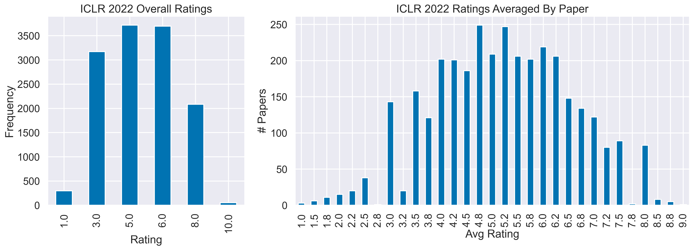

# Crawl and Visualize ICLR 2021 OpenReview Data

    

## Descriptions

This Jupyter Notebook contains the data crawled from ICLR 2021 OpenReview webpages and their visualizations. The list of submissions (sorted by the average ratings) can be found here.

## Prerequisites
* python 3.7
* selenium
* pandas
* seaborn
* imageio
* wordcloud
* tqdm
* [`edgewebdriver`](https://developer.microsoft.com/en-us/microsoft-edge/tools/webdriver/)
  * NOTE: You can also use `chromedriver` by setting `driver = webdriver.Chrome('chromedriver.exe')`.

## Crawl Data
1. Run `crawl_paperlist.py` to crawl the list of papers (~0.5h).
2. Run `crawl_reviews.py` to crawl the reviews (~1.5h).
   * NOTE: currently only review ratings are crawled.

## Visualization

**Keywords Frequency**

The top 50 common keywords (uncased) and their frequency:

    

**Keywords Cloud**

The word clouds formed by keywords of submissions show the hot topics including *deep learning*, *reinforcement learning*, *representation learning*, *graph neural network*, etc.

    

**Ratings Distribution**

The distribution of reviewer ratings centers around 4 (mean: 4.1837).

    

**Keywords vs Ratings**

The average reviewer ratings and the frequency of keywords indicate that to maximize your chance to get higher ratings would be using the keywords such as deep learning theory, or gradient descent.

    

**Top 50 Papers**

|   AvgRating | Title  | Ratings       | Decision   |
|------------:|:----------|:--------------|:-----------|
|        8.25 | [How Neural Networks Extrapolate: From Feedforward to Graph Neural Networks](https://openreview.net/forum?id=UH-cmocLJC)                                | 7, 9, 9, 8    |            |
|        8    | [Score-Based Generative Modeling through Stochastic Differential Equations](https://openreview.net/forum?id=PxTIG12RRHS)                                | 8, 9, 7, 8    |            |
|        8    | [Augmenting Physical Models with Deep Networks for Complex Dynamics Forecasting](https://openreview.net/forum?id=kmG8vRXTFv)                            | 9, 7, 8       |            |
|        8    | [Theoretical Analysis of Self-Training with Deep Networks on Unlabeled Data](https://openreview.net/forum?id=rC8sJ4i6kaH)                               | 9, 7, 9, 7    |            |
|        8    | [What Matters for On-Policy Deep Actor-Critic Methods? A Large-Scale Study](https://openreview.net/forum?id=nIAxjsniDzg)                                | 7, 9, 9, 7    |            |
|        8    | [Deformable DETR: Deformable Transformers for End-to-End Object Detection](https://openreview.net/forum?id=gZ9hCDWe6ke)                                 | 9, 8, 8, 7    |            |
|        8    | [Learning a Latent Simplex in Input Sparsity Time](https://openreview.net/forum?id=04LZCAxMSco)                                                         | 7, 9, 8       |            |
|        7.75 | [Autoregressive Entity Retrieval](https://openreview.net/forum?id=5k8F6UU39V)                                                                           | 7, 8, 8, 8    |            |
|        7.75 | [Share or Not? Learning to Schedule Language-Specific Capacity for Multilingual Translation](https://openreview.net/forum?id=Wj4ODo0uyCF)               | 7, 9, 7, 8    |            |
|        7.75 | [Learning Mesh-Based Simulation with Graph Networks](https://openreview.net/forum?id=roNqYL0_XP)                                                        | 9, 6, 6, 10   |            |
|        7.75 | [Learning Cross-Domain Correspondence for Control with Dynamics Cycle-Consistency](https://openreview.net/forum?id=QIRlze3I6hX)                         | 6, 8, 7, 10   |            |
|        7.67 | [Dataset Condensation with Gradient Matching](https://openreview.net/forum?id=mSAKhLYLSsl)                                                              | 7, 9, 7       |            |
|        7.67 | [Predicting Infectiousness for Proactive Contact Tracing](https://openreview.net/forum?id=lVgB2FUbzuQ)                                                  | 9, 7, 7       |            |
|        7.67 | [Invariant Representations for Reinforcement Learning without Reconstruction](https://openreview.net/forum?id=-2FCwDKRREu)                              | 7, 7, 9       |            |
|        7.6  | [DiffWave: A Versatile Diffusion Model for Audio Synthesis](https://openreview.net/forum?id=a-xFK8Ymz5J)                                                | 7, 7, 9, 8, 7 |            |
|        7.5  | [Learning with feature dependent label noise: a progressive approach](https://openreview.net/forum?id=ZPa2SyGcbwh)                                      | 7, 8, 7, 8    |            |
|        7.5  | [Very Deep VAEs Generalize Autoregressive Models and Can Outperform Them on Images](https://openreview.net/forum?id=RLRXCV6DbEJ)                        | 7, 8, 8, 7    |            |
|        7.5  | [Complex Query Answering with Neural Link Predictors](https://openreview.net/forum?id=Mos9F9kDwkz)                                                      | 9, 6, 6, 9    |            |
|        7.5  | [Deep symbolic regression: Recovering mathematical expressions from data via risk-seeking policy gradients](https://openreview.net/forum?id=m5Qsh0kBQG) | 8, 5, 8, 9    |            |
|        7.5  | [Human-Level Performance in No-Press Diplomacy via Equilibrium Search](https://openreview.net/forum?id=0-uUGPbIjD)                                      | 7, 8, 7, 8    |            |
|        7.5  | [Rethinking the Role of Gradient-based Attribution Methods for Model Interpretability](https://openreview.net/forum?id=dYeAHXnpWJ4)                     | 9, 9, 7, 5    |            |
|        7.5  | [Parrot: Data-Driven Behavioral Priors for Reinforcement Learning](https://openreview.net/forum?id=Ysuv-WOFeKR)                                         | 9, 6, 7, 8    |            |
|        7.5  | [End-to-end Adversarial Text-to-Speech](https://openreview.net/forum?id=rsf1z-JSj87)                                                                    | 7, 8, 7, 8    |            |
|        7.5  | [Learning Flexible Visual Representations via Interactive Gameplay](https://openreview.net/forum?id=UuchYL8wSZo)                                        | 9, 8, 5, 8    |            |
|        7.5  | [Global Convergence of Three-layer Neural Networks in the Mean Field Regime](https://openreview.net/forum?id=KvyxFqZS_D)                                | 9, 7, 7, 7    |            |
|        7.5  | [Winning the L2RPN Challenge: Power Grid Management via Semi-Markov Afterstate Actor-Critic](https://openreview.net/forum?id=LmUJqB1Cz8)                | 7, 7, 7, 9    |            |
|        7.4  | [Optimal Rates for Averaged Stochastic Gradient Descent under Neural Tangent Kernel Regime](https://openreview.net/forum?id=PULSD5qI2N1)                | 6, 8, 8, 8, 7 |            |
|        7.33 | [Evolving Reinforcement Learning Algorithms](https://openreview.net/forum?id=0XXpJ4OtjW)                                                                | 7, 6, 9       |            |
|        7.33 | [Unsupervised Object Keypoint Learning using Local Spatial Predictability](https://openreview.net/forum?id=GJwMHetHc73)                                 | 6, 7, 9       |            |
|        7.33 | [RMSprop can converge with proper hyper-parameter](https://openreview.net/forum?id=3UDSdyIcBDA)                                                         | 8, 8, 6       |            |
|        7.33 | [EigenGame: PCA as a Nash Equilibrium](https://openreview.net/forum?id=NzTU59SYbNq)                                                                     | 7, 8, 7       |            |
|        7.33 | [Geometry-aware Instance-reweighted Adversarial Training](https://openreview.net/forum?id=iAX0l6Cz8ub)                                                  | 6, 8, 8       |            |
|        7.33 | [Image GANs meet Differentiable Rendering for Inverse Graphics and Interpretable 3D Neural Rendering](https://openreview.net/forum?id=yWkP7JuHX1)       | 8, 8, 6       |            |
|        7.33 | [When Do Curricula Work?](https://openreview.net/forum?id=tW4QEInpni)                                                                                   | 7, 8, 7       |            |
|        7.33 | [Distributional Sliced-Wasserstein and Applications to Generative Modeling](https://openreview.net/forum?id=QYjO70ACDK)                                 | 9, 7, 6       |            |
|        7.33 | [Neural Synthesis of Binaural Audio](https://openreview.net/forum?id=uAX8q61EVRu)                                                                       | 7, 9, 6       |            |
|        7.33 | [Scalable Learning and MAP Inference for Nonsymmetric Determinantal Point Processes](https://openreview.net/forum?id=HajQFbx_yB)                        | 9, 7, 6       |            |
|        7.25 | [PMI-Masking: Principled masking of correlated spans](https://openreview.net/forum?id=3Aoft6NWFej)                                                      | 8, 6, 7, 8    |            |
|        7.25 | [Rethinking Attention with Performers](https://openreview.net/forum?id=Ua6zuk0WRH)                                                                      | 7, 7, 8, 7    |            |
|        7.25 | [Locally Free Weight sharing for Network Width Search](https://openreview.net/forum?id=S0UdquAnr9k)                                                     | 7, 8, 6, 8    |            |
|        7.25 | [Learning from Protein Structure with Geometric Vector Perceptrons](https://openreview.net/forum?id=1YLJDvSx6J4)                                        | 6, 6, 10, 7   |            |
|        7.25 | [Minimum Width for Universal Approximation](https://openreview.net/forum?id=O-XJwyoIF-k)                                                                | 7, 7, 7, 8    |            |
|        7.25 | [PlasticineLab: A Soft-Body Manipulation Benchmark with Differentiable Physics](https://openreview.net/forum?id=xCcdBRQEDW)                             | 6, 7, 7, 9    |            |
|        7.25 | [Improving Adversarial Robustness via Channel-wise Activation Suppressing](https://openreview.net/forum?id=zQTezqCCtNx)                                 | 7, 8, 7, 7    |            |
|        7.25 | [Conditional Generative Modeling via Learning the Latent Space](https://openreview.net/forum?id=VJnrYcnRc6)                                             | 6, 6, 10, 7   |            |
|        7.25 | [Expressive Power of Invariant and Equivariant Graph Neural Networks](https://openreview.net/forum?id=lxHgXYN4bwl)                                      | 8, 7, 5, 9    |            |
|        7    | [Linear Convergent Decentralized Optimization with Compression](https://openreview.net/forum?id=84gjULz1t5)                                             | 7, 7, 7       |            |
|        7    | [An Image is Worth 16x16 Words: Transformers for Image Recognition at Scale](https://openreview.net/forum?id=YicbFdNTTy)                                | 7, 7, 7, 7    |            |
|        7    | [Spatio-Temporal Graph Scattering Transform](https://openreview.net/forum?id=CF-ZIuSMXRz)                                                               | 6, 9, 7, 6    |            |
|        7    | [On the mapping between Hopfield networks and Restricted Boltzmann Machines](https://openreview.net/forum?id=RGJbergVIoO)                               | 10, 7, 4      |            |

## Acknowledgment

Visualizations are inspired by this repo: https://github.com/shaohua0116/ICLR2020-OpenReviewData.
